# 算法设计与分析


# I. 算法分析的方法


## 1 Notations 渐进表示

### $\Omicron$ - 上界 upper bound、最坏运行时间 worst case

定义：

$\Omicron(g(n)) = \{f(n): \text{There exist positive constants } c \text{ and } n_0 \text{ such that } 0 ≤ f(n) ≤ cg(n) \text{ for all } n ≥ n_0 \}$

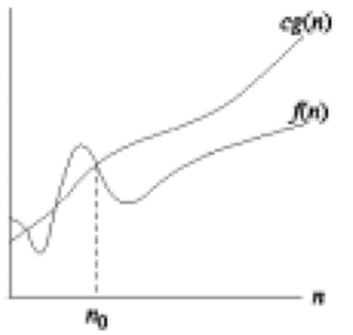

例子：

- $\frac{1}{3}n^2 - 3n \in \Omicron(n^2)$ 

  > because $\color{green}{\frac{1}{3}n^2 - 3n \leq cn^2}$ if $\color{green}{c \geq \frac{1}{3} - \frac{3}{n}}$ which holds for $\color{green}{c = \frac{1}{3}}$ and $\color{green}{n > 1}$

- $k_1n^2 + k_2n + k_3 \in \Omicron(n^2)$

  > because $\color{green}{k_1n^2 + k_2n + k_3 \leq (|k_1| + |k_2| + |k_3|)n^2}$ and for $\color{green}{c > k_1}$, $\color{green}{|k_2| + |k_3|}$ and $\color{green}{n \geq 1}$, $\color{green}{k_1n^2 + k_2n + k_3 \leq cn^2}$

- $k_1n^2 + k_2n + k_3 \in \Omicron(n^3)$

  > as $\color{green}{k_1n^2 + k_2n + k_3 \leq (|k_1| + |k_2| + |k_3|)n^3}$ (upper bound)


### $\Omega$ - 下界 lower bound、最快运行时间 best case

定义：

$\Omega(g(n)) = \{f(n): \text{There exist positive constants } c \text{ and } n_0 \text{ such that } 0 ≤ cg(n) ≤ f(n) \text{ for all } n ≥ n_0 \}$

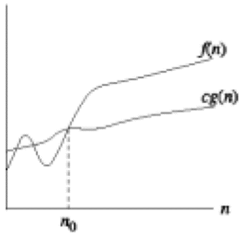

例子：

- $\frac{1}{3}n^2 - 3n \in \Omega(n^2)$ 

  > because $\color{green}{\frac{1}{3}n^2 - 3n \leq cn^2}$ if $\color{green}{c \leq \frac{1}{3} - \frac{3}{n}}$ which holds for $\color{green}{c = \frac{1}{6}}$ and $\color{green}{n > 18}$ 

- $k_1n^2 + k_2n + k_3 \in \Omega(n^2)$ 

- $k_1n^2 + k_2n + k_3 \in \Omega(n)$ (lower bound)

### $\Theta$ - 确界 tight bound、平均运行时间

定义：

$\Theta(g(n)) = \{f(n): \text{There exist positive constants } c \text{ and } n_0 \text{ such that } 0 ≤ c_1g(n) ≤ f(n) ≤ c_2g(n) \text{ for all } n ≥ n_0 \}$

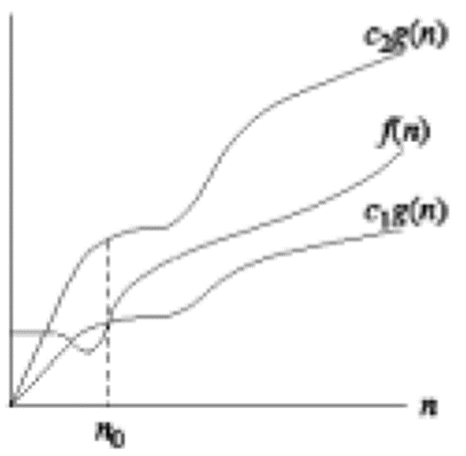

> $f(n)=\Theta(g(n))$ 当且仅当 $f(n)=\Omicron(g(n))$ 和 $f(n)=\Omega(g(n))$

例子：

- $k_1n^2 + k_2n + k_3 \in \Theta(n^2)$

- $6n\lg{n} + \sqrt{n}\lg^2{n} = \Theta(n\lg{n})$

  > We need to find $\color{green}{c_1, c_2, n_0 > 0}$ such that $\color{green}{c_1n\lg n \leq 6n\lg n + \sqrt{n}\lg^2{n} \leq c_2n\lg{n}}$ for $\color{green}{n \geq n_0}$.  
  >
  > $\color{green}{c_1n\lg n \leq 6n\lg n + \sqrt{n}\lg^2{n}}$ $\Rightarrow$ $\color{green}{ c_1 \leq 6 + \frac{\lg n}{\sqrt{n}}}$, which is true if we choose $\color{blue}{c_1 = 6}$ and $\color{blue}{n_0 = 1}$. 
  >
  > $\color{green}{6n\lg n + \sqrt{n}\lg^2{n} \leq c_2n\lg n}$ $\Rightarrow$ $\color{green}{6 + \frac{\lg n}{\sqrt{n}} \leq c_2}$ which is true if we choose $\color{blue}{c_2 = 7}$ and $\color{blue}{n_0 = 2}$. 
  >
  > This is because  $$\color{red}{\lg n \leq \sqrt{n}}$$ if $\color{blue}{n \geq 2}$. 
  >
  > So $\color{blue}c_1 = 6$, $\color{blue}c_2 = 7$ and $\color{blue}n_0 = 2$ works.

### 综合

#### $\Omicron$、$\Theta$ 和 $\Omega$ 

- $f(n) = \Omicron(g(n)) \Leftrightarrow f(n) \leqslant g(n)$

- $f(n) = \Theta(g(n)) \Leftrightarrow f(n) = g(n)$

- $f(n) = \Omega(g(n)) \Leftrightarrow f(n) \geqslant g(n)$

#### 等式中的渐进表示

Used to **replace** functions of lower-order terms to simplify equations/expressions.

例子：

$ 4n^3 + 3n^2 + 2n + 1 = 4n^3 + 3n^2 + \Theta(n) = 4n^3 + \Theta(n^2) = \Theta(n^3) $

或者

$ 4n^3 + 3n^2 + 2n + 1 = 4n^3 + f(n^2) $

这里是用 $f{n^2}$ 简化了等式


## 2 计算时间递归式求解

### 替换法

- **Guess** the form of the solution
- **Verify** by induction
- **Solve** for constants

### 递归树法

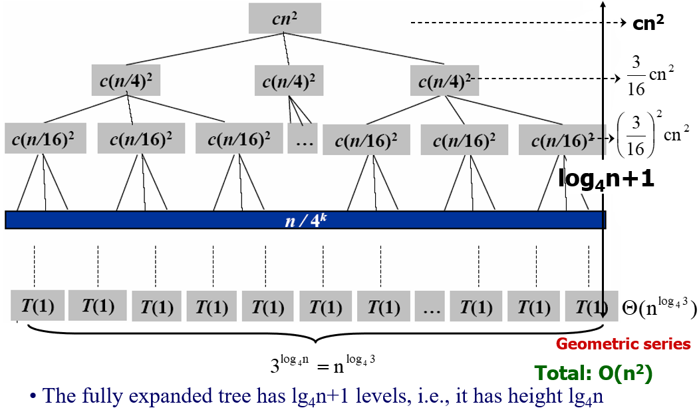

### 主方法

$$
T(n) = aT(\dfrac{n}{b}) + f(n)
$$

$a \geqslant 1$ ，$b > 1$ 为常数，$T(n)$ 是渐进正函数

#### 3种情况

1. **情况一：**如果 $f(n) = O(n^{\log_b a - \epsilon})$，其中 $\epsilon > 0$，则 $T(n) = \Theta(n^{\log_b a})$。

   > $f(n)$ grows polynomially slower than $n^{\lg_b a}$ (by an $n^ε$ factor)

2. **情况二：**如果 $f(n) = \Theta(n^{\log_b a} \lg^k n)$（这里 $k \geq 0$），则 $T(n) = \Theta(n^{\log_b a} \lg^{k+1} n)$。

   > $f(n)$ and $n\log_b a$ grow at similar rates

3. **情况三：**如果 $f(n) = \Omega(n^{\log_b a + \epsilon})$，其中 $\epsilon > 0$，并且满足正则性条件 $a f(n/b) \leq c f(n)$ 对于某个常数 $c < 1$ 和所有足够大的 $n$，则 $T(n) = \Theta(f(n))$。

   > $f(n)$ grows polynomially faster than $n^{\lg_b a}$ (by an $n^ε $ factor)

#### 例子

<details>
<summary>示例</summary>
    
</details>


# II. 分治/规模压缩策略的引入与应用


## 1 分治策略的一般方法 - 分、治、合并

- To solve P:
  - **分 Divide** P into smaller problems P1, P2, …, Pk.
  - **治 Conquer** by solving the (smaller) subproblems ==**recursively**==.
  - **合并 Combine** the solutions to P1, P2, …, Pk into the solution for P.


## 2 分治策略的算法分析

- $T(n)$: the running time on a problem of size n
- $D(n)$：the time to divide the problem into subproblems
- $C(n)$：the time to combine the solutions to subproblems into the solution to the original problem

将原问题分为 $a$ 个子问题，每个子问题大小是原问题的 $\dfrac{1}{b}$.
$$
T(n) = \begin{cases} 
\Theta(1) & \text{if } n \leq c \\
aT\left(\frac{n}{b}\right) + D(n) + C(n) & \text{otherwise}
\end{cases}
$$


## 3 分治策略的应用 —— 渐进比较排序算法

### a. 插入排序

#### 算法伪代码

<details>
    <summary>插入排序伪代码</summary>
    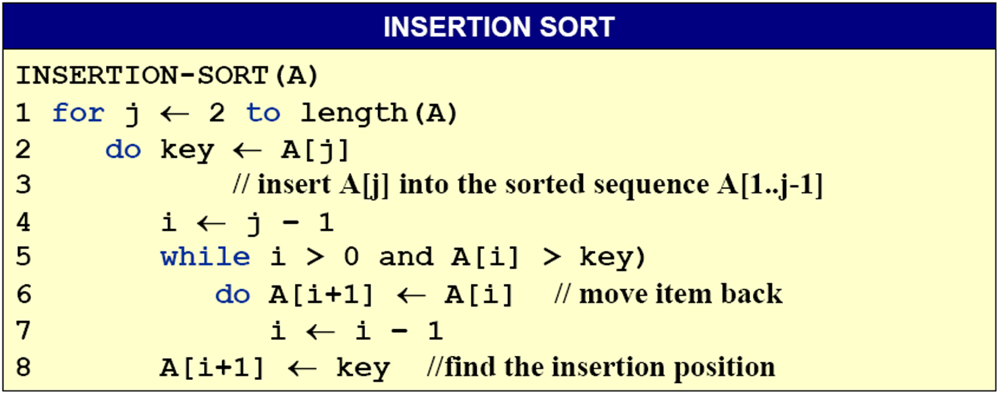
</details>

#### 算法分析

- best case：$\Omega(n)$ - 顺序
- worst case：$\Omicron(n^2)$ - 逆序

> 也可以说最坏运行时间为 $\Omega(n^2)$

### b. 归并排序

#### 分治视角下的算法

- **Divide**: Divide the n elements into two subsequences of n/2 elements each.
- **Conquer**: Sort the two subsequences recursively.
- **Combine**: Merge the two sorted subsequences to produce the sorted answer.

#### 算法伪代码

- **INPUT:** a sequence of n numbers stored in array A

- **OUTPUT:** an ordered sequence of n numbers 


**MERGE-SORT**

```assembly
MERGE-SORT(A, p, r):
    if p < r
    then
    	q ← ⌊(p + r)/2⌋
        MERGE-SORT(A, p, q)
        MERGE-SORT(A, q + 1, r)
        MERGE(A, p, q, r)
```

**MERGE**

<details>
    <summary>MERGE伪代码</summary>
    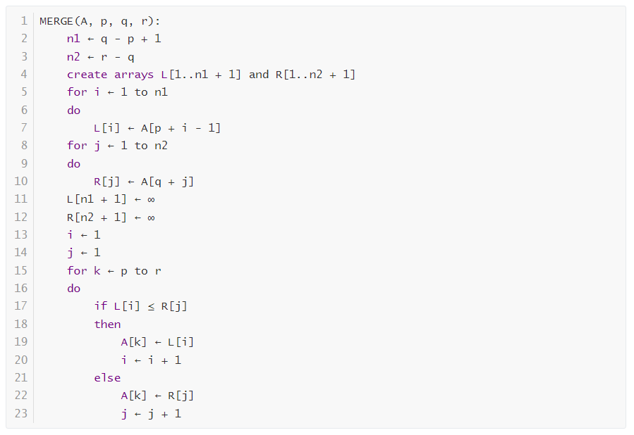
</details>

#### 算法分析

- 瓶颈：merging (and copying)，合并两个 $\frac{n}{2}$ 的数组要比较 $n$ 次

$$
T(n) = \begin{cases} 
\Theta(1) & \text{if } n = 1 \\
2T\left(\frac{n}{2}\right) + \Theta(n) & \text{otherwise}
\end{cases}
$$

The recursion case `2T(n/2)` refers to **sorting both halves** of the array, and `Θ(n)` represents the **merging** process.

- <u>时间复杂度：</u>
  $$
  T(n) = n \log {n}
  $$
  
  <u>稳定的，即使已经顺序</u>

<details>
<summary>证明</summary>
	递归树法【不考察】
    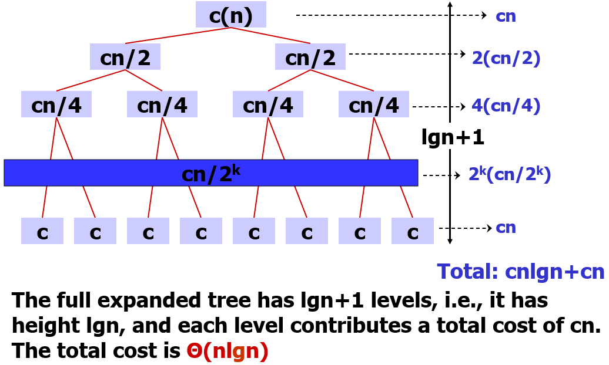
</details>

### c. 堆排序

#### 堆

- 数据结构由1, 2, …, n整数索引，根节点是`A[1]`
- `PARENT(i) = ⌊i/2⌋`, `LEFT(i) = 2i`, `RIGHT(i) = 2i + 1`
- 最大堆：`A[PARENT(i)] ≥ A[i]`
- 最小堆：`A[PARENT(i)] ≤ A[i]`
- 堆的高度 = 最大堆：`⌊lgn⌋`
- 堆排序：要对数组进行排序，我们可以首先将其转换为最大堆，重复提取根（定义中的最大元素）并对其余部分进行 `MAX-HEAPIFY`。

#### 堆操作 

> 关于堆的考察重点，二分思想

**MAX-HEAPIFY**

<details>
    <summary>MAX-HEAPIFY伪代码</summary>
    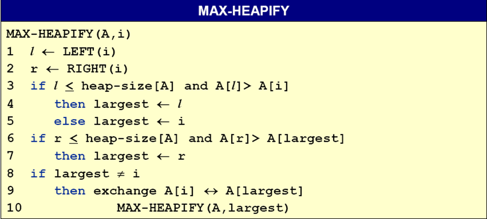
    <code>heap-size[A]</code> keeps track of the size of the heap stored in the array <code>A</code>.
</details>

<u>时间复杂度：$\Omicron(h)$，$h$ 是元素 `A[i]` 的高度</u>

**BUILD-MAX-HEAP**

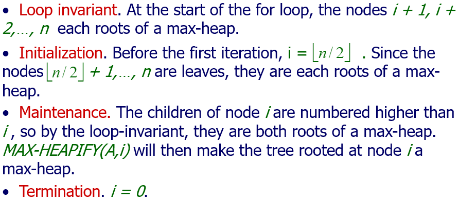

建堆伪代码：

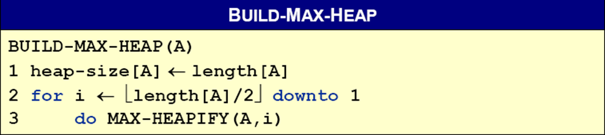

<u>时间复杂度：$\Omicron(n)$</u>

<details>
<summary>证明</summary>
    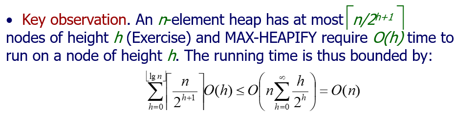
</details>

#### 排序算法伪代码

<details>
    <summary>堆排序算法</summary>
    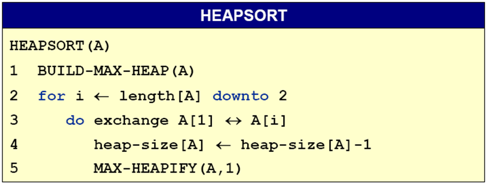
</details>

<u>时间复杂度：$\Omicron(n\lg{n})$，In-place，不稳定</u>

#### 优先队列

优先级队列：用于维护一组 S 元素的数据结构，每个元素都有一个称为键的关联值。

基于最大堆实现最大优先队列

##### 应用

- 最大优先队列
  - 电脑的任务调度
  - 堆排序
- 最小优先队列
  - Dijkstra 最短路径算法
  - Prim 最小生成树算法
  - 事件驱动模拟
  - 哈夫曼编码

##### 算法伪代码

**HEAP-EXTRACT-MAX**

<details>
    <summary>HEAP-EXTRACT-MAX伪代码</summary>
    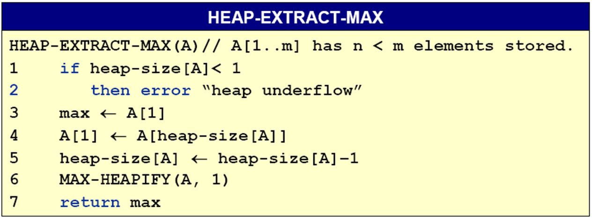
</details>

运行时间：$\Omicron(\log{n})$

**HEAP-INCREASE-KEY**

<details>
    <summary>HEAP-INCREASE-KEY伪代码</summary>
    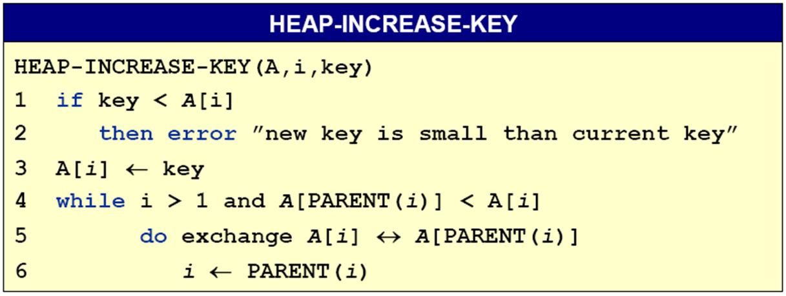
</details>

运行时间：$\Omicron(\log{n})$

**HEAP-INCERT**

<details>
    <summary>HEAP-INSERT伪代码</summary>
    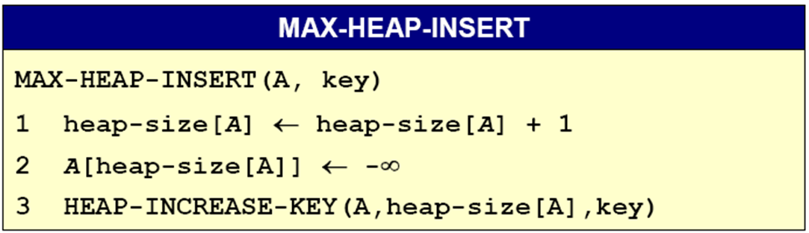
</details>

运行时间：$\Omicron(\log{n})$

### d. 快速排序

#### 分治视角下的算法

- **Divide**: Partition the array into two subarrays around a pivot x such that <u>elements in lower subarray</u> ≤ x ≤ <u>elements in upper subarray</u> 
- **Conquer**: Recursively sort the subarrays.
- **Combine**: Trivial.

**关键**：Linear-time partitioning subroutine.

#### 算法伪代码

**QUICKSORT**

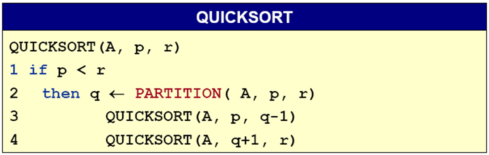

**PARTITION**

> 不考察partition的伪代码

<details>
<summary> PARTITION 伪代码 </summary>
    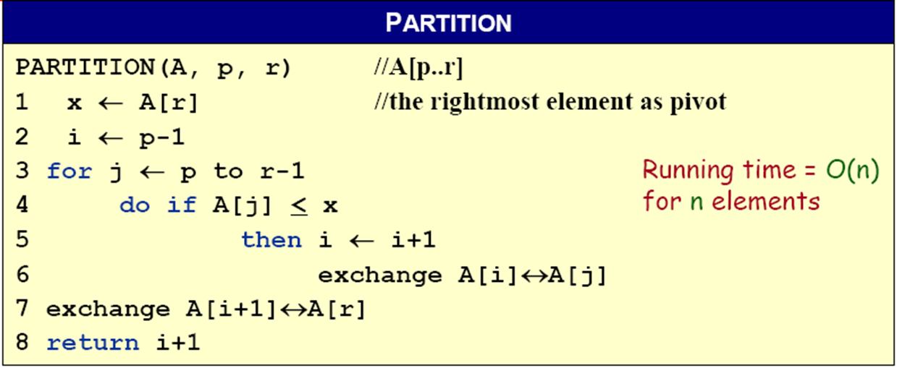
</details>

PARTITION考察根据给定的pivot写出排序结果：

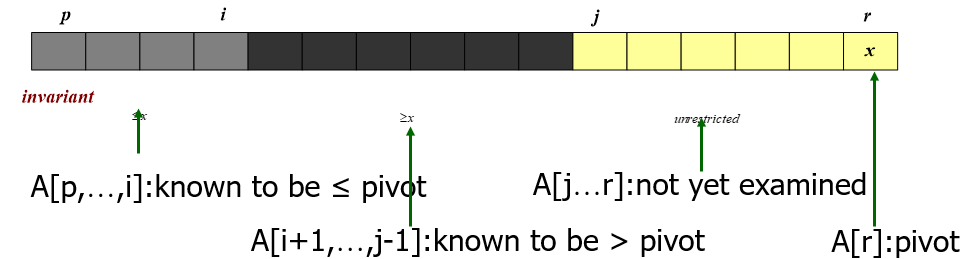

<details>
    <summary>PARTITION例子</summary>
    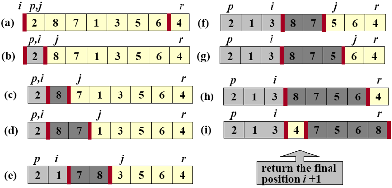
</details>

#### 算法分析

##### 快排的最坏情况

- Input sorted or reverse sorted.
- Partition around min or max element.
- One side of partition always has no elements.

$$
T(n) = T(n-1) + T(0) + \Theta(n) = \Theta(n^2)
$$

<details>
<summary>递归树</summary>
    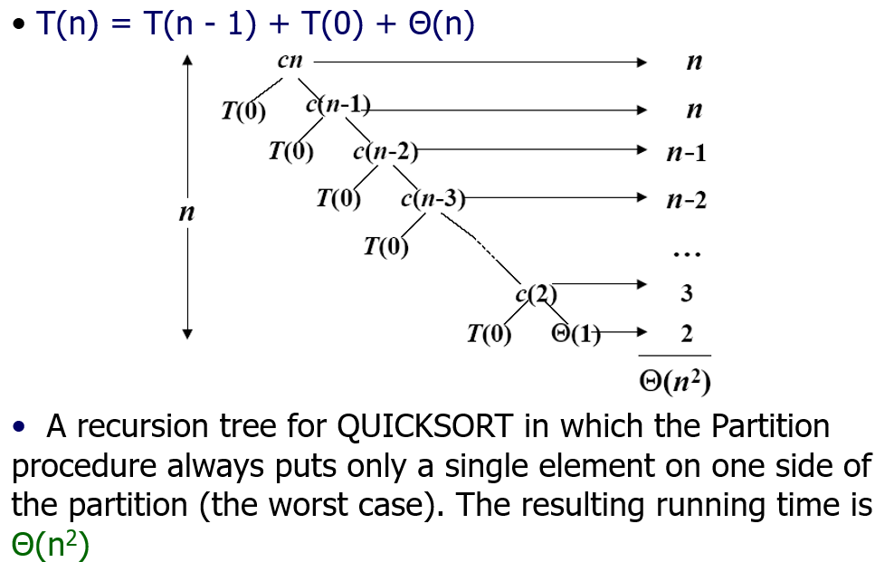
</details>

##### 快排的最好情况

- PARTITION splits the array **evenly**

$$
T(n) = 2T(n/2) + \Theta(n) = \Theta(n\log{n})
$$

<details>
<summary>递归树</summary>
    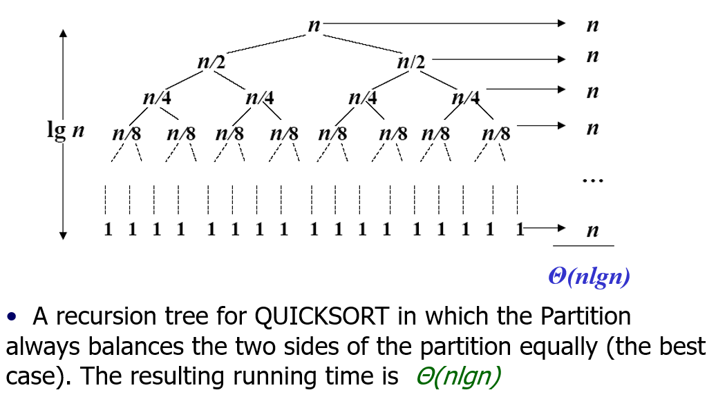
</details>

#### 随机策略

> 这里的随机策略很简单，随便选一个数即可

Partition around a **random** element, i.e., around $\textcolor{green}{A[t]}$, where $\textcolor{green}{t}$ chosen uniformly at random from $\textcolor{green}{\{p…r\}*}$

<details>
    <summary>RANDOM-PARTITION伪代码</summary>
    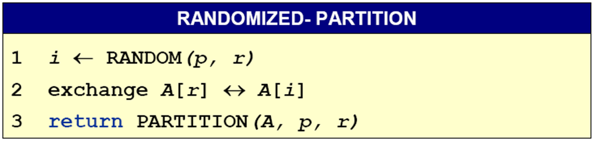
</details>

<details>
    <summary>RANDOM-QUICKSORT伪代码</summary>
    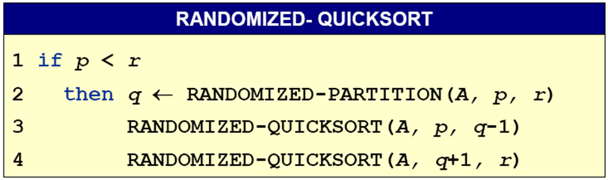
</details>

期望时间：$\Omicron(n\lg{n})$

### 基于比较排序的时间下界

#### 决策（判定）树模型

> 几乎不考察

<details>
    <summary>决策树模型</summary>
    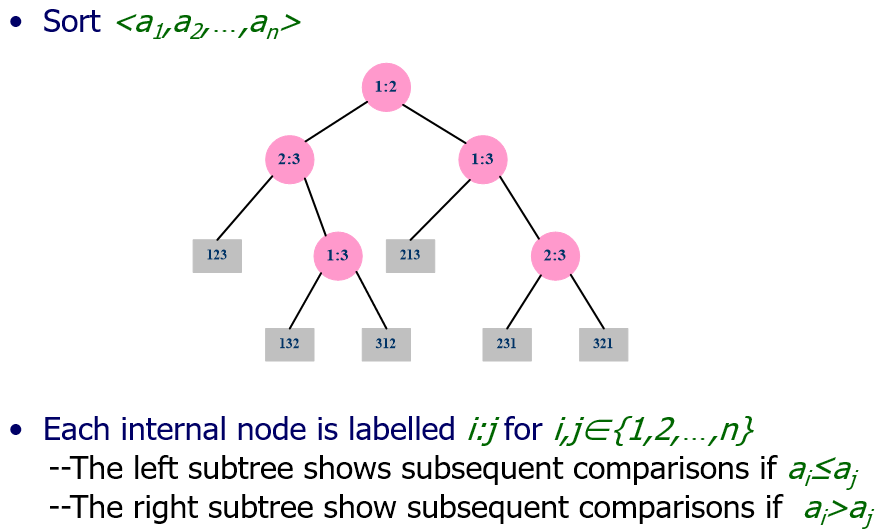
</details>

决策（判定）树模型模拟**比较排序算法**：

- 算法运行时间 = 判定结果的路径长度
- 最坏情况运行时间（运行时间下界）= 树的高度

#### 结论

**理论：**

==<u>**最坏情况下（时间下界），任何比较排序算法 都需要 $\Omega(n\lg{n})$ 的比较**</u>==

<details>
    <summary>证明</summary>
    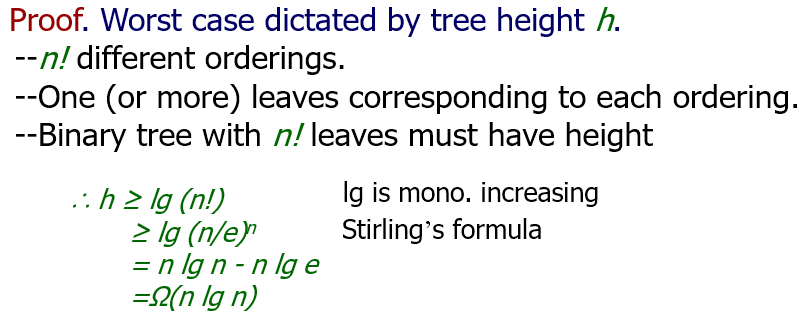
</details>

**推论：**

==**<u>归并排序和堆排序是渐进比较排序算法中最优的</u>**==


## 4 分治策略的应用 —— 线性时间排序算法

> 不是本课程主线，知道应用场合即可

### a. 计数排序

<details>
    <summary>算法伪代码</summary>
    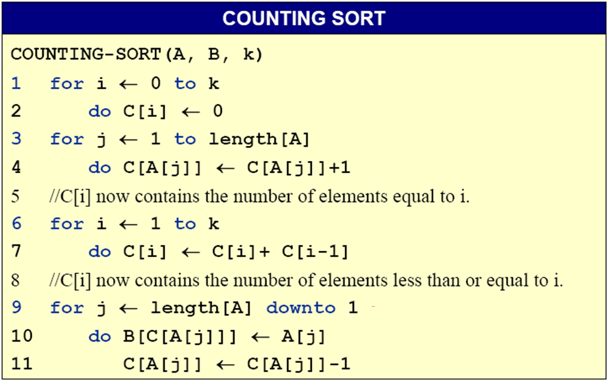
</details>

<u>运行时间：$\Theta(k+n)$，稳定的</u>

应用场景：小范围内的整数排序

### b.基数排序

<details>
    <summary>算法伪代码</summary>
    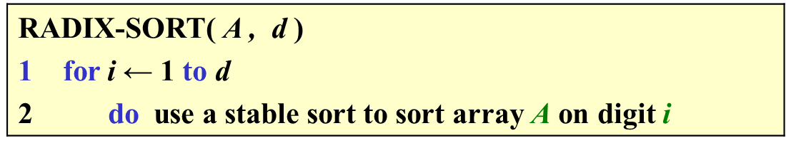
</details>

<u>运行时间：$\Theta(dT(n))$，如果使用计数排序且d为常数，$\Theta(n)$</u>

*LSD*: sorting numbers on their Least Significant Digit first.

应用场合：数值范围有限且数据长度相对均匀的大量数据排序

### c. 桶排序

<details>
    <summary>算法伪代码</summary>
    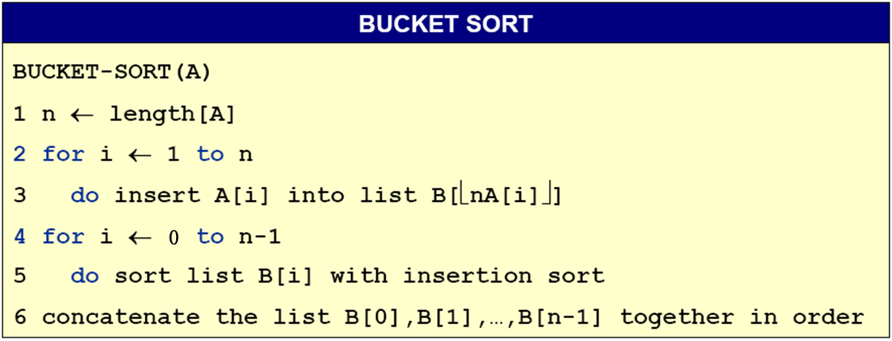
</details>

<u>运行时间：$\Theta(n)+\sum_{i=0}^{n-1}\Omicron(n_i^2)$，均匀分布时，$\Theta(n)$</u> 

应用场景：某区间内**均匀分布**的小数排序


## 5 分治策略的应用 —— 其他算法

### 排位统计/select

#### 随机选择算法

- 问题描述：找出n个元素集合中第 i 小的元素

- 随机选择 —— 二分算法（分治）
  - 核心思想：**PARTITION**
    - If i < k, recurse on the left
    - If i > k. recurse on the right
    - Otherwise, output x

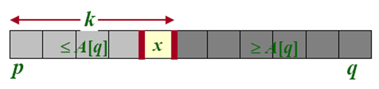

#### 算法伪代码

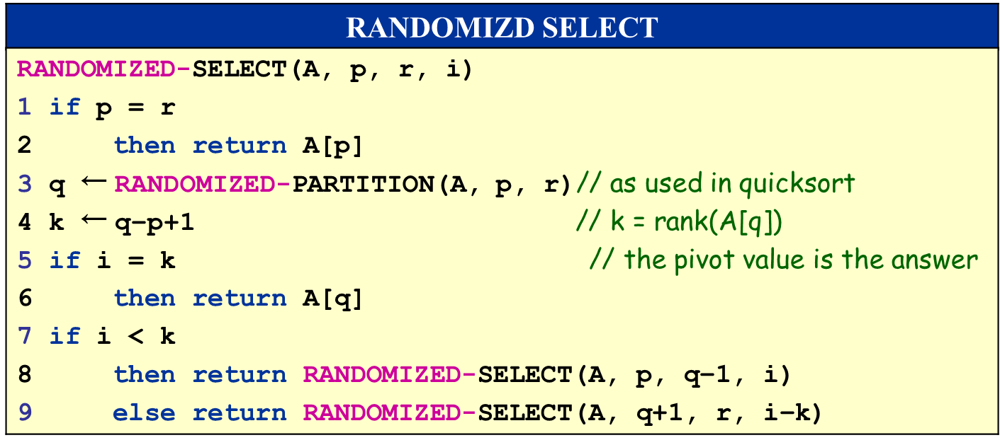

#### 算法分析

- 最坏情况运行时间：
  $$
  T(n) = T(n-1) + \Theta(n) = \Theta(n^2)
  $$
  
- 最好情况运行时间：
  $$
  T(n) = \Theta(n)
  $$
  <u>期望时间：线性时间完成</u>

### 最大子数组（二分方法）

> 分治/规模压缩用到优化问题上

#### 求解最大子数组的分治算法

- **Divide & Conquer**

  - **Divide**: Divide the array $\textcolor{green}{A[low..high]}$ into two subarrays of $n/2$ elements, $\textcolor{green}{A[low..mid]}$ and $\textcolor{green}{A[mid+1..high]}$.

  - **Conquer**: Find the maximum subarray recursively.

  - **Combine**: Select a subarray with the largest sum of the ***sub-problems***.

- **Sub-problems**

  Any contiguous subarray $\textcolor{green}{A[i..j]}$ of $\textcolor{green}{A[low..high]}$ must lie in exactly one of the following places: 

  - entirely in the subarray $\textcolor{green}{A[low..mid]}$ , so that $\textcolor{green}{low ≤ i ≤ j ≤ mid}$
  - entirely in the subarray $\textcolor{green}{A[mid+1..high]}$ , so that $\textcolor{green}{mid < i ≤ j ≤ high}$
  - or crossing the ***midpoint***, so that $\textcolor{green}{low ≤ i ≤ mid < j ≤ high}$. 

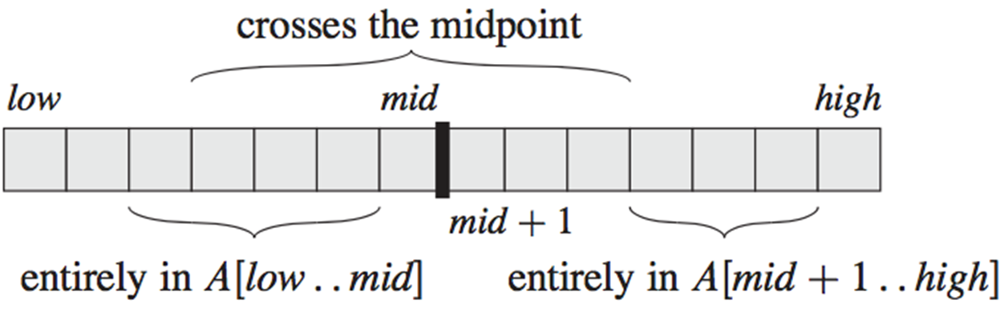

<details>
    <summary>示例</summary>
    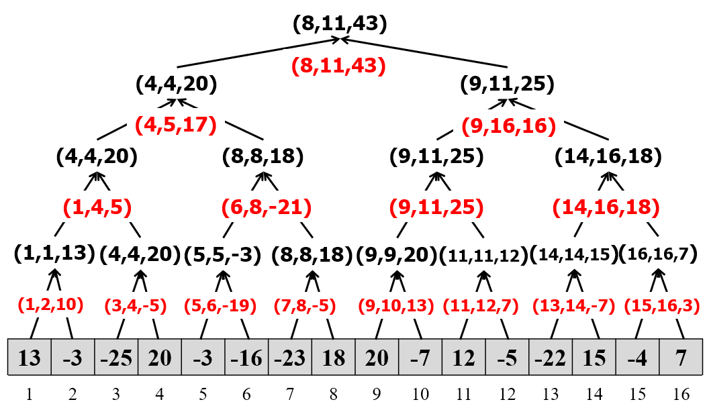
</details>

#### 算法伪代码

##### 暴力求解算法

<details>
    <summary>暴力求解算法伪代码</summary>
    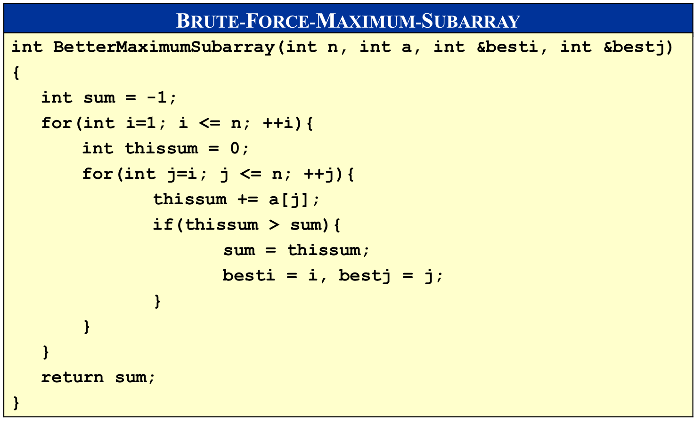
</details>

<u>时间复杂度：$\Theta(n^2)$</u>

##### 分治算法

<details>
    <summary>分治算法伪代码</summary>
    <p>
        跨中间最大子数组算法
        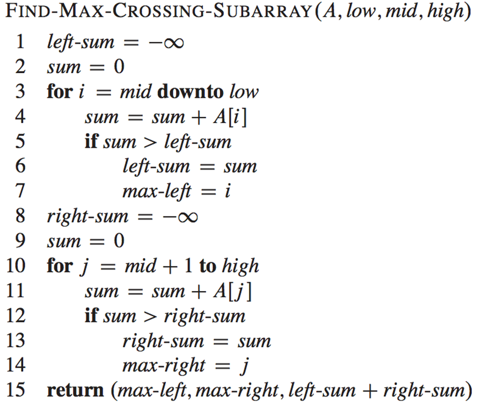
        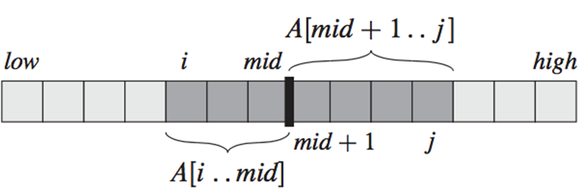
    </p>
    <p>
        最大子数组算法
        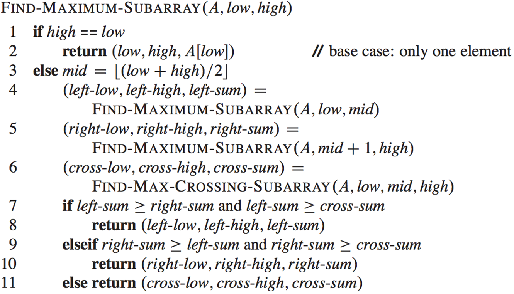
    </p>
</details>

<u>时间复杂度：$\Theta(n\lg{n})$</u>

> 其实不乐意使用这种二分方法求解这类问题，因为对新问题（与子问题不同）需要打补丁，但是新问题无法递归
>
> 这道题可以找到解决新问题的高效方法，但是其他问题同样找到这样的解决办法的概率不高


# III. 排序算法算法分析总结

| Algorithm |     Worst case      |     Best case     |   Average case    |       Stable       |      In-place      |
| :-------: | :-----------------: | :---------------: | :---------------: | :----------------: | :----------------: |
| 插入排序  |   $\Omicron(n^2)$   |    $\Omega(n)$    |   $\Theta(n^2)$   | :white_check_mark: | :white_check_mark: |
| 冒泡排序  |   $\Omicron(n^2)$   |    $\Omega(n)$    |   $\Theta(n^2)$   | :white_check_mark: | :white_check_mark: |
| 归并排序  | $\Omicron(n\lg{n})$ | $\Omega(n\lg{n})$ | $\Theta(n\lg{n})$ | :white_check_mark: |        :x:         |
|  堆排序   | $\Omicron(n\lg{n})$ | $\Omega(n\lg{n})$ | $\Theta(n\lg{n})$ |        :x:         | :white_check_mark: |
| 快速排序  |   $\Omicron(n^2)$   | $\Omega(n\lg{n})$ | $\Theta(n\lg{n})$ |        :x:         | :white_check_mark: |
| 计数排序  |   $\Omicron(n+k)$   |   $\Omega(n+k)$   |   $\Theta(n+k)$   | :white_check_mark: |        :x:         |
| 基数排序  | $\Omicron(d(n+k))$  | $\Omega(d(n+k))$  | $\Theta(d(n+k))$  | :white_check_mark: |        :x:         |
|  桶排序   |    $\Omicron(n)$    |    $\Omega(n)$    |    $\Theta(n)$    | :white_check_mark: |        :x:         |


# IV. 动态规划策略及应用


## 1 动态规划策略

### 动态规划的一般方法（4个步骤）

1. 刻画最优解的结构
2. 递归定义最优解的值
3. 以自下而上的方式计算解决方案的价值（也可以是备忘录）
4. 使用计算过的信息构建最优解

### DP算法的要素

#### 1. 最优子结构

- <u>问题的最优解包含子问题的最优解</u>

- 最优子结构在不同问题中的两种变化方式
  - 原问题的最优解使用了多少个子问题
  - 在确定最佳解决方案中使用哪些子问题时，有多少种选择

> 最优子结构并不适用于所有优化问题。
>
> 例如：最长路径问题

#### 2. 重叠子问题

例如，矩阵链乘问题中，可以用递归算法解决。递归过程中，有大量重复的计算，即存在重叠子问题。

<details>
    <summary>矩阵链乘的递归实现例子</summary>
    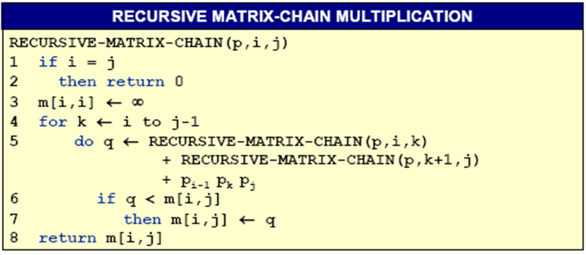
    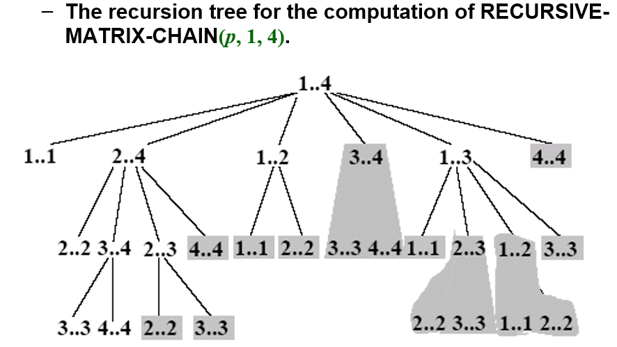
</details>
#### 3. 备忘录

- 记录自然但低效的递归算法

- 记忆递归算法在表中维护每个子问题的解决方案的条目
- 包含初始的特殊值

### 自下而上 & 备忘录

<details>
    <summary><b>自下而上 vs 自顶向下递归</b></summary>
    <ul>
        <li>自下而上更加高效</li>
        <ul>
            <li>利用表访问常规模式来减少时间或空间</li>
            <li>利用了重叠子问题的特性</li>
        </ul>
        <li>自顶向下递归</li>
        <ul>
            <li>重复解决子问题</li>
            <li>递归开销</li>
            <li>仅当子问题总数很小时有效</li>
        </ul>
    </ul>
</details>

#### 自顶向下备忘录 vs 自下而上

- **自下而上**

  - 所有子问题都必须解决

  - 可以利用表访问的常规模式来减少时间或空间

- **自顶向下 + 备忘录**
  - 只解决肯定需要的子问题
  - 递归开销

- 两种方法都解决了 $O(n^3)$ 的矩阵链乘法问题，并利用了重叠子问题的性质。


## 2 装配线调度问题

### 问题描述

<details>
    <summary>问题描述</summary>
    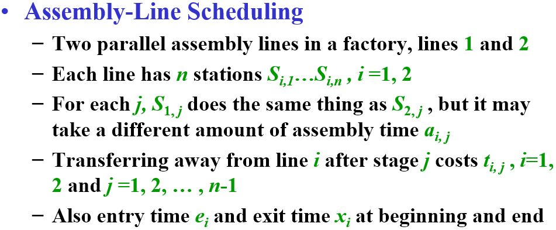
    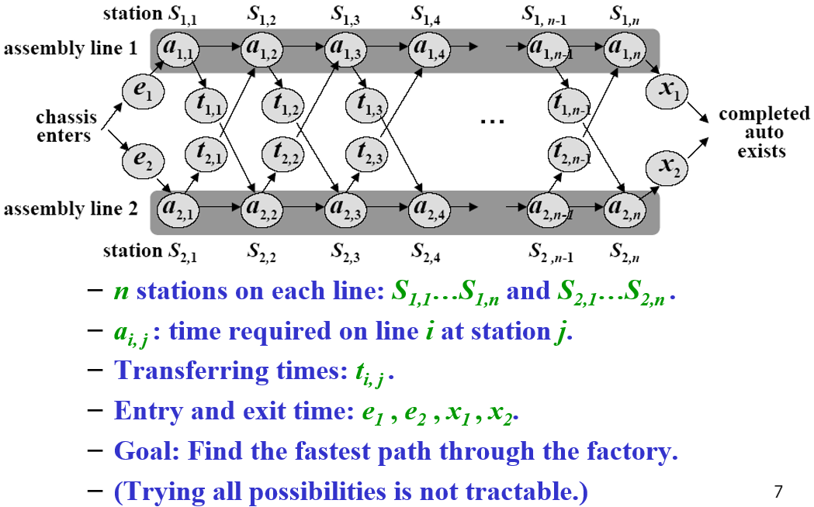
</details>

### 算法设计

- 最优解的性质：考虑离开站点 $S_{1,j}$ 的最快方式

  - 如果 `j=1`，只有一条路
  - 如果 `j≥2`，为了离开站点 `j` ，有两条选择：
    1. 通过站点 $S_{1,j-1}$
    2. 通过站点 $S_{2,j-1}$ 然后到 $S_{1,j}$

- 最优子结构：问题的最优解（通过 $S_{1,j}$ 的最快方式）包含子问题的最优解（通过 $S_{1,j-1}$ 或 $S_{2,j-1}$ 的最快方式）

- 递归定义公式：

  $f_i[j]$ 代表通过站点 $S_{i,j}$ 最快的可能时间
  $$
  f_1[j] = 
  \begin{cases} 
  e_1 + a_{1,1} & \text{if } j = 1 \\
  \min(f_1[j-1] + a_{1,j}, f_2[j-1] + t_{2,j-1} + a_{2,j}) & \text{if } j \geq 2 
  \end{cases}
  $$

  $$
  f_2[j] = 
  \begin{cases} 
  e_2 + a_{2,1} & \text{if } j = 1 \\
  \min(f_2[j-1] + a_{2,j}, f_1[j-1] + t_{1,j-1} + a_{1,j}) & \text{if } j \geq 2 
  \end{cases}
  $$

- 总时间：
  $$
  f^* = \min(f_1[n] + x_1, f_2[n] + x_2)
  $$

### 算法伪代码

<details>
    <summary>伪代码</summary>
    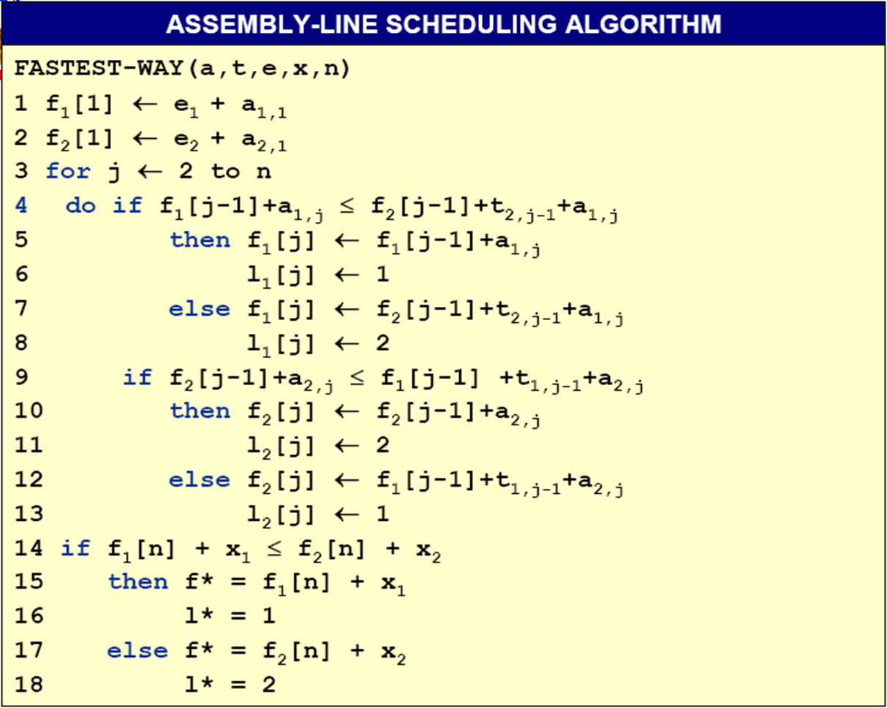
</details>

<u>时间复杂度：$\Theta(n)$</u>


## 3 矩阵链乘

### 问题描述

<details>
    <summary>问题描述</summary>
    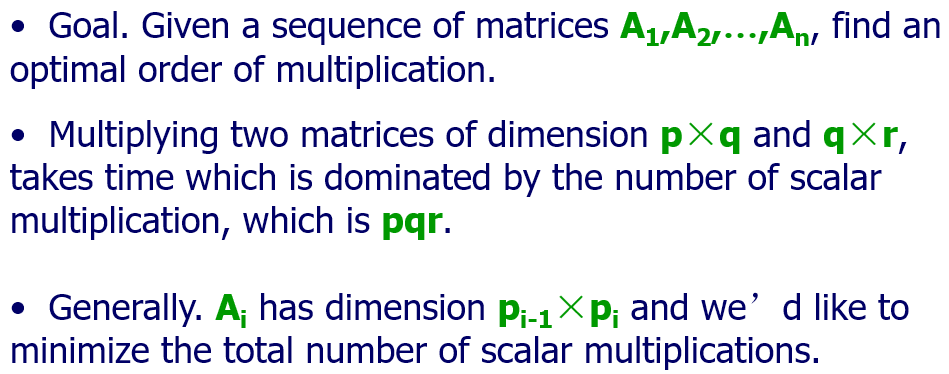
    <p>
        例子：
        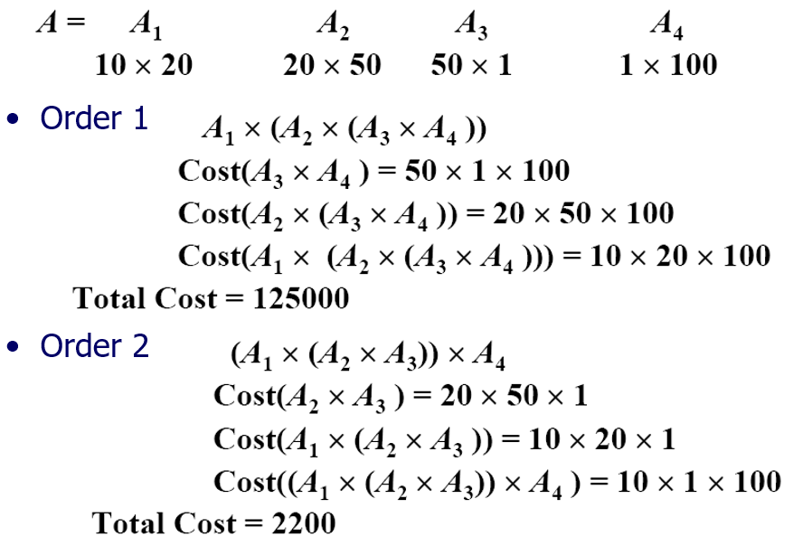
    </p>
</details>

### 算法设计

- 最优子结构

  - $A_{i..j}$ 的任何括号（其中 i < j）必须分成 $A_{i..k}$ 和 $A_{k+1..j}$ 形式的两个乘积。
  - 如果最优括号将乘积分割为 $A_{i..k}$ 和 $A_{k+1..j}$，则 $A_{i..k}$ 和 $A_{k+1..j}$ 内的括号必须都是最优的。

  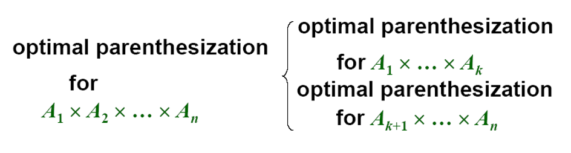

  - 唯一不确定的是 $k$

- 将 $m[i,j]$ 定义为计算矩阵乘积 $A_{i..j}$ 所需的最少标量乘法次数（我们需要 $m[1,n]$ 的值。）

  - 如果 `i=j` ，$m[i,j] = 0$
  - 此外，最优括号划分乘法为 $A_{i..k}$ 和 $A_{k+1..j}$

- 递归定义式
  $$
  m[i,j] = 
  \begin{cases} 
  0 & \text{if } i = j \\
  \min \limits_{i \leq k < j} \{m[i, k] + m[k+1, j] + p_{i-1}p_kp_j\} & \text{if } i < j
  \end{cases}
  $$

  - $ m[i, k] $ = optimal cost for $ A_i \times \ldots \times A_k $
  - $ m[k+1, j] $ = optimal cost for $ A_{k+1} \times \ldots \times A_j $
  - $ p_{i-1}p_kp_j $ = cost for $ (A_i \times \ldots \times A_k) \times (A_{k+1} \times \ldots \times A_j) $

- 算法：

  - Start by setting $m[i,i]=0$ for $i = 1,…,n$.

  - Then compute $m[1,2], m[2,3],…,m[n-1,n]$.

  - Then $m[1,3], m[2,4],…,m[n-2,n],…$

  - … so on till we can compute $m[1,n]$.

    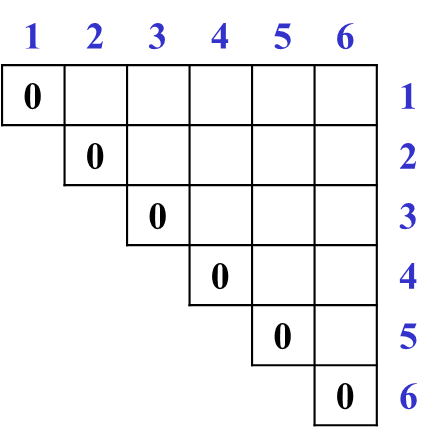


- 输入序列 $p=<p0,p1,…,pn>$，我们使用辅助表 $s[1..n,1..n]$ 记录 $k$ 的哪个索引在计算 $m[i,j]$ 时达到最优成本

- 构建最优解

  <details>
      <summary>根据辅助表构建最优解</summary>
      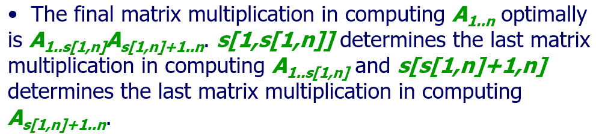
      <p>
          打印最优解
          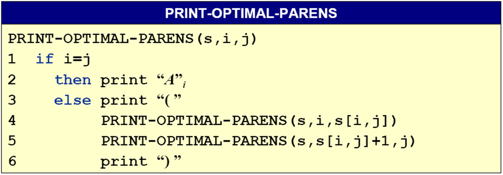
      </p>
  </details>

<details>
    <summary>例子</summary>
    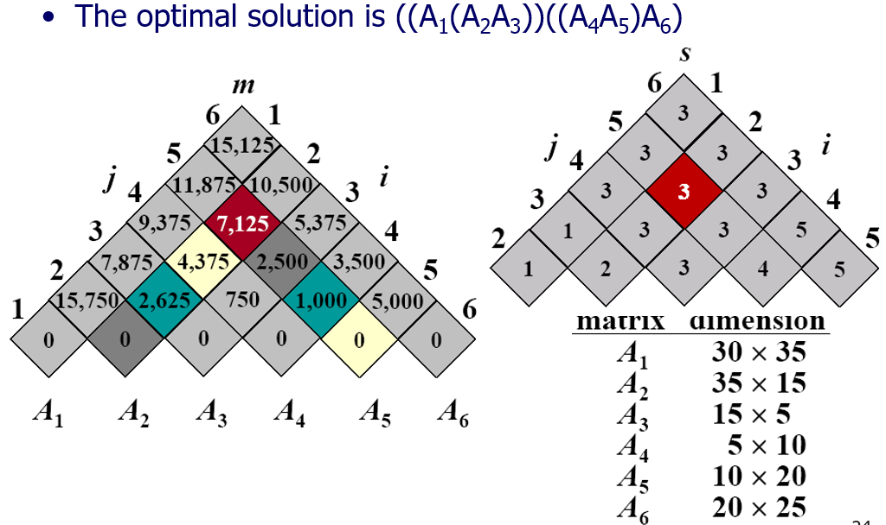
</details>
#### 算法伪代码

如果使用递归实现，时间复杂度:$\Omicron(2^n)$

以下为使用备忘录的方法：

<details>
    <summary>伪代码</summary>
    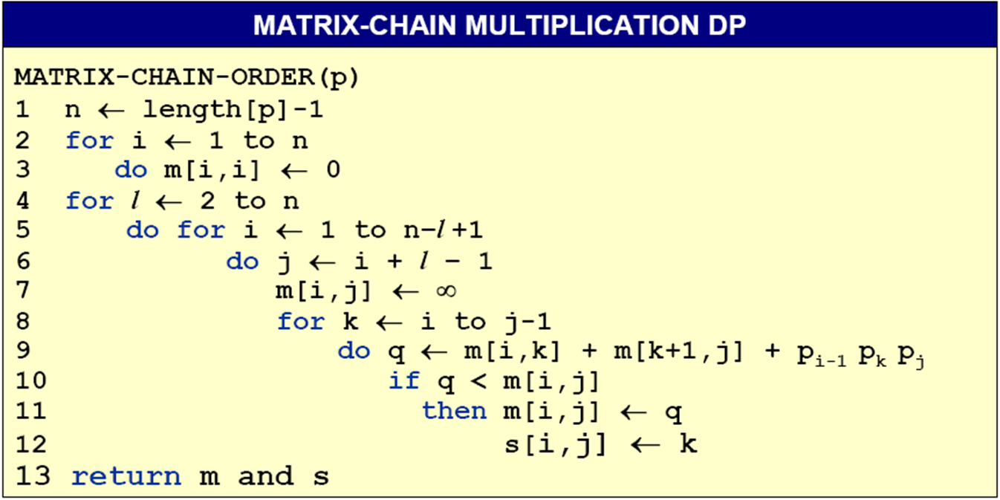
</details>
<u>时间复杂度：$\Omicron(n^3)$</u>


## 4 最长公共子序列 LCS

### 问题描述

<details>
    <summary>问题描述</summary>
    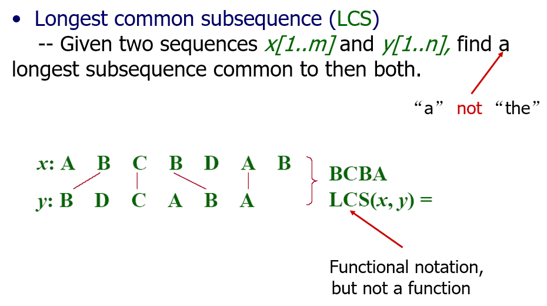
</details>

### 算法设计

- 策略：考虑 x 和 y 的前缀

  - 定义：$c[i,j] = |LCS(x[1..i],y[1..j])|$
  - 结果：$c[m,n] = |LCS(x,y)|$

- 递推式：
  $$
  c[i, j] = 
  \begin{cases} 
  c[i-1, j-1] + 1 & \text{if } i, j > 0 \text{ and } x_i = y_j \\
  \max(c[i, j-1], c[i-1, j]) & \text{otherwise}
  \end{cases}
  $$

  <details>
      <summary>证明</summary>
      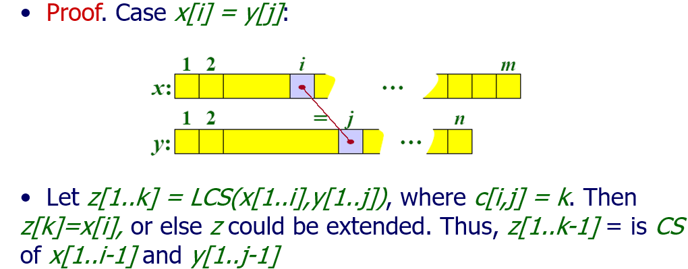
      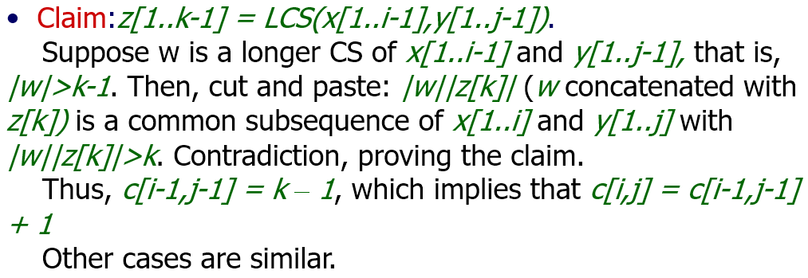
  </details>

- 最优子结构：如果$z＝LCS(x，y)$，则 $z$ 的任意前缀是 $x$ 的前缀和 $y$ 的前缀的LCS。
- 重叠子问题：两个字符串 $m$ 和 $n$ 的不同 LCS 子问题的数量仅为 $mn$。

### 算法伪代码

<details>
    <summary>DP伪代码</summary>
    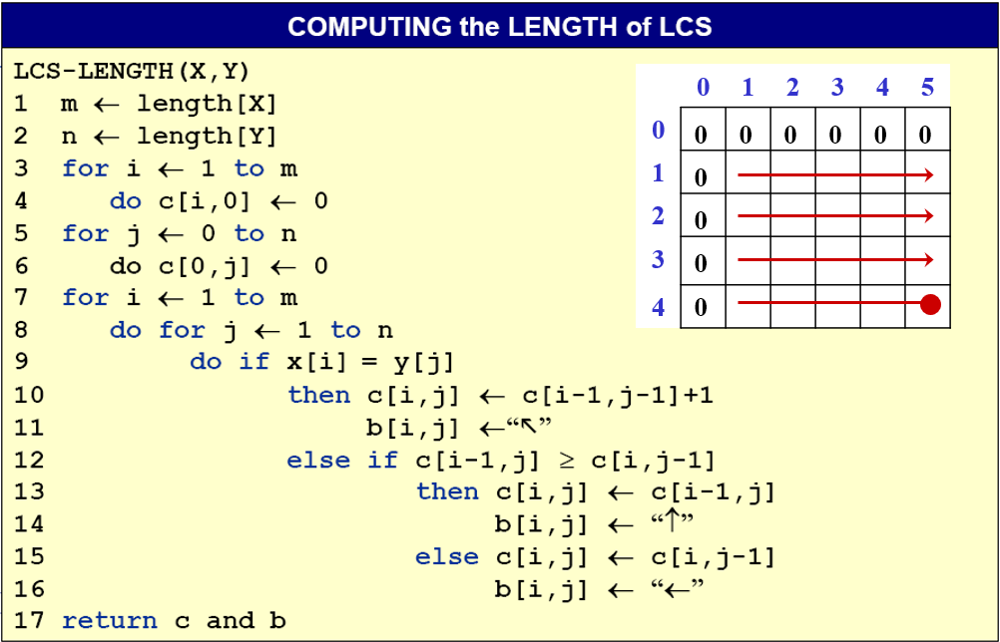
</details>

<details>
    <summary>构建最优解（打印LCS）伪代码</summary>
    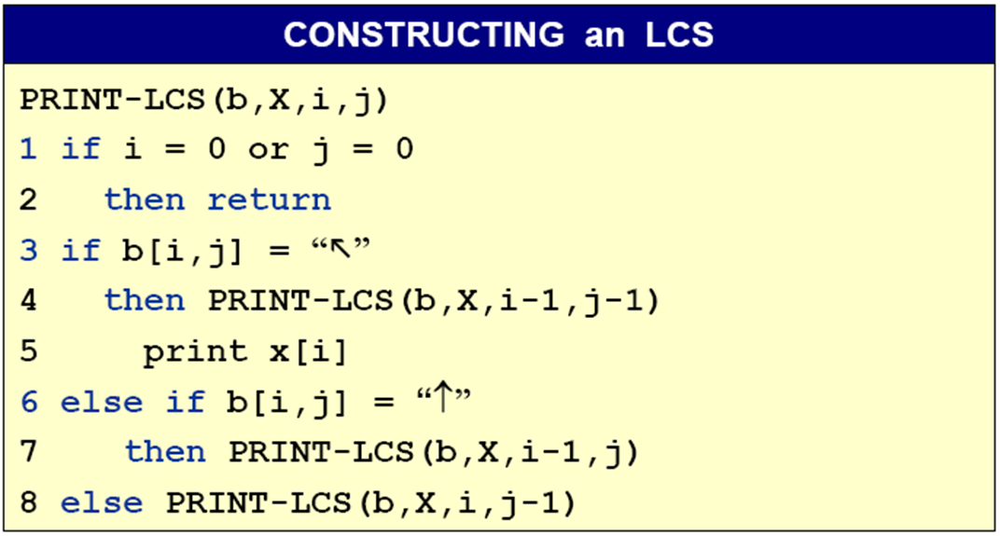
</details>

<u>时间复杂度：$\Theta(mn)$</u>

<details>
    <summary>例子</summary>
    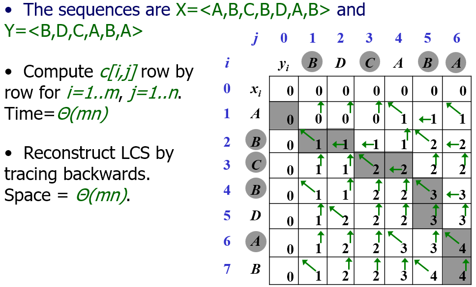
</details>


## 5 最大子数组

### 问题描述

<details>
    <summary>问题描述</summary>
    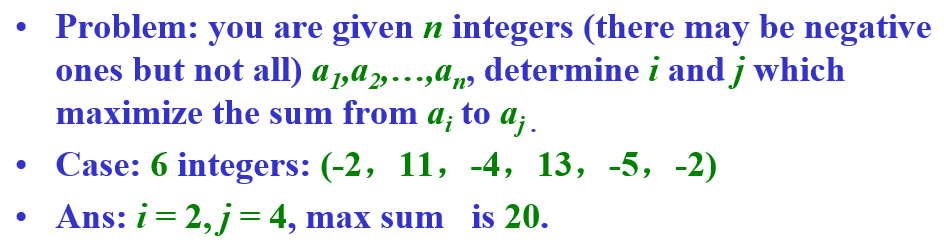
</details>

### 算法设计

- 定义：$b[j]=max(sum(i:j)), 1 \leq i \leq j$

- 全局最优解：$max(b[k]),1 \leq k \leq n$

- 递推式：
  $$
  b[j]=max( b[j-1]+a[j], a[j] ), 1\leq j \leq n
  $$
  

### 算法伪代码

<details>
    <summary>伪代码</summary>
    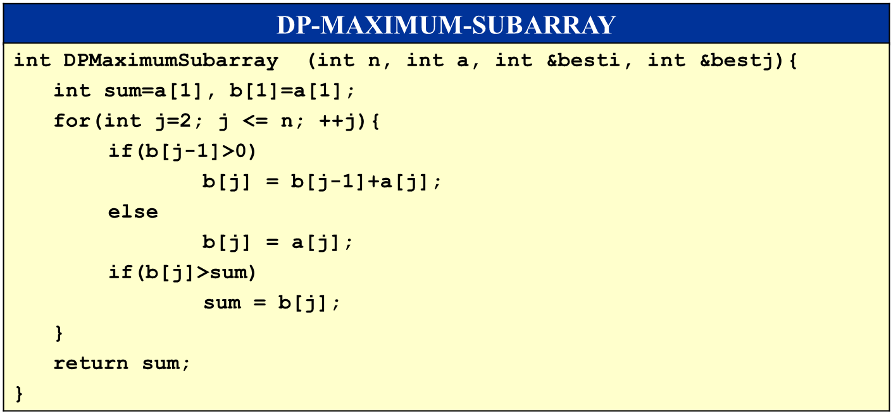
    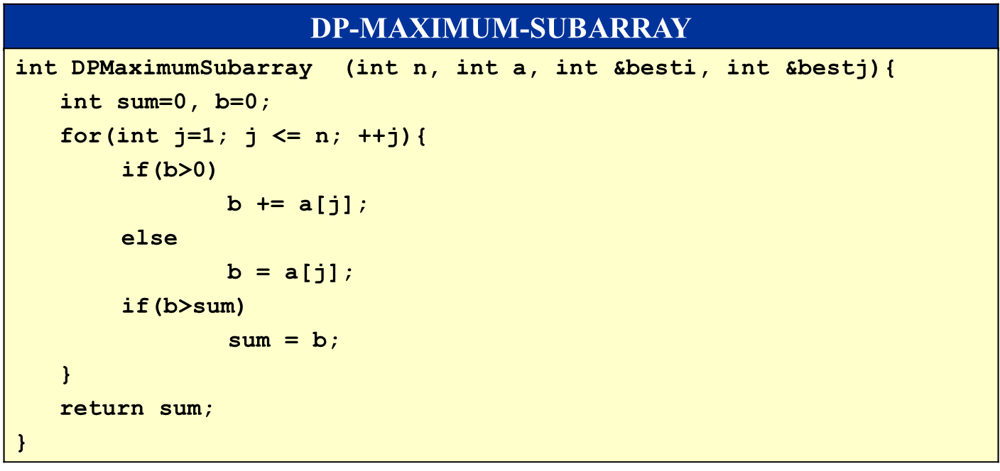
</details>
<u>时间复杂度：$\Theta(n)$</u>


# V. 贪心策略及应用


## 1 贪心策略

### 贪心策略的要素

#### 1. Greedy-choice property 贪心选择性质

<u>通过局部最优（贪心）选择可以得到全局最优解</u>

- 贪婪策略以“自上而下”的方式进行（而不是动态规划中的自下而上），迭代地将每个给定问题减少到更小的问题

#### 2. Optimal substructure 最优子结构

<u>问题的最优解包含子问题的最优解</u>

- 如果最优解 $A$ 具有 $s_1$，则集合 $A’ = A - {s_1}$ 是无 $s_1$ 的较小问题的最优解。


## 2 活动选择问题

### 问题描述

<details>
    <summary>问题描述</summary>
    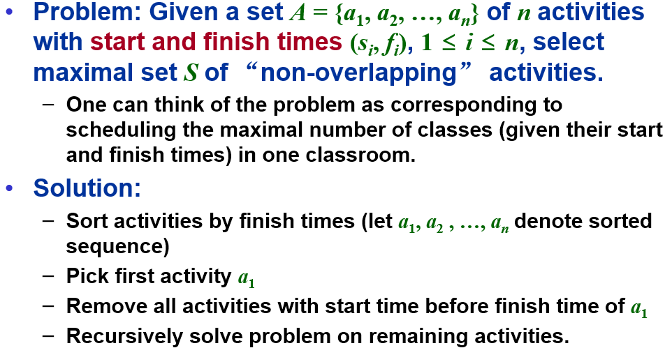
</details>

### 算法分析

目标：创建一组最大兼容的活动 $a_i$

- 子问题：创建一组活动，这些活动可以在 $a_i$ 完成后开始，并在活动 $a_j$ 开始之前完成。

  - 用 $S_{ij}$ 表示活动的集合
    $$
    S_{ij} = \{a_k \in S : f_i \leq f_k \leq f_j\} \subseteq S
    $$
    其中 $S$ 表示完整的活动集合

  - 假想存在活动 $a_0$ 和 $a_{n+1}$ ，有 $f_0=0$ 和 $s_{n+1}=\infty$，令活动按照结束时间递增排序，则 $S=S_{0,n+1}$，其中 $0 \leq i,j \leq n+1$

  - $S_{i,j}=\emptyset$ if $i \geq j$

#### DP 解法

- 最优子结构：

  - 假设我们有一个最优解 $A_{ij}$ 到 $S_{ij}$ 包括 $a_k$，即 $a_k \in S_{ij}$。 那么构成 $S_{ij}$ 的活动可以表示为
    $$
    A_{ij} = A_{ik} \cup \{a_k\} \cup A_{kj}
    $$

- 定义 $c[i,j]$ 表示最大兼容活动集合中的子集的活动数量，有递推式：
  $$
  c[i, j] = 
  \begin{cases} 
  0 & \text{if } S_{ij} = \emptyset \\
  \max_{i < k < j} \{c[i, k] + c[k, j] + 1\} & \text{if } S_{ij} \neq \emptyset
  \end{cases}
  $$

#### 贪心解法

- 考虑任何非空子问题 $S_{ij}$，令 $a_m$ 为 $S_{ij}$ 中完成时间最早的活动
  $$
  f_m = min\{f_k : a_k \in S_{ij}\}
  $$

  - 活动 $a_m$ 用于 $S_{ij}$ 相互兼容活动的某些最大子集
  - 子问题 $S_{im}$ 是空的，因此选择 $a_m$ 使得子问题 $S_{mj}$ 成为唯一可能非空的问题

### 算法伪代码

<details>
    <summary>伪代码</summary>
    <p>
        递归实现：
        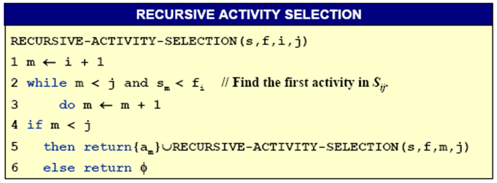
        很显然，这是一个<b>尾递归</b>：它以对其自身的递归调用结束，然后进行<i>并操作</i>。
    </p>
    <p>
        循环实现：
        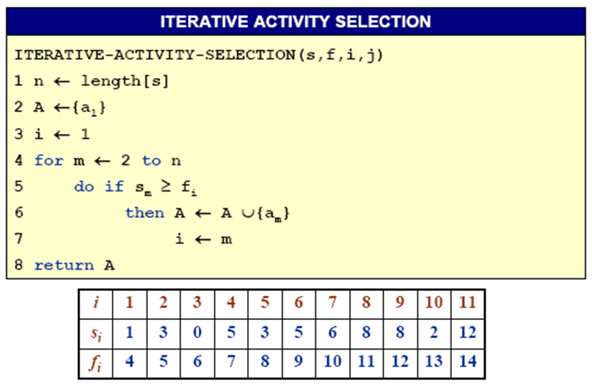
    </p>
</details>

<u>循环法的时间复杂度：$\Theta(n)$</u>


## 3 背包问题：0-1背包与分数背包

### 问题描述

<details>
    <summary>0-1背包和分数背包问题</summary>
    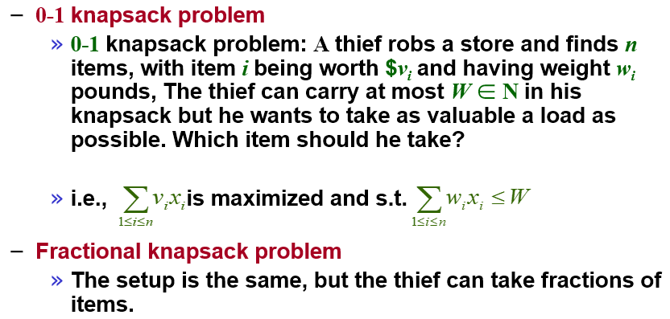
</details>

### 算法分析

最优子结构：

- 对于 0-1 背包问题，如果我们从该负载中移除物品 $j$，则剩余负载必须是 $n - 1$ 件物品中重量最多为 $W-w_j$ 的最有价值物品。
- 对于分数背包问题，如果我们从最优装载中移除了物品 $j$ 的一部分重量 $w$，那么剩余的装载必须是从原始的 $n-1$ 个物品中，可以带走的最有价值的、重量最多为 $W - w$ 的装载，加上物品 $j$ 的 $w_j – w$ 磅的部分。

#### 分数背包

- 按照 $Value/Weight$ 递减排序（贪心：优先装性价比最高的）
- 顺序装载，直到不够装，将剩余部分的能装入的部分装入

#### 0-1背包（DP）

- 目标：

  - 使用 $c[i, j]$ 来表示： 
    - $i$ 是项目索引
    - $j$ 是当前考虑的背包容量

- 最优子结构：

  - 如果包含第 $n$ 个物品，我们检查剩余容量为 $W-w_n$ 的最优解（即除去当前物品的重量后背包的剩余容量）。
  - 如果不包含第 $n$ 个物品，则直接考虑前 $n-1$ 个物品填充到背包中。

- 递推式：
  $$
  c[i, w] = \begin{cases} 
  0 & \text{if } i = 0 \text{ or } w = 0 \\
  c[i-1, w] & \text{if } w_i > w \\
  \max(c[i-1, w-w_i] + v_i, c[i-1, w]) & \text{if } i > 0 \text{ and } w \geq w_i 
  \end{cases}
  $$
  

### 算法伪代码

<details>
    <summary>分数背包伪代码</summary>
    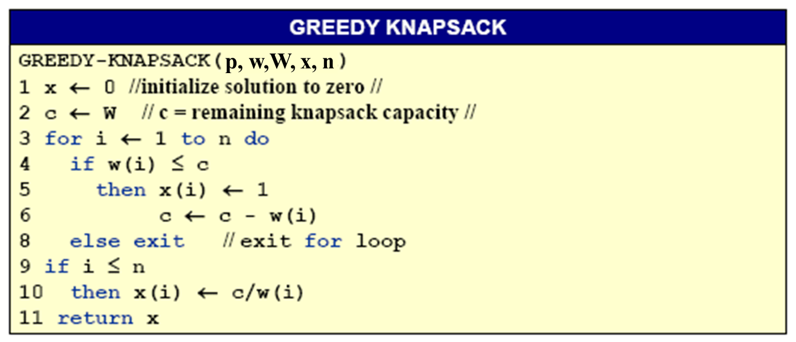
    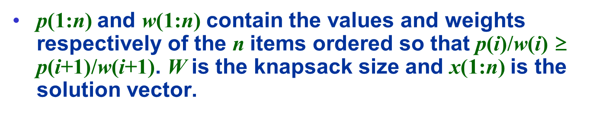
</details>

<details>
    <summary>0-1背包伪代码</summary>
    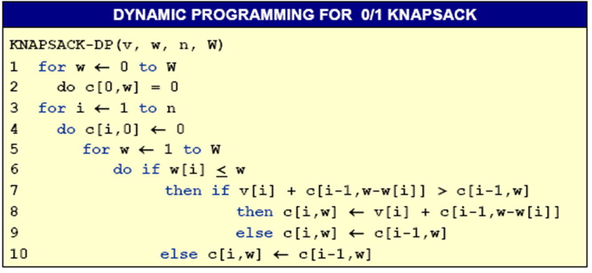
</details>


## 4 Huffman 编码

### 问题描述

<details>
    <summary>问题描述</summary>
    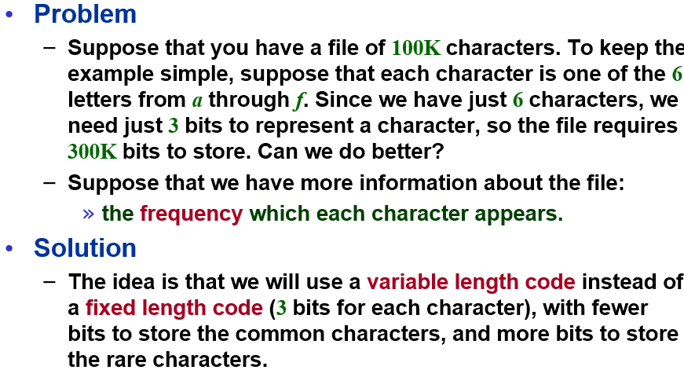
</details>

### 算法分析

<details>
    <summary><b>前缀码</b></summary>
    <p>
        在前缀码中，没有码字是另一个码字的前缀。
    </p>
    <p>
        便于编码和解码:
        <al>
            <li>为了进行编码，我们只需要连接消息中连续字符的代码即可</li>
            <li>为了解码，我们必须决定每个代码的开始和结束位置</li>
        </al>
    </p>
</details>

- 使用可变长度代码而不是固定长度代码（每个字符 3 位）
- 用更少的位来存储常见字符，用更多的位来存储罕见字符
- 贪心：优先编码低频率的字符，自下而上构建Huffman树
  - 它从代表每个 $c \in C$ 的单节点树的森林开始，并使用一个按最小频率排序的优先队列 $Q$，以贪心风格合并它们

<details>
    <summary>Huffman编码例子</summary>
    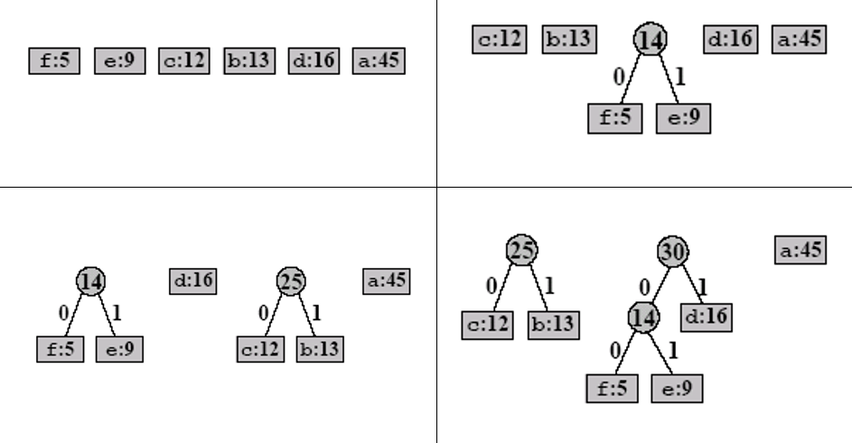
    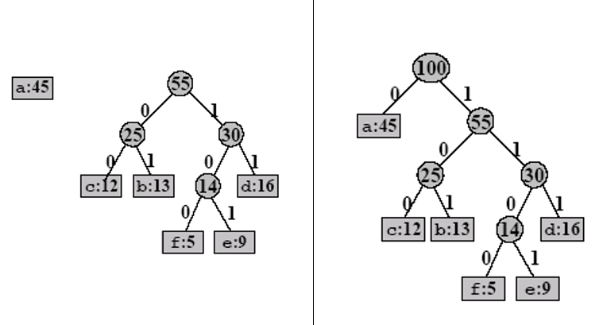
</details>

### 算法伪代码

> 建Huffman树的伪代码可能考察

<details>
    <summary>构建Huffman树的伪代码</summary>
    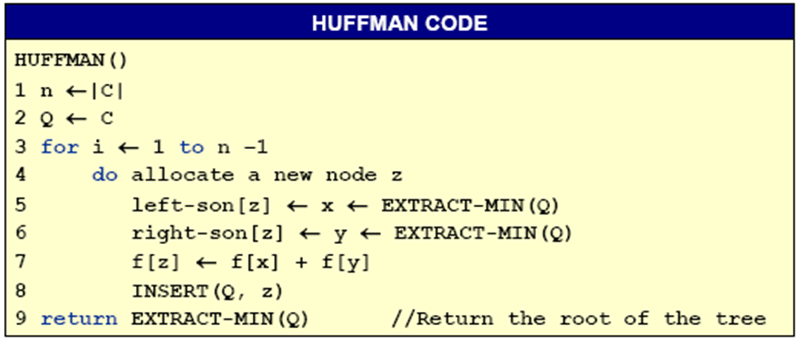
</details>


# VI. 最短路径问题


## 1 最短路径

### 路径定义

考虑有向图 $G=(V,E)$，具有边权函数 $w : E \rightarrow R$。 路径的权重 $p=v_1 \rightarrow v_2 \rightarrow … \rightarrow v_k$ 定义为 $w(p)=\sum_{i=1..k-1}w(v_i ,v_{i+1})$

### 最短路径定义

从 u 到 v 的最短路径是从 u 到 v 的最小权重路径。u 到 v 的最短路径权重定义为
$$
\delta(u, v) = 
\begin{cases} 
\min \{w(p)\} & \text{if there is a path } p \text{ from } u \text{ to } v \\
\infty & \text{otherwise}
\end{cases}
$$

### 最优结构

最短路径的子图是最短路径


## 2 单源最短路径

### 问题描述

<details>
    <summary>问题描述</summary>
    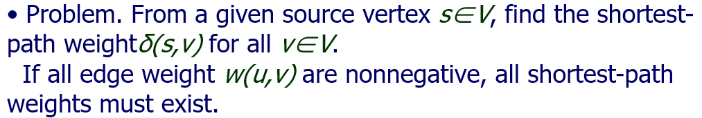
</details>

<details>
    <summary>IDEA</summary>
    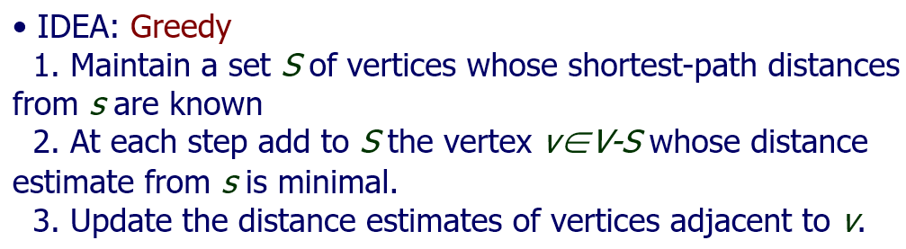
</details>

### 非负权图 —— Dijkstra算法

#### 伪代码

<details>
    <summary>伪代码</summary>
    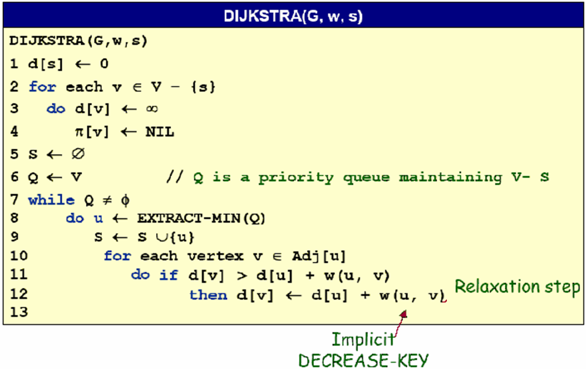
</details>

#### 算法分析

<u>时间复杂度：$\Theta(V.T_{EXTRACT-MIN}+E.T_{DECREASE-KEY})$</u>

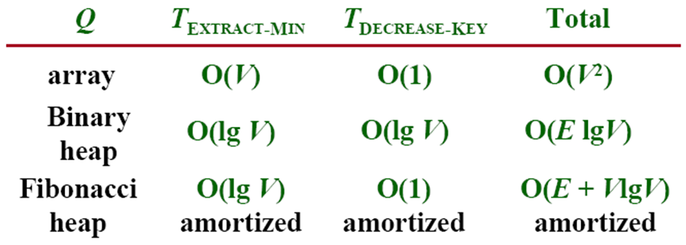

<details>
    <summary>例子</summary>
    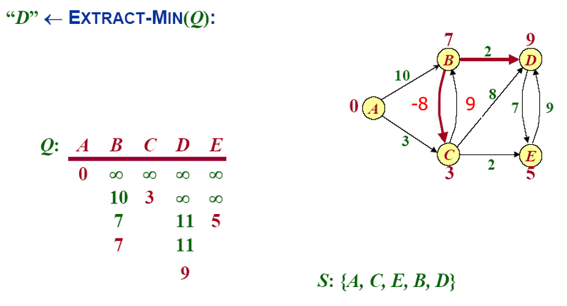
</details>

#### 无权图的Dijkstra算法

即 $w(u,v)=1$，使用FIFO队列

<details>
    <summary>伪代码</summary>
    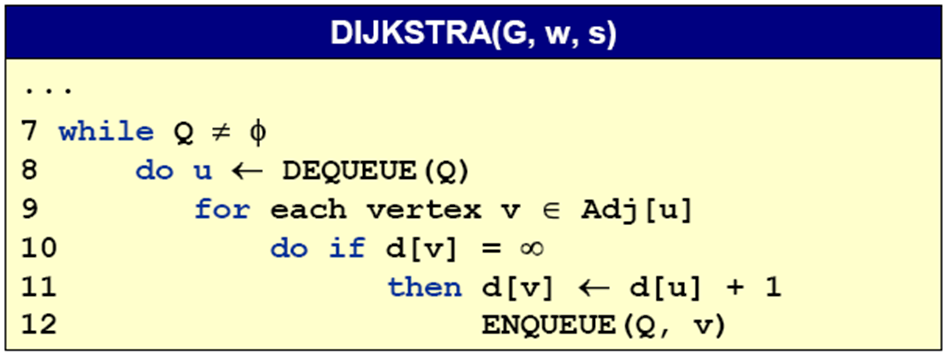
</details>

<u>时间复杂度：$\Omicron(V+E)$</u>

### 含负权图 —— Bellman-Ford算法

#### 伪代码

<details>
    <summary>伪代码</summary>
    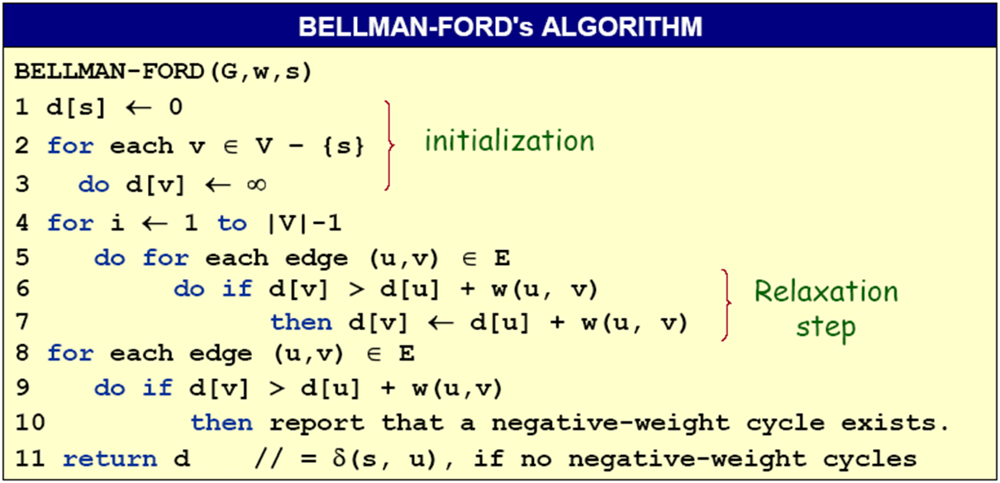
</details>

#### 算法分析

- <u>时间复杂度：$\Omicron(VE)$</u>

- 正确性分析：如果一个加权图 𝐺=(𝑉,𝐸) <u>不包含任何负权重环</u>，那么在执行Bellman-Ford算法之后，对于图中的每一个顶点 𝑣∈𝑉，算法计算得到的最短路径估计 𝑑[𝑣] 将等于从源顶点 𝑠 到顶点 𝑣 的真实最短路径权重 𝛿(𝑠,𝑣)。

- 推论：如果在执行完所有顶点数减一（|V|-1）次的松弛操作之后，某个顶点的最短路径估计 𝑑[𝑣] 还没有稳定（即仍能继续被松弛），则表明图 𝐺 中存在从源点 𝑠 可达的负权


## 3 全源最短路径

<details>
    <summary>回顾单元最短路径算法</summary>
    <p>
        <al>
        	<li>非负权图 —— Dijkstra算法：<code>O(E+VlgV)</code></li>
        	<li>一般算法 —— Bellman-Ford算法：<code>O(VE)</code></li>
    	</al>
    </p>
</details>

全源最短路径：

- Dijkstra算法时间复杂度：$\Omicron(VE+V^2\lg{V})$

- Bellman-Ford算法时间复杂度：$\Omicron(V^2E)$

  > 稠密图中（n^2^条边）时间复杂度：$\Omicron(V^4)$

- 一般方法：Floyd-Warshall

### 问题描述

<details>
    <summary>问题描述</summary>
    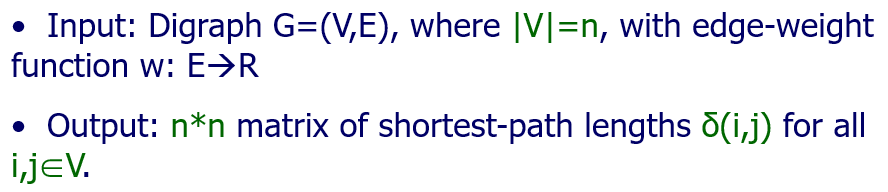
</details>

### DP算法

#### 算法设计

定义：

$d^{(m)}_{ij}$ = 从 $i$ 到 $j$ 的最短路径的权重，最多使用 $m$ 个边。

递推式：
$$
d^{(m)}_{ij}=min_k{\{d^{(m-1)}_{ik}+a_{kj}\}}
$$

<details>
    <summary>图示</summary>
    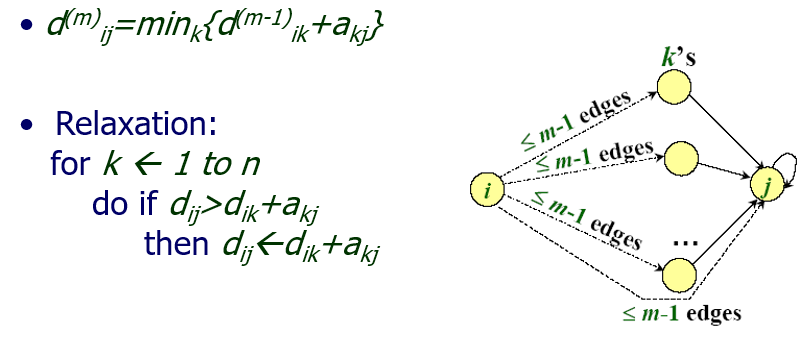
</details>

#### 矩阵乘法变体

对于矩阵乘法
$$
C_{ij} = \sum _{k=1}^{n}A_{ik}B_{kj} 
$$
将 “ $+$ ” 替换为 “ $min$ ” ，将 “ $\cdot$ ” 替换为 “ $+$ ”，有
$$
c_{ij} = min_k\{a_{ik}+b_{kj}\}
$$
因此，$D^{(m)}=D^{(m-1)}$ “$\times$” $A$

> (min,+) 乘法是结合律，与实数一起形成称为闭半环的代数结构。

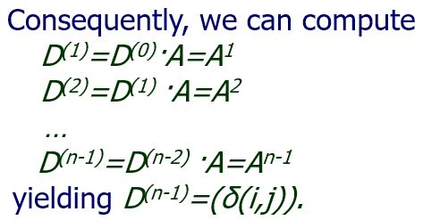

<u>时间复杂度：$\Theta(n^4)$</u>，相比Bellman-Ford算法更差

#### 矩阵乘法改进

- 重复平方：$A^{2k}=A^k*A^k$

  - 计算：
    $$
    A^2, A^4, ..., A^{2\lceil\lg{n-1}\rceil}
    $$

  > 可以向上取整，因为：$A_{n-1}=A_{n}=A_{n+1}=...$

- 时间复杂度：$\Theta(n^3\lg{n})$

### Floyd-Warshall算法

#### 算法设计

- 定义从 $i$ 到 $j$ 的最短路径的 $c_{ij}^{(k)}$ 权重，中间顶点属于集合 $\{1,2,…,k\}$

  > $c_{ij}^{(0)}=a_{ij}$

- 递推式：
  $$
  c_{ij}^{(k)}=min_k\{c_{ij}^{(k-1)},c_{ik}^{(k-1)}+c_{kj}^{(k-1)}\}
  $$
  
- 补充：<u>可以检测负权重环</u>，当算法完成后，如果有顶点$c_{ii}^n < 0$，则存在负权重环。因为无负权重环时所有节点到自己的最短路径是0.

#### 伪代码

<details>
    <summary>伪代码</summary>
    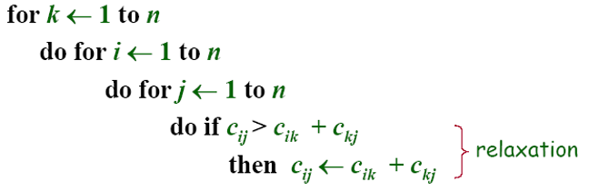
</details>

<u>时间复杂度：$\Omicron(n^3)$</u>

#### 有向图的传递闭包

定义：
$$
t_{ij} = 
\begin{cases} 
1 & \text{if there exists a path from } i \text{ to } j, \\
0 & \text{otherwise.}
\end{cases}
$$
使用 $(\lor,\land)$ 替换 $(min,+)$

有：
$$
t_{ij}^{(k)}=t_{ij}^{(k-1)} \lor (t_{ik}^{(k-1)} \land t_{kj}^{(k-1)})
$$
时间复杂度：$\Omicron(n^3)$


# VII. 难题怎么办


## 1 搜索

无法采用规模压缩时，类蛮力的状态空间搜索

> 没招的时候用的——暴力解法

### 限界函数

#### 约束条件

- 显示约束
  - 约束每个分量$x_i$的值
  - 所有满足显式约束的元组构成了可能的解空间
- 隐式约束
  - 组件间的约束
  - 隐式约束识别那些满足解空间中的标准函数的约束

#### 限界函数的作用

- 减少没必要的搜索（考虑杀死更多的节点）
- 考虑限界函数本身的效率

### 状态空间树

#### 定义

- **Problem State**：树中的每个节点在解决问题时标识一个问题状态。
- **State Space**：从根到每个节点的所有路径。
- **State Space Tree**：解空间树。
- **Solution States**：从根开始的路径标识解空间中的向量的那些问题状态（满足显式约束）。
- **Answer States**：这些解决方案表明从根开始的路径标识了一个答案（满足隐式约束）。

<details>
    <summary>解空间树图示</summary>
    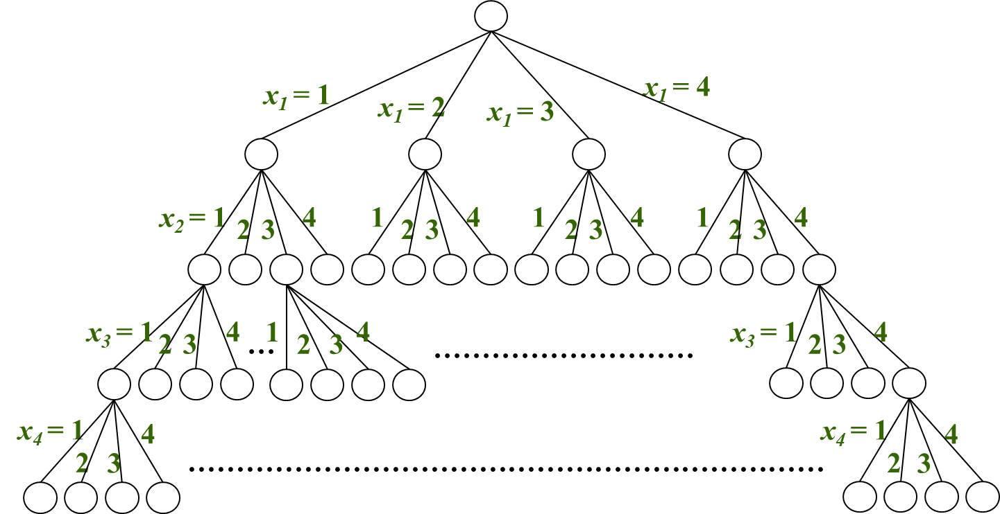
</details>

<details>
    <summary>利用状态空间树解决问题的流程</summary>
    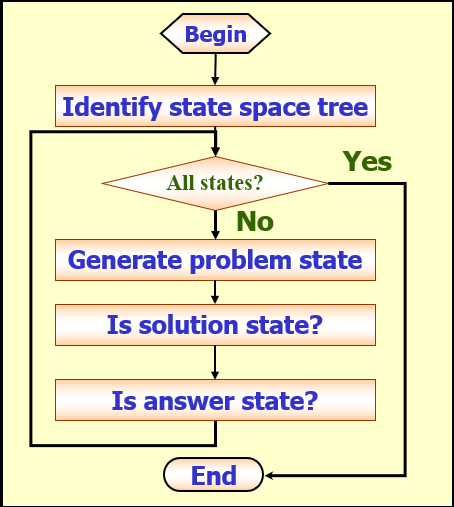
</details>

#### 在状态空间树搜索

==考试要求：知道**回溯法**与**分支-限界法**搜索<u>状态空间树</u>的次序即可==

- 基础概念
  - *Alive node*：一个已生成的节点，其子节点尚未全部生成
  - *E-node*：当前正在生成儿子的节点
  - *Dead node*：一个节点，他的所有儿子都已经生成或者不需要生成他的儿子

- 以<u>DFS</u>方式生成问题状态 —— 回溯法
  - 一旦***E-node*** **R**的儿子节点**C**生成，生成的子节点**C**就成为新的***E-node***，在检查完所有以节点**C**为根的树后，节点**R**将再次成为***E-node***
- 以<u>BFS</u>方式生成问题状态 —— 分支-限界法
  - 一个***E-node***将一直保持为***E-node***，直到成为***Dead node***。

### 回溯法

> 本质：DFS

<details>
    <summary>回溯法伪代码</summary>
    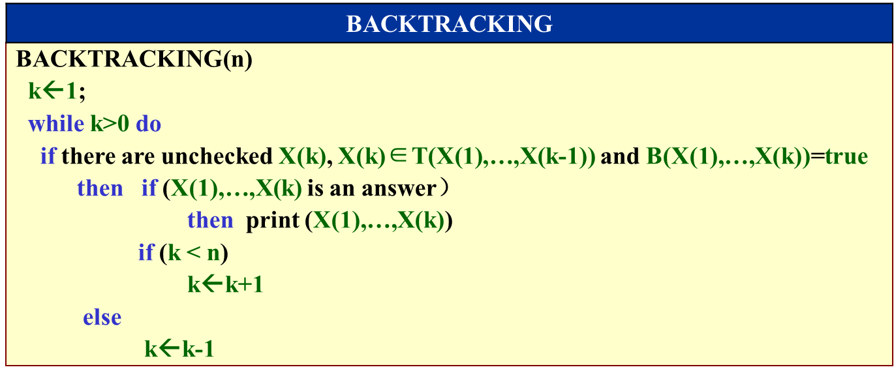
</details>

#### a. N皇后问题

<details>
    <summary>算法伪代码</summary>
	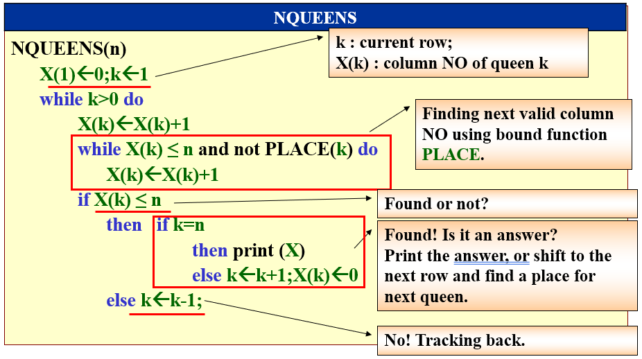
</details>

<details>
    <summary>限界函数</summary>
    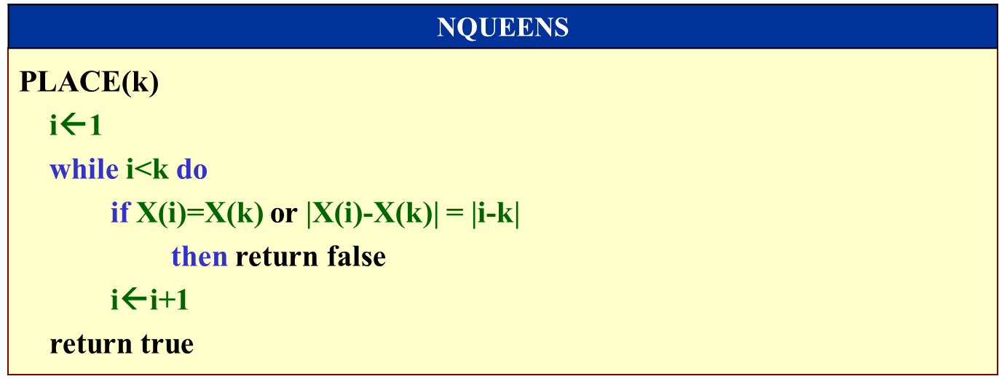
</details>

#### b. 子集和数问题

<details>
    <summary>问题描述</summary>
    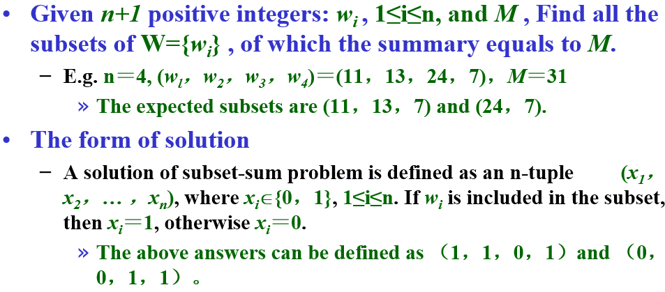
</details>

<details>
    <summary>子集和数问题的状态空间树</summary>
    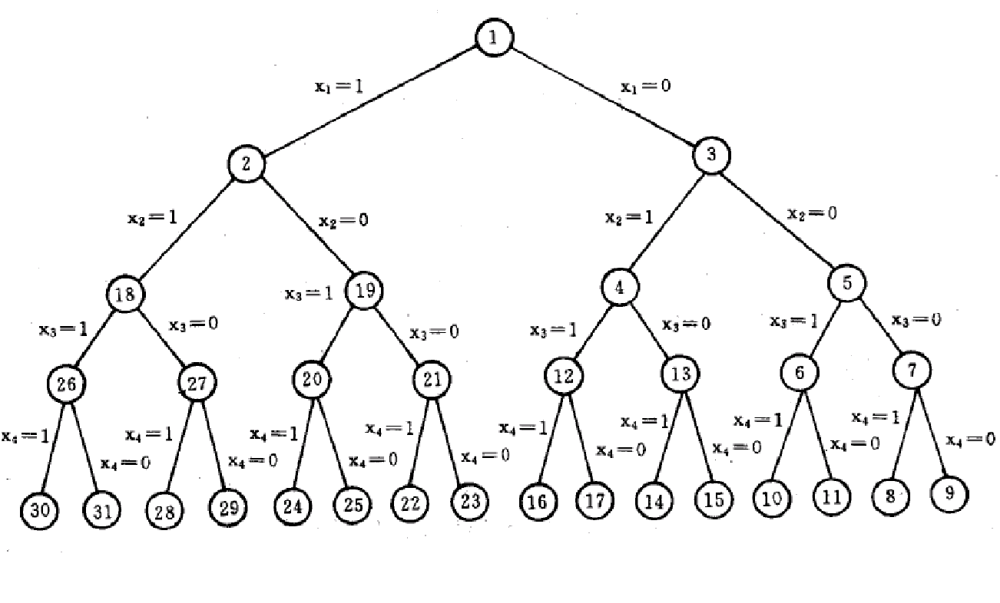
</details>

<details>
    <summary>限界函数</summary>
    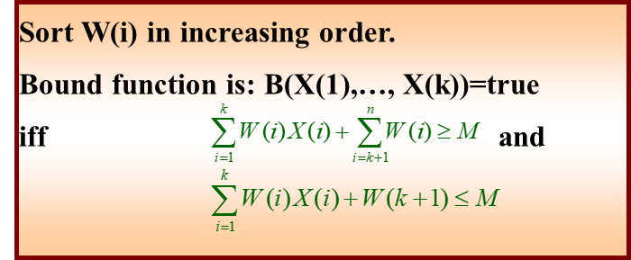
</details>

<details>
    <summary>算法伪代码</summary>
    <p>
        原算法：
        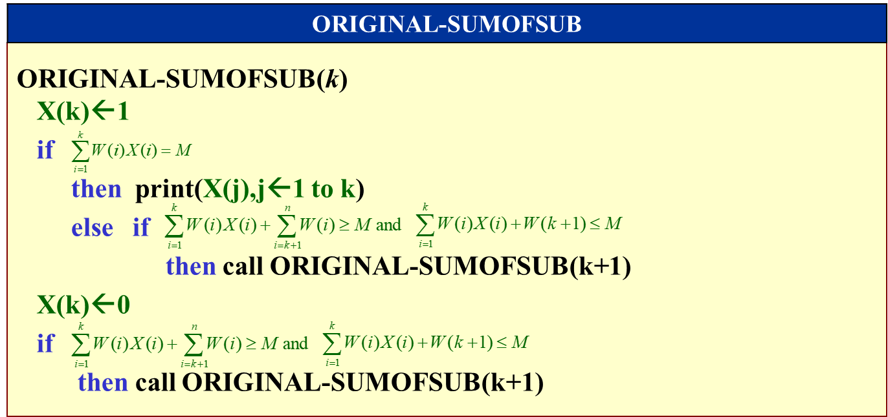
    </p>
    <p>
        修改后：
        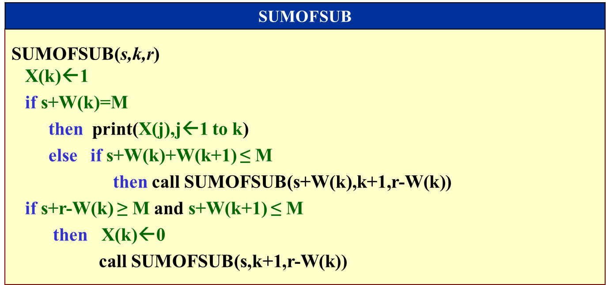
    </p>
</details>

#### c. 0-1背包问题

<details>
    <summary>限界函数</summary>
    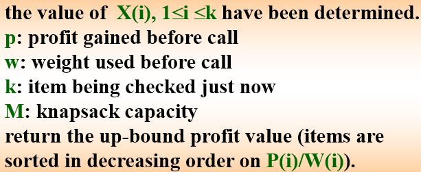
    <p>
    	伪代码：
    	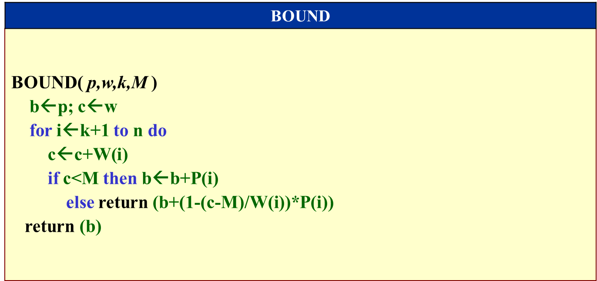
    </p>
</details>

<details>
    <summary>算法伪代码</summary>
    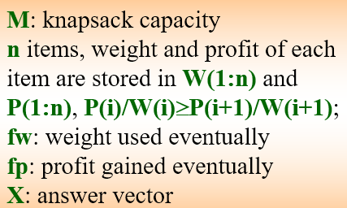
    
</details>

### 分支-限界法

> 不是BFS。只要展开一节点的孩子（成为***E-node***），全都叫分支-限界。保持一个***E-node***直到成为***Dead node***为止。
>
> “要生成谁的孩子就要生成谁的所有孩子”

<u>分支-限界法与回溯法的区别：检索状态空间树的次序不同。</u>

分支-限界法需要一个保存活动节点的表：

- BFS 的 FIFO（先进先出）表
  - 队列
- 用于 D-search 的 LIFO（后进先出）表
  - 堆

<details>
    <summary>D-search与BFS的区别</summary>
    <p>
		D-search与 BFS 的不同之处在于，下一个要探索的节点是 <b>最近添加</b> 的节点。
    </p>
</details>


## 2 难题有多难

### Undecidable Problem

代表问题：

- Hilbert’s 10th Problem.

- Post’s Correspondence Problem.

- Halting Problem

### NP-Completeness

代表问题：

SAT 是第一个NPC问题

- 3-COLOR
- CIRCUIT-SAT
- TSP
- FACTOR

#### P

定义：在确定性图灵机上可在多项式时间内解决的所有决策问题的集合。

Church-Turing论点：**P** 是在真实计算机上可在**多项式时间内**解决的所有决策问题的集合。

#### NP

- **EXP**：在确定性图灵机上可在**指数时间内**解决的一组决策问题。

- **NP**：具有高效认证算法的所有决策问题集。

  > 在非确定性图灵机（一种理论计算模型）上可以在多项式时间内验证（或证明）给定解的正确性的决策问题集合。

$$
P \subseteq NP \subseteq EXP
$$

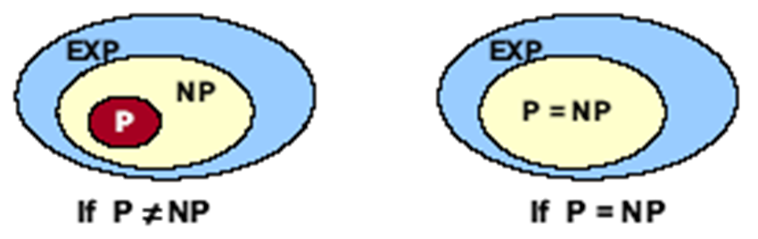

**NP和P等不等？**

<u>不确定。</u>

- 共识：P ≠ NP

- 但是也可能等（P = NP），因为没有成功证明P ≠ NP

#### NPC

定义：NPC问题是计算复杂性理论中一类特别重要的问题。

- 一个问题被归类为NPC问题的，首先它必须是一个NP问题，即在多项式时间内可以验证一个给定的解是否正确。
- 其次，所有其他NP问题都必须能够在多项式时间内归约到这个问题上，这意味着这个问题至少与NP中的任何其他问题一样难。

> NP问题中最难的
