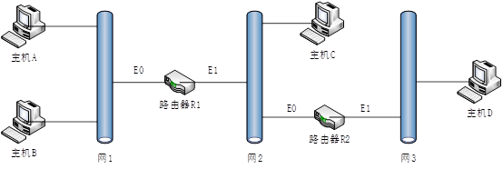
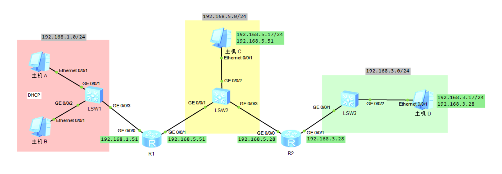

# 一、实验目的

利用华为eNSP网络模拟器，搭建与下图相对应的网络拓扑图



* 要求：
  * 主机A与主机B的IPv4地址、子网掩码以及默认网关等参数由网络设备中的DHCP服务自动分配
  * 主机C和主机D的IPv4地址、子网掩码以及默认网关等参数由手动分配，且地址的最后一个字节必须设置为任一组员学号的后三位
  * 对主机A所连接的网络设备端口进行限速，其中入方向和出方向均限制为端口最大速率的50%
  * 选择合适的网络设备，配置至少两种防ARP泛洪攻击功能以及至少两种防ARP欺骗攻击功能

# 二、实验环境

* 软件环境
  * eNSP (V100R003C00SPC100)
  * Oracle VM VirtualBox (5.2.44)
* 硬件环境
  * CPU：i7-11800H
  * GPU：RTX 3060

# 三、实验基本原理及步骤

## 1. DHCP服务原理

* **客户端发现**

当一个设备连接到网络时（例如，启动计算机或连接到网络的时候），它会发送一个特殊的广播消息（称为DHCP Discover消息）到网络上的所有设备，以寻找可用的DHCP服务器。

* **服务器提供地址**

DHCP服务器收到客户端的Discover消息后，会从可用的IP地址池中选择一个地址，并通过DHCP Offer消息回复给客户端，提供可用的IP地址，以及其他网络配置信息（如子网掩码、网关、DNS服务器等）

* **地址确认**

客户端接收到DHCP Offer消息后，会选择其中一个提供的IP地址，并向DHCP服务器发送DHCP Request消息，请求使用该地址

* **分配地址**

DHCP服务器收到客户端的Request消息后，会分配该IP地址给客户端，并通过DHCP Acknowledgment消息（DHCP ACK）确认给客户端，同时提供其他网络配置信息

* **地址续约**

在租约期限内，客户端会周期性地向DHCP服务器发送DHCP Request消息，以请求续约当前分配的IP地址，以及更新其他网络配置信息。如果DHCP服务器同意续约，它会发送DHCP ACK消息，否则会发送DHCP NACK消息。

* **地址释放**

当客户端不再需要分配的IP地址时（例如，设备断开网络连接或关机），它会发送一个DHCP Release消息给DHCP服务器，通知服务器释放该IP地址

## 2. 端口限速

在拓扑结构中使用的是*GigabitEthernetport*，即千兆端口，速度为1000000 kbps，故按照题目要求”端口最大速率的50%“， 应该为500000 kbps

## 3. 静态路由

由于静态路由相对简单，适用于小型或稳定的网络环境，故在本题中我们选择使用静态路由。

在本题中，为了使在不同网段的主机能够相互ping通，需要分别在两个路由器进行如下静态路由配置：

* 对路由器R1：设置Destination为网段3的下一跳（Next Hop）为路由器R2的E0端口
* 对路由器R2：设置Destination为网段1的下一跳（Next Hop）为路由器R1的E1端口

## 4. 防ARP攻击

### 4.1 ARP协议

ARP协议是一种用于将IP地址解析为物理MAC地址的协议，它在计算机网络中起着重要作用。ARP的主要目的是帮助确定目标设备的MAC地址，以便在局域网上进行直接通信，ARP报文通常分为以下几部分：

* **ARP请求（ARP Request）**
  * 发送方的MAC地址：发送ARP请求的设备的MAC地址。
  * 发送方的IP地址：发送ARP请求的设备的IP地址。
  * 目标IP地址：要解析的目标设备的IP地址。
  * 目标MAC地址：通常为空，因为目标设备的MAC地址还未知。
* **ARP应答（ARP Reply）**
  * 目标的MAC地址：发送ARP应答的设备的MAC地址。
  * 目标的IP地址：发送ARP应答的设备的IP地址。
  * 发送方的MAC地址：发送ARP请求的设备的MAC地址。
  * 发送方的IP地址：发送ARP请求的设备的IP地址。

### 4.1 ARP泛洪攻击

#### 4.1.1 原理

* 通过伪造大量源IP地址变化的ARP报文，使得设备ARP表资源被无效的ARP条目耗尽 ，合法用户的ARP报文不能继续生成ARP条目，导致正常通信中断。
* 向设备发送大量目标IP地址不能解析的IP报文，导致设备触发大量ARP Miss消息 ，生成并下发大量临时ARP表项，并广播大量ARP请求报文以对目标IP地址进行解析，从而造成CPU（Central Processing Unit）负荷过重

#### 4.1.2 防范措施

* **配置ARP Miss消息限速值**

由于泛洪会导致大量的ARP Miss，故设置对ARP Miss进行限速。同一个源IP地址在1秒内触发的ARP Miss消息个数超过ARP Miss消息限速值，设备会丢弃超过限速值的ARP Miss报文，并默认使用block方式在5分钟内持续丢弃该源IP地址的后续所有ARP Miss报文

* **配置ARP表项老化时间**

  当IP报文触发ARP Miss消息时，设备会根据ARP Miss消息生成临时ARP表项，并且向目的网段发送ARP请求报文。

  * 在临时ARP表项老化时间范围内：
    * 设备收到ARP应答报文前，匹配临时ARP表项的IP报文将被丢弃并且不会触发ARP Miss消息。
    * 设备收到ARP应答报文后，则生成正确的ARP表项来替换临时ARP表项。
  * 当IP报文触发ARP Miss消息时，设备会根据ARP Miss消息生成临时ARP表项，并且向目的网段发送ARP请求报文。

故可以通过配置临时ARP表项的老化时间来控制ARP Miss消息的触发频率。当判断设备受到攻击时，可以调大该时间，减小设备ARP Miss消息的触发频率，从而减小攻击对设备的影响。

### 4.2 ARP欺骗攻击

#### 4.2.1 原理

* 由攻击者发送假的ARP数据包到网上，尤其是送到网关上。其目的是要让送至特定的IP地址的流量被错误送到攻击者所取代的地方。因此攻击者可将这些流量另行转送到真正的网关（被动式数据包嗅探，passive sniffing）或是篡改后再转送

#### 4.2.2 防范措施

* **配置静态路由映射**

通过在设备上手动设定IP地址与MAC地址的对应关系，以阻止未授权的地址解析请求

* **配置ARP表项严格学习**

设备收到ARP请求报文后，不学习源IP的ARP表项。只有当设备收到ARP应答报文，且报文的目的IP是本机地址，同时设备上已存在源IP对应的ARP表项，临时表项或者真实的ARP表项时，才会更新源IP的ARP表项

# 四、仿真及软件设计

## 1.拓扑图



## 2. 为主机A和主机B配置DHCP服务

### 2.1 路由器R1配置

```shell
dhcp enable # 启动dhcp服务
ip pool name # 建立ip池
network 192.168.1.0 mask 24 # 配置ip池内地址范围
gateway-list 192.168.1.51 # 配置ip池默认网关
quit
int g0/0/0 # 只在一个端口开启dhcp服务
dhcp select global # 选择全局的地址池给DHCP客户端使用
```

### 2.2 主机配置


## 3. 配置静态路由

```shell
# R1
ip route-static 192.168.3.0 24 192.168.5.28 # 通过R1和网段3通信时下一跳时5.28
# R2
ip route-static 192.168.1.0 24 192.168.5.51 # 通过R2和网段1通信时下一跳时5.51
```

## 4. 配置端口限速

**题中要求设置A所连接的网络设备端口，所以我们这里是LSW1的g0/0/1**

```shell
sys
int g0/0/1
qos lr outbound cir 500000 # lr是limit rate， cir 是承诺信息速率，单位为kbps
qos lr inbound cir 500000
```

50000的计算过程已经在上一部分中进行了计算和解释

## 5. 配置防御ARP攻击

### 5.1 配置ARP Miss消息限速

```shell
arp-miss speed-limit source-ip maximum 200
```

### 5.2 配置ARP表项老化时间

```shell
arp-fake expire-time 3
```

### 5.3 配置静态ARP映射

```shell
arp static ip_addr mac_addr
```

其中`ip_addr`和`mac_addr`分别是对应的ip和mac地址

### 5.4 配置ARP表项严格学习

```shell
arp learning strict
```

# 五、测试环境及测试结果

## 1. 测试DHCP是否配置成功

分别在`PCA`和`PCB`的命令行输入：

```shell
ipconfig
```

输出：


从输出可以看到成功配置了DHCP服务，PCA和PCB能够自动获取IP地址

## 1. 测试不同网段间的连通性

### 1.1 网段1和网段2

用`PCC`ping`PCA`:

由于PCA是通过DHCP获取的IP地址，首先通过如下命令获取`PCA`的ip地址：

```shell
ipconfig
```


### 1.2 网段1和网段3

`PCA` ping `PCD`:


### 1.3 网段2和网段3

`PCC` ping `PCD`:


## 2. 测试限速是否配置成功

通过如下命令查看是否成功为端口配置限速：

```shell
display qos lr [inbound | outbound] interface 端口号
```


