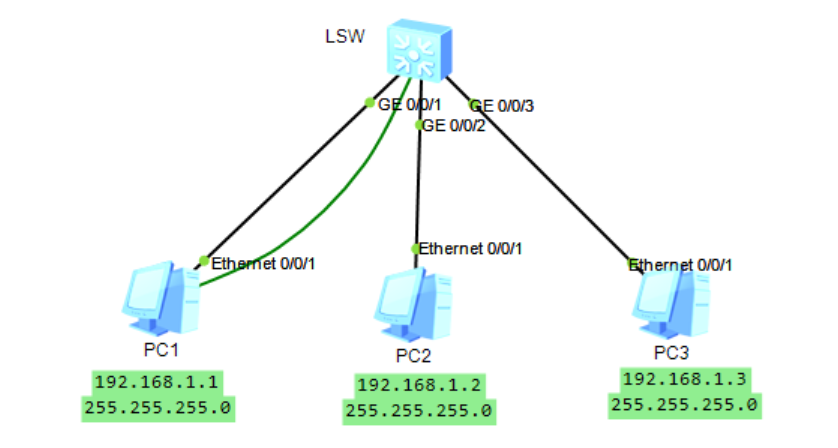
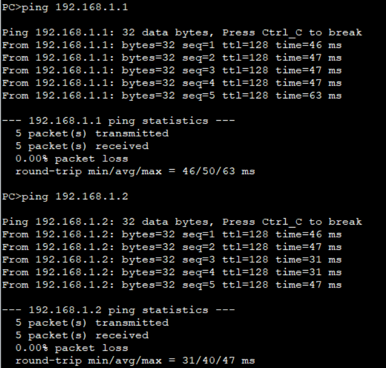
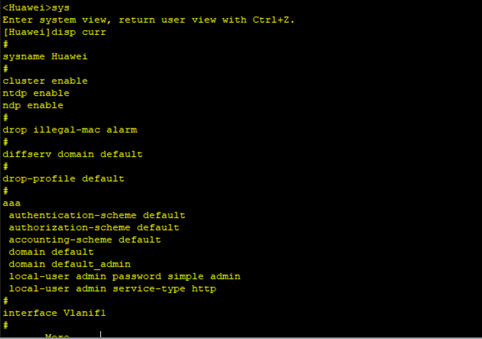

# 实验1：网络基础知识及双绞线制作、访问网络设备实验

## 一、实验目的

1. 学习访问网络设备的方法

2. 熟悉网络连接设备及附件的使用

3. 学习交换机和路由器配置管理的方法和指令

## 二、实验设备

1台交换机，3台主机，3根网线，1根console线

## 三、实验内容

1. 每组：1台交换机通过网线连接3台电脑PC，构建小的星型以太网 
2. 为3台PC配置相同子网的不同ip，用ipconfig查看网卡有关配置信息 
3. 用ping命令：测试从本机源地址到目标ip的网络连通情况
4. 为PC配置不同子网的ip，互相ping测试等，理解IP有关知识点。验证：同一个网段子网的机器可以直接通讯；不同子网下则不通 
5. 画好网络拓扑图，标注清晰有关信息，做好实验记录，理解网络知识点
6. 练习：通过CONSOLE口，熟练使用超级终端软件访问网络设备，学习交换机常用命令 7、display current-configuration：查看配置信息，并理解
7. 每人做一根标准的网络直通线

## 四、实验过程与结果

### 4.1 网络基础实验

#### 建立网络拓扑图

> 由于截屏丢失，这里使用ensp绘制网络拓扑图，并模拟

#### 分配IP地址

并为3台主机分别配置同一子网下的不同IP地址，以及设置子网掩码。

#### PING 测试

本人在小组实验中为PC3，则对PC1 和 PC2进行 **ping测试**：

### 4.2 双绞线制作

#### 具体步骤

1. 先抽出一段双绞线，把外皮剥掉一小段
2. 将4个线对，分别反向解开、捋直
3. 按568B标的网络平行线色序排列
4. 捏紧排线、绞齐线头
5. 把排线插入R45网络接头，要插到底、线序不能乱
6. 用压线钳使劲夹紧，多压紧几次
7. 制作网线的两端两个接头，使用测线仪测试该线的通断情况；两端的指示灯应该对应序号闪亮，表明双绞线线路正常OK

<u>网络平行线色序：白橙、橙、白绿、蓝、白蓝、绿、白棕、棕</u>

### 4.3 使用超级终端

练习使用超级终端软件，熟悉常用指令

常用命令：

- `system-view` 进入系统视图模式，可缩写为`sy`、`sys`等；
- `sysname`为设备命名；
- `display` 显示，可缩写为`di`、`dis`、`disp`等；
- `display current-configuration` 显示当前配置情况；
- 常用 `undo`一删除，取消该命令后面的操作；
- `undo shutdown` 打开关闭的端口等等。

## 五、实验心得

通过本次实验，我对于网络基础知识有了更深的理解，更深刻体会了IP地址，子网掩码以及网关的作用，搞清楚了什么叫做同一网段。自己亲手实践做出了一根功能正常的网线，了解了网线色序。