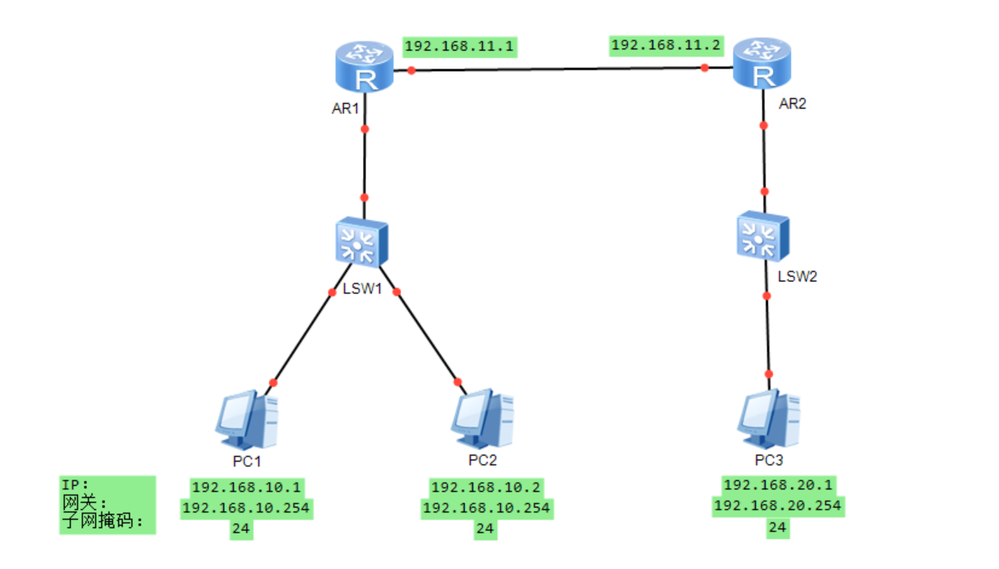
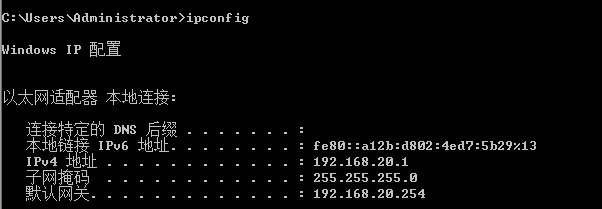
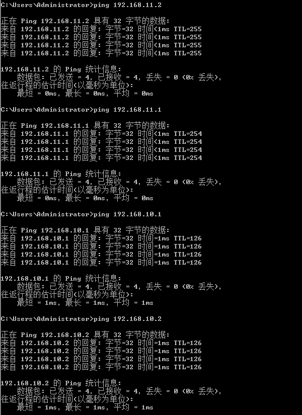
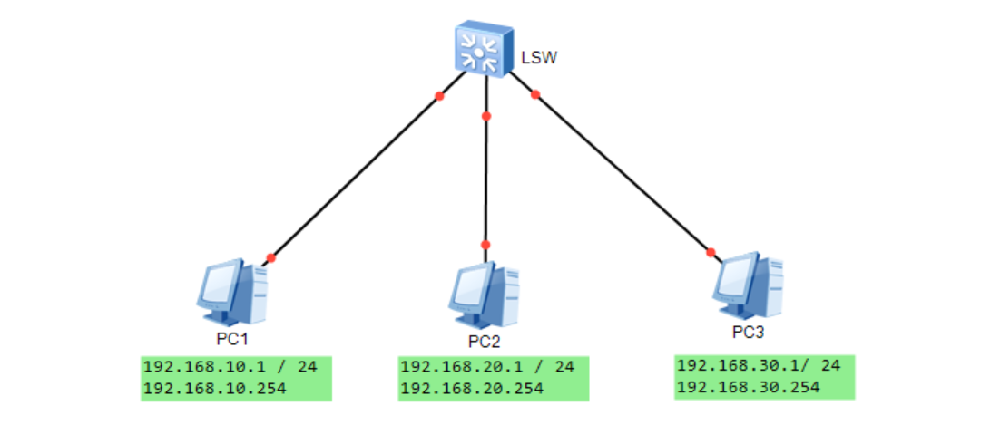
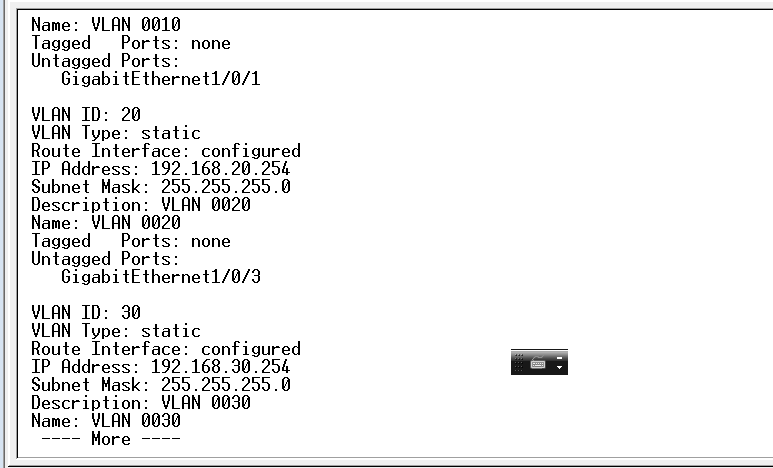
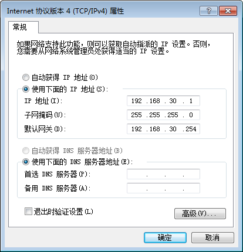
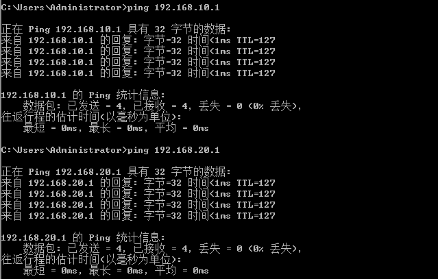

# 实验5：静态路由与三层交换机配置实验


# 5.1 静态路由实验

## 一、实验目的

1. 掌握静态路由原理和配置方法
2. 掌握查看路由表的方法

## 二、实验设备

两台路由器，两台主机，若干双绞线，两根console线

## 三、实验内容

- 画好网络拓扑图，确定实际网段的ip地址等信息
- 按划分的网段将硬件设备连接好，再接通电源；
- 配置计算机ip地址、子网掩码和网关；
- 配置路由器ip地址和路由表；
- 测试网络连接。

## 四、实验过程及结果

### 网络拓扑



### 配置路由器

配置路由器1：

``` fortran
int e0/0/1
ip address 192.168.10.254 24
int e0/0/0
ip address 192.168.11.1 24
quit
ip route-static 192.168.20.0 24 192.168.11.2
dis ip routing-table
```

配置路由器2：

``` fortran
int e0/0/1
ip address 192.168.20.254 24
int e0/0/0
ip address 192.168.11.2 24
quit
ip route-static 192.168.10.0 24 192.168.11.1
dis ip routing-table
```

### PING 测试

我是PC3：



ping PC2、PC3：



## 五、实验心得

通过本次实验，我了解了静态路由的原理及其配置，即ip route-static 目的网段 子网掩码  下一跳；了解了动态路由rip原理及其配置；进一步搞明白了静态路由与动态路由的区别。


# 5.2 三层交换机实验

## 一、实验原理

三层交换机可以达到和路由器一样的效果，实现不同网段的通信。具体做法是划分vlan，再将vlan子端口的ip地址设为主机的网关从而达到传递数据包的效果。

## 二、实验设备

一台交换机，三台主机，若干双绞线，一根console线

## 三、实验内容与过程

- 分别建立3个VLAN,分别为vlan 10，20，30

- 分别把接口GigabitEthernet1/0/1， 1/0/2, 1/0/3分给3个VLAN,

- 通过三层交换机的三层路由功能实现3个VLAN之间能互连互通。

- Vlan子接口IP 地址分别配置为192.168.10.1 ，20.1，30.1

- 分步骤PING测试验证：

  1. cmd命令行下，ipconfig查看IP和网关，再ping自己的网关，

  2. ping另外一个VLAN的虚拟子接口ip，ping目标主机；
  3. 再ping另外一个VLAN的虚拟子接口ip，ping目标主机；

### 实验拓扑图



#### 配置IP、网关、子网掩码

按照拓扑图配置IP、网关、子网掩码

#### 划分vlan

按照拓扑图配置划分vlan



### 配置三层交换机

``` fortran
[SwitchE528] interface Vlan-interface 10  
[SwitchE528-Vlan-interface10] ip address 192.168.190.1 24
```

## 四、实验结果

小组实验中，我是PC3：



ping PC2、PC3 测试：



## 五、实验心得

通过本次实验，我认识到三层交换机可以达到和路由器一样的效果，实现不同网段的通信。