# 计算机网络——传输层

[TOC]

# ch23

## 23.1 进程到进程的传递

传输层负责进程到进程的传递，即进程之间的分组传递以及部分消息传递。

### 传输层特性

- 网络层监管独立分组从源端到目的端的传递，但不辨认分组之间的关系；传输层负责**进程到进程的传递**，监管差错控和流量控制，确保全部报文完整地按序到达。
- 传输层的**流量控制**和**差错控制**是**端到端**的。
- 传输层协议可以是**无连接**的，也可以是**面向连接**的。
- 在传输层，一个报文通常**被划分为可传输的段**。无连接的协议对每段独立处理，面向连接的协议需要序号生成这些段之间的关系。

**数据传送类型**

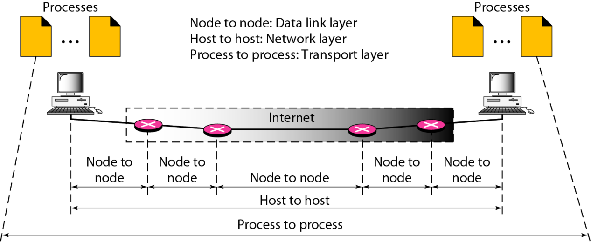

### 寻址

- 数据链路层：节点到节点 —— MAC地址

- 网络层：主机到主机 —— IP地址

- 传输层：进程到进程 —— 端口号

  - 客户端：临时端口号
  - 服务器端：熟知端口号

  > 16位， 0 ~ 65535之间的整数  

**端口号**

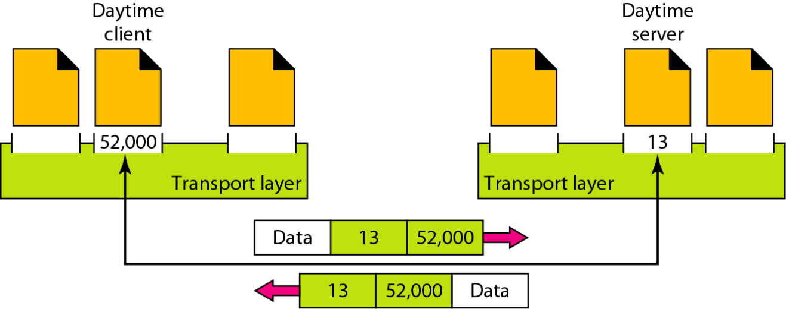

**IP地址与端口号**

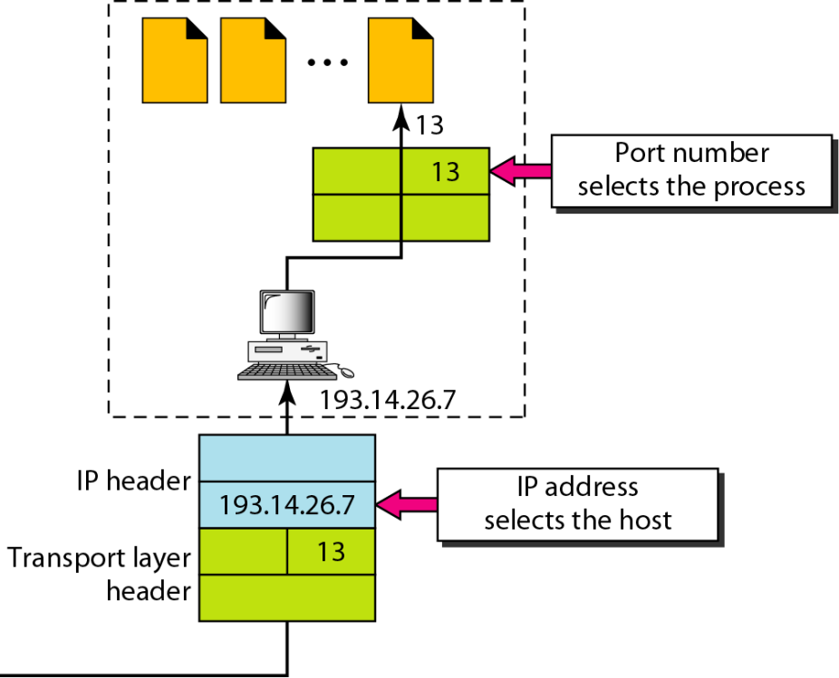

**端口号——IANA范围**

> IANA (Internet Assigned Number Authority)：因特网号码分配管理局  

- 熟知端口号： 0 ~ 1023，由IANA分配和控制
- 注册端口号： 1024 ~ 49151，在IANA注册
- 动态端口号：49152 ~ 65535，临时使用  

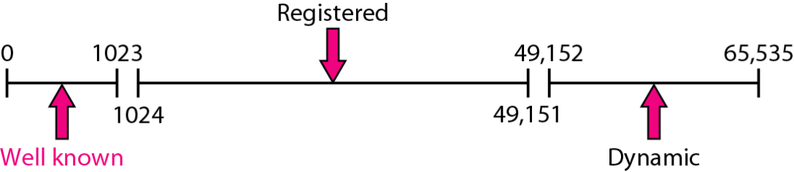

**套接字地址**

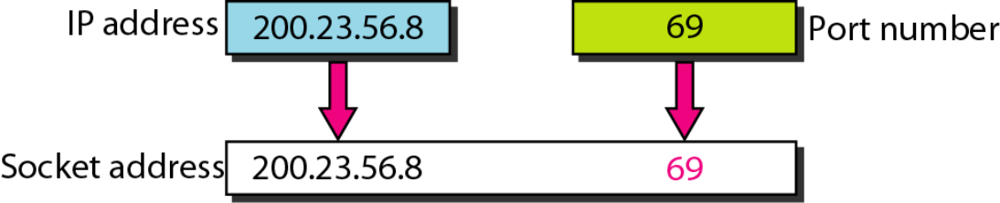

- IP地址+端口 = 套接字
- 套接字唯一标识了一个进程
- 一个TCP连接被一对套接字地址确定

**复用和分离**

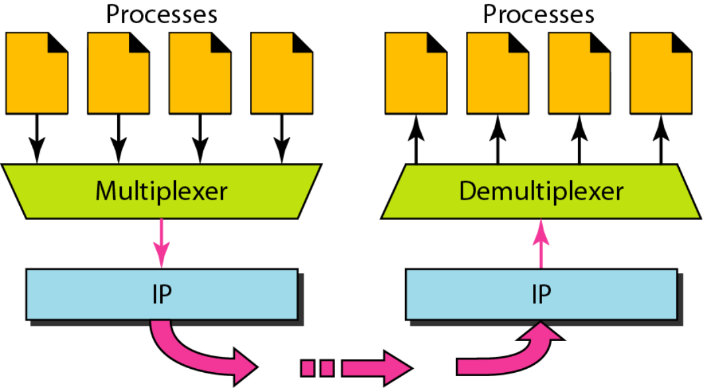

- 复用
  - 在发送方站点，可能有多个进程要发送分组。但是，在任何时候只有一个传输层协议。这是一种多对一的关系，因而需要复用。
  - 传输层协议接收来自不同进程的报文，这些进程是由分配给它们的端口号进行区分。添加了头部以后，传输层把分组发送给网络层。    
- 分离
  - 在接收方站点，也只有一个传输层协议，但有多个进程可能要接收分组。这是一对多的关系，因而需要分用。  
  - 传输层接收来自网络层的数据报。经过纠错和去除头部以后，传输层根据端口号将每个报文传递到适当的进程。  

### 服务

- **无连接服务(connectionless service)**
  - 不可靠服务，无连接，无确认，无编号
  - 延迟、丢失、重复、失序
  - UDP

- **面向连接的服务(connection-oriented service)**
  - 可靠服务，建立连接
  - TCP、 SCTP

**差错控制**

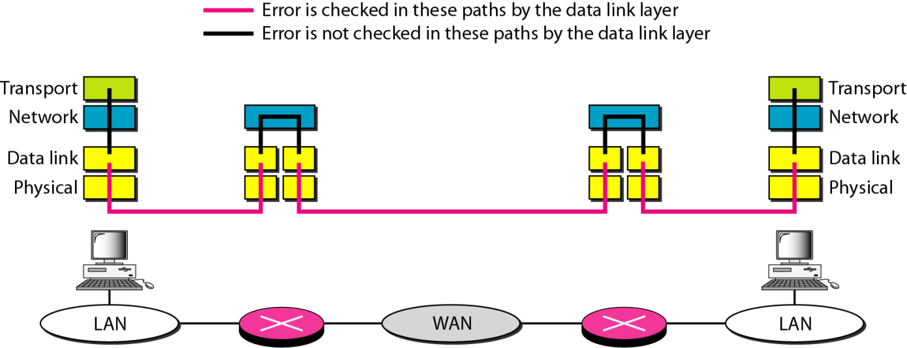

数据链路层的可靠性存在于两个节点之间，网络层提供不可靠的服务，因此端到端的可靠性需要在传输层实现。

**UDP、 TCP和SCTP在TCP/IP协议簇中的位置**  

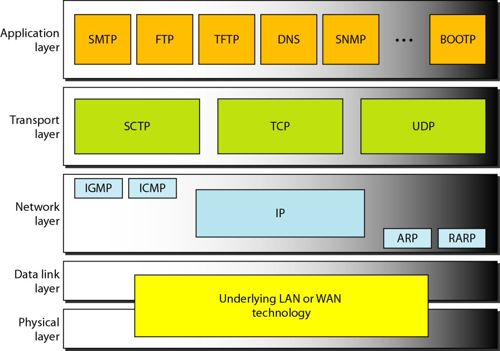

**TCP和UDP协议的应用场景**

- **TCP**的应用场景：
  - 客户端程序和服务器端程序**需要多次交互**才能实现特定功能应用。
    - 如接收电子邮件POP3， 发送电子邮件SMTP， 传输文件FTP等。
  - 应用程序传输的文件**需要分段传输**。 
    - 如浏览器访问网页时网页中的图片和HTML文件需要分段后发送给浏览器， QQ传文件时也需要进行分段， 此时使用TCP协议。
- **UDP**的应用场景：
  - 客户端程序和服务器端程序通信， 应用程序发送的数据包**不需要分段**。
    - 如域名解析时的请求报文和返回的解析结果。
  - **实时通信**。发送方和接收方需要实时交互，不允许较长时延。
    - 如QQ或微信语音聊天。
  - **多播**或**广播通信**。

## 23.2 用户数据报协议 UDP (User Datagram Protocol)

用户数据报协议(UDP) 称为**无连接的不可靠的**传输层协议。 它除了提供进程到进程而不是主机到主机的通信外， 没有给IP服务增加任何东西。 协议简单， 开销小。  

### 23.2.1 UDP 熟知端口

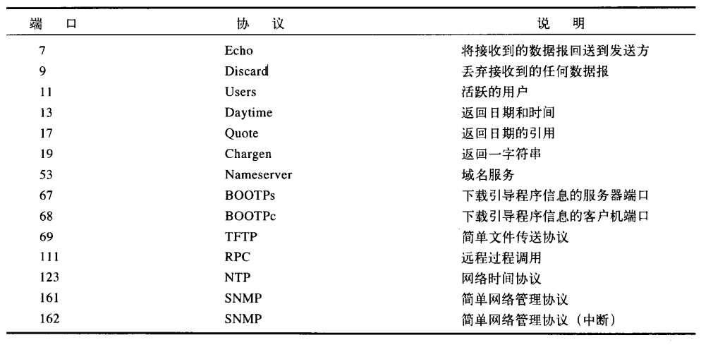

### 23.2.2 用户数据报格式

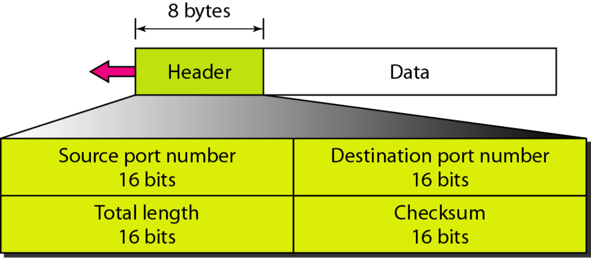

==UDP长度 = IP长度 – IP首部长度==

- **源端口号 source port number**
  - 源主机上运行的进程使用的端口号。
  - 它有 16位长，这就表示端口号可以从0到65535 。
  - 如果源主机是***客户端 (当客户进程发送请求时)*** ，那么大多数情况下这个端口号就是**暂时端口号**，它由该进程请求，由源主机上运行的UDP软件进行选择。
  - 如果源主机是***服务器(当服务器进程发送响应时)*** ，那么在大多数情况下这个端口号是**熟知端口号**。
- **目的端口号 destination port number**
  - 在目的主机上运行的进程使用的端口号。
  - 它有 16位长。
  - 如果目的主机是***服务器(当客户进程发送请求时)*** ，那么在大多数情况下这个端口号是**熟知端口号**。
  - 如果目的主机是***客户端(当服务器进程发送响应时)*** ，那么大多数情况下这个端口号是**暂时端口号**。在这种情况下，服务器将它接收到的请求分组中的暂时端口号复制下来。
- **长度 total length**
  - 这是一个 16位字段，它定义了用户数据报的总长度，头部加上数据。 
  - 16位可定义的总长度是从0到 65 535字节。
  - 但是，总长度必须比这个小。因为 UDP 数据报存放在具有总长度为65 535字节的 IP 数据报中。

- **校验和 checksum**
  - 这个字段用来校验整个用户数据报 (头部加数据) 出现的差错。  

#### 校验和

- 这里校验包括三个部分：**伪头部** 、**UDP头部**和**从应用层来的数据**。
- **伪头部 (pseudoheader)** 是 IP分组的头部的一部分，其中有些字段要填入0 ，用户数据报封装在IP分组中

用于校验和计算的伪头部：

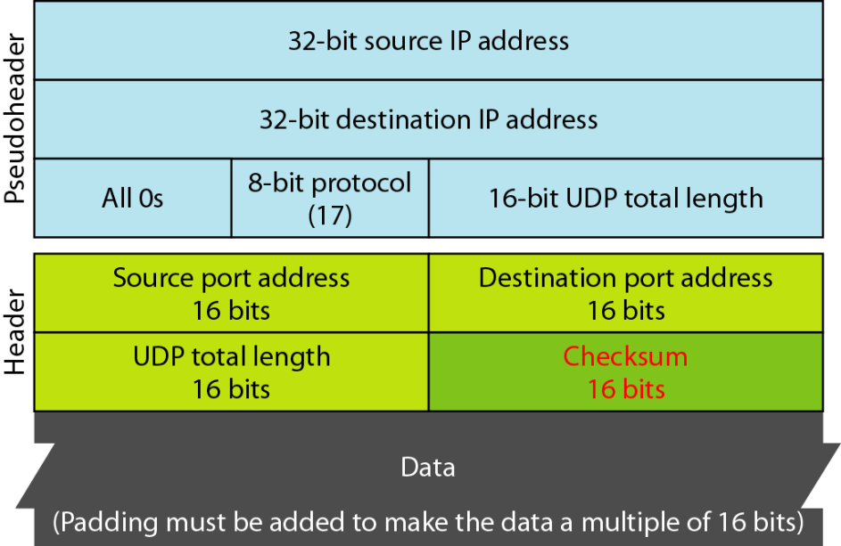

- 如果校验和不包括伪头部，用户数据报也可能是安全的和正确地到达。但是，如果 IP头部受到损坏，那么它可能被提交到错误的主机。  
- 增加协议字段可确保这个分组是属于 UDP ，而不是属于其他传输层协议。  

> 简单UDP用户数据报的校验和计算  
>
> 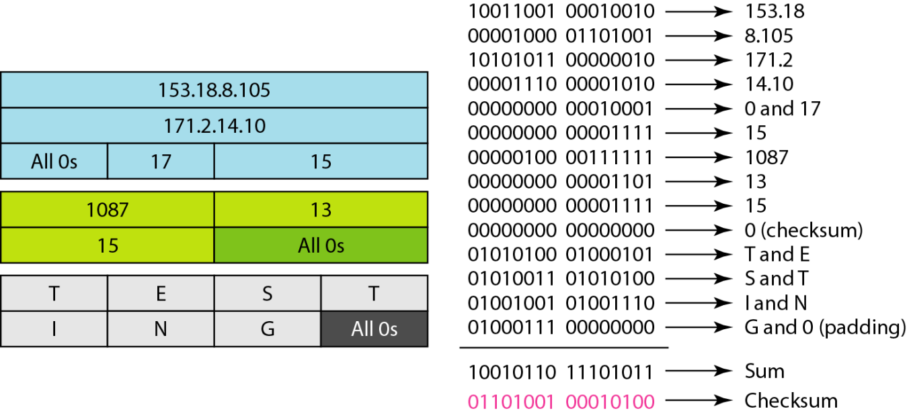
>
> - 因为数据的字节数是奇数， 因此为了计算校验和需要**填充**。 
> - 当用户数据报传递给IP时， 就将**伪头部**和**填充部分**丢弃。  

### 23.2.3 UDP 的特点

- **无连接的服务**。 独立数据报，无编号，无连接，沿不同路径传递，减小了建立连接的开销和时延。
- **尽最大努力交付**。不保证可靠传输，无需维持复杂的连接状态，节省系统资源。
- **面向报文**。对应用层交付的报文，既不合并也不拆分，一次交付一个完整的报文。应用程序需选择合适大小的报文，报文太长时由网络层分片。
- **无流量控制和差错控制**。 没有流量控制，也没有窗口机制；除校验和之外没有差错控制，使用UDP的进程自己必须要有流控和差错控制。接收方可能溢出，报文可能丢失或重复，出错时悄悄丢弃。
- **无拥塞控制**。网络出现拥塞时不会使源主机的发送速率降低，适用于允许网络拥塞时丢失一些数据但不允许太大时延的实时应用。
- 支持**一对一**、**一对多**、**多对一**和**多对多**的通信。
- **首部开销小**。

#### UDP 中的队列

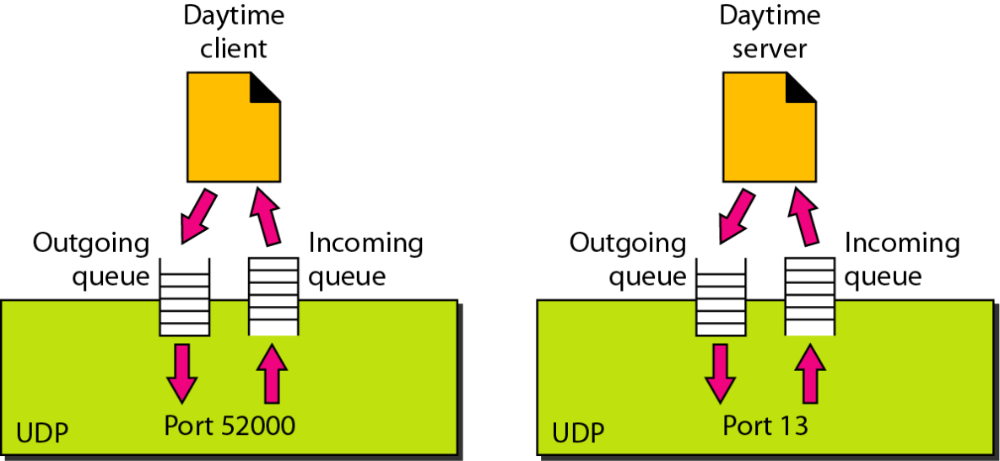

### 23.2.4 UDP 的使用

- 适用于需要有简单请求 - 响应通信的进程，较少考虑流量控制和差错控制： P2P
- 适用于具有内部流量控制和差错控制的进程： TFTP
- 适用于多播
- 适用于网络管理：SNMP
- 适用于某些路由协议：RIP

## 23.3 传输控制协议 TCP (Transmission Control Protocol)

- TCP 是一个**面向连接**的协议， 它在两个TCP之间建立一个虚拟连接来发送数据。 
- TCP 在传输层使用**流量控制**和**差错控制**机制。  
- TCP 提供**全双工服务 (full-duplex service)**。

### 23.3.1 TCP 服务

**TCP 使用的熟知端口**

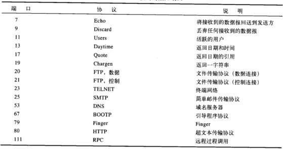

**字节流传递**

- 假想的"管道"连接
- 发送进程产生 (写入) 字节流，而接收进程消费 (读出) 这些字节流。  

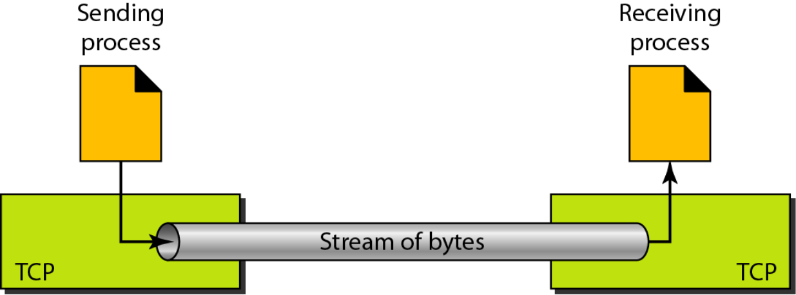

**发送和接收缓冲区**

因为发送和接收进程可能<u>以不同的速度写入和读出数据</u>，所以TCP需要<u>用于存储的缓冲区</u>。

实现缓冲的一种方法是<u>使用一字节存储单元的**循环数组**</u>。  

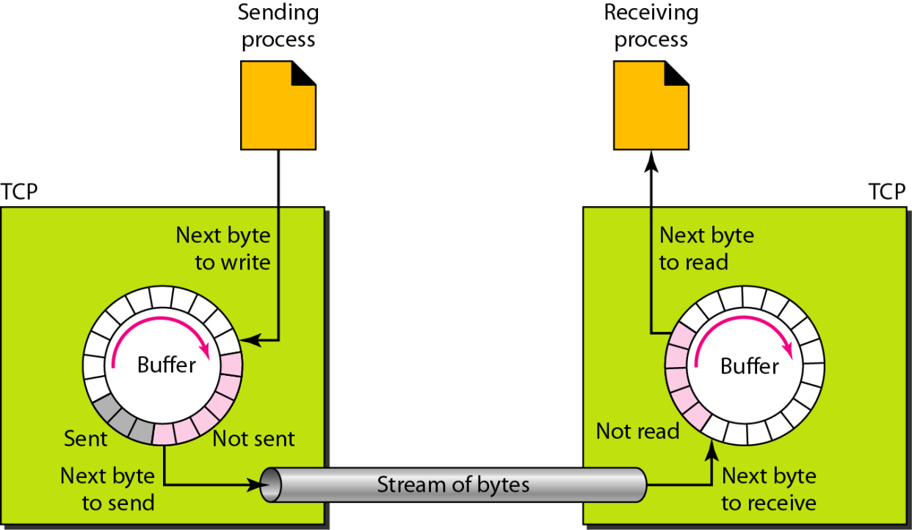

**TCP 段 (Segment)**

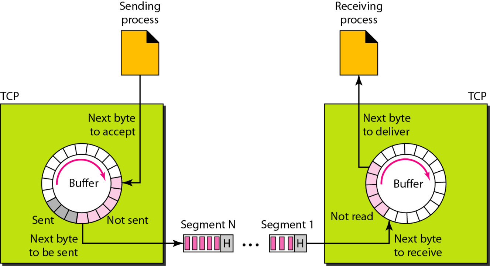

**TCP 流的概念**

1. 在两个TCP之间建立一个连接
2. 在两个方向交换数据
3. 连接终止

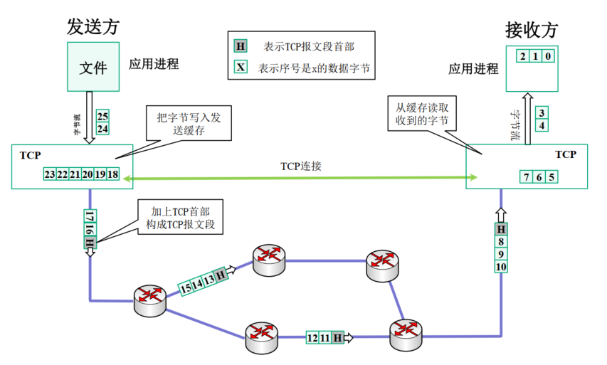

### 23.3.2 TCP 的特点

#### 序号系统

- TCP 在段的首部使用**序号**和**确认号**，它们都是**字节序号**，而不是段序号。
- 在每个连接中传送的字节都由TCP编号，第一个字节的序号开始于 0到 2^32^-1之间的一个随机数。
- 字节被编号后， TCP对发送的<u>每一个段分配一个**序号**</u>，用这个段的**第一个字节的序号**表示。
- **确认号**定义了通信一方**预期接收**的<u>下一个字节的编号</u>。
- **确认号**是<u>累加的</u>，表示接收方已正确地接收到最后一个字节的序号，**加1**并通告这个结果作为确认号。

> 每一个段的序号， 其中每个数据段携带1000字节:  
>
> 

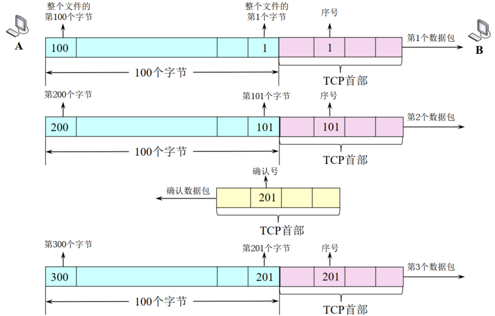

#### 流量控制

与 UDP不同的是， TCP提供**流量控制**。数据的接收方控制发送方发送数据的数量，这样做是为了防止接收方数据溢出。序号系统允许使用面向字节的流量控制。

#### 差错控制

为了提供可靠的服务， TCP有一个**差错控制机制**。虽然差错控制以段作为差错检测 (丢失或损坏段) 的数据单元。

#### 拥塞控制

与 UDP不同的是，TCP考虑网络中的**拥塞**。发送方发送的数据量不仅由接收方控制(流量控制) ，而且还要由网络中的拥塞程度决定。

### 23.3.3 段

#### TCP 段格式

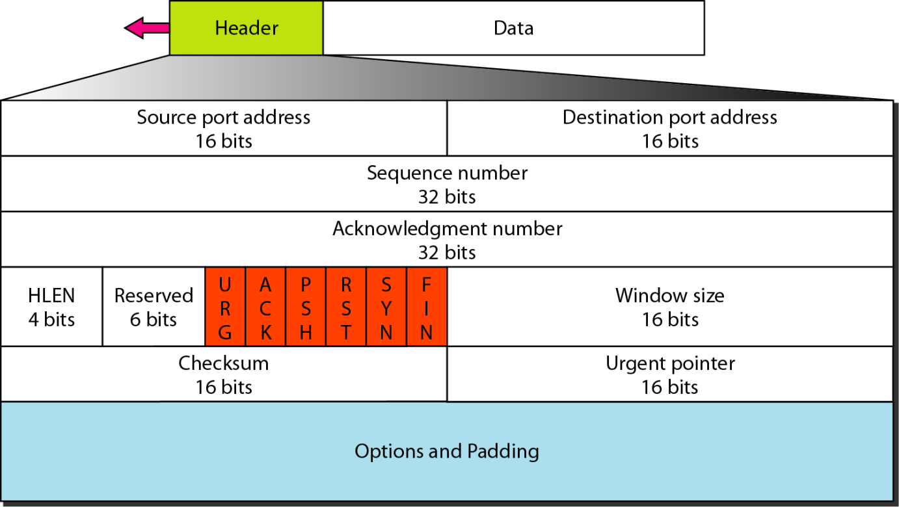

- **源端口和目的端口字段** ——各占 2 字节（16 bit）

  <u>端口是传输层与应用层的服务接口。</u>传输层的**复用**和**分用**功能都要通过端口才能实现。

- **序号字段** ——占 4 字节（32 bit）

  TCP 连接中传送的数据流中的每一个字节都编上一个序号。序号字段的值则指的是本报文段所发送的数据的第一个字节的序号。初始序号随机生成。

- **确认号字段 **——占 4 字节（32 bit）

  是期望收到对方下一个报文段数据的第一个字节的序号。首部长度——占 4 bit，其单位不是字节而是 4 字节，这个字段的值在 5（20字节）到 15（60字节）之间。

- **保留字段** ——占 6 bit

  保留为今后使用，但目前应置为 0。

- **控制字段** ——占 6 bit

  定义了6中不同的控制位或标记。用于TCP的**流量控制**、**连接建立**和终止、连接失败和数据传送方式等方面。  

  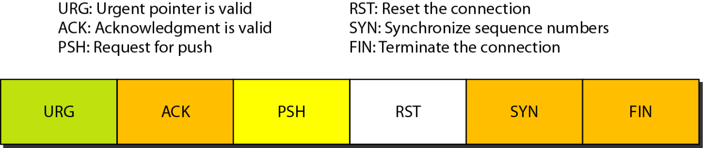

  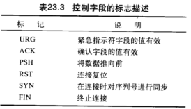

  - **URG：紧急指针。**置1时表示发送端应用程序告诉发送端TCP这块数据是紧急的，需要将紧急数据放在段的开始，接收端TCP利用紧急指针的值从段中取出紧急数据，并不按序地将其传递给接收应用。
  - **PSH：请求急迫。**发送端TCP不必等待窗口被填满，这个段包含的数据必须尽快地传递给接收应用程序，而不要等待更多数据的到来。

- **窗口字段** —— 占 2 字节（16 bit）

  窗口字段用来控制对方发送的数据量，单位为字节。TCP 连接的一端根据设置的缓存空间大小确定自己的接收窗口大小，然后通知对方以确定对方的发送窗口的上限。

- **检验和** —— 占 2 字节（16 bit）

  检验和字段检验的范围包括首部和数据这两部分。在计算检验和时，要在 TCP 报文段的前面加上 12 字节的伪首部。

- **紧急指针字段** —— 占 16 bit

  紧急指针指出：在本报文段中紧急数据共有多少个字节（紧急数据放在本报文段数据的最前面）。

- **选项字段** —— 长度可变

  TCP 只规定了一种选项，即**最大报文段长度 MSS (Maximum Segment Size)**。 MSS 是 TCP 报文段中的数据字段的最大长度。数据字段加上 TCP 首部才等于整个的 TCP 报文段。

### 23.3.4 TCP 连接

面向连接的传输有三个阶段： 

- **连接建立**
- **数据传输**
- **连接终止**

连接的管理就是使连接的建立和释放都能正常地进行。

连接建立过程中要解决三个问题：  

- 要使每一方能够确知对方的存在；
- 要允许双方协商一些参数（如最大报文段长度，最大窗口大小，服务质量等）；
- 能够对传输实体资源（如缓存大小，连接表中的项目等）进行分配。

#### a. 建立连接

##### 二次握手

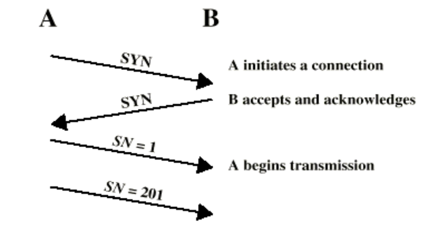

**二次握手存在的问题**

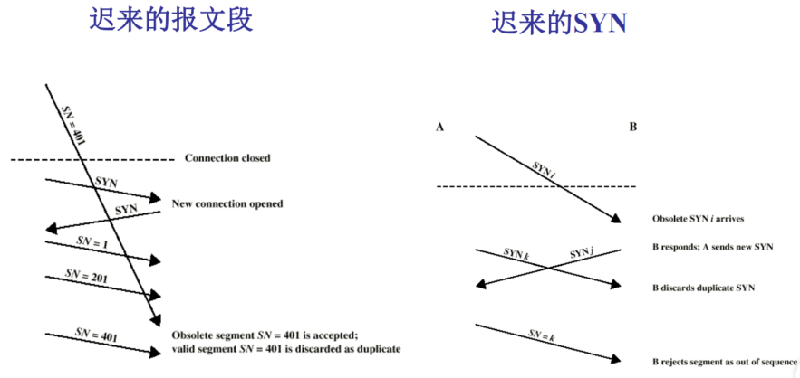

##### 三次握手

- **被动打开**：服务器程序告诉TCP，已准备好接受一个连接。它自己不能完成这个连接。
- **主动打开**：客户程序发出请求，告诉TCP它需要连接到特定服务器。

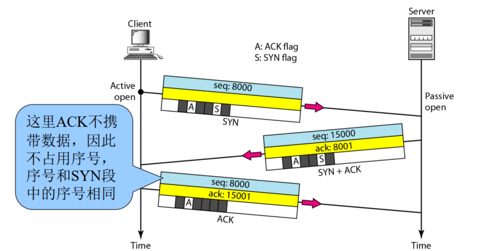

- SYN段不携带数据，但它占用一个序列号。
- SYN + ACK 段不携带数据，但它占用一个序列号。
- ACK段如果不携带数据，则它不占用序列号。  

##### 洪泛攻击

- TCP连接建立过程容易遭受SYN洪泛攻击，属于拒绝服务攻击（Denial of Service Attack）。恶意攻击者将大量SYN段发送到一个服务器，导致服务器资源耗尽。

- 应对策略：
  - 特定时间内限制连接请求；
  - 过滤来自不需要源地址的数据报；
  - 使用cookie推迟资源分配直到建立一个完整的连接。

#### b. 数据传输

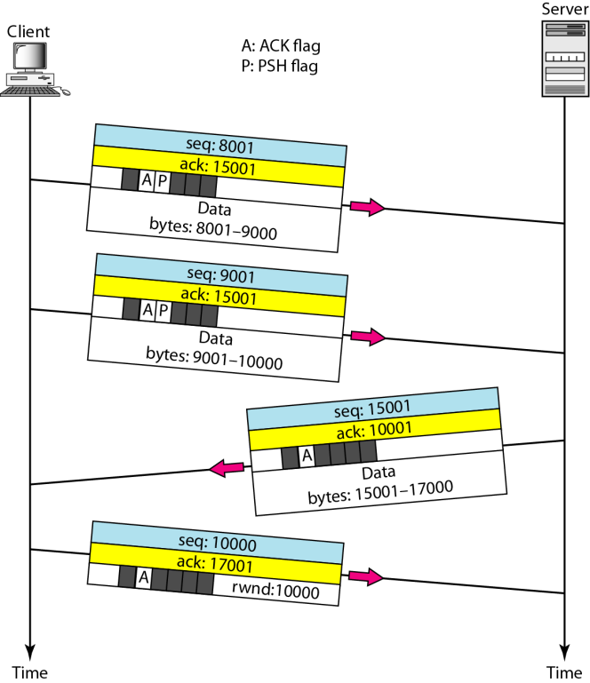

#### c. 终止连接

使用三次握手终止连接：

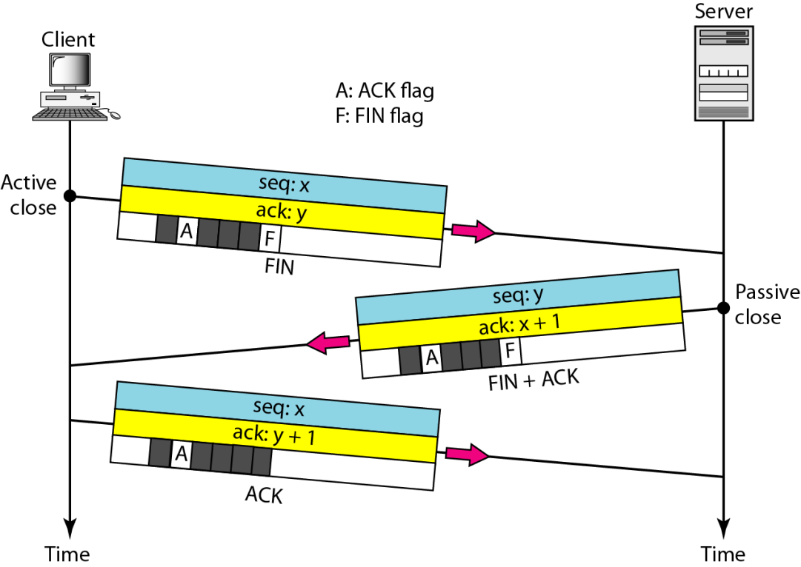

- 如果 FIN 段不携带数据，则该段占用一个序列号。
- 如果 FIN + ACK 段没有携带数据，则该段仅占用一个序列号。

##### 带有半关闭的四次握手

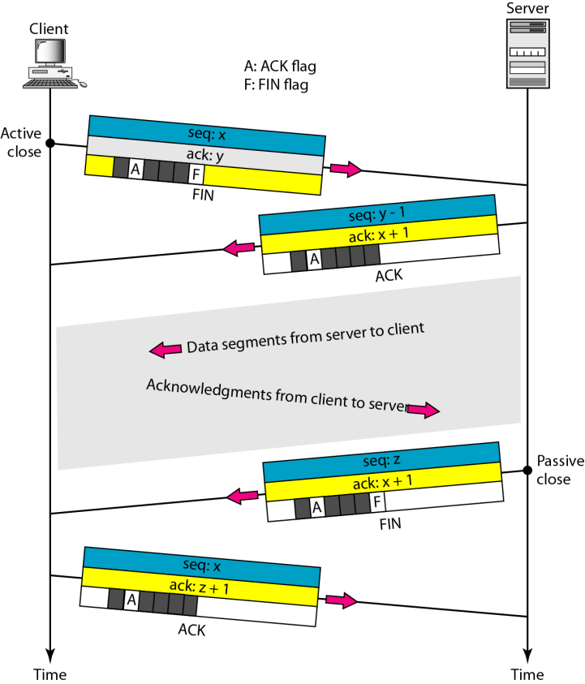

### 23.3.5 流量控制

- 如果发送方把数据发送得过快， 接收方就可能来不及接收， 这就会造成数据的丢失。
- 流量控制就是让发送方的发送速率不要太快， 既要让接收方来得及接收， 也不要使网络发生拥塞。
- 利用TCP的**滑动窗口机制**可以很方便地在TCP连接上实现流量控制。

> 传输层的流量控制相对于数据链路层的更复杂
>
> - 传输实体间的传输时延较长、
> - 传输时延是高度可变的

#### TCP 滑动窗口

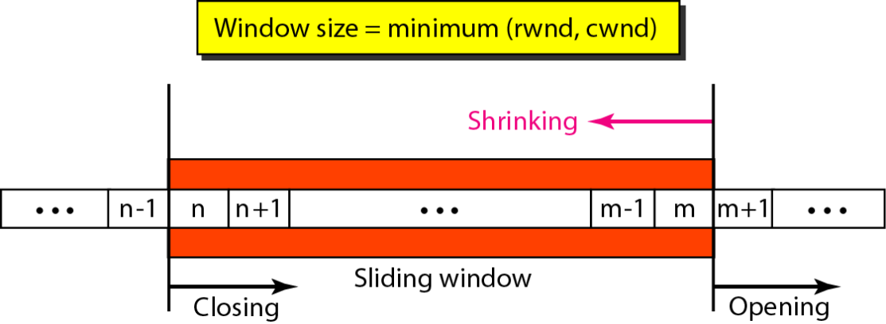

- TCP 的滑动窗口是**面向字节的**，数据链路层的滑动窗口是面向帧的；
- TCP 的滑动窗口是**可变大小的**，而数据链路层的滑动窗口是固定大小；
- 窗口的滑动是由**接收方**而不是发送方**控制**的，<u>发送方必须服从接收方的命令</u>；
- TCP窗口受**接收方窗口（rwnd）**和**拥塞窗口（cwnd）**大小的影响，<u>取两者中的最小值</u>；
- 发送方不必发送一个全窗口大小的数据；
- 接收方可暂时关闭窗口，之后发送方可发送一个1字节的探测报文。

#### TCP 通知窗口

- <u>**通知窗口**是接收方根据接收能力确定的窗口值。</u> 接收方将<u>通知窗口值放在报文首部中</u>发送给发送方。根据接收方工作状态来改变窗口大小是TCP流量控制的主要方法。
- 如果接收方读取数据的速度与数据到达的速度一样，接收方在每个确认中发送一个**非零的窗口**通告。 如果发送方比接收方速度快， 造成缓冲区被全部占用，接收方发送一个**“零窗口”** 通告， 发送方停止发送。

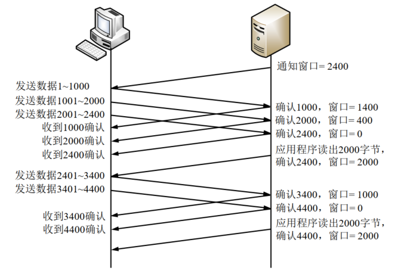

#### 糊涂窗口综合症 (Silly Windows Syndrome  )

> 如果TCP缓存已满， 而应用进程每次只从缓存读取1字节， 则接收缓存空出1字节， 接收方向发送方发送窗口为1的确认报文。
>
> 此时发送方会以41字节的代价发送1字节的数据（ 假设TCP和IP首部各20字节） ， 这样继续下去， **传输效率极低**。

解决办法是禁止接收方发送只有1字节的更新报文， 接收方会等待一段时间， 使得接收缓存具有足够空间接收一个较长的报文段后再发送窗口更新报文。

### 23.3.6 差错控制

- TCP是可靠的传输层协议， 使用差错控制来提供可靠性；
- 差错控制包括检测出报文的差错、 丢失、 失序和重复并纠正；

#### 差错检测和纠正的三种方式

- **校验和**：16位， 用来检查受到损坏的段。 如果损坏则会被丢弃。
- **确认**：数据段需确认， 不携带数据但占用序号的控制段也要确认， ACK段不需要确认。
- **超时**：差错控制的核心。 当一个段损坏、 丢失或延迟时需要重传。 <u>不占用序号的段不重传，尤其是ACK不重传。</u>

##### 重传的2种情况

- **RTO后重传**：<u>段或ACK延迟或丢失。</u> 根据段的往返时间RTT（Round-Trip Time） 设置重传超时RTO（Retransmission Time Out） 计时器的时间。
- **收到三个重复ACK**：<u>快速重传。</u>在重传计时器超时之前进行重传。

#### 失序控制

- 当一个段被延迟、 丢失或废弃时， 后面一些段的到达就失序了。
- <u>数据可以失序到达</u>， TCP暂时存储失序的段，并标记它们为失序的段直到缺少的段到达。
- 失序的段不传递给进程， <u>TCP确保传递给进程的段是**无失序的**</u>。

***正常操作***
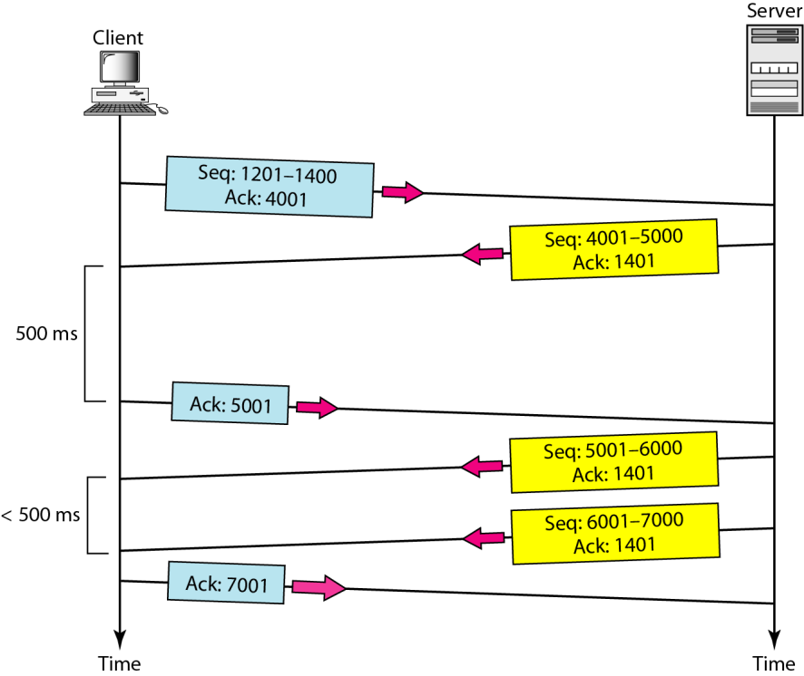

***丢失段***
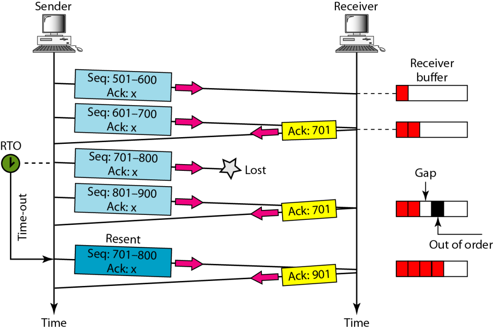

***快速重传***
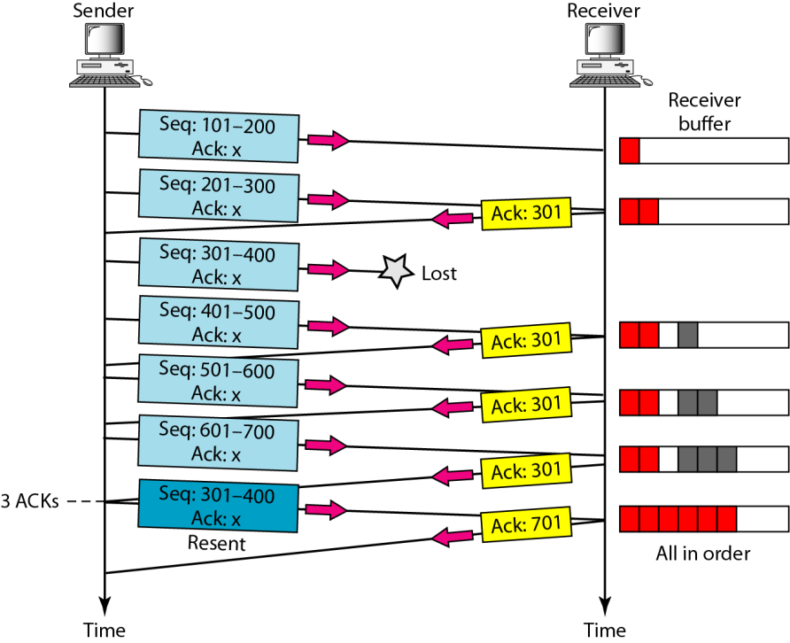

## 23.4 UDP 与 TCP 的区别

1. **连接**
   - TCP 是**面向连接**的协议，传输数据前先要建立连接。。
   - UDP 不需要连接，即刻传输数据。
2. **服务对象**
   - TCP 是一对一的两点服务，即一条连接只有两个端点。
   - UDP 支持一对一，一对多，多对多的交互通信。
3. **可靠性**
   - TCP 可靠交付数据，数据无差错、不丢失、不重复、按需到达。
   - UDP 是尽最大努力交付，不保证数据交付的可靠性。
4. **拥塞控制和流量控制**
   - TCP 有拥塞控制和流量控制机制，保证数据传输的安全性。
   - UDP 没有这两种控制机制，即使网络非常拥堵，也不会影响UDP的发送速率。

5. **首部开销**
   - TCP 首部长度较长（20-60字节） ， 存在一定开销。
   - UDP 首部只有8个字节， 并且是固定不变的， 开销较小。
6. **传输方式**
   - TCP 是字节流传输， 没有边界， 但保证顺序和可靠。
   - UDP 是一个包一个包发送， 有边界， 但可能会丢包和乱序。
7. **分片不同**
   - TCP 的数据大小如果大于 MSS 大小， 则会在传输层进行分片，目标主机收到后，也同样在传输层组装TCP数据包， 如果中途丢失了一个分片， 只需要传输丢失的这个分片。
   - UDP 的数据大小如果大于 MTU 大小， 则会在IP层进行分片， 目标主机收到后， 在 IP 层组装完数据， 接着再传给传输层。 但是如果中途丢了一个分片， 在实现可靠传输的 UDP 时则就需要重传所有的数据包， 这样传输效率非常差， 所以<u>通常 UDP 的报文应该小于MTU</u>。

**网络层提供不可靠的服务**

- 给传输层带来了很大的困难
  - 段可能会丢失
  - 段可能会失序
- 传输层需要解决的问题
  - 连接建立 & 终止
  - 有序交付
  - 副本检测
  - 重传策略
  - 故障恢复
  - 流量控制
  - 拥塞控制

## 23.5 TCP 的拥塞控制 (Congestion Control  )

> - 如果网络中的载荷即发送到网络中的分组数量， 超过了网络的容量即网络中能处理的分组数量， 在网络中就可能发生**拥塞**。
> - **拥塞控制**指的是控制拥塞和使载荷低于网络容量的机制和技术。 
> - 拥塞会引起数据丢失、 时延增加、资源浪费和网络应用性能下降。  

### 23.5.1 拥塞控制与流量控制的关系

- **拥塞控制**所要做的都有一个前提， 就是网络能够承受现有的网络负荷。
- 拥塞控制是一个**全局性的过程**， 涉及到所有的主机、 所有的路由器， 以及与降低网络传输性能有关的所有因素。拥塞窗口通过对网络拥塞的监测来调整和限定TCP发送端的发送流量。
- 流量控制往往指在给定的发送端和接收端之间的点对点通信量的控制。
- 流量控制所要做的就是抑制发送端发送数据的速率， 以便使接收端来得及接收。

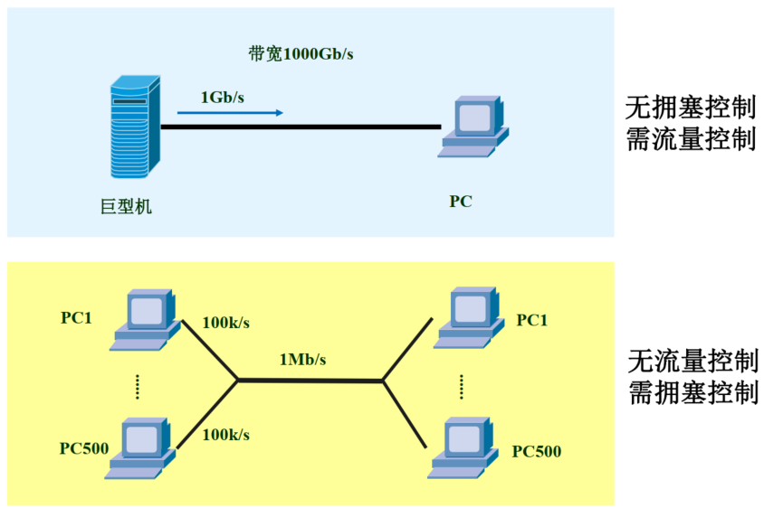

### 23.5.2 拥塞控制的策略

- 发送方控制拥塞窗口的**原则**：
  - 发送方维持一个拥塞窗口cwnd，其大小取决于网络的拥塞程度，且动态变化，发送方让自己的发送窗口小于等于cwnd。
  - 只要网络没有发生拥塞，拥塞窗口就再增大一些，以发送更多的分组。
  - 如果网络发生拥塞，就将拥塞窗口减小一些，减少发送到网络中的分组数，如果发送方没有按时收到确认报文，就猜想网络可能发生了拥塞。
- **接收方窗口** $rwnd$，**拥塞窗口** $cwnd$，**实际窗口** = $min(rwnd, cwnd)$
- **拥塞策略**：
  - 慢启动：很慢的传输速率启动，迅速增大到阈值
  - 拥塞避免：达到阈值后为避免拥塞降低数据速率
  - 拥塞检测：检测到拥塞返回到慢启动或拥塞避免

#### a. 慢速启动：指数增长

- **慢启动**： TCP发送端先以一个较低的数据率发送数据，例如先发送一个TCP报文， 其长度为1个MSS（Maximum Segment Size） ， 如果在重传定时器超时之前收到对该数据段的正确确认， 则成倍增加这个拥塞窗口使其变为2个MSS…… 以此类推直至达到阈值。
- 简化前提：使用报文的个数而不是字节的个数； rwnd比cwnd大得多；每段单独确认。

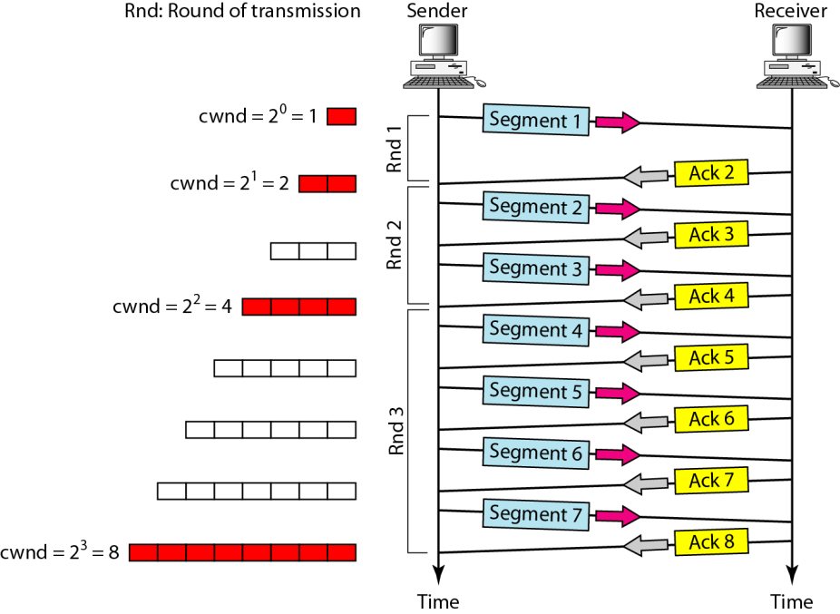

#### b. 拥塞避免：加性增加

- 当拥塞窗口的大小达到慢启动的阈值时，慢启动阶段停止，加性增加阶段开始。
- **拥塞避免**：不同于慢启动时发送数据速率的成倍增长，每次整个窗口所有段都被确认（一次传输）时，采用每次增加 1个MSS的递增方式，直到检测到数据丢失。

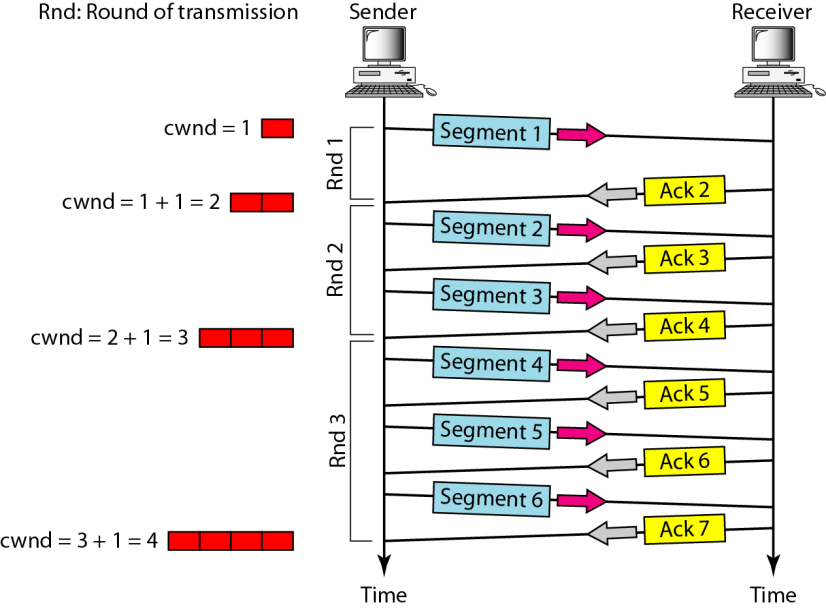

#### c. 拥塞检测：乘性减少

如果发生拥塞，必须减小拥塞窗口。发送方通过重传的要求判断拥塞程度。

- 如果检测到计时器超时，说明拥塞严重，可能发生了段的丢失， TCP做出强烈反应：

  - 设置阈值为当前拥塞窗口的一半；
  - 设置cwnd为1个段的大小；
  - 进入慢启动阶段。

  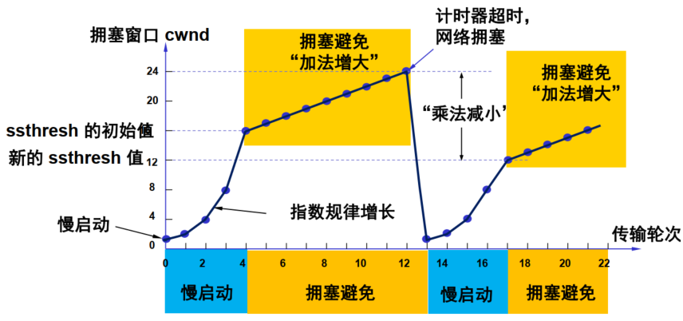

- 如果接收到三个ACK，说明轻度拥塞，一个段可能丢失，有些段可能到达，这个过程称为快速重传和快速恢复。
  TCP做出轻度反应：

  - 设置阈值为当前拥塞窗口的一半；
  - 设置cwnd
  - 为阈值的大小；
  - 进入拥塞避免阶段。

  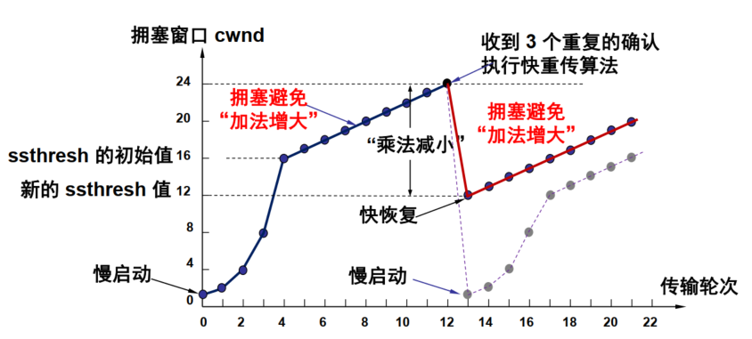

#### 策略总结

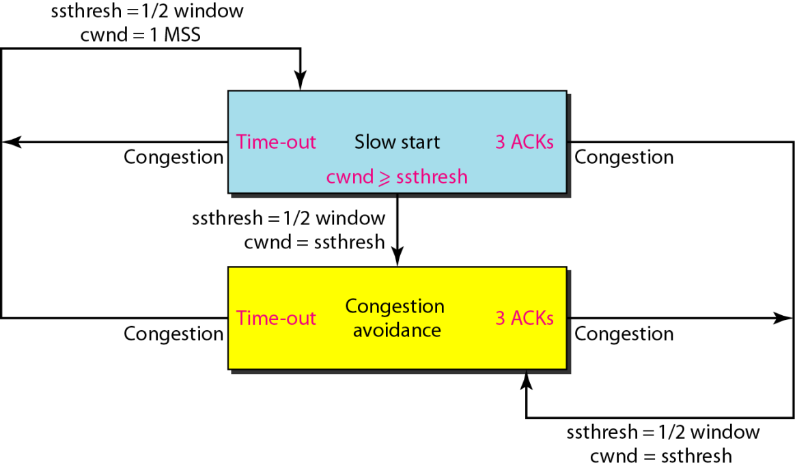

***例子***

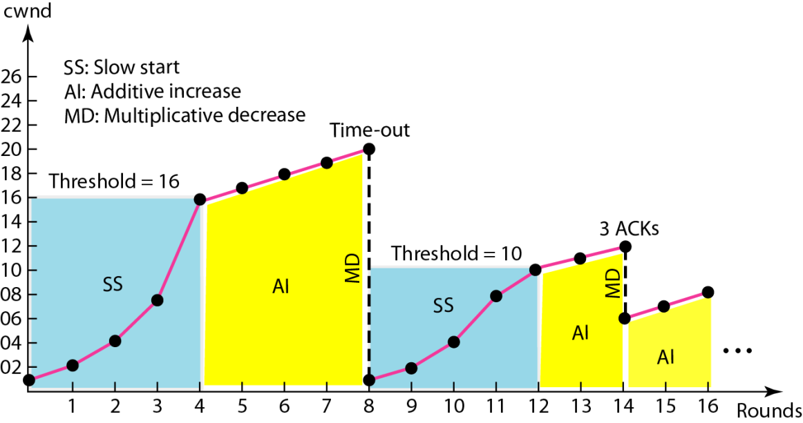