# 计算机网络——概述

[TOC]

# ch01 绪论

## 1.1 数据通信

- 电信(telecommunication)：一定距离上的通信  
- 数据(data)：以任何格式表示的信息， 该格式需要创建和使用数据的双方达成共识
- 数据通信(data communication)：两台设备之间通过诸如线缆的某种形式的传输介质进行的数据交换

### 数据通信系统的5个组件

- 报文(Message)：进行通信的信息（数据）
- 发送方(Sender)：发送数据报文的设备
- 接收方(Receiver)：接收报文的设备
- 传输介质(Transmission Medium)：报文从发送方到接收方之间所经过的物理通路
- 协议(Protocol)：管理数据通信的一组规则，表示通信设备之间的**一组约定**

### 数据的表示

- 文本(text)：编码，unicode，ASCII，GB码  
- 数字(number)
- 图像(image)：JPG，RGB，YCM（黄、紫、青）  
- 音频(audio)：MP3，APE  
- 视频(video)：MPG，RMVB，MP4  

### 数据流

- 单工模式(simplex mode)：通信是**单方向**的
- 半双工模式(half-duplex mode)：每台主机均能发送和接收，但**不能同时**进行
- 双工模式(full-duplex mode)：双方主机都能**同时**发送和接收

## 1.2 网络

**网络(network)**是用**通信链路**连接起来的设备(通常称为**节点**)的集合。 一个节点可以是计算机， 打印机， 或者能够发送、 接收由该网络上的其他节点产生的数据的任何其他设备。

### 计算机网络的定义与特征

- 定义：以能够相互共享资源的方式互联起来的自治计算机系统的集合
- 特征：
  - 计算机网络建立的目的是实现计算机**资源的共享**
  - 联网计算机之间的通信必须遵循**共同的网络协议**
  - 互联的计算机是分布在不同地理位置的**多台独立**的“自治计算机系统”

### 网络准则(Network Criteria)

- **性能(Performance)**：如传输时间， 响应时间
  - 吞吐量(throughput)
  - 延迟(delay)
- **可靠性(Reliablity)**
  - 故障出现的频率
  - 故障恢复所花费的时间
  - 灾难中的健壮性
- **安全性(Security)**
  - 保护数据免受未授权的访问
  - 传输过程中免受攻击
  - 丢失、 损伤的恢复策略和方法

### 物理结构(Physical Topology)

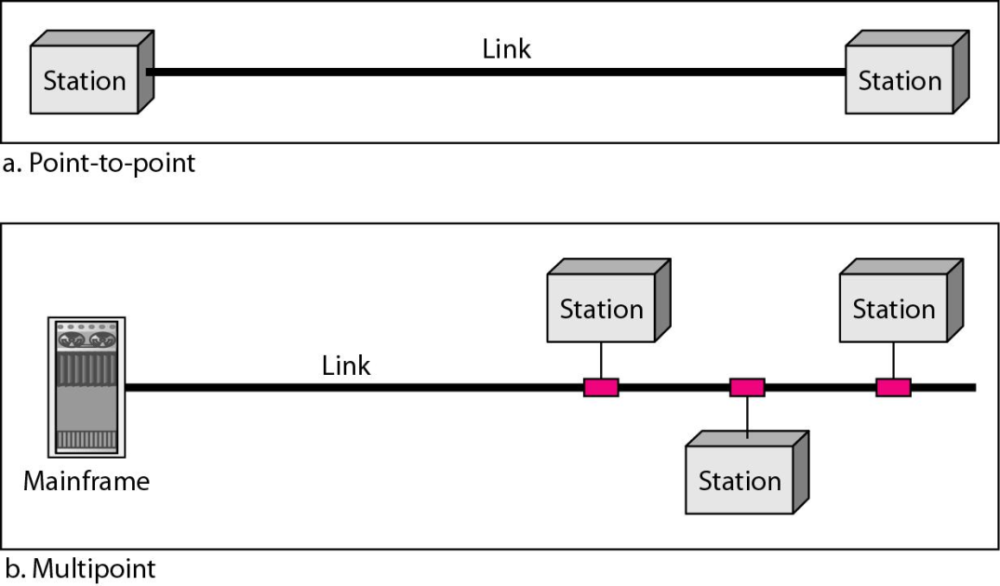

- **链路(Link)**：将数据由一台设备传输到另外一台设备的**通信通路**。 网络是通过链路连接在一起的多台设备。
- **连接类型**
  - 点到点(point to point)：链路全部的能力为两台设备之间的传输所共用， 即两台设备之间没有中间连接点。
  - 多点连接(multipoint connection, multidrop connection)

### 拓扑结构(Topology)

- **物理拓扑结构(physical topology)**：指的是网络物理上分布的方式。两台或更多设备连接到一条链路；来那条或更多的链路组成拓扑机构。

- **网络拓扑结构**：所有链路及其相互连接的设备（通常称节点）之间关系的几何表示。有4种可能的基本拓扑结构：

  - **网状(mesh topology)**：各台设备之间都有一条专用的点到点链路。*"专用的"*这个词意味着该链路只负责它所连接的两台设备间的通信量。  

    网状拓扑结构中需要：$n(n-1)/2条双工模式的链路$

    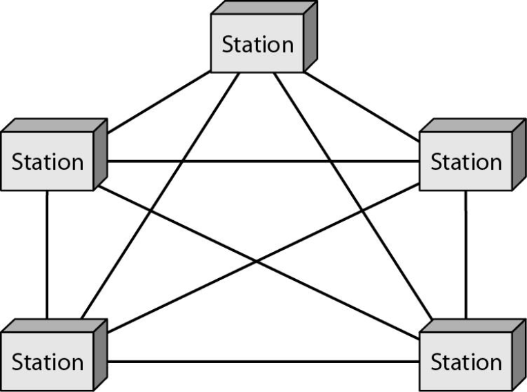

    - 优点
      - 消除了共享通信量的问题
      - 健壮性
      - 安全性和机密性
      - 易于故障识别和隔离
    - 缺点
      - 安装困难
      - 线缆数量多
      - 费用高

  - **星型(star topology)**：每台设备拥有一条仅与中央控制器连接的点到点专用链路，该中央控制器通常称为**集线器**(hub)。星型拓扑结构不允许设备之间有直接的通信量。集线器扮演交换的角色：如果一台设备想发送数据到另外一台，它需要将数据发到集线器，然后由集线器将数据转送给所连接的另一台设备。

    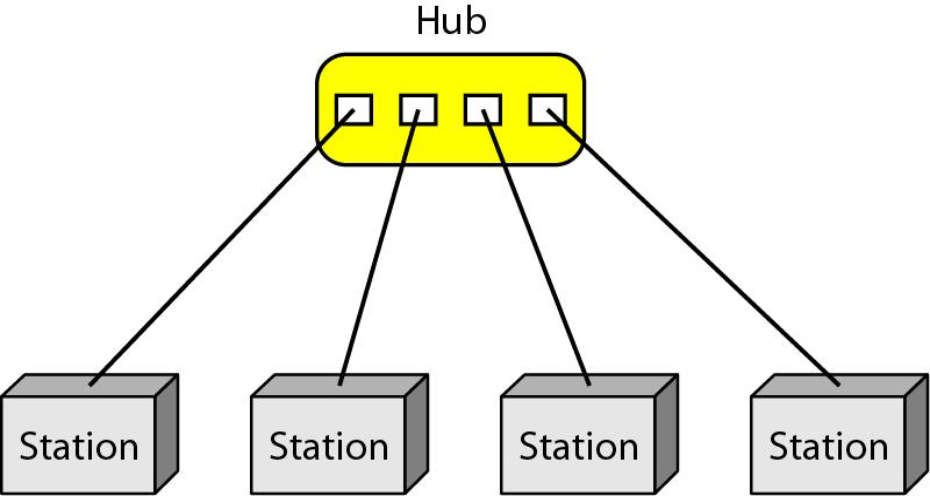

    - 优点
      - 易于安装和配置
      - 健壮性
      - 易于故障识别和隔离
      - 价格便宜
    - 缺点
      - 依赖于集线器
      - 线缆数量较多

  - **总线(bus topology)**：多点连接，由一条较长的线缆作为**主干**(backbone) 来连接网络上所有的设备。节点由引出线和分接头连接到总线电缆。**引出线**(drop line)是在设备和主线缆之间运行的连接。**分接头**(tap)是一个连接器，该连接器焊入主线缆或者穿过线缆的外皮与金属芯接触。  

    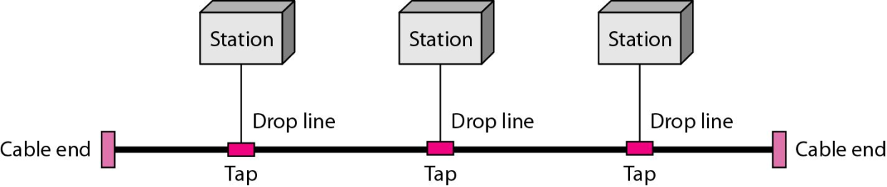

    - 优点
      - 安装简单
      - 线缆数量少
    - 缺点
      - 重新连接和错误隔离困难
      - 出现错误或中断会影响整条总线

  - **环状(ring topology)**：每台设备只与其两侧的设备有一条专用的点到点的连接，环中的每台设备中安装有一个**中继器**(repeater)，信号以一个方向在环中传输，从一台设备到达另一台设备，直到其到达目的设备。

    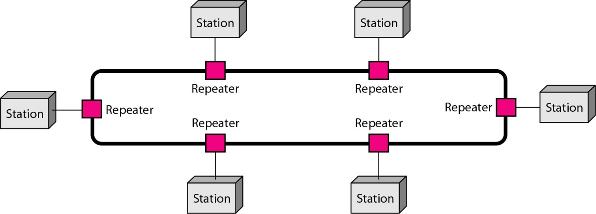

    - 优点
      - 易于安装和重新配置
      - 易于故障识别和隔离
    - 缺点
      - 单点故障引起整个网络瘫痪

  - **混合型拓扑结构**：一个星型结构为主干并具有三个总线结构的网络

    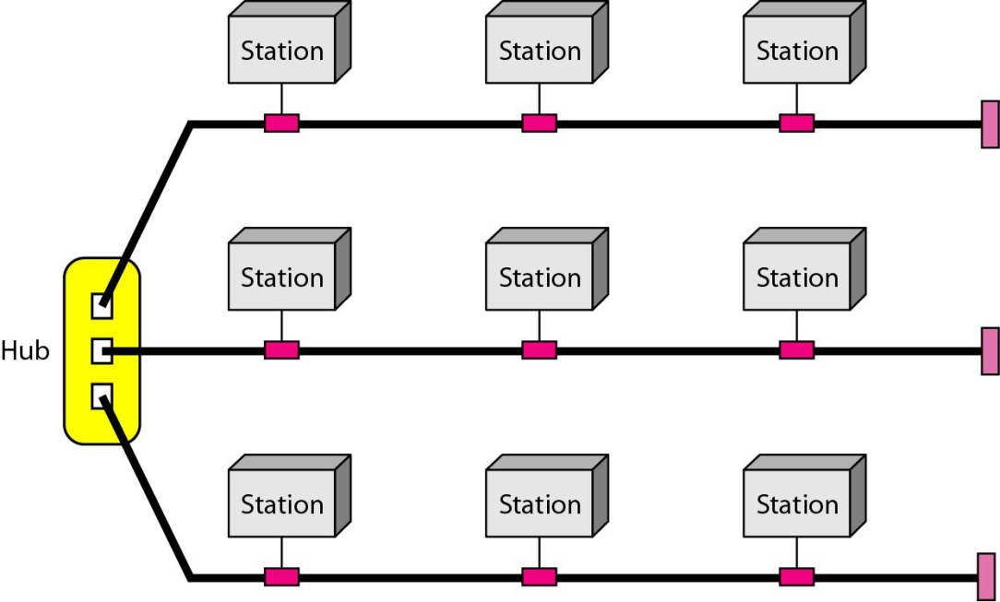

### 网络模型(Network Models)

- OSI(Open System Interconnection)模型
  - 7层模型
- Internet 模型
  - 5层模型  

### 网络分类——按网络覆盖的地理范围

- **广域网**(Wide Area Network, **WAN**)

  - 覆盖范围从几十公里到几千公里，可以覆盖一个国家、 地区，或横跨几个洲
  - 广域网将分布在不同地区的宽带城域网或主机系统互联，提供各种网络服务，实现信息资源共享

  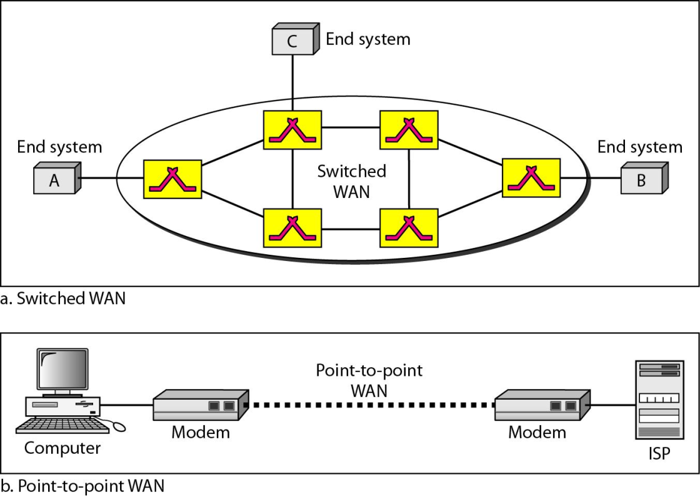

- **城域网**(Metropolitan Area Network, **MAN**)

  - 满足几十公里范围内大量企业、机关、公司的局域网互联需求，以实现大量用户之间的数据、语音、图形与视频等信息的传输
  - 宽带城域网的概念逐渐取代传统意义的城域网，已经成为目前研究、应用与产业发展的一个重要领域

- **局域网**(Local Area Network, **LAN**)

  - 用于将有限范围的各种计算机、终端与外部设备互联，一般是方圆几公里以内
  - 局域网技术发展迅速，应用日益广泛

  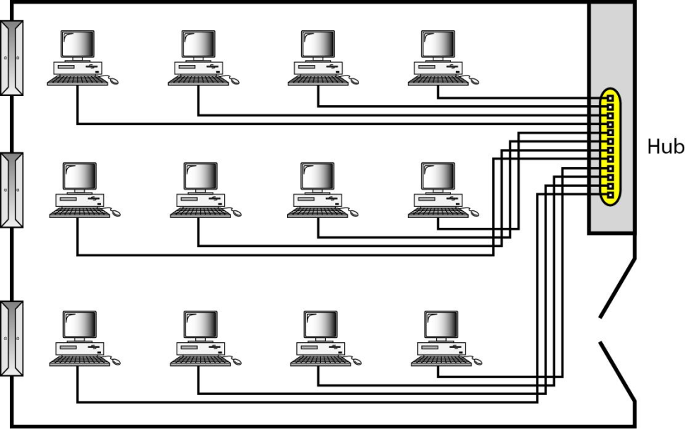

- **个人区域网**(Personal Area Network, **PAN**)

  - 个人区域网覆盖范围最小，用于连接计算机、平板电脑、智能手机等数字终端设备
  - 主要以无线技术实现联网设备之间的数据传输， 因此可定义为无线个人区域网(WPAN) 

### 网络互联：因特网

当两个或多个网络彼此连接，它们成为互联网络(internetwork)，即**互联网**(Internet)

四个广域网和两个局域网组成的混合网络：

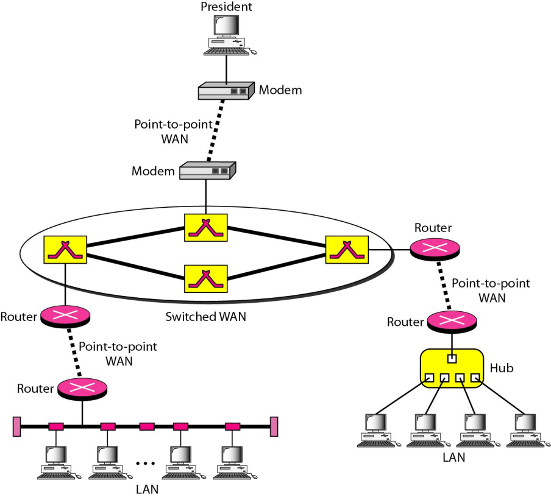

网络体系结构：**求同存异**

## 1.3 因特网

因特网是一个通信系统， 是一个结构化的， 组织化的系统。

- 因特网服务提供商(Internet Service Provider, ISP)
  - 国际服务提供商：在层次结构的顶端是将国家连接起来的国际服务提供商。
  - 国家服务提供商(National Service Provider, NSP)：由专门的公司创建和维护的主干网络。
  - 区域性服务提供商(regional ISP)：连接到一个或多个NSP的小型ISP。区域性 ISP以较低数据速率运行在第三层。
  - 本地服务提供商(local Internet service provider)：提供到终端用户的直接服务。  

- 因特网层次结构组织

  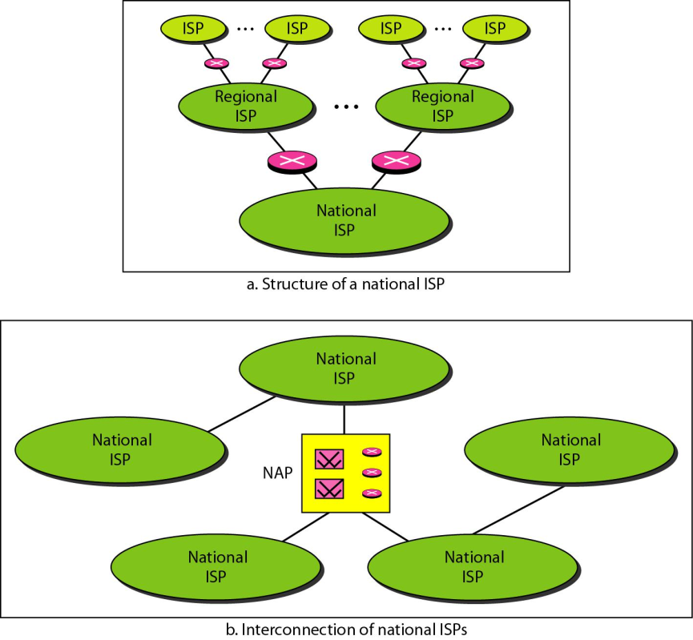

## 1.4 协议和标准

### 协议(Protocol)

- 协议：是规则的同义词  
  - 是一组用来管理数据通信的一组规则， 规定了通信的内容、通信方式和通信的时间。
  - 三个要素
    - 语法(syntax)，数据的结构或格式
    - 语义(semantics)，地址和控制信息
    - 时序(timing)，报文发送的时间和发送的速率  

- 标准：是达成一致的规则  

### 标准的分类

- 事实上的标准(de facto standard)，那些未经组织团体承认但已经在广泛使用中被接受的标准。如 TCP/IP
- 法定的标准(de jure standard)，那些由官方认可的团体制定的标准称为法定标准。如 OSI/RM

# ch02 网络模型

## 2.1 任务分层

### 网络协议的三要素

**为网络中数据交换而制定的规则、约定与标准称为协议。**协议定义了在两个或多个通信实体之间交换的报文的格式和顺序，以及报文的发送/接收或其他事件所采取的操作。

- **语法**

  **规定用户数据与控制信息的结构、格式、编码及信号电平等。**可以比做是能够上路的车辆的要求，不符合条件的改装车辆是不能上路的。

- **语义**

  **定义需要发出何种控制信息，以及完成的动作与响应。**可比做是具体的交通标志和细则，看到红灯就要停下（做出相应的响应），左转的时候要提前打左转向灯（ 发出相应的控制命令）。

- **时序**

  **对事件实现顺序的详细说明。**可以看做在公路上要按规定的顺序和速度行驶，超速或慢速都会影响交通秩序。

## 2.2 OSI模型

一个包含网络通信的 ISO (International Organization for Standardization, **ISO**) 标准是**开放系统互联模型** (Open System Interconnection, **OSI**)

> ISO 是组织，OSI 是模型

### OSI 参考模型的定义

- **体系结构(Architecture)**

  OSI参考模型定义了开放系统的**层次结构、层次之间的相互关系**，以及各层可能提供的服务。它作为一个框架来协调与组织各层协议的制定，也是对网络内部结构的精炼概括与描述。

- **服务定义(Service Definition)**

  OSI参考模型的服务定义详细**说明了各层所提供的服务**。某层提供的服务是指该层及以下各层的一种能力，这种服务通过接口提供给相邻高层。各层提供的服务与这些服务的具体实现无关。

- **协议说明(Protocol Specification)**

  在OSI参考模型的范围内，只要各种协议是可以实现的，各种产品只要遵循OSI 的协议就可以互连。 也就是说，OSI参考模型并不是一个标准，而是一种在制定标准时使用的**概念性框架**。

### 邮政系统和计算机网络的相似点——协议、层次、接口、体系结构  

- **层次(Layer)**

  是**处理复杂问题的基本方法**。 将要实现的功能分配在不同层次， 对每个层次的功能及实现流程有明确规定。 高层使用低层提供的服务时， 无需知道低层服务的实现方法。

- **接口(Interface)**

  是**同一结点内相邻层之间交换信息的连接点**。 同一结点的相邻层之间存在明确规定的接口， 低层通过接口向高层提供服务。 低层功能的实现方法与技术的变化不会影响整个系统。

- **网络体系结构(Network Architecture)**

  是**网络层次结构模型与各层协议的集合**。 各层之间相对独立， 高层只需知道下层能提供的服务，而无需知道低层的服务如何实现。 每层的功能与提供的服务都已有精确说明， 这有利于促进协议的标准化。

### OSI 模型的结构

OSI参考模型采用典型的分层结构。每层是一个模块， 用于执行某种基本功能， 并具有一套相应的协议。 OSI划分层次的原则是：  

- 各结点都具有相同的层次
- 不同结点的同等层具有相同的功能
- 同一结点内相邻层之间通过接口通信
- 每层可以使用下层提供的服务， 并向其上层提供服务
- 不同结点的同等层通过协议来实现对等层之间的通信

**OSI 七层模型**

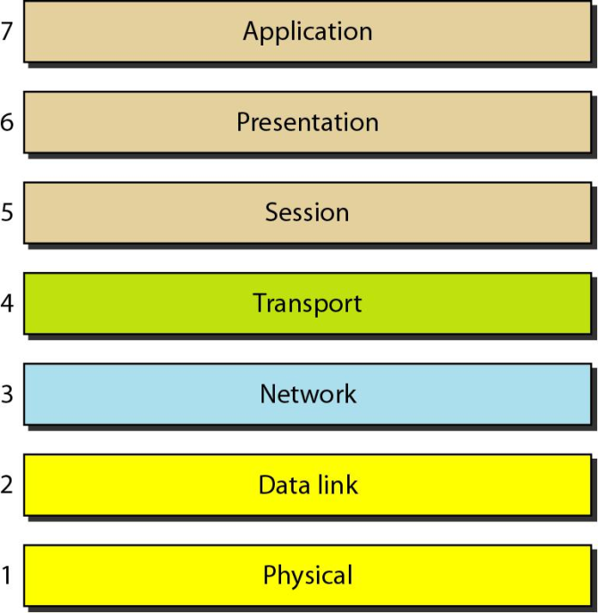

**OSI 模型层次间的相互作用**

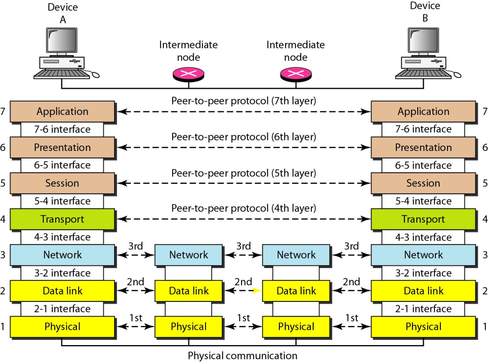

**使用 OSI 模型传输过程**

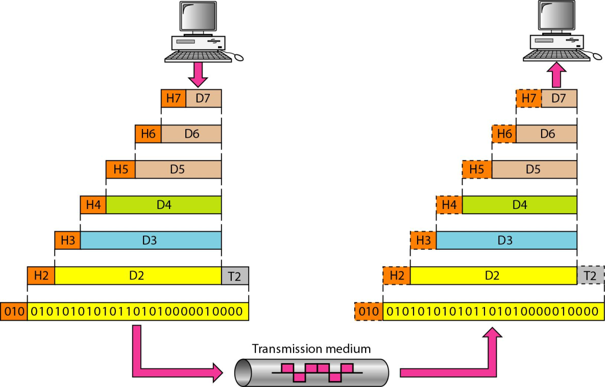

**OSI 环境中的数据传输过程**

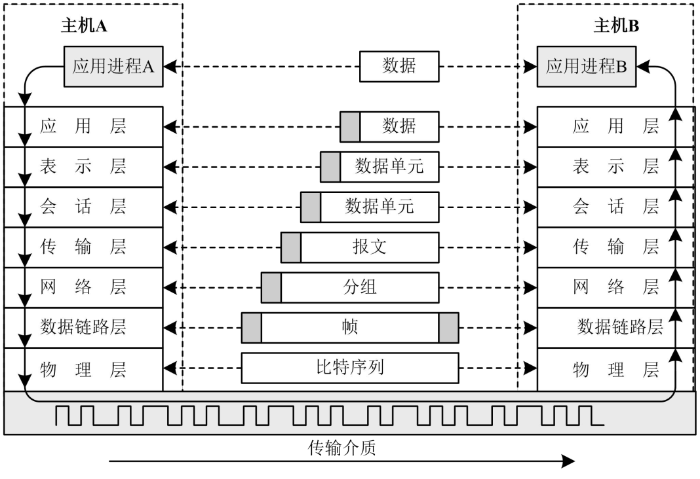

## 2.3 OSI 模型的各个层

### 物理层(Physical)

- 物理层包含在物理介质上传输位流所需的功能，定义了接口与传输介质的机械和电气特性。

- 物理层负责 **位** 从一跳（ 节点） 到另一跳（ 节点）的传递。

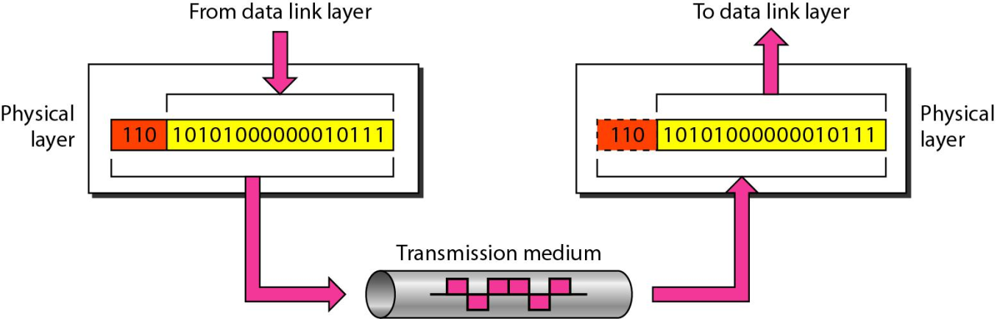

> - **传输的是透明比特流**
>
> - **位的表示**：物理层的数据是没有任何解释的位(bit)流(由0和 1 所组成的序列)。
> - **数据速率**：传输速率(transmisson rate)，即每秒发送的位数，也在物理层定义。
> - **位同步**：发送方与接收方不仅使用相同的比特率，还必须位同步。
> - **线路配置**：物理层涉及设备与介质的连接。
> - **物理拓扑结构**：物理拓扑结构定义如何将设备连接成网络。
> - **传输方式**：物理层也定义两台设备之间的传输方向：单工、半双工和全双工。

### 数据链路层(Data Link)

- 数据链路层将物理层的数据无差错地传递给网络层。
- 数据链路层负责 **帧** 从一跳（ 节点） 到下一跳（ 节点） 传递。

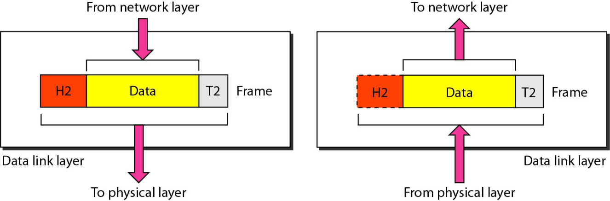

> - **成帧**：数据链路层将接收到的来自网络层的位流划分成称为帧(frame)的易处理数据单元。
> - **物理寻址**：如果帧是发送给网络中不同系统，则数据链路层在帧的头部添加发送方的物理地址与接收方的物理地址。
> - **流量控制**：如果接收方接收数据的速率小于发送方发送的速率，那么数据链路层就会采用流量控制机制以防止接收方过载。
> - **差错控制**：数据链路层增加一些机制用来检测与重发损坏帧或丢失帧，从而增加了物理层的可靠性。
> - **访问控制**：当两台或多台的设备连接到同一条链路上肘，数据链路协议必须能决定在任意时刻由哪一台设备来获取对链路的控制权。

**跳到跳传递(hop-to-hop delivery)**

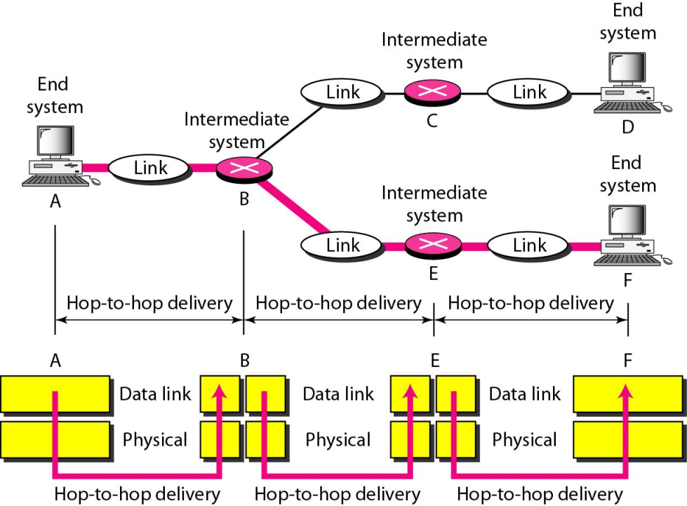

### 网络层(Network)

- 网络层负责将各个分组从源地址传递到目的地址。

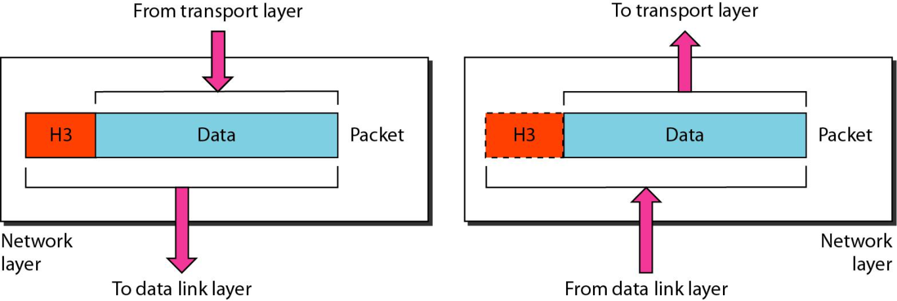

> - **逻辑寻址**：物理寻址负责处理本地网络寻址问题，它由数据链路层完成。如果一个分组通过网络边界，就需要另一个寻址系统来帮助区分源与目的系统。网络层给来自上一层的分组增加一个头部，它包括发送方与接收方的逻辑地址。
> - **路由选择**：当一些强立网络或链路连接在一起构成一个互联网(一个由网络连成的网络)或一个更大的网络时，连接设备(称为路由器或网关)把分组送到它们的最终目的地，网络层的功能之一是提供这种机制。  

**源到目的的传递(source-to-source delivery)**

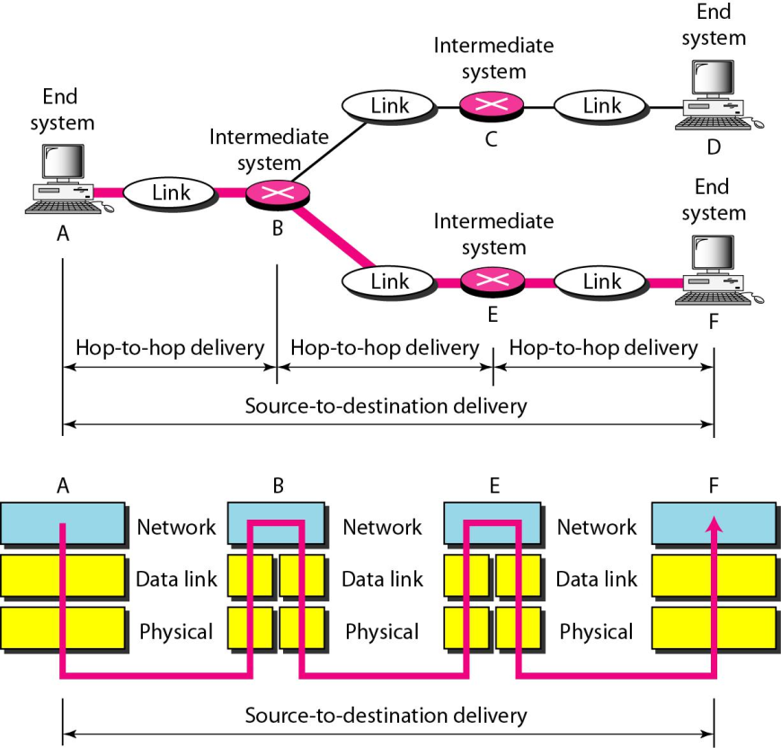

### 传输层(Transport)

- 传输层负责一个报文从一个进程到另一个进程的传递(process-to-process delivery)。

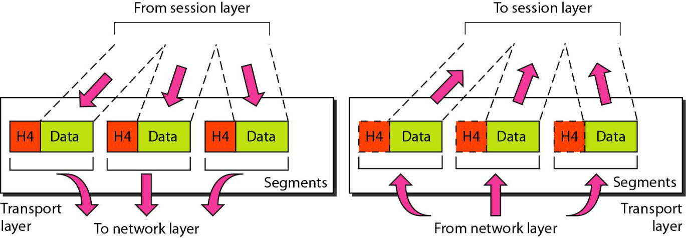

> 网络层将每个分组传送到指定的计算机上，而传输层则将整个报文传送给该计算机上的指定进程
>
> - **服务访问点(SAP)/端口(Port)**
> - **分段(Segment)和组装**：将报文分解成可传输的片段，并且给这些片段编上序号。
> - **连接控制**：传输层可以是无连接的或面向连接的。
> - **流量控制**：如同数据链路层一样，传输层担负流量控制(flow control)的责任。
> - **差错控制**：如同数据链路层一样，传输层担负差错控制(error control)的责任。

**一个报文在进程间的可靠传递**

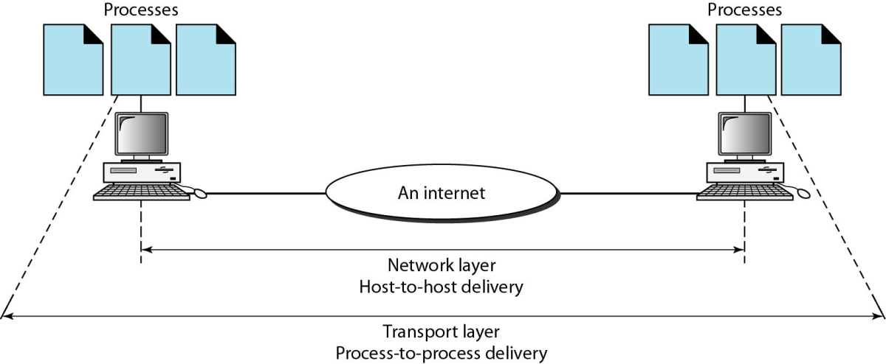

### 会话层(Session)

- 会话层负责对话控制和同步。

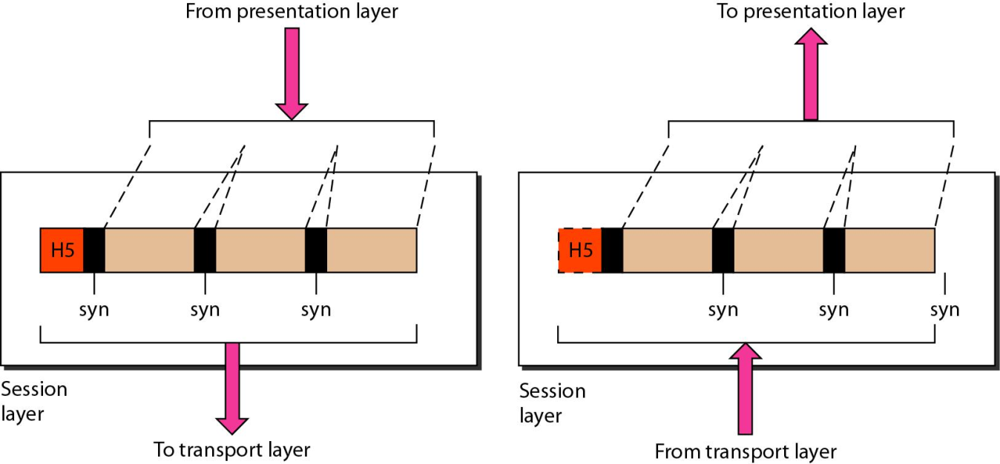

> - **对话控制**：会话层允许两个系统进入会话。它允许两个进程之间以半双工(一次一个方向)或全双工(一次两个方向)方式进行通信。
> - **同步**：会话层允许一个进程在数据流中增加检查点或同步点(synchronization point)。
> - **Session经常在套接字中使用**

### 表示层(Presentation)

- 表示层负责翻译、 加密和压缩数据。

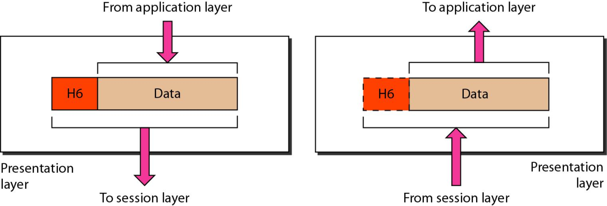

> - **翻译**：语义与语法的转换。表示层负责不同编码方法之间的互操作。发送方的表示层将信息从发送方使用的格式转换成一个公共的格式。接收方机器的表示层将公共格式转换成接收方使用的格式。  
> - **加密**：为了传输敏感信息，一个系统必须保证秘密。加密是指发送方将原来的信息转换成另一种形式，井在网络上发送转换后的形式。解密是将信息转换回它的原始形式。
> - **压缩**：数据压缩减少需要传输数据的位数。

### 应用层(Applicaton)

- 应用层负责向用户提供服务。

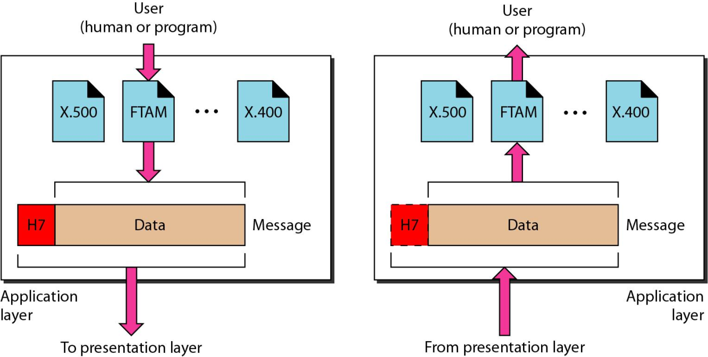

> - 向用户提供服务
> - 网络虚拟终端：网络虚拟终端是物理终端的软件版本，允许用户登录到一台远程主机上。
> - FTP：允许用户访问远程计算机上的文件(进行修改或读取数据) .从远程计算机上检索文件，以及管理或控制远程计算机上的文件。
> - E-mail服务：提供电子邮件存储转发的基础。
> - Directory服务：提供分布式数据库资源以及对不同对象和服务的全球信息的访问。

### 各层功能总结

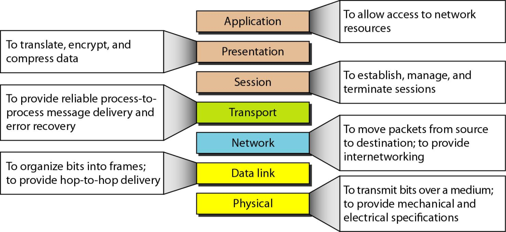

## 2.4 TCP/IP 协议族

TCP/IP 协议族被定义为四个层次：主机到网络层，互联网层，传输层和应用层。然而, 当TCP/IP与OSI模型进行比较的时候， 可以说TCP/IP协议族有五层：物理层，数据链路层，网络层，传输层和应用层。

### TCP/IP 参考模型的层次结构

TCP/IP是互联网中重要的通信规程，规定了计算机之间通信使用的命令与响应、PDU格式、相应的动作等。

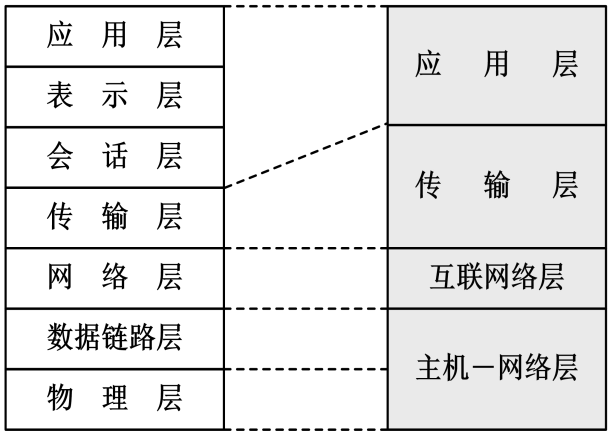

**TCP/IP的主要特点：**

- 开放的协议标准
- 独立于特定的计算机硬件与操作系统
- 独立于特定的网络硬件
- 它拥有统一的网络地址分配方案
- 使用标准化的应用层协议

**TCP/IP 和 OSI 模型**

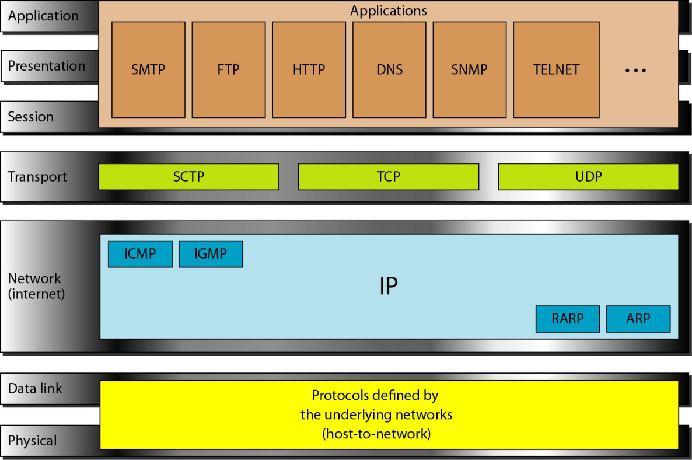

> SCTP(Stream Control Transmission Protocol) 是IETF新定义的一个**传输层**协议

### TCP/IP 中的协议数据单元——PDUs(Protocol Data Unit)

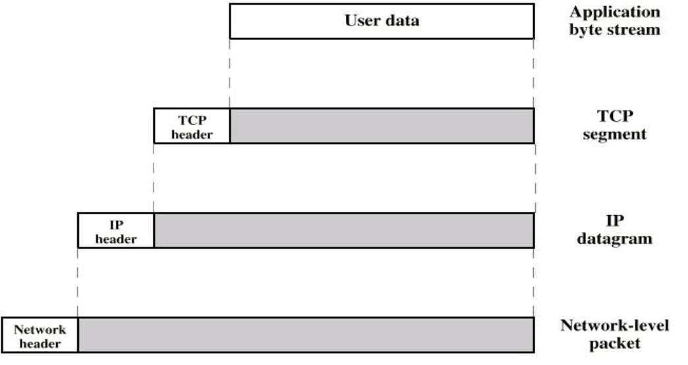

**协议数据单元(PDU)**是指对等层次之间传递的数据单位。

- 物理层的 PDU是数据位(bit)
- 数据链路层的 PDU 是数据帧(frame)
- 网络层的 PDU 是数据包/数据报(packet)
- 传输层的 PDU 是数据段(segment)
- 其他更高层次的PDU是数据(data)  

### TCP/IP 概念

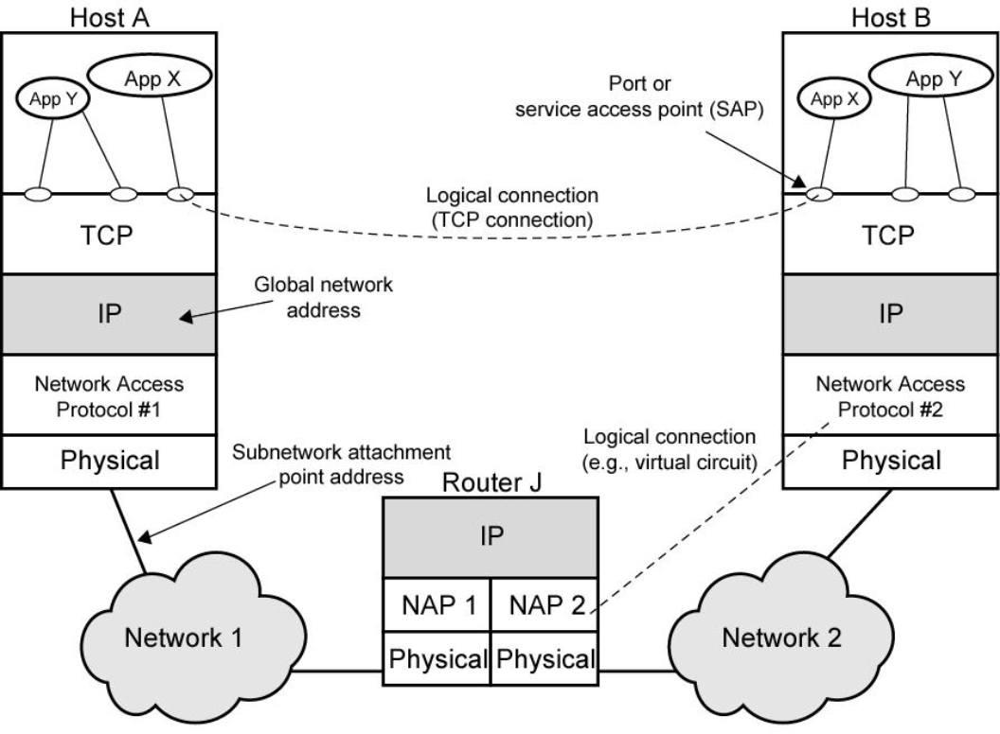

### 协议栈

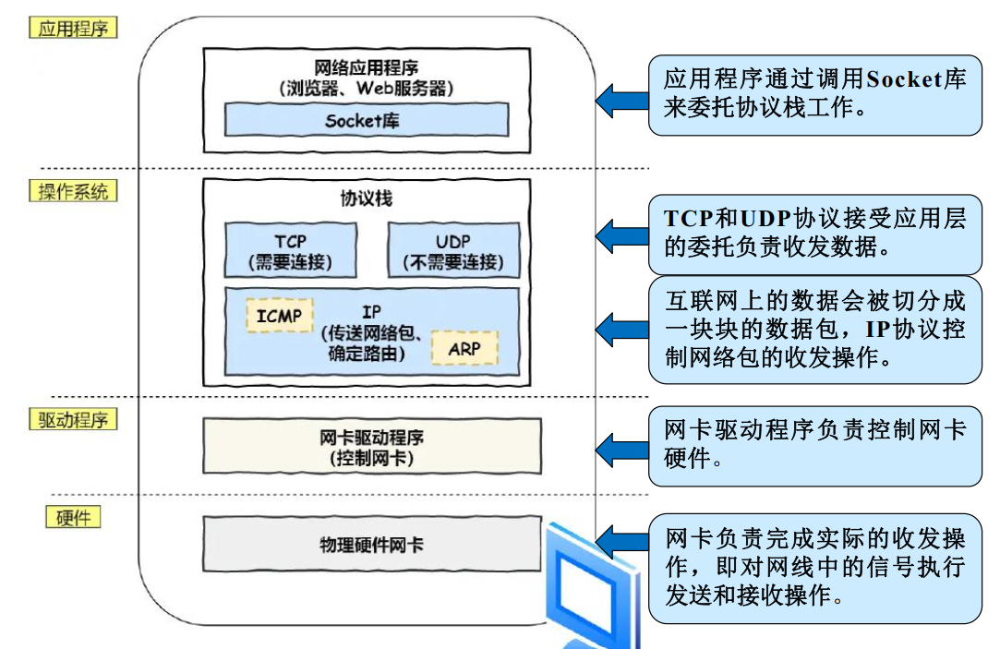

## 2.5 寻址

**TCP/IP 协议簇的应用网络中使用4层地址：**

- 物理地址
- 逻辑地址
- 端口地址
- 专用地址  

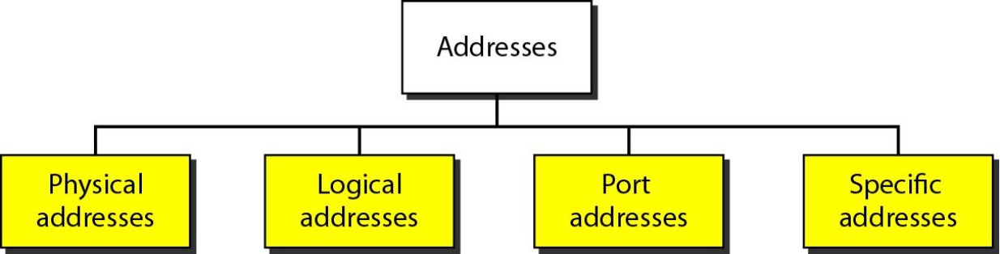

**TCP/IP协议中的各层与地址的关系**

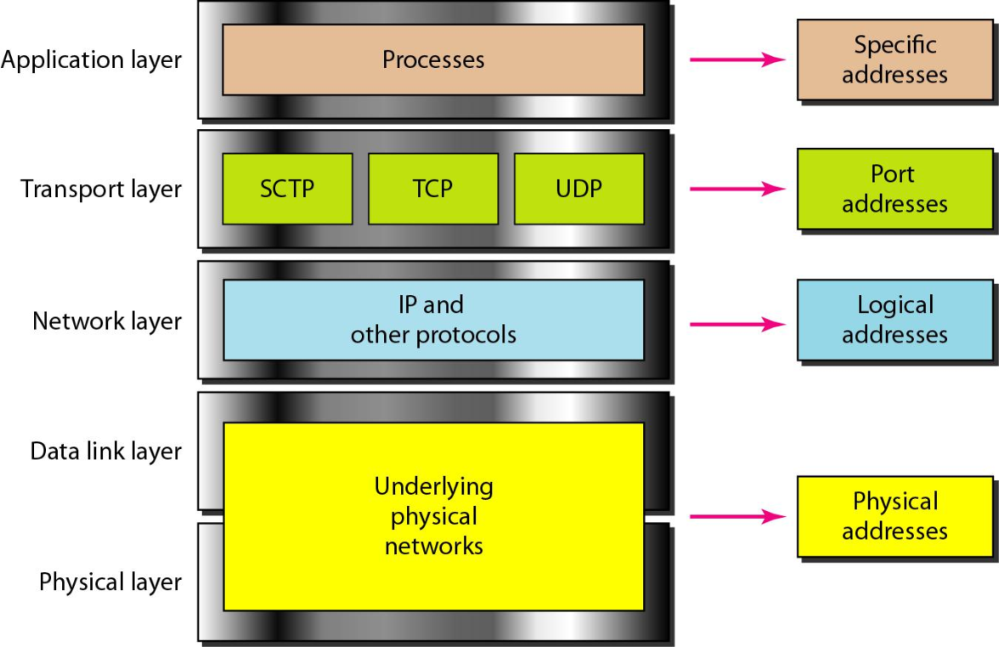

### 物理地址(Physical Addresses)

- 物理地址，也称链路地址、硬件地址、MAC地址，是局域网或广域网定义的节点地址。

- 它包含在数据链路层的帧中，是最低级的地址。
- 其长度和格式是可变的，与网络有关。通常以太网使用6个字节（48位）物理地址，在网络接口卡上标明。

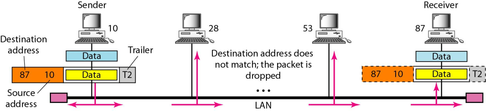

### 逻辑地址(Logical Addresses)

- 跳到跳时物理地址将改变，但逻辑地址保持不变。

**IP地址**

为了相互的连接，每个设备（计算机或者路由器）都有一对地址（物理地址和逻辑地址）。每个路由器和三个网络相连（在图中只显示了两个）。 因此每个路由器有三对地址， 一对地址对应一个连接。  

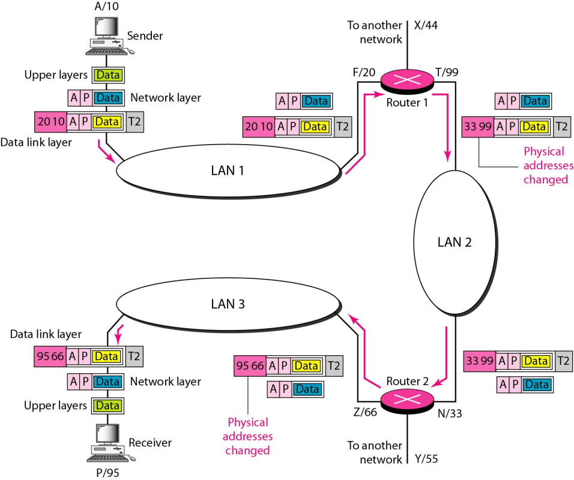

### 端口地址(Port Addresses)

- 16位端口地址用单个数字表示。  

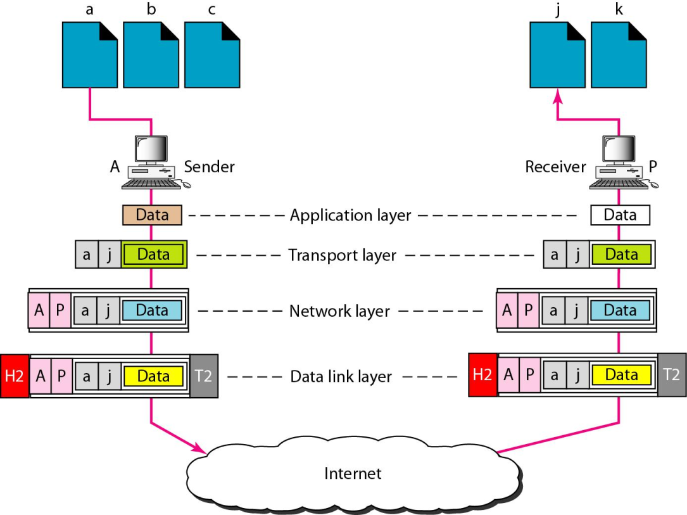

> 为了表示数据从进程a传递到进程j而不是进程 k，传输层对来自应用层的数据添加两个端口地址 (a和j) ，即源和目的地址封装在分组中。然后，网络层对来自传输层的分组用源和目的逻辑地址 (A和P) 封装在另一个分组中。最后，该分组用下一跳的源和目的物理地址封装在帧中。此处没有表示物理地址，因为在因特网范围内从跳到跳它们是要改变的。  

### 专用地址(Specific Addresses)

- 有些面向用户的应用被设计为专用地址。
  - 如电子邮件地址和统一资源定位符URL。电子邮件地址定义邮件收发人，统一资源定位符用于在万维网中寻找一个文档。这些地址由发送计算机转换成对应的端口地址和逻辑地址。  