# 计算机网络——物理层

[TOC]

# ch03 Data & Signal 数据和信号

**数据通信的常用术语**

- 信息(message)：通信的目的是传送信息， 如文字、 图像、 视频和音频等
- 数据(data)：信息在传输之前需要进行编码， 编码后的信息就变成数据
- 信号(signal)：数据在通信线路上传递需要变成电信号或光信号

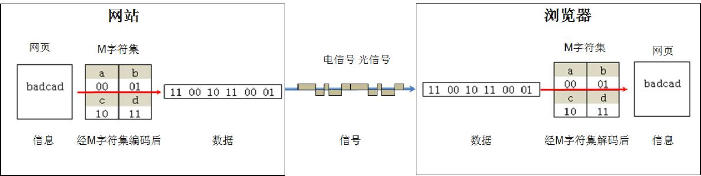

> 数据要进行传输，必须被转成电磁信号。

## 3.1 模拟与数字

**数据(data)** 可以是模拟的也可以是数字的。

- **模拟数据** 指的是连续状态的信息，采用连续值。
- **数字数据** 指的是离散状态的信息，采用离散值。

**信号(signal)** 可以是模拟的也可以是数字的。

- **模拟信号** 在一个范围内可以有无穷多个取值。
- **数字信号 **只能有有限个数值。

### 模拟信号和数字信号

- **模拟信号**
  - 优点： 其精确的分辨率，与数字信号相比，模拟信号的信息密度更高。处理更简单，可以直接通过模拟电路组件实现。
  - 缺点：易受干扰，很难纠正。  
- **数字信号**
  - 优点：更高的抗干扰能力，更远的传输距离，且失真幅度小。便于加密处理、存储、处理和交换，设备便于集成化、微型，占用信道频带较宽。
  - 缺点：算法复杂。

### 周期信号和非周期信号

- **周期信号(periodic signal)** 在一个可测量的时间范围内(称为一个周期 (period))完成一种模式，并且在后续的相同时间范围内重复这一模式。
- **非周期信号(nonperiodic signal)** 的变化则不会随着时间的变化出现重复的模式或循环。

> 在数据通信中， 通常使用 **周期模拟信号** 和 **非周期数字信号**
>
> - 周期模拟信号需要更少的带宽
> - 非周期数字信号可以表示数据的变化

## 3.2 周期模拟信号

周期模拟信号可以分为简单类型或复合类型两种。

- **简单类型模拟信号**， 即正弦波(sine wave)， 不能再分解为更简单的信号
- **复合类型模拟信号** 则是由多个正弦波信号组成的  

### 正弦波

**峰值振幅**

信号的 **峰值振幅(peak amplitude)** 是其最高强度的绝对值，与其携带的能量成比例。

**周期与频率**

- **周期(Period)** 是信号完成一个循环所需要的时间，以秒为单位。

- **频率(frenquency)** 是指 1 秒内的周期数。

**相位**

**相位 (phase)** 是指波形相对于时间零的位置。

**波长**

**波长( wavelength)** 是信号通过传输介质传播的另一个特性。波长将简单正弦波的周期或频率与介质的 **传播速度(propagation speed)** 结合在一起。

**时域和频域**

**时域图(time-domain plot)** 显示了信号振幅随时间的变化情况(振幅的时间图)。在时域图中，相位井未显式地表示出来。

**频域图(frequency-domain plot)** 只和峰值和频率相关，不显示一个周期中的振幅变化。  

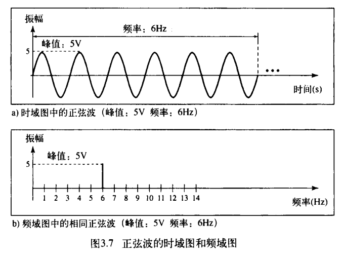

> 用频域圈中单个峰值可表示时域图中一个完整正弦波。  

### 复合信号

- 单一频率的正弦波在数据通信中没有用处， 需要发送复合信号， 复合信号由许多简单正弦波组成。
- 按照傅里叶分析， 任何复合信号是由具有不同频率、 相位和振幅的简单正弦波组合而成。
- 如果复合信号是**周期性**的， 分解得到的是一系列具有**离散**频率的信号
- 如果复合信号是**非周期性**的， 分解得到的是具有**连续**频率的正弦波组合

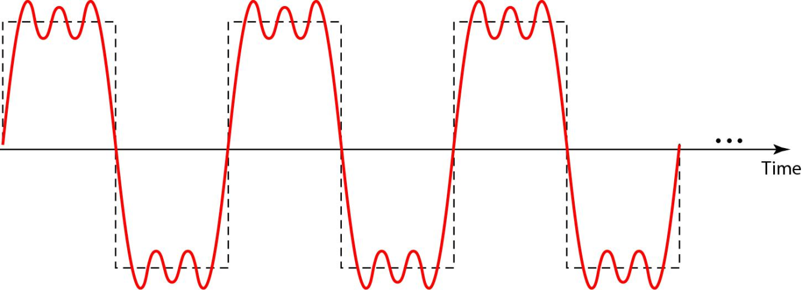

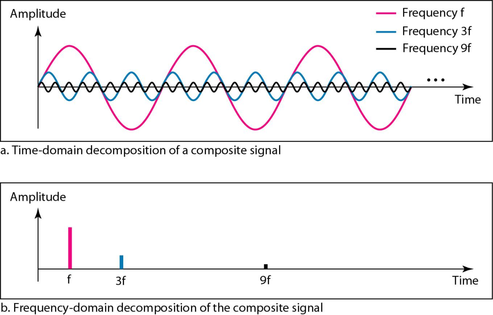

> 频率为 ***f*** 的正弦波的频率与复合信号的频率一样，称为**基础频率**，或者**第一谐波**；
>
> 频率为 ***3f*** 的正弦波的频率为基础频率的3倍，称为**第三谐波**；
>
> 频率为 ***9f*** 的正弦波的频率为基础频率的9倍，称为**第九谐波**。

### 带宽

- 复合信号的带宽是信号 **最高频率与最低频率的差值**。  

**周期复合信号和非周期复合信号的带宽**：

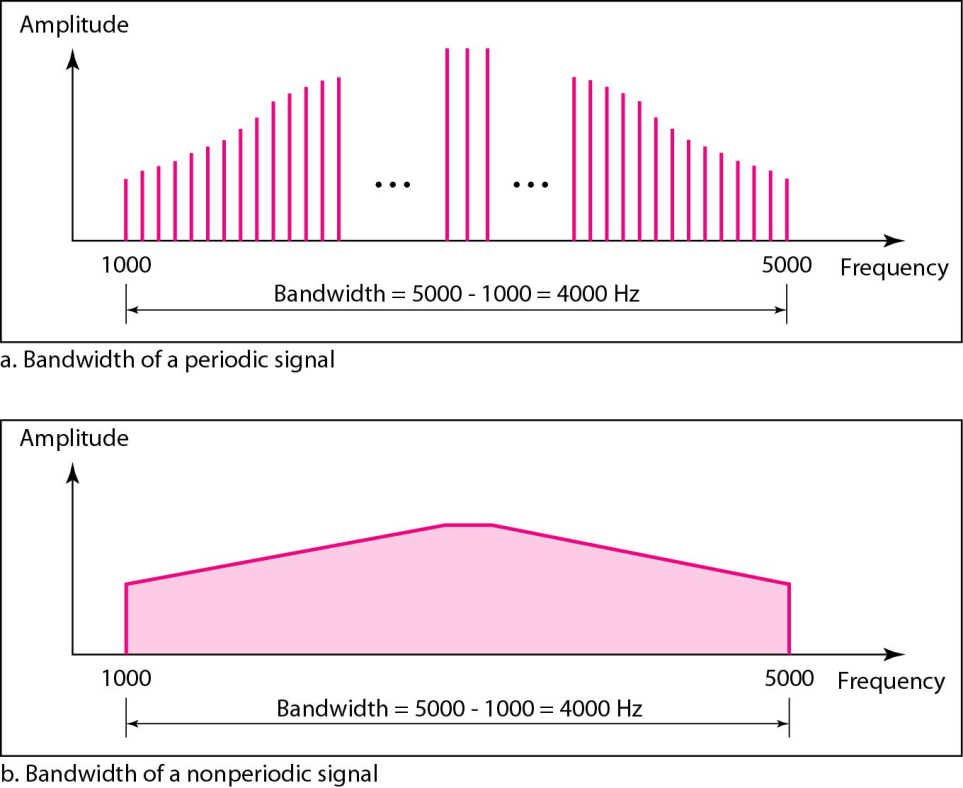

## 3.3 数字信号

1可以编码为正电平， 0可以编码为零电平。一个数字信号可以多于两个电平表示。在这种情况下， 每个电平就可以发送多个位。

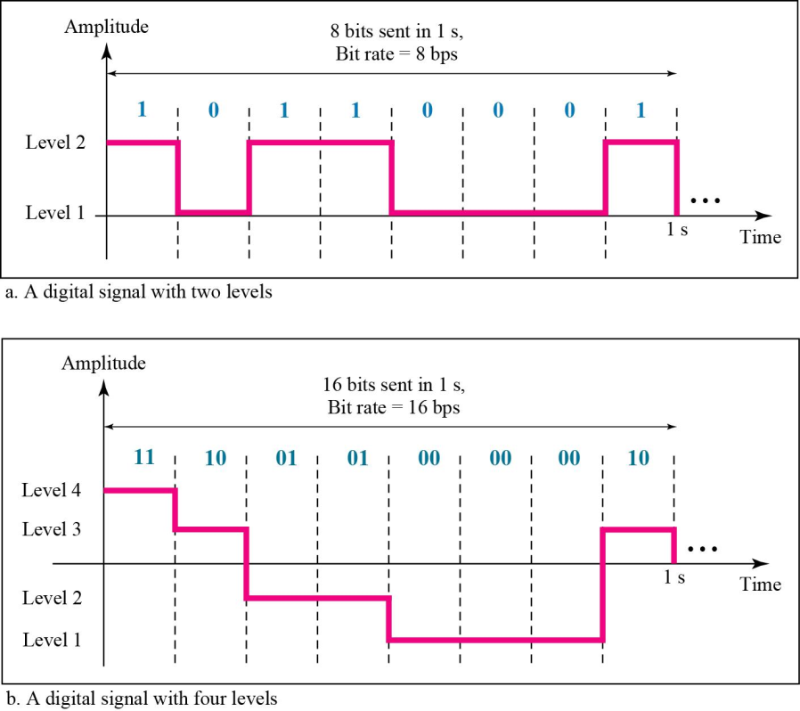

### 比特率

**比特率(bit rate)**是1秒中发送的位数，以每秒位(bits per second, bps)表示。单位是*bps*或者*b/s*。

### 比特长度(位长)

- 是一个比特在传输介质上的距离
- 比特长度 = 传播速度 × 比特持续时间
- 是一个相似概念
- 是一个等效的概念

### 数字信号是一种复合模拟信号

> 数字信号是一种 **无穷大带宽** 的复合模拟信号。

如果数字信号是周期性的(在数据通信中较少见)，分解后的信号可以表示为无穷大带宽和离散频率的频域。如果数字信号是非周期性的，分解后的信号仍然是无穷大带宽，但频率是连续的。

周期数字信号和非周期数字信号的时域和频域：

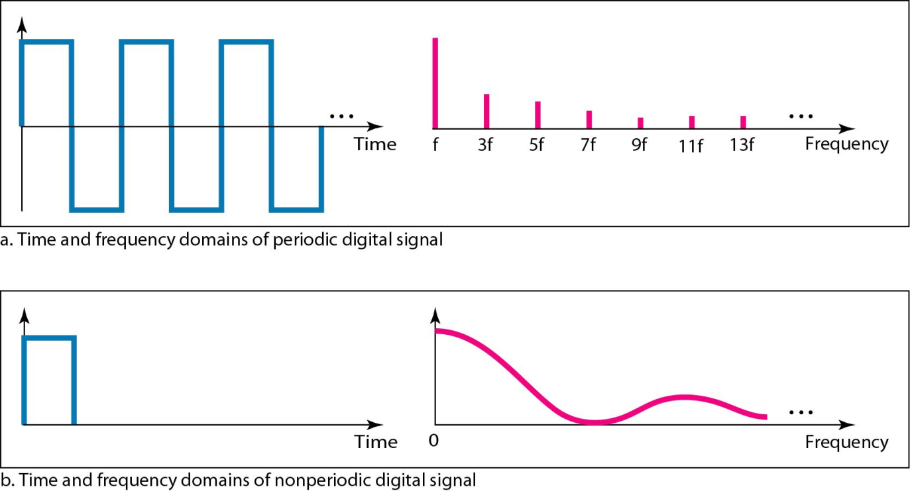

### 数字信号的传输

#### 基带传输

基带 (baseband) 传输是通过通道传输数字信号，不转换为模拟信号。基带传输需要一个带宽下限是0的 **低通通道(low-pass channel)**。

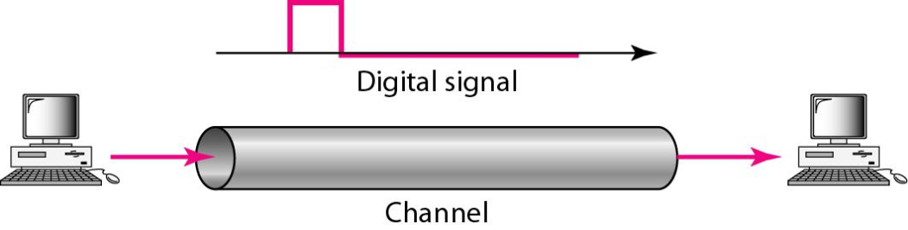

两条低通通道的带宽：

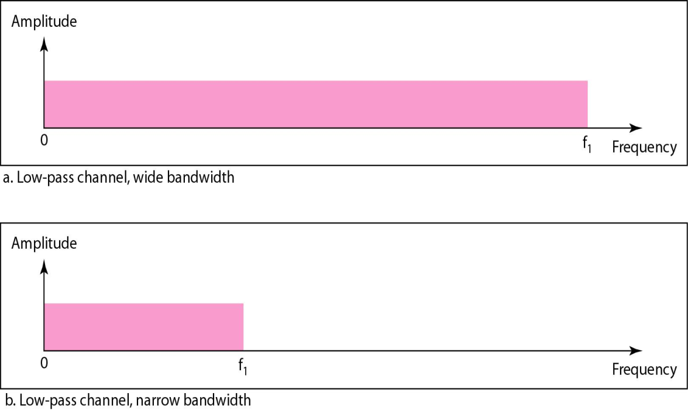

**a. 宽带宽的低通信道**

使用**专用介质**的基带传输：

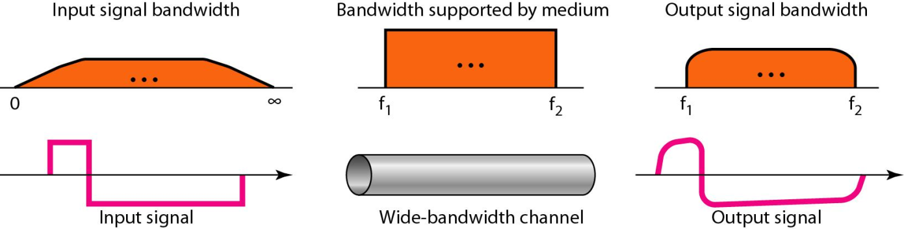

> 输出信号不是原始信号的严格复制， 但可以从其中得出数据。

只有存在无穷大或非常大带宽的低通通道，保持数字信号形状的数字信号基带传输才是可能的。  

**b. 有限带宽的低通通道**

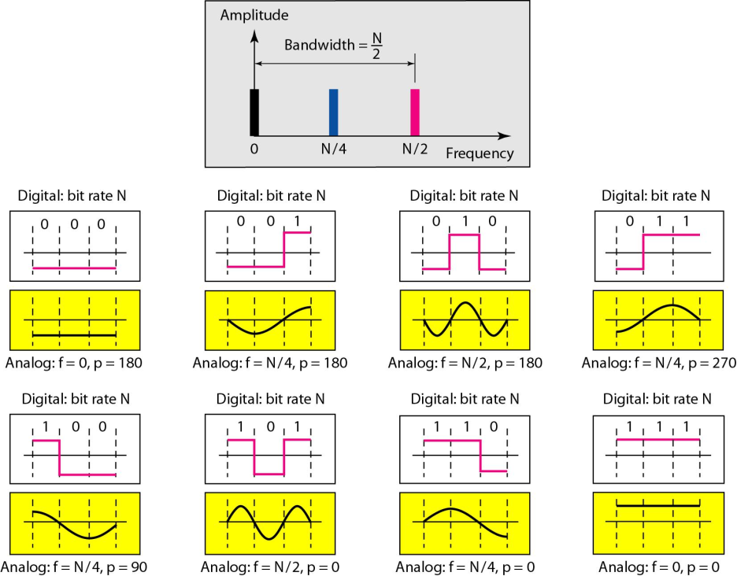

> $所需最小带宽 = \frac{比特率N}{2}$

使用三个第一谐波模拟数字信号：

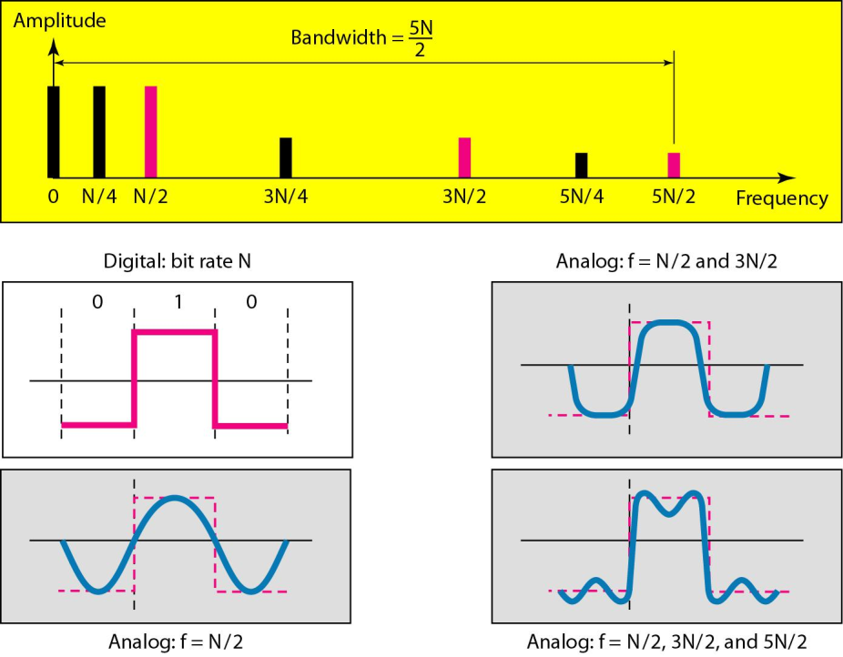

模拟信号谐波成数字信号：

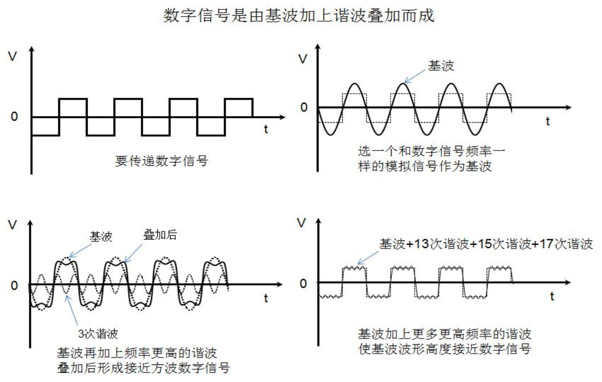

在基带传输中，所需 **带宽与比特率成正比**；如果**需要更快地发送位**，就**需要更大的带宽**。  

例题：

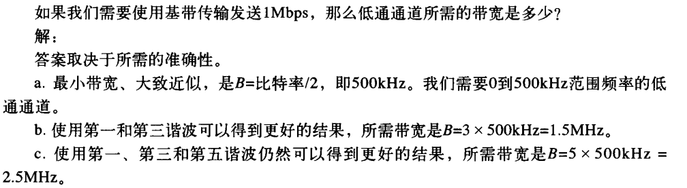

#### 宽带传输(使用调制)

宽带传输或调制就是把数字信号转换成模拟信号传输。调制允许我们使用 **带通通道(bandpass channel)**，即带宽不从0开始的通道。这种通道比低通通道更可用。  

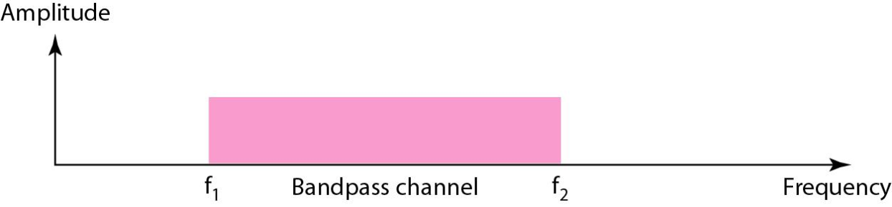

> 如果可用通道是带通通道，不能直接发送数字信号到通道；需要在传输前把数字信号转换成模拟信号。  

数字信号在带通通道传输的调制过程：

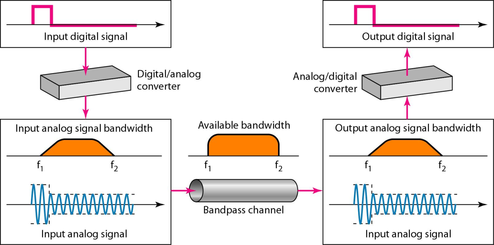

## 3.4 传输减损 (Impairment)

通过介质进行传输，但是其传输并非是完美无缺的。不完美的地方导致了信号减损。这意味着信号在介质的开始一端和结束一端是不相同的。发送的信号并非就是接收到的信号。

减损原因：衰减、失真、噪声

### 衰减 (attenuation)  

衰减意味着能量损失，通常使用分贝来表示。

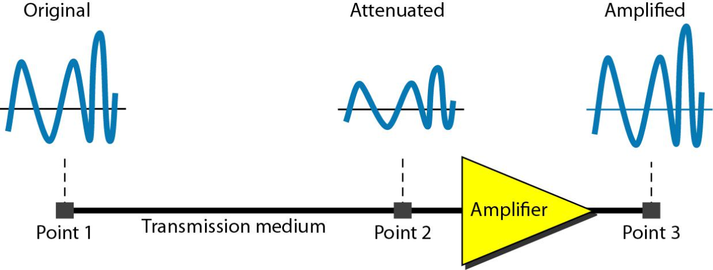

**分贝**

为了说明信号损失或增益的强度，工程上使用分贝的概念。**分贝(decibel, dB)** 用于计算两种信号之间或者同一信号在两个不同位置之间的相对强度。

若信号被衰减了，则分贝为负值；若信号被放大了，则分贝为正值。  

$dB = 10log_{10}\dfrac{P2}{P1}$

例题：

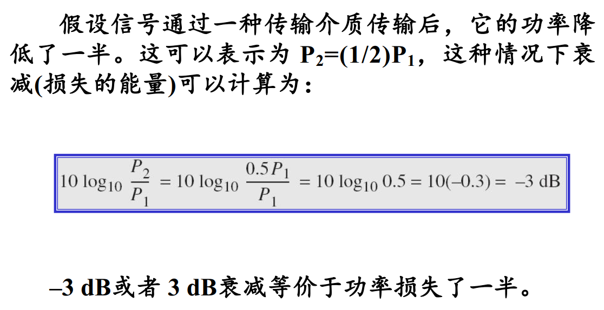

### 失真 (distortion)

失真意味着信号改变了形状或形态，通常也使用分贝来表示。

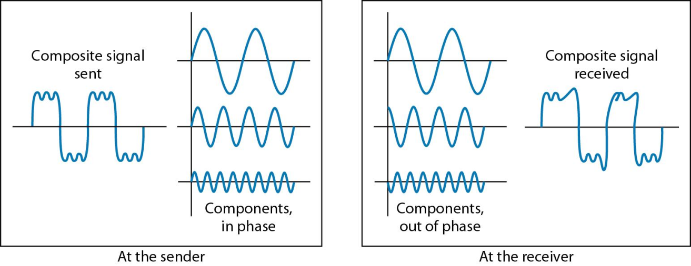

> 失真产生在由不同频率成分组成的复合信号当中。每一种信号成分在通过介质时有自己的传播速度，所以到达最终目的节点时有各自的延迟。  

### 噪声 (noise)

噪声有热噪声、 感应噪声、 串扰和脉冲噪声。

> **热噪声**是电缆中的电子随机移动而产生的额外信号，而不是信号发送装置发送的。
>
> **感应噪声**的来源是发动机和设备。这些设备工作时相当于发射天线，而传输介质成为接收天线。
>
> **串扰**是电缆之间的互相影响。一根电缆作为发射天线而另一根电缆作为接收天线。
>
> **脉冲噪声**是一种尖峰信号(在非常短时间内有很高能量的一种信号) ，来自输电线、闪电等。  

用信噪比来衡量：通常用分贝来表示。

**信噪比(SNR)**

- $SNR$ 定义：$SNR = \dfrac{平均信号功率}{平均噪声功率}$
- $SNR_{db}$ 定义：$SNR_{db} = 10log_{10}SNR$

> 高的SNR意味着信号较少地被噪声破坏，较低的SNR意味着信号被噪声更多地破坏。

**SNR的两种情形：高SNR和低SNR**

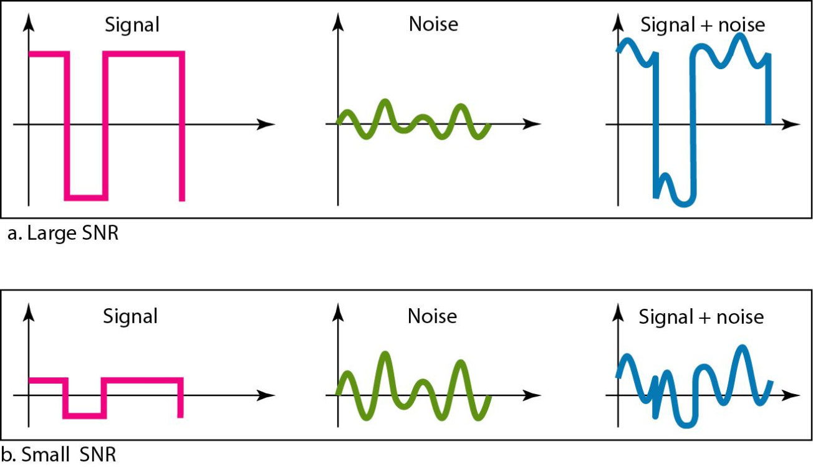

## 3.5 数据速率限制

> 数据通信中一个非常重要的问题是：在一个通道中能够以多快的速率发送数据，即每秒钟的比特数。

数据速率取决于三种因素：

1. 有效带宽

2. 使用的信号电平数
3. 通道的质量（噪声电平）

### 无噪声信道：奈奎斯特比特率

理论上的 $最大比特率 = 2 × 带宽 × log_2L$ ， L是电平数

例题：

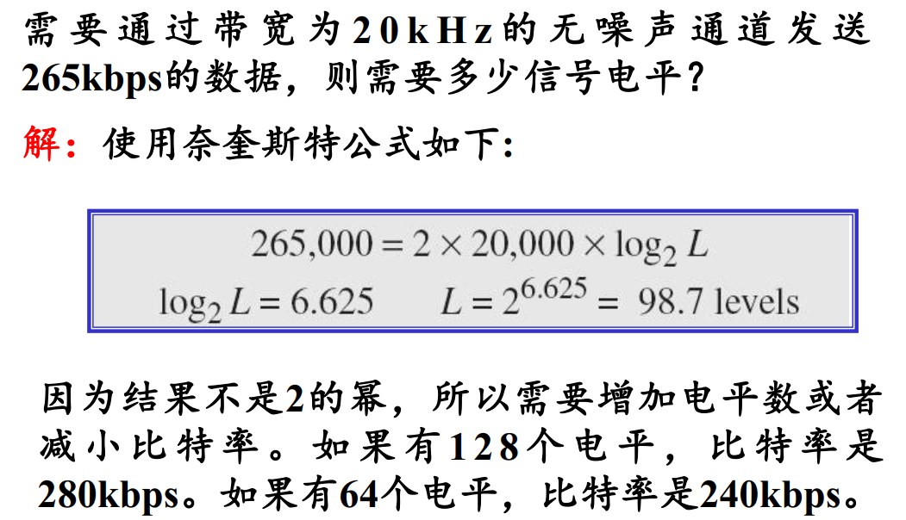

> 增加信号电平数会减弱系统的可靠性。

### 噪声通道：香农容量定理

**通道容量**：通道的传输容量，*bit/s* 。

$通道容量 = 带宽 × log_2(1+SNR)$

> 香农公式中没有指出信号电平， 意味着无论使用多少个电平，都不可能获得比通道容量更高的数据速率，即 **香农公式定义了噪声通道理论上的最高数据速率**。  

例子：
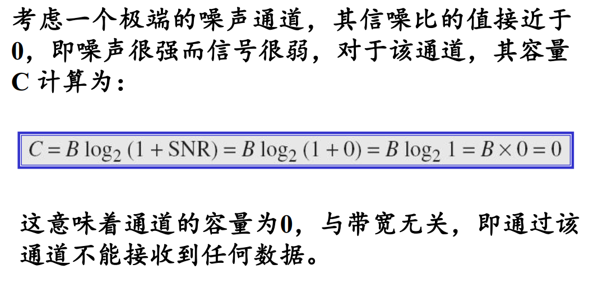

> 如果要使数据发送速率更快，则可**增大**线路的**带宽**或者**提高信噪比**

为了实际操作方便，当 SNR很大肘，假定 SNR+1几乎与SNR相等，**理论通道容量**可以**简化**为:

$C = B × \dfrac{SNR_{dB}}{3}$

### 使用两种限制条件

在实际应用中，两种方法都要使用，以确定所需要的带宽以及信号电平数。  

**例题**：

> 有一个 1MHz带宽的通道。 通道的信噪比是 63，合适的比特率以及信号电平是多少？
>
> **解**：
>
> 首先使用 ***香农公式*** 确定 **上限**：
>
> $C = B log_2 (1 + SNR) = 10^6 1og_2(1 + 63) = 10^6 1og_264 = 6Mbps$
>
> 尽管香农公式计算结果是 6Mbps，但这是上限。为了获得 **更好的性能**，可选择低一些的值，如 4Mbps。 然后使用 ***奈奎斯特公式*** 计算信号 **电平的数量**：  
>
> $4Mbps = 2 × 1MHz × log_2L$    $ => $   $L = 4 (个)$

- *香农容量定理* 给出 **数据速率的上限**， *奈奎斯特公式* 给出所需的 **信号电平数**  

## 3.6 性能

### 带宽(Bandwidth)

在网络中，将在两种情况下使用术语带宽。

- 第一种，以 **赫兹** 衡量的带宽指 **复合信号包含的频率范围** 或者 **通道能通过的频率范围**。
- 第二种，以 **每秒比特数** 衡量的带宽指 **通道或链路中位传输的速率**。

### 吞吐量(Throughput)  

吞吐量，即单位时间内成功地传送数据的数量，用于衡量通过网络发送数据的快慢。

**吞吐量和带宽的区别**：

**带宽**是链路的**潜在衡量值**，而**吞吐量**是发送速度快慢的**实际衡量值**。  

例题：

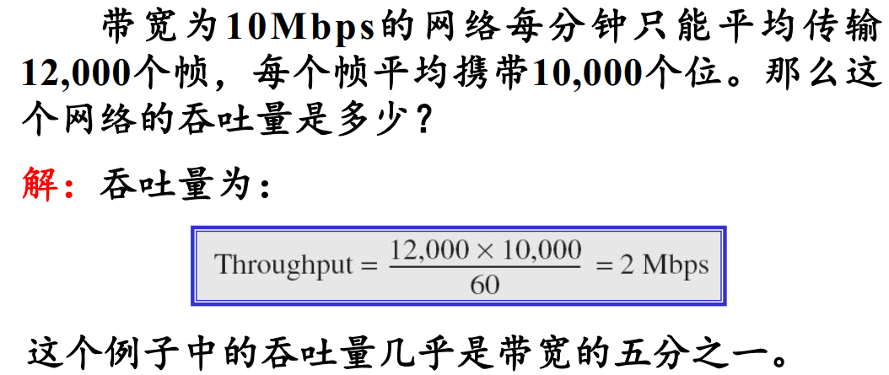

### 延迟

**延迟 = 传播延迟 + 传输时间 + 排队时间 + 处理延迟**

- 传播时间(propagation time)：
  - 传播时间是指传输一个比特从源到目标的时间
  - 取决于电磁信号的传播速度(真空中 $3×10^8m/s$)
  - **传播时间(传播延迟) = 距离 / 传播速度**
- 传输时间(transmission time)：
  - 传输时间是发送报文所需的时间
  - **传输时间 = 报文长度 / 传输速度**
- 排队时间(queuing time)
- 处理延迟(processing time)

例题：

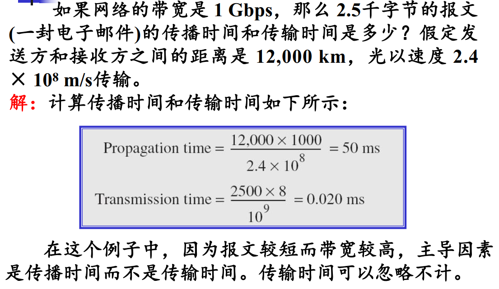

### 带宽延迟积

把两点间的链路看做管道

- 管道的**横截面表示带宽**
- 管道的**长度表示延迟**

可以说 **管道的容量定义了带宽延迟乘积**：$Bandwidth × Delay$ 

- **带宽延迟乘积**定义了 **能充满链路的位数**。

------

# ch04 Digital Transmission 数字传输

## 4.1 数字到数字转换 (digital-to-digital conversion)

### 4.1.1 线性编码 (Line coding)

- 线性编码是将数字数据转换为数字信号的过程
- 数据元素 (data element)：表示一块信息的最小实体即位 (bit)，是被承载的
- 信号元素 (signal element)：是数字信号的最小单元，是传输载体

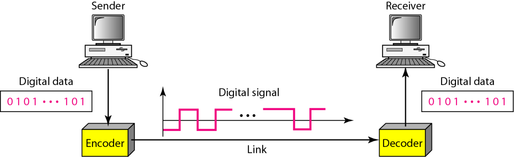

**比率 r** : 每个信号元素承载的数据元素的个数

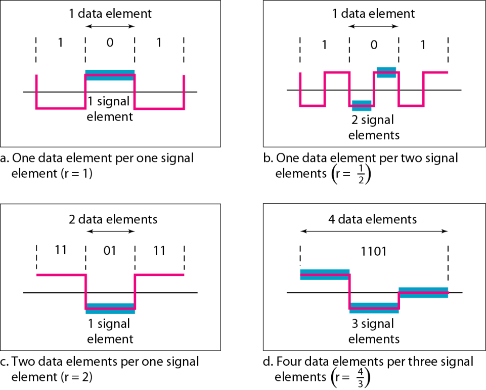

信号元素与数据元素的关系就是如何用信号表示传输的数据，即如何表示 0, 1。

#### 数据速率与信号速率(Data rate vs Signal Rate)

- 数据速率：1 秒钟发送的数据元素 ( 位 ) 的数量，即bps(bits per second) 或 b/s，也叫 **比特率**。
- 信号速率： 1 秒钟发送的信号元素的数量，单位是 **波特率(baud)**，或者叫做 **脉冲速率 (pulse rate)**、**调制速率 (modulation rate)** 或 **波特率 (baud rate)** 
- 目标：增加数据速率而降低信号速率

数据速率和信号速率间的**关系公式**：

&emsp;&emsp;&emsp;$ S = c × N × \dfrac{1}{r} $

- $N$ ：数据速率，单位 bps
- $c$ ：情形因子 (case factor)，会根据情形改变，一般取值 $\frac{1}{2}$
- $S$ ：是信号元素速率
- $r$ ：比率

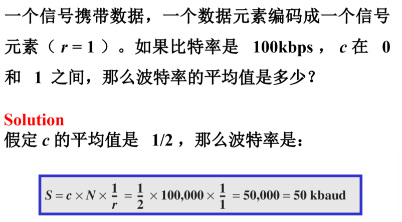

#### 带宽

虽然数字信号的真实带宽是无限的，但有效带宽是有限的。

- **<u>是波特率而不是比特率决定了数字信号的带宽</u>**
- 波特率和带宽是有关系的
- 若给定通道带宽，则可以得到最大数据速率

最小带宽：$B_{min} = c × N × \dfrac{1}{r}$

最大数据速率：$N_{max} = \dfrac{1}{c} × B × r$

#### 线路编码需要解决的问题

- **基线偏移 (Baseline Wandering)**：基线是指接收方计算收到信号功率的运行平均值。信号代表的高低电平根据信号的功率与基线比较得到，0 或 1 的长字串会引起基线偏移，使接收方不能正确地进行解码。好的线路编码方案需要防止基线偏移。

- **直流分量 (DC Components)**：接近于零的频率成为直流分量，会给不允许通过低频率的系统，或者使用电子耦合的系统带来问题（直流信号不能通过电容，不能远距离传输，会造成器件老化）
- **自同步 (self-synchronization)**：接收方的位间隔与发送方的位间隔严格对应与匹配。数字信号在传输的数据中包含有定时信息，通常是使用信号中包含有提示接收方起始、中间和结束位置的脉冲的跳变(transition) 。

- **差错检测**
- **抗噪声和抗干扰**
- **复杂性**

缺乏自同步的结果：

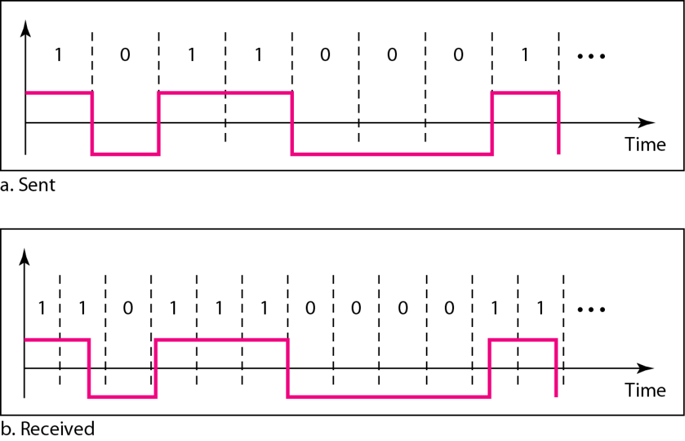

### 4.1.2 线性编码方案 (Line coding schemes)

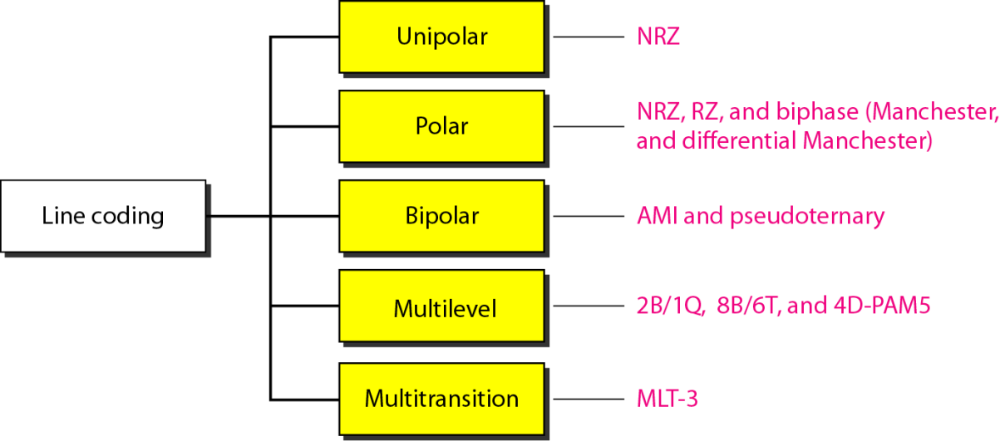

#### 单极性编码(Uniploar)

##### 单极性编码 —— 不归零(non-return-to-zero, NRZ)

在单级编码方案中，所有的信号电平都在时间轴的一边，或者时间轴的上面或者时间轴的下面。  

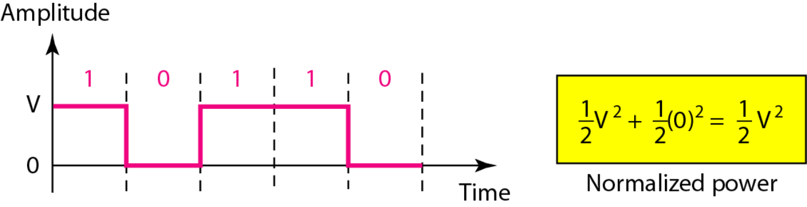

#### 极性编码(Polar)

##### 极性编码 —— 不归零编码(NRZ) 

在极性编码方案中，电平在时间轴的两边。例如， 0的电平可能是正的，而 1 的电平可能是负的。

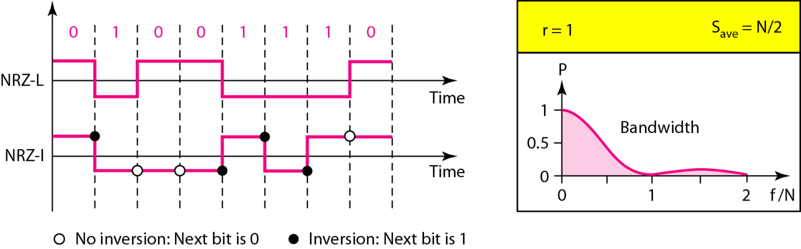

- **NRZ-L**（ NRZ-Level, NRZ 电平编码）：信号电平决定了位值。

- **NRZ-I**（ NRZ-Invert, NRZ 反相编码）：信号电平是否反相转或跳变决定了位值。如果没有跳变，位值是0 ，如果有跳变，位值是 10。

> - NRZ-L 和 NRZ-I 都有 N/2 Baud 的平均信号速率。
> - 能量集中在 0 ~ N/2 之间的频率。
> - NRZ-L 和 NRZ-I 都有基线偏移、同步和 DC 问题。

例题：

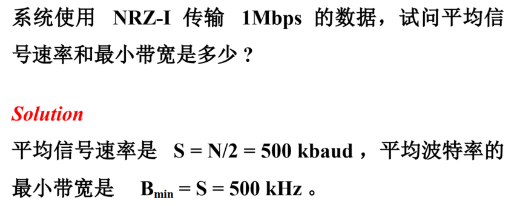

##### 极性编码 —— 归零码(Polar RZ)

归零码使用三个值：正值、负值和零。在 RZ (return-to-zero) 中，信号不在两个位之间变化而是在位中变化。

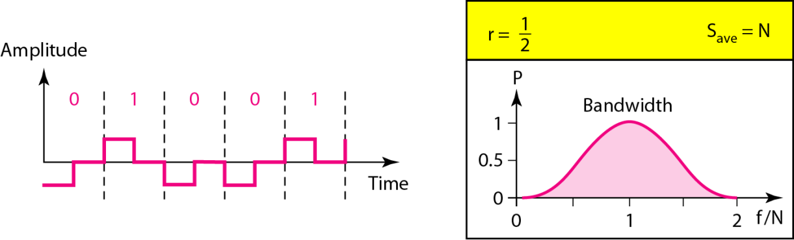

- 在每个位中间信号变为 0 
- 信号有三个值：正值，负值和零；
- 优点：自同步、无 DC 成分；
- 缺点：占用的带宽大，三个电平的生成和辨别更加困难。

##### 极性编码 —— 双相码(biphase)

**曼彻斯特 (Manchester) 编码 和 差分曼彻斯特 (Differential Manchester) 编码**

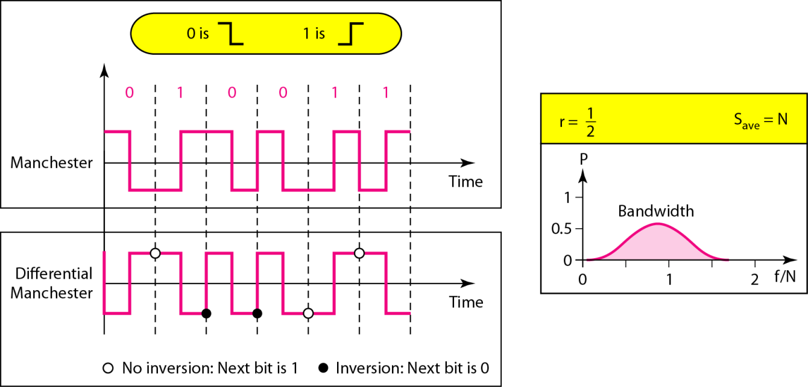

- **曼彻斯特编码**： RZ 的位中间跳变 + NRZ-L
  - 位的持续时间被二等分，前半部分电平保持一个水平，后半部分变成另外一个水平
  - 位中间的跳变提供了同步
  - 0 ：由高->低， 1 ：由低->高

- **差分曼彻斯特编码**： RZ + NRZ-I
  - 中间总有跳变，在位起始位置如果下一位为
  - 1 ：起始不跳变； 0 ：起始有跳变

> - 优点：没有基线偏移，没有 DC 成分，自同步。
> - 缺点：曼彻斯特编码和差分曼彻斯特编码的最小带宽是 NRZ 的两倍。

#### 双极性编码(bipolar)

也称为多电平二进制 (multilevel binary) 编码。一个数据元素的电平是 0 ，另一个数据元素的电平在正值和负值间交替。

在双极性编码中，使用三种电平：正电平、负电平、零。  

##### 双极性编码 —— AMI 和伪三元编码  

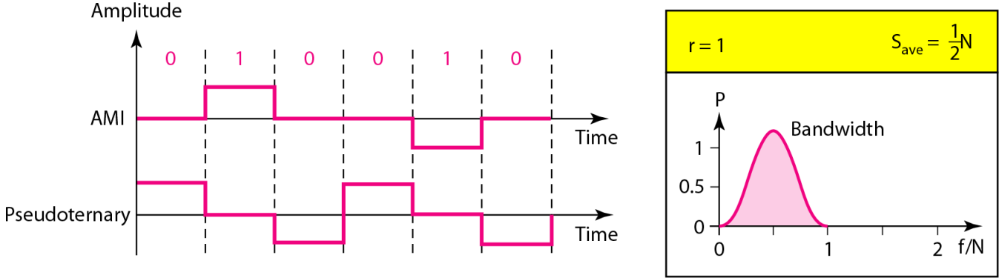

- **AMI (Alternate Mark Inversion)** ：交替传号反码 
  - 传号就是 1
  - 交替 1 的翻转替换
  - 0: 零电平，1: 交替正负电平

- **伪三元编码 (Pseudoternary)** 
  - 是 AMI 的一个变形
  - 1 编码成 0 电平， 0 编码成正负交替电平

> - 信号速率与 NRZ 一样，但没有 DC 成分；
> - 能量集中于频率 N/2 处；
> - AMI 存在长序列 0 时有同步问题。

#### 多电平编码(multilevel schemes)

- 通过把 m 个数据元素的模式编码成 n 个信号元素的模式，增加每波特的位数。
- 只有两种数据元素 (0,1), 表示 m 个数据元素组可以产生 $2^m$ 个数据模式组合。
- 不同信号元素可以用不同的电平表示，L 个不同的电平，可以产生 $L^n$ 个信号模式组合。
- 若 $2^m = L^n$ ，每个数据模式编成一个信号模式
- 若 $2^m < L^n$ ，每个数据模式只能占据一个信号模式的子集
- 若 $2^m > L^n$ ，无法数据编码

##### mBnL

- m 表示二进制模式的长度
- B 表示二进制数据
- n 是信号模式的长度
- L 是信号的电平数
  - 若 L=2 ，用 B 替换
  - 若 L=3 ，则用 T 替换
  - 若 L=4 ，则用 Q 替换

> 在 mBnL 方案中 , m 个数据元素模式编码成 n 信号元素模式， $2^m ≤ L^n$ 

**2B1Q**

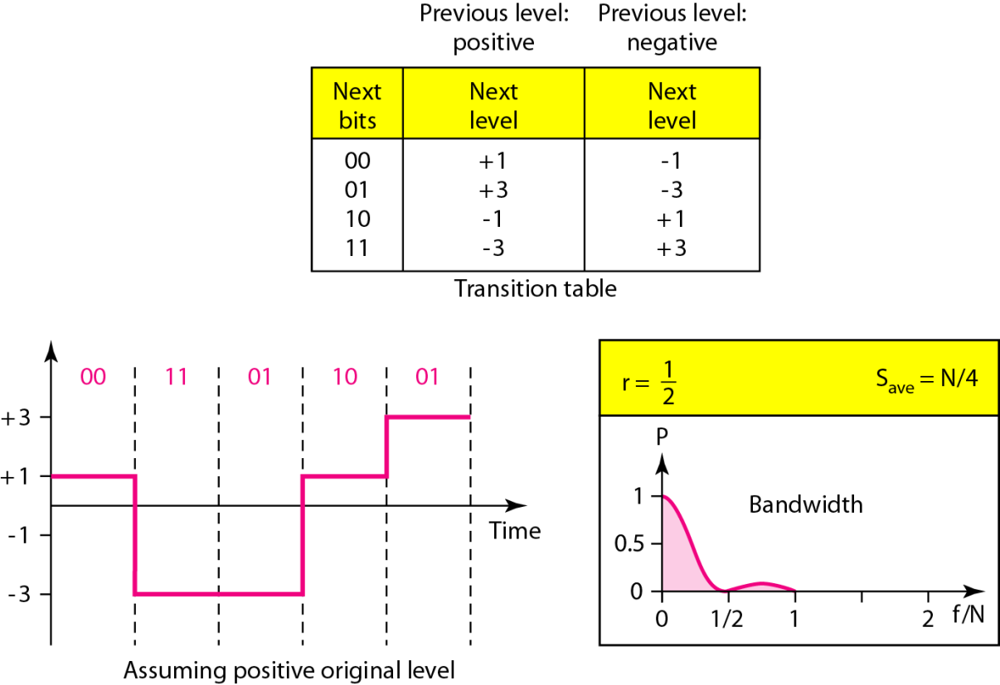

**8B6T**

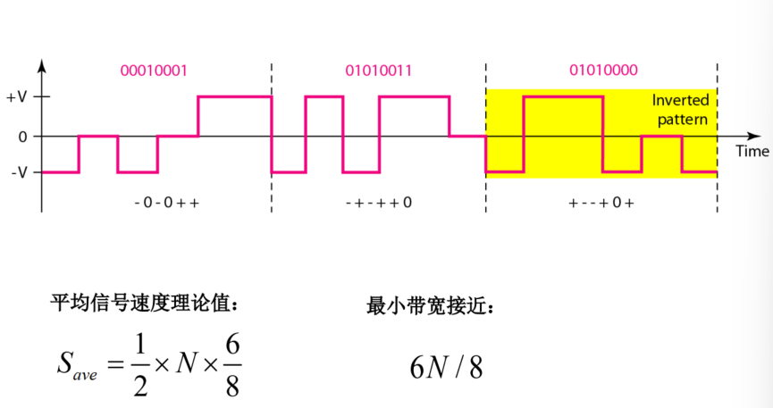

#### 多线路传输(multiline transmission)

- 三电平多线路传输 (multiline transmission, three level)
- 是一种多于两个跳变规则的差分编码
- 三种电平是： +V,0,-V

- 规则：  
  - 如果下一位是 0 ，没有跳变
  - 如果下一位是 1 且当前电平是 0，下一个电平是最后一个非零电平的相反值
  - 如果下一位是 1 且当前电平不是 0 ，下一个电平是 0

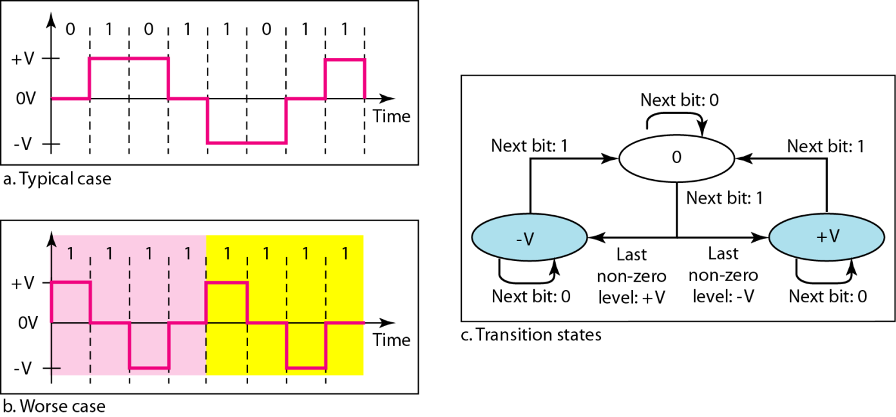

#### 线性编码方案总结

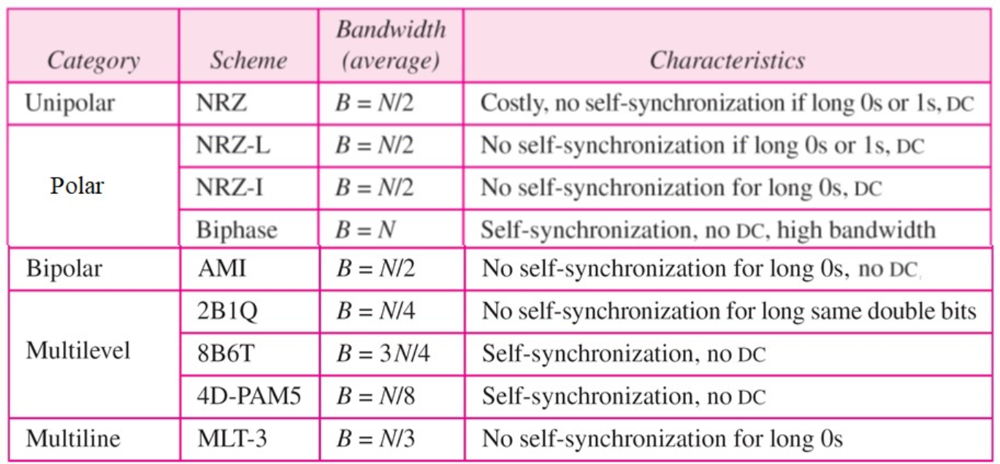

### 4.1.3 块编码 (block coding)

- 块编码通常称为 mB/nB 编码技术，把 m-bit 位组变成 n-bit ( n>m )

- 利用冗余确保同步和差错检测

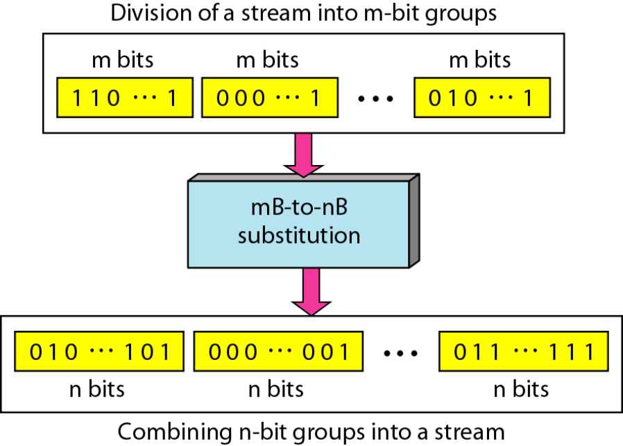

**4B/5B**

使用块编码 4B/5B 和 NRZ-I 线性编码方案：

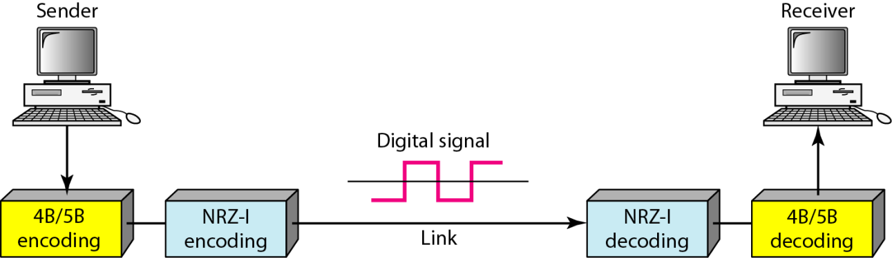

- 4B/5B 编码方案，将 4 位输入置换为 5 位输出仅包含不超过一个前导  0（左边的位）和两个后缀 0（右边的位）；
- 不同组合形成新的序列时，最多只会有连续 3 个 0 

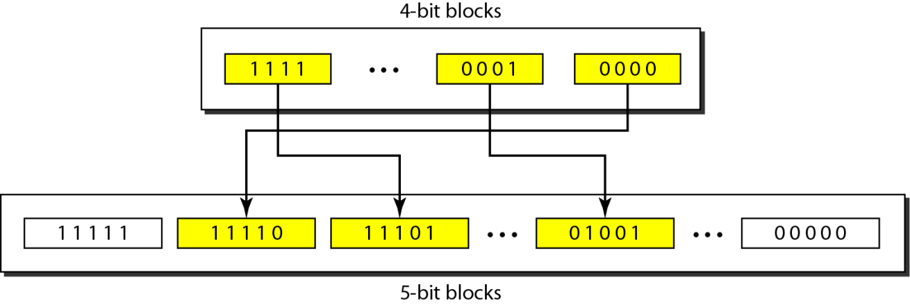

> - 4B/5B 编码解决了同步问题，克服了 NRZ-I 的缺陷；
> - 增加了 NRZ-I 的信号速率，冗余位增加 20% 的波特；
> - 没有解决 NRZ-I 的 DC 分量问题。

**8B/10B** 

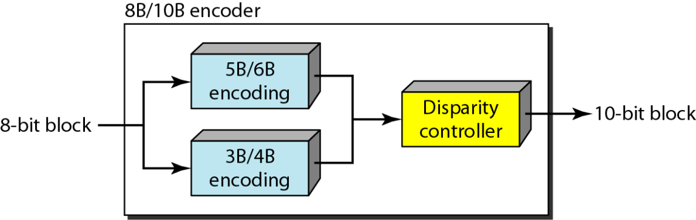

- 8B/10B 编码类似于 4B/5B 编码， 8 位数据组被置换成 10 位编码；
- 提供了更高的差错控制能力；
- 实际上 5B/6B 编码和 3B/4B 编码的组合；
- 为了防止连续 0 或者 1 的长串，使用不均等性控制器；
- 编码有： $2^{10}-2^8=768$ 个冗余组

### 4.1.4 扰码 (Scrambling)

> - 双相码适用于 LAN 中间站的专用链路，不适用于长距离通信；
> - 块编码和 NRZ 编码的组合有 DC 分量，也不适合于长距离通信；
> - 双极性 AMI 带宽窄且没有 DC 分量，但连续 0 的长序列会失去同步。
>
> 因此，修改部分 AMI 规则引入扰码 **B8ZS** 和 **HDB3** 。

#### B8ZS(bipolar with 8-zero substitution)  

规则：

- 8 个连续 0 电平会被替换成 000VB0VB ；
- V 表示违反 (Violation) ，是个非零电平，与前一个非零脉冲极性相同的极性，违反了 AMI 编码规则；
- B 表示双极，表示与 AMI 相一致的非零电平，即与一个非零脉冲极性相反的极性。

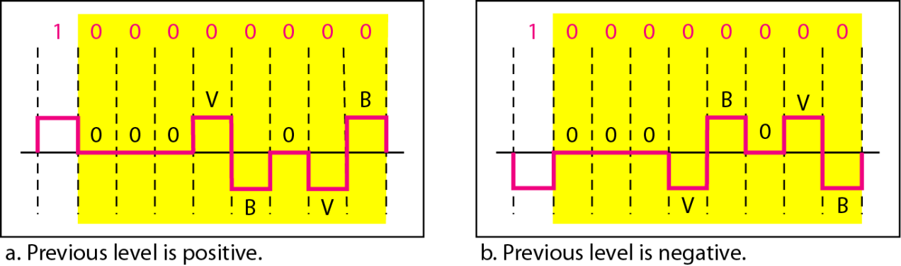

#### HDB3(high density bipolar 3-zero)  

规则：

- 4 个连续 0 电平被置换成 000V 或 B00V ；
- 两个不同的置换是为了维持每次置换后非零脉冲为偶数；
- 如果最后一次置换后的非零脉冲数是奇数，置换为 000V ，使得非零脉冲总数为偶数；
- 如果最后一次置换后的非零脉冲数是偶数，置换为 B00V ，使得非零脉冲总数为偶数。

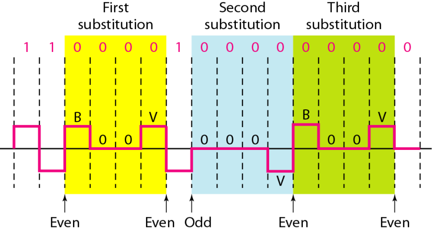

## 4.2 模拟到数字转换 (analog-to-digital conversion)

### 4.2.1 脉码调制 (pulse code modulation , PCM)

PCM编码器布三个过程 :

1. 对模拟信号进行 **采样**
2. 对采样后信号进行 **量化**
3. 量化后的值 **编码** 成位流

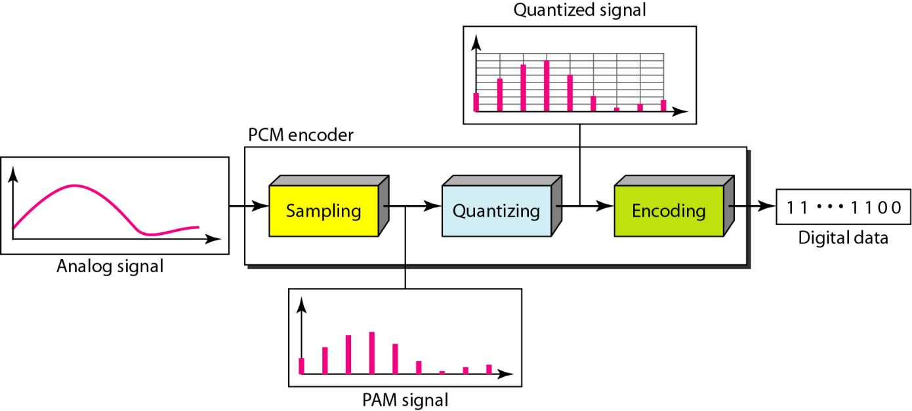

#### 采样(sampling)

3种不同的采样方法：

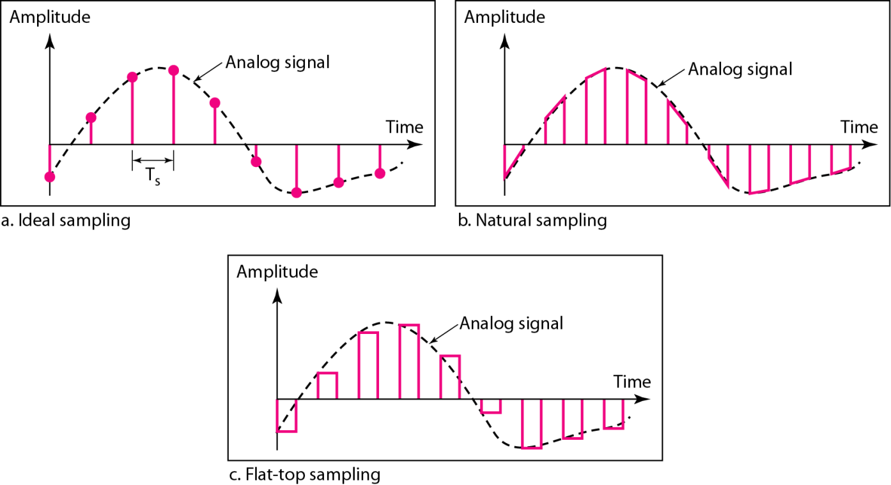

- **采样率**：也称采样速度或者采样频率，定义了单位时间内从连续信号中提取并组成离散信号的采样个数，单位是**赫兹 (Hz)** 。采样频率的倒数是采样周期或者叫作采样时间。
- 根据 Nyquist 定理，采样率必须至少是信号所含 **最高频率的 2 倍**。

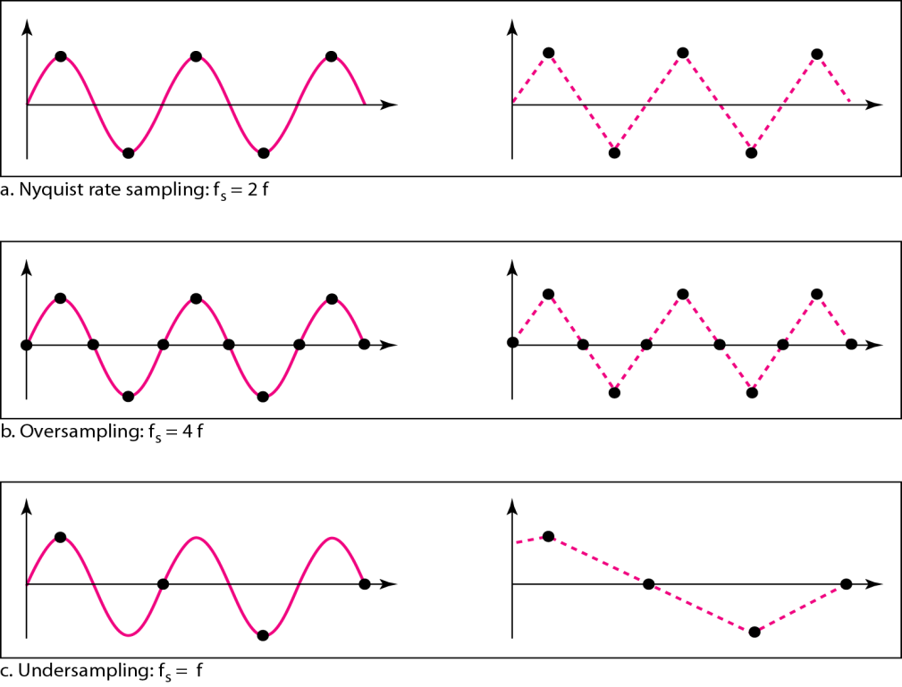

> a情况即采样率为奈奎斯特速率，最合适
>
> b情况的采样率为2倍奈奎斯特速率，冗余
>
> c情况的采样率为1//2倍奈奎斯特速率，无法产生与原始正弦波相近的信号

#### 量化(quantization)

采样后的结果是一系列振幅值介于信号最大振幅和最小振幅间的脉冲。

量化的步骤：

1. 假设原始模拟信号振幅介 $V_{min}$ 和 $V_{max}$ 之间；
2. 分成 $L$ 个区间，每个区间高度为 $Δ =(V_{max} - V_{min})/L$ ， $L$ 即为量化等级，与信号振幅范围及恢复信号的准确程度有关；
3. 分配 $0$ 到 $L-1$ 的量化值给每个区间的中点；
4. 样本振幅值近似为量化值。

**量化误差 (Quantization errors)**

- 量化是一个近似过程
- 输出值与实际输入值之间差值
- 可以证明量化误差对信号 $SNR_{dB}$ 的影响取决于量化级别 $L$ 或每个样本位数$n_b$

&ensp; $SNR_{dB} = 6.02n_b +  1.76dB$ 

> 增加级别数就会增加 SNR

**量化方式**

- 均匀量化： $Δ$ 的高度是固定的。
- 非均匀量化：$Δ$ 的高度不固定，低振幅时 $Δ$ 较大，接近高振幅时 $Δ$ 较小。

#### 编码(code)

采样后的数据用多少位比特表示。

如果每个样本可以转换成 $n_b$ 个位的码字，量化等级是 L ，则 $n_b = log_2L$  

$比特率 = 采样速率 × 每个样本位数 = f_s × n_b$

例题：

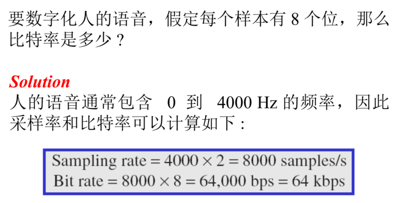

#### PCM 带宽

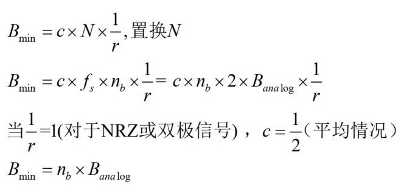

**结论**：**数字信号的最小带宽 **是 **模拟信号带宽** 的 $𝑛_𝑏$ 倍。

#### 原始信号的恢复(Original signal recovery)  


#### 通道的最大数据率 (Maximum data rate)

- 通道的数据速率是 $N_{max}= 2×B×log_2L$

- 设发送的数字信号有 $L$ 个电平，每个电平是一个信号元素，这表示 $r = log_2L$

- 比特率，即最大带宽是 $N = f_s × n_b= 2×B×log_2L  $

- 如果数据速率和信号电平数一定，所需最小带宽为:

  $B_{min} = \dfrac{N}{2 × log_2L} Hz$

### 4.2.2 Delta 调制 (DM)


**调制器**  

调制器用在发送方站点，用来从模拟信号中产生位流。

这个处理记录了小的正/负改变，称为$delta$ $δ$。

- 如果 $delta$ 是正的，就记录成 1 。
- 如果 $delta$ 是负的，就记录成 0 。  

在每个采样区间，调制器将模拟信号的值与梯形信号的最后一个值相比较。
如果模拟信号的振幅大，数字数据中的下一个位就是 1 ，否则就是 0 。  

但是，比较器的输出能自己生成梯形信号。

- 如果下一个位是 1 ，梯形信号生成器就会把梯形信号的最后一个点向上移 $δ$ ；
- 如果下一个位是 0 ，就向下移 $δ$ 。

注意需要一个延迟单元，在两次比较间保持梯形函数。  


**解调器**  

解调器得到数字数据，用梯形生成器和延迟单元产生模拟信号。但是产生的模拟信号需要经过一个低通过滤器来平滑信号。  


### 4.2.3 传输模式 (transmission modes)  

通过链路传输二进制数据可以采用并行模式或者串行模式。

- 在并行模式中，每个时钟脉冲发送多位。
- 在串行模式中，每个时钟脉冲发送 1 位。  

数据传输：

- 并行传输只有一种方式
- 串行传输分为三类：
  - 异步 (asynchronous)
  - 同步 (synchronous)
  - 等时(isynchronous)  


#### 并行传输 (parallel transmission)  


每次使用 n 条线路传送 n 位

- 优点是速度高
- 缺点是成本高，需要 n 条线路

#### 串行传输 (Serial transmission)


- 位是一个一个 **依次传输** 的
- 两个通信设备之间只需要 **一条通道**

- 优点是只要一条通信信道，成本只有并行传输的 1/n

**异步传输 (Asynchronous transmission)**


- 在传输中信号的时序并不重要，信息的接收和转换通过约定的模式进行。
- **约定模式** 基于将位流组成字节的方式建立，作为一个单位沿着链路传输。
- 没有同步时钟。增加 **起始位** 和 **停止位** ：在每个字节开始时发送 1 个起始位，结束时发送 1 个或者多个停止位。  
- 在每个字节之间会有一个 **时间间隔** 。
- 异步在这里是指在 **字节级上的异步**，但是 **每位仍然要同步**，它们的持续时间是相同的。  

**同步传输 (synchronous transition)**


在同步传输模式中，依次发送往流而 **不含** 起始位、停止位 和 间隙。接收方负责将位流分解为字节。  

- 同步传输的优点是速度快
- 同步传输通常多用于传输大块二进制数据

**等时 (isochronous transition)**  

- 保证数据以固定速率到达；
- 在实时音频和视频中，帧间的不等延迟是不可接受的；
- 整个流必须同步。

------

# ch05 Analog Transmission 模拟传输

## 5.1 数字到模拟转换 (digital-to-analog conversion)

### 5.1.1数字到模拟转换的概念


#### 数字到模拟转换的类型

#### 比特率和波特率

- 比特率：每秒发送的位数

- 波特率：每秒发送的信号元素数

在数字数据模拟传输中，波特率小于等于比特率。

$ S = N × \dfrac{1}{r} $

> $N$ 是数据速率（bps）
>
> 数字传输中 $r$ 是一个信号元素携带的数据元素的个数。
> 模拟传输中 $r = log_2L$ ， $L$ 是信号元素类型，不是电平个数。

#### 载波信号

- 模拟传输中，发送设备产生一个高频率信号作为基波来承载信息，这个基波就称为 **载波信号** 或 **载波频率**；
- 接收设备的收听频率与载波信号的频率一致；
- 数字信息通过改变载波信号的一个或多个特性来调制载波信号，称为**调制** 或 **移动键控**。

### 5.1.2 幅移键控 —— 二进制ASK (BASK)


**ASK带宽：**

$B = (1+d) × S$

> $S$ 是信号速率，$B$ 是带宽

**二进制 ASK 的实现：**


> 有 $100kHz$ 的可用带宽，范围从 $200$ 到 $300 kHz$。如果通过使用 $d = 1$ 的 ASK 调制数据，那么载波频率和比特率是多少 ? （假设 $d = 1$ 和 $r = 1$)
>
> 解：带宽中点是 $250kHz$ ，意味着载波频率 $f_c = 250 kHz$，可以使用带宽的公式得到比特率。
>
> 

### 5.1.3 频移键控 —— 二进制 FSK (BFSK)

如果两个频率的差是 $2Δf$ ，**BFSK 要求的带宽：**

$B = (1+d) × S + 2Δf$

> 一个 $100kHz$ 的可用带宽，范围从 $200$ 到 $300kHz$。如果使用 $d = 1$ 的 FSK 调制数据，那么比特率应该是多少 ? (r = 1)
>
> 解：使用 FSK 进行调制，频带的中点是在 $250 kHz$ 。选择 $2Δf$ 为 $50 kHz$ ，得到
>
> 

**BFSK 两种实现方法**

- **非相干 (noncoherent)**
  在非相干 BFSK 中，一个信号元素结束和下一个信号元素开始时相位不连续。可以看作使用两个载波频率的两个 ASK 。
- **相干 (coherent)**
  在相干 BFSK 中，两个信号元素边界处的相位是连续的。可以使用一个压控振荡器 (VCO) 实现，根据输入电平改变频率。


**多电平的FSK**

为了调制解调器正常工作，显然 $2Δf$ 的最小值需要是 $S$，则带宽为（$d = 0$）：

$ B = (1+d) × S + (L-1)2Δf    =>    B = L × S $

例题：


### 5.1.4 相移键控

#### 相移键控 —— 二进制 PSK (BPSK)


- BPSK 只用 2 个信号元素，一个相位是 0 ° ，另外一个相位是 180 ° 。
- BPSK 和 BASK 一样简单，但比 BASK 不易受噪声影响

**BPSK 的带宽**

$B = (1+d) × S$

**BPSK 的实现**


#### 相移键控 —— 正交 PSK (QPSK)


BPSK的简单性促使设计者在每个信号元素中一次使用 **2位**，因此减小了波特率和所需带宽。  

使用 2 个独立的 BPSK ：一个是同相的，另外一个是正交的（异相）  

#### 星座图 (constellation diagram)  

- 水平 X 轴与同相载波相关，垂直 Y 轴与正交载波相关
- 点在 X 轴的投影定义了同相成分的峰值振幅，点在 Y 轴的投影定义了正交成分的峰值振幅。
- 连线与 X 轴之间的角度是信号元素的相位。


ASK (OOK) 、 BPSK 和 QPSK 的星座图：


### 5.1.5 正交振幅调制 QAM

> - PSK 受设备辨别相位细小差别能力的限制，影响了比特率；
> - FSK 受到带宽限制，无法与其它调制方法结合；
> - ASK 和 PSK 结合构成正交振幅调制；

正文振幅调制 (quadrature amplitude modulation , QAM) 是ASK和PSK的结合。正交振幅调制使用两个振幅不同的载波，一个同相一个正交。

**QAM 的带宽**

QAM传输所需的最小带宽与 ASK和 PSK传输所需的最小带宽相同。相对于 ASK 来说，QAM与 PSK具有同样的优点。

## 5.2 模拟信号调制

模拟信号调制是通过模拟信号来表示模拟信息的。  

> 既然信号已经是模拟信号了，为什么还要调制模拟信号呢？
>
> 其主要原因是：如果介质具有带通特性或者只有带通带宽可用，则模拟信号就需要进行调制  

**模拟到模拟转换的类型**


### 5.2.1 调幅 (Amplitude Modulation)


AM 所需的总带宽可以由调制信号的带宽确定 : 

$B_{AM} = 2B$  

**AM无线电的标准带宽分配**  

音频信号的带宽通常为 5kHz ，所以调幅无线电台需要的最小带宽是 10kHz 。  


### 5.2.2 调频 (Frequency Modulation)


FM 所需总带宽由调制信号的带宽确定 : 

$B_{FM} = 2(1 + β) B$ 

> β 是调制因子，一般为 4  

**FM无线电的标准带宽分配**

立体声广播的音频信号带宽接近 15kHz ， FCC 允许每个调频电台使用 200kHz 的带宽，电台之间有至少 200kHz 的频率差，确保电台之间带宽不重叠。  


### 5.2.3 调相 (Phase Modulation)  


PM 所需的总带宽由调制信号的带宽和最大振幅确定 : 

$B_{PM} = 2(1 + β )B$  

------

# ch06 Bandwidth Utilization 带宽利用 

- 为达到特殊的目的，带宽利用是可用带宽的合理使用；
- **复用 (multiplexing)** 可获得效率；
- **扩频 (spreading)** 可以保密与抗干扰。

## 6.1 复用 (multiplexing)

> 只要连接两台设备的介质带宽比设备间传输所要求的带宽高时，该链路就可以被共享。 

复用就是允许同时通过一条数据链路传输多个信号的一组技术。  

**链路划分为通道**


- 通过一条数据链路传输多个信号
- **复用器 MUX** ：传输流量送到复用器，复用器将这些流量组成一个单独的传输流(多对一)。
- **分离器 DEMUX** ：传输流量被分离器接收，井分解成原来几个独立的传输流(一对多)。
- **通道 channel** ：在给定一对设备之间传送传输信号的链路的那部分。一条链路可能有多个 (n) 通道。  

**多路复用的分类**

### 6.1.1 频分多路复用 (FDM)


FDM 是用来 **组合模拟信号** 的模拟多路复用技术。

- 载波频率之间的频率差能够容纳调制信号的带宽；
- 通道之间使用防护频带进行分隔，防止信号重叠；
- 载波频率不能影响原始的数据频率；
- 数字信号转换为模拟信号之后仍然可以使用 FDM 。

**FDM 过程**


**FDM 分离过程**


例子1：
> 假定语音通道占用 4kHzkHz 带宽。需要将 3 个语音通道合并到一个带宽为 12kHz （ 20kHz ~ 32kHz ）的链路。使用频域图表示这一配置过程，假设不用防护频带。
>
> 

例子2：
> 有 5 个通道，每个通道的带宽是 100kHz ，全部进行多路复用。如果通道之间需要 10kHz 的防护频带以防止干扰，则链路的最小带宽是多少 ?  
>
> 解：对于 5 个通道，至少需要 4 个防护频带。这意味着至少需要带宽
>
> $5 × 100 + 4 × 10 = 540 kHz$
>
> 

**模拟载波系统**

模拟层次结构：


### 6.1.2 波分多路复用 (WDM)


WDM 是合并多个光信号的模拟多路复用技术。

- 用于具有高数据速率传输能力的光缆；
- WDM 在概念上与 FDM 相同，其原理也一样；
- 差别是 WDM 复用的频率非常高。

**Prisms( 棱镜 ) 在波分复用中的复用和分离器**


- 在复用器上将多个光源组成单一光信号；

- 在分离器上做相反的处理；
- 光源组合与分离由棱镜完成；
- WDM 的一种应用是同步光纤网络 (SONET)。

### 6.1.3 时分多路复用 (TDM)


TDM 是组合多个低速通道为一个高速通道数据的复用技术。

- TDM 是一个数字化的过程，它允许多个连接共享一条高带宽链路；
- TDM 在时间上共享，每个连接占用链路的一个时间片段；
- TDM 将不同源端的数字数据合并到一个时间共享的链路上。

#### TDM 之一 —— 同步时分复用


同步 TDM 中 , 链路速率是数据速率的 **n** 倍，并且比单元持续时间短 **n** 倍。

> 将 4 个 1kbps 的连接一起复用，每个单位为 1 位。试求：
> (a) 复用前一位持续的时间
> (b) 链路传输速率
> (c) 时隙持续时间
> (d) 一帧持续时间
>
> 解：
> a. 复用前一位持续时间是 1 / 1 kbps, 即 0.001 s (1 ms) 。
> b. 链路速率是连接速率的 4 倍 , 即 4 kbps 。
> c. 每个时隙持续时间是复用前每位持续时间的 1/4, 即 250 μs。也可以从链路数据速率 4 kbps 来计算，位持续时间是数据速率 1/4 kbps 的倒数，即 250 μs。
> d. 帧持续时间与复用前一个单元持续时间相同，即 1 ms 。也可从另一个方法计算，每帧有 4 个时隙，所以一个帧持续时间是 250 μs 的 4 倍 , 即 1 ms 。

##### 交替 (Interleaving)


##### 空时隙 (Empty slots)


##### 数据速率管理

目前假定所有输入数据的速率是相同的，当数据速率不同的时候，采用策略 :  

###### 多级复用 (Multilevel multiplexing)  


###### 多时隙 (Multiple-slot multiplexing)


###### 脉冲填充 (Pulse stuffing)


##### 帧同步

通常在每帧的开始增加一个或者多个同步位。这些位称为帧 **指示位 (framing bit)** 。帧指示位按照某种模式逐帧发生变化，使分离器与输入流同步，以准确地分离时隙。多数情况下，每帧的同步信息由 1 位构成，交替变化为 0 和 1 。


##### 数字信号(digital signal, DS)服务 / 数字层次(digital hierarchy)结构  


##### T 线路

DS 和 T 线路速率：


用于电话线路多路复用的 T-1 线路：


T-1 帧结构：


##### E 线路


#### TDM 之二 —— 统计时分复用

同步TDM 和 统计TDM 时隙比较：


在同步TDM中，输出时隙全部由数据占用，而在统计TDM中，输出时隙需要携带数据和目的地址。  

## 6.2 扩频 (spreading spectrum)


- 对每个站点分配的带宽显然要比它所需要的带宽更大。

- 原来的带宽 $B$ 扩大到 $B_{SS}$ 必须有一个与原来信号无关的过程来做。也就是说，信号由源端生成后，扩频过程才发生。

### 6.2.1 跳频扩频 (Frequency Hopping Spread Spectrum, FHSS)

**跳频扩频** 是用源信号调制 M 个不同的载波频率。源信号扩展后占用的带宽是 $B_{FHSS}>>B$ 。  

#### FHSS 中频率的选择

> 称为 伪随机噪声 (pseudorandom noise , $PN$) 的伪随机代码生成器 (pseudorandom code generator) 对每个跳周期 $I_h$ (hopping , $T_h$ ) 源信号生成一个 $k$ 位模式。


> 模式是伪随机的，它在 8次跳后重复循环。8次跳频后，模式重复，再从101开始。  

FHSS 循环：

#### 带宽共享 (Bandwidth sharing) 

由于一个站点在每跳周期中只用一个频率，其他 $M - 1$ 个站点可使用另外的 $M - 1$个频率。

换言之，如果使用适当的调制技术，比如多 FSK (MFSK) , M个不同站点可用同一带宽 $B_{ss}$ 。

在 FDM 中，每个站点用带 宽的 $1/M $，但是固定的分配；
在 FHSS 中，每个站点占用带宽的 $1/M$ ，但跳到跳改变分配。


### 6.2.2 直接序列扩频 (Direct Sequence Spread Spectrum, DSSS)

在DSSS 中，每个数据位用扩展编码的 n 位代替。换言之，每一位被编码为 n 个码片，此处码片的速率是数据比特率源信号的 n 倍。


DSSS 的例子：


------

# ch07 transmission medium 传输介质


**传输介质的分类**


## 7.1 有向介质 (guided media)  

### 7.1.1 双绞线 (twistedpair cable)

双绞线由两根导线（通常是铜线）构成，其中的每一根导线都有自己的塑料绝缘层，两者绞在一起。

#### 非屏蔽双绞线 (UTP) 和屏蔽双绞线 (STP)  


**非屏蔽双绞线的分类**


**UTP 连接器**


**UTP 的性能**


> 规格 (gauge) 是电线粗细的标准计量单位。

### 7.1.2 同轴电缆 (coaxial cable)  

同轴电缆(或者称为同轴)与双绞线相比，可以传输 **更高频率范围** 的信号，部分原因是这两种介质的构造有很大的不同。  


外部金属包装既可以屏蔽噪声，又可以作为第二导体，构成回路。  

**同轴电缆的分类**


**同轴电缆连接器** 
—— BNC (Bayonet-Neil-Concelman) 连接器


BNC 终接器用于电缆的末端以防止信号反射。

**同轴电缆的性能**


同轴电缆的衰减要高于双绞线。尽管同轴电缆有更高的带宽，但是信号减弱很快因而经常需要使用中继器。

### 7.1.3 光缆 (fiber-optic cable)

光缆由玻璃或者塑料构成，能够传输光信号。  

**光线的折射**


**光纤 (optical fiber)**


**传播模式**


> Multi mode：多模
> Step index:  multi-mode step-index fiber 多模阶 **跃折** 射率光纤
> Graded indes: multi-mode graded-index fiber  多模 **渐变** 折射率光纤
>
> Single mode：单模 

**光纤类型**


**光缆组成**


**光纤连接器**


**光纤性能**


衰减相对于波长的变化曲线说明了光缆中的一种非常值得注意的现象，衰减曲线比双绞线和同轴电缆的衰减曲线要 **平坦**。
其性能如此之好，以至于在使用光纤时，只需要很少的中继器 (实际上少于 1/10 )。  

## 7.2 无向介质

无向介质不使用物理导体传输电磁波。
这种类型的通信通常是指 **无线通信 (wireless communication)**。

**无线通信使用的电磁频谱**

**传播方法**  


> lonosphere 电离层
>
> ground propagation 地表传播
> sky propagation 天空传播
> Line-of-sight propagation 视线传播

**波段**


**无线传输波 (wireless transmission)**


### 无线电波 (radio wave)

无线电波用于 **多播通信**，如收音机、电视以及寻呼系统。

**全向天线 (omnidirectional antennas)**

无线电波使用全向天线向所有方向发送信号。根据波长、强度和传输目的的不同，可以有多种类型的天线。  

### 微波 (microwave)

微波用于 **单播通信**，如移动电话、卫星网络和无线局域网。  

**单向天线 (unidirectional antennas)**

微波需要单向天线在一个方向发射信号。微波通信使用两种类型的天线：

- 抛物面碟形天线 (parabolic dish antenna)
- 喇叭天线 (horn antenna)


### 红外波 (infrared wave)

红外信号可以在封闭区域用于 **短距离通信**，使用 **视线传播**。  
