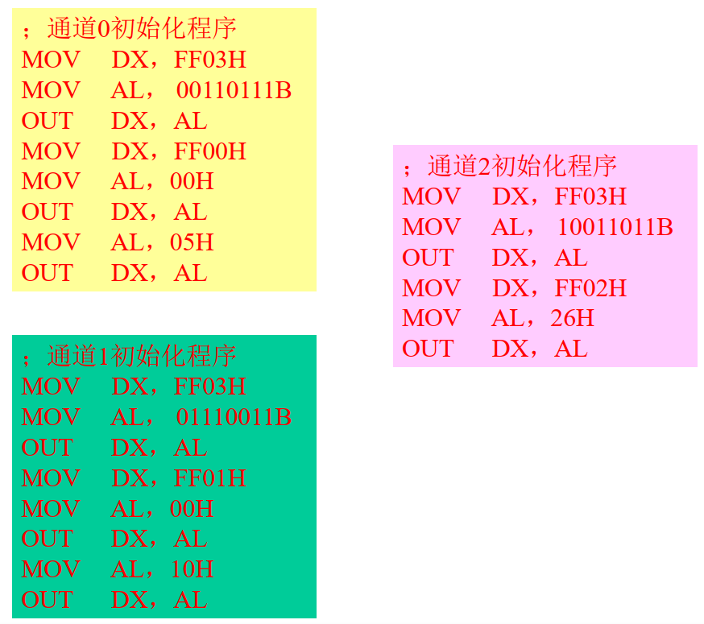

# 第8章 I/O

## 8.1 总线

-  总线系统是计算机系统的重要组成部分；
- 总线技术是计算机系统的重要技术， 其结构和性能对计算机系统的性能有很大影响。

### 8.1.1 概述

#### 1. 总线的分类

- 广义概念

  总线是连接两个或两个以上数字元件（数字系统）的信息通路。

- 计算机中的概念

  总线是<u>计算机系统多个功能部件之间进行数据传送的公共通路</u>。

- 分类
  - 一般的分类
    - 片内总线
    - 原件级总线（板内总线）
    - 内总线（系统总线）
    - 外总线（通信总线）
  - 单处理器系统中
    - CPU 内部总线
    - 系统总线
    - I/O总线

- 标准总线
  - 正式标准：IEEE、CCITT、ISO等标准
  - 工业标准：厂家提出

#### 2. 结构

- 单总线结构
- 双总线结构
- 多总线结构

#### 3. 总线性能描述


$B = \dfrac{n}{8T} = \dfrac{n \cdot f}{8}$

> n 为传输的数据位数
>
> T 为总线的时钟周期
> f 为总线的时钟频率

#### 4. 总线的特性

- 机械特性
- 功能特性
- 电气特性
- 时序特性

### 8.1.2 总线的信息传送

#### 1. 信息传递方式

##### a. 串行传送

当一个数据的各位利用**一条**数据线**依次进行传输**时构成串行传送。

##### b. 并行传送

当一个数据的各位利用**多条**数据线**同时传输**时构成并行传送。

##### 两种基本通信方式

- 同步传送
- 异步传送


#### 2. 总线的仲裁

借助于总线连接， 计算机在各系统功能部件之间实现地址、 数据和控制信息的交换， 并在争用资源的基础上进行工作。

**总线仲裁(Bus Arbitration)**： <u>⽤来决定哪个主设备可以使用总线的选择机制。</u>

当多个设备提出占用总线的请求时， 以某种方式选择其中一个设备占用总线。 一般需要 **总线仲裁部件**。  

1. 集中式仲裁
   - 串行总线仲裁（串行）
     - 使⽤总线的优先次序完全由“总线可用”线所接部件的物理位置来决定，<u>离总线控制器越近的部件其优先级越高。</u>  
   
     
   
     - 优点：
       - 优先级选择算法简单。  
       - 用于分配总线所需的线数少， 只需要3根，且不取决于部件的数量→可扩充性好。
       - 易于通过多重设置“总线可用”线来提高其系统的可靠性。
     - 缺点：
       - 可靠性差： “总线可用”线失效，会导致系统瘫痪。  
       - 灵活性差：优先级顺序固定。
       - 总线使用的分配速度低。
   
   - 并行总线仲裁（并行）
   
     
   
     - 优点：
       - 总线分配速度高，无需检测是哪个设备要求使⽤总线。
       - 灵活性好：总线使用的优先级可由程序控制改变。
       - 可靠性高：某个部件失效不会使系统瘫痪。
     - 缺点：
       - 所增加的辅助控制总线线数多，需要2N+1根。
       - 扩充性差。
       - 控制器复杂，价格高。
   
   - 计数器定时查询方式（轮询）  
   
     
   
     - 优点：
       - 灵活性好：总线使用的优先级可由程序控制改变。
       - 可靠性高：某个部件失效不会使系统瘫痪。
     - 缺点：
       - 所增加的控制总线较多，需要2＋ [log~2~n]根。
       - 可扩充性较差，受限于查询控制线的根数。
       - 控制器较复杂，价格较高。
       - 总线的分配速度不高。
   
2. 分布式仲裁

### 8.1.3 典型总线的介绍

典型的微机系统总线：ISA、 MCA、 EISA、 VESA、 PCI总线

#### PCI总线的结构与特点


**特点**：

- 高性能
- 总线设备工作与CPU相对独立
- 即插即用
- 支持多主控设备
- 错误检测及报告
- 两种电压环境
- 两种兼容卡槽

#### USB总线的结构与特点


**特点**：

- 传输速率高
- 支持即插即用
- 支持热插拔
- 良好的扩展性
- 可靠性高
- 统一标准
- 总线供电
- 传送距离
- 低成本

## 8.2 输入输出基本原理

### 8.2.1 外部设备

- 输入设备
- 输出设备
- 外部存储设备
  - 外部存储器
    - 磁存储器
    - 光存储器
  - 辅助存储器

#### i 磁记录原理与记录方式

##### 1. 磁记录原理

- 硬磁

- 剩磁

**原理**：<u>当磁头和磁性记录介质间有相对运动时，通过电磁转换完成读／写操作。</u>  


##### 2. 磁记录方式

磁记录方式是一种编码方法，是指按某种方案(规律)，把一连串的二进制信息变换成存储介质磁层中一个磁化翻转状态的序列，并使读／写控制电路能容易、可靠地实现转换。  

- 有归零制(RZ)、不归零制(NRZ)、调相制(PM)、调频制(FM)和改进调频制(MFM)等。
- 磁记录方式对提高记录密度、可靠性有重要影响。


##### 3. 性能评价

**自同步能力**： 从单个磁道读出的脉冲序列中提取同步时钟脉冲的难易程度。  

$R = 最小磁化翻转间隔 / 最大磁化反转间隔$

**编码效率（记录密度）**： 位密度与最大磁化翻转密度之比。  

$η = 位密度 / 最大磁化翻转密度  $

> 读分辨率、信息相关性、信道带宽、抗干扰能力…  

#### ii 硬磁盘存储器

##### 1. 硬磁盘存储器的种类

- 磁头的工作方式
  - 固定磁头
  - 移动磁头  
- 盘片可换与否
  - 固定盘存储器
  - 可换盘存储器  

##### 2. 硬磁盘存储器的部件

磁盘存储器由 **驱动器（Hard Disk Drive, HDD）**和 **控制器（Hard Disk Controller, HDC）**组成。  


##### 3. 磁盘结构

内部整体结构：


##### 4. 数据记录格式


##### 5. 连接框图


##### 6. 主要技术指标

- **存储密度**
  - 道密度：沿磁盘 *半径方向* <u>单位长度上的磁道数</u>。
  - 位密度：沿磁道 *圆周方向* <u>单位长度上所能记录的二进制位数</u>。

- **存储容量**
  - 非格式化容量：位密度 × 内圈磁道周长 × 磁道总数
  - 格式化容量： 扇区容量 × 每道扇区数 × 磁道总数

- **平均寻址时间**  
  - 寻道时间：与磁头径向移动速度有关
  - 旋转等待时间：与磁盘旋转速度有关

- **转速**

  指硬盘内驱动电机主轴的旋转速度，单位为RPM（转/分钟）。
  目前IDE硬盘的主轴转速一般为5400/7200RPM。SCSI硬盘主轴转速可达7200RPM~10000RPM，最高可达15000RPM。  

- **数据传输率**

  - 数据传输率(B/s) ：扇区内字节数 × 每道扇区数 × 磁盘转速  

##### 7. 磁盘阵列 RAID


###### RAID 0：冗余无校验的磁盘阵列

RAID 0 具有的特点，使其特别适用于对性能要求较高，而对数据安全不太在乎的领域，如图形工作站等。对于个人用户， RAID 0也是提高硬盘存储性能的绝佳选择。


###### RAID 1：镜像磁盘阵列

RAID1通过硬盘数据镜像实现数据的冗余，保护数据安全，在两块盘上产生互为备份的数据，当原始数据繁忙时，可直接从镜像备份中读取数据，因此RAID1可以提升读取性能。


###### RAID 2：并行汉明纠错阵列  

RAID 2是RAID 0的改良版，以汉明码的方式将数据进行编码后分割为独立的位 EccD元，并将数据分别写入硬盘中。因为在数据中加入了错误修正码，所以数据整体的容量会比原始数据大⼀些。


###### RAID 3：奇偶校验并行位交错阵列

RAID 3是在RAID 2 基础上发展而来的，主要的变化是用相对简单的异或逻辑运算（XOR， eXclusive OR）校验代替了相对复杂的汉明码校验，从而也大幅降低了成本。


###### 其他RAID

- RAID4：奇偶校验扇区交错阵列
- RAID5：循环奇偶校验阵列
- RAID6：二维奇偶校验阵列
- RAID7：最优化的异步高I/O速率和高数据传输率
  - RAID 7 完全可以理解为一个独立存储计算机，它⾃身带有操作系统和管理工具，完全可以独立运行。

#### iii 移动存储硬盘

##### 半导体存储


##### 光学存储


### 8.2.2 程序控制输入/输出技术

**<u>I/O系统：外部设备 + 设备控制器</u>**


#### 1. 外设接口的模型

- 数据口
- 状态口
- 控制口


#### 2. 外设的编址

##### 外设的两种编址方式

根据<u>外设地址与内存地址</u>的关系， 分为：  

- 独立编址方式
- 统一编址方式

##### 输入输出接口类型

按<u>信息传送的方式</u>分：

- 并行接口、串行接口
- 同步方式、异步方式

按<u>数据传送的控制方式</u>分：  

- 程序直接控制方式
- 中断方式
- 直接存储器存取（DMA）方式
- 通道控制方式与外围处理机方式

#### 3. 程序（直接）控制I/O方式

##### a. 无条件传送方式

**无条件传送方式** 是指可以在需要的时刻让CPU直接与外设进行输入输出操作，也即CPU仅需要通过I/O指令即可由接口<u>获取外设数据</u>或<u>为外设提供数据</u>。  

1. 输入接口设计

   对于简单的输入设备，在硬件上只需要设计一个<u>数据输入接口</u>即可以将该外设与CPU连接起来。 实现数据输入接口的器件可选用三态门。

   

   ``` assembly
   MOV DX, 0FFF7H
   IN AL, DX
   AND AL , 01H
   JZ ON
   JMP OFF
   ```

   

2. 输出接口设计

   <u>发光二极管与微机系统连接的接口电路</u>。<u>锁存器</u>作为发光二极管与微机系统数据总线连接的中间接口，<u>接收来自CPU的输出数据</u>。 当锁存器的CP端出现上升沿信号时，数据总线上的数据被锁存于锁存器内部并输出。

   

   CPU执行下述指令可以使两个发光二极管发亮：  

   ``` assembly
   MOV DX, 0000H
   MOV AL, 81H
   OUT DX, AL
   ```

   CPU执行下述指令可以使两个发光二极管不发亮：  

   ``` assembly
   MOV DX, 0000H
   MOV AL, 00H
   OUT DX, AL
   ```

   > 反相器对锁存器起保护作用， 当发光二极管发亮时， 反相器提供足够大的吸入电流， 以保护锁存器不受损坏。  

   

##### b. 查询方式

**查询方式** 是指CPU通过指令询问外设的工作状态,然后根据外设的状态确定对其进行I/O操作的时刻。  

1. 查询方式的实现

   

2. 多外设的查询控制

   查询方式是一种**同步机制**， 它以<u>**轮询的方式**</u>依次对各个外设进行服务。 <u>轮询的顺序确定了外设的优先级</u>， 而<u>轮询的顺序又是根据外设的重要性确定</u>。 通常是<u>相对重要的和速度快的外设</u>先被查询、 服务， 而相对不重要的和速度慢的外设后被查询、 服务。

   

## 8.3 中断方式

### 8.3.1 中断的基本概念

#### 1. 中断的概念

**中断**：是指某事件的发生引起CPU暂停当前程序的运行， 转入对所发生事件的处理， 处理结束又回到原程序被打断处接着执行这样一个过程。


- 中断源：引起中断的事件（内部错误、 外设请求等） 。  

  

- 断点

- 中断处理程序

#### 2. 中断的过程

##### 外部中断的一般过程

- 中断请求： 外设 → CPU  
- 中断响应： CPU → 外设  
  - 中断承认
  - 断点保护
  - 中断源识别  
- 中断处理： 中断服务程序 ISR
- 中断返回： 
  - 断点恢复
  - 返回  

### 8.3.2 实现中断的软硬件技术

中断是一种比较复杂的输入/输出技术， 实现中断需要较多的软硬件支持。

#### 1. 中断请求信号的有效性 —— 信号形式应满足CPU要求

- <u>电平类</u>中断请求信号：
  - 中断请求信号应保持至CPU发现；
  - CPU响应后，应及时撤除中断请求信号。
- <u>边沿类</u>中断请求信号：
  - 中断请求信号的锁存和撤消  

#### 2. 中断响应的条件 —— 以可屏蔽外部中断为例  

CPU对内部中断源提出的中断请求必须接受，而对外部中断源提出的中断请求是否响应取决于外中断源类型及响应条件。

- 一条指令执行结束
  - CPU在每条指令的最后一个时钟周期检测中断请求  
- 特殊指令
  - STI、 IRET
  - 前缀指令， 如： REP MOVSB
- CPU允许中断（开中断 IF=1）；
- 无更紧迫的事务
  - 如：复位、 DMA、 更高级中断等

#### 3. 中断源识别

- <u>软件查询法</u>

  系统预定确定中断源对应的入口地址，查询时间长

  

- <u>中断向量法</u> —— 每个 *中断源* 对应唯一的 *向量码*

  设备接口向CPU提供的自身标识，CPU检索中断向量表，得到入口；

  

#### 4. 断点保护及恢复

- <u>断点信息</u> —— 断点地址、断点状态
- <u>断点保护</u> —— 保护断点信息
  - PSW、 CS、 IP 压栈 *（ CPU硬件自动完成 ）*
  - 其它寄存器(AX、 BX … ) 压栈 *（ ISR完成 ）*
- <u>断点恢复</u> —— 恢复断点信息
  - IP、 CS、 PSW 弹栈 *（ CPU硬件自动完成 ）*
  - 其它寄存器(AX、 BX … ) 弹栈 *（ ISR完成 ）*  

#### 5. 中断优先级

- 按照 ***重要性***、***紧迫性***、***速度*** 等要求安排中断优先级  
- 中断优先级控制应解决：
  - 不同优先级的中断源 <u>同时提出</u> 中断请求先响应最高优先级的中断源
  - CPU <u>正在进行</u> 中断服务时，又有 <u>更高优先级</u> 的中断源提出中断请求
- 目前采用的中断优先级控制方案有：
  - 软件查询
  - 利用可编程中断控制器 (PIC)
  - 硬件链式优先级排队电路
  - 硬件优先级编码比较电路  

#### 6. **中断嵌套**

当高优先级中断可以中断低优先级中断时，会产生 **中断嵌套**。

- **中断嵌套** 又称为 **多级中断**、**多重中断**
- 嵌套层数
  - 直接限制
  - 堆栈空间


中断服务程序的两种处理方法：


#### 中断的应用

- 中断技术使CPU与外设 并行工作，解决了快速CPU与中、慢速外设速度不匹配的矛盾，提高了CPU的工作效率。
- 除此之外，中断技术在实现 实时处理、分时操作、故障处理、多机连接、人机联系等方面均有广泛的应用。

### 8.3.3 x86 中断系统

8086(88)中断系统可以容纳最多<u>256个中断源</u>， 所有中断源统一编码， 每个中断源用一个字节型编码标识， 该编码称为<u>中断向量码（号）</u> ， 它是CPU识别中断源的标记。  

#### 1. 中断源类型

256个中断源分为两大类： <u>**内部中断**、 **外部中断**</u>


##### a. 内部中断

内部中断：由CPU内部事件及执行软中断指令产生。

已定义的内部中断有：

- 除法错中断
- 单步中断（TF=1)
- 断点中断（INT 3)
- 溢出中断（INTO）
- 软件中断

##### b. 外部中断

外部中断：外部中断源产生对CPU的请求而引发的。

8086(88)中断系统将外部中断源又分为2种：

- **非屏蔽中断 NMI**

  用于电源错、内存或总线错等  

- **可屏蔽中断 INTR**

  用于一般的输入\ 输出等

**NMI**与**INTR**的主要不同为：

- 请求有效形式不同： NMI为上升边有效； INTR为高电平有效。
- NMI不受IF的影响； INTR只有在IF＝ 1时才可能得到响应。
- NMI的优先级比INTR高。
- 中断向量码不同： NMI由CPU内部产生，为02H； INTR由外部硬件设定

#### 2. 中断响应过程

在8086(88)系统中， 中断控制是由CPU与中断控制器共同完成的(硬件自动完成)， 这使得中断过程简化：

1. 中断请求
2. 中断响应
3. 中断处理
4. 中断返回


##### 8088 CPU 响应中断请求

- CPU送出两个INTA负脉冲，在第二个负脉冲期间从数据总线上读得提出中断请求的中断源的中断向量码。  
- 将F、CS和IP压入堆栈。 
- 使TF、IF均为0。 
- 取中断向量码× 4作为中断向量表的地址，由此地址开始顺序四个单元的**前两个单元的内容送IP**、**后两个单元的内容送CS**。


#### 3. 中断向量表

- 在内存中开辟了1KB的存贮区作为中断向量表。
- 该表以四字节为一组构造而成， 共分为256组， 按中断向量码的序号排列。


> 在此之前，中断服务程序的入口地址早已填入中断向量表中  

#### 4. 微机的中断模型


### 8.3.4 中断控制器 8259


#### 1. 8259 内部结构


8259的3个状态寄存器：

- 中断请求寄存器IRR：IRR~X~= 1时， IR~X~ 有中断请求
- 中断屏蔽寄存器IMR：IMR~X~= 1时， IR~X~ 被屏蔽
- 中断服务寄存器ISR：ISR~X~= 1时， IR~X~ 正在中断服务  

#### 2. 8259工作方式

##### （1）工作模式

- 8080/85模式
- 8086/88模式

##### （2）优先级管理方式

- 固定优先级
  - 8个源由IR~0~到IR~7~优先级依次降低，IR~0~最高，IR~7~最低，不变。
- 自动循环优先级
  - 规定刚刚服务结束的中断源优先级最低，下一个中断优先级最高并依次降低。
  - 开始时IR~0~优先级最高
- 特殊循环优先级
  - 主程序或中断服务程序中利用命令来一次指定某一中断源的优先级最低。
  - 他的下一个中断源的优先级最高并依次降低，一次指定后，开始自动循环。

##### （3）嵌套方式

在中断处理过程中允许被更高优先级的事件所中断称为中断嵌套。

8259A有两种中断嵌套方式：

- 一般嵌套方式（默认方式）

  一中断正被处理时，只有**更高优先级**的事件可以打断当前的中断处理过程而被服务。

- 特殊全嵌套方式

  一中断正被处理时，允许**同级或更高优先级**的事件可以打断当前的中断处理过程而被服务。

> 特殊全嵌套仅用于多个8259A级连时的主8259A，而不能用于从属8259A或单8259A系统。  

##### （4）屏蔽方式

- 一般屏蔽方式（默认方式）

  中断响应后，利用ISR中的相应位置1，只能屏蔽**同级或更低级**的中断源。

- 特殊屏蔽方式

  将当前正在服务的中断加以屏蔽，使ISR中当前中断所对应的位清0，从<u>而使所有未被IMR屏蔽的中断源，包括更低级的中断源都有可能得到响应</u>。  

##### （5）中断结束方式

当某一IRi中断被服务时， ISR中的相应位ISRi=1。当服务结束后，则必须清零该ISR~i~位。使ISR~i~=0是通过向8259A发出中断结束命令（EOI命令）实现的。

- 非自动结束方式
  - 一般中断结束命令(EOI)  
    - 由CPU利用程序发送结束命令EOI，使8259中ISR中优先级最高的置1位清0，从而结束对该位的中断。
  - 特殊中断结束命令(SEOI)  
    - 用特殊命令SEOI来结束所指定的那一级中断
- 自动结束方式
  - 系统中只有一片8259且不出现中断嵌套时，采用自动接收方式
  - 中断响应的第二个INTA负脉冲清除ISR中的相应位

##### （6）中断触发方式

- 电平触发：高电平、维持到中断响应
- 边沿触发：上升沿，高电平维持到中断响应

##### （7）中断向量码


#### 3. 8259 级联


## 8.4 直接存贮器存取(DMA)方式  


- 直接存储器存取方式

  Direct Memory Access，DMA

- DMA控制器

  Direct Memory Access Controller，DMAC

**DMAC内部逻辑及与系统连接**


#### 1. 常用的DMA方式

DMA方式不是在程序控制下进行的， 而是以纯硬件控制的方式进行的。  

DMAC与CPU的总线控制权交换方式：

- 停止CPU方式
- 周期挪用方式
- CPU与DMA交替分时工作

##### a. 周期挪用方式


##### b. CPU与DMA交替分时工作


#### 2. DMA工作过程（停止CPU方式）

基本实现过程描述如下：

1. 外设向DMAC发出DMA请求**DREQ**；
2. DMAC将此请求传递到CPU的总线**保持端HOLD**， 向CPU**提出DMA请求**；
3. CPU完成当前总线周期后立即**对DMA请求作出响应**：  
   - 一是CPU<u>将地址总线、 数据总线、 控制总线**置高阻**</u>， 放弃对总线的控制权；
   - 二是CPU<u>送出有效的总线响应信号**HLDA**加载至DMAC</u>， 告之可以使用总线；    

4. DMAC向外设送出DMA应答信号**DACK**， 同时**占用总线**，开始对总线实施控制；
5. DMAC送出**内存地址**和对<u>内存</u>与<u>外设</u>的**控制信号**， 控制外设与内存或内存与内存之间的数据传送；  
6. DMAC通过计数控制将预定的数据传送完后，向CPU发出**无效的HOLD信号**， <u>撤消对CPU的DMA请求</u>；
7. CPU收到此信号后，送出**无效的HLDA**，并**重新开始控制总线**， 实现正常的总线控制操作。

#### 3. 中断 VS DMA

##### 中断和DMA的响应时刻


##### DMA 与 中断 相比较


#### 4. DMA控制器8237

##### 1）8237工作的两种周期

- **空闲周期**
- **工作周期**

1. 单字节传输方式

   在单字节传输方式下， DMA控制器每次请求总线只传送一个字节数据，传送完后即释放总线控制权。  

2. 块传输方式/组传输方式

   块传输方式是指DMA控制器每次请求总线连续传送一个数据块， 待整个数据块全部传送完成后再释放总线控制权  

3. 请求传输方式

   此方式与块传输方式基本类似， 不同的是每传输完一个字节， DMA控制器都要检测由I/O接口发来的DMA请求信号是否仍然有效， 如果该信号仍有效， 则继续进行DMA传输；否则， 就暂停传输， 交还总线控制权给CPU， 直至DMA请求信号再次变为有效， 数据块传输则从刚才暂停的那一点继续进行下去  

##### 2）传送类型

- 接口道存储器的传送
- 存储器到接口
- 存储器到存储器

##### 3）优先级

- 固定优先级
- 循环优先级

## 8.6 典型接口芯片

### 8.6.1 可编程计数器/定时器 8253

- 具有三个独立的16位减法计数器；
- 每个计数器可按二进制或BCD码计数；
- 每个计数器的计数速率可达2MHZ；
- 每个计数器有六种工作方式，可由程序设置和改变；
- 全部输入输出都与TTL电平兼容。

#### 1. 结构与功能


- 数据总线缓冲器写
  - 控制字
  - 写时常
  - 读计数值  

- 读写逻辑
- 控制字寄存器（存放控制字）
- 三个计数器（减法器）
  - 3个独立的16位减法器，可作定时/计数器使用；  
  - 计数器按二/BCD方式减法计数，从预常减到零时， OUT端输出一信号。  


- CLK：输入脉冲线；
- GATE：门控信号输入线； <u>GATE=0 禁止计数</u>， <u>GATE=1 允许工作</u>；
- OUT：输出引脚；当计数到“ 0”时， OUT 端输出一信号。

##### 8253 的寻址与操作


#### 2. 工作方式


##### 方式0 —— 计数结束中断

- CW 写入后 OUT 变低电平
- 计数值 写入后 1个时钟周期传到计数器，然后开始计数
- GATE = 1 进行计数，GATE = 0 停止计数
- 计数到0结束，计数结束后不再计数
- 传入新的计数值，**下一时钟周期** 开始新的计数


##### 方式1 —— 可编程单稳

- GATE 上升沿启动计数，OUT从下个时钟周期开始变为低电平
- 每次GATE上升沿，重新启动一次计数
- 计数到0后结束，计数结束后不循环，除非新的GATE上升沿
- 若传入新的计数值，只有**下次GATE上升沿**才启动


##### 方式2 —— 频率发生器

- CW 写入后 OUT 变低电平
- 计数值 写入后 1个时钟周期传到计数器，然后开始计数
- OUT计数时，输出高电平
- GATE = 1 进行计数，GATE = 0 停止计数
- 计数到 1 结束，一个低电平后循环，重新计数
- 若传入新的计数值，**下一个计数分频时**采用新的计数值


##### 方式3 —— 方波发生器

- CW 写入后 OUT 变低电平
- 计数值 写入后 1个时钟周期传到计数器，然后开始计数
- N为偶数时，前N/2为高电平，后N/2为低电平；N为奇数时，前(N+1)/2为高电平，后(N-1)/2为低电平。
- GATE = 1 进行计数，GATE = 0 停止计数且强迫 OUT 输出高电平
- 计数到 1 结束，一个低电平后循环，重新计数
- 若传入新的计数值，**下一个电平**采用新的计数值


##### 方式4 —— 软件触发选通

- CW 写入后 OUT 变高电平
- 计数值 写入后 1个时钟周期传到计数器，然后开始计数
- GATE = 1 进行计数，GATE = 0 停止计数
- 计数到 0 结束，一个低电平后循环，重新计数
- 传入新的计数值，**下一时钟周期**开始新的计数


##### 方式5 —— 硬件触发选通

- CW 写入后 OUT 变高电平

- GATE 上升沿启动计数，OUT从下个时钟周期开始变为低电平
- 每次GATE上升沿，重新启动一次计数
- 计数到 0 结束，一个低电平后循环，重新计数
- 若传入新的计数值，只有**下次GATE上升沿**才启动


#### 3. 控制字

在8253的初始化编程中，由CPU向8253的控制字寄存器写入一个控制字来规定8253的工作方式。  


一个计数器的初始化顺序：


#### 4. 8253 的连接与应用




### 8.6.2 可编程接口 8255

- 8255A是一种可编程的并行I/O接口芯片
- 三个八位输入/输出端口
- 具有多种工作方式（可编程）
- 一种通用芯片

#### 1. 结构与功能


- 三个八位 I/O端口（标识为A、 B、 C）按组进行编程
  - A组：端口A +端口C的高4位
  - B组：端口B +端口C的低4位

- 由CS引脚选中，进行端口编程、读或写
- 内部寄存器
  - A、 B、 C数据寄存器(读/写)
  - 控制字寄存器
- PA 八位输出锁存/缓冲器、八位输入缓冲器
- PB 八位输出锁存/缓冲器、八位输入缓冲器
- PC 八位输出锁存/缓冲器、八位输入缓冲器
  - 可以被分成两组4位的输入输出端口使用


##### 8255内部寄存器读/写操作时的信号关系  


#### 2. 8255的工作方式

- 三种工作方式
  - 方式0 —— 基本输入输出
  - 方式1 —— 选通输入输出
  - 方式2 —— 双向选通输入输出
- 8255A 复位状态
  - 三端口为基本输入方式

##### 方式0：基本输入输出

- A、 B、 CH、 CL 4 个端口可以被分别设置
- 或输入、或输出，共16种情况


- 定义为输出的口均有锁存数据的能力，而定义为输入的口则无锁存能力
- 在方式0下，C口有按位进行置位和复位的能力  

方式 0 适用于：

- 简单的输入输出操作，可使用无条件数据读写方式实现与外设的交互
- 也可以将联络信号接入C口，实现查询方式

#### 3. 控制字与状态字

##### （1）8255A 具有两类控制字

- **方式选择控制字**

  通过CPU向8255A的控制寄存器写入，选择端口的工作方式  

  

- **C口按位复位/置位控制字**

  8255A的C口具有位控功能，即端口C的8位中的任一位都可通过CPU向8255A的控制寄存器写入一个按位复位/置位控制字来置1或清0，而C口中其他位的状态不变。  

  

> 通过D~7~位区分

##### （2）状态字

当8255的A口、 B口工作在方式1或A口工作在方式2时，通过读C口的状态，可以检测A口和B口的状态。

#### 4. 8255 的寻址及连接使用


