# 计网课程大作业——校园网模拟设计

## I. 实验题目

校园网设计项目（eNSP模拟）

## II. 实验要求

1. 所有主机可 **访问外网**；

2. 主机可通过域名 **访问Web服务器**，选做 **FTP服务器**；
3. 配置 **动态路由**；
4. 教学楼主机通过 **DHCP自动获取地址**，办公楼 **划分VLAN**；
5. 科技楼主机使用 **专用地址**，需通过 **NAT** 来访问外网；*（选做）*
6. 无线局域网采用 **AC+FIT AP** 模式；*（选做）*
7. 为设备分配合适的 **IP地址** 和 **子网掩码**，IP地址的第二个字节使用学号的后两位。

## III. 实验分析与设计

### 实现方案设计

- 为南校区、北校区的图书馆、行政楼、教学楼、科技楼、公寓楼、办公楼都划分VLAN，并为其都配置合适的IP地址和网关信息，满足为科技楼主机使用专用地址和为办公楼划分VLAN的要求
  - 图书馆和对应的交换机为 `VLAN 10`
  - 行政楼和对应的交换机为 `VLAN 20`
  - 教学楼和对应的交换机为 `VLAN 30`
  - 科技楼和对应的交换机为 `VLAN 40`
  - 公寓楼和对应的交换机为 `VLAN 50`
  - 办公楼和对应的交换机为 `VLAN 60`
- 通过在教学楼对应的交换机上配置DHPC，实现教学楼PC自动获取IP地址
- 使用ospf协议为所有路由器配置动态路由
- 通过为 `AR1` 配置NAT，所有PC可以访问外网
- 配置南北校区的路由器，建立bgp邻居，实现P2P，使得南北校区可以互通
- 为Web服务器、FTP服务器、DNS服务器配置合适的IP地址，在DNS服务器中为Web服务器的IP地址配置域名映射，并为FTP服务器配置物理路径

### **拓扑图**

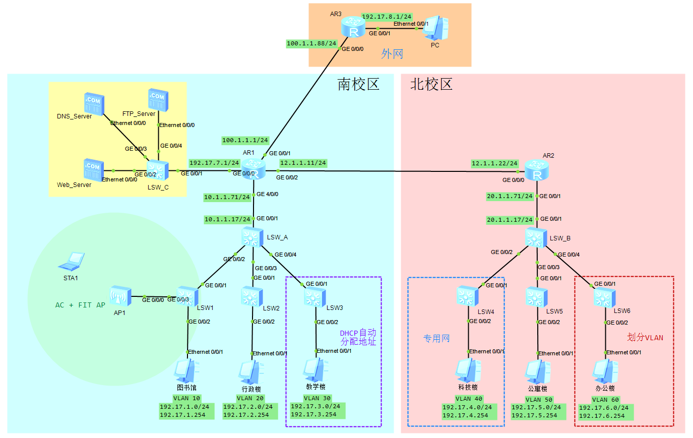

## IV. 实验过程

> 本人学号后两位为 **17**

### 1 各PC配置

| 主机名 | IPv4地址              | 子网掩码      | 网关         |
| ------ | --------------------- | ------------- | ------------ |
| 图书馆 | 192.17.1.1            | 255.255.255.0 | 192.17.1.254 |
| 行政楼 | 192.17.2.1            | 255.255.255.0 | 192.17.2.254 |
| 教学楼 | *<DHPC 自动分配地址>* | 255.255.255.0 | 192.17.3.254 |
| 科技楼 | 192.17.4.1            | 255.255.255.0 | 192.17.4.254 |
| 公寓楼 | 192.17.5.1            | 255.255.255.0 | 192.17.5.254 |
| 办公楼 | 192.17.6.1            | 255.255.255.0 | 192.17.6.254 |
| 外网PC | 192.17.8.10           | 255.255.255.0 | 192.17.8.1   |

### 2 配置路由器端口IP

**AR1**

``` shell
int g0/0/0
ip address 192.17.7.1 24
int g0/0/1
ip address 100.1.1.1 24
int g0/0/2
ip address 12.1.1.11 24
int g4/0/0
ip address 10.1.1.71 24
```

**AR2**

``` shell
int g0/0/0
ip address 12.1.1.22 24
int g0/0/1
ip address 20.1.1.71 24
```

**AR3**
``` shell
int g0/0/0
ip address 100.1.1.88 24
int g0/0/1
ip address 192.17.8.1 24
```

### 3 划分VLAN

#### a. 南校区

**LSW_A**

``` shell
vlan batch 10 20 30 777
int g0/0/2
port link-type trunk
port trunk allow-pass vlan 10 20 30
int g0/0/3
port link-type trunk
port trunk allow-pass vlan 10 20 30
int g0/0/4
port link-type trunk
port trunk allow-pass vlan 10 20 30
```

**LSW1**

``` shell
vlan batch 10 20 30
int g0/0/1
port link-type trunk
port trunk allow-pass vlan 10 20 30
int g0/0/2
port link-type access
port default vlan 10
```

**LSW2**

``` shell
vlan batch 10 20 30
int g0/0/1
port link-type trunk
port trunk allow-pass vlan 10 20 30
int g0/0/2
port link-type access
port default vlan 20
```

**LSW3**

``` shell
vlan batch 10 20 30
int g0/0/1
port link-type trunk
port trunk allow-pass vlan 10 20 30
int g0/0/2
port link-type access
port default vlan 30
```

#### b. 北校区

**LSW_B**

``` shell
vlan batch 40 50 60 777
int g0/0/2
port link-type trunk
port trunk allow-pass vlan 40 50 60
int g0/0/3
port link-type trunk
port trunk allow-pass vlan 40 50 60
int g0/0/4
port link-type trunk
port trunk allow-pass vlan 40 50 60
```

**LSW4**

``` shell
vlan batch 40 50 60
int g0/0/1
port link-type trunk
port trunk allow-pass vlan 40 50 60
int g0/0/2
port link-type access
port default vlan 40
```

**LSW5**

``` shell
vlan batch 40 50 60
int g0/0/1
port link-type trunk
port trunk allow-pass vlan 40 50 60
int g0/0/2
port link-type access
port default vlan 50
```

**LSW6**

``` shell
vlan batch 40 50 60
int g0/0/1
port link-type trunk
port trunk allow-pass vlan 40 50 60
int g0/0/2
port link-type access
port default vlan 60
```

### 4 配置网关信息

**LSW_A**

``` shell
int vlan 10
ip add 192.17.1.254 24
int vlan 20
ip add 192.17.2.254 24
int vlan 30
ip add 192.17.3.254 24
int vlan 777
ip add 10.1.1.17 24
int g0/0/1
port link-type access
port default vlan 777
```

**LSW_B**

``` shell
int vlan 40
ip add 192.17.4.254 24
int vlan 50
ip add 192.17.5.254 24
int vlan 60
ip add 192.17.6.254 24
int vlan 777
ip add 20.1.1.17 24
int g0/0/1
port link-type access
port default vlan 777
```

为 **外网PC** 设置网关和子网掩码：`192.17.8.1/24`

### 5 教学楼配置DHCP

**LSW_A**

``` shell
dhcp enable
ip pool vlan30
net 192.17.3.0 mask 24
gateway-list 192.17.3.254
dns-list 192.17.7.20 # DNS服务器IP地址
int vlan30
dhcp select global
```

### 6 配置动态路由

#### a. 交换机配置

**LSW_A**

``` shell
ospf 1
area 0.0.0.0
network 192.17.0.0 0.0.255.255
network 10.1.1.17 0.0.0.0
```

**LSW_B**

``` shell
ospf 1
area 0.0.0.0
network 192.17.0.0 0.0.255.255
network 20.1.1.17 0.0.0.0
```

#### b. 路由器配置

**AR1**

``` shell
ospf 1
area 0.0.0.0
network 10.1.1.71 0.0.0.0
network 12.1.1.11 0.0.0.0
network 192.17.7.0 0.0.0.255
network 100.1.1.1 0.0.0.0
```

**AR2**

``` shell
ospf 1
area 0.0.0.0
network 20.1.1.71 0.0.0.0
network 12.1.1.22 0.0.0.0
```

**AR3**

``` shell
ospf 1
area 0.0.0.0
network 100.1.1.88 0.0.0.0
network 192.17.8.0 0.0.0.255
```

### 7 配置NAT以访问外网

NAT能有效处理IP地址不足的问题并且可以防范网络攻击，所以使用配置NAT访问外网对于大量PC机的访问需求以及访问外网的安全性都是不错的选择。

**AR1**

``` shell
acl number 2000
rule permit source 192.17.0.0 0.0.255.255
nat address-group 1 100.1.1.10 100.1.1.20 # 为访问外网分配IP：100.1.1.10 ~ 100.1.1.20
int g0/0/1
nat outbound 2000 address-group 1
acl number 2001
rule permit source 192.17.0.0 0.0.255.255
nat address-group 2 192.17.7.30 192.17.7.40 # 为访问服务器分配IP：192.17.7.30 ~ 192.17.7.40
int g0/0/0
nat outbound 2001 address-group 2
```

### 8 配置南北校区互通

**AR1**

``` shell
bgp 111
peer 12.1.1.22 as-number 222
ipv4-family unicast
undo synchronization
network 192.17.7.0
network 192.17.1.0
network 192.17.2.0
network 192.17.3.0
peer 12.1.1.22 enable
```

**AR2**

``` shell
bgp 222
peer 12.1.1.11 as-number 111
ipv4-family unicast
undo synchronization
network 192.17.4.0
network 192.17.5.0
network 192.17.6.0
peer 12.1.1.11 enable
```

> 为交换机 `LSW_A` `LSW_B` 配置静态路由，以保证南北校区的PC机可以ping通各自校区路由器，从而可以互相ping通
>
> **LSW_A**
>
> ``` shell
> ip route-static 0.0.0.0 0.0.0.0 10.1.1.71
> ```
>
> **LSW_B**
>
> ``` shell
> ip route-static 0.0.0.0 0.0.0.0 20.1.1.71
> ```

### 9 配置服务器

|           | IP地址      | 子网掩码      | 网关         |
| --------- | ----------- | ------------- | ------------ |
| Web服务器 | 192.17.7.10 | 255.255.255.0 | 192.17.7.254 |
| DNS服务器 | 192.17.7.20 | 255.255.255.0 | 192.17.7.254 |
| FTP服务器 | 192.17.7.25 | 255.255.255.0 | 192.17.7.254 |

#### a. 配置Web服务器

在DNS服务器中配置Web服务器域名和IP地址的映射：

Web服务器域名：`www.WebServer.com`


#### b. 配置FTP服务器

设置FTP服务器中目标文件路径：

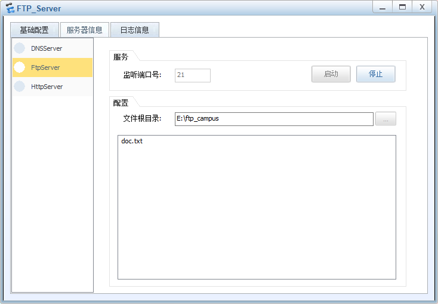


> 配置完服务器后，需要启动所有服务器

### 10 保存所有配置

在所有交换机、路由器的用户试图下运行 `save` 命令，在eNSP中保存配置。

## V. 实验结果

### 1 南北校区PC访问外网

图书馆主机 `ping` 外网PC


行政楼主机 `ping` 外网PC


教学楼主机 `ping` 外网PC

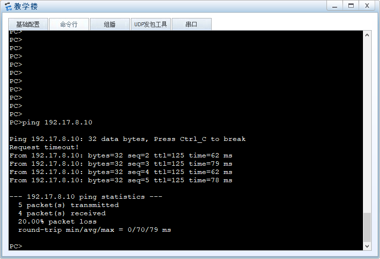

科技楼主机 `ping` 外网PC：在后续 *配置NAT* 结果部分展示

公寓楼主机 `ping` 外网PC

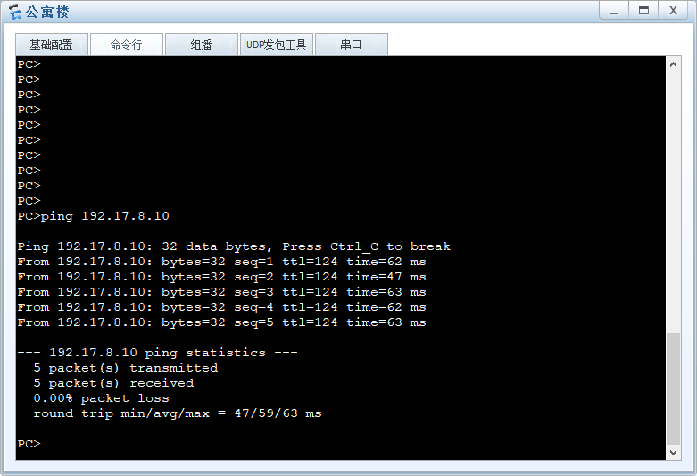

办公楼主机 `ping` 外网PC

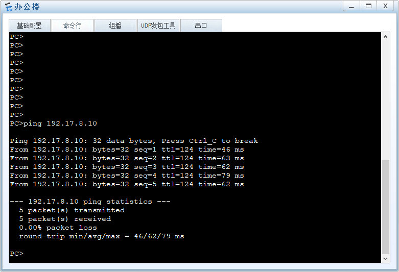

### 2 南北校区互通

南校区图书馆主机 `ping` 北校区办公楼主机

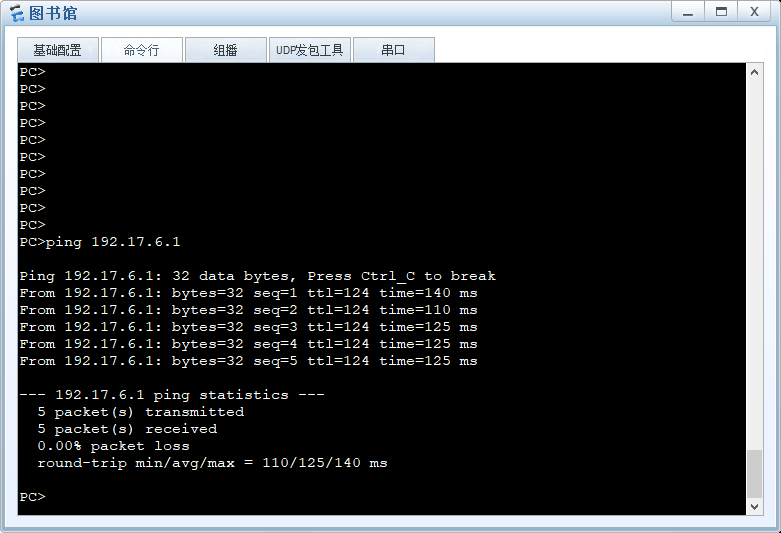

北校区办公楼主机 `ping` 南校区图书馆主机

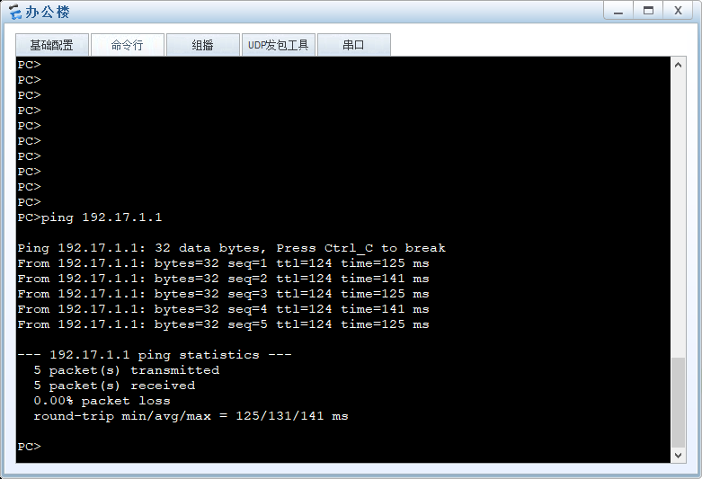

### 3 主机访问服务器

#### a. 访问Web服务器

> 访问前需要为主机配置DNS服务器IP地址 `192.17.7.20`

南校区教学楼访问Web服务器域名

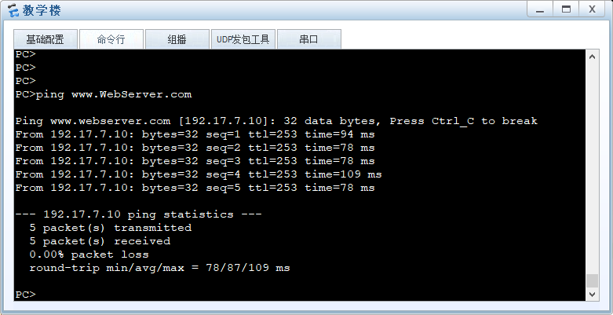

北校区公寓楼访问Web服务器域名

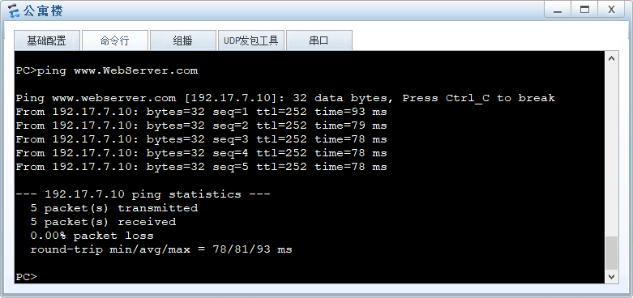

#### b. 访问FTP服务器

在路由器 `AR1` 的用户视图下，访问FTP服务器，FTP服务器IP地址 `192.17.7.25`。

设置用户名和密码，这里我的用户名和密码为：

- 用户名：`ykm`
- 密码：`1234`

登录FTP服务器并查看其中的 `doc.txt` 文件：

``` shell
ftp 192.17.7.25
ls
get doc.txt
```

FTP物理路径下 `doc.txt` 文件：


`doc.txt` 文件内容：

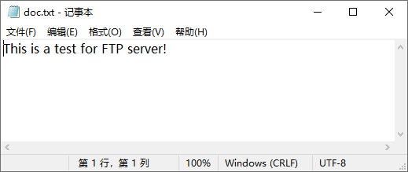

FTP访问结果：

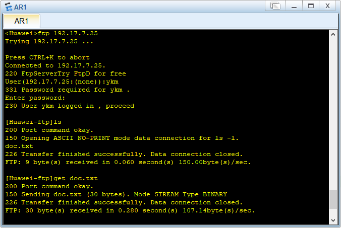

### 4 动态路由配置结果

查看路由器 `AR1` 的路由表：

``` shell
disp ip routing-table
```

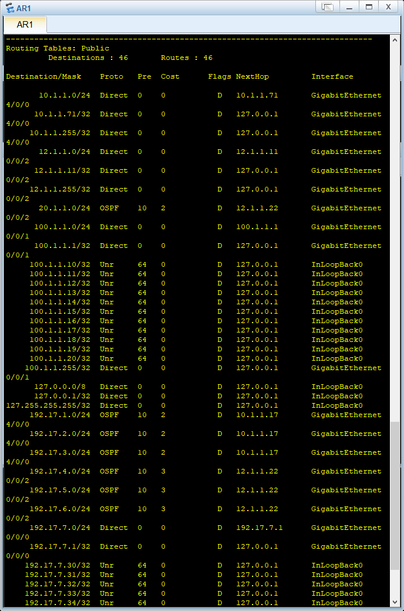

### 5 教学楼DHCP自动获取地址结果

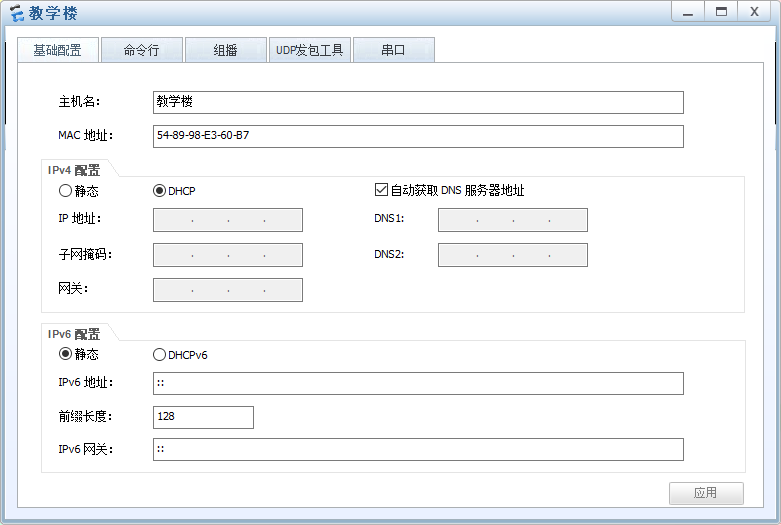

查看自动获取到的地址：`192.17.3.253`

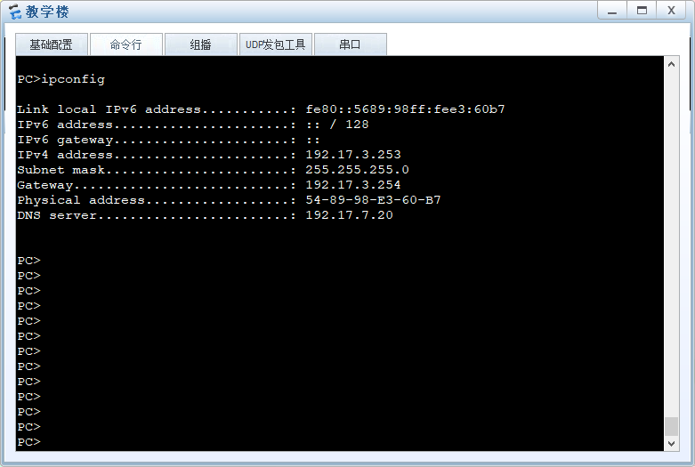

### 6 科技楼访问外网

由于科技楼是专用地址，所以通过配置NAT访问外网

科技楼主机 `ping` 外网PC：


使用WireShark对路由器`AR1` 的 `GE0/0/1` 抓包，查看到NAT为科技楼PC访问外网时分配的IP地址：`100.1.1.19`

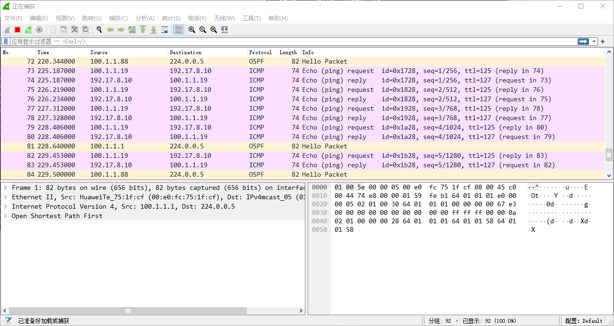

