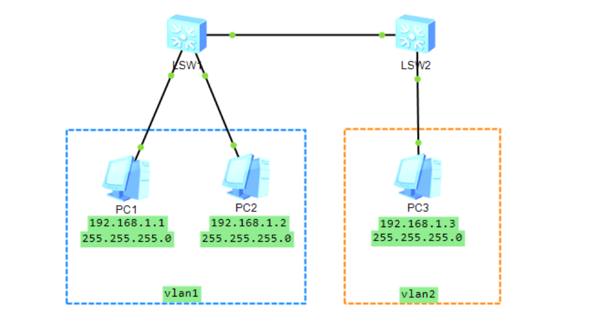

# 实验2：交换机VLAN相关实验


# 2.1 单台交换机VLAN配置

## 一、实验目的

理解交换机工作过程和端口属性；
学习交换机的基本设置方法 ；
掌握VLAN的划分和配置命令。

## 二、实验设备

一台交换机，三台主机，三根网线，一根console线

## 三、实验内容

1. `Display current-configuration`：查看当前网络设备的配置；
2. 在1台交换机上添加若干个新的vlan；
3. 给新添加的vlan各加入两个端口；
4. 配置PC的IP地址，用ping命令测试同一个vlan中连接的计算机是否能连通。
   前提：PC机的ip地址要在同一个子网，如PC1、PC2。

## 四、实验过程及结果

### 建立网络拓扑图

> 由于截屏丢失，这里使用ensp绘制网络拓扑图，并模拟


#### 分配IP地址

并为3台主机分别配置同一子网下的不同IP地址，以及设置子网掩码。

### 划分 VLAN

按照如下命令配置vlan：

``` ceylon
[switch]vlan 2
[switch-vlan2]quit
[switch]interface g0/0/3
[switch-GigabitEthernet0/0/3]port link-type access
[switch-GigabitEthernet0/0/3]port default vlan 2
[switch-GigabitEthernet0/0/3]quit
[switch]display vlan
```


### PING  测试

- PC1和PC2在同一网段下并且都在vlan2中所以可以ping通
- PC2和PC3也在同一网段下并且都在vlan3中也可以ping通
- PC1和PC3虽然在同一网段下但是属于不同的vlan，ping不通


## 五、实验心得

通过本次实验，我对于vlan有了更深的认识，vlan是将局域网设备从逻辑上划分成一个网段，从而实现虚拟工作组的数据交换技术：这种技术可以把一个LAN划分成多个虚拟的LAN一VLAN,每个vlan是一个广播域，vlan内的主机间通信就和在一个LAN内一样，而不同vlan间则不能直接互通，这样，广播报文被限制在一个vlan内。


# 2.2 跨交换机的VLAN划分

## 一、实验目的

熟练掌握跨交换机的vlan划分；
熟练掌握基于端口的vlan划分；
掌握Trunk端口的配置方法。

## 二、实验设备

两台交换机、四根网线、一根trunk线、一根console线、四台主机

## 三、实验内容

1. 按拓扑结构连接实验设备；
2. 配置PC机的IP地址；
3. 交换机1和交换机2分别创建vlan2 、vlan3，并且分配相应的端口；
4. 配置Trunk端口；
5. 测试结果。

## 四、实验过程及结果

### 建立网络拓扑图

> 由于截屏丢失，这里使用ensp绘制网络拓扑图，并模拟



#### 分配IP地址

并为3台主机分别配置同一子网下的不同IP地址，以及设置子网掩码。

### 配置 VLAN 和 TRUNK口

对于交换机1：

``` fortran
interface g0/0/1
port link-type trunk
port trunk allow-pass vlan 1
port trunk allow-pass vlan 2
quit
di vlan
```

对于交换机2：

``` fortran
vlan 2
int g0/0/2
port link-type access
port default vlan 2
quit
int g0/0/1
port link-type trunk
port trunk allow-pass vlan 1
port trunk allow-pass vlan 2
quit
display vlan
```

### PING 测试

- PC1可以ping通PC2，因为处于同一vlan
- PC1无法ping通PC3，因为虽然处于同一子网，但是不在同一vlan


## 五、实验心得

通过本次实验，我对于vlan划分有了更深的理解，学会了两台交换机用Trunk口连接以及Trunk的功能。Trunk是端口汇聚的意思，就是通过配置软件的设置，将2个或多个物理端口组合在一起成为一条逻辑的路径从而增加在交换机和网络节点之间的带宽，将属于这几个端口的带宽合并，给端口提供一个几倍于独立端口的独享的高带宽。

 