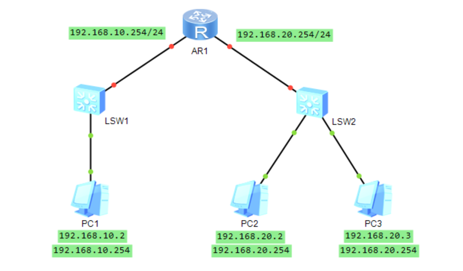
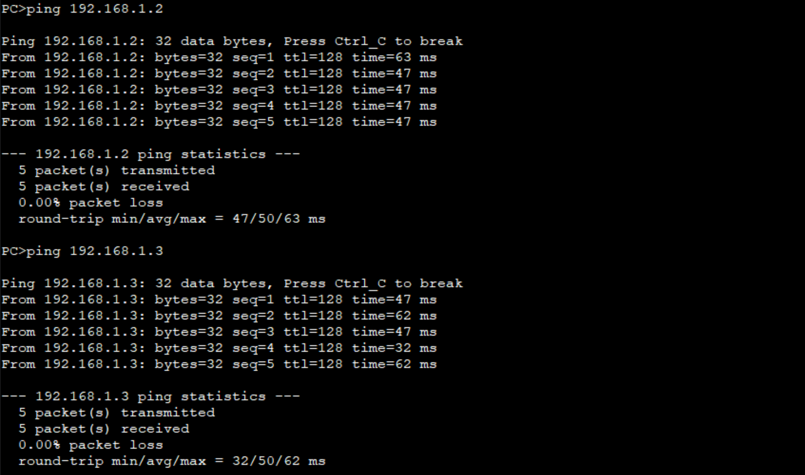
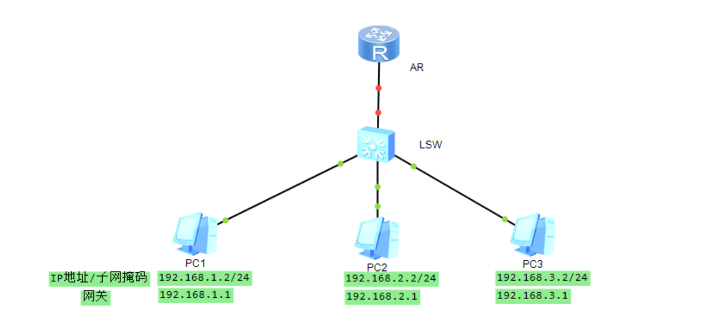
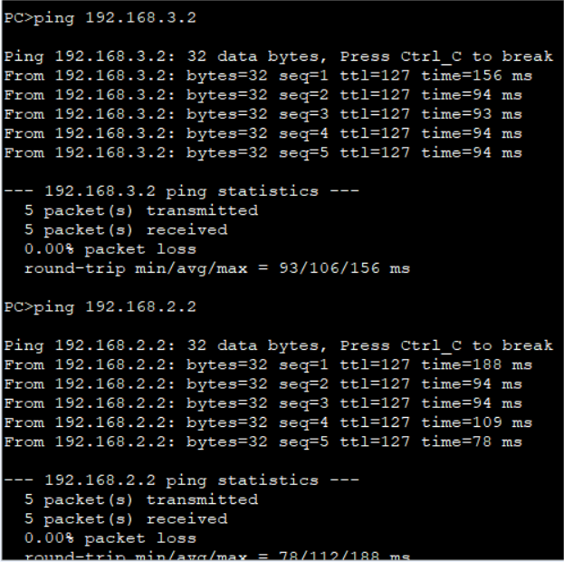

# 实验3：路由器基础配置实验


# 3.1 路由配置与子网交换

## 一、实验目的

1. 理解路由器在网络中的作用和用法
2. 掌握路由器的基本配置命令
3. 了解网络地址规划的原则和方法

## 二、实验设备

路由器一台，交换机两台，主机四台，网线若干，console线一根

## 三、实验内容

- 正确配置各PC机的IP地址、子网掩码和网关
- 查看交换机VLAN端口配置状态，选择合适的 端口组成2个LAN，画出网络拓扑图
- 按照网络拓扑图连接各网络设备
- 配置路由器端口地址
- 查看路由器当前配置参数
- 测试网络连通性

## 四、实验过程及结果

### 建立网络拓扑图



#### 配置IP、网关与子网掩码

如上图为每个PC配置IP地址、网关与子网掩码

### 配置交换机和路由

- 交换机划分vlan，分配端口
- 配置路由器指定接口的子接口，配置好该子接口的IP地址

### PING 测试

> 本人电脑为PC1

由于配置好了路由器与交换机，PC1可以PING通PC2、PC3



## 五、实验心得

通过本次实验，我理解了路由器在网络中的作用和用法，掌握了路由器的基本配置命令；对于网关有了深入体会。


# 3.2 单臂路由实验

## 一、实验目的

1. 深入了解虚拟局域网的划分、封装和通信原理
2. 理解路由器子接口概念和封装协议
3. 掌握路由器子接口的基本配置命令

## 二、实验设备

一台路由器，一台交换机，三台PC机，一根console线，一根Trunk线，三根网线

## 三、实验内容

- 规划网络连接拓扑图
- 按照拓扑图连接网络设备
- 在交换机上配置好vlan信息
- 将交换机上与路由器相连的以太网口配置成trunk模式
- 进入路由器指定接口的子接口，配置好该子接口的ip地址为该子接口封装dot1q协议
- 在PC机上用ping命令测试

## 四、实验过程及结果

### 建立网络拓扑图



### 交换机划分VLAN

- 换机上配置好vlan信息；
- 将交换机上与路由器相连的以太网口配置成trunk模式.

``` fortran
vlan batch 2 3 4
int g0/0/1
port link-type access
port default vlan 2
int g0/0/2
port link-type access
port default vlan 3
int g0/0/4
port link-type access
port default vlan 4
int g0/0/3
port link-type trunk
port trunk allow-pass vlan all
quit
disp vlan
```

### 单臂路由配置子端口

进入路由器指定接口的子接口，配置好该子接口的ip地址为该子接口封装dot1q协议

``` fortran
int e0/0/0.1
ip address 192.168.1.1 24
dot1q termination vid 2
arp broadcast enable
int e0/0/0.2
ip address 192.168.2.1 24
dot1q termination vid 3
arp broadcast enable
int e0/0/0.3
ip address 192.168.3.1 24
dot1q termination vid 4
arp broadcast enable
```

### PING 测试

> 本人电脑为PC1

PC1 ping通 PC2、PC3



## 五、实验心得

通过本次实验，我学习到Dot1q终结子接口和QinQ终结子接口不支持透传不带VLAN Tag的报文，收到不带VLAN Tag的报文会直接丢弃。由于三层以太网子接口不支持VLAN报文，当它收到VLAN报文时，会将VLAN报文当成是非法报文而丢弃，因此，需要在子接口上将VLAN Tag剥掉，也就是需要VLAN终结。