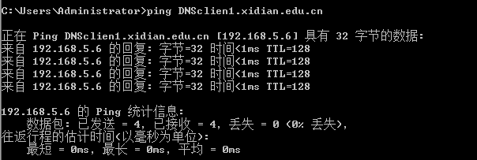
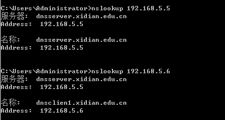
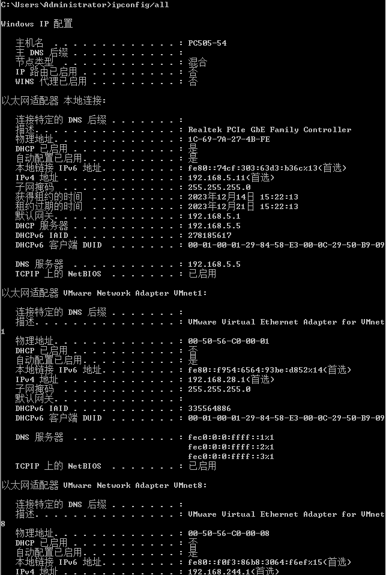
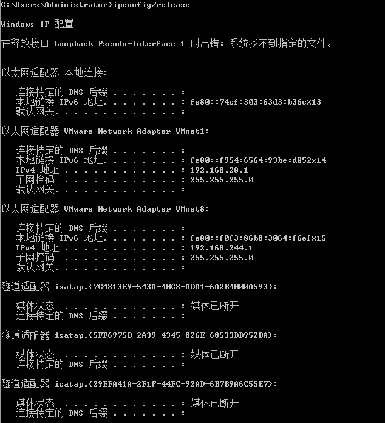
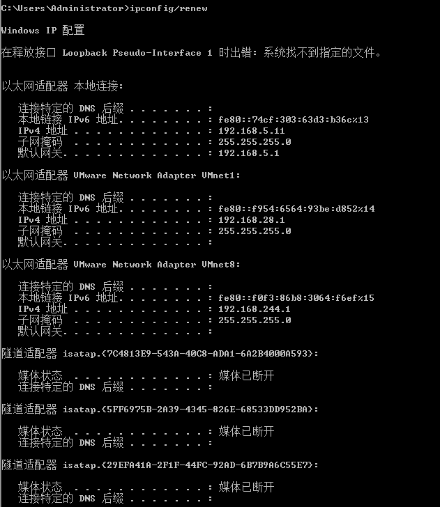

# 实验4：Windows下的DNS、DHCP服务器配置

# 4.1 Windows下的DNS服务器配置

## 一、实验目的

1. 理解DNS服务器的基本概念和工作原理；
2. 掌握在Windows 2003 server 上安装DNS服务器的方法；
3. 掌握DNS服务器的配置方法；
4. 掌握DNS域名解析的测试方法。

## 二、实验内容

- 在Windows 2003 server 上安装DNS服务器；
- 在Windows 2003 server 上配置DNS服务器；
- 创建DNS正向解析区域；
- 创建DNS反向解析区域；
- 配置计算机成为DNS服务器的客户端；
- 在客户端进行DNS正向解析测试；
- 在客户端进行DNS反向解析测试。

## 三、实验过程

- 服务器为Windows Server 2003，ip地址为192.168.5.5，子网掩码24位

- 客户端位Windows xp，ip地址为192.168.5.6，子网掩码24位，DNS服务器地址为192.168.5.5

- 向xidian.edu.cn主区域添加两台名称分别为DNSserver和DNSclient的主机后，正向查找文件的资源列表。
- 向192.168.5.xsubnet主区域添加两个新的指针（主机IP号和主机名称）后，反向查找文件资源列表
- 用ping命令测试DNS正向解析：ping 域名，得到主机的IP地址信息
- 用nslookup测试DNS反向解析：nslookup IP地址，得到主机域名信息

### 四、实验结果

- PING 测试

  

  

- `nslookup`

  

## 五、实验心得

DNS是一种组织成域层次结构的计算机和网络服务命名系统。域名系统允许用户使用友好的名字而不是难以记忆的IP地址来访问Internet上的主机。当用户在应用程序中输入DNS名称时，DNS服务器将此名称解析为与此名称相关联的IP地址。

# 4.2 DHCP服务器配置

## 一、实验目的

1. 理解DHCP服务器的基本概念和原理；
2. 掌握在Windows 2003 server 上安装DHCP服务器的方法；
3. 掌握DHCP服务器的配置方法；
4. 掌握基于DHCP服务器的客户机IP地址动态获取方法。

## 二、实验内容

- 在Windows 2003 server 上安装DHCP服务器；

- 在Windows 2003 server 上配置DHCP服务器；

- 建立IP作用域；

- DHCP选项配置（默认网关、DNS等）；

- 保留特定的IP地址给特定的客户端使用；

- DHCP客户端的配置与测试。

## 三、实验过程

- 服务器为Windows Server 2003，采取静态ip地址配置，ip地址为192.168.5.5，子网掩码24位

- 客户端位Windows xp，采用DHCP服务，自动获取ip地址，自动获取DNS服务器地址
- 设置好ip地址池
- DHCP客户端运行`ipconfig/all`命令查看获取到的IP地址信息，确认是否在 DHCP服务器所建立的IP作用域内。
- DHCP客户端运行`ipconfig /release`命令释放获取到的IP地址， 运行`ipconfig /renew`命令重新动态获取IP地址 。

## 四、实验结果

- `ipconfig/all`

  

- `ipconfig/release`

  

- `ipconfig/renew`

  

## 五、实验心得

DHCP是动态主机配置协议,在常见的小型网络中，IP地址的分配一般都采用静态方式，但在大中型网络中，为每一台计算机分配一个静态IP地址，这样将会加重网管人员的负担，并且容易导致IP地址分配错误。因此，在大中型网络中使用DHCP服务是非常有必要的。