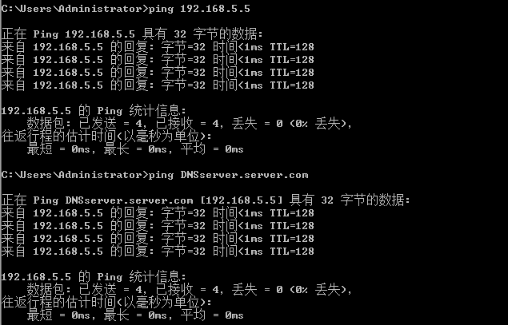
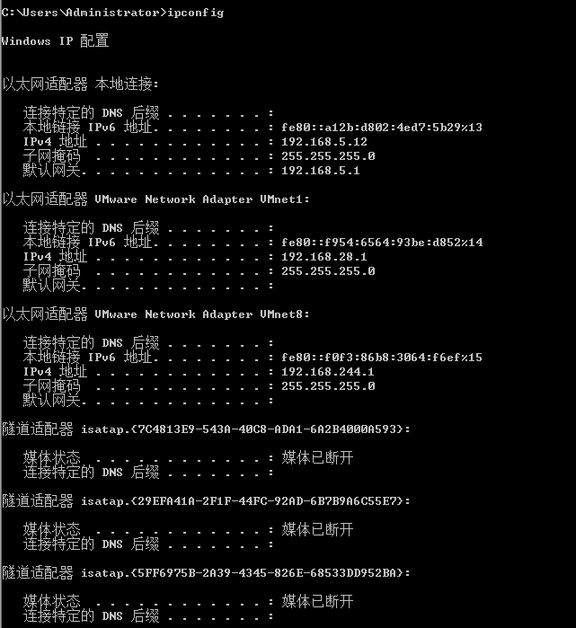
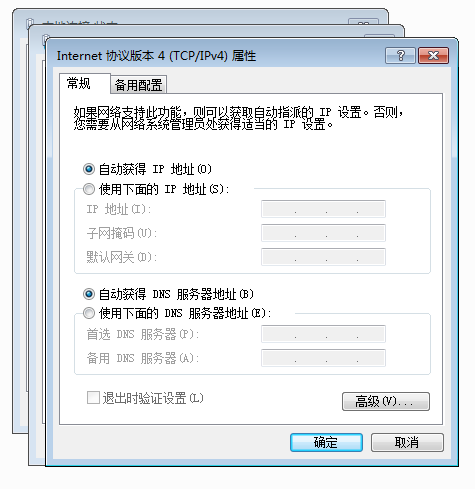
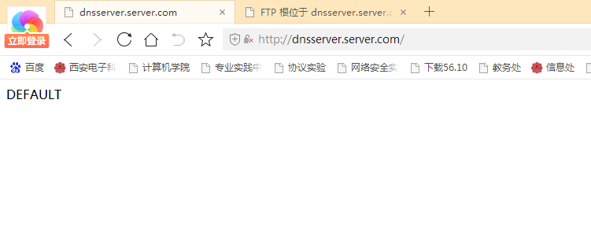
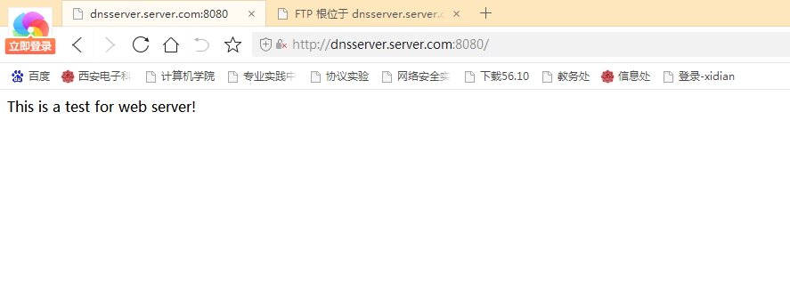
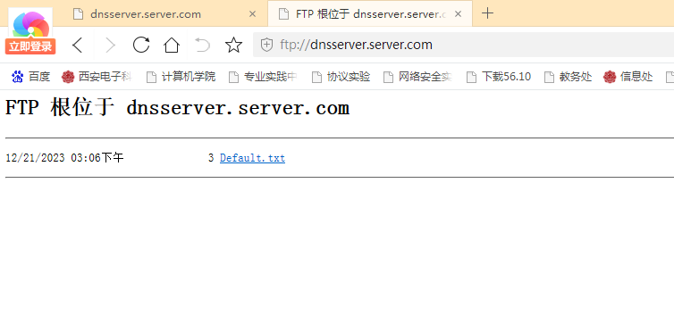
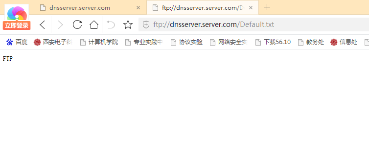
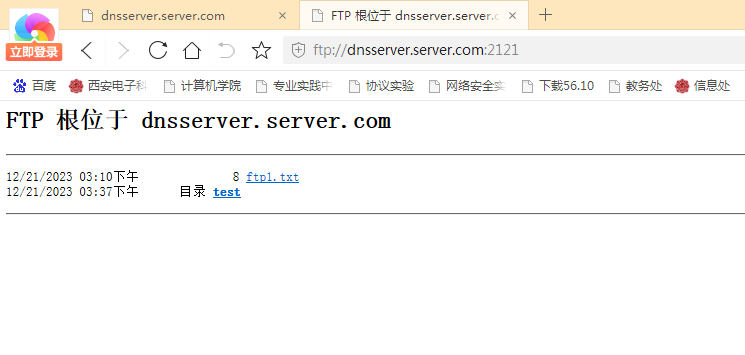
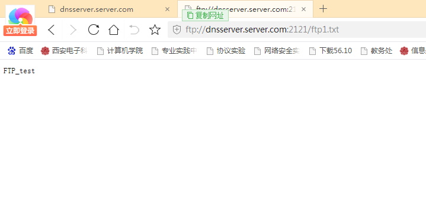
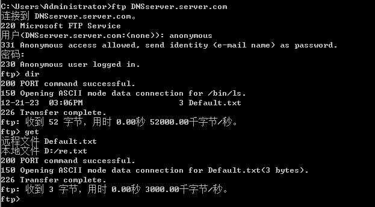

# 实验6：Windows下WEB、FTP服务器配置

# 6.1 Windows下的WEB服务器配置

## 一、实验目的

1. 理解IIS服务的基本概念；
2. 掌握在Windows 2003 server 上安装WEB服务器的方法；
3. 掌握WEB服务器的配置方法；
4. 掌握在客户端访问WEB服务器的方法。

## 二、实验内容

- 在Windows 2003 server 上安装WEB服务器；
- 在Windows 2003 server 上配置WEB服务器；
- 在客户端访问WEB服务器。

## 三、实验过程

- 服务器为Windows Server 2003，ip地址为192.168.5.5，子网掩码24位

- 客户端位Windows xp，ip地址为192.168.5.6，子网掩码24位，DNS服务器地址为192.168.5.5

- 默认网站，添加了文件`Default.htm`，内容为`DEFAULT`

- 添加了网站`test`，内有文件`web.htm`，内容为`This is a test for web server!`

- 网站属性，ip地址为192.168.5.5，tcp端口为8080

- 配置DNS，给web网站分配域名`DNSserver.server.com`

- 配置DHCP，自动获取DNS服务器地址

- 客户端通过浏览器（用域名）的方式访问WEB站点（默认以及自己添加的站点）

  > 此处要注意的是访问默认网站的时候可能显示没有权限，因为在网站属性中没有设置，按照自己添加的站点属性对应设置即可。

## 四、实验结果

- ping 测试 IP地址和域名的连通性

  

- 查看IP配置

  

- 配置好DHCP，自动获取DNS服务器地址

  

- 通过**域名**查看WEB服务器**默认端口**

  

- 通过**域名**查看WEB服务器**8080端口**

  

## 五、实验心得

通过本次实验，我理解了WEB服务器的基本原理，熟悉了WEB服务器的配置方法，学会了WEB客户端通过浏览器（用IP地址或域名）的方式访问WEB站点。

# 6.2 Windows下的FTP服务器配置

## 一、实验目的

1. 理解FTP的基本概念与工作原理；
2. 安装FTP服务器方法；
3. 配置与管理FTP服务器的方法；
4. 客户端访问FTP服务器的方法。

## 二、实验内容

- 在Windows 2003 server 上安装FTP服务器；
- 在Windows 2003 server 上配置FTP服务器；
- 在客户端访问FTP服务器。

## 三、实验过程

- 服务器为Windows Server 2003，ip地址为192.168.5.5，子网掩码24位

- 客户端位Windows xp，ip地址为192.168.5.6，子网掩码24位，DNS服务器地址为192.168.5.5

- 添加FTP站点属性
- 设置客户端访问默认FTP站点，并放置默认测试文件`Default.txt`
- 设置自己添加的FTP站点，使用`2121`端口
- 创建添加的自定FTP站点路径，放置文件`ftp1.txt`。双击FTP主目录文件，就可以打开该文件。鼠标右键单击文件名，然后选“复制到文件夹” ，弹出如图所示对话框，选择文件保存的路径，确定就可以将文件下载到本地指定文件夹内。
- 配置DNS，给web网站分配域名`DNSserver.server.com`
- 配置DHCP，自动获取DNS服务器地址
- 熟悉使用ftp，指令测试`ftp+ip 地址`，登陆ftp默认站点，输入服务器的用户名和密码
- `ftp>get+文件名`指令从ftp服务器下载文件
- `ftp> put+文件名`将当前目录下的文件上传到从ftp服务器

## 四、实验结果

- 通过**域名**访问FTP站点默认端口

  

- 查看默认端口中的测试文件

  

- 通过**域名**访问FTP `2121` 端口

  

- 查看`2121`端口下的文件

  

- ftp命令测试

  匿名登录ftp

  

## 五、实验心得

通过本次实验，我熟悉了使用ftp指令测试ftp ip地址，学会了匿名登录ftp默认站点。