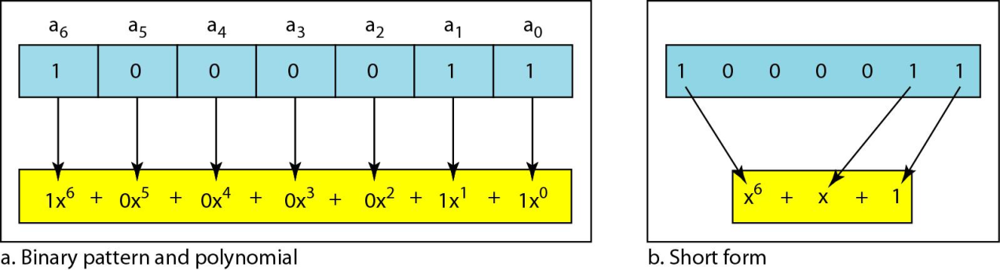
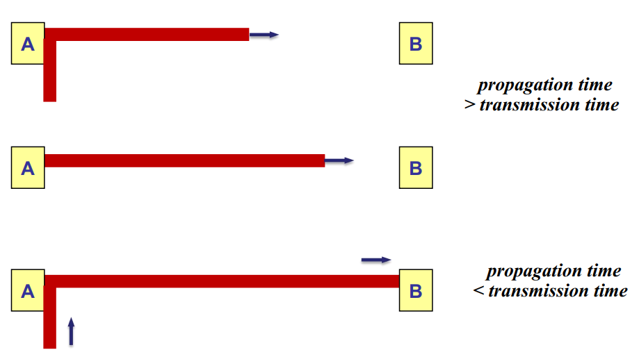
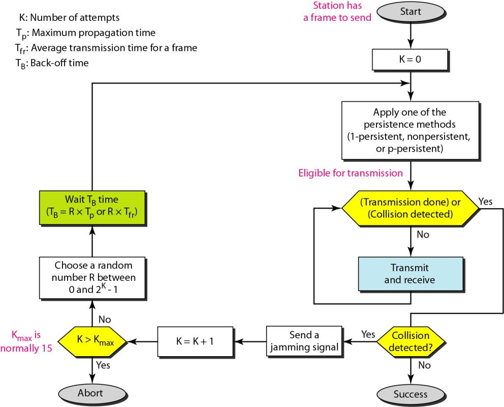
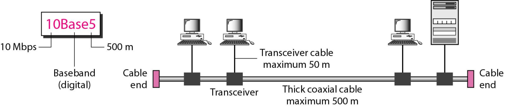
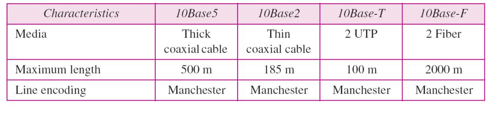
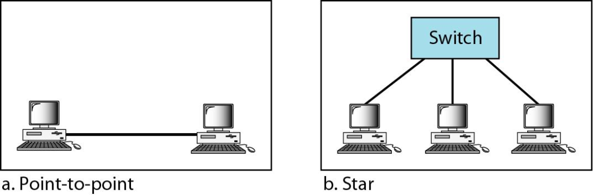

# 计算机网络——数据链路层

[toc]

## 数据链路概述

### 物理线路和数据链路

- **物理线路** 通常是指实际的一段物理电路， 用于连接两个传输设备或一台计算机与一个传输设备。
- 在两台计算机之间传输数据， 除了需要一条物理线路及相应的传输设备之外，还需要 ***协议*** 来控制数据在线路上的传输， 以保证数据传输过程的 *正确性* 。 实现这些协议的硬件、 软件与物理线路共同构成了 **数据链路**。


### 数据链路层的必要性

- ***通信线路*** 由 **传输介质 **与 **设备** 组成。 物理线路是指没有采用差错控制的传输介质与设备， 物理线路传输数据信号是 **存在差错的**， 普通电话线路不采取差错控制措施将无法达到计算机网络的要求。
- 设计 ***数据链路层*** 的目的是在原始的、 有差错的物理线路的基础上，采取 **差错检测**、 **差错控制** 与 **流量控制** 等方法， 将有差错的物理线路改进成无差错的数据链路， 以便向网络层提供高质量的服务。

- 从 ***网络参考模型*** 的角度来看， 物理层以上各层都有 **改善数据传输质量** 的责任， 数据链路层是其中最重要的一层。

### 数据链路层的主要功能

- **链路管理**
  数据链路的 **建立**、 **维持** 和 **释放** 称为链路管理。  
- **帧同步**
  物理层的比特序列按数据链路层协议的规定被封装成帧来传输， 帧同步是指接收方能从接收的比特序列中正确判断出一帧的 **开始** 与 **结束位**。  
- **流量控制**
  信双方需要 **协调数据发送与接收速率** 是否匹配。 如果数据链路拥塞或接收方不能及时接收， 则发送方需要控制自己的发送速率。  
- **差错控制**
  数据链路层的主要功能是将有差错的物理线路变成 **无差错** 的数据链路。
- **透明传输**
  当传输数据中出现控制字符时， 就必须采取适当的处理措施， 防止接收方将数据内容误认为是控制信息。 任何一帧封装的数据无法保证不出现该比特序列， 这就是帧传输“ 透明性” 问题。


------


# ch10 Error Detection and Correction 检错与纠错

## 10.1 差错检测和差错纠正

**传输差错的产生过程**


**误码率**  

- 误码率是指二进制比特在数据传输中出错的概率， 是衡量数据传输系统在正常工作状态下传输可靠性的参数。 误码率在数值上近似等于 $P_e = N_e/N$， 其中 $N$ 为传输的二进制比特总数， $N_e$ 为被传错的比特数。
- 对于一个实际的数据传输系统，不能笼统地说误码率越低就越好，要根据实际传输要求提出误码率要求。传输速率一定时，要求的误码率越低，设备的复杂性越高，造价也越高。
- 差错出现具有随机性，在测量一个数据传输系统时，只有被测的二进制位数越多，才越接近真正的误码率值。

### 10.1.1 差错类型

#### a. 单比特差错 (Single-bit error)

数据单元中仅有一比特发生变化。


#### b. 突发性差错 (Burst error)

数据单元中有两位或多位发生变化。


### 10.1.2 冗余 (Redundancy)

==为了检测或纠正差错，需要发送除了数据外的额外（冗余）位。==
它们的存在允许接收方检测或纠正被破坏的位。  

### 10.1.3 检错和纠错 (Detection Versus Correction)

- 检错 (error detection)： 是否发生错误

- 纠错 (error correction)： 哪里发生错误

- 纠错方法： 前向纠错和重传

  - 向前纠错 (forward error correction)：是接收方通过使用冗余位尝试推测报文的方法

  - 重传 (retransmission) 纠错：是接收方检测出有差错发生并要求发送方重新发送报文的技术

### 10.1.4 编码 (Coding)

**编码方案**

- 块编码 (block coding)
- 卷积编码 (convolution coding)

**编码器和译码器的结构**


### 10.1.5 模运算 (modular ari thmetic)

使用有限范围的正整数， 其上限称为 **模数(modulus)** **N**。在 **模N** 运算中， 只使用 **0 到 N-1** 的整数。  

> 模2运算和异或运算关系
>
> 
>
> 

## 10.2 块编码 (block coding)

在块编码中， 把报文划分成块， 每块有 *k* 位， 称为 **数据字**， 并增加 *r* 个冗余位使其长度变为 *n = k + r*，形成 *n* 位的块称为 **码字**。  


**4B/5B 编码**


### 10.2.1 差错检测

满足以下两个条件，接收方就能检测出来原来码字的一个差错：

- 接收方有（ 或能找到） 有效码字的列表
- 原来码字已改变成无效的码字  

> 如果码字在传输中被破坏， 但接收到的码字仍然是一个有效的码字， 差错则无法被检测到。

**块编码的差错检测过程**  


==检错码是为某些类型的差错而设计的，因此 **只能检测这些类型的差错**，其它类型的差错则无法检测到。==

> 只能 **检测 1 比特检错码** 的例子。 
>
> 假设 k = 2， n = 3， 发送方把 01 编码成 011 发送给接收方。
>
> 1. 接收方收到 011。这是有效码字，接收方提取出数据字 01。  
> 2. 码字在传输中被破坏，接收方收到 111，是无效码字，丢弃。
> 3. 码字在传输中被破坏，接收方收到 000，是有效码字。接收方提取出数据字 00， 这两个破坏位形成的差错无法被检测到。
>
> 

### 10.2.1 差错纠正

- 检错： 接收方只需知道接收到的码字是无效的
- 纠错： 接收方需要知道发送的原来码字  

> 纠错比检错更复杂， 需要更多冗余位  

**纠错码的编码器和译码器的结构**  


> 只能 **纠正 1 比特错误** 的纠错码例子。
>
> 假设数据字是 01，生成码字 01011。这个码字在传输中被破坏，接收方收到01001。
>
> 检错： 
> 码字不在表中，说明发生了差错。
>
> 纠错：
> 假定只有1位被破坏。与表中码字比较，只有第二个码字与接收到的码字有一位不同，接收方用 01011代替01001，根据表格找到原来数据。
>
> 

### 10.2.3 汉明距离

**定义：** 两个相同长度字的汉明距离是 **对应位不同的数量**。 它是差错编码的核心概念。

**表示：** d (x, y) （总是大于0）

**计算：** 对两个字 **异或** 后计算 1 的个数  

==**最小汉明距离** 是一组字中所有可能 **对** 的最小汉明距离。==

- 编码方案写成 $C(n, k)$ 和一个单独的 $d_{min}$ 表达式，n是码字的长度，k是数据的位数，$d_{min}$ 是最小汉明距离。

- 接收到的码字和发送的码字之间的汉明距离是传输中被破坏的位数。

==为了保证 **检测** 出最多 $s$ 个错误， 块编码中最小汉明距离一定是 $d_{min} = s + 1$ 。==

> 计算最小汉明距离：
>
> 
>
> **最小汉明距离为 2**， 所以只能检测 **单比特错误**。  

差错纠正中 $d_{min}$ 的几何意义：


> t 是被破坏的位数
> x, y 是码字

==为了保证最多能 **纠正** $t$ 个差错， 块编码中的最小汉明距离是 $d_{min} = 2t + 1$。==

> 纠错码需要的最小距离是奇数 (3, 5, 7, . . . )  

## 10.3 线性块编码 (linear block codes)

目前几乎所有使用的块编码都属于 **线性块编码** 的 **子集**。
在线性块编码中，**任两个有效码字的异或（即模二加）生成另一个有效码字**。

### 10.3.1 线性块码的最小距离 (minimum distance for linear codes)

线性块编码的最小汉明距离：<u>具有最小 1 的个数的非 0 有效码字中 1 的个数</u>。  

### 10.3.2 一些线性块编码

#### a. 简单奇偶校验码

简单奇偶校验码是 $n = k + 1$， 且 $d_{min} = 2$ 的单比特检错编码。

**奇偶校验码的编码器和译码器（模二加运算）**


> 奇偶位 (parity bit)：$r_0 = a_3 + a_2 + a_1 + a_0$ （模2运算）
>
> 校正子 (syndrome)：$s_0 = b_3 + b_2 + b_1 + b_0 + q_0$ （模2运算）

==简单奇偶校验码能检出 **奇数** 个差错==

> 假设发送方发送数据字 1011， 生成码字 10111。
>
> 1. 没有差错 —— 正确生成数据字
> 2. 单个位差错 —— 不生成数据字
> 3. 两个位差错 —— 生成错误数据字， 未发现差错
> 4. 三个位差错 —— 不生成数据字， 发现差错  

#### b. 两维奇偶校验编码


校验方式：

 

两维奇偶校验能检测出所有3位或3位以下的错误（因为此时至少在某一行或某一列上有一位错）、 奇数位错以及很大一部分偶数位错。

#### c. 汉明编码

> 只讨论最小汉明距离为 $d_{min} = 3$ 的汉明码， 它最多能检 **测出 2 位差错** 和 **最多纠正 1 位差错**。  

选择 $m ≥ 3$ 的整数， 则码字长 $n$、 数据字长 $k$ 和校验位 $r$ 的关系为：

$n = 2m - 1$，$k = n - m$，$r = m$

例：汉明码 C (7, 4)


**汉明码的编码器和解码器的结构（冗余位也是模2运算）**  


> $r_0 = a_2+a_1+a_0$
> $r_1 = a_3+a_2+a_1$
> $r_2 = a_1+a_0+a_3$
>
> $s_0 = b_2+b_1+b_0+q_0$
> $s_1 = b_3+b_2+b_1+q_1$
> $s_2 = b_1+b_0+b_3+q_2$

**译码器纠错逻辑分析器的逻辑判定**


- 生成器不关心无差错或奇偶位的差错
- 校正子的值是每个比特值的组合

>跟踪 3 个数据字从发送端到目的端的路径。
>
>1. 数据字 0100 变成码字 0100011，接收到码字0100011。
>     校正子是 000（无差错），最后数据字是 0100。
>
>2. 数据字 0111 变成码字 0111001， 接收到码字 0011001。
>     校正子是 011，b~2~ 发生差错，反转后得到数据字 0111。
>
>3. 数据字 1101 变成码字 1101000， 接收到码字0001000。
>     校正子是101，b~0~ 发生差错，反转后得到数据字 0000，是错误的数据字。说明<u>此编码检测不到两个差错</u>。

例题：

> 若数据字至少为 7比特， 计算满足这个条件的 n和 k。  
>
> 解：
>
> 要求 $ k = n - m ≥ 7$， 或者 $2^m - 1 - m ≥ 7$。
>
> 1. 如果 m = 3，则 n = 2^3^ - 1，k = 7 - 3 = 4， 不符合。
> 2. 如果 m = 4，则 n = 2^4^ - 1，k = 15 - 4 = 11， 满足条件。
>
> 因此编码是：$C(15, 11)$

汉明码提高突发错误能力：
<u>**分离** 若干个码字间的突发性差错为每个码字只有一个差错。</u>


## 10.4 循环码 (cyclic codes)

循环码是有一个附加性质的 **特殊线性块编码**。 这个性质是如果码字循环移位（旋转），其结果是另一个循环码字。

### 10.4.1 循环冗余校验 (Cyclic Redundancy Check, CRC)

- *k* 位数据字，*n* 位码字，数据字右边加上 ***n - k*** 位 0，变成 *n* 位后传给生成器；
- 生成器用长度为 ***n – k + 1*** 的除数去除增加长度后的数据字（模 2 除法）；
- 除法的商被丢弃， ***n – k*** 位余数加到数据字上生成码字。  

**CRC 编码器和译码器**  


**CRC编码器中的除法（模2运算）**  

发送方：


接收方：（除尽和除不尽）


### 10.4.2 硬件实现 (Hardware Implementation)

**CRC的硬件实现**  

> 下面这个图 d~2~ 为0，是因为除数1011第二位是0


**CRC编码器中除法模拟**

> 在异或运算中除数只需要n-k位 。不需要最左边的一位，因为无论这个位的值是什么运算，其结果 **永远是0**。原因是异或操作的输入或者都是0或者都是 1 。  


**使用移位寄存器的CRC编码器**  

上面是流程演示，以下是实际实现：


**CRC编码器和译码器的一般设计**


### 10.4.3 多项式 (Polynomials)

若干个 0 和 1 组成的模式可以表示为以 0 和 1 为系数的多项式。幂次表示位所在的位置， 系数表示位的值。



**多项式的运算**

- 加减法
  - 加减相同幂次项的系数
  - 加和减相同
  - 加减是删除相同项，保留不同项
- 乘除法：幂次相加减
- 多项式相乘：每项分别相乘，最后删除相同项
- 多项式相除：同二进制除法
- 移位
  - 左移 $m$ 位表示在右边加上 $m$ 个 $0$， 每项乘以 $x^m$
  - 右移 $m$ 位表示删除右边 $m$ 位， 每项除以 $x^m$
  - 没有负幂次

**使用二项式的CRC除法**


==循环码的除数通常称为生成多项式，简称生成子（生成器）。==

### 10.4.4 循环码性能分析 (Cyclic Code Analysis)

#### CRC性能分析

校正子： $s(x)$

> 如果 $s(x) ≠ 0$， 一位或多位被破坏
>
> 如果 $s(x) = 0$，
> a. 没有位被破坏
> 或者
> b. 有一些位被破坏， 但是译码器无法检测到（超出检错能力） 。

#### 循环编码分析

> 数据字：$d(x)$
> 码字：$c(x)$
> 生成多项式：$g(x)$
> 校正子：$s(x)$
> 差错： $e(x)$

$接收到的码字 = c(x) + e(x)$

$\frac{接收到的码字}{g(x)} = \frac{c(x)}{g(x)} + \frac{e(x)}{g(x)}$

==循环码中， 有些可以被生成多项式 g(x) 整除的差错无法被捕捉到。(发生的概率极小)==

#### 单个位差错

- 单个位差错 $e(x) = x^i$
- $e(x)$ 不能被 $g(x)$ 整除  

若生成多项式至少有两项， 且 $x^0$ 的系数是1，则所有单比特错误都可以检出。  

#### 两个独立的单个位差错

- $e(x) = x^i+ x^j = x^i (x^{j-i} + 1) = x^i (x^t +1)$

- $x^t + 1$ 不能被 $g(x)$ 整除  

若生成多项式不能整除 $x^t + 1$（$t$ 在 $1$ 和 $n-1$ 之间），那么所有独立的双比特错误都能被检测到。

#### 奇数个差错

包含 x+1因子的生成多项式能检测到所有奇数个差错。  

> 例如 $g(x) = x^4 + x^2 + x +1 = (x + 1)(x^3 + x^2 +1)$

#### 突发性差错

$e(x) = x^j + ... + x^i = x^i (x^{j-i} + ... + 1)$

1. 如果生成多项式能检测到单个差错，则不能整除 $x^i$  

2. 讨论 $(x^{j-i} + ··· +1) / ( x^r + ··· +1 )$ 的余数  
   - 如果 $j – i < r$， 余数永远不会为 $0$。 记作 $j – i = L-1$， 即 L< r +1 或 L ≤ r。 表示所有长度小于或等于 $r$ 的突发性差错都能被检测到。
   - 某些情况中（ 少见） ， 如果 $j – i = r$ 或 $L = r+1$， 校正子为 0， 差错无法被检测到。
   - 某些情况中（ 少见） ， 如果 $j – i > r$ 或 $L > r+1$， 校正子为 0， 差错无法被检测到。

- 所有$L ≤ r $ 的突发性差错均可被检测到。
- 所有 $L = r + 1$ 的突发性差错有 $1 – (1/2)^{r–1}$ 的概率被检测到。
- 所有 $L > r + 1$ 的突发性差错有 $1 – (1/2)^r$ 的概率被检测到。

#### 高性能生成多项式的特性  

1. 至少有两项
2. $x^0$ 的系数一定不为 0

3. 不能整除 $x^t + 1$（ $2 ≤ t ≤ n - 1$）

4. 应当有因子 x + 1


## 10.5 校验和与反码 checksum

用校验和进行简单检错的方法常用于Internet的其它高层协议中。

### 10.5.1 概念

发送数据时， 同时还发送它们的和（ 用于检错校验， 因此称为校验和） 。


### 10.5.2 反码 (one‘s complement)

用反码来解决数据段的 **进位** 和 **借位** 问题。  


**分段、 进位和反码等相关的操作**  


### 10.5.3 因特网中的校验和  

**因特网校验和的步骤**

发送方：

1. 报文被划分为16-bit 字。
2. 校验和字的初始值设为 0。
3. 所有字包括校验和使用反码运算相加。
4. 对累加和求反码变成校验和。
5. 校验和随数据一起发送。

接收方：

1. 报文（包括校验和）被划分成16位字。  

2. 使用反码运算将所有字相加。

3. 对该和求反码生成新校验和。

4. 如果校验和是0，接收报文，否则丢弃。


------


# ch11 Data Link Control 数据链路控制

数据链路层两个主要功能：

- 数据链路控制，用来处理两个相邻节点之间的通信；
- 介质访问控制， 如何共享媒介进行访问控制。

## 11.1 成帧 (framing)

数据链路层需要将一组比特位组成帧，以便帧和帧之间是可以识别的。成帧是将一条从源端到目的端的报文分离开，或者将到不同目的端的报文分离开。

**成帧的方式**

- 固定大小成帧  
- 可变长度成帧
  - 面向字符方式
  - 面向位的方式

### 11.1.1 固定长度成帧 (fixed-size framing) \];] 

固定大小成帧不需要定义帧的边界，长度本身可以用作分隔符。

### 11.1.2 可变长度成帧 (variable-size frarning) 

在可变长度成帧中，需要一种方法来规定一个帧的结束和下一个帧的开始。

#### a. 面向字符协议 (character-oriented protocol)

面向字符的帧：


<u>面向字符型使用已定义的某种编码（例如 ACSII 码）的子集来执行通信控制</u>。可利用ASCII 码中的 10 个控制字符完成通信控制，并规定了数据与控制报文的格式，以及协议操作过程。

面向字符型的 **缺点** 是采用不同字符集的计算机之间难以通信，而且控制字符编码不能出现在数据字段中，否则会引起通信控制错误。

##### 二进制同步通信（BSC）协议

BSC 协议使用的 **控制字符**：

| 控制字符                            | 功能               |
| ----------------------------------- | ------------------ |
| SOH （ Start of Head ）             | 报头开始           |
| STX （ Start of Text ）             | 正文开始           |
| ETX （ End of Text ）               | 正文结束           |
| EOT （ End of Transmission ）       | 传输结束           |
| ENQ （ Enquiry ）                   | 询问对方，要求回答 |
| ACK （ Acknowledge ）               | 肯定应答           |
| NAK （ Negative Acknowledge ）      | 否定应答           |
| DLE （ Data link Escape ）          | 转义字符           |
| SYN （ Synchronous ）               | 同步               |
| ETB （ End of Transmission Block ） | 正文信息组结束     |

**BSC 报文格式：**


**字节填充与移除：**

**字节填充**：当数据中出现与控制字符相同的编码时，添加一个额外字节的过程。


**BSC 协议执行过程**  


##### 面向字符型链路控制协议的缺点

- 控制报文与数据报文的 **格式不一致**。
- 协议规定通信双方采用停止等待方式，收发双方只能交替工作，协议 **效率低**，通信线路的利用率低。
- 协议只对数据部分进行差错控制，如果控制字符出错无法控制，系统 **可靠性较差**。
- 系统每增加一种新的功能，需要设定一个新的控制字符，因此 **功能扩展困难**。

#### b. 面向位协议 (bit-oreinted protocol)

**面向比特型协议** 主要包括：

1. 同步数据链路控制 (SDLC) 协议
2. 高级数据链路控制 (HDLC) 协议


**位填充和移除**  

**位填充**：遇到 1 个 0 后面连续 5 个 1 时，插入一个比特 0 的过程，使得接收方不会误认为 0111110 是帧的标记。  


## 11.2 流量控制和差错控制 (flow and error control)

- 流量控制就是一系列程序，用来限制发送方在等到确认之前发送的数据数量。  

- 数据链路层的差错控制基于 **自动重复请求 (Automatic Repeat Request, ARQ)** 协议。即重传数据。

## 11.3 几种协议 (protocols)

数据链路层通常用某种通用的程序语言实现相关协议，将成帧、流量控制和差错控制结合起来，实现节点到节点间的数据传输。

- **确认帧：ACK ( Acknowledgement ) 协议。**

- **否定确认帧：NAK ( Negative Acknowledgement ) 协议。**

> 也称为否定应答或非应答，表明确认数据收到但有小错误存在，请求对方重新发送。当正确接收后返回的信号应该是 ACK 。


## 11.4 无噪声通道 (noiseless channels)

假定有一种不会丢失帧、复制帧或损坏帧的理想信道。包括两种协议：  

- 不使用流量控制的协议  
- 使用流量控制的协议  

两种协议均不使用差错控制。  

### 11.4.1 最简单的协议 (simplest protocol)


#### 发送方算法

```c
while(true)							// Repeat forever
{						
    WaitForEvent();					// Sleep until an event occurs
    if(Event(RequestToSend))		// There is a packet to send
    {		
        GetData();					
        MakeFrame();
        SendFrame();				// Send the frame
    }
}
```

#### 接收方算法

```c
while(true)							// Repeat forever
{						
    WaitForEvent();					// Sleep until an event occurs
    if(Event(ArrivalNotification))	// Data frame arrived
    {
        ReceiveFrame();
		ExtractData();
		DeliverData();				// Deliver data to network layer
    }
}
```

**三个帧的流量图**


### 11.4.2 停等协议 (stop-and-wait protocol)


#### 发送方算法

``` c
while(true)								// Repeat forever
canSend = true							// Allow the first frame to go
{
    WaitForEvent();						// Sleep until an event occurs
    if(Event(RequestToSend) AND canSend)
    {
        GetData();
        MakeFrame();
        SendFrame();					// Send the data frame
        canSend = false;				// Cannot send until ACK arrives
    }
    WaitForEvent();
    if(Event(ArrivalNotification))		// An ACK has arrived
    {
        ReceiveFrame();
        canSend = true ;				//Receive the ACK frame
    }
}
```

#### 接收方算法

``` c
while(true)								// Repeat forever
{
    WaitForEvent();						// Sleep until an event occurs
    if(Event(ArrivalNotification)) 		// Data frame arrives
    {
        ReceiveFrame();
        ExtractData();
        Deliver(data);					// Deliver data to network layer
        SendFrame();					// Send an ACK frame
    }
}
```

> 发送方发送一帧后要等待接收方 ACK 帧的反馈确认，才能发送下一帧。

**停等协议的帧流量图**


## 11.5 有噪声信道 (noisy channels)

### 11.5.1 停等 ARQ (stop-and-wait Automatic Repeat reQuest)

- 停等 ARQ 协议中，保留已发送帧的副本，当重传定时器到期后，重传这个帧来实现差错检测。
- 停等 ARQ 使用序列号为每一个帧编号。序列号基于模 2 运算。
- ACK 确认帧也会损坏或丢失，因此也需要一个序列号。
- 停等 ARQ 中， ACK 确认编号是期望收到下一帧的编号（模 2 计算）协议。


#### 发送方算法

``` c
Sn = 0;										// Frame 0 should be sent first
canSend = true;								// Allow the first request to go
while(true)									// Repeat forever
{
    WaitForEvent();							// Sleep until an event occurs
    if (Event(RequestToSend) AND canSend)
    {
        GetData();
        MakeFrame(Sn);						// The seqNo is Sn
        StoreFrame(Sn);						// Keep copy
        SendFrame(Sn);
        StartTimer();
        Sn= Sn + 1;
        canSend = false;
    }
    WaitForEvent();							// Sleep
    if (Event(ArrivalNotification))			// An ACK has arrived
    {
        ReceiveFrame(ackNo);				// Receive the ACK frame
        if (not corrupted AND ackNo == Sn)	// Valid ACK
        {
            Stoptimer();
            PurgeFrame(Sn-1);				// Copy is not needed
            canSend = true;
        }
    }
    if(Event(TimeOut))						// The timer expired
    {
        StartTimer();
        ResendFrame(Sn-1);					// Resend a copy check
    }
}
```

#### 接收方算法

``` c
Rn = 0;									// Frame 0 expected to arrive first
while(true)						
{
    WaitForEvent();						// Sleep until an event occurs
    if (Event(ArrivalNotification))		// Data frame arrives
    {
        ReceiveFrame();
        if (corrupted(frame))
            sleep();
        if (seqNo == Rn)				// Valid data frame
        {
            ExtractData();
            DeliverData();				// Deliver data
            Rn = Rn + 1;
        }
        SendFrame(Rn);					// Send an ACK
    }
}
```

> **停等ARQ例子**
>
> 第 0 帧发送并确认。第 1 帧丢失，超时后重传。重传的第 1 帧确认，定时器停止计时。第 0 帧发送，但确认帧丢失。超时后，再次重传第 0 帧，并被确认。  


> 例题：在一个停等 ARQ 系统中，带宽为 1Mbps ，往返传播时间是 20ms ，求带宽时延积。如果帧长度为 1000bit ，则链路的利用率是多少？  
>
> 解：带宽时延积为 $1×10^6×20×10^{-3} = 20000bit$
> ∵ 发送一帧的时间为 $1000bit/1M = 1ms$
> ∴ 链路利用率 = $1ms/(1ms+20ms) = 4.8\%$
> 或者利用带宽时延积近似计算，一次往返只能发送 1000bit 
> ∴ 链路利用率 = $1000 / 20000 = 5\%$

### 11.5.2 后退 N 帧 ARQ (go-back-N Automatic Repeat reQuest)

- 在回退 $N$ 帧协议中，序列号是模 $2^m$ ，其中 $m$ 为序列号字段长度。
- **滑动窗口 (sliding window)** 定义发送方和接收方关心的序列号范围。

**回退 N 帧 ARQ 发送窗口**


发送窗口是一个抽象概念，通过三个变量 $S_f$ 、 $S_n$ 和 $S_{size}$ 来定义它的大小。 $S_{size}$ 小于 $2^m$ ，一般取 $2^m - 1$ 。

当有效确认到达时，发送窗口滑动一个或者多个帧时隙。

**回退 N 帧 ARQ 接收窗口**


接收窗口是一个抽象概念，用变量 $R_n$ 定义了大小为 $1$ 的接收窗口。正确的帧到达时，接收窗口滑动到下一个时隙。

**确认**

- 当一个帧安全有序到达时，接收方发送肯定的确认；
- 如果一个帧被损坏或收到时次序颠倒了，接收方不响应，丢弃所有后来的帧直到收到一个期待帧；
- 接收方不响应使得不被确认帧的定时器过期，发送方 **从此帧开始重发所有帧**；
- 接收方发送一个累积确认。  

<u>定时器过期时，发送方会重发所有待处理的帧，这是其称为回退 N 帧自动重发请求协议的由来。</u>

**回退 N 帧的 ARQ 设计**


**回退 N 帧 ARQ 窗口的大小**


回退 N 帧 ARQ 中，

- ==发送窗口必须小于 $2^m$ ；==
- ==接收窗口始终为 1 。==

#### 发送方算法

``` c
Sw = 2^m -1;
Sf = 0;
Sn = 0;
while(true)
{
    WaitForEvent();								// Repeat forever
    if (Event(RequestToSend))					// A packet to send
    {
        if (Sn - Sf >= Sw)						// If window is full
            sleep();
        GetData();
        MakeFrame(Sn);
        StoreFrame(Sn);
        SendFrame(Sn);
        Sn = Sn + 1;
        if (timer not running)
            StartTimer();
    }
    if (Event(ArrivalNotification))				// ACK arrives
    {
        Receive(ACK);
        if (corrupted(ACK))
            sleep();
        if ((ackNo > Sf) && (ackNo <= Sn))		// If a valid ACK
        while (Sf <= ackNo)
        {
        	PurgeFrame(Sf);
            Sf = Sf + 1;
        }
        StopTimer();
    }
    if (Event(TimeOut))							// The timer expires
    {
        StartTimer();
        Temp = Sf;
        while (Temp < Sn)
        {
            SendFrame(Temp);
            Temp = Temp + 1;
        }
    }
}
```

#### 接收方算法

``` c
Rn = 0;
while(true)										// Repeat forever
{
    WaitForEvent();
    if (Event(ArrivalNotification))				// Data frame arrives
    {
        Receive(Frame);
        if (corrupted(Frame))
            sleep();
        if (seqNo == Rn)						// If expected frame
        {
            DeliverData();						// Deliver data
            Rn = Rn + 1;						// Slide window
            SendACK(Rn);
        }
    }
}
```

**ACK 丢失时累积确认的情况** 

> 前向信道可靠，反向信道不可靠。造成一些 ACK 帧迟延或丢失时，链路协议发生累积确认的情况。


**发送帧丢失时的情况**


==**停等 ARQ** 是 <u>窗口大小为 1</u> 的 **回退 N 帧 ARQ** 的特殊情况。==

### 11.5.3  选择性重传 ARQ (selective repeat Automatic Repeat reQuest)

> 回退 N 帧 ARQ 的问题：  
>
> - 接收方只有一个变量，不能解决帧失序问题；
> - 在有噪声信道效率低下，因为需要重发多个帧。
>
> 选择性重复 ARQ ：
>
> - 窗口尺寸更小，为 2^m-1^；
> - 接收窗口与发送窗口大小相同。

**选择性重传 ARQ 发送窗口**


**选择性重传 ARQ 接收窗口**


**选择性重传 ARQ 设计**  


**选择重传 ARQ 窗口大小**  


选择性重传 ARQ ，==发送和接收窗口必须小于等于 2^m-1^ 。==

#### 发送方算法

``` c
Sw = 2^m-1;
Sf = 0;
Sn = 0;
while (true)							// Repeat forever
{
    WaitForEvent();
    if (Event(RequestToSend))			// There is a packet to send
    {
        if (Sn - Sf >= Sw)				// If window is full
            sleep();
        GetData();
        MakeFrame(Sn);
        StoreFrame(Sn);
        SendFrame(Sn);
        Sn = Sn + 1;
        StartTimer(Sn);
    }
    if (Event(ArrivalNotification))		// ACK arrives
    {
        Receive(frame);					// Receive ACK or NAK
        if (corrupted(frame))
            sleep();
        if (FrameType == NAK)
            if (nakNo between Sf and Sn)
            {
                resend(nakNo);
                StartTimer(nakNo);
            }
        if (FrameType == ACK)
        {
            if (ackNo between Sf and Sn)
            {
                while (Sf < ackNo)
                {
                    Purge(Sf);
                    StopTimer(Sf);
                    Sf = Sf + 1;
                }
            }
        }
    }
    if (Event(TimerOut(t)))				// The timer expires
    {
        StartTimer(t);
        SendFrame(t);
    }
}
```

#### 接收方算法

``` c
Rn = 0;
NakSent = false;
AckNeeded = false;
Repeat(for all slots)
    Marked(slot) = false;

while(true)
{
    WaitForEvent();
    if (Event(ArrivalNotification))
    {
        Receive(Frame);
        if corrupted(Frame) && (NOT NakSent)
        {
            SendNAK(Rn);
            NakSent = true;
            Sleep();
        }
        if (seqNo <> Rn) && (NOT NakSent)
        {
            SendNAK(Rn);
            NakSent = true;
            if (seqNo in Window) && (!Marked(seqNo))
            {
                StoreFrame(seqNo);
                Marked(seqNo) = true;
                while(Marked(Rn))
                {
                    DeliverData(Rn);
                    Purge(Rn);
                    Rn = Rn + 1;
                    AckNeeded = false;
                    NakSent = false;
                }
            }
        }
    }
}
```

**选择性 ARQ 中传输数据**


> 有颜色代表 ACK 已确认，白色代表无确认  

**帧丢失情况和 NAK 帧的情况**


> 需注意的问题：
>
> - 定时器启动、重启和停止；
> - 一组 **连续帧** 到达且 **从窗口起点开始** 则可向网络层交付；
> - 每个窗口位置 **只发送一个 NAK** 并指明窗口中的 **第一个时隙**；
> - 当数据被交付到网络层时才发送 ACK 。  

**带捎带的 N 步返回 ARQ**  


> 例题
>
> 用户 A 与用户 B 通过卫星链路通信时，传播延迟为 270ms ，假设数据速率为 64kb/s ，帧长为 4000bit 。
> (1) 若采用停止等待 ARQ 协议通信，则最大链路利用率是多少？
> (2) 若采用返回 N 帧 ARQ 协议通信，发送窗口为 8 ，则最大链路利用率可以达到多少?
>
> 最大链路利用率，即一个周期中（传输时延 + 传播时延），按最大窗口发送帧的时间（传输时延）/ 总时延。
> 即 $利用率 = 最大窗口发送帧传输时延 / (传输时延 + 传播时延)$
>
> (1) 传输时延 = 4000bit / (64kb/s) = 62.5ms
> 传播时延 = 270ms * 2 = 540ms
> 利用率 = 62.5ms / (62.5ms + 540ms) = 0.104
>
> (2) 8 帧的传输时延 = 8 * 4000bit / (64kb/s) = 500ms
> 由于 500ms < 540ms （往返的传播时延），一个周期内可以全部发送，所以一个周期仍按 <u>1 帧的传输时延 + 传播时延</u> 计算。
> 利用率 = 500ms / (62.5ms + 540ms) = 0.832 (即 0.104 * 8)

## 11.6 HDLC 高级数据链路控制协议

HDLC ( High-level Data Link Control ) 协议。是一个实际应用的面向比特的数据链路协议，支持点到点链路和多点链路。

具有两种通用传输模式：

- 正常响应方式（ Normal Response Mode ， NRM ）
- 异步平衡方式（ Asynchronous Balanced Mode ， ABM ）

### 11.6.1 配置和传输方式 ( Configurations and Transfer Modes )

#### 数据链路配置方式

**非平衡配置方式**

- 主站与从站：一组结点根据在通信过程中的地位分为 **主站 **与 **从站**，由主站来控制数据链路的工作过程。主站发出命令，从站接受命令，发出响应，配合主站工作。
- 点对点方式与多点方式：分为 **点对点方式** 与 **多点方式** 两种类型，在多点方式的链路中，主站与每个从站之间分别建立数据链路。
- 正常响应模式与异步响应模式：分为 **正常响应模式** 与 **异步响应模式** 两种数据传输方式。在正常响应模式中，<u>主站可随时向从站传输数据帧</u>。只有在主站向从站发送命令帧探询，从站响应后才可以向主站发送数据帧。在异步响应模式中，<u>主站和从站可以随时相互传输数据帧</u>，从站不需要等待主站发出探询就可以发送数据帧，但是主站仍然负责数据链路的初始化、建立、释放与差错恢复等功能。

**平衡配置方式**

- 链路两端的两个站都是复合站，复合站同时具有主站与从站的功能，每个复合站都可以发出命令与响应。平衡配置方式只有异步平衡模式一种工作模式，每个复合站都可以发起数据传输，而不需要得到对方的许可。

#### 正常响应方式


#### 异步平衡方式


### 11.6.2 HDLC 帧结构

- 信息帧 I-frame
- 管理帧 S-frame
- 无编号帧 U-frame


### 11.6.3 HDLC 帧控制字段


**管理帧的控制字段**

- 准备接收 RR ，字段标识是 00
- 不准备接收 RNR ，字段标识是 10
- 拒绝接收 REJ ，字段标识是 01
- 选择性拒收 SREJ ，字段标识是 11

## 11.7 点到点协议 Point-to-point Protocol

点到点协议使用面向字节的方式。

### 点到点信道的数据链路

点到点信道是指的一条链路上就一个发送端和接收端的信道，通常用在广域网链路。  


### PPP 协议的特点

- 简单：不提供可靠传输，无流量控制，无重传机制，网络开销小，速度快  
- 封装成帧：首部和尾部，帧开始符，帧结束符  
- 透明传输：可传输任意比特组合的数据，加转义字符，收到后去掉转义字符  
- 差错检测：CRC 计算帧校验序列 FCS  
- 支持多种网络层协议：IPv4 和 IPv6 网络层协议都可以封装到 PPP 帧中
- 多种类型链路：光纤、铜线，同步传输、异步传输，串行、并行链路均可
- 最大传送单元： 1500 字节
- 网络层地址协商：能够为拨号的一端分配 IP 地址、子网掩码、网关和 DNS  数据压缩协商

### PPP 帧格式


> Payload 有效载荷
>
> FCS 帧校验序列

==PPP 是面向字节的协议，通过转义字节01111101 进行透明插入和删除。==


------


# ch12 Multiple Access 多路访问

多路访问控制协议的分类：

- 随机访问协议
- 受控制访问控制协议
- 通道化协议


## 12.1 随机访问协议 Random Access

在随机访问或竞争访问方式中，<u>没有一个站点是优于其它站点的</u>，也不能控制其它站点。 没有站点有权力允许或不允许其它站点发送或不发送数据。 有数据要发送的站<u>通过自身的协议决定</u>发送还是不发送数据。  

### 12.1.1 ALOHA 协议

#### a. 纯ALOHA

纯ALOHA概念是：只要每个站点有帧要发送，它就发送帧。然而，既然只有一条共享通道，不同站点之间的帧就有可能发生 **冲突 (collision)**。  


**纯ALOHA协议的流程图**


> Back-off time 补偿时间

**传播时间（propagation time ） & 传输时间（transmission time）**



> 例题
>
> 

==纯ALOHA可能的冲突时间是帧传输时间的<u>两倍</u>==


**脆弱时间 (vulnerable time)** ：可能发生冲突的时间

纯ALOHA脆弱时间 = $2 × T_{fr}$

**吞吐量** ：一个帧传输时间内系统产生的帧的平均数量

纯ALOHA吞吐量是 $S = G × e^{-2G}$

当 $G = \frac{1}{2}$ 时，最大吞吐量为 $S_{max} = 0.184$

#### b. 时隙ALOHA

**时隙ALOHA (slotted ALOHA)**：把时间分割成 $T_{fr}$ 秒的时隙，并强制站点只有在时隙开始之时才能发送。


==时隙ALOHA可能的冲突时间等于帧传输时间==


纯ALOHA吞吐量是 $S = G × e^{-G}$

当 $G = 1$ 时，最大吞吐量为 $S_{max} = 0.368$

### 12.1.2 载波侦听多路访问 CSMA (Carrier Sense Multiple Access)

**载波侦听多路访问** 要求每一个站点在发送前先要监听介质， 以减少冲突发生的概率。 但是它不能消除冲突， 冲突的概率依然存在的原因是传播的延迟。  

**CSMA中冲突的时空模型**


> 一个站点之所以能够侦听到介质并发现它处于空闲状态，仅仅是因为其他站点的传播信号还没有到达该站点。  

**CSMA碰撞冲突时间**

CMSA的脆弱时间是传播时间 $T_p$  


#### 3种持续方法


- 1 - 持续方法

  监听信道后， 信道处于忙状态， 之后“坚持” 监听操作。  

  - 运行机制
    - 信道监听 : 如果主机想要发送消息， 先监听信道；
    - 信道空闲 : 直接传输；
    - 信道忙 : 一直监听， 空闲后马上传输
  - 特点
    - 优点 : 信道利用率高， 只要信道空闲， 站点就可以发送数据；
    - 缺点 : 如果有多个站点要发送数据， 就会发生冲突。  

- 非持续方法

  监听信道后， 信道处于忙状态， 之后“不再坚持” 监听操作。  

  - 运行机制 
    - 信道监听 : 如果主机想要发送消息， 先监听信道；
    - 信道空闲 : 直接传输；
    - 信道忙 : 等待随机时长后， 继续监听， 重复上述过程 。
  - 特点
    - 优点 : 随机时间后， 监听重发机制， 减少发生冲突的可能性；
    - 缺点 : 可能存在所有站点都在等待的场景， 此时信道处于空闲状态， 信道利用率降低 。

- p - 持续方法

  监听信道后， 信道处于空闲状态的处理方式。

  - 运行机制
    - 信道监听 : 如果主机想要发送消息， 先监听信道；
    - 信道空闲 : $p$ 概率传输， $1 - p$ 概率等到下一个时隙再传输；
    - 信道忙 : 持续监听， 重复上述过程 。
  - 特点
    - 优点 : 既能像 *“非坚持 CSMA”* 那样减少冲突， 又能像 *“1-坚持 CSMA”* 那样减少媒体空闲时间 。
    - 缺点 : 如果发生冲突后， 会坚持将数据帧发送完毕， 造成了浪费 。

3种持续方法的流程图：


### 12.1.3 带冲突检测的载波监听多路访问 CSMA/CD (Carrier Sense Multiple Access with Collision Detection)

- **CSMA/CD** 规定了冲突处理的算法
- 任意站点都可以发送帧， 之后监控介质查看传送是否成功。 如果成功， 站点完成发送； 如果不成功， 说明存在冲突， 需要重新发送此帧。

**信道在传输、 空闲、 冲突状态下电磁波能量级别大小**


在CSMA/CD中第一位冲突的情况：


CSMA/CD中的冲突和放弃传输：


**冲突检测时间**


- 冲突检测时间是最大传播时间的两倍；
- 数据帧必须足够长， 使得在传输结束前能够检测到冲突；
- 否则性能就像CSMA一样低。

**帧的最小长度**

为了实现CSMA/CD ，需要限定帧的长度。在发送帧的最后一位前，发送站点必须检测冲突，如有任何冲突要放弃传输。  

> 例题
>
> 

**CSMA/CD流程框图**  



### 12.1.4 带冲突避免的载波侦听多路访问 CSMA/CA (Carrier Sense Multiple Access with Collision Avoidance)


> **帧间间隔（Interframe Space， IFS）**：通过推迟传输来避免冲突，即使通道是空闲的。当发现通道是空闲的时，站点并不马上发送。它会等待一段时间，这段时间称之为帧间间隔。  
>
> **竞争窗口（Contention Window）**：竞争窗口将时间分割成时隙。 预备发送的站点选择一个随机时隙作为等待的时间。窗口中时隙的数量是根据补偿策略中的二元指数而变化的。即第一次设定一个时隙，以后每次站点在IFS时间后无桂检测到空闲通道时，时隙的数量都要翻番。  
>
> 肯定的 **确认** 和定时器超时：助于确保接收方收到帧。  

- **IFS** 也能用来定义一个站或一个帧的优先权
- 若站发现信道忙，并不重启 **竞争窗口** 的定时器；而是停止定时器，直到信道空闲时再重启定时器。

**CSMA/CA流程框图**


## 12.2 受控访问协议 Control Access

在受控访问协议中，站点之间相互协商以确定哪一个站有权发送。

### 12.2.1 预约 (reservation) 协议

站点在发送数据之前需要预约。将时间划分为时隙，在每一个时隙内，在数据帧之前先发送一个预约帧。


### 12.2.2 轮询 (polling) 协议

轮询 (polling) 方法的拓扑结构是一个设备作为主站 (primary station) ，而另一些设备作为从站 (secondary station) 。所有的数据交换都要通过主站点进行，即使最终的目的站点是从站点时也是这样。  


### 12.2.3 令牌 (token) 协议

在令牌传递网络中，站点不必要真的连接在一个环中，这个环只是逻辑的。  


- **物理环 (physical ring)** 拓扑结构中，当一个站点把令牌传给它的后继站点时，其他站点无法看到令
  牌；后继站点是线路中的下一个。
- **二重环 (dual ring)** 拓扑结构使用了一个二级(辅助的)环，二级环的运行方向与主环的正好相反。二级环只在紧急情况才使用。
- **总线环 (bus ring)** 拓扑结构，也称为令牌总线。在此拓扑结构中，站点与称为总线的单根光纤连接。每个站点都知道它后继站点的地址（为了令牌管理的目的，它们同样也知道前驱站点的地址）。
- **星状环 (star ring)** 拓扑结构中，物理拓扑结构是星状的。有一个<u>网络集线器</u>充当连接器。网络集线器中的电线形成了环；站点通过两个电线与环相连。  

## 12.3 通道化 Channelization

### 12.3.1 频分多址 Frequency-Division Multiple Access (FDMA)


==FDMA中，信道带宽在 <u>频率域</u> 上被正交化，分割成若干子频带外加保护频带。==

### 12.3.2 时分多址 Time-Division Multiple Access (TDMA)


==TDMA中，信道带宽在 <u>时间域</u> 上被正交化，分割成若干时隙。==

### 12.3.3 码分多址 Code-Division Multiple Access (CDMA)


==CDMA中， 信道带宽在 <u>码域</u> 上被正交化，各站采用正交化的扩频码在共享信道中同时传输。==

正交化的码片序列：

- 两个不同编码相乘得0；
- 编码自身相乘得4；
- 通道上的数据是所有站点数据与编码乘积之和；
- 接收的数据是发送方编码和数据的乘积；
- 编码选择正交序列。


------


# ch13 有线局域网：以太网  

以太网 (Ethernet) 是一种传输速率为10Mbps的常用局域网（ LAN）标准。 所有计算机被连接一条同轴电缆上，采用具有冲突检测的 **载波监听多点访问技术 (CSMA/CD)** 的方法， 采用 **竞争机制** 和 **总线拓朴结构**。   

以太网具有的一般特征：

- 共享媒体：所有网络设备依次使用同一通信媒体。
- 广播域：需要传输的帧被发送到所有节点， 但只有寻址到的节点才会接收到帧。
- CSMA/CD：以太网中利用载波监听多路访问/冲突检测方法来防止更多节点同时发送数据。
- MAC地址：媒体访问控制层的所有 Ethernet 网络接口卡 (NIC) 都采用 48 位网络地址

## 13.1 IEEE 标准

**局域网的IEEE标准**


**HDLC帧与LLC和MAC帧的比较**


> PDU：协议数据单元，在一定程度上与 HDLC相似。  

## 13.2 标准以太网

**以太网的四代发展**  


### 13.2.1 MAC 子层

#### 802.3 的 MAC 帧


> preamble 前导符
>
> delimiter 分隔符

#### 帧的最小长度和最大长度


==最小的有效载荷长度：46字节==
==最大的有效载荷长度：1500字节==

==帧长度的最小值：64字节==
==帧长度的最大值：1518字节==

#### 地址

用十六进制表示法表示以太网地址：


<u>第一个字节的最低位决定了地址的类型。</u> 如果该位是0， 地址是 **单播地址**， 否则便是 **多播地址**。 **广播地址** 是多播地址的一个特例， 它的所有位都是1。

**单播地址 (unicast)** 和 **多播地址 (multicast)**：


==地址被一个字节一个字节地 <u>从左向右</u> 发送， 每个字节是一位一位地 <u>从右向左</u> 发送的。==

> MAC地址 47:20:1B:2E:08:EE 在线路上的发送次序：
>
> 

#### 时隙和冲突

- 时隙 = 往返时间 + 发送干扰序列所需要的时间
- 时隙与最大网络长度有关
  - 最大网络长度 = 传播速度 × ( 时隙 / 2 )

> 以太网的时隙以位来定义。它是一个站点发送512位所需的时间。对于10Mbps的网络来说，时隙是51.2μs，原因与最短帧长有关
>
> 最大网络长度 = 2 × 10^8^ × ( 51.2 × 10^-6^ / 2 ) = 5120 m
>
> 虑到中继器和接口的延迟， 以及发送干扰序列所需的时间， 减少到2500m。

#### 两种不同的 MAC 帧格式

常用的以太网MAC帧格式有两种标准：

- DIX Ethernet V2 标准
- IEEE 的 802.3 标准

最常用的 MAC 帧是 **以太网 V2 的格式**  


#### 无效的 MAC 帧

- 数据字段的长度与长度字段的值不一致；
- 帧的长度不是整数个字节；
- 用收到的帧检验序列 FCS 查出有差错；
- 数据字段的长度不在 46 ~ 1500 字节之间；
- MAC 帧长度不在64 ~ 1518 字节之间；
- 对于检查出的无效 MAC 帧就简单地丢弃， **以太网不负责重传丢弃的帧**。

### 13.2.2 物理层

**标准以太网的分类**


> 10Base5：总线、同轴电缆粗缆
>
> 10Base2：总线、同轴电缆细缆
>
> 10Base-T：星型、UTP
>
> 10Base-F：星型、光纤

#### 编码和解码

标准以太网实现中的编码


#### 10Base5：粗缆以太网



#### 10Base2：细缆以太网


#### 10Base-T：双绞线以太网


最大长度为 100m

#### 10Base-F：光纤以太网


最大长度为 2000m

#### 总结



## 13.3 标准的变化

### 桥接以太网

**带宽共享**


一个 <u>带有 **网桥(bridge)** 的网络</u> 和 <u>不带网桥</u>的网络


- a: 平均带宽 $B/12$
- b: 平均带宽 $B/6$

> 网桥使带宽的利用率提升了

一个带有网桥和不带网桥网络的 **冲突域(collision domain)**


> 网桥将一个大的冲突域隔离出了多个冲突域，降低冲突的概率

### 交换式以太网 (switched Ethernet)


一个 2层交换机 (switch) 就是一个N个端口的网桥，该网桥带布允许快速处理分组的附加功能。

### 全双工交换式以太网 (full-duplex switched Ethernet)


- 10base5和10base2是半双工， 10baseT始终是全双工。
- 全双工模式是将每一个域的能力从10M提高到20M。
- 不需要CSMA/CD，站点和交换机之间是专用链路，不再需要载波检测， 不需要冲突检测。

## 13.4 快速以太网

### 目标

- 数据速率升级为**100Mbps**；

- 与标准以太网兼容；
- 保留48位地址；
- 保留相同的帧格式；
- 保留最大和最小帧长度。

### 变化

- 放弃总线型拓扑

- 保留星型拓扑
  - 半双工： 集线器、 CSMA/CD
  - 全双工： 交换机

- 自动协商： 运行模式和传输速率
  - 解决不兼容问题
  - 功能扩展
  - 检测集线器

### 快速以太网拓扑



### 快速以太网的实现


#### 实现的编码


#### 总结


## 13.5 千兆以太网

### 目标

- 数据速率升级为**1000Mbps**；
- 与标准以太网和快速以太网兼容；
- 保留48位地址；
- 保留相同的帧格式；
- 保留最大和最小帧长度；
- 支持自动协商。

### 变化

- 全双工： 交换机
  - 无需CSMA/CD
  - 网络的最大长度取决于信号的衰减程度
- 半双工： 集线器
  - 网络的最大长度取决于最小帧长
  - 传统方法：最小帧长512bit
  - 载波扩展方法：最小帧长512byte
  - 帧突发方法：短帧

### 千兆网的拓扑结构


### 千兆以太网的实现


**千兆以太网实现中的编码**  


**千兆以太网实现的总结**  


## 13.6 万兆以太网


------


# ch14 无线局域网

## 14.1 IEEE 802.11

### 14.1.1 体系结构

**基本服务集 (BSS)**


==不带AP的BSS称为ad hoc网络==
==带AP的BSS称为基础网络==

**扩展服务集 (ESS)**


> 802.11对分布式系统并没有严格的限制， 它可以是任何的 IEEE 局域网， 如以太网。

**站点类型**

- 不迁移 (no transition)：固定的或仅在BSS内部移动。
- BSS迁移 (BSS transition)：站点可以从一个BSS移动到另外一个BSS，但仅限于一个ESS之内。
- ESS迁移 (ESS transition)：站点可以从一个ESS移动到另外一个ESS，但802.11不保证通信在移动中是连续的

### 14.1.2 MAC层  


#### 分布式协调功能 DCF

为什么不使用 CSMA/CD 协议？

> 无线局域网不能简单地搬用CSMA/CD协议。  
>
> - CSMA/CD 协议要求一个站点在发送本站数据的同时还必须不间断地检测信道， 但在无线局域网的设备中要实现这种功能就花费过大。
> - 即使能够实现冲突检测的功能， 并且在发送数据时检测到信道是空闲的， 在接收端仍然有可能发生冲突， 因为信号的衰减会使一端的站点无法侦听到另一端的冲突。
> - 隐藏站和站点距离较大时可能无法检测冲突

- 无线局域网使用改进的CSMA协议，为CSMA增加一个冲突避免 (Collision Avoidance) 的功能。
- 在使用 CSMA/CA 的同时还增加使用确认机制。

**CSMA/CA 和网络分配矢量 NAV**


> DIFS (Distributed Interframe Space)：分布式帧
> SIFS (Short Interframe Space)：短帧间间隔
> RTS (Request To Send)：请求发送
> CTS (Clear To Send)：允许发送

- 发送方发送帧之前， 通过检测载波频率的能量来侦听介质， 在通道空闲之前， 使用带有补偿的持续策略；
- 发送方发现信道空闲之后，等待一个 DIFS 之后， 发送 RTS 控制帧；
- 接收方接收到RTS，等待 SIFS 后发送 CTS；
- 等待一个 SIFS 之后，发送方发送数据；
- 接收方等待一个SIFS后， 发送ACK。

**关于NAV：**

1. 一个站点发送RTS帧时，它包含了需要占用信道的时间，则其他站建立 **NAV (Network Allocation Vector)** 定时器。
2. NAV 定时器指出允许这些站点检测信道是否空闲之前还需要等待多长时间。
3. 任何一个站在检查物理信道是否空闲之前， 需要检查它的NAV是否过期。
4. 当RTS或CTS正在发送时（握手周期） 产生冲突，发送方通过未收到CTS判断冲突，重新发送。

**RTS、 CTS、数据帧以及ACK帧的传输时间关系**


> 为什么信道空闲还要再等待？（DIFS）
>
> 考虑到可能有其他站有高优先级的帧要发送。
> 如有，就要让高优先级帧先发送。

**CSMA/CA 流程图**


#### 点协调功能 PCF

- PCF是一种在BSS中实现的可选访问方式。
- PCF在DCF的上层实现，主要用于时间敏感信息的传输。
- PCF是**集中的**、**无竞争**的**轮询访问**方式， AP对可以被轮询的站点进行轮询。
- PCF优先级高于DCF。

==由于PCF的优先级高于DCF ，只使用 DCF的站点可能得不到对介质的访问。为了避免这种情况，设计了重复间隔来覆盖无竞争 (PCF) 和基于竞争 (DCF) 的通信。==  

**重复间隔 (repetition interval)**

重复间隔会持续地重复，开始于一个称为 **信号帧 (beacon frame)** 的特殊控制帧。  


在无竞争周期结束时， PC发送CF结束(无竞争)帧允许基于竞争的站点能使用介质。  

**帧格式**


- 帧控制 (FC)。FC字段为2字节，它定义了帧的类型和一些控制信息。  
- D。在除了一个类型以外的所有帧类型中，本宇段定义了用于设置 NAV值的传输间隔时间。在一个控制帧中，这个字段用来定义帧的ID 。
- 地址。有4个地址字段，每个有6字节。每一个地址字段的含义取决于 *to DS* 和 *from DS* 子字段的值。
- 序列控制 (SC)。本字段定义帧的序列号，以用于流量控制。
- 帧主体 (frame body)。长度可以在0-2312字节之间。包含了根据 FC字段中定义的类型和子类型的信息。
- FCS 。长度为4字节，包含一个CRC-32的差错检测序列。

**FC字段中的子字段**


**帧类型**

- 管理帧：用于站点和接入点之间的初始化通信

- 控制帧：用于访问通道和对帧的确认

  

- 数据帧：携带数据与控制信息

控制帧中子类型字段的值（类型字是01）


### 14.1.3 寻址机制

#### 地址


> 地址 1 总是下一个设备的地扯，而地址2总是前一个设备的地址。
> 如果最后的目的站点没有被地址 1 定义的话，地址3就是最后目的站点的地址 。
> 如果起始源站点的地址与地址2不同的话，那么地址4就是起始信源站点的地址。  

1. 表明该帧既不是发往一个分布式系统 (DS)，也不是来自一个分布式系统，而是从同一个BSS中的一个站点到另外一个站点，不经过DS，需要给原始发送站回送ACK帧。
2. 表明该帧来自于分布式系统，从一个AP来，到一个站点去， ACK帧将被回送给AP。
3. 该帧要发送给一个分布式系统，从一个站点发往AP， ACK帧将被发送到原始站点。
4. 说明分布式系统也是无线的，从一个DS的AP发送到另外一个DS的AP。如果其中一个DS是一个有线局域网，则这里就不需要定义地址。因此这里需要4个地址。

**寻址机制**


#### 隐藏站点问题和暴露站点问题

##### 隐藏站点问题

未能检测出媒体上已存在的信号的问题叫做 **隐蔽站问题 (hidden station problem)**。
当 B 和 C 检测不到无线信号时，都以为 A 是空闲的，因而都向 A 发送数据，结果发生冲突。  


==CSMA/CA握手中的CTS帧可以避免来自隐藏站点的冲突。==


##### 暴露站点问题

其实A 向 B 发送数据并不影响 C 向 D 发送数据，这就是 **暴露站问题(exposed station problem)** 。A 向 B 发送数据，而 C 又想和 D 通信。C 检测到媒体上有信号， 于是就不敢向 D 发送数据。  


**暴露站点问题中握手的使用**

握手消息RTS和CTS**不能**帮上忙


> 如果站点A开始发送它的数据，站点C 由于冲突不能听到来自站点D的CTS ，它就不能发送它的数据给D。它会保持暴露直到 A结束它的数据发送  

### 14.1.4 物理层


**工业科学和医学频带**


#### IEEE 802.11 FHSS的物理层  


#### IEEE 802.11 DSSS的物理层  


#### IEEE 802.11红外线的物理层  


#### IEEE 802.11b的物理层  


## 14.2 蓝牙

- 是一种无线局域网技术，被设计用来连接不同功能的设备。
- 所有的设备被叫做**小设备(gadgets)**。
- 形成的网络叫做**微微网络(piconet)**。
- 蓝牙开始于爱立信(Ericsson)公司的一个项目，最初的名字叫做Harald Blaatand。
- 由IEEE 802.15定义。

**微微网**


**散射网络**


**单个从设备通信**


**多个从设备通信**


------


# ch15 链接局域网、主干网和虚拟局域网

## 15.1 连接设备 Connecting devices

**5类连接设备**


### 15.1.1 无源集线器 Passive Hubs

- 无源集线器只是个**连接器**，连接来自不同分支的线路。
- 在星型拓扑中，无源集线器只是一个来自不同站点的信号冲突点，集线器是**冲突点**。
- 无源集线器在**物理层以下**。

### 15.1.2 中继器 Repeater

- 中继器是仅工作在**物理层**的设备；
- 中继器能够**扩展局域网的物理长度**；
- 中继器<u>不能连接采用不同协议</u>的两个局域网，它连接的是**同一局域网**的两个分段；
- 中继器转发每一帧，**没有过滤能力**；
- 中继器可重新生成原始的位模式，是**再生器而**不是放大器；
- 常用于**星型结构**中，可<u>多级连接（级联）</u>。


#### 中继器的功能

中继器必须放置在信号的每个位被噪声改变之前能够到达的位置。在信号的可读性消失之前，放置在该处的中继器可以读出信号，足以确定原始电压，并按原始格式复制信号。  


### 15.1.3 有源集线器 Active Hubs

- 集线器和网线一样工作在**物理层**，功能和网线一样只是将数字信号发送到其它端口，并<u>不能识别</u>哪些数字信号是帧前同步码、帧定界符及网络层首部等；
- 集线器组建的以太网中计算机**共享带宽**，<u>计算机数量越多，平均带宽就越低</u>；
- 集线器组建的以太网中，<u>无论数据帧的 MAC 地址是否是自己的，都能够捕获</u>，因此以太网具有与生俱来的**安全隐患**。

**带宽共享**


#### 有源集线器的级联


**有源集线器级联的优缺点**

- 有源集线器是一个**多端口的中继器**；
- 常用于星型拓扑，**克服**了 10Base-T 标准的 100m **距离限制**，因此<u>扩展了以太网覆盖的范围并增加了以太网中计算机的数量</u>；
- 级联后以太网的计算机处于一个**冲突域**中，<u>增大了冲突的概率</u>，每台计算机分到的<u>带宽也降低了</u>；
- 相连的集线器**每个接口带宽要一样**。如果速率不一致，则工作在较低的数据速率，因为<u>集线器接口不能缓存帧</u>。

#### 单播与广播、广播域与冲突域

- **单播（Unicast）**：在<u>一个发送者和一个接收者之间</u>通过网络进行的通信。
- **广播（Broadcast）**：主机之间==“一对所有”==的通信模式，网络对其中每一台主机发出的信号都进行<u>无条件复制并转发</u>，<u>所有主机都可以接收到所有信息（不管是否需要）</u>。数据网络中的广播被限制在<u>二层交换机的局域网范围内</u>，<u>禁止广播数据穿过路由器</u>，防止广播数据影响大面积的主机。
- **广播域**：<u>彼此能够接收广播帧的所有设备的集合</u>被称为一个广播域。
- **冲突域**：在<u>同一个网络上两个比特同时进行传输会产生冲突</u>，这样的区域称为冲突域。<u>所有的共享介质环境都是冲突域</u>。


> 
>
> A 向 B 发送帧，数字信号会通过集线器之间的网线发送到集线器 2 ，导致 D 和 E 不能通信。
> 计算机数量增加后网络利用率大大降低。

### 15.1.4 桥 Bridge、二层交换机 Two-Layers Switches

#### 网桥

- 网桥工作在**物理层**和**数据链路层**。
- 作为 *物理层* 设备时，<u>重新生成收到的信号</u>。
- 作为 *数据链路层* 设备时，可以<u>检查帧所包含的 MAC 地址</u>。
- 具有一个**用作过滤决策的表**，有过滤作用，<u>检查帧的目的地址</u>。

**网桥连接两个局域网**


**网桥组网的特点**

- 网桥<u>基于 MAC 地址转发帧</u>，<u>转发之前运行 **CSMA/CD 算法**</u>，工作在数据链路层；
- <u>一个接口是一个冲突域</u>，冲突域的数量增加，但冲突的概率降低；
- 实现<u>帧的存储转发</u>，增加了时延；
- 网桥的<u>不同接口可以是**不同的带宽**</u>。

#### 透明网桥 (Transparent Bridge)

- 网桥<u>不改变帧中的 MAC 地址</u>；
- 透明网桥是指 **站点完全意识不到桥的存在**；
- 802.1d 规范了透明网桥的标准：
  - 帧必须能从一个站点转发到另外一个站点；
  - 学习帧中的地址，<u>自动建立转发表</u>；
  - <u>避免形成循环（ Loop ）</u>问题。

**学习型网桥和学习过程**


> 开始时不知道目的地址在哪个端口，所以会广播

**环路问题**

> 要避免环路问题


#### 生成树 (Spanning Tree)

> 生成树用来避免环路问题

- 生成树是一个**没有循环路径的图**，用于建立到达其它 LAN 的<u>唯一路径</u>；
- 基于某种度量（最小跳数、最小延迟、最短队列、最大带宽）**选择最小代价**；

假设从<u>网桥到 LAN 跳数为 1 ，从 LAN 到网桥跳数为 0</u>。

**连接的 LAN 系统**


**生成树算法**

- 每个网桥广播其 ID ，选择**最小 ID 的网桥**作为**根网桥**；
- 找出从根网桥到其它网桥或 LAN 的**最短路径**；
- 最短路径组合生成**最短的树**；
- 标记**转发端口 (forwarding port  )**和**阻塞端口 (blocking port)**。

**最短路径**和**生成树**：


生成树算法后的**转发端口**和**阻塞端口**：


> 虽然有些端口阻塞，但是因为物理上连接，所以当一些端口故障时，会重新使用生成树算法，构建新的生成树。

#### 源路由网桥

- <u>防止环路</u>的另外一种方法；
- 透明网桥的职责（过滤帧、转发和阻塞）由源站点来执行；
- 由<u>源方指定帧必须经过的网桥</u>。发送数据帧之前，源站点和目的站点通过交换特定帧来得到网桥地址；
- 用于<u>令牌环网</u>。

#### 用网桥连接不同的局域网

需要考虑：

- 帧格式
- 最大数据长度
- 数据速率
- 位顺序（先发送高位还是先发送低位）
- 安全
- 多媒体支持


网桥将不同端口连接的网络分隔成独立的冲突域，但是网桥在收到一个<u>广播数据帧</u>时，会向所有端口转发这个广播帧，即所有端口处于同一个广播域中。

**网桥与广播风暴**


#### 交换机——多端口网桥

交换机组网与集线器组网相比具有以下特点：

- 端口**独享带宽**：集线器是共享带宽；
- **安全**：交换机根据 MAC 地址只转发到目标端口；
- **全双工通信**；
- 全双工**不再使用 CSMA/CD 协议**；
- 接口可工作在**不同速率**：交换机使用存储转发技术；
- 转发**广播帧**：转发到除了发送端口以外的所有端口。

**交换机的冲突域和广播域**

- 集线器是冲突域
- 交换机是广播域
- 路由器隔绝广播


#### 二层交换机 (Two-layer Switch)

- 交换机包括二层交换机和三层交换机。
- 二层交换机是一个多端口并且有更好性能的网桥，可以像网桥一样，基于收到帧的 MAC 地址做出过滤决策。
- 二层交换机工作过程比网桥更加复杂，它有缓存区来保存帧并进行处理

**二层交换机的优点**

- 从总线型局域网或集线器局域网转变为交换局域网，<u>连接设备在软件或硬件上不需做任何修改</u>。例如原来是以太局域网，连接设备继续使用以太网媒体接入控制协议来接入局域网。
- <u>每个连接设备都具有相当于原来整个局域网容量的专用容量</u>，只要二层交换机有足够容量为所有连接设备服务。
- 二层交换机<u>扩容简单</u>。

**二层交换机的类型**

- **存储转发式（Store-and-forward）**
  - 从输入线路上接收帧
  - 缓存
  - 通过路由选择将其发到适当的输出线路上
  - 发送方和接收方之间存在延迟
  - 增进了网络的整体一致性
- **直通式（Cut-through）**
  - 利用了目的地址总是出现在 MAC 帧的最前面的特点
  - 交换机识别出目的地址后就将帧转发到适当的输出线路
  - 能够达到很高的吞吐量
  - 可能传播损坏帧（交换机在重传之前无法做 CRC 检查）

直通模式：


### 15.1.5 路由器 Routers、三层交换机 Three-Layer Switches

#### 三层交换机

三层交换机具有路由功能，与传统路由器的路由功能总体上一致，但是它们还是存在着相当大的本质区别的。

- **主要功能不同**。三层交换机同时具备了<u>数据交换</u>和<u>路由转发</u>两种功能，但其主要功能还是数据交换；而路由器仅具有路由转发这一种主要功能。
- **主要适用的环境不一样**。三层交换机的路由功能通常比较简单，在局域网中的主要用途还是提供<u>快速数据交换功能</u>。路由器则更多体现在不同类型网络之间的互联上，如局域网与广域网之间的连接、不同协议的网络之间的连接等，可进行最佳路由选择、负荷分担、链路备份及和其他网络进行路由信息的交换等。
- **性能体现不一样**。路由器一般由基于 CPU 的软件路由引擎执行数据包交换，而三层交换机通过硬件执行数据包交换。从<u>整体性能上三层交换机的性能远优于路由器</u>，适用于数据交换频繁的局域网中；路由器虽然路由功能非常强大，但它的数据包转发效率远低于三层交换机，更适合于数据交换不是很频繁的不同类型网络的互联，如局域网与互联网的互联。

#### 路由器 (Router)


**路由（Routing）**是指导 IP 报文发送的路径信息。


#### 路由表 (routing table)

- 用于保存各种传输路径的相关数据（路由信息）供数据转发（路由选择）时使用。
- 路由表中包含了下列关键项：
  - **目的地址（Destination）**：标识 IP 数据报的目的地址或目的网络
  - **网络掩码（Mask）**：与目的地址一起标识目的主机或路由器所在网段的地址
  - **输出接口（Interface）**：说明 IP 数据报从路由器哪个接口转发
  - **下一跳 IP 地址（Next hop）**：说明 IP 数据报所经由的下一个路由器的接口地址

**路由的来源**

- 链路层协议发现的**直连路由**
  开销小，配置简单，无需人工维护。只能发现本接口所属网段的路由。  
- 手工配置**静态路由**
  无开销，配置简单，需人工维护，适合简单拓扑结构的网络。  
- 动态路由协议发现的**动态路由**
  开销大，配置复杂，无需人工维护，适合复杂拓扑结构的网络。

#### 静态路由

静态路由：是<u>网络管理员在路由器中设置的固定的路由表</u>，除非人为干预，否则不会发生变化，一般用于网络规模不大、拓扑结构固定的网络中。

- 优点：简单、高效、可靠，优先级最高；
- 缺点：配置繁琐，而且无法适应网络环境的变化。  

#### 动态路由

动态路由：网络中的<u>路由器之间运行动态路由协议</u>，相互通信、传递路由信息，利用收到的路由信息更新路由表。一般适用于大型、拓扑经常变动的网络中。

- 优点：配置简单，能实时地适应网络结构的变化。如果发生了网络变化，就会引起网络中所有路由器重新计算路由。
- 缺点：各种动态路由协议会不同程度地占用网络带宽和CPU 资源。

### 15.1.6 网关 Gateways

- 在**网络层以上实现网络互连**，是复杂的网络互连设备，仅<u>用于两个高层协议不同的网络互连，可用于广域网和局域网</u>。
- 充当转换任务的计算机系统或设备，使用于不同的通信协议、数据格式或语言，甚至体系结构完全不同的两种系统之间，是一个<u>翻译器</u>。
- 与网桥只是简单地传达信息不同，网关对收到的信息要<u>重新打包</u>，以适应目的系统的需求。
- 由于历史的原因，许多有关 TCP/IP 的文献曾把网络层使用的路由器称为网关，如今很多局域网采用都是路由来接入网络，因此<u>通常指的网关就是路由器的 IP</u>。


> 如果 LAN1 中的主机发现数据包的目的主机不在本地网络中，就把数据包转发给它自己的网关，再由网关转发给 LAN2 的网关， LAN2 的网关再转发给其网络中的某个主机。  

## 15.2 主干网 Backbone Networks

- 主干网允许连接多个局域网
- 站点不直接连接到主干上
- 站点是局域网的一部分，有主干连接这些局域网

### 总线型主干网


- 如果一个站要向同一 LAN 中的另一个站点发送帧，相应的网桥将阻塞该帧，到达不了主干；
- 如果一个站点要向另外一个 LAN 中的站点发送帧，网桥将传输该帧到主干网，由适当的网桥接收并发送到目的 LAN 。

### 星型主干网


- 在星型主干网中，拓扑结构是星型。
- 主干网仅是一台交换机。

### 网桥连接远程LAN


在远程网桥连接的远程主干网中，点对点链路被认为是一个局域网。

## 15.3 虚拟局域网 Virtual LAN

通过软件而不是物理线路来配置一个局域网，称为 **虚拟局域网（ VLAN ）**。  

VLAN 以局域网交换技术为基础，通过交换机内部的<u>软件功能</u>，实现将网络中的主机按照功能、应用或部门等因素构成虚拟的**工作组**或**逻辑网段**，这些逻辑网段分别拥有**独立的冲突域和广播域**。


主干网使用VLAN的交换机：


**VLAN的特点**

- 将 LAN 划分成逻辑的而不是物理的网段；
- 一个 LAN 可以划分成多个 VLAN ，每个 VLAN 是一个工作组；
- 允许连接在不同交换机上的站点组成一个 VLAN ；
-  VLAN 将属于一个或多个物理 LAN 的站点分组到一个广播域中；
- 同一 VLAN 中的站点通信时就像它们属于一个物理网段一样。

#### VLAN的划分方式

- 基于端口：使用交换机的端口号  
- 基于 MAC 地址：使用 48 位 MAC 地址
- 基于第三层协议：如使用 IP 地址
- 基于组播组：使用多播 IP 地址

#### 默认VLAN

- 默认 VLAN 是交换机初始就有的 VLAN ，通常 ID 为 1 ，所有接口都处于这个 VLAN 下，这就是设备连接到交换机以后就能互相通信的原因。
- VLAN ID 最多总共有 2^12^ = **4096 个（0 - 4095 ）**，其中 <u>VLAN 0 和 VLAN 4095</u> 为保留，只在特定的情况下使用。

**端口划VLAN数据帧转发过程**


#### 有标记帧和无标记帧

在一个 VLAN 交换网络中，以太网帧主要有以下两种形式 :  

- **有标记帧（Tagged ）**：加入了 4 字节 VLAN 标签的帧。
- **无标记帧（Untagged ）**：原始的、未加入 4 字节 VLAN 标签的帧。

以太网链路包括接入链路和干道链路：

- **接入链路（ Access Link ）**用于<u>连接交换机和用户终端（用户主机、服务器、傻瓜交换机等）</u>，只可以承载 <u>1 个 VLAN</u> 的数据帧。在接入链路上传输的帧都是 <u>Untagged 帧</u>。
- **干道链路（ Trunk Link ）**用于<u>交换机间互连或连接交换机与路由器</u>，可以承载<u>多个不同 VLAN</u> 的数据帧。在干道链路上传输的数据帧都是<u>Tagged 帧</u>。

#### IEEE 802.1Q 协议和帧格式


> - **TPID ：Tag Protocol Identifier（标签协议标识符）**，表示<u>数据帧的类型</u>。取值为 0x8100 表示该帧是 IEEE 802.1Q 的 VLAN 数据帧。
>
> - **PRI ：Priority**，表示数据帧的 802.1p 优先级。<u>取值范围为 0-7</u>，值越大优先级越高，交换机拥塞时优先发送优先级高的数据帧。
> - **CFI ：Canonical Format Indicator （标准格式指示位）**，表示 <u>MAC 地址在不同的传输介质中是否以标准格式封装</u>，用于兼容以太网和令牌环网。 <u>1 表示以非标准格式封装，在以太网中， CFI 为 0</u> 。
> - **VID ：VLAN ID**，数据帧所属的 VLAN 的编号， <u>VLAN ID 取值范围为 0 - 4095</u> 。因为 0 和 4095 为协议保留值，所以 <u>VLAN ID 的有效范围是 1 - 4094</u> 。
> - **PRI** 、 **CFI** 和 **VID** 统称为**标签控制信息（Tag Control Information）**
