# 计算机网络——网络层

[TOC]

# ch19 逻辑寻址

## 19.1 IPv4 地址

IPv4 地址 是一个 **32-bit** 的地址， 它 **唯一并通用** 地定义了一个连接在因特网上的设备（例如主机或是路由器）。

**为什么需要IP地址？**

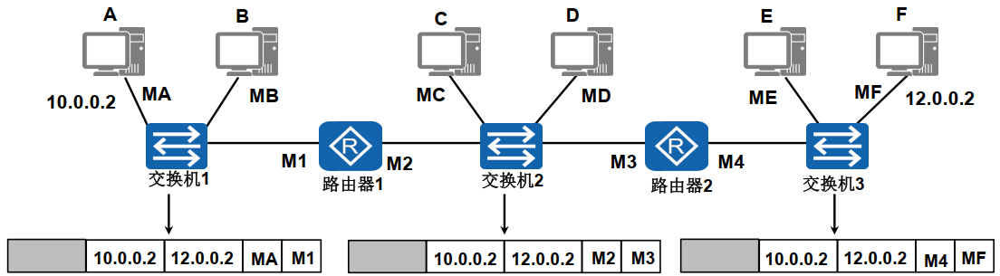

数据报的目的IP地址决定了数据报到达哪个计算机，目标MAC地址决定了该数据报下一跳由哪个设备接收，不一定是终点。  

### 19.1.1 IP 地址及其表示方法

- 把整个因特网看成为一个单一的、 抽象的网络。 IP 地址就是给每个连接在因特网上的主机（ 或路由器） <u>分配一个在全世界范围唯一的32位的标识符</u>。  

- IP地址由因特网**名字与号码指派公司**ICANN (Internet Corporation for Assigned Names and Numbers)进行分配。  

- ==IPv4 地址是**32位长**==
- ==IPv4 地址是**唯一的**和**通用的**==
- ==IPv4的地址空间是 **2^32^**==

**IPv4地址二进制标记法和点分十进制标记法**

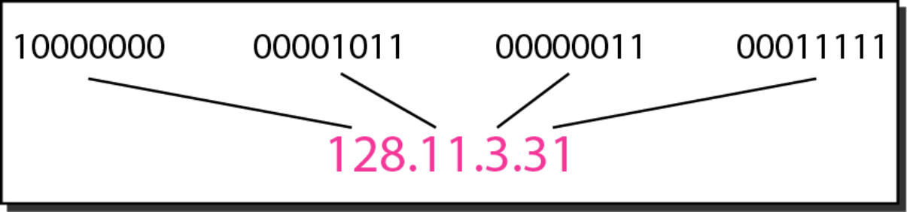

#### IP 地址的编址方法

- **分类的 IP 地址。** 这是最基本的编址方法。在1981 年就通过了相应的标准协议。
- **子网的划分。** 这是对最基本的编址方法的改进。其标准在 1985 年通过。
- **构成超网。** 这是比较新的无分类编址方法。1993年提出后很快就得到推广应用。

### 19.1.2 分类寻址 (classful addressing)

在分类寻址中， 地址空间被划为5类：<u>A、B、C、D 和 E</u>。

每一类地址都由<u>两个固定长度的字段</u>组成：

- 其中一个字段是 **网络号 net-id**， 它标志主机（或路由器）所连接到的网络；
- 另一个字段则是 **主机号 host-id**， 它标志该主机（或路由器）。

两级的IP地址可以记为：`IP 地址 ::= {<网络号>, <主机号>}  `

**以二进制和点分十进制标记法求类**

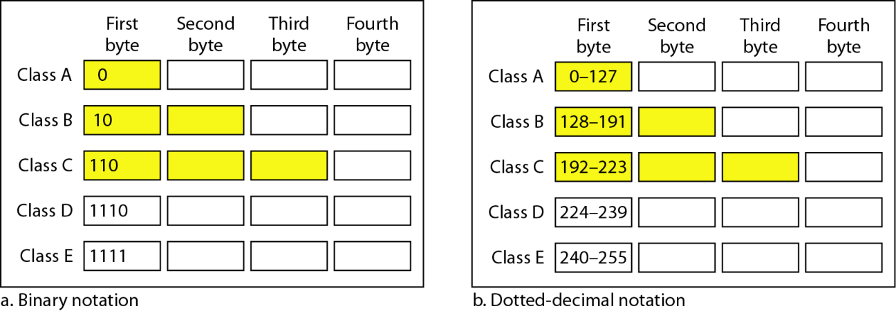

#### A类地址

- **网络号（2^7^ – 2 = 126）**
  - 网络号字段为全 0 的IP地址为保留地址，意思为“本网络”。
  - 网络号为 127（01111111）保留作为本地软件**环回测试（loopback test）**本主机进程之间的通信之用。
- **主机号（2^24^ – 2）**
  - 全 0 的主机号字段表示该IP地址是“本主机”所连接到的单个**网络地址**。
  - 全 1 的主机号字段表示该网络上的**所有主机**。
- A类地址占有整个IP地址空间的 **50%**。

#### B类地址

- 网络号（2^14^ - 1）
  - 128.0.0.0 不指派，因此可以指派的B类最小网络地址是128.1.0.0
- 主机号（2^16^ - 2）
  - 去除全0和全1的主机号
- B类地址空间占整个IP空间的 **25%**

#### C类地址

- 网络号（2^21^ - 1）
  - 192.0.0.0 不指派，可以指派的C类最小网络地址是192.0.1.0
- 主机号（2^8^ – 2 = 254）
  - 扣除全0和全1的主机号
- C类地址空间占整个IP空间的 **12.5%**

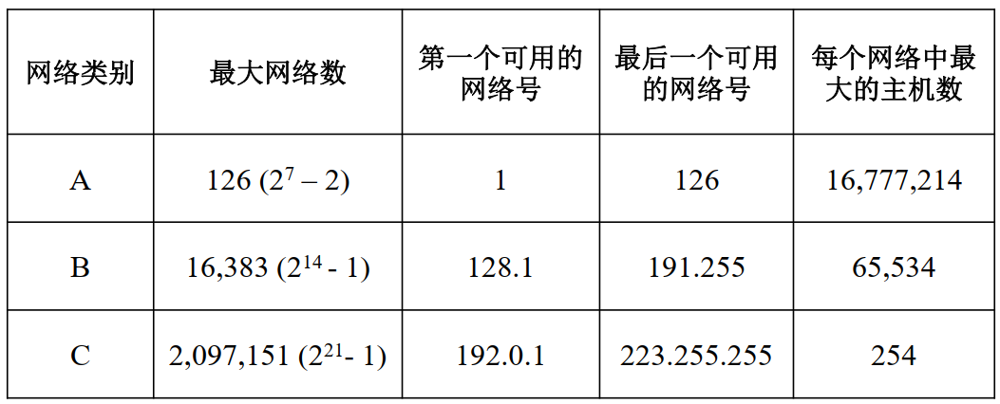

#### D类地址

D类地址被保留用于**多播**， 多播可发送一个消息给同一多播组中的一组成员设备。 在D类地址方案中， 可以用28位来指定多播组， 即有2.68亿（大约268 435 456） 个可能的多播组。 D类地址支持两种多播组， 一种是**永久多播地址**，另外一种是**临时多播地址**。  

> 例子
>
> 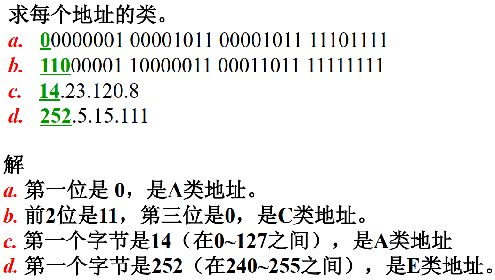

**IP 地址分类图**

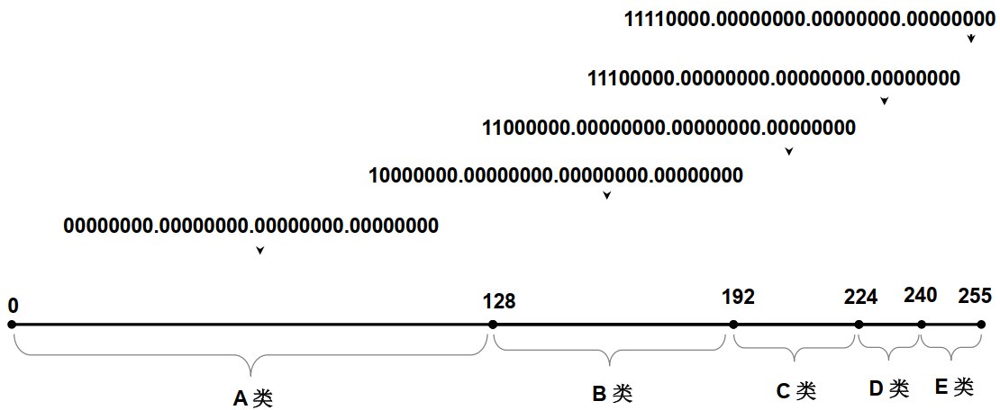

**特殊IP地址**

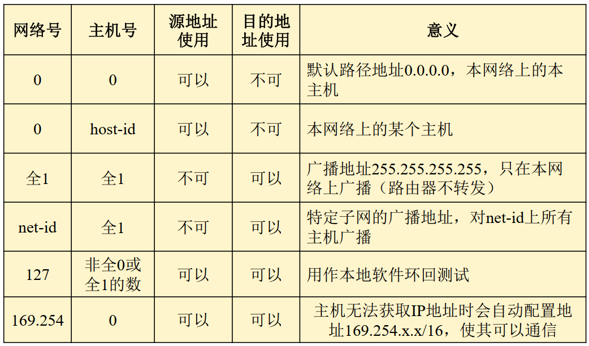

**私有网络**

在IP地址空间中， 保留了几个用于私有网络的地址。私有网络地址通常应用于公司、 组织和个人网络， 它们没有置于因特网中， <u>因特网上的路由器没有到私有网络的路由</u>， 在因特网上也不能访问私有地址， 因而使用私网地址的计算机更安全， 也节约了公网IP地址。

用于私有网络的地址范围：  

- A类： 10.0.0.0～10.255.255.255
- B类： 172.16.0.0～172.31.255.255
- C类： 192.168.0.0～192.168.255.255

**IPv4分类寻址块的个数和每块的长度**

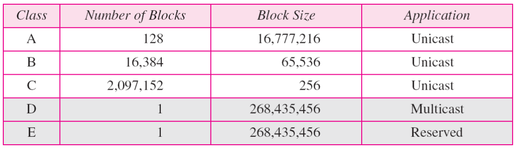

- 在分类寻址中，大部分可用地址都被浪费了。
- 分类寻址的方法是采用地址类（固定数量的地址块）来分配，且每个地址块的长度固定。

#### 划分子网

**两级IP地址**

- 在 ARPANET 的早期， IP 地址的设计确实不够合理。 IP 地址空间的<u>利用率有时很低</u>。
- 给每一个物理网络分配一个网络号会使路由表变得太大因而使<u>网络性能变坏</u>。
- 两级的 IP 地址<u>不够灵活</u>。

**三级IP地址**

- 从 1985 年起在 IP 地址中又增加了一个“子网号字段”，使两级的 IP 地址变成为三级的 IP 地址。
- 这种做法叫作 **划分子网(subnetting)**  。划分子网已成为因特网的正式标准协议。

**划分子网的基本思路**

- 划分子网纯属一个<u>单位内部的事情</u>。 单位对外仍然表现为没有划分子网的网络。
- 从主机号借用若干个位作为 **子网号 subnet-id**， 而主机号 host-id 也就相应减少了若干个位。
- 凡是从其他网络发送给本单位某个主机的IP数据报， 仍然是根据 IP 数据报的 **目的网络号net-id**，先找到连接在<u>本单位网络上的**路由器**</u>。
- 然后此路由器在收到 IP 数据报后， 再按目的**网络号 net-id** 和 **子网号 subnet-id** 找到目的子网。
- 最后就将 IP 数据报直接交付**目的主机**。  

三级IP地址记为：`IP地址 ::= {<网络号>, <子网号>, <主机号>}`

> 未划分子网的B类网络：
>
> 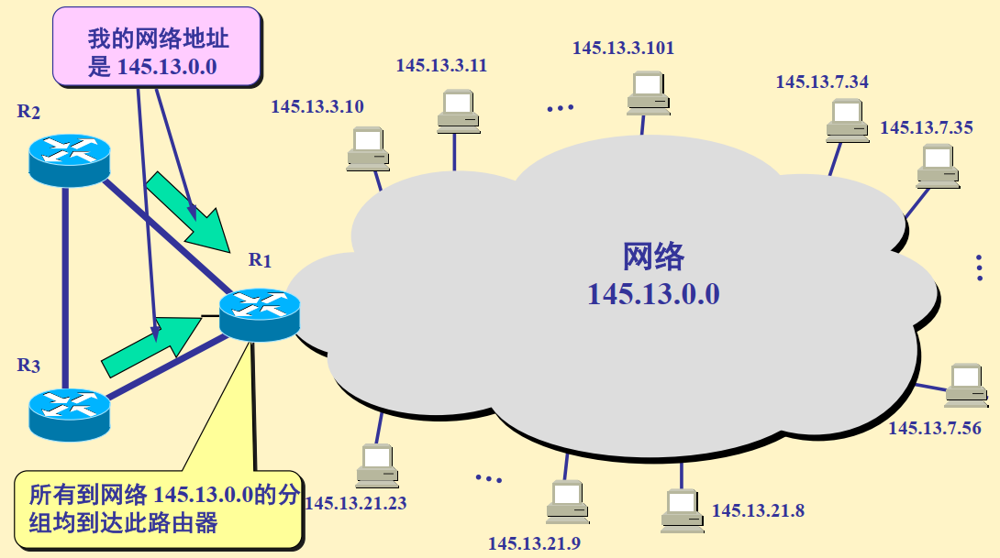
>
> 划分为三个子网后对外仍是一个网络：
>
> 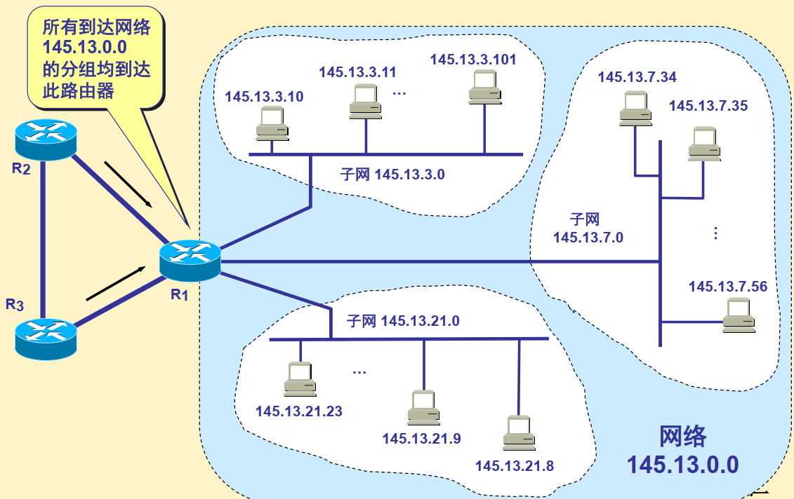

**划分子网后变成了三级结构**

- 当没有划分子网时，IP 地址是两级结构。
- 划分子网后 IP 地址就变成了 **三级结构**。
- 划分子网只是<u>把 IP 地址的主机号 host-id 这部分进行 **再划分**</u>， 而<u>不改变 IP 地址原来的网络号 net-id</u>。

#### 子网掩码 (subnet mask)

- 从一个 IP 数据报的首部并无法判断源主机或目的主机所连接的网络是否进行了子网划分。
- 使用子网掩码可以找出 IP 地址中的子网部分。

利用子网掩码判别属于哪个子网：

$(IP 地址) AND (子网掩码) = 网络地址  $

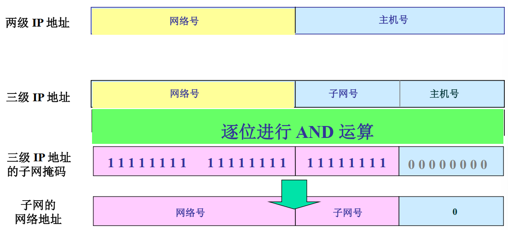

**默认子网掩码**

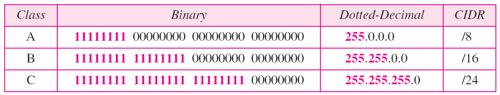

**子网掩码与网关的作用**

- 计算机在通信时， 首先判定目标地址和自己是否在同一网段。 先用自<u>己的子网掩码与自己的IP地址进行“ 与” 运算</u>得到自己所在的网段， 再用<u>自己的子网掩码与目标地址进行“与” 运算</u>， 判断得到的目标地址网络部分与自己所在网段是否相同；
- 如果得到的两个网段**不相同**， 说明不在一个网段， 封装帧时<u>以网关的MAC地址作为目标MAC地址</u>， 交换机就会将帧转发给路由器接口；
- 如果得到的两个网段**相同**， 说明在同一个网段， 封装帧时<u>直接使用目标IP地址的MAC地址作为目标MAC地址</u>， 直接将帧发送给目标IP地址。

**子网在通信中的作用**

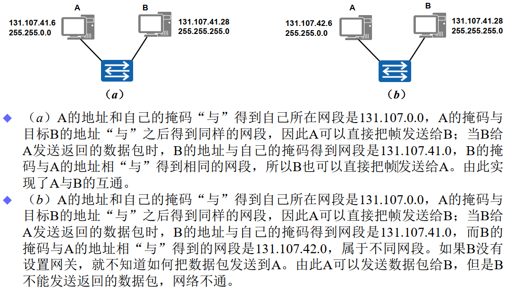

### 19.1.3 无类寻址 (classless addressing)   

无分类编址正式名字是 **无分类域间路由选择CIDR (Classless Inter-Domain Routing)**。

**CIDR的主要特点**

- CIDR 消除了传统的 A 类、 B 类和 C 类地址以及划分子网的概念， 因而可以更加有效地分配IPv4 的地址空间。
- CIDR使用各种长度的 **“网络前缀” (networkprefix)** 来代替分类地址中的网络号和子网号。
- IP地址从三级编址（使用子网掩码） 又回到了 **两级编址**。

**无分类的两级编址**  

- 无分类的两级编址的记法是：`IP地址 ::= {<网络前缀>, <主机号>}`

- CIDR 还使用 **“斜线记法” (slash notation)**， 又称为CIDR记法， 即在 IP 地址后面加上一个斜线“/”，然后写上网络前缀所占的位数（这个数值对应于三级编址中子网掩码中 1 的个数）。
- CIDR 把<u>网络前缀都相同的连续的IP地址</u>组成 **“CIDR地址块”**

> 注意：
>
> 1. 块中的地址必须是连续的；
> 2. 块中的地址个数必须是2的整数次幂；
> 3. 块的起始地址必须能被块的个数整除。

#### 可变长子网掩码VLSM

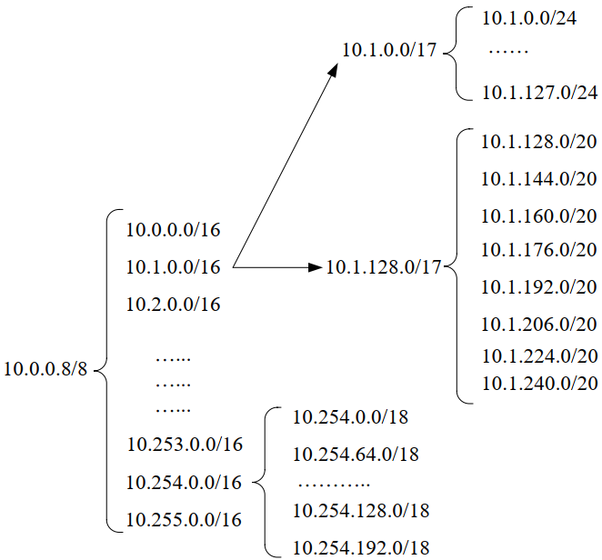

**常用的CIDR地址块**

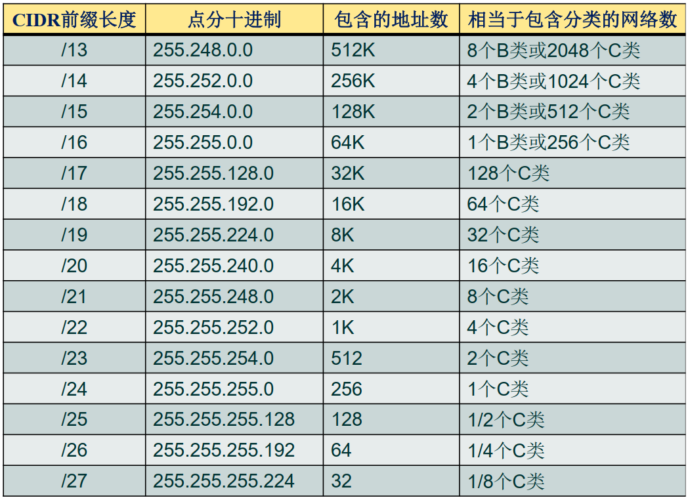

> CIDR 地址块划分举例
>
> 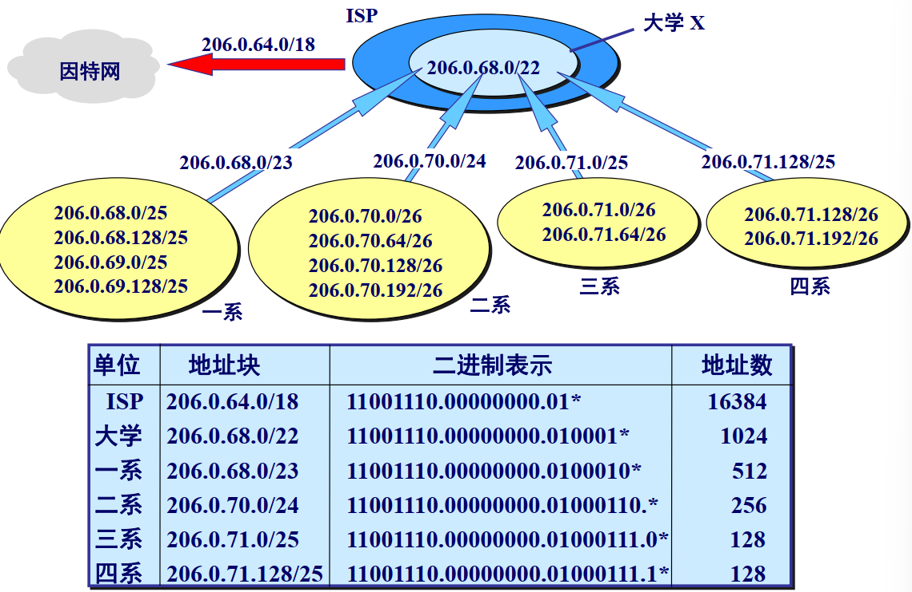
>
> 这个 ISP 共有 64 个 C 类网络。如果不采用 CIDR 技术，则在与该 ISP 的路由器交换路由信息的每一个路由器的路由表中，就需要有 64 个项目。但采用地址聚合后，只需用路由聚合后的 1个项目 206.0.64.0/18 就能找到该 ISP。  

- 块中地址的个数可简单用公式 **2^32^-n** 求得。
- 块中的起始地址通常不分配给任何设备，用做表示 **该组织的网络地址**；
- 块中的最后地址通常不分配给任何设备，用来做 **广播地址**。

### 19.1.4 超网 (supernet)

**使用超网合并网段**

即 **超网化 (supernetting)**

> 某公司有一个网段192.168.0.0/24，该网段有200台计算机，后来公司计算机数量增加到400台。此时一个C类网段已经不够用，考虑增加一个C类网络192.168.1.0/24，并增加一台交换机。
>
> 此时两个网段的计算机在物理上处于一个网段，但是IP地址却没在一个网段，即逻辑上不在一个网段。如果想让这些计算机之间能够通信，考虑在路由器接口添加这两个C类网络的地址作为这两个网段的网关。但是在这种情况下，这些本来物理上在一个网段的计算机之间进行通信，就需要路由器转发，<u>效率不高</u>。    
>
> 比较好的办法就是将192.168.0.0/24和192.168.1.0/24这两个C类网络合并。合并后的网段为192.168.0.0/23，<u>子网掩码为255.255.254.0</u>，可用地址为<u>192.168.0.1~ 192.168.1.254</u>。 
>
> 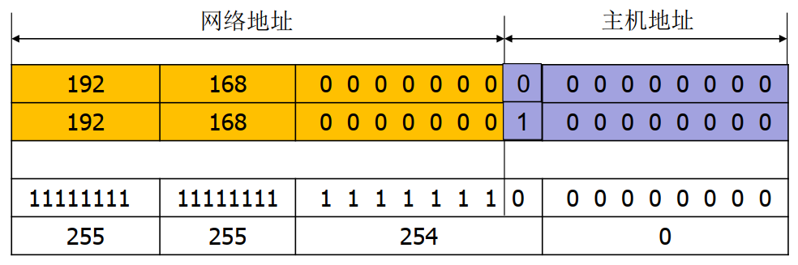

==这种方法的本质是通过把1位网络地址位用作主机地址位而实现了网络的扩容。==

### 19.1.5 网络地址转换 NAT (Network Address Translation)  

由于IPv4地址空间不足， 网络地址转换技术作为一种能够解决IPv4地址短缺的解决方案而被广泛应用。 网络地址转换也称为网络掩蔽或者IP掩蔽， 是一种在IP数据包<u>通过路由器或防火墙时重写源IP地址或目的IP地址的技术</u>。 这种技术被普遍使用在拥有多台主机但只通过一个或少量公有IP地址访问Internet的私有网络中。  

#### 专用地址和全球地址

- 专用地址——仅在机构内部使用的 IP 地址，可以由本机构自行分配， 而不需要向因特网的管理机构申请。

- 全球地址——全球唯一的 IP 地址， 必须向因特网的管理机构申请。

**专用网络地址**

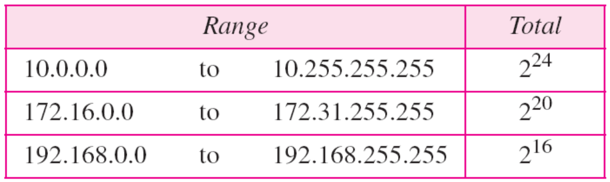

- 专用地址只能用于一个机构的 **内部通信**，而不能用于和因特网上的主机通信。
- 专用地址只能用作 **本地地址** 而不能用作全球地址。在因特网中的所有路由器，对<u>目的地址是专用地址的数据报一律不进行转发</u>。
- 采用专用IP地址的网络称为专用互联网、本地互联网或专用网。专用IP地址也称为 **可重用地址**。

#### NAT的实现

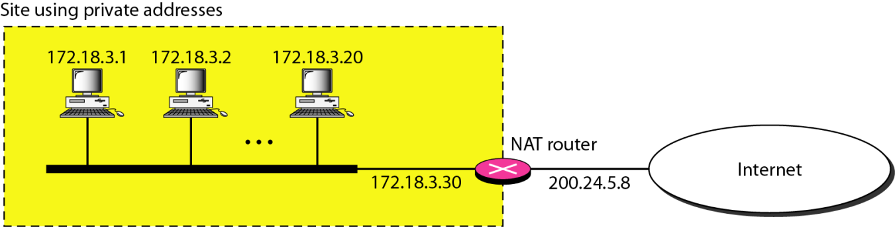

**NAT中的地址**

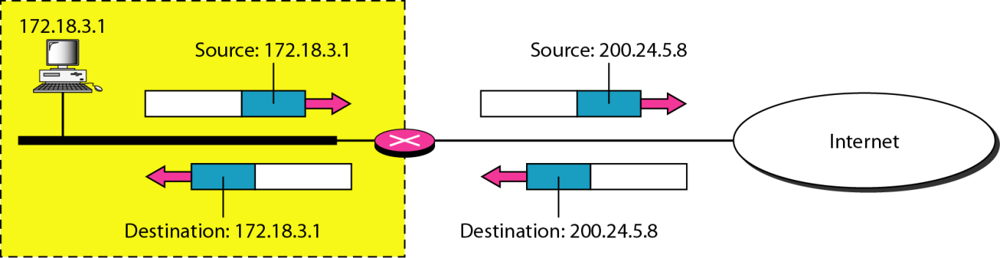

**NAT地址转换**

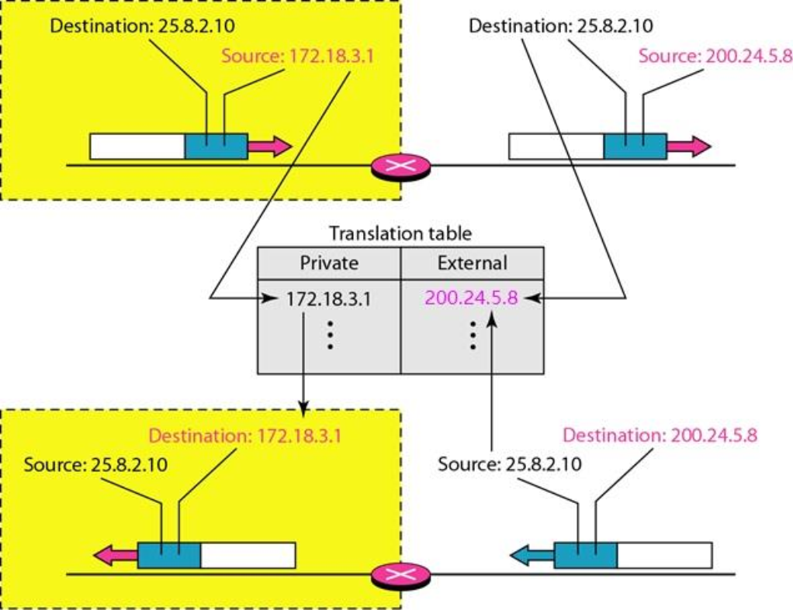

#### NAT的类型

- **静态NAT（Static NAT）**实现了私有地址和全球公有地址的一对一映射， 一个公有IP地址只会分配给唯一且固定的内网主机。
- **动态NAT（Dynamic NAT）**是指将内部网络的私有IP地址转换为公有IP地址时， IP地址对是不确定的、 随机的， 所有被授权访问Internet的私有IP地址可随机转换为任何指定的公有IP地址。 <u>当ISP提供的公有IP地址略少于网络内部的计算机数量时， 可以采用动态转换的方式。</u>
- **网络地址端口转换PAT（Port Address Translation）** 是把内部地址映射到外部网络的一个IP地址的不同端口上。 PAT与动态地址NAT不同， 它将内部连接全部映射到外部网络中的一个单独的IP地址上，同时在该地址上加上一个由NAT设备选定的端口号。

**有效利用NAT路由器的IP地址**

- 当NAT路由器具有n个全球IP地址时， 专用网内最多可以**同时**有n个主机接入到因特网。 NAT路由器IP地址数量有限时， 专用网内较多数量的主机可**轮流使用** NAT 路由器的全球IP地址。
- 为了更有效地利用NAT路由器上的全球IP地址， 常用的NAT转换表把运输层**端口号**也利用上。 这样， 就可以使多个拥有本地地址的主机， 共用一个NAT路由器上的全球IP地址， 因而可以同时和因特网上的不同主机进行通信。

#### 网络地址端口转换PAT

PAT把源IP地址和TCP（或UDP） 端口号都进行转换。  

- PAT把专用网内不同的**源IP地址**， 都转换为同样的**全球IP地址**。
- 对源主机所采用的TCP端口号（无论是否相同），转换为不同的**新的端口号**。
- 从层次的角度看， PAT的机制有些特殊。
  - 普通路由器在转发IP数据报时， 源IP地址或目的IP地址都是不改变的， 但NAT路由器在转发IP数据报时， <u>一定要更换其IP地址（转换源地址或目的地址）</u>。
  - <u>普通路由器在转发分组时</u>工作在**网络层**， 但<u>PAT路由器要查看和转换传输层的端口号</u>， 属于**传输层**的范畴。

## 19.2 IPv6 地址

### 19.2.1 结构

IPv6 地址用**二进制**与**十六进制冒号**标记法  

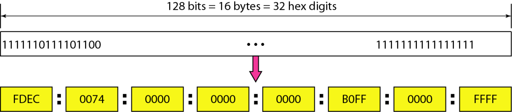

==一个IPv6地址长度是 **128位**。==

**缩短 (abbreviation) 的 IPv6 地址**

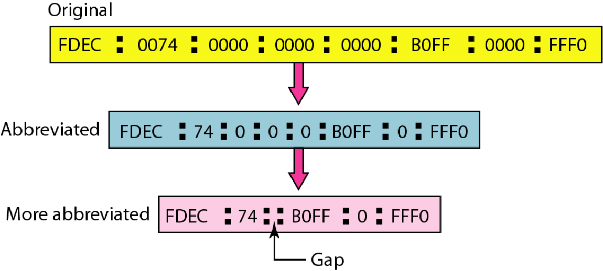

**点分十进制记法的后缀**

- `0:0:0:0:0:0:128.10.2.1` 再使用零压缩即可得出： `::128.10.2.1` 。
- CIDR 的斜线表示法仍然可用。
- 60 bit的前缀 `12AB00000000CD3` 可记为：``12AB:0000:0000:CD30:0000:0000:0000:0000/60` 或 `12AB::CD30:0:0:0:0/60` 或 `12AB:0:0:CD30::/60` 。

### 19.2.2 地址空间

**IPv6地址的类型前缀**

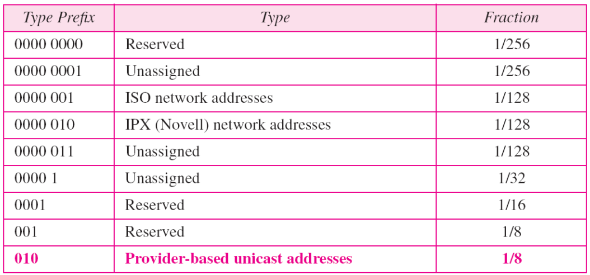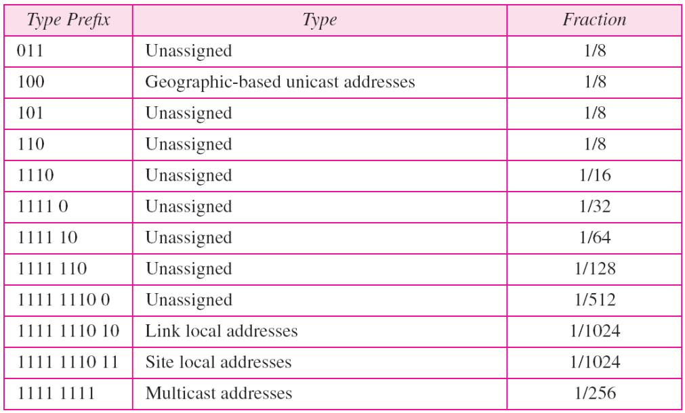

#### 基于提供者的单播地址前缀

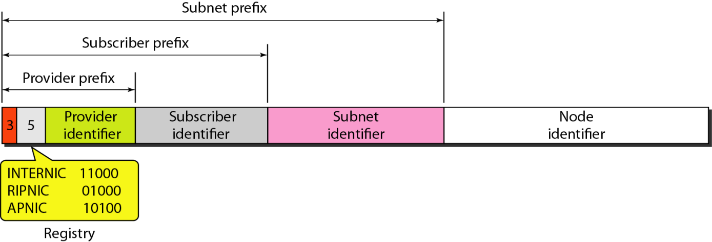

- **类型标识符。**这个3位字段定义一个基于提供者的地址。
- **注册标识符。**这个 5位宇段指出注册地址的机构，目前已经定义了 3 个注册中心。INTERNIC (代码 11000) 是北美的注册中心；RIPNIC (代码01000) 是欧洲的注册中心；APNIC (代码 10100) 是亚洲和太平洋国家的注册中心。  
- **提供者标识符。**这个可变长字段标识因特网接入提供者(如ISP) 。对这个字段的推荐长度是 16 位。
- **用户标识符。**当一个组织机构通过一个提供者接入因特网时，就给它分配一个用户标识符。对这个字段的推荐长度是24位。
- **子网标识符。**每一个用户可以有多个不同的子网，而每一个子网可以有不同的标识符。子网标识符在用户的地区范围内定义一个特定的网络，对这个字段的推荐长度是32位。
- **节点标识符。**最后一个字段定义连接到子网的节点的标识。对这个字段的推荐长度是48位，使它和以太网使用的48位的链路(物理)地址相兼容。将来这个链路地址可能会和节点的物理地址相同。  

#### IPv6中多播地址

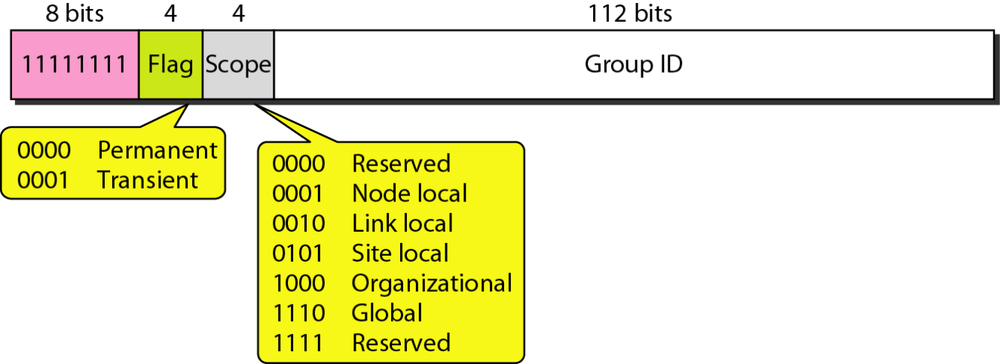

#### IPv6中保留地址  

> **unspecified 未指明地址**：是用于当主机不知道它自己的地址时，它发送查询以便找出其地址。  
>
> **loopback 环回地址**：是主机用来测试它自己，而不需要连接到网络上。
>
> **compatible 兼容地址**：用于从IPv4到IPv6的转换。当一台使用 IPv6协议的计算机要发送报文到另一台使用 IPv6协议的计算机，但报文需要通过网络某一部分还仍旧使用 IPv4协议操作时，就需要该地址。
>
> **mapped 映射地址**：也是用于从IPv4到IPv6的转换，它用于一台计算机己安装了 IPv6但要发送分组到一台仍使用 IPv4协议的计算机。

#### IPv6中本地地址

一个组织机构想要使用 IPv6协议，但还没有连接到全球因特网，就要用这种地址。换言之，它们提供专用网络地址。  

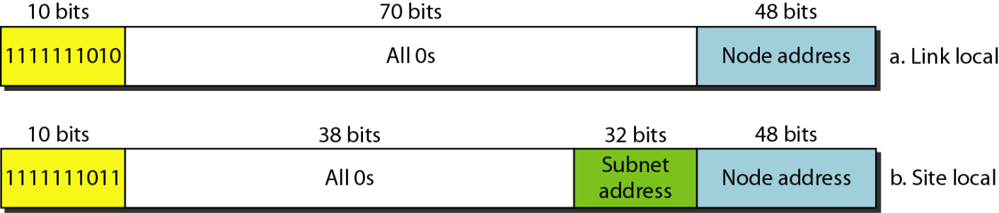

- **本地链路地址 (link local address)** 是用于一个孤立的子网；
- **本地站点地址 (site localaddress)** 是用于具有几个子网的站点。

------

# ch20 IP协议

## 20.1 网际互联

**互联网中的网络层**

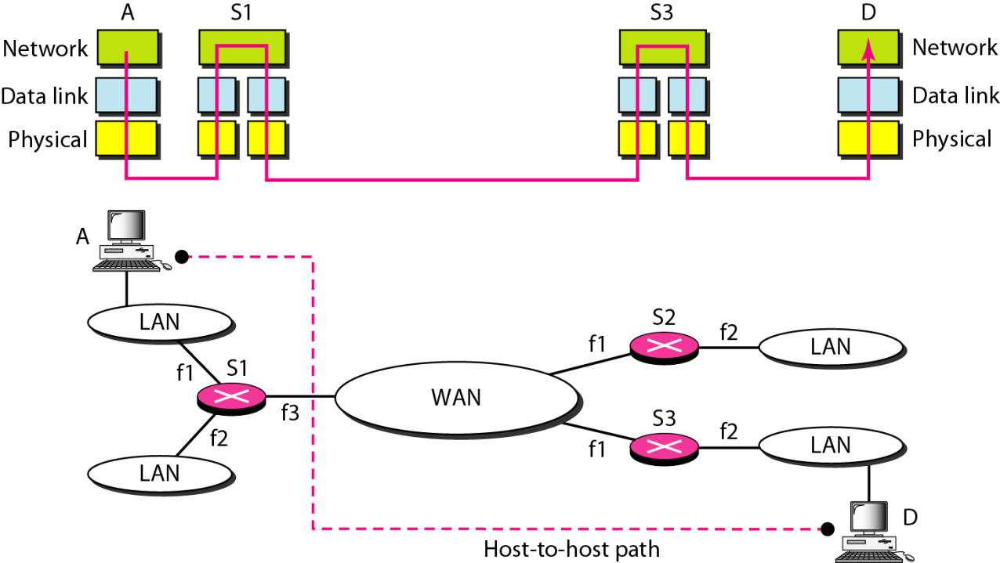

**源端、路由器端和目的端的网络层**  

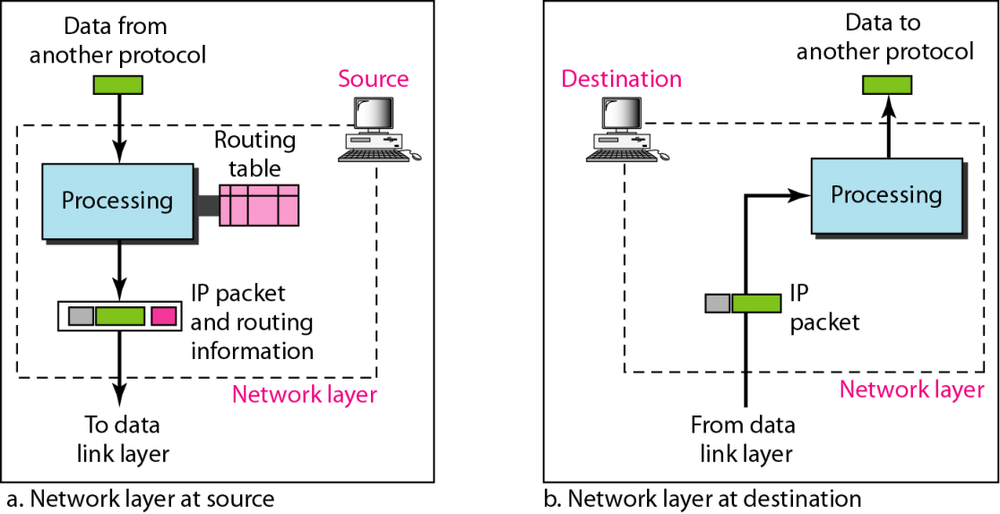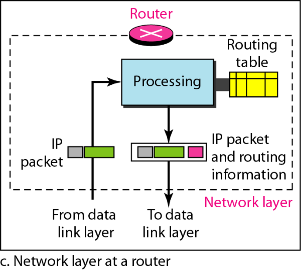

- 因特网中的网络层交换是利用数据报分组交换的方法实现的。

> 分组交换：采用存储转发方式， 把大数据划分为合理的小数据块，再加上源地址、 目的地址、 编号信息等控制信息构成分组。
>
> - 优点：无建立连接延时， 线路利用率高， 简化存储管理， 加速传输， 减少出错率和重发数据量。
> - 缺点：存在传输延时， 需要传输额外的信息量， 可能出现失序、丢失或重复分组。

- 分组传递可利用**面向连接的服务(connection oriented service)**来实现，也可以利用**无连接的服务(connectionless service)**来实现。
- <u>因特网的网络层通信是无连接的</u>

> 无连接是指交换机或路由器不保存有关连接状态的信息，不需要建立连接，也不需要拆除连接。网络层协议独立地对待每个分组，而且每个分组与任何其他分组没有联系。  

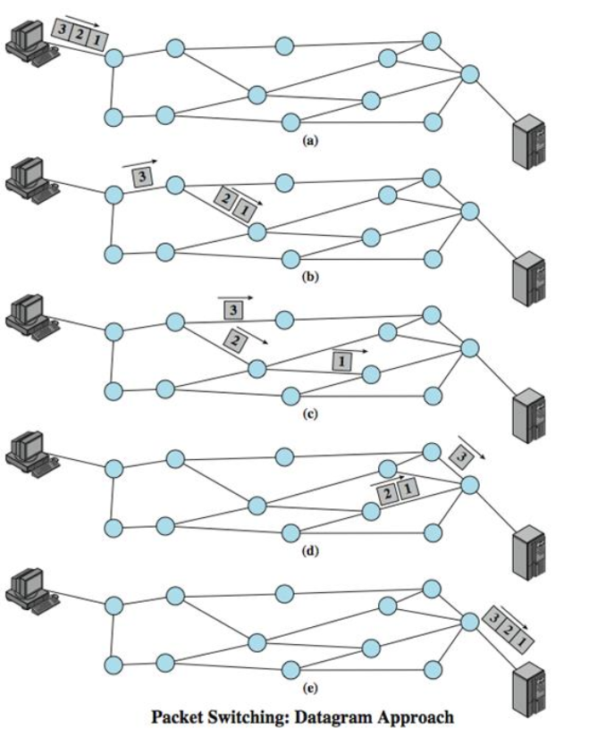

## 20.2 IPv4

网际协议第四版 (**IPv4**) 是T<u>CP/IP协议使用的传输机制</u>。

IPv4是一种**不可靠的无连接的数据报协议**， 它**尽力传递（Best-effort delivery）** 数据报， 但是<u>不提供差错控制或流量控制（除首部的检验和之外）</u> ， 因此不保证可靠性。  

**IPv4在TCP/IP协议族中的位置**

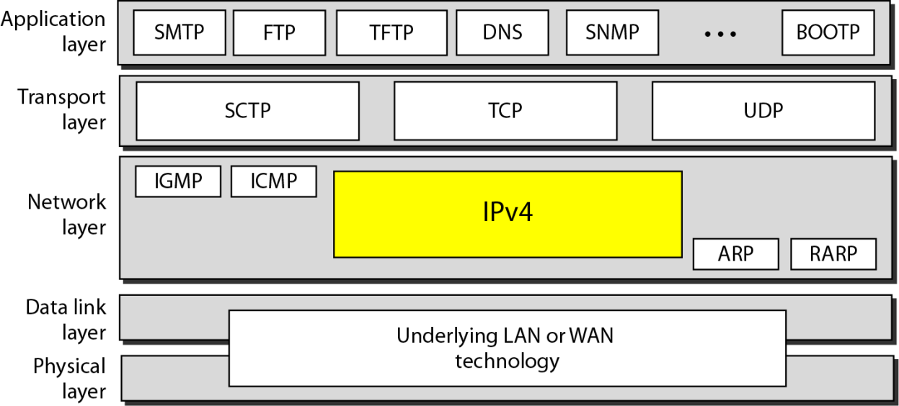

### 20.2.1 数据报 (datagram)

#### IPv4 数据报格式

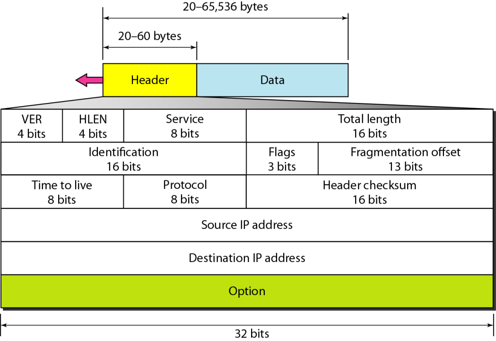

##### VER 版本

占 4 bit，指IP协议的版本。目前的 IP 协议版本号为 4 (即 IPv4)。  

##### HLEN 首部长度

占 4 bit，可表示的最大数值是 15 个单位（**一个单位为 4 字节**），因此 IP 的首部长度的最大值是60字节。这个字段是必需的，因为头部长度是可变的(在20到60个字节之间)  

##### Service 服务类型

占 8 bit，用来获得更好的服务。这个字段以前一直没有使用。现称为**差分服务 (differentiated service)**。

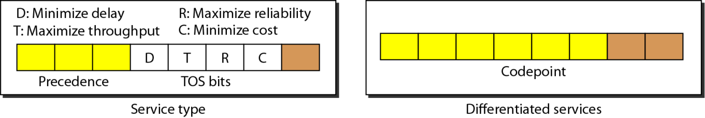

- **TOS : Type of Service**
  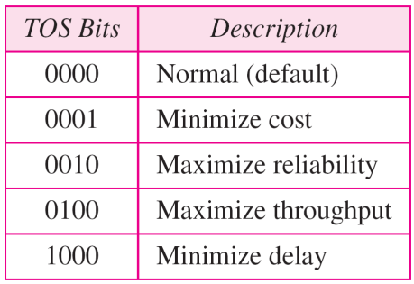

- **差分服务**

  - 前6位为码点子字段，后2位不用。

  - 当码点子字段最右边3位都是0时，最左边3位与 *<u>服务类型</u>* 中的优先级相同。

  - 当码点子字段最右边3位不全是0时，则6位的含义：

    - 0,2,4， ……， 62，由IETF分配
    - 3,7,11,15， ……， 63，本地组织结构时候用  
    - 1,5,9， ……， 61，临时的用作实验目的  

    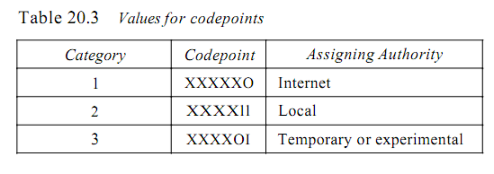

##### Total Length 总长度

占 16 bit，<u>指首部和数据之和的长度</u>，单位为字节，因此数据报的最大长度为 65535 字节。总长度必须不超过 **最大传送单元 MTU**。

$数据长度 = 总长度 - 头部长度  $

**一个小的数据报封装在以太网帧中**

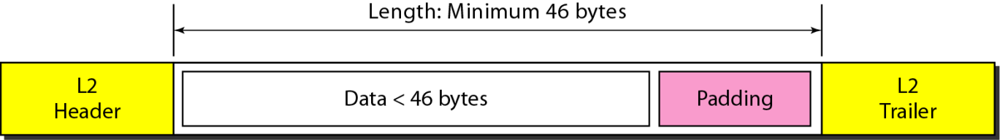

以太网限制帧中数据报的长度在46到1500字节之间，当数据报长度小于46字节时，必须进行填充。  

##### Identification 标识

占 16 bit，它是一个计数器，用来产生数据报的标识。

##### flag 标志

占 3 bit，只有后两位有意义。

- More Fragment： MF=1（还有分片），MF=0（最后一片）
- Don’t Fragment： DF=1（不能分片）， DF=0（允许分片）  

##### fragmentation offset 片偏移

占13 bit，用于指出较长的分组在分片后某片在原分组中的相对位置，以 8 个字节为偏移单位。  

##### Time to live 生存时间

生存时间（8 bit）记为 **TTL（Time To Live）**，表示数据报在网络中可通过的路由器数的最大值。

##### Protocol 协议

协议（8 bit）字段指出此<u>数据报携带的数据使用何种协议</u>，以便目的主机的 IP 层将数据部分上交给那个处理过程。  

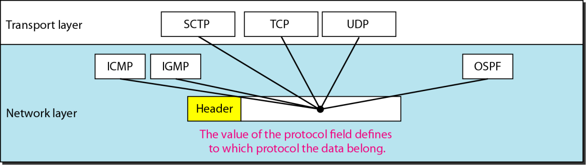
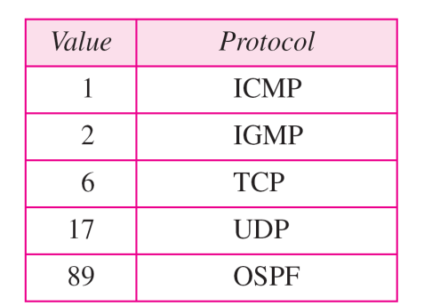

##### Header Checksum 首部检验和

首部检验和(16 bit)字段只检验数据报的首部，不包括数据部分。这里不采用 CRC 检验码而采用简单的计算方法。  

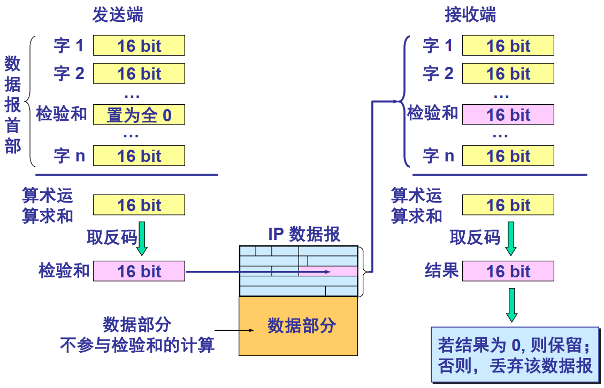

##### Source & Destination IP Address 源地址和目的地址

源地址和目的地址都各占 4 字节。  

### 20.2.2 分段

#### 最大传输单元 MTU

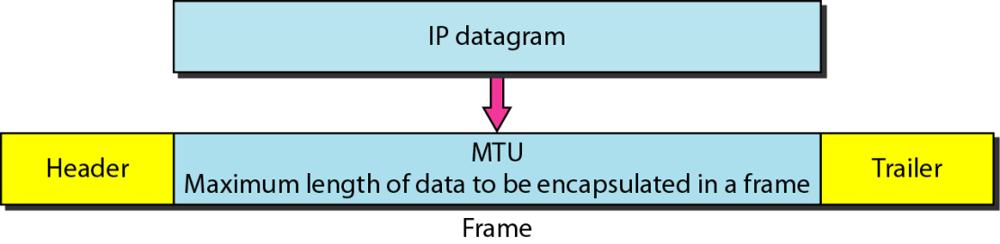

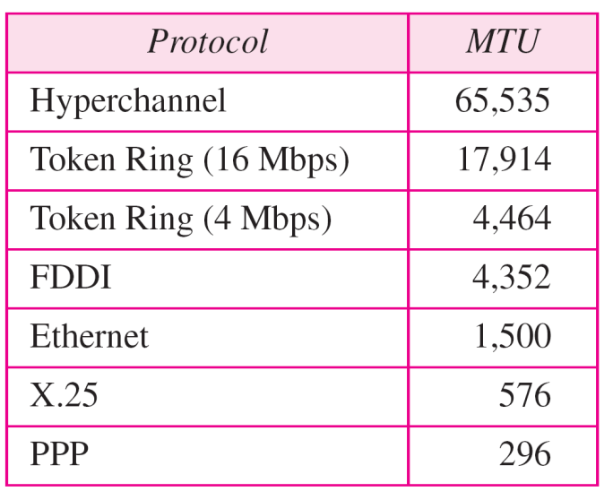

#### 与分段相关的字段

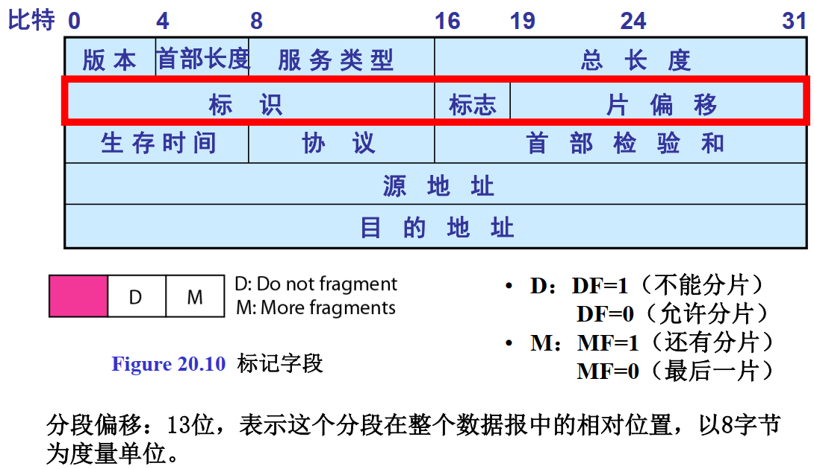

**分段示例**

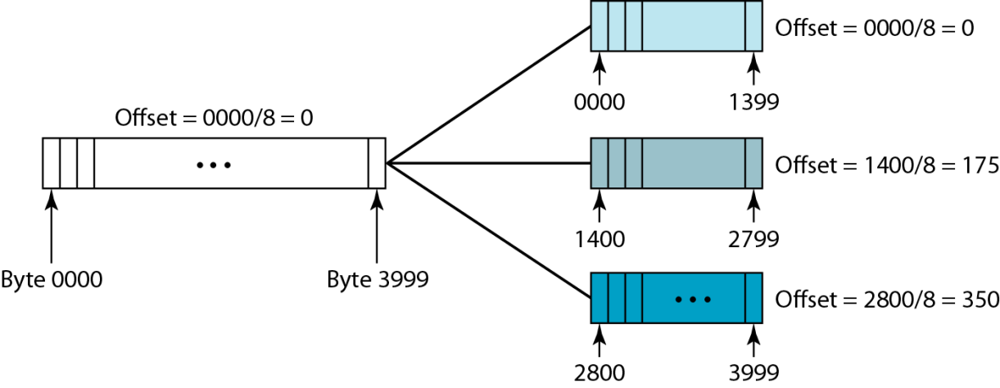

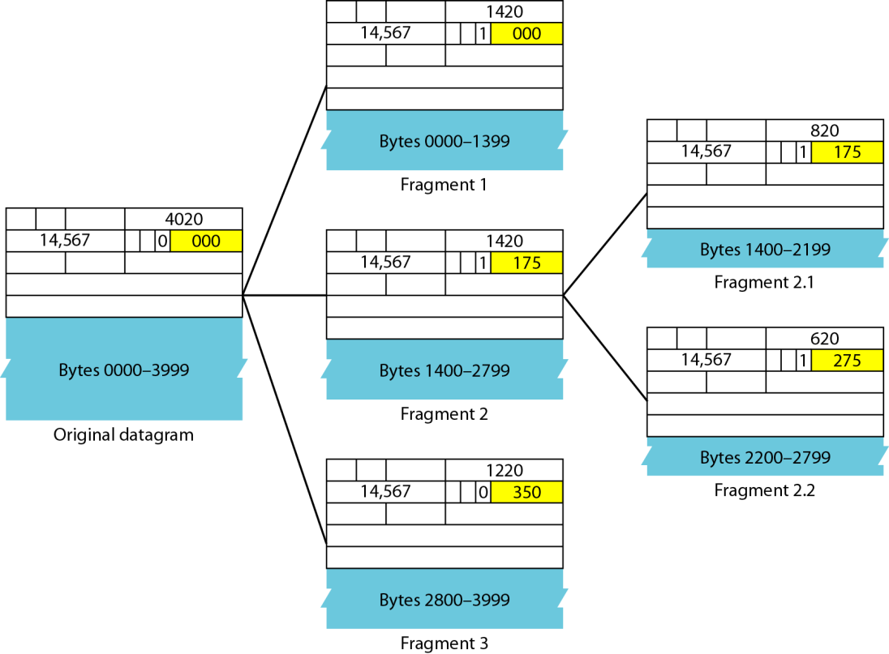

### 20.2.3 选项

IPv4中选项的种类：

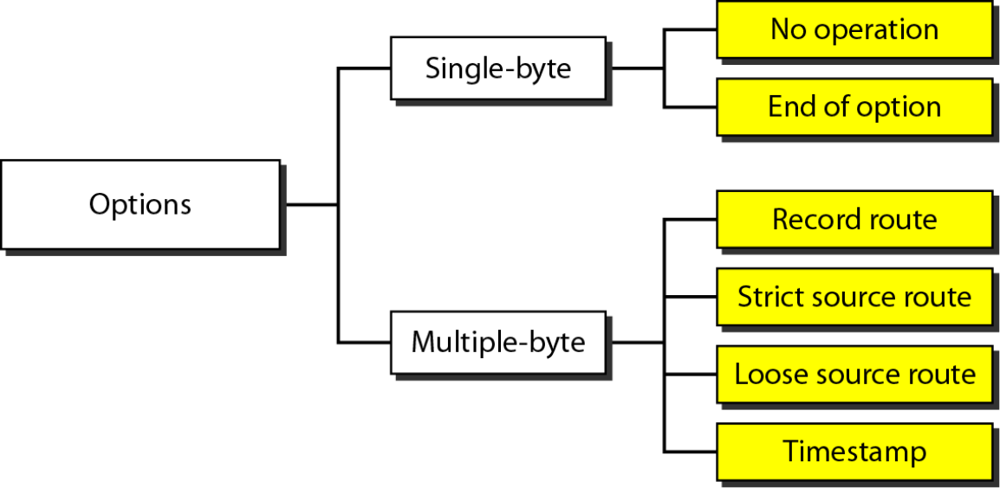

## 20.3 IPv6

### 20.3.1 IPv6的优点

- 更大的地址空间。 IPv6 将地址从 IPv4 的 32 位增大到了 128 位。
- 扩展的地址层次结构。
- 灵活的首部格式。
- 改进的选项。
- 允许协议继续扩充。
- 支持即插即用（即自动配置）。
- 支持资源的预分配。
- 支持更多的安全性。
- IPv6首部改为8字节对齐。

### 20.3.2 分组格式

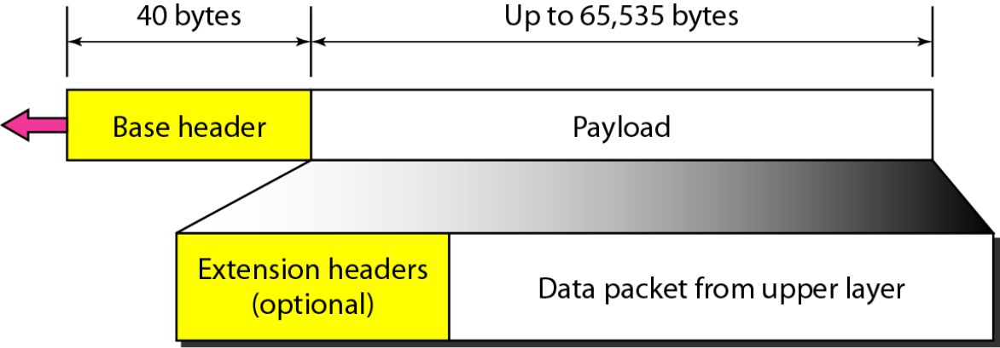

#### 基本头部 Base header

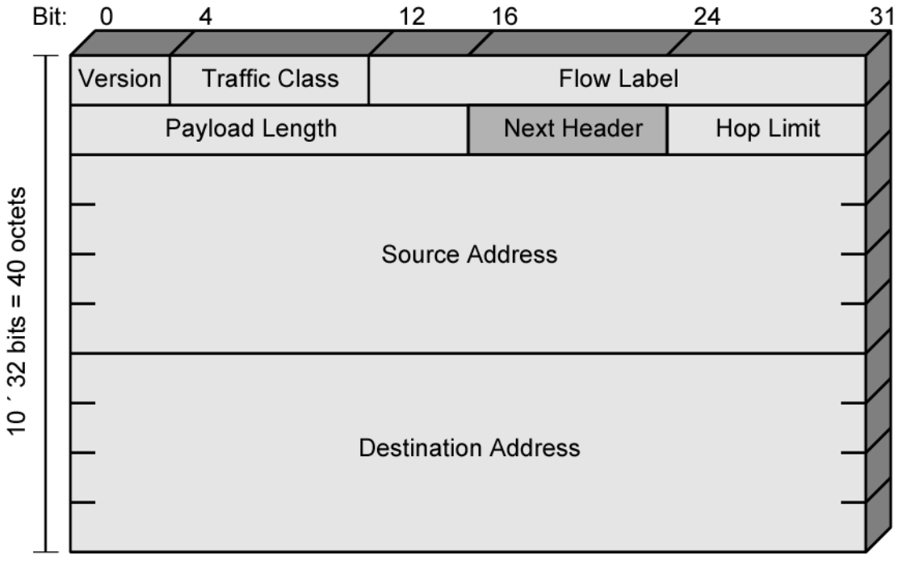

- 版本(version)—— 4 bit。 它指明了协议的版本， 对 IPv6 该字段总是 6。
- 通信量类—— 8 bit， 用于区分具有不同交付要求的不同有效载荷，它取代了IPv4中的服务类型字段。
- 流标号(flow label)—— 20 bit。 “流” 是互联网络上从特定源点到特定终点的一系列数据报， “流” 所经过的路径上的路由器都保证指明的服务质量。 所有属于同一个流的数据报都具有同样的流标号。
- 有效载荷长度(payload length)—— 16 bit。 它指明 IPv6 数据报除基本首部以外的字节数（所有扩展首部都算在有效载荷之内） ，其最大值是 65535。
- 下一个首部(next header)—— 8 bit。 它相当于 IPv4 的协议字段或可选字段。
- 跳数限制(hop limit)—— 8 bit。源站在数据报发出时即设定跳数限制。 路由器在转发数据报时将跳数限制字段中的值减1。 当跳数限制的值为零时， 就要将此数据报丢弃。

#### 优先级

- 定义从相同源端发出的每一个分组相对于其他分组的优先级。
- IPv6通信量被分为2类
  - 可进行拥塞控制的通信量(congestion-controlled traffic)
  - 不可进行拥塞控制的通信量(noncongestion-controlled traffic)

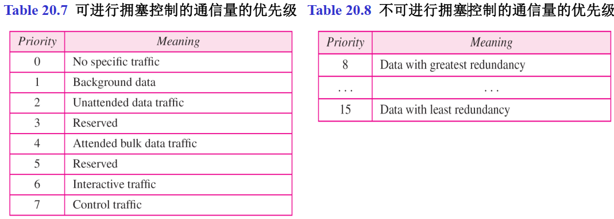

#### 流标号

- 支持流标号处理的路由器中包含有一个流标号表；
- 可用来加速路由器对分组的处理；
- 可用来支持实时音频和视频的传输；
- 流标号使用的**三个原则**：
  - 流标号由源主机指定给分组，是1到2^24^ - 1之间的随机数。
  - 如果主机不支持流标号，则置为0
  - 所有属于同一个流的分组必须具有相同的源地址、目的地址、优先级和选项

#### 下一个首部

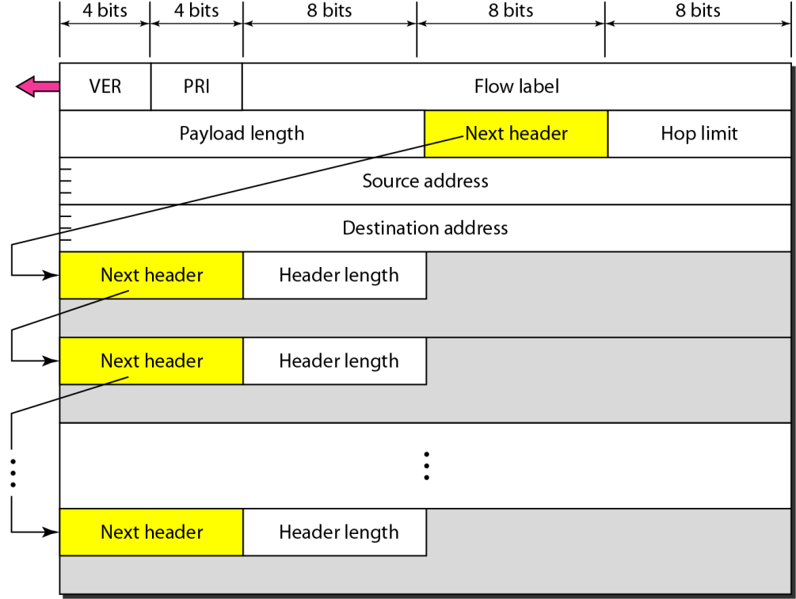

**IPv4头部和 IPv6头部的比较**

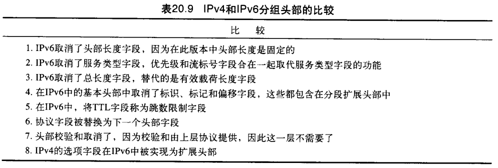

**扩展首部的类型**

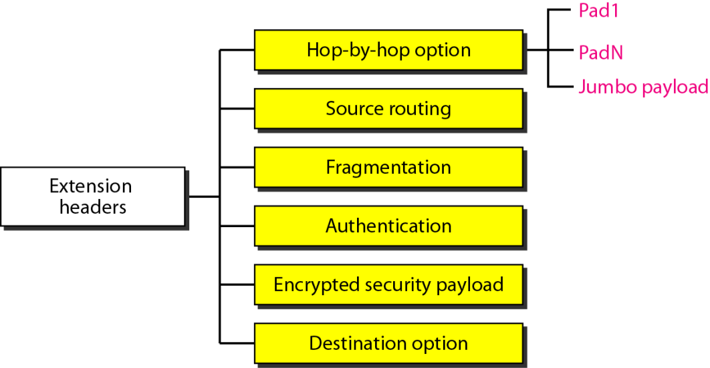

**IPv4选项和 IPv6扩展头部的比较**

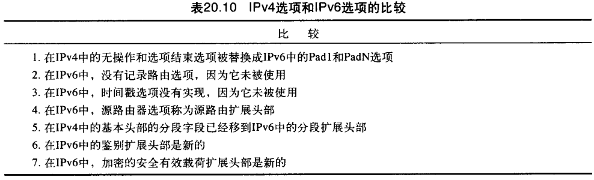

## 20.4 IPv4 到 IPv6的过渡

### 20.4.1 三种过渡策略

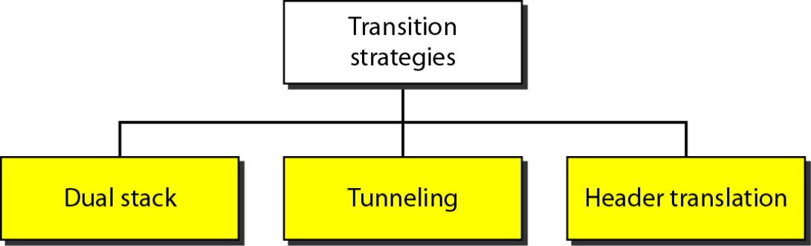

#### a. 双协议栈 dual stack

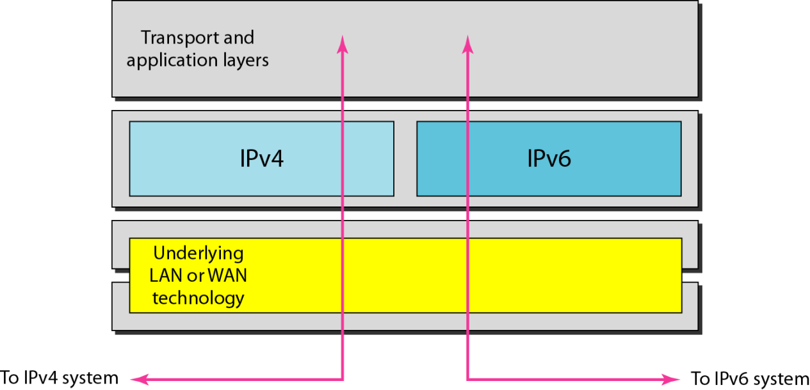

==要使用DNS来确定使用哪个协议栈==

#### b. 隧道策略 tunneling

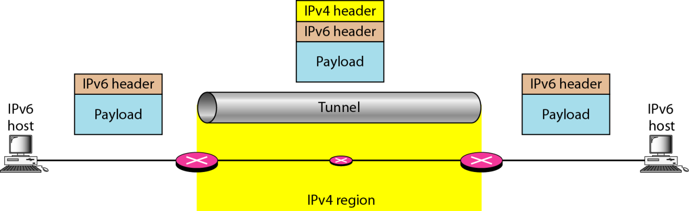

#### c. 头部转换策略 header translation

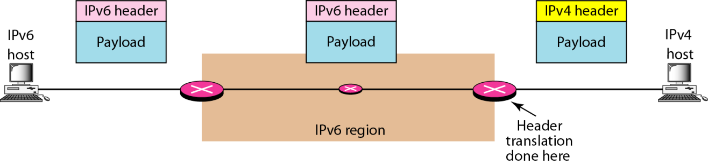

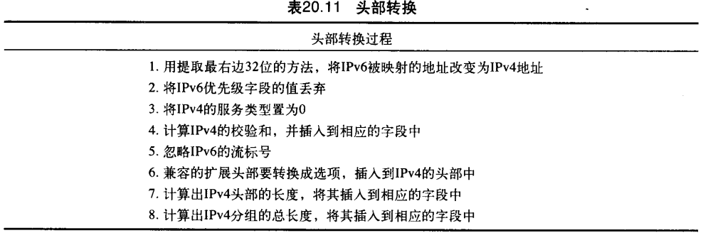

------

# ch21 地址映射、差错报告和多播

## 21.1 地址映射

将分组传递到主机或路由器需要两级地址: **逻辑地址** 和 **物理地址**， 需要将一个逻辑地址映射成为它对应的物理地址， 反过来也一样。 这可以通过**静态**或**动态映射**完成。  

- **静态映射**：创建一个将逻辑地址和物理地址对应的表， 存储在网络的每个机器上。
- **动态映射**：当机器知道逻辑地址和物理地址之一时， 可以利用协议求出另一个地址。

### 21.1.1 逻辑地址映射到物理地址 ARP (Address Resolution Protocol)

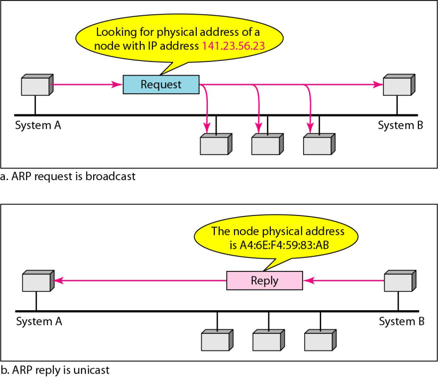

- ARP **请求**报文是**广播发送**

- ARP **回答**报文是**单播发送**

#### ARP 分组

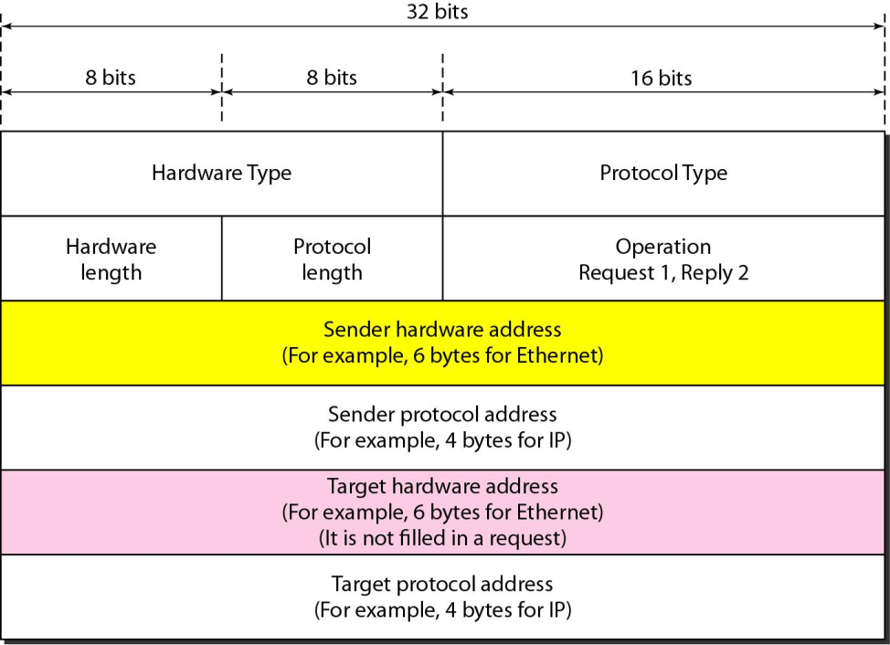

- **Hardware Type 硬件类型**：网络接口硬件的类型，对以太网此值为1。
- **Protocol Type 协议类型**：发送方使用的协议，0800H表示IPv4协议
- **Hardware length 硬件长度**：以字节为单位的物理地址的长度， 以太网地址长度为6
- **Protocol length 协议长度**：以字节为单位的逻辑地址的长度， IPv4地址长度为4
- **Operation 操作**：定义分组的类型， 有两种：
  - ARP请求 （1）
  - ARP应答 （2）

**ARP 分组的封装**

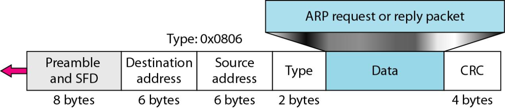

> preamble 前同步码

#### ARP 工作过程

- IP请求ARP协议产生一个ARP请求报文，填入发送方物理地址、IP地址以及目标的IP地址， 目标的物理地址字段填0；
- 将这个报文发送给数据链路层封装成帧， 使用<u>发送方物理地址作为源地址**进行广播**</u>；
- 每个主机和路由器均接收到此帧， 除了目标机器， 其它机器丢弃该帧；
- 目标机器使用**单播方式**以ARP回答报文进行应答， 回答报文包括其物理地址；
- 发送方收到回答报文， 知道目标机器的物理地址；
- 将发送给目标机器的IP数据报封装成帧， 以<u>单播方式</u>发送。

#### 使用ARP的四种情况

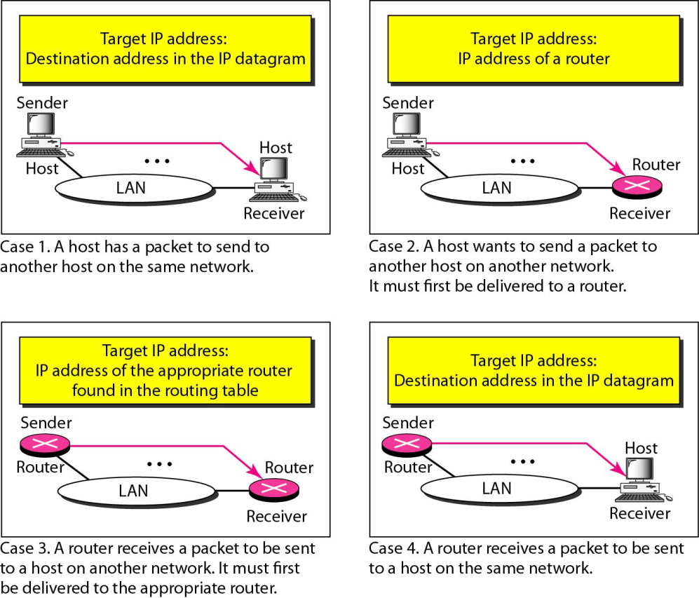

#### 代理 ARP (proxy ARP)

每当运行代理ARP的路由器接收到一个寻找这些主机中的一个主机的IP地址的ARP请求时，路由器就发送一个ARP回答，宣布它自己的硬件(物理)地址。当这个路由器收到真正的IP分组后，它就将这个分组发送给相应的主机或路由器。

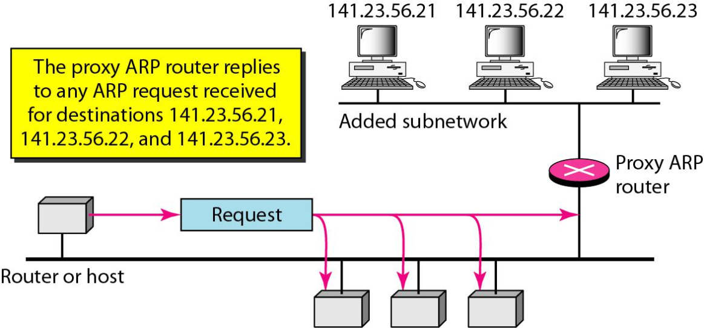

#### ARP 欺骗

1. 信息收集： 局域网内正常用户的IP和MAC信息
   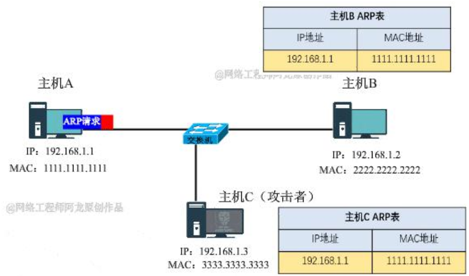
   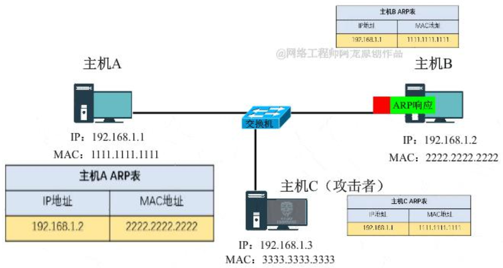
   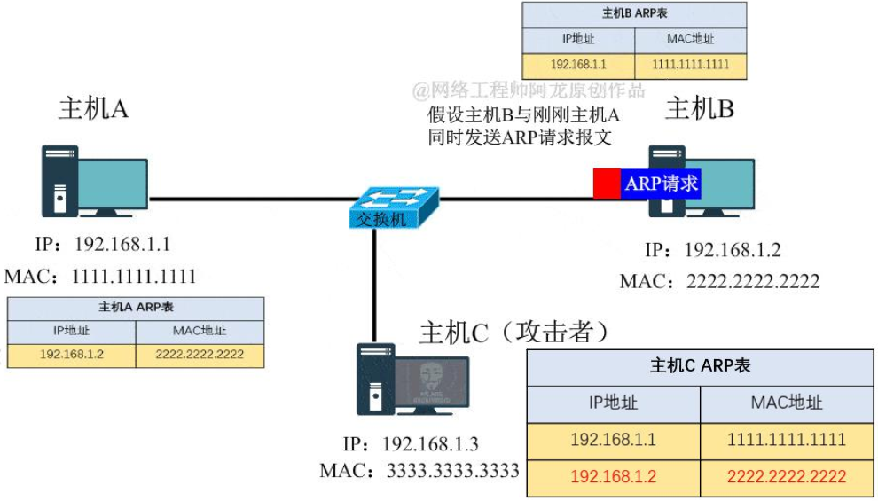
2. 伪造ARP响应报文
   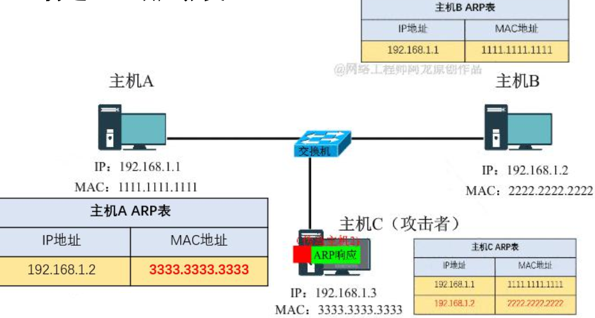
3. 发起欺骗
   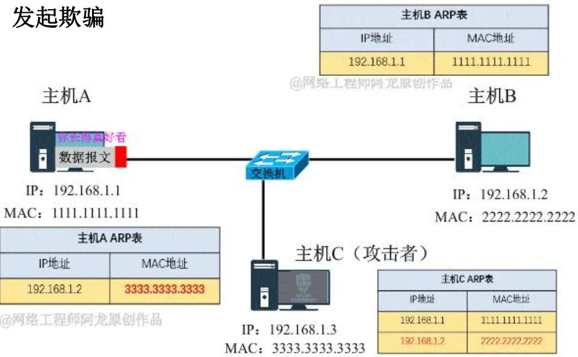

### 21.1.2 物理地址映射到逻辑地址 RARP (Reversed Address Resolution Protocol)

- 网络上的每台设备都会有一个**硬件地址**， 通常是由<u>设备厂商分配的MAC地址</u>。 PC从<u>网卡上读取MAC地址</u>， 然后在网络上发送一个RARP请求的广播数据包， <u>请求RARP服务器回复该PC的IP地址</u>。RARP服务器收到了RARP请求数据包， 为其分配IP地址， 并将RARP回应发送给PC。 PC收到RARP回应后， 就使用得到的IP地址进行通信。

- 虽然RARP在概念上很简单， 但是一个RARP服务器的设计与系统相关而且比较复杂。 相反， 提供一个ARP服务器很简单， 通常是TCP/IP在内核中实现的一部分。 由于内核知道IP地址和硬件地址， 因此当它收到一个询问IP地址的ARP请求时， 只需用相应的硬件地址来提供应答就可以了。
- 由于RARP的请求是在硬件层上的广播， 不能通过路由转发， 因此在每个网络都要设置一个RARP服务器。 另外在同一网络中不同主机可能会同时进行RARP请求， <u>增大了冲突的概率</u>。

#### 引导程序协议 BOOTP（Bootstrap Protocol）  

- BOOTP是一种引导协议， 基于IP/UDP协议， 也称自举协议， 是DHCP协议的前身。
- BOOTP用于<u>无盘工作站的局域网</u>中， 可以让无盘工作站从中心服务器获得IP地址。 通过BOOTP协议可以为局域网中的无盘工作站分配<u>动态IP地址</u>， 这样就不需要管理员去为每个用户去设置静态IP地址。
- DHCP协议是从BOOTP的基础上发展而来， 它们都是主机配置协议，都可以大大减少管理员的工作量。 BOOTP可看成是<u>简单版的DHCP</u>，是对主机的<u>静态配置</u>， 而DHCP可以依据一些策略对主机进行<u>动态配置</u>。 ==BOOTP用于无盘工作站的启动和配置， 而DHCP更适用于客户端接入变化的网络， 即客户端接入时间、 接入地点不固定。==

在同一网络上和不同网络上的 BOOTP客户和服务器：

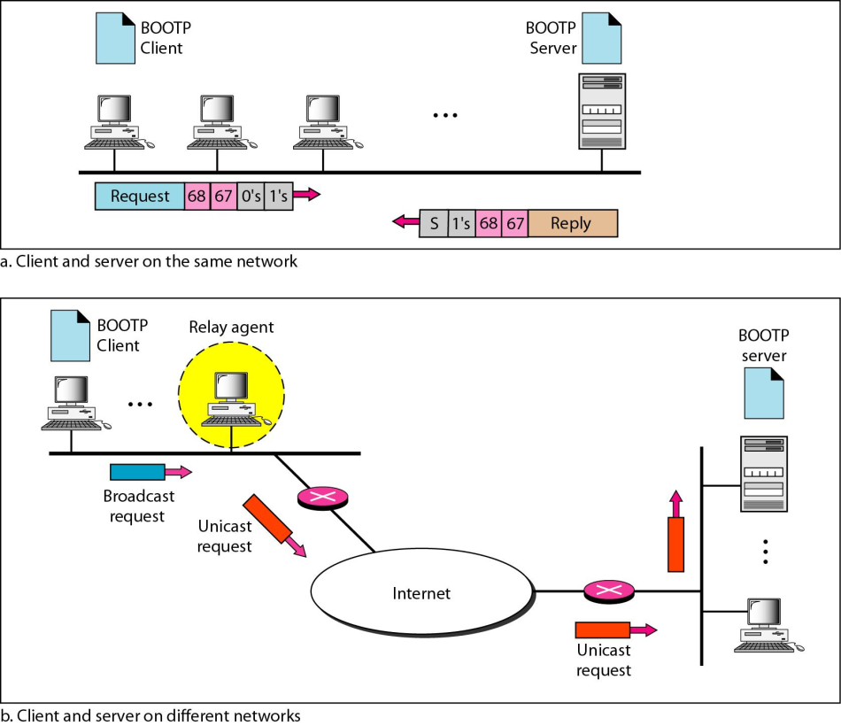

#### 动态主机配置协议 DHCP（Dynamic Host Configuration Protocol）

- DHCP服务器控制一段IP地址范围， 客户机登录服务器时就可自动获得服务器分配的IP地址和子网掩码， 是局域网的网络协议。
- DHCP 提供<u>人工的或自动的</u> 、 <u>静态或动态的</u>地址配置。 静态地址配置与BOOTP相同， 与BOOTP后向兼容， 客户机可请求静态地址， <u>DHCP服务器有一个数据库静态地绑定物理地址和IP地址。</u>
- DHCP还有一个动态数据库， 即一个可用的 **IP地址池**。 DHCP客户机向DHCP服务器发送请求时， 服务器先查询静态数据库， 如有则返回永久IP地址； 如没有则从可用IP地址池中选择一个IP地址， 指定给该用户并添加到动态数据库。
- 得到的IP地址有 **租用期（lease）**。

**DHCP DISCOVER  寻找服务器**

当 DHCP客户端首次登录网络的时候， 如果发现本机上没有任何IP配置， 则会向网络发出一个 DHCP Discover广播， 源地址为 0.0.0.0 ， 目的地址则为255.255.255.255

**DHCP OFFER 分配IP地址**

当DHCP服务器监听到客户端发出的 DHCP Discover 广播后， 它会从那些还没有租出的地址范围内， <u>选择最前面的空置IP</u>， 连同其它TCP/IP设定， 发给客户端一个DHCP Offer， DHCP Offer会包含一个租约期限的信息。  

**DHCP REQUEST 请求使用**

如果客户端收到网络上多台DHCP协议服务器的响应， <u>只会挑选其中一个DHCP Offer</u> ，并向网络发送一个DHCP Request广播， <u>告诉所有 DHCP服务器它将指定接受哪一台服务器提供的IP地址</u>。 同时， 客户端还会向网络发送一个ARP， 查询网络上面有没有其它机器使用该IP地址； 如果发现该IP已经被占用， 客户端则会送出一个 DHCP Decline 给DHCP服务器， 拒绝接受其 DHCP Offer ， 并重新发送 DHCP Discover 信息。  

**DHCP ACK IP地址分配确认**

当DHCP服务器收到DHCP客户机回答的DHCP Request请求信息之后， 它便向DHCP客户机发送一个包含它所提供的IP地址和其他设置的DHCP Ack确认信息， 确认IP地址的正式生效。 然后DHCP客户机便将其TCP/IP协议与网卡绑定。 <u>除DHCP客户机选中的服务器外， 其它的DHCP服务器都将收回曾提供的IP地址。</u>

## 21.2 ICMP (Internet Control Message Protocol)

IP 协议没有差错报告或差错纠正机制。 IP协议还缺少一种为主机和管理查询的机制。 因特网控制报文协议（ ICMP） 就是为了弥补上述两个缺点而设计的， 它是配合IP协议使用的。  

### 21.2.1 ICMP 的特点

- 为了<u>提高 IP 数据报交付成功的机会</u>， 在网际层使用了因特网控制报文协议 ICMP。
- ICMP 允许主机或路由器<u>报告差错情况</u>和提供有关<u>异常情况的报告</u>。
- ICMP 不是高层协议， 而是 <u>IP 层的协议</u>。 ICMP 报文作为 IP 层数据报的数据， 加上数据报的首部， 组成 IP数据报发送出去。
- ICMP不能纠错， <u>只能报告错误</u>。
- ICMP分为 **差错报告报文 (error-reporting message)** 和 **查询报文 (query message)**。
  - 差错报告报文向路由器或主机(目的端)报告在处理一个 IP数据报时可能碰到的一些问题。
  - 查询报文是成对出现的，它帮助主机或网络管理员从一个路由器或另一个主机得到特定的信息。

### 21.2.2 报文格式

ICMP 报文一般格式：

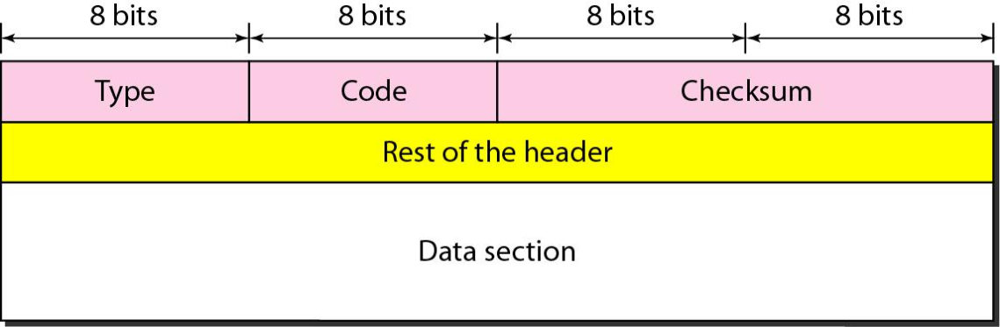

> 头部其余部分 Rest of the header：这4个字节取决于ICMP报文的类型

==注意： ICMP 总是向原始的**源方**报告差错报文。==

### 21.2.3 差错报告

ICMP报文类型和代码意义：

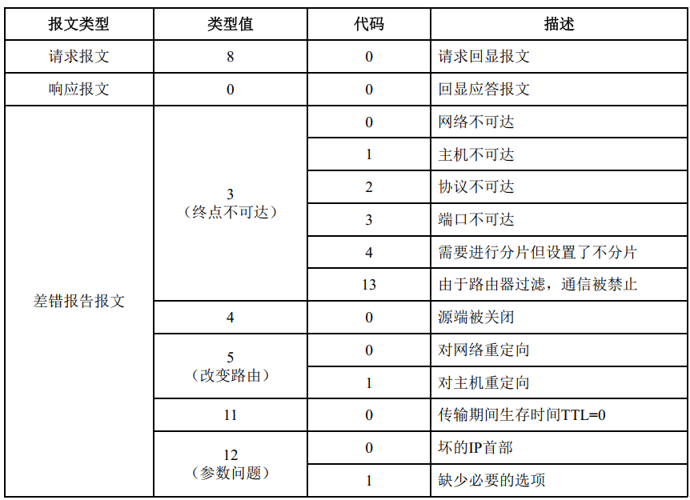

​	**ICMP 差错报文**

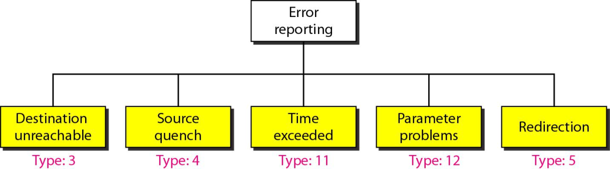

- 对于<u>携带ICMP差错报文的数据报</u>， 不再生产ICMP差错报文。
- 对<u>分段的数据报文</u>， 只对第一个分段产生ICMP差错报文。
- 对于<u>多播地址的数据报文</u>， 不产生ICMP差错报文。
- 具有<u>特殊地址的数据报文</u>， 如127.0.0.0或者0.0.0.0，不产生ICMP差错报文

**差错报文的数据字段的内容**

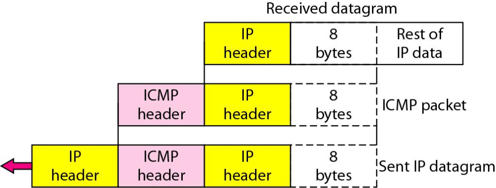

#### destination unreachable 目的端不可达

- 当路由器不能找到路由或者主机不能传递数据时候， 丢弃这个数据报，然后发回目的端不可达报文。
- 目的端不可达报文或者由路由器产生， 或者由目的主机创建。

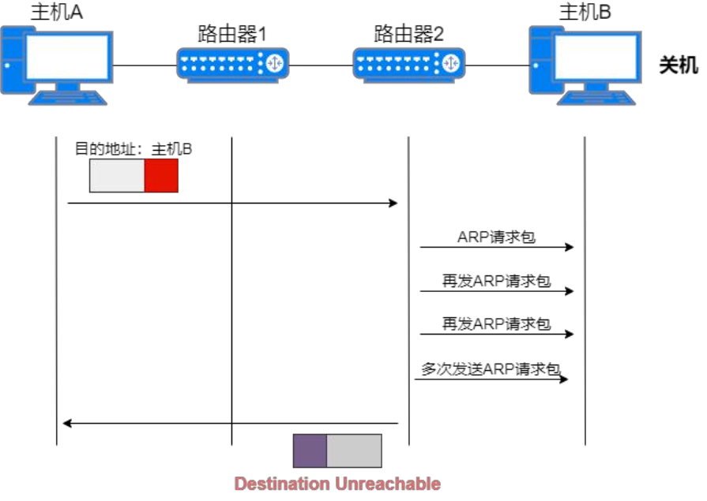

#### source quench 源端抑制

- 用来补充流量控制；
- 当路由器或者目的主机中产生拥塞时， 路由器或者目的主机丢弃数据报， 发送源端抑制报文给发送方。

#### time exceeded 时间超时

- TTL减为0时， 路由器丢弃数据报， 并发送一个 Time Exceeded 消息给源设备， 通知 IP 包已被丢弃。
- 报文的所有分片没有在有限的时间内到达（超时） ， 由目的主机发送。  

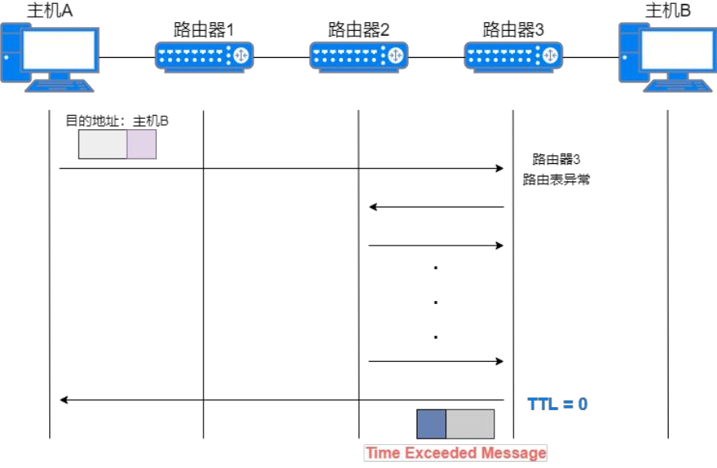

#### parameter problems 参数问题

- IP分组的首部中产生错误或者二义性；
- 路由器或者主机丢弃这个分组， 然后向源方发送 <u>参数问题报文</u>。  

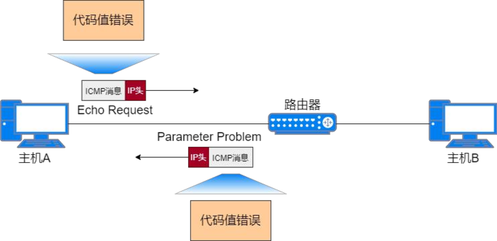

#### redirection 重定向

- 如果路由器发现一条更优的路径发送数据， 那么它就会返回一个Redirection 消息给主机， <u>这个消息包含了最合适的路由信息和源数据</u>。

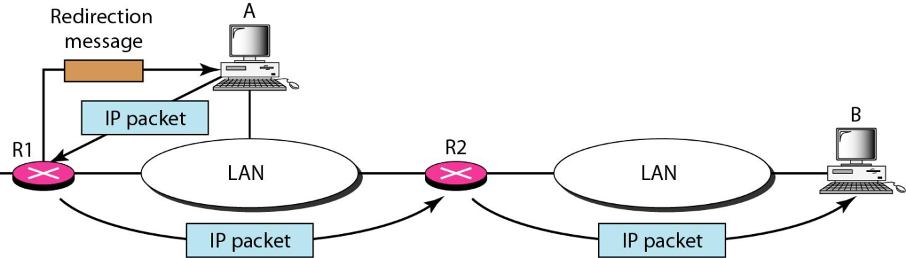

> A想向B发送数据报， R2是有效的路由， 但A却选择了R1， R1收到后发现应该发往R2， 于是把分组发给R2， 同时向A发送重定向报文。

### 21.2.4 查询

查询报文：

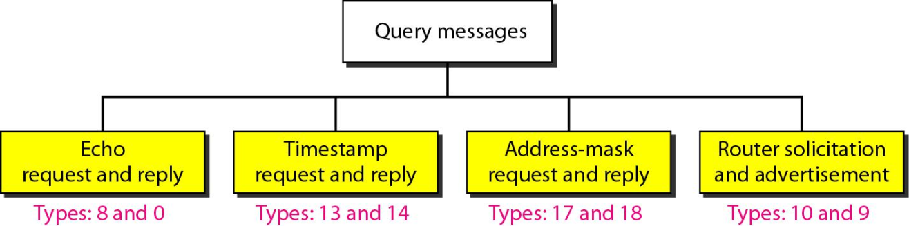

- Echo 回送请求和回答： <u>诊断网络</u>
- Timestamp 时间戳请求和回答： 确定数据报的<u>往返时间</u>， 同步
- Adrress-mask 地址掩码请求和回答： 获取地址对应的<u>掩码</u>
- Router solicitation 路由器询问和通告： 询问<u>路由器</u>是否可正常工作

### 21.2.5 调试工具

#### Ping 命令

ping 是 ICMP 最著名的一个应用， 通过 ping 可以测试网络的可达性， 即网络上的报文能否成功到达目的地。 

- 源设备向目的设备发送 Echo request 消息， 目的地址是目的设备的 IP 地址。 
- 目的设备收到 Echo request 消息后， 向源设备回应一个 Echo reply 消息， 可知目的设备是可达的。  
- 也可以通过 ping 命令来判断目标主机是否启用。  

**ping 不通的情况**

- 如果中间<u>某个路由器没有到达目的网络的路由</u>， 便会向源设备回应一个Destination Unreachable 消息， 告知目的**设备不可达**。  

  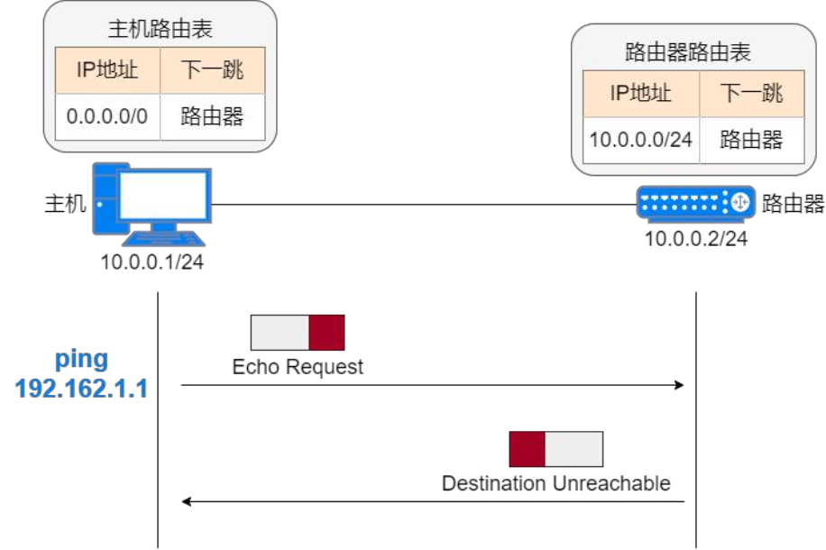

- 如果源主机在<u>一定时间内无法收到回应报文</u>， 就认为目的设备不可达，并显示**超时**。

  > ping 过程是双向的消息通信， 只有双向都成功传输时， 才能说明通信是正常的。 
  > 另外主机也可能因为防火墙拦截， 导致 ping 不通。  

  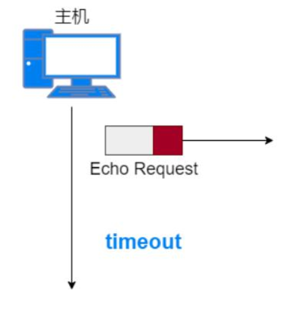

#### Tracert 命令

> ping 工具<u>只能测试目的设备的连通性</u>， 但是<u>看不到数据包的传输路径</u>。在网络不通的情况下， 无法知道网络问题发生在哪个位置。   

- tracert 工具可以查看数据包的整条传输路径， 包括途中经过的中间设备。  

- Tracert 是基于TTL字段和 ICMP协议实现的。
- tracert 过程也是双向消息通信，只有双向都成功传输时， 才能正确探测路径。 主机安装了防火墙也可能造成路径探测失败。

> 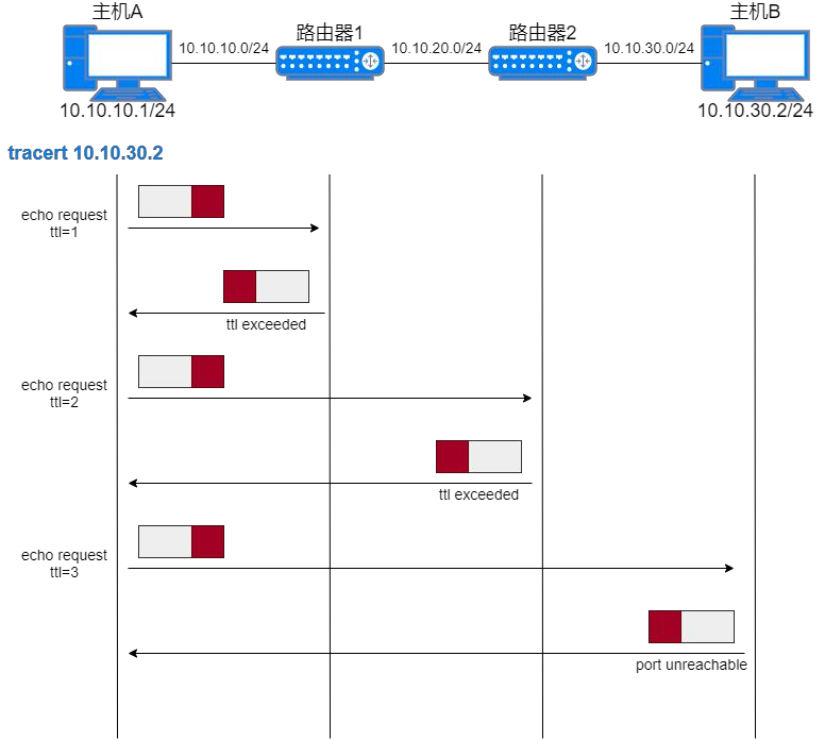
>
> - 源设备发送第一个数据报时TTL值为 1 。 第一个路由器收到数据报后 TTL 值减 1 ， 丢弃数据报并返回**时间超时**ICMP报文。 源设备收到响应报文后， 取出源 IP地址， 即路径上的第一个路由器地址。 然后 发送一个 TTL 值为2 的数据报。 以此类推。
> - 当主机B收到数据报后TTL减为0但不丢弃该报文。 主机A在发送数据报时将目的端口设置为UDP不支持的端口， 当主机B收到该数据报时找不到接收该数据报的应用， 丢弃并发送**目的端不可达**ICMP报文。

## 21.3 IGMP

IP协议可用到两种类型的通信：**单播** 和 **多播**。  

**因特网组管理协议(Internet Group Management Protocol, IGMP)** 是其中一个必要的， 但不是充分的协议， 多播也包含其他的协议。 在IP协议中， IGMP是一个辅助协议。  

### IGMP 报文类型

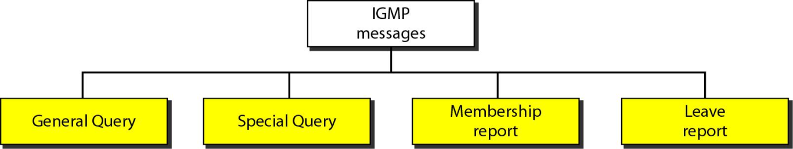

### IGMP 报告格式

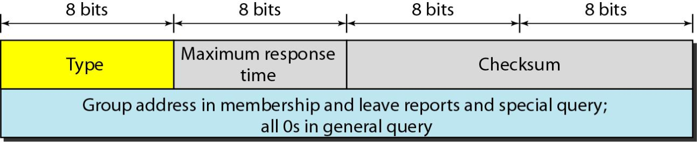

**IGMP 类型字段**

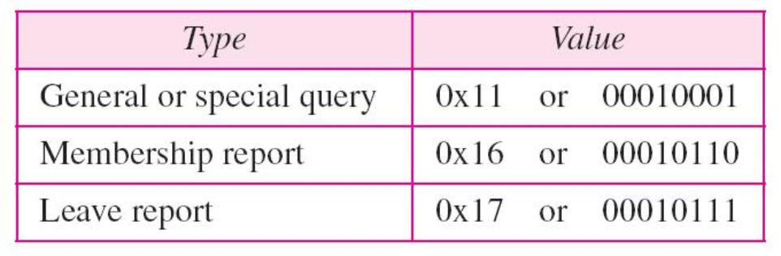

### IGMP 操作

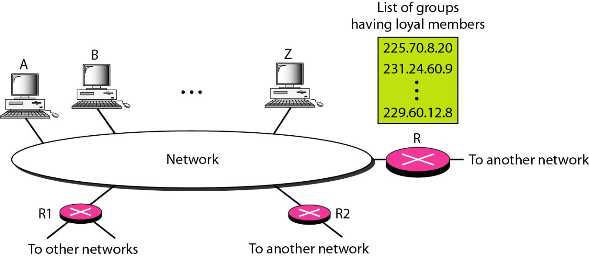

1. 加入一组
2. 离开一组
3. 监视成员关系
4. 延迟响应
5. 查询路由器  

注意：

- 在 IGMP中， 成员关系报告一个接着一个地发送两次。
- 普通查询报文没有定义一个特殊的组。

### IGMP分组的封装  

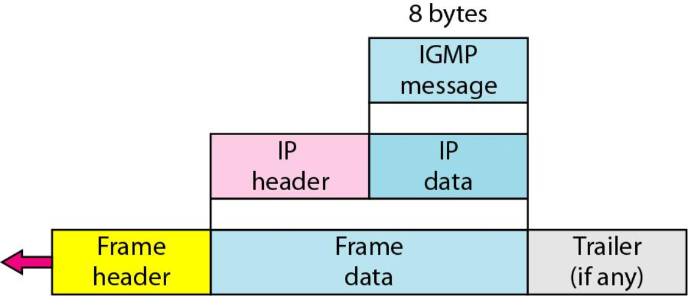

==携带IGMP分组的IP分组的TTL字段值为1。==

#### 将D类地址映射到以太网物理地址

以太网的多播物理地址范围：
01: 00: 5E: 00: 00: 00 — 01: 00: 5E: 7F: FF: FF

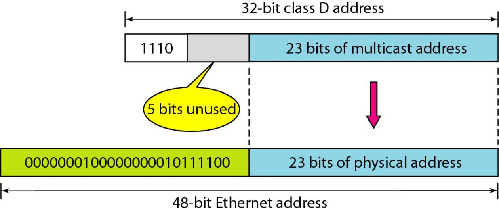

#### 隧道技术

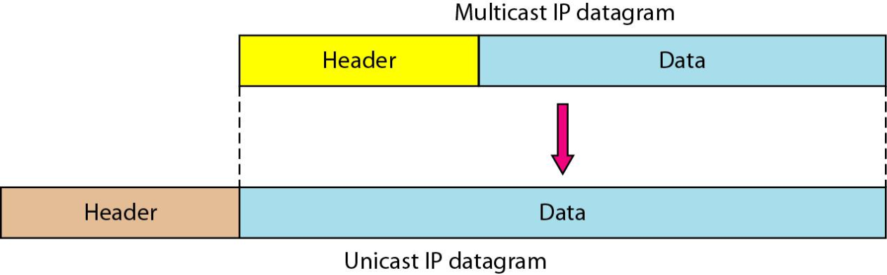

==无物理多播地址支持==

------

# ch22 传递、转发和路由选择

## 22.1 传递

网络层负责用底层物理网络处理分组，定义这种处理为分组的传递。

### 直接传递和间接传递

- **直接传递 (direct delivery)** 就是分组的最终目的端的主机是与发送方都连接在同一个物理网络上。  
- 如果目的主机与发送方不在同一个网络上，分组就是间接传递。在 **间接传递 (indirect delivery)** 时，分组从一个路由器传送到另一个路由器，直到它到达与最终目的端连接在同一个物理网络上的路由器为止。  

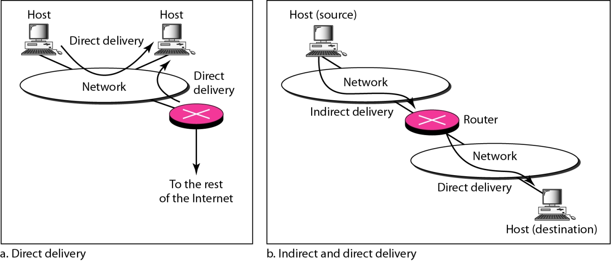

## 22.2 转发

**转发** 是指<u>将分组路由到它的目的端</u>。转发要求主机或路由器有一个路由表。当主机有分组要发送时，或是路由器已收到一个分组要转发时，就要查找路由表以便求得到达最终目的端的路由。  

### 22.2.1 转发技术

#### 路由方法与下一跳方法

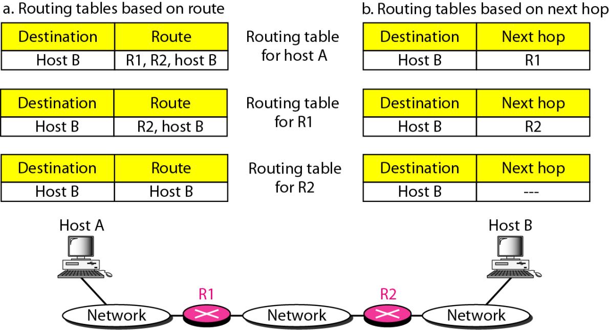

#### 特定主机方法与特定网络方法

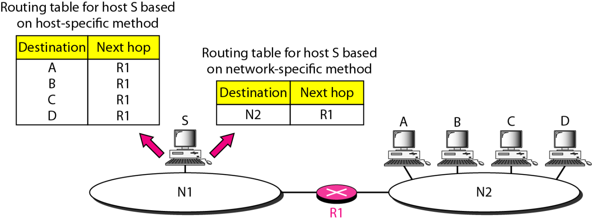

#### 默认方法

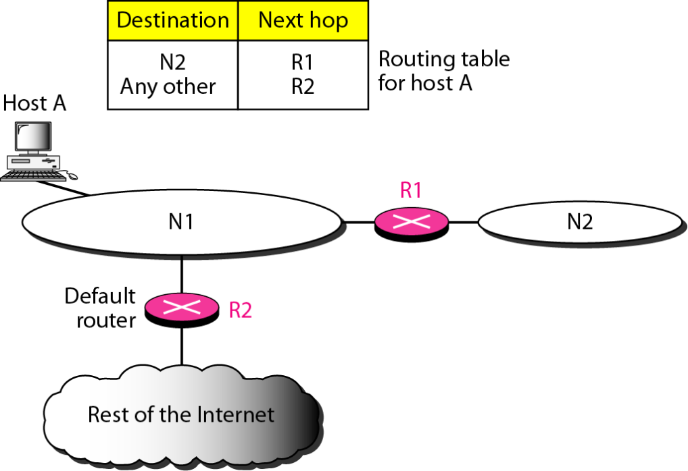

> 通常默认网络地址为 0:0:0:0

### 22.2.2 转发过程

#### 无类地址简化的转发模块

==在无类寻址中，一个路由表至少要有 4 列。==

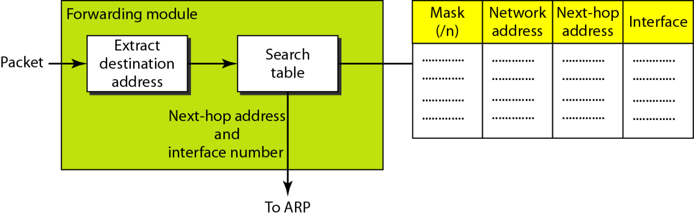

> 例子
>
> 
>
> 路由器R1的路由表：
>
> 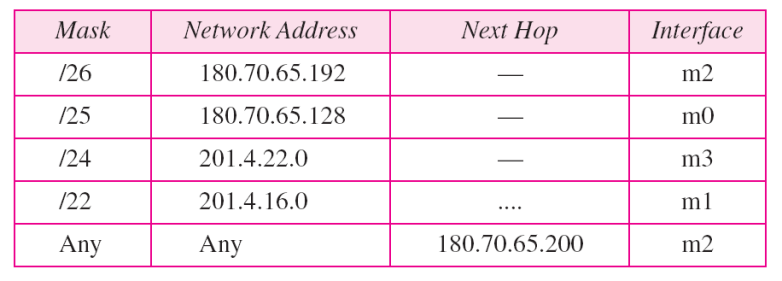

#### 最长掩码匹配

- 使用 CIDR 时，路由表中的每个项目由“掩码”、“网络地址”和“下一跳地址”组成。在查找路由表时可能会得到不止一个匹配结果。
- <u>应当从匹配结果中选择具有**最长掩码**的路由。</u>之所以称为最长掩码匹配，是因为这个表项也是路由表中，与目的地址的高位匹配得最多的表项。
- 掩码越长，其地址块就越小，因而路由就越具体。  
- 路由表中常常包含一个默认路由，这个路由在所有表项都不匹配的时候有着<u>最短的掩码匹配</u>。

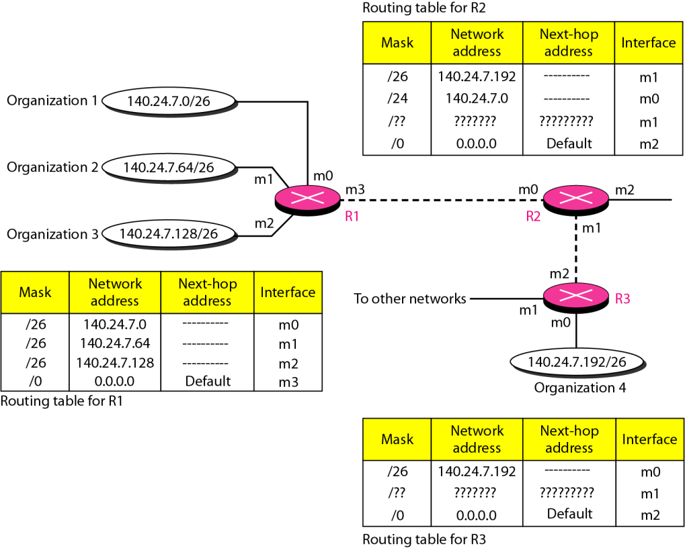

#### ISP 的层次结构路由选择

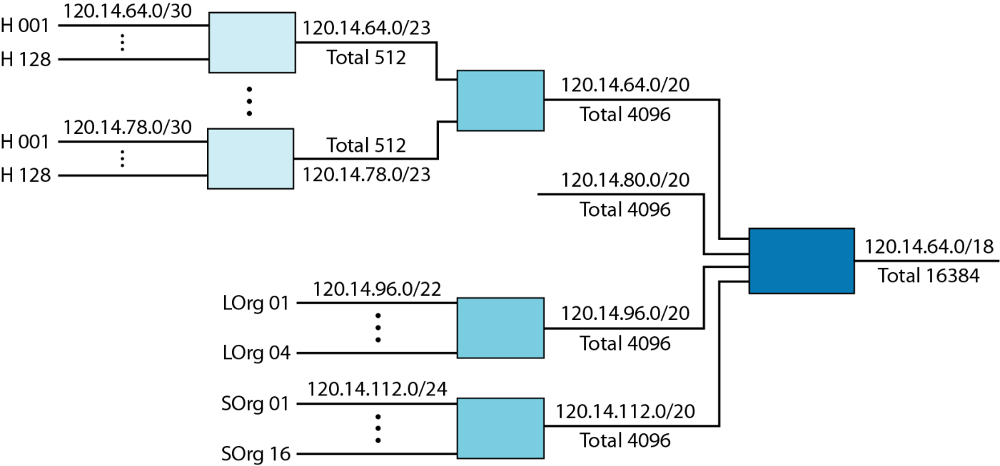

### 22.2.3 路由

**路由**：从某一网络设备出发去往某个目的地所经过的路径。<u>路由器通过查询路由表为数据报选择转发路径</u>。路由表只存在于<u>终端计算机</u>、<u>路由器</u>及<u>三层交换机</u>中，二层交换机中不存在路由表。  

- **直连路由**：设备自动发现的路由信息，路由器可自动发现与自己接口直接相连的网络的路由。
- **静态路由**：人工输入，无法自动更新。用于小型互联网或试验网络。
- **动态路由**：可周期性更新，适合大型网络。

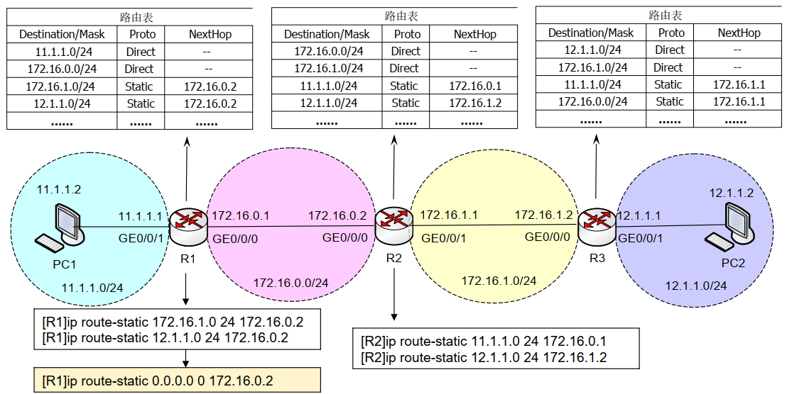

#### 路由表中常用的字段

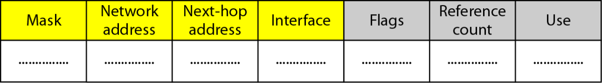

- **掩码**。这个字段定义应用于该表项的掩码。  
- **网络地址**。这个字段定义分组必须传递的最终的网络地址。在特定主机路由选择的情况下，该字段定义目的主机的地址。  
- **下一跳地址**。这个字段定义分组必须传递到下一跳路由器的地址。
- **接口**。这个字段显示接口的名称。
- **标记**。这个字段定义多达5个标记。所谓标记就是一个通/断开关，它表示或者存在或者不存在。
  - ***U (工作)*** 标记U指出路由器正在工作。  
  - ***G (网关)*** 标记G指出目的端是另一个网络。
  - ***H (特定主机)*** 标记H指出在地址字段的项目是一个特定主机地址。
  - ***D (由于重定向而增加的)*** 标记D指出由于ICMP报文中的重定向报文而在主机路由表中增加了到这个目的端的路由选择信息。  
  - ***M (由于重定向而修改的)*** 标记M指出由于ICMP报文中的重定向报文而修改了到这个目的端的路由选择信息。  

- **引用计数**。这个字段给出在任何时候使用本路由的<u>用户个数</u>。
- **使用**。这个字段指出经过本路由器发送到相应的目的端的<u>分组数</u>。

#### 动态路由协议优先级

华为常用的路由协议优先级

> 协议优先级越小，越被路由优选。  

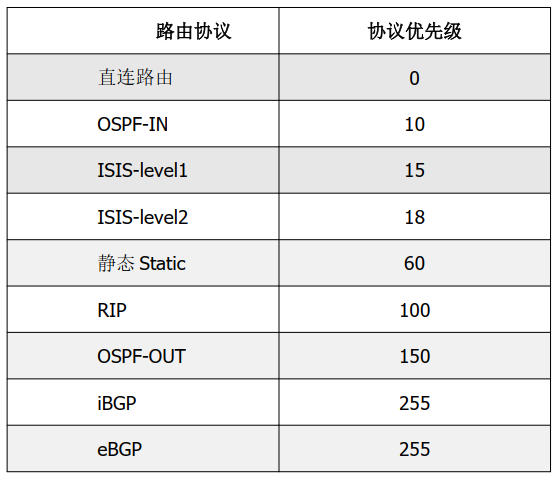

OSPF-IN：表示 AS 内部传递路由

OSPF-OUT：表示引入的外部路由

iBGP：表示从iGBP邻居学习到路由

eBGP：表示从 eBGP 邻居学习到路由

local：表示 aggress 聚合路由

#### 地址聚合

### 22.2.4 路由算法

- 特性
  - 正确性
  - 简洁性
  - 稳健性
  - 稳定性
  - 公平性
  - 最优性
  - 高效性
- 性能评估标准
  - 最小跳数
  - 最小代价

#### Dijkstra 算法

算法描述：

通过拓展路径以不断增加这条路径的长度，从而寻找源结点到所有其它结点之间的路径。

设定：

- N = 网络中结点集合  
- s = 源结点
- T = 当前由算法合并的结点集合  
- w(i, j) = 结点 i 到结点 j 之间的 **链路代价**  
  - w(i, i) = 0  
  - w(i, j) = ∞，当结点之间不是直接连接时
  - w(i, j) ≥ 0，当两个结点直接连接时  
- L(n) = 算法目前所知从结点 s 到结点 n 之间的 **最小代价** 路径的代价
  - 算法结束时， L(n) 是从 s 到目的结点 n 的最小代价路径的代价。

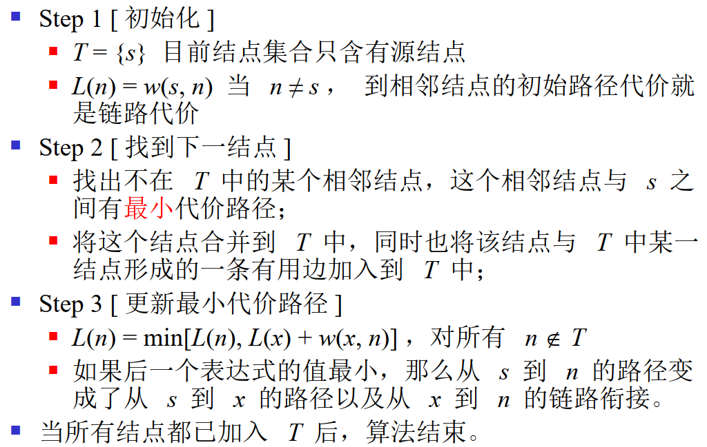

> - 第 2 步和第 3 步每循环一次，就向 T 中增加一个新结点，并且定义了从 s 到该结点之间的最小代价路径。
> - 算法结束时，与各结点 x 相关的 L(x) 就是从 s 到 x 的最小代价路径的代价。

> 例子：
>
> 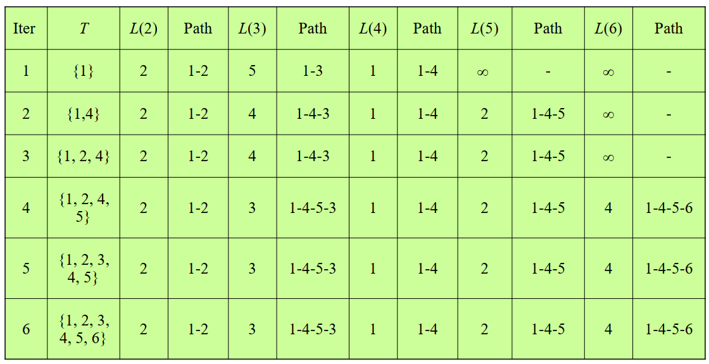
>
> 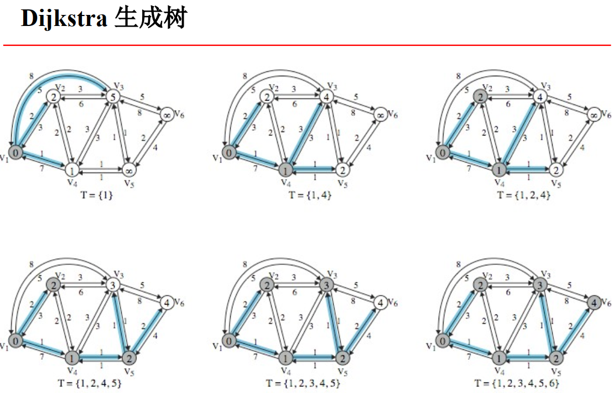

#### Bellman-Ford 算法

算法描述：

- 从给定的源结点找出一条最短路径，该最短路径是从所有最多只含 1 条链路的路径中选择出来的；
- 再找出条件为所有路径最多只含 2 条链路的最短路径；
- 依此类推 …  

设定：

- s = 源点
- w(i, j) = 结点 i 到结点 j 之间的链路代价
  - w(i, i) = 0  
  - w(i, j) = ∞，当结点之间不是直接连接时
  - w(i, j) ≥ 0，当两个结点直接连接时  
- h = 在算法目前阶段中的路径具有的最大链路数
- L~h~(n) = 在不多于 h 条链路的条件下，从结点 s 到结点 n 的最小代价路径的代价

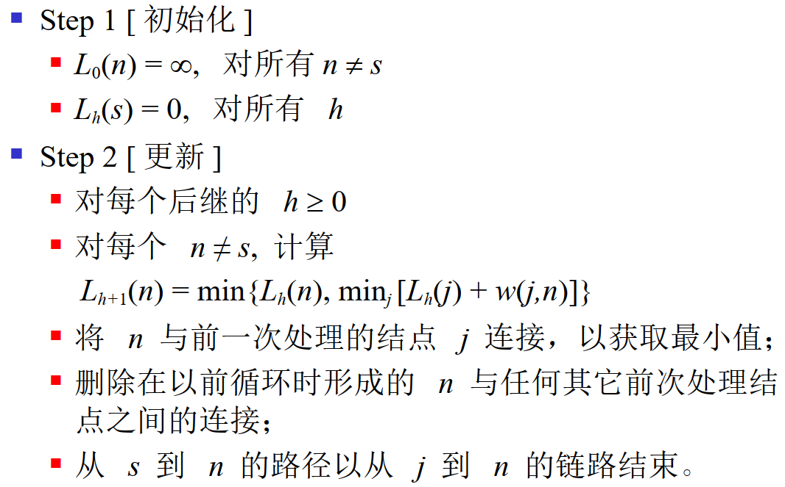

> - 第 2 步不断重复，当 h = K 时，对于每个目的结点 n ，算法将从 s 到 n 的长度为 K+1 的可能路径与前一次循环结束时得到的路径相比较；  
> - 如果前次更短的路径具有较小的代价，仍然保持前次的路径；否则从 s 到 n 之间定义一条长度为 K+1 的新路径；
> - 这条新路径含有长度为 K 的从 s 到某个结点 j的路径，再加上从结点 j 到结点 n 的直接 1 跳；
> - 其中用到的从 s 到 j 的路径就是在前一次循环时为 j 定义的 K 跳路径。  

> 例子：
>
> 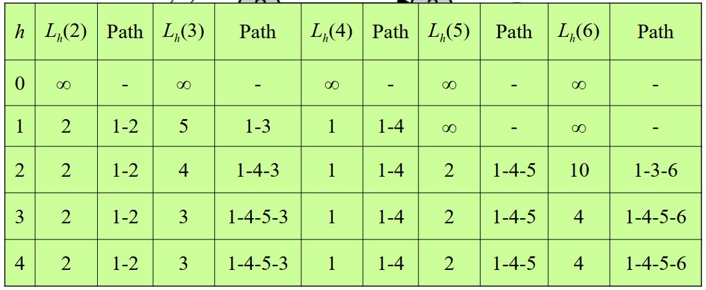
>
> 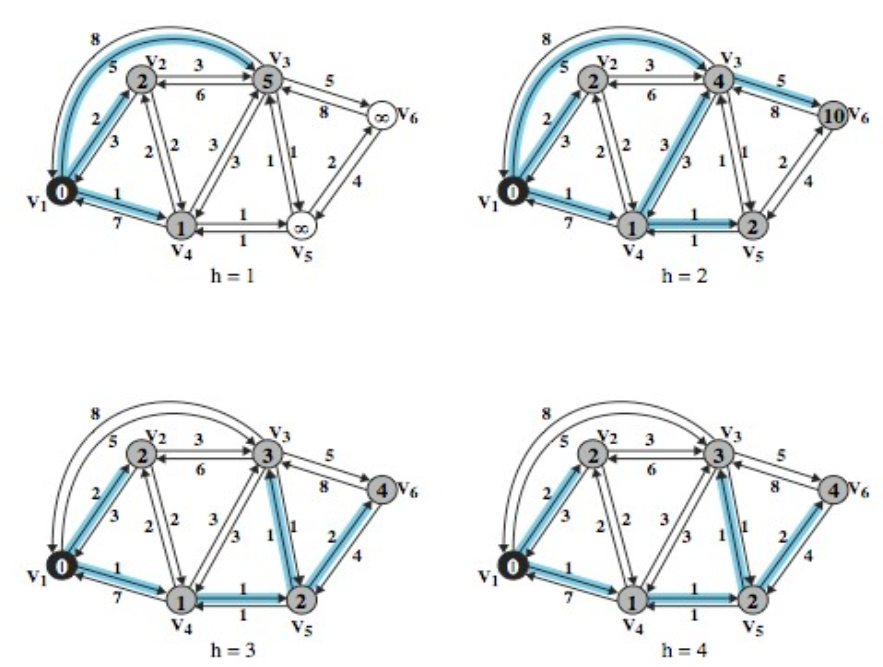

## 22.3 单播路由选择协议

路由表可以是静态的也可以是动态的。静态路由表是由人工输入项目，而动态路由表在互联网中某处有变化时就会自动地更新。  

路由选择协议是一些规则和过程的组合，使得在互联网中的<u>各路由器能够彼此互相通知这些变化。</u>  

**动态路由协议的功能**

- 知道有哪些邻居路由器；
- 能够学习到网络中有哪些网段；
- 能够学习到至某个网段的所有路径；
- 能够从众多的路径中选择最佳的路径；
- 能够维护和更新路由信息。

### 22.3.1 优化原则

路由器将分组转发到哪个与其相连的网络，取决于哪一个可用路径是最佳路径。

**度量 (metric)：**

- 给网络指定代价  
  - 路由信息选择协议 RIP
  - 开放最短路径优先协议 OSPF
- 可达性
  - 边界网关协议 BGP

### 22.3.2 域内部和域间路由选择

#### 自治系统 AS

**自治系统 (autonomous system)** 是一个单一的管理机构管辖下的一组网络和路由器。

- 在自治系统内部的路由选择称为 **域内路由选择 (intradomain routing)** 。
  - 每一个自治系统可以选择一种或多种域内路由选择协议处理自治系统内部的路由选择。  
- 在自治系统之间的路由选择称为 **域间路由选择( interdomain routing)** 。
  - 处理自治系统之间的路由选择，通常只能使用一种域间路由选择协议  

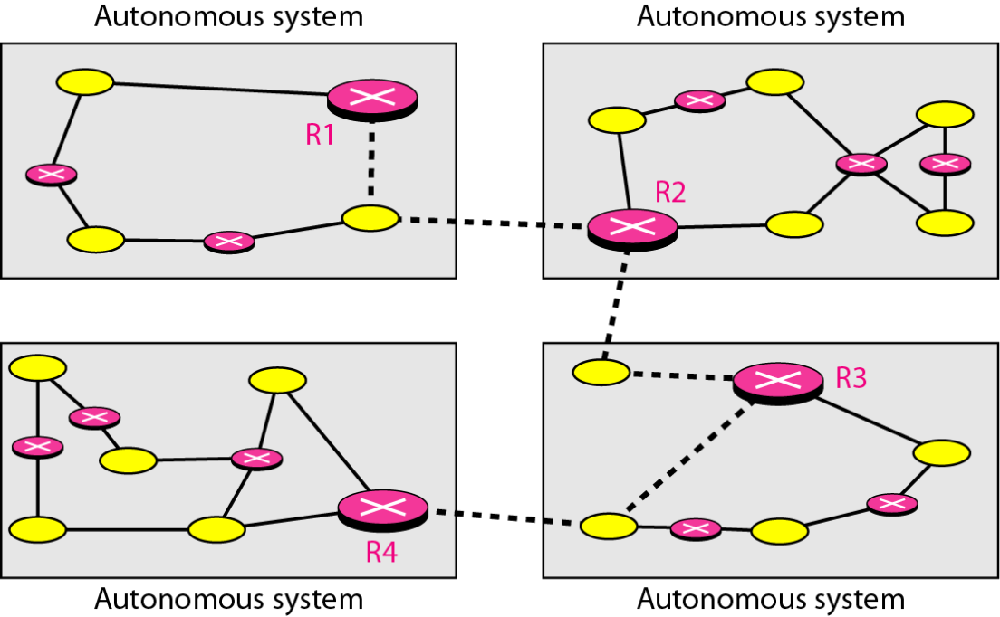

#### 流行的路由选择协议

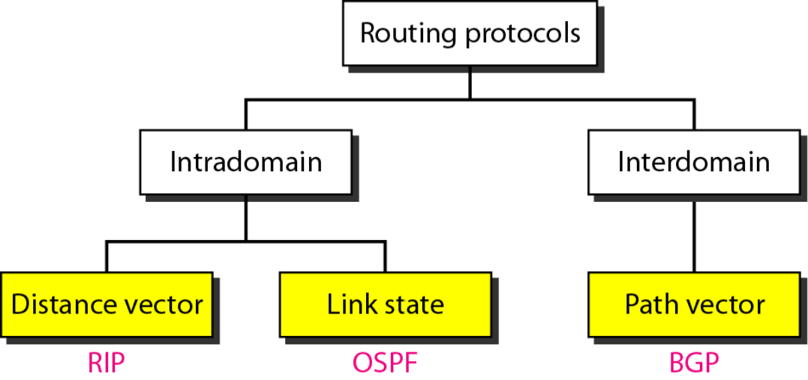

- **路由选择信息协议 (Routing Information Protocol , RIP)** 是一种距离向量协议
- **开放最短路径优先 (Open Shortest Path First, OSPF)** 是一种链路状态协议
- **边界网关协议( Border Gate Protocol , BGP)** 是一种路径向量协议

### 22.3.3 距离向量路由选择

**距离向量路由选择表**

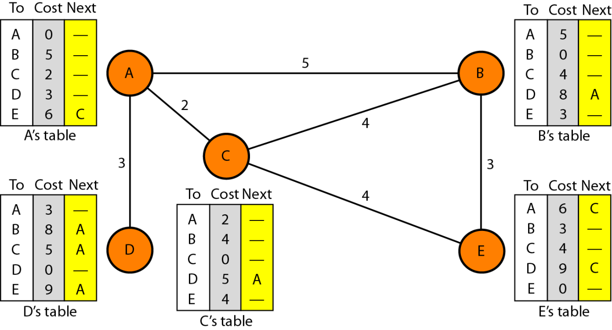

**step1: 初始化**

每一个节点仅知道与它直接连接的 **邻站 (immediate neighbor)** 的距离  

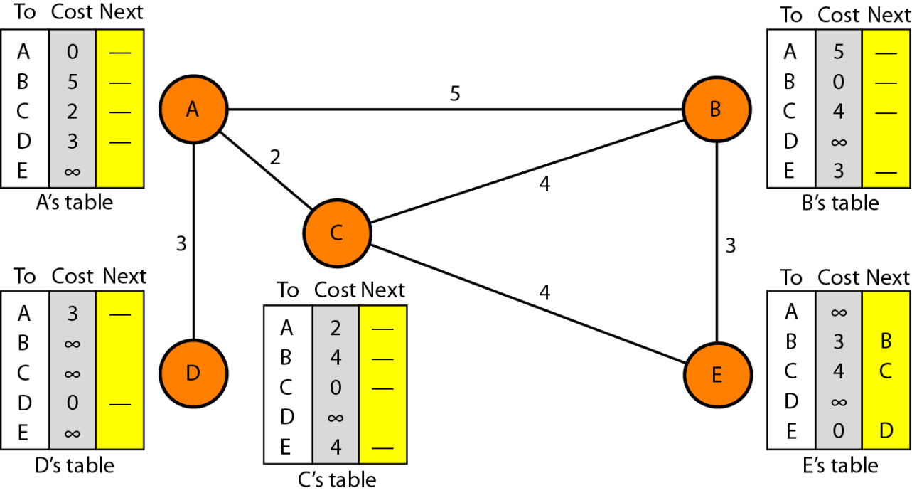

**step2: 共享路由信息**

- 在距离向量路由选择中，每个节点与它的**邻站**周期性地或有变化时共享其路由表。
- 每个节点向邻居节点共享它的**完整**路由表。
- 但是，表中的第三列对接收节点来说是没有用的，当它收到一个表的时候，把第三列都用发送方的节点名替代

**step3: 距离向量更新**

- 如果下一节点项目相同，选取新行；
- 如果下一节点项目不同，选取具有最小代价的行，最小代价相同时保持旧项目。

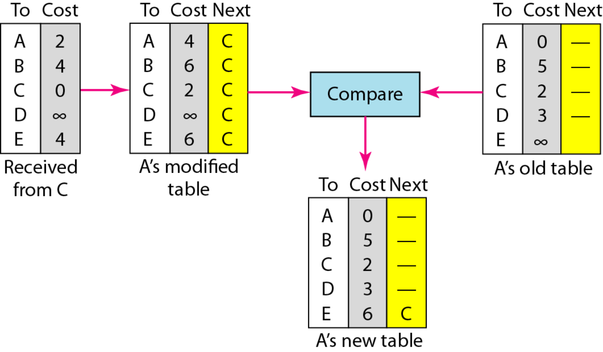

#### 何时共享

- **周期性更新**：通常每隔 30 秒。
- **触发更新 (triggered update)**：路由表有变化时。
  - 节点接收到邻站的表，引起自己表的更新；
  - 节点检测到邻站链路有故障。

#### 两个节点不稳定性

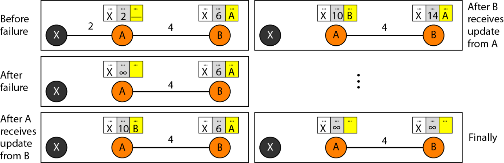

解决方法：

- **定义无穷大**：将一个较小的数值定义为无穷大， <u>RIP 协议为 16</u> ；
- **分割范围（ split horizon ）**：发送表的一部分。如果节点 B 认为通过 A 到达 X 是最佳路径，则 B 不向 A 通知此消息；
- **毒性逆转（ poison reverse ）**：如果节点 B 到达 X 的最佳路径是通过 A ，它将告诉 A 自己到 X 的距离是无穷大。这样， B 向 A 撒了一个善意的谎言，使得只要 B 经过 A 选路到 X ，它就会一直持续这个谎言， A 也就永远不会尝试从B 选路到 X 了，因而避免了环路问题。

#### 三个节点不稳定性

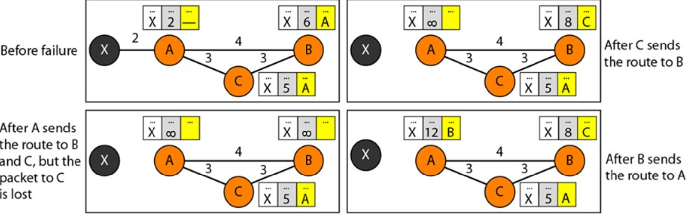

#### 路由信息协议 RIP (Routing Information Protocol)

- RIP 是基于 **距离矢量算法** 的路由协议，利用 **跳数** 来作为计量标准，每经过一个路由器，跳数就加 1 。
- RIP 采用 **Bellman-Ford 算法**，是基于 UDP 的协议。
- RIP 协议分为 **RIPv1** 和 **RIPv2** ，两者的区别如下：
  - **RIPv1** 仅适用于 <u>**有类网络路由**</u>，其协议报文 <u>无法携带掩码信息</u>，只能识别 A 、 B 、 C 类自然网段的路由，因此 RIPv1 *<u>不支持非连续子网</u>*。当网络中划分子网时， RIPv1 仅通告其主类网络地址，形成路由表。 RIPv1 采用 **广播更新（ 255.255.255.255 ）**，十分占用网络资源。
  - **RIPv2** 报文中<u>携带掩码信息</u>，支持<u>**可变长子网掩码 VLSM**</u> 和 <u>**无分类域间路由选择 CIDR**</u> ，支持对协议报文进行验证，并提供明文验证和 MD5 验证两种方式，增强安全性。 RIPv2 采用**增量更新、组播更新（ 224.0.0.9 ）**，减少资源消耗。

**RIP 协议的优缺点**

优点：

- 实现简单，开销较小。

缺点：

- 由于 15 跳为最大值， RIP 只能应用于小规模网络；
- 收敛速度慢（ 240s ）；
- 根据跳数选择的路由，不一定是最优路由；
- 带宽占用率大（ RIPv1 广播更新， RIPv2 组播更新，但都 30s 一次）；  
- 网络可见度只有一跳。

**RIP 协议算法**

收到相邻路由器（其地址为 X ）的一个 RIP 报文：

1. 先修改此 RIP 报文中的所有项目：把“下一跳”字段中的地址都改为 X ，并把所有的“距离”字段的值加 1 。
2. 对修改后的 RIP 报文中的每一个项目，重复以下步骤：
   - 若原来路由表中没有目的网络 N ，则把该项目加到路由表中；
   - 否则（即路由表中有目的网络 N ），此时查看下一跳地址。
     - 若下一跳地址是 X ，则把收到的项目替换原路由表中的项目；
     - 否则 （即路由表中有目的网络 N ，但下一跳不是 X ）
       - 若收到项目中的距离小于路由表中的距离，则进行更新；
       - 否则什么也不做。

3. 若 3 分钟还没有收到相邻路由器的更新路由表，则把此相邻路由器记为不可达路由器，即将距离置为 16 。
4. 返回。

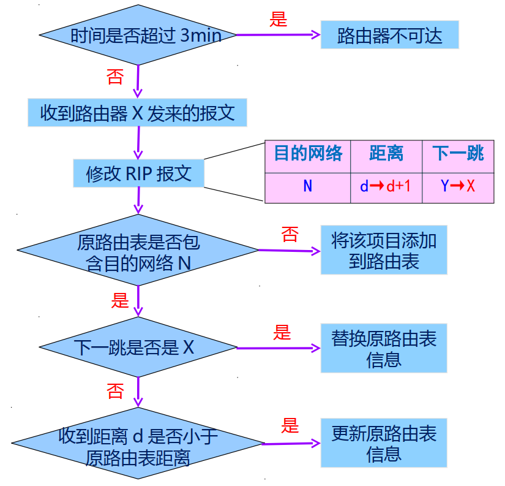

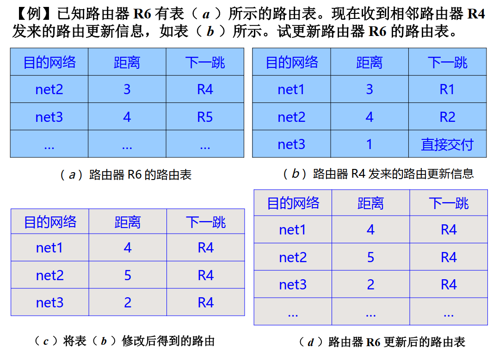

### 22.3.4 链路状态路由选择

区域中的<u>每个节点拥有该区域的全部拓扑结构</u>，包括所有节点和链路的列表，它们如何连接包含类型、代价即度量和链路的接通或断开的情况。

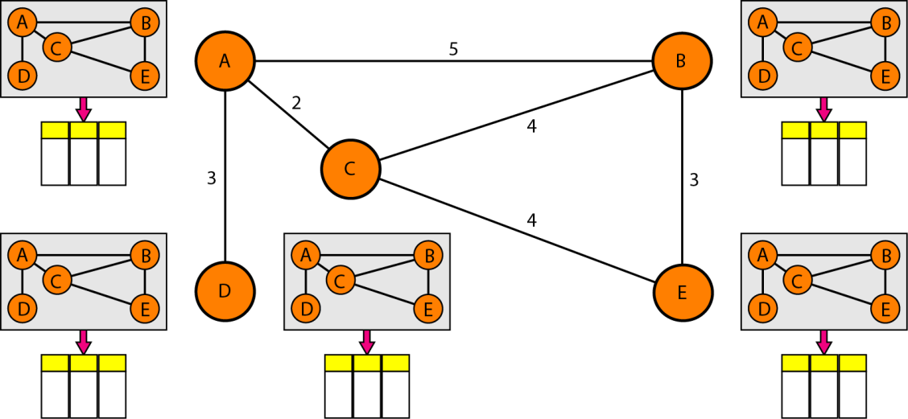

**链路状态知识**

每个节点知道自己这一部分的链路状态（如类型、状态和代价），整个拓扑可由每一个节点的部分知识复合而成。

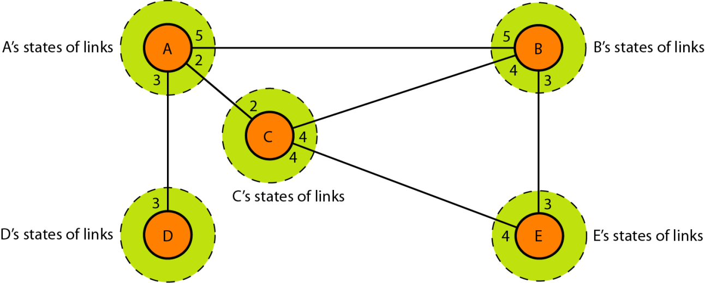

#### 建立路由表

- 按每个节点建立 **链路状态分组 LSP** 的链路状态；
- 用**洪泛法 （ flooding ）**向其它路由器扩散 LSP；
- 为每个节点构成一个**最短路径树**；
- 基于最短路径树计算路由表。

#### 生成 链路状态分组 LSP

- 链路状态分组携带大量信息，如 *节点标识*、*链路清单*、*序列号* 和 *寿命*。
- 生成 LSP 的情况
  - 区域的拓扑发生变化时
  - 周期性产生： 60 分钟 ~ 2 小时  

#### 洪泛 flooding

- 创建节点的 LSP ，并从每个接口发送 LSP 副本。
- 收到 LSP 的每个节点与已有的副本比较：
  - 丢弃旧的，保留新的；
  - 节点通过每个接口（接收副本的接口除外），再次转发副本。

**最短路径树构成的范例**

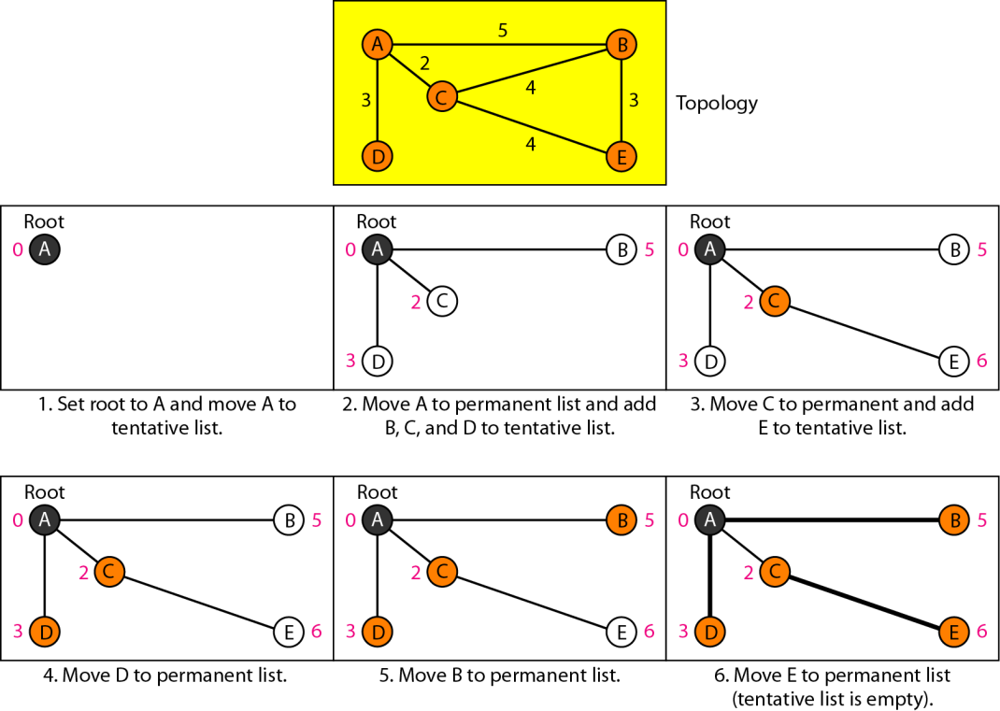

#### 最短路径优先协议 OSPF (Open Shortest Path First)

- Open 表 示 OSPF 协议不受某一家厂商控制，是公开发表的。 SPF 表示<u>使用 Dijkstra 最短路径优先算法</u>（但并不表示其它路由选择协议不是“最短路径优先”）。
- OSPF 是分布式的**链路状态协议**，其工作过程如下：
  - **了解自身链路**：每台路由器了解其自身的链路，即与其直连的网络。  
  - **寻找邻居**：不同于 RIP ， OSPF 协议运行后，并不立即向网络广播路由信息，而是先寻找网络中可与自己交换链路状态信息的周边路由器。可以交互链路状态信息的路由器互为邻居。
  - **创建链路状态数据包**：建立了邻居关系后就可以创建链路状态数据包。 
  - **链路状态信息传递**：路由器将描述链路状态的 LSA 洪泛到邻居，最终形成包含网络完整链路状态信息的链路状态数据库。
  - **计算路由**：路由区域内的每台路由器都可使用 SPF 算法来独立计算路由。

#### 自治系统中的区域

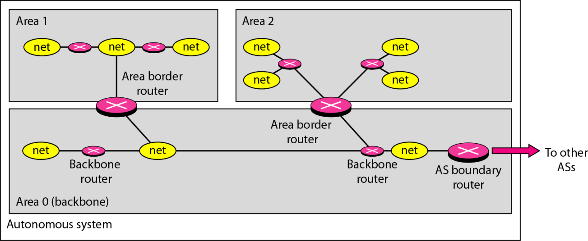

- 区域是 AS 中<u>一些网络、主机和路由器的集合</u>，区域之间是互联的；
- 每个区域都有标识，用 <u>32 bit 的区域标识符</u>表示（点分十进制）；
- <u>OSPF 使用层次结构的区域划分</u>，主干区域 0.0.0.0 为必需的，用来连通其它非主干区域；
- 区域不能太大，一个区域内的<u>路由器最好不超过 200 个</u>。

#### 划分区域的优点

- 缩小数据库规模：将利用**洪泛法**交换链路状态信息的范围<u>局限于每一个区域而不是整个的自治系统</u>，减少了整个网络上的通信量。
- 方便路由控制：在一个<u>区域内部</u>的路由器<u>只知道本区域的完整网络拓扑</u>，而不知道其它区域的网络拓扑的情况。
- 加快收敛，增强稳定性，扩展性强。  

#### OSPF 协议的特点

- **适合大范围的网络**： OSPF 对路由的跳数没有限制，所以可用于多种场合，也支持大的网络规模。
- **组播触发式更新**： OSPF 在收敛完成后，会以触发方式发送拓扑变化的信息给其他路由器，可减少网络宽带的利用率；同时，可以减小对其它设备的干扰。
- **收敛速度快**：网络结构出现改变时 OSPF 系统会以最快的速度发出新的报文，从而使新的拓扑情况很快扩散到整个网络。
- **以开销作为度量值**： OSPF 协议在设计时，就考虑到了链路带宽对路由度量值的影响。 OSPF 是以开销值作为标准，带宽越高开销就越小，因而 OSPF 选路主要基于带宽因素。
- **避免路由环路**：使用最短路径算法不会产生环路。  
- **应用广泛**：应用最广泛的 IGP 之一。  

### 22.3.5 路径向量路由选择

- 因特网的规模太大，使得自治系统之间路由选择非常困难。对于自治系统之间的路由选择，要寻找最佳路由是很不现实的。
  - 路由表的项目数太多。
  - 当一条路径通过几个不同自治系统时，要想对这样的路径计算出有意义的代价是不太可能的。
  - 比较合理的做法是在自治系统之间交换“可达性”信息。  

- 自治系统之间的路由选择必须考虑有关策略。
- 因此，路径向量路由选择协议只能是力求寻找一条能够到达目的网络且比较好的路由（不能兜圈子），而并非要寻找一条最佳路由。

**step1：初始化 & step2：共享**

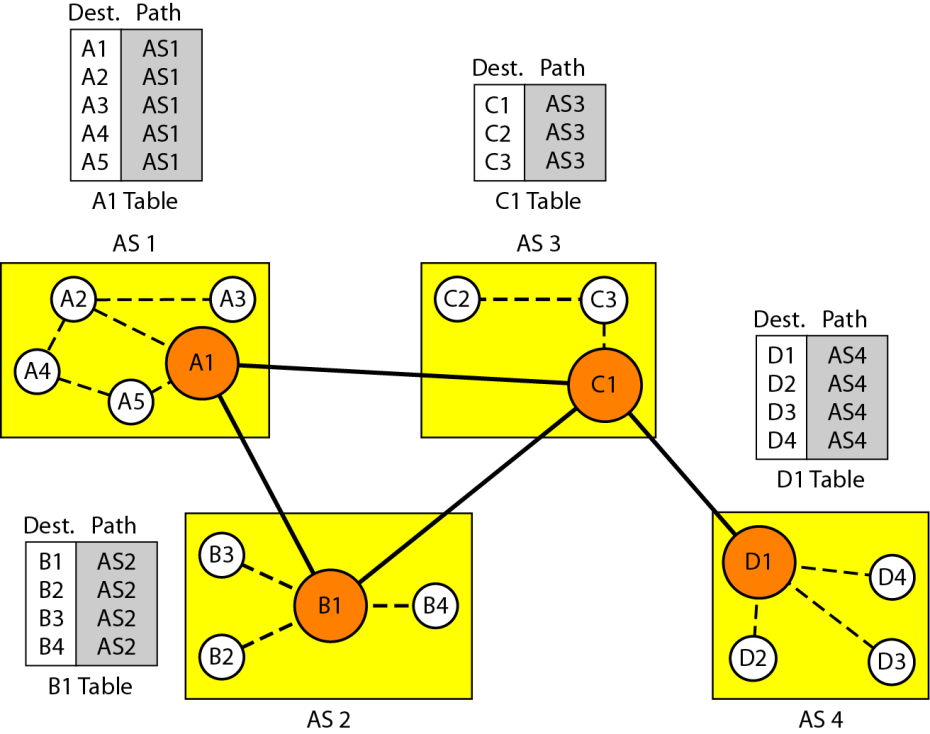

**step3：更新**

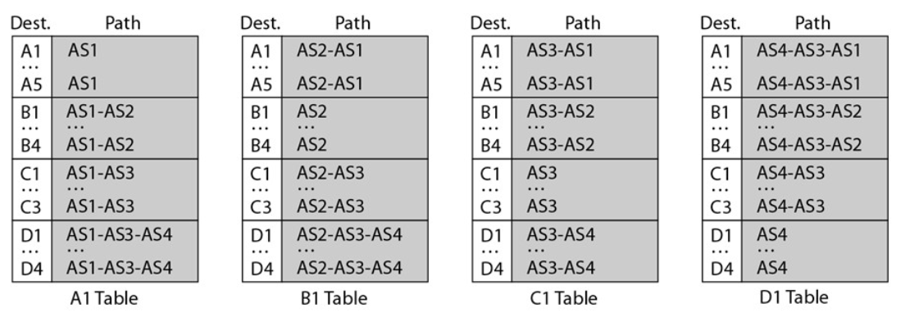

#### 路径向量路由选择协议的优点

- 预防回路：避免距离向量路由选择协议的不稳定性和回路问题。
- 策略路由选择：路由器检查报文路径，如果路径中列出的某自治系统不符合策略，则忽略。

- 优化路径：符合组织机构标准的路径及保密、安全、可靠性等其它原则

#### 边界网关协议 BGP （ Border Gateway Protocol ）  

- BGP 运行于 **TCP** 上，是唯一一个<u>用来处理因特网大小网络的协议</u>，也是唯一能够妥善处理好不相关路由域间的多路连接的协议。
- BGP 的主要功能是和其他 BGP 系统交换网络可达信息，包括列出的 AS 的信息，有效地构造 AS 互联的拓扑图并清除路由环路，同时<u>在 AS 级别上可实施策略决策</u>。
- BGP-4 在 1995 年发布，支持无类域间路由、路由聚合，每个自治系统管理员至少要选择一个路由器作为该自治系统的 “BGP 发言人”。

**BGP 协议的特点**

- 结点数量级是<u>自治系统数</u>的量级，比自治系统中的网络数少很多。
- 每一个自治系统中 BGP <u>代言节点的数目很少</u>，使得自治系统之间的路由选择不致过分复杂。
- 支持 CIDR ，因此 BGP 路由表包括目的网络前缀、下一跳路由器，以及到达该目的网络所要经过的各个自治系统序列。
- 在 BGP 刚刚运行时， BGP 的邻站是交换整个的 BGP 路由表。以后只在发生变化时更新有变化的部分，这样可节省网络带宽和减少路由器的处理开销。

#### BGP 会话

- <u>使用 BGP 的两个路由器之间交换路由信息即为会话</u>。  
- 一个 BGP 代言节点与其它自治系统中的 BGP 代言节点交换路由信息，需要先建立 TCP 连接，然后在此连接上交换 BGP 报文以建立 BGP 会话。
- 使用 TCP 连接能提供可靠的服务，也简化了路由选择协议。

**内部和外部 BGP 会话**

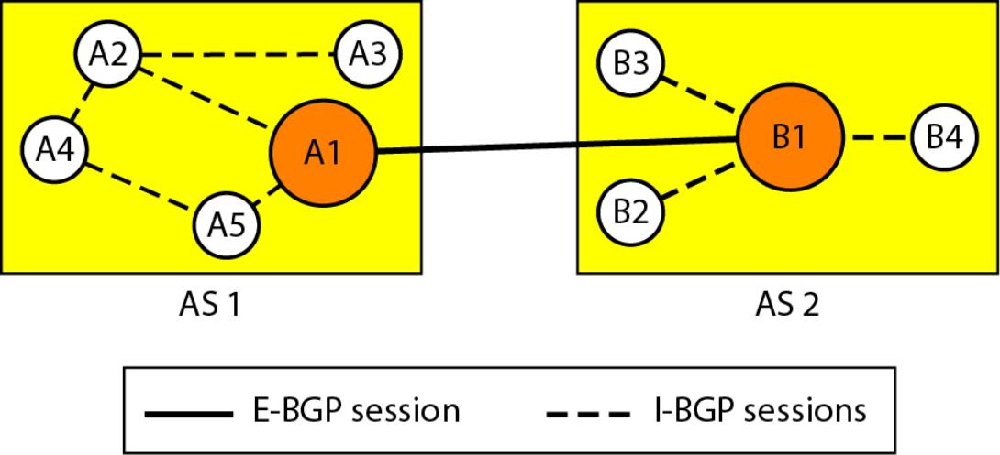

## 22.4 多播路由选择协议

### 单播

在单播中，路由器将接收到的分组仅从其端口中的一个转发出去。  

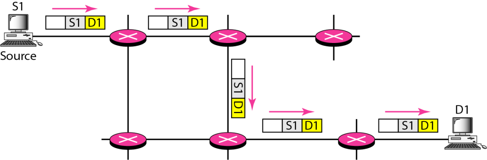

### 多播

在多播中，路由器可能通过它的多个端口将其所接收到的分组转发出去。  

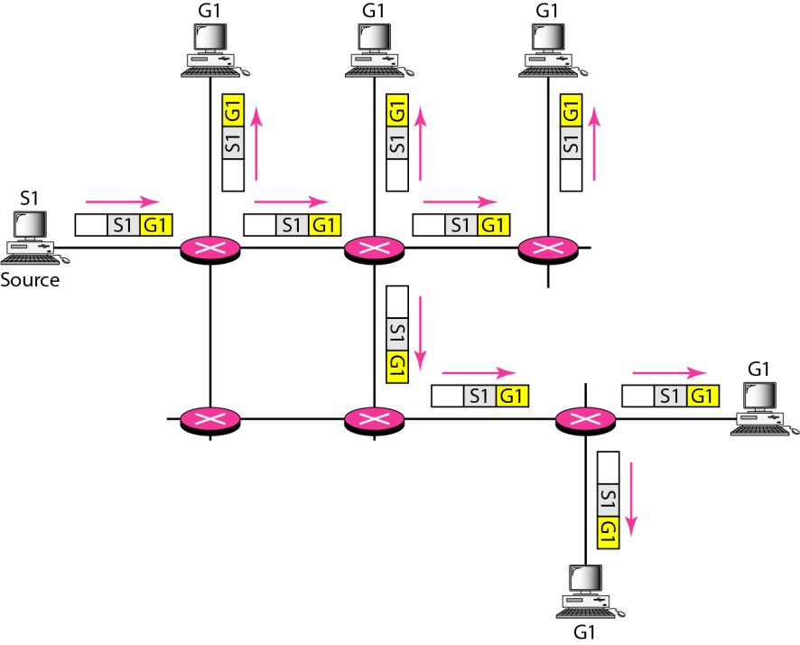

### 多个单播

用单播仿真多播效率不高并可能产生长的延迟，特别是对于大的分组。  

**多播 vs 多个单播**

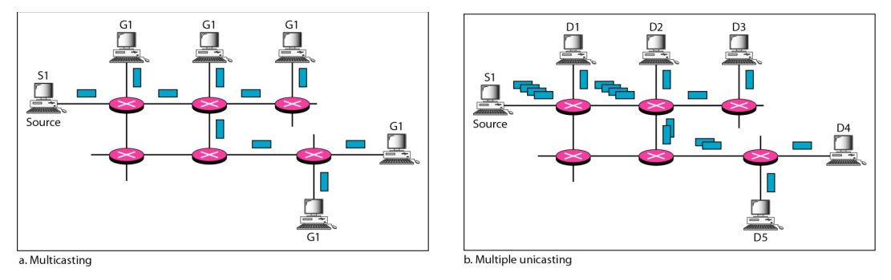

### 单播路由选择中的最短路径树  

在单播路由选择中，区域中的每一个路由器都有一张表，该表定义了到可能目的地址的一棵最短路径树。

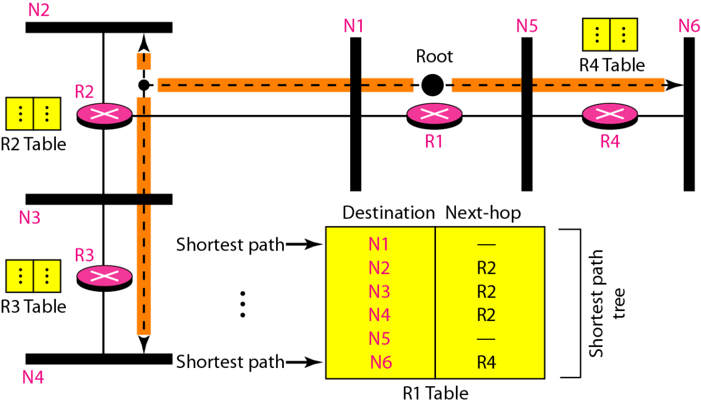

### 基于源树方法

在基于源树方法中，每个相关路由器都要为每个组构建一棵最短路径树。

### 组共享树

在组共享树方法中，只有一个核心路由器，它对多播所涉及的每个组有一个最短路径树。  

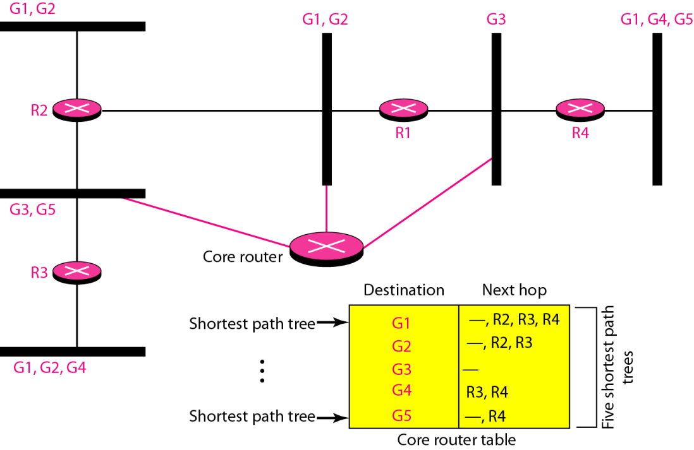
