# 第6章 流水线

## 6.1 概述

### 1. 流水线的定义

将一<u>重复</u>的 *处理过程* <u>分解</u>为若干 *子过程*，每个子过程都可有效地在其专用功能段上 *与其它子过程* <u>同时执行</u>，这种技术称为 **流水线技术**。  

- 流水线不能缩短单个任务的响应时间，但可以**提高吞吐率**；
- 流水线速度**限制于最慢流水站的速度**；
- 流水线中多个任务是**并行**处理的；
- **最大加速比 = 流水站数**
  - 流水站速度不匹配
  - 流水线“填充”和“排空”时间

#### 计算机中的流水线

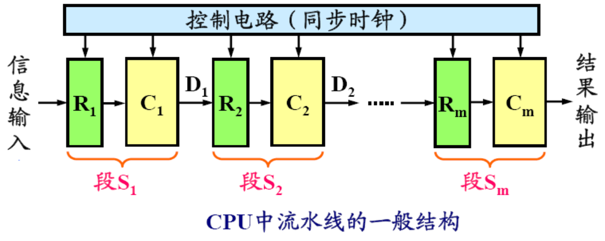

##### a. **指令流水线**

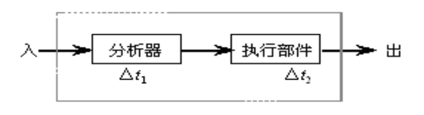

##### b. **功能部件流水线**

### 2. 流水线的特点

- 流水过程由多个相关的子过程组成，这些子过程称为流水线的**“级”**或**“段”**。<u>段的数目</u>称为流水线的**“深度”**。
- 每个子过程由专用的功能段实现，各功能段的时间应**基本相等**，通常为1个时钟周期（1拍）。
- 流水线需要经过一定的**通过时间**才能稳定。
- 流水技术适合于**大量重复**的时序过程。

### 3. 时-空图

从**时间**和**空间**两个方面描述流水线的工作过程，<u>横坐标表示时间</u>，<u>纵坐标表示各流水段</u>。

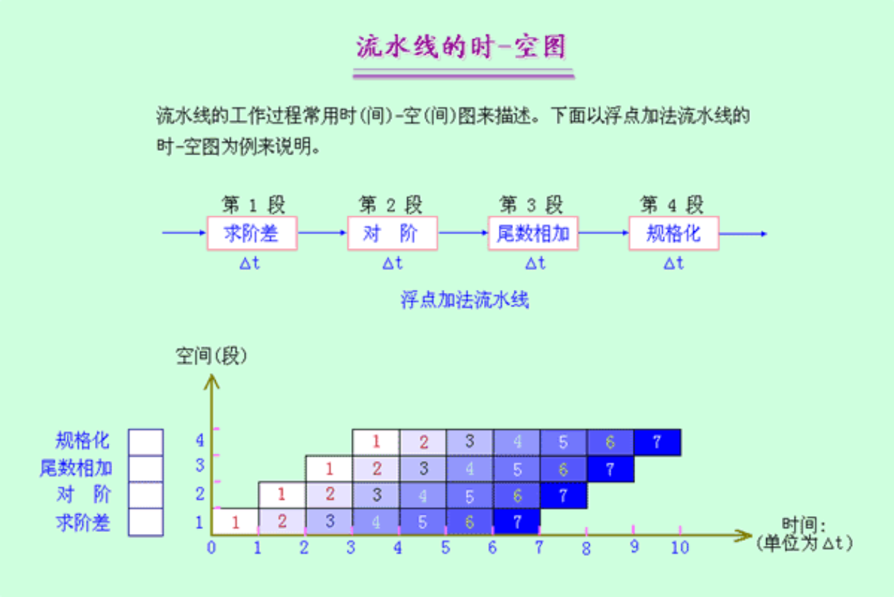

### 4. 流水线的分类

*<u>流水线可以按不同的观点进行分类。</u>*

#### a. 单功能流水线和多功能流水线

*<u>按流水线**所完成的功能**分类</u>*  

- **单功能流水线**，是指只能完成一种固定功能的流水线。
- **多功能流水线**， 是指各段可以进行不同的连接，从而完成不同的功能。
  - 例如： TI ASC的多功能流水线
    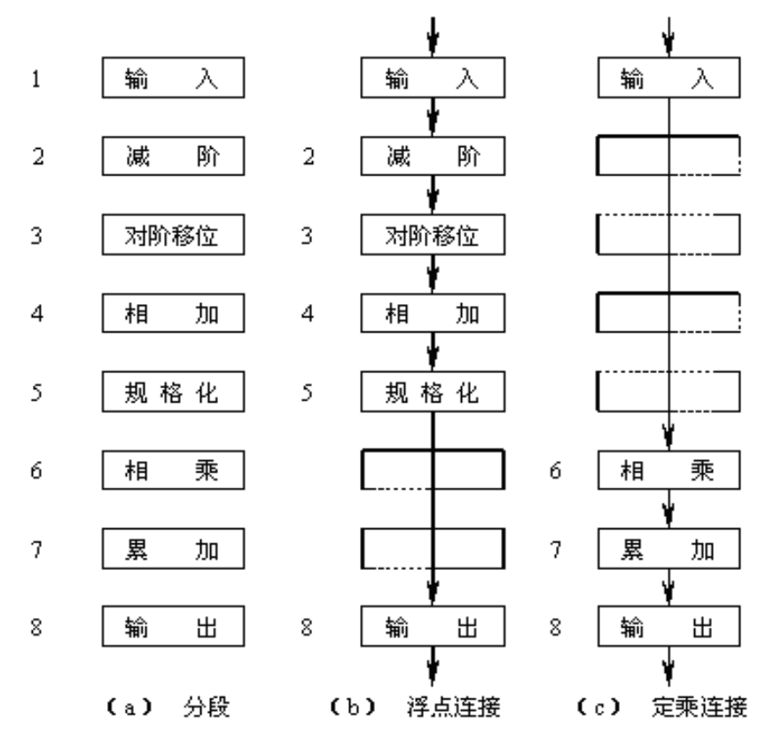

#### b. 静态流水线和动态流水线

*<u>按同一时间内**流水段的连接方式**划分</u>*

- **静态流水线**，是指在同一时间内，流水线的各段只能按同一种功能的连接方式工作。
  - 例如： TI ASC的流水线
  - 适合于处理一串相同的运算操作
- **动态流水线**，是指在同一时间内，当某些段正在实现某种运算时，另一些段却在实现另一种运算。
  - 会使流水线的控制变得很复杂

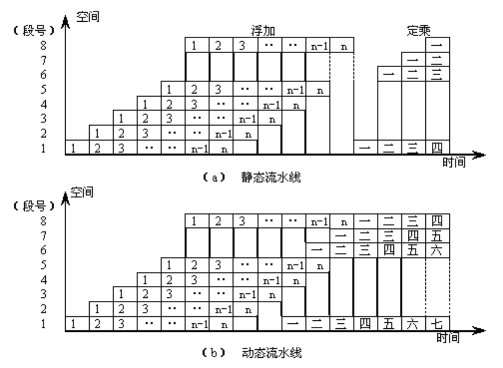

#### c. 部件级、处理机级及处理机间流水线

*<u>按**流水的级别**划分</u>*

- **部件级流水线**，又叫**运算操作流水线**，是把处理机的算术逻辑部件分段，使得各种数据类型的操作能够进行流水。
- **处理机级流水线**，又叫**指令流水线**，是把解释指令的过程按照流水方式处理。
- **处理机间流水线**，又叫**宏流水线**，是由两个以上的处理机串行地对同一数据流进行处理，每个处理机完成一项任务。

#### d. 线性流水线和非线性流水线  

*<u>按照**是否有反馈回路**来进行分类</u>*

- **线性流水线**是指流水线的各段<u>串行连接</u>，没有反馈回路。
- **非线性流水线**是指流水线中除有<u>串行连接</u>的通路外，还有<u>反馈回路</u>。
  - 存在流水线调度问题：
    - 确定什么时候向流水线引进新的输入，从而使新输入的数据和先前操作的反馈数据在流水线中不产生冲突，此即所谓流水线调度问题。
  - 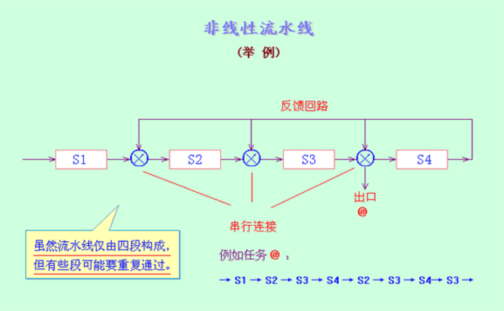

#### e. 顺序流动流水线和乱序流动流水线  

*<u>按照**输出端任务流出顺序**与**输入端任务流入顺序**是否相同划分</u>* 

- **顺序流动流水线**是指流水线输出端任务流出的顺序与输入端任务流入的顺序**相同**。
- **乱序流动流水线**也可称为**无序流水线**、**错序流水线**，是指流水线输出端任务流出的顺序与输入端任务流入的顺序**不一定相同**。  

## 6.2 流水线的性能分析

### 1. 吞吐率

<u>**吞吐率**是指单位时间内流水线所**完成的任务数**或**输出结果的数量**。</u>  

#### a. 最大吞吐率

***最大吞吐率 TP~max~*** 是指流水线在<u>达到稳定状态后</u>所得到的吞吐率。

- 假设流水线各段的时间相等，均为 $Δt_0$，则：

  &emsp;&emsp;$TP_{max} = 1/Δt_0$

- 假设流水线各段的时间不等，第 i 段时间为 $Δt_i$，则：

  &emsp;&emsp;$TP_{max} = 1/max\{Δt_i\}$

> 最大吞吐率取决于流水线中最慢一段所需的时间，该段成为流水线的瓶颈。
> 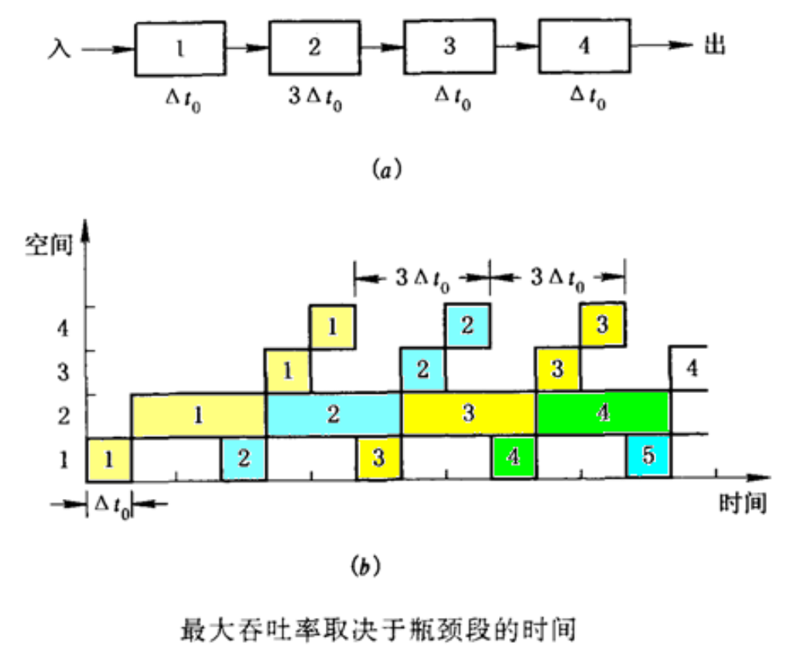
>
> <u>消除瓶颈的方法</u>：
>
> - 细分瓶颈段
>   
> - 重复设置瓶颈段
>   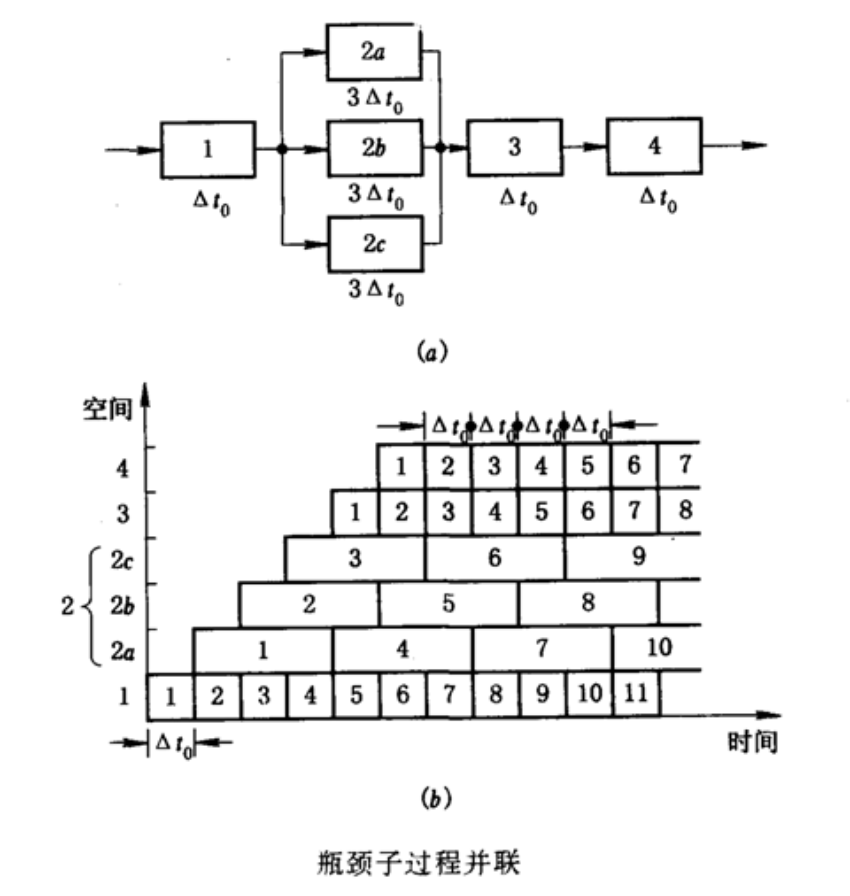

#### b. 实际吞吐率

设流水线由m段组成，完成n个任务的吞吐率称为 ***实际吞吐率*** ，记作 ***TP***。

- 若各段时间相等（假设均为$Δt_0$）

  - **完成时间**：

    &emsp;&emsp;$T_{流水} = m△t_0+ (n-1)△t_0$

  - **实际吞吐率**：

    &emsp;&emsp;$TP = \dfrac{n}{T_{流水}} = \dfrac{n}{mΔ_0+(n-1)Δt_0} = \dfrac{TP_{max}}{1+\frac{m-1}{n}}$

    > $TP ＜  TP_{max}$
    >
    > 当 $n >>   m$ 时，$TP ≈ TP_{max}$

    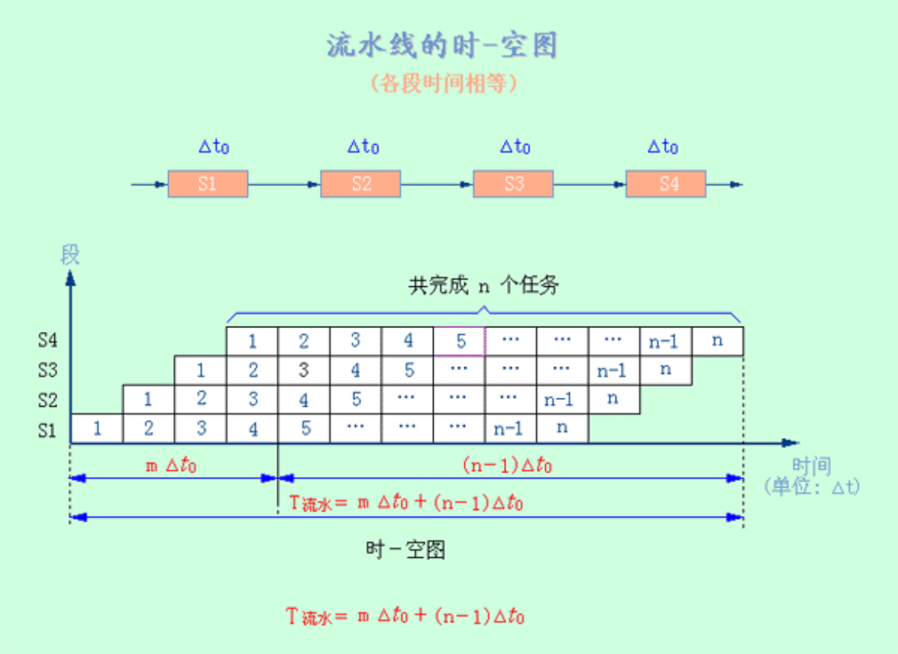

- 若各段时间不等（假设第 i 段为 $Δt_i$）

  - **完成时间**：

    &emsp;&emsp;$T = \sum_{i=1}^m Δt_i + (n-1)Δt_j$

    > $Δt_j = max{Δt_i}$

  - **实际吞吐率**：

    &emsp;&emsp;$TP = \dfrac{n}{\sum_{i=1}^{m}Δt_i + (n-1)Δt_j}$

    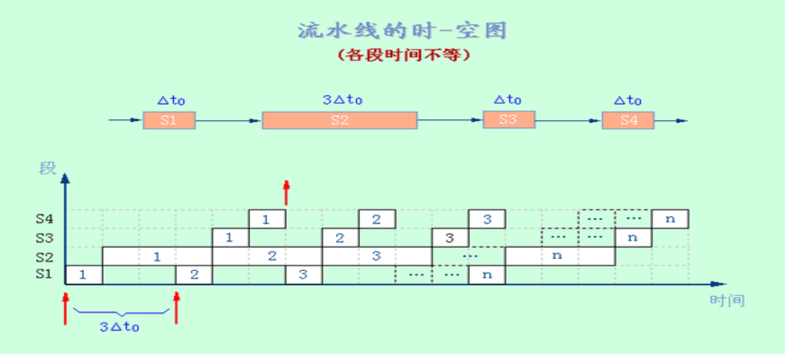

### 2. 加速比

<u>**加速比**是指**流水线速度**与**等功能的非流水线速度**之比。</u>  

&emsp;&emsp; $加速比 S = T_{非流水} / T_{流水}$

- 若各段时间相等（假设均为$Δt_0$），流水线为m段

  &emsp; $T_{非流水} = nmΔt_0$，$T_{流水} = mΔt_0 + (n-1)Δt_0$

  &emsp;&emsp; $S = \dfrac{mn}{m+n-1} = \dfrac{m}{1+\frac{m-1}{n}}$

  > 当 $n >> m$ 时， $S ≈ m$  

- 若各段时间不相等，流水线为m段

  &emsp; $T_{非流水} = n\sum_{i=1}^mΔt_i$，$T_{流水} = \sum_{i=1}^mΔt_i + (n-1)Δt_{max}$

  &emsp;&emsp; $S = \dfrac{n\sum_{i=1}^mΔt_i}{\sum_{i=1}^mΔt_i+(n-1)Δt_{max}}$

### 3. 效率

<u>**效率**指流水线的**设备利用率**。</u>  

> 由于流水线有 通过时间和排空时间 ，所以流水线的各段并非一直满负荷工作， E<1  

- 若各段时间相等，则各段效率也相等，即 $e1 = e2 = e3 =… = n△t_0/T_{流水}$

- 整个流水线效率：

  &emsp; $E = \dfrac{nΔt_0}{T_{流水}} = \dfrac{n}{m+n-1} = \dfrac{1}{1+\frac{m--1}{n}}$

  > 当 $n >> m$ 时， $E ≈ m$  

  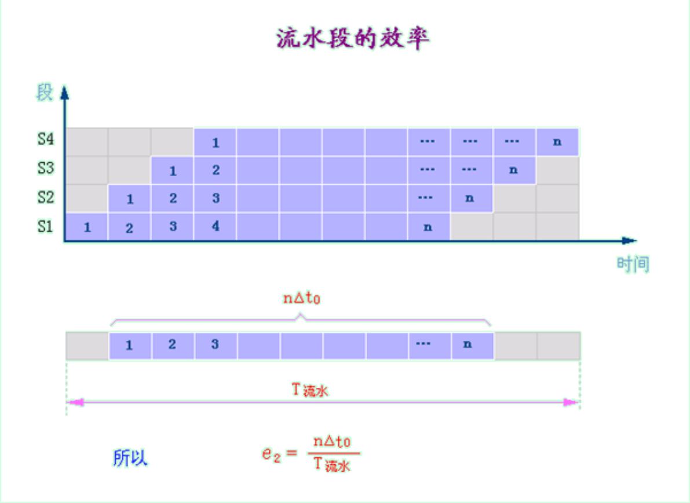

- 从时-空图上看，效率就是n个任务所占的时空区与m个段总的时空区之比

- 根据这个定义，可以计算流水线各段时间不等时的流水线效率：

  &emsp;&emsp; $E = \frac{n个任务占用的时空区}{m个段总的时空区}$

### 吞吐率、加速比和效率的关系

- $E = n△t_0/T_{流水}=mn△t_0/(T_{流水}m)=S/m  $

  <u>效率是实际加速比S与最大加速比m之比。</u>  

- $E = n△t_0/T_{流水}= (n/T_{流水}) · △t_0=TP△t_0  $

  <u>当Δt~0~不变时，流水线的效率与吞吐率呈正比。为提高效率而采取的措施，也有助于提高吞吐率。</u>  

- $TP = S/(m △t_0 )  $

  <u>当m和Δt~0~不变时，流水线的加速比与吞吐率呈正比。为提高加速比而采取的措施，也有助于提高吞吐率。</u>  

### 总结

- 流水线并不能减少（而且一般是增加）单条指令的执行时间，但能够提高吞吐率
- 增加流水线的深度可以提高流水线性能
- 流水线深度受限于流水线的延迟和额外开销
- 需要用高速锁存器作为流水线寄存器
- 指令之间存在的相关，限制了流水线的性能

## 6.3 流水线中的相关

### 1. 相关的定义

**流水线中的相关**是指相邻或相近的两条指令因存在<u>某种关联</u>，后一条指令不能在原先指定的时钟周期开始执行。  

- 消除相关的基本方法——**暂停**  

  暂停流水线中<u>某条指令及其后面所有指令</u>的执行，该指令之前的所有指令继续执行。  

### 2. 相关的类型

#### a. 结构相关

<u>当指令在重叠执行过程中，硬件资源满足不了指令重叠执行的要求，发生资源冲突时将产生***“结构相关”***。</u>

> 在流水线机器中，为了使各种指令组合能顺利地重叠执行，需要把**功能部件流水化**， 并把**资源重复设置**。

##### 产生原因

- 功能部件不是全流水
- 重复设置的资源数量不足

> 实例：当数据和指令存在同一存储器中时，访存指令会引起存储器访问冲突 。
>
> 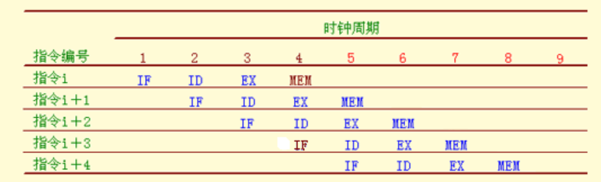
>
> 解决方法：
>
> - 插入暂停周期 （时空图）
> - 设置相互独立的指令存储器和数据存储器或设置相互独立的指令Cache和数据Cache
>
> 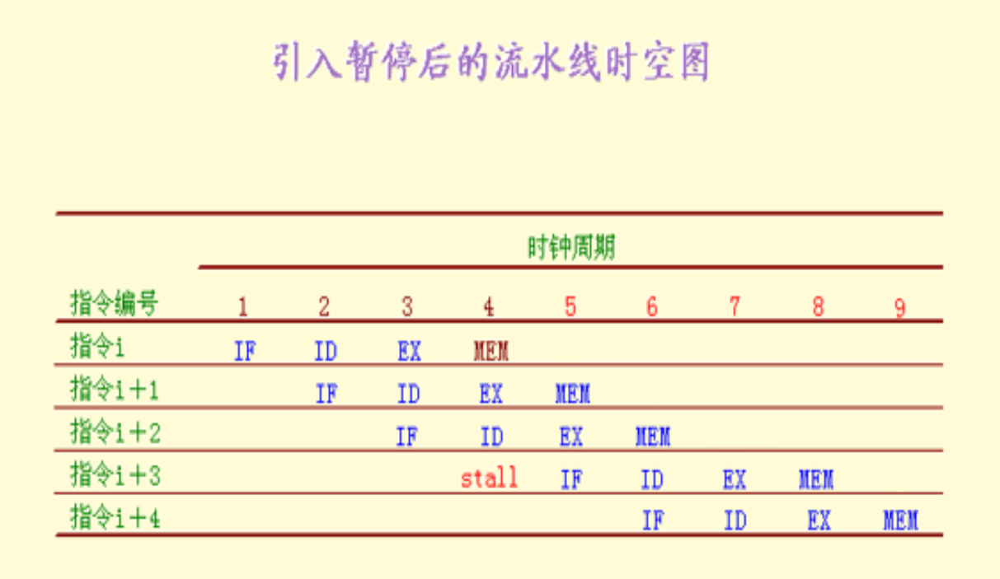
> ==产生”流水线气泡“==

##### 避免结构相关的方法

- 所有功能单元完全流水化。
- 设置足够多的硬件资源。但是，硬件代价很大！  

##### 有些设计方案允许结构相关存在

- 降低成本  
- 减少功能单元的延迟

#### b. 数据相关

<u>因一条指令需要用到前面指令的结果，而无法与产生结果的指令重叠执行时，就发生了***“数据相关”***。</u>

##### 产生原因

当指令在流水线中重叠执行时，流水线有可能改变指令读/写操作数的顺序，使之不同于它们在非流水实现时的顺序，这将导致数据相关。  

##### 数据相关的分类

<u>两条指令 i 和 j</u>，都会访问同一寄存器R，假设 i 先进入流水线，则它们对R有四种不同的访问顺序：

1. 写后读 —— *i 写 j 读*

   - 如果 j 在 i 完成写之前从R中读出数据，将得到错误的结果！

   > 最常见的数据相关，严重制约了CPU的性能，是程序最重要的特征之一！

2. 写后写 —— *i 写 j 写*

   - 如果 j 在 i 之前完成写操作， R中将保存错误的结果！

   > 当流水线中有多个段可以写回，而且当流水线暂停某条指令的执行时，其后的指令可以继续前进时，可能引起这种类型的相关。

3. 读后写 —— *i 读 j 写*

   - 如果 j 先将数据写入R， i 将读出错误的结果！

   > 这种相关很少发生。当有些指令在流水段后半部分读源操作数，另一些指令在流水线前半部分写结果，可能引起这种类型的相关。

4. 读后读 —— *i 读 j 读*

   - 不引起数据相关！

##### 解决方法：向流水线插入暂停周期

- 采用**直通技术**
  控制逻辑将前面指令的结果从其产生的地方直接连通到当前指令所处的位置。  
- 增加**专用硬件**
  增加流水线互锁硬件。互锁硬件先要检测流水线中指令的数据相关性，当互锁硬件发现数据相关时，使流水线工作停顿下来，直到相关消失为止。  
- 利用**编译器**
  流水线调度/指令调度：编译器可以对指令重新排序或插入空操作指令，使得加载任何冲突数据的操作被延迟，但对程序逻辑或输出不受影响。  

#### c. 控制相关

<u>当流水线遇到分支指令和其它会改变PC值的指令时就发生***“控制相关”***。</u>

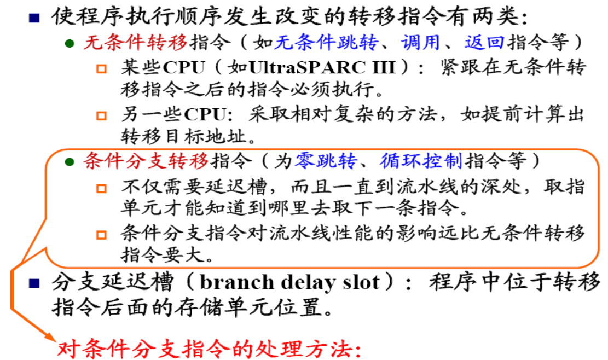

##### 条件分支指令的处理方法

###### 冻结流水线

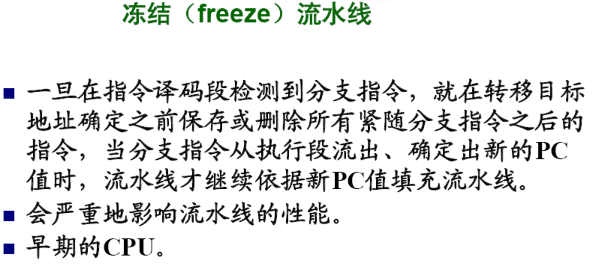

###### 预取分支目标

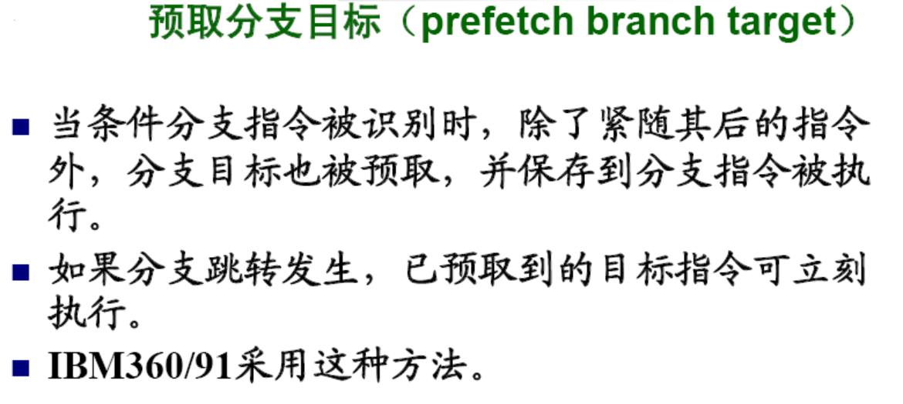

###### 多流

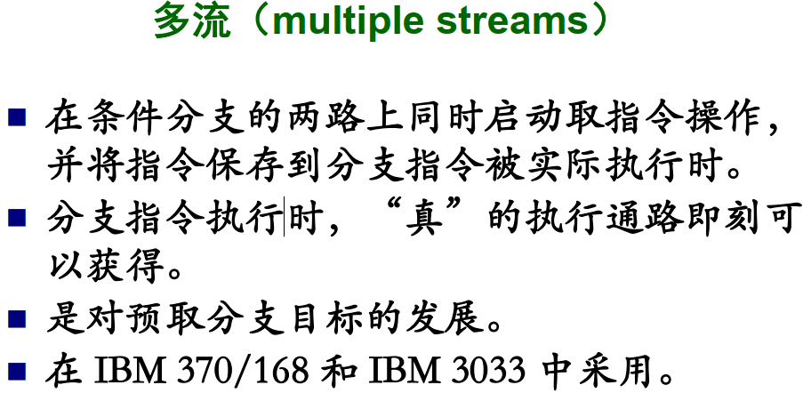

###### 循环缓冲器

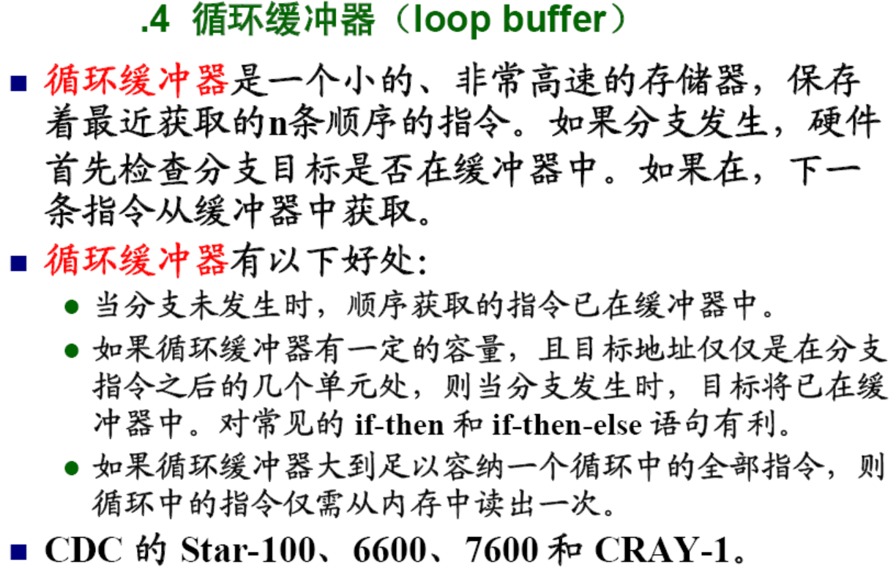

###### 分支预测

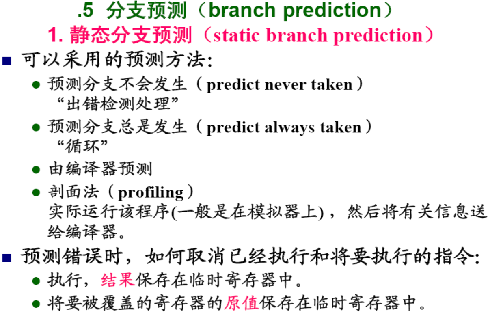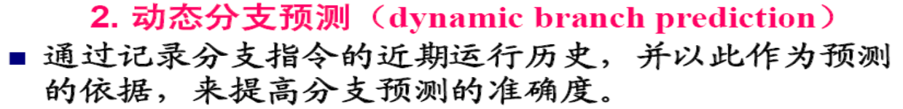

###### 延迟分支

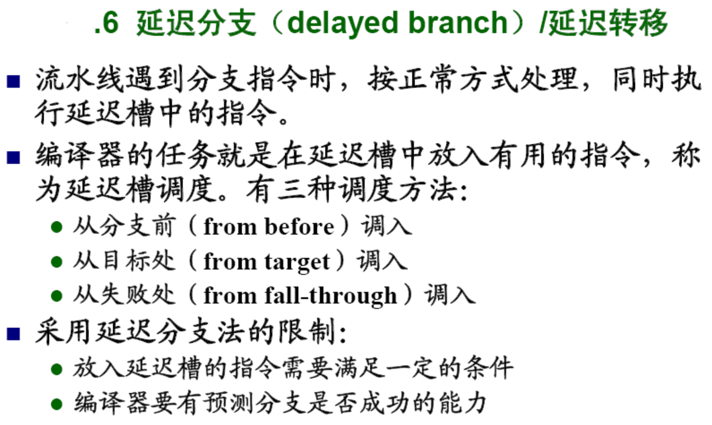

#### 小结

- 转移指令引起的**控制相关**，对流水计算机吞吐率、效率的影响比数据相关严重的多，所以被称为**全局性相关**。
- 而**数据相关**一般被称为**局部性相关**。

## 6.4 指令级高度并行的超级处理器  

### 1. 概念

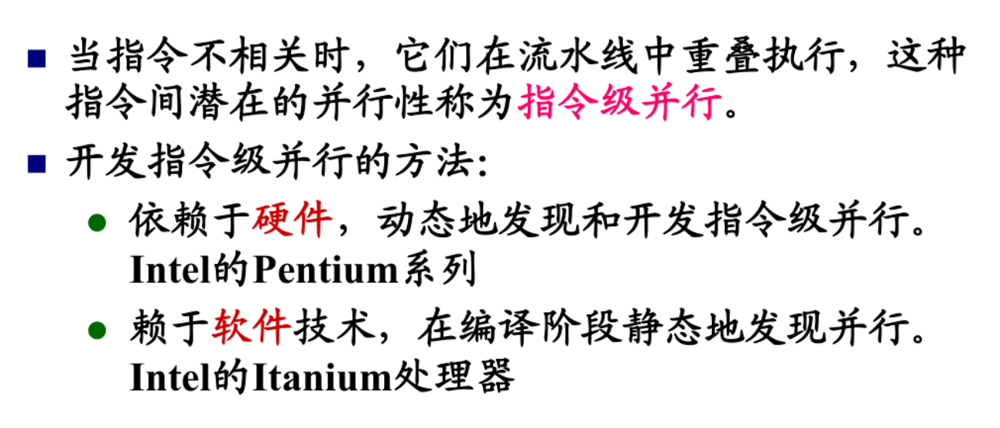

#### 指令流水线的限制

- 增加<u>指令发射的**宽度**</u>和<u>指令流水线的**深度**</u>，要求复杂硬件电路和高频率时钟的支持。这导致<u>CPU功耗的上升</u>。
- 目前已逐渐形成的共识是， **功耗**是限制当代处理器发展的首要因素。

#### 突破限制的途径

- 流水线深度
- 从更深层次地解决流水线中可能存在的各种相关性
- 多核CPU，多指令流水线
- 现代处理器中，比较成熟的提高指令级并行的技术：
  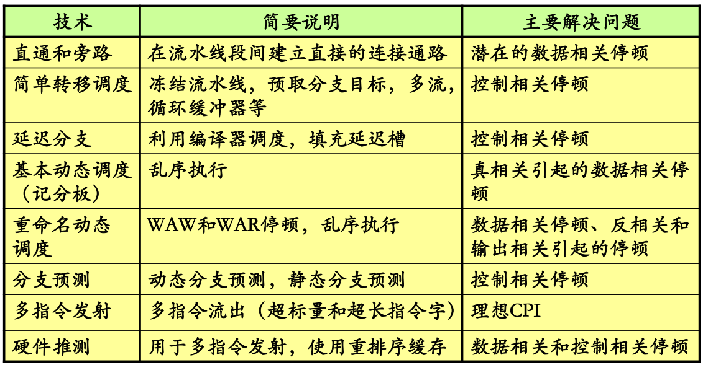
  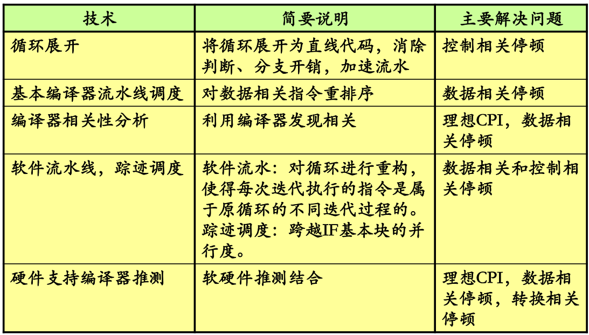

### 2. 提高指令级并行的技术

#### a. 乱序执行

- **按序发射**和执行指令：如果流水线中两条相近的指令之间存在 ***相关***，则必然引起流水线 ***停顿***。

- **乱序执行**：跳过相关的指令去执行后面<u>不相关的指令</u>，使指令的执行顺序不再按原程序的顺序进行。要求指令调度算法必须保证程序的运行结果和按照顺序执行时的结果相同。

#### b. 寄存器重命名

- 现代CPU通常有数十个隐密寄存器用来对寄存器重命名
- 这种技术可以有效地减少WAR和WAW相关

#### 乱序执行和寄存器重命名

- 使用乱序执行和寄存器重命名技术，可以把运算速度提高到几乎为原来的**两倍**。
- 乱序完成会使中断不精确。→某些计算机需要指令按序完成

##### IBM360/91的浮点功能单元： Tomasulo算法

- 采用**源操作数缓存**技术、 **寄存器重命名**技术  
- 寄存器重命名是通过**保留站**实现的
- 基本方法：
  - 设立**多个保留站**，每个保留站保存一条已经被发射并等待执行的指令的操作数（若已在寄存器中）和运算符。
  - 当指令所需要的操作数可用时，保留站马上<u>取操作数并将其缓存</u>，避免之后从寄存器中读操作数；否则保存将要提供该操作数的保留站的名字。
  - 即将执行的指令指定保留站为其提供输入，指令的执行结果<u>直接送到等待数据的其它保留站中去</u>。
  - 当对寄存器的后续写操作在执行过程中发生重叠时，<u>只允许最后一个实际更新寄存器</u>。
  - 在指令被发射后，它所<u>需要的操作数所对应的寄存器名将被重命名为保留站的名字</u>，即寄存器重命名。

#### c. 推测执行

- **指令提升**：把某些代码提前到转移之前执行。
- **推测执行**：在不知道是否需要执行之前就执行代码的技术。
  - 需要编译器和硬件的支持 
  - 需要对体系结构进行扩展
- **推测**的分类：
  - **硬件推测**：对基于动态调度的分支预测的扩展
    - 在分支预测的结果是正确的情况下，硬件推测将按照预测的结果取指令、 发射指令并执行指令；
    - 动态调度仅仅获取和发射指令。  
  - **软件推测**：编译器  

- 推测技术的一个**关键思想**：允许指令<u>乱序执行</u>，但是要求指令<u>必须按序提交</u>，并且在指令<u>提交之前阻止所有不可恢复的动作</u>(比如更新状态或产生异常)。
  - 重排序缓冲器（ROB）
  - 在指令运算完成到指令提交的这段时间里， ROB为指令保存结果。
  - 在推测技术中，只有在<u>指令提交之后寄存器文件才会被更新</u>，在指令执行完成到指令提交的这段时间内，由ROB来提供操作数。

- 指令按序提交ROB的优点：
  - 能够在支持推测执行的同时，<u>保证精确的中断或异常</u>。
  - <u>指令提交之前不会实际更新寄存器和存储器</u>，当发现分支预测错误时，处理器可以很容易撤销推测执行的动作。

### 3. 多指令流出（发射）技术

- 一个时钟周期内流出多条指令
  - CPI : Cycles Per Instruction
    **CPI < 1**
  - IPC : Instruction Per Cycles
    **IPC > 1**
- 多指令流出处理器有3种基本结构：
  - **超标量**
    每个时钟周期流出的指令数不定，它既可以通过编译器静态调度，也可以通过动态调度。
  - **超流水**
    将每个功能部件进一步流水化，特别是取指令或指令流出被分解为多个段，使得一个功能部件在一拍中可以处理多条指令。  
  - **超长指令字VLIW**
    每个时钟周期流出的指令数是固定的，它们构成一条长指令，或说是一个混合指令包，这种处理器目前只能通过编译静态调度。

### 4. 指令级高度并行的超级处理器

- 超标量处理机
- 超长指令字处理机
- 超流水线处理机
- 超标量超流水线处理机

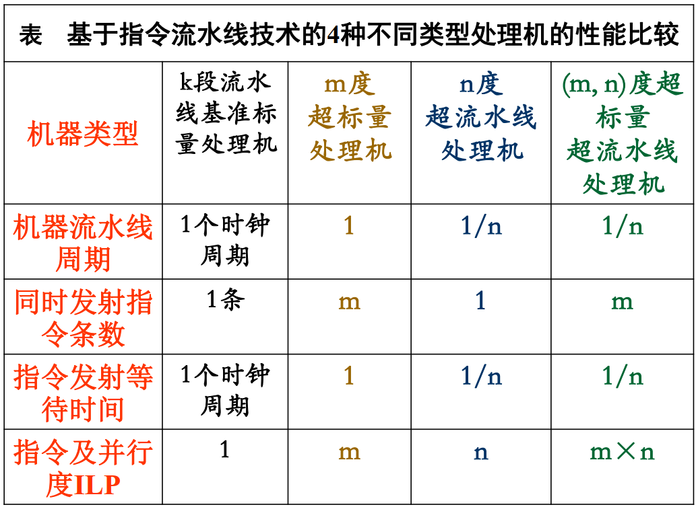

#### 指令并行处理机的相对性能

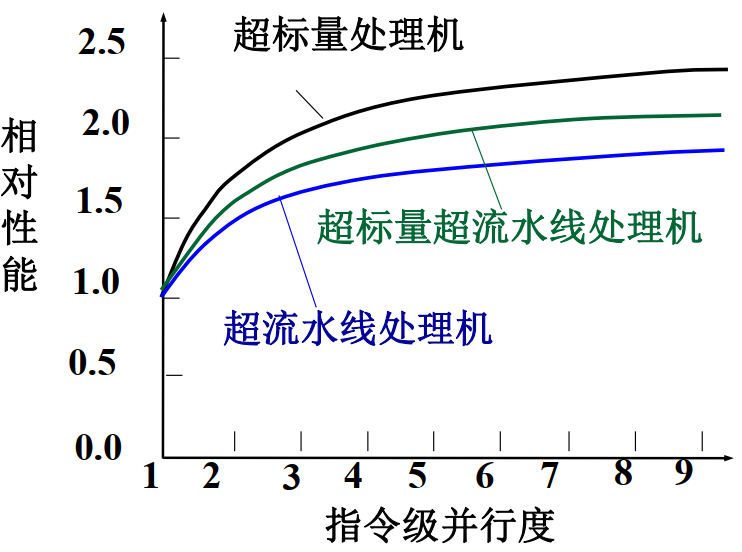

#### 结论

1. 超标量处理机的相对性能最高，其次是超标量超流水线处理机，超流水线处理机的相对性能最低。 
   主要有三方面原因：  
   - 超标量处理机在每个时钟周期的开始就<u>同时发射多条指令</u>，而超流水线处理机则要把<u>一个时钟周期平均分成多个流水线周期</u>，每个流水线周期发射一条指令，指令之间的启动延时比超标量处理机大；
   - 条件转移造成的损失，超流水线处理机比超标量处理机大；
   - 在指令执行过程中的每一个功能段，超标量处理机都设置有<u>多个相同的操作部件</u>，而超流水线处理机只是把<u>同一条指令执行部件分解为多个流水级</u>。因此，超标量处理机指令执行部件的冲突比超流水线处理机小。

2. 当横坐标表示的设计指令级并行度较小时，处理机实际指令并行度提高较快。但当设计指令级并行度进一步增加时，处理机实际指令并行度提高变缓，且越来越慢。因此<u>实际设计超标量、超流水线或超标量超流水线处理机的指令并行度应适当</u>，否则花费大量硬件代价，而可能得不到指令并行度的期望值。  

3. <u>一个特定程序由于受到本身的数据相关、控制相关等限制，其指令并行度的最大值是确定的。</u> 这个最大值由程序自身的语义决定，与这个程序运行于哪一种处理机无关。因此图中的三条曲线对于某一特定程序，会收拢于同一个点上。当然对不同程序，其收拢点位置是不同的。  
4. <u>并非流水线级数越多会越好，也并非处理机工作频率越高越好。</u>例如Pentium4的深度流水线和极高的主频并没有带来所期望的高性能和高效率，迫使Intel不得不放弃从这一途径来提高处理器性能，转而开发多核处理器和超线程技术，开创了处理器的多核时代和深化了线程级并行技术，使处理机性能迈上一个新的台阶。  
