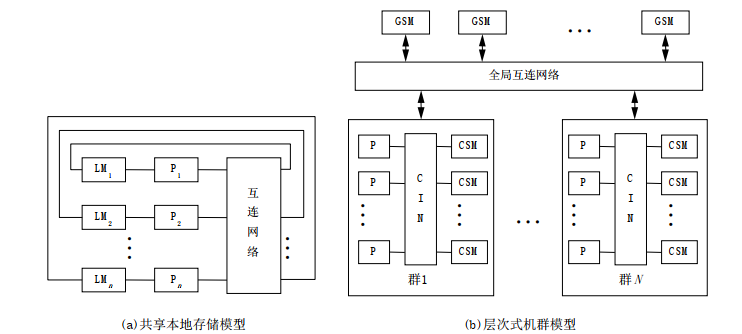

# 第九章 多机系统

## 9.1 并行性发展以及计算机系统的分类

### 1 并行性含义

- 并行性是指问题中具有**可同时进行运算或操作**的特性。

  开发并行性的目的是为了能予以并行处理，以提高解题效率。

- 并行性包括**同时性**和**并发性**。

  两个或多个事件在同一时刻发生属于**同时性**。在同一时间间隔内发生则属于**并发性**。

### 2 开发并行性的途径

- **时间重叠** 

  是在并行性中引入时间的因素。它是让多个处理过程在时间上错开，轮流重叠地使用同一套硬件设备的各个部分，使之加快硬件使用的周转来赢得速度。典型的例子是 *流水*。

- **资源重复**

  是在并行性中引入空间的因素。它是靠重复设置硬件资源来提高可靠性或性能的。典型的例子是双工系统、相联处理机和阵列处理机等。

- **时间重叠与资源重复**

- **资源共享**

  是用软件方法让多个用户共用同一套资源，通过提高系统资源的利用率来提高系统的性能和效率。典型的例子是多道程序分时系统、计算机网络和分布处理系统等。

### 3 计算机系统的分类

计算机系统按指令流和数据流的并行度分类成：

- 单指令流单数据流 (SISD, Single Instruction Stream Single Data stream)

- 单指令流多数据流 (SIMD, Single Instruction Stream Multiple Data stream)

- 多指令流单数据流 (MISD, Multiple Instruction Stream Single Data stream)

- 多指令流多数据流 (MIMD, Multiple Instruction Stream Multiple Data stream)

此即**弗林（Flynn）分类法**的分类。

#### 4 并行结构的分类

## 9.3 当代典型的并行系统

### 1 共享存储多处理器系统

#### 对称多处理器 SMP (Symmetric MultiProcessor)

- 定义：在一个系统中，每个CPU都能平等地访问所有地内存模块和输入/输出设备，而且在操作系统看来这些CPU是可以互换的。
- 分类：
  - UMA 类型的对称多处理器
  - NUMA 类型的对称多处理器

> 采用商用微处理器，通常有片上和片外Cache，基于总线连接。在操作系统看来CPU可以互换。

##### UMA (Uniform Memory Access) 一致性存储器访问模型

基本特点：

- 物理存储器被所有处理器均匀共享；
- 所有处理器访问任何存储字时间相同；
- 每台处理器可带私有高速缓存；
- 外围设备也可以一定形式共享。

##### NUMA (Nonuniform Memory Access) 非一致存储访问模型

基本特点：

- 被共享的存储器在物理上是分布在所有的处理器中的，其所有本地存储器的集合就组成了全局地址空间；
- 处理器访问存储器的时间是不一样的；访问本地存储器LM或群内共享存储器CSM较快， 而访问外地的存储器或全局共享存储器GSM较慢(此即非均匀存储访问名称的由来)；
- 每台处理器照例可带私有高速缓存， 外设也可以某种形式共享。

##### 对称多处理器系统 SMP 特点

- 系统是由两个以上的多个相同的处理机构成；
- 多个处理机通过总线或其他互连方式连接在一起；
- 所有的处理机通过相同的通道或不同的通道共享IO设备；
- 每一处理机都能完成相同的功能，这或许是对称多处理机中对称的由来；
- 整个对称多处理器系统是在一个集中的操作系统统一管理下工作。操作系统能够为每一处理机安排进程或线程，对各处理机的工作进行统一地调度与控制。

##### 对称多处理器系统 SMP 优缺点

- **优点**
  - 对称性
  - 单地址空间，易编程性，动态负载平衡，无需显示数据分配
  - 高速缓存及其一致性，数据局部性，硬件维持一致性
  - 低通信延迟， Load/Store 完成
- **缺点**
  - 欠可靠，总线、存储器或OS失效会造成系统崩溃
  - 通信延迟（相对于CPU），竞争加剧
  - 慢速增加的带宽（MB double/3年， IOB更慢）  
  - 不可扩放性（总线是不可扩放的，限制了处理器数量一般不能超过10，为了增大系统的规模，可改用交叉开关连接或改用CC-NUMA或机群结构；

### 2 分布式存储计算机系统

#### 大规模并行机 MPP (Massively Parallel Processors)

- MPP 是由大量节点构成
- MPP 的结点可由一个或多个带有cache的处理机构成。具体构成形式有以下3种：
  - 每个节点只包含一个处理器
  - 每一个节点包含一台SMP
  - 每一个节点由CC-NUMA系统构成
- 构成MPP的节点可以是同构也可以是异构的
- MPP各节点的存储器是各自独立的，每个节点只能直接存取自己节点的本地存储器，不能直接访问非本地节点的存储器。若需要访问非本地节点的存储器，则需要使用消息传递的方式来达到目的。这使得编程困难且增加通信开销。
- 每个节点都有自己的操作系统，各节点可以有不同的操作系统。用户可将任务提交给任务管理系统，由该系统负责任务的调度，以便系统负载平衡。

### 3 机群系统

#### 工作站机群 COW (Cluster of Workstations)

- 分布式存储， MIMD，工作站 + 商用互连网络，<u>每个节点是一个完整的计算机</u>，有自己的磁盘和操作系统，而MPP中只有微内核。

- 优点：
  - 投资风险小
  - 系统结构灵活
  - 性能 / 价格比高
  - 能充分利用分散的计算资源
  - 可扩放性好
  - 编成方便，软件继承性好
- 问题
  - 通信性能
  - 并行编程环境

### Cluster 系统 与 MPP 系统的不同

1. - 集群的每个节点都是一个**完整的计算机系统**，包括CPU、内存、硬盘；

   - MMP 每个节点内不一定有硬盘。

2. - 集群的节点间通常使用低成本的**商品化网络**相联，如以太网、ATM等；
   - MPP 使用专门**定制的网络**，这个被认为是集群与MPP最主要的区别。

3. - 集群节点与系统级网络的网络接口是连接到节点内的**I/O总线**上的，属于松耦合；
   - MPP的网络接口是连接到节点内的**存储总线上**的，属于紧耦合。

4. - 集群的每个节点上驻留有**完整的操作系统**；
   - MPP 的节点内通常只有**操作系统的微内核**。