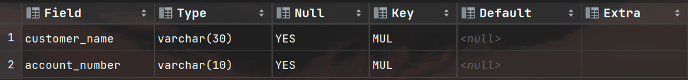
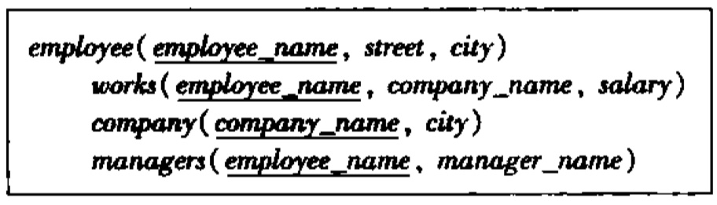

# 《数据库系统》上机实验报告

## I. 实验名称

第1次实验：Banking数据库与Employee数据库

## II. 实验目的

本次实验通过创建Banking和Employee数据库并进行相关操作，学习MySQL数据库与SQL语言，理解数据库的创建、表的创建、数据更新，以及多种查询方式等，掌握关于DDL、DML、DQL的基本操作。

## III. 实验内容

1. 安装并使用MySQL数据库
2. 教材Banking数据库的建库、数据更新及查询
3. 课后习题中employee数据库建库、数据更新及查询

## IV. 实验思路、结构与结果

### （一）安装并使用MySQL数据库

1. 从官网下载MySQL数据库，下载社区版本
   - 官网：`http://www.mysql.com/`

2. 安装MySQL数据库，并设置MySQL中root用户的密码：1234

3. 设置环境变量

4. 启动MySQL数据库：`net start mysql`

5. 客户端连接

   - 方式一：使用MySQL提供的客户端命令行工具

     > MySQL Command Line Client

   - 方式二：使用系统终端执行命令

     > 注意：此方法需要先配置PATH环境变量

6. 使用图形化界面工具 DataGrip，建立与MySQL 8.0的连接

### （二）Banking数据库的建库、数据更新及查询

#### 1. **建立Banking数据库**

数据库命名为`BANK817`，后3位为本人学号后三位817

```sql
CREATE DATABASE BANK817; -- 建立数据库
SHOW DATABASES; -- 查询已有数据库
USE BANK817; -- 使用数据库BANK817
SHOW TABLES; -- 查看数据库BANK817中的表（没创建表，不会有表）
```

运行结果：
- 查询已有数据库

- 查看数据库BANK817中的表


#### 2. **在Banking数据库中创建表**

参照banking数据库纲要图创建表`BRANCH817`, `CUSTOMER817`, `ACCOUNT817`, `LOAN817`, `DEPOSITER817`, `BORROWER817`


- **数据库表中的主键与外键：**

   `BRANCH817`主键为`branch_name`；
   `CUSTOMER817`主键为`customer_name`；
   `ACCOUNT817`主键为`account_number`，外键为`branch_name`；
   `LOAN817`主键为`loan_number`，外键为`branch_name`；
   `DEPOSITER817`外键为`customer_number`和`account_number`；
   `BORROWER817`外键为`customer_number`和`loan_number`。

   > 注意：由于存在外键约束，需要注意建表顺序，以及插入数据的顺序。

- **建表SQL**：

   ```sql
   CREATE TABLE BRANCH817(
       branch_name varchar(30) NOT NULL,
       branch_city varchar(30),
       assets numeric(12, 2),
       PRIMARY KEY (branch_name),
       CONSTRAINT chk_assets CHECK ( assets>=0 )
   );
   CREATE TABLE CUSTOMER817(
       customer_name varchar(30) NOT NULL,
       customer_street varchar(30),
       customer_city varchar(30),
       PRIMARY KEY (customer_name)
   );
   CREATE TABLE ACCOUNT817(
       account_number varchar(10),
       branch_name varchar(30) NOT NULL,
       balance numeric(12, 2),
       PRIMARY KEY (account_number),
       FOREIGN KEY (branch_name) REFERENCES BRANCH817(branch_name),
       CONSTRAINT chk_balance CHECK ( balance>=0 )
   );
   CREATE TABLE LOAN817(
       loan_number varchar(10),
       branch_name varchar(30) NOT NULL,
       amount numeric(12, 2),
       PRIMARY KEY (loan_number),
       FOREIGN KEY (branch_name) REFERENCES BRANCH817(branch_name),
       CONSTRAINT chk_amount CHECK ( amount>=0 )
   );
   CREATE TABLE DEPOSITOR817(
       customer_name varchar(30),
       account_number varchar(10),
       FOREIGN KEY (customer_name) REFERENCES CUSTOMER817(customer_name),
       FOREIGN KEY (account_number) REFERENCES ACCOUNT817(account_number)
   );
   CREATE TABLE BORROWER817(
       customer_name varchar(30) NOT NULL,
       loan_number varchar(10),
       FOREIGN KEY (customer_name) REFERENCES CUSTOMER817(customer_name),
       FOREIGN KEY (loan_number) REFERENCES LOAN817(loan_number)
   );
   ```

   `CREATE TABLE 表名 ();`  是**建表语句**，括号中写入该表中的属性，以及一些特殊的约束；
   `PRIMARY KEY `  表示该属性构成关系的**主键**；
   `FOREIGN KEY`  表示该属性的任意一个取值对应到另外一个关系中的主码属性上的取值，即**外键约束**，同时需要使用 `REFERENCES` 声明对应的另一个关系（表）以及该关系的主键属性；
   `CONSTRAINT`  即**约束**，是用来定义数据完整性规则的一种机制，它可以确保数据表中的数据符合特定的规则或条件；
   `CHECK`  是一种常见的**约束类型**之一，用于定义一个条件，该条件必须在插入或更新数据时得到满足，否则将不允许进行相应的操作；
   `NOT NULL`  一个属性上的NOT NULL约束表型在该属性上**不允许空值**。

- **查看建表后数据库中的表以及详细查看表的属性：**

   ``` sql
   SHOW TABLES; -- 查看当前数据库所有表
   DESC CUSTOMER817; -- 查看表CUSTOMER817的属性
   DESC ACCOUNT817; -- 查看表ACCOUNT817的属性
   DESC BORROWER817; -- 查看BORROWER817的属性
   DESC LOAN817; -- 查看LOAN817的属性
   DESC BRANCH817; -- 查看BRANCH817的属性
   DESC DEPOSITOR817; -- 查看DEPOSITOR817的属性
   ```

   运行结果：
   - 查看当前数据库所有表
   	
   - CUSTOMER817
   	
   - ACCOUNT817
   	
   - BORROWER817
   	
   - LOAN817
   	
   - BRANCH817
   	
   - DEPOSITOR817
   	

#### 3. 向Banking数据库中所有的表插入数据

由于存在外键约束，**需要考虑插入顺序**。因为向包含外键的表插入数据时，外键属性的数据必须能在对应的表的主键属性的数据中找到对应的数据，即不可插入主键属性的元组中没有的数据。

- **插入数据SQL：**

  ```sql
  INSERT INTO BRANCH817 VALUES ('Brighton','Brooklyn',7100000), ('Downtown','Brooklyn',9000000), ('Mianus','Horseneck',400000), ('North Town','Rye',3700000), ('Perryridge','Horseneck',1700000), ('Pownal','Bennington',300000), ('Redwood','Palo Alto',2100000), ('Round Hill','Horseneck',8000000);
  INSERT INTO CUSTOMER817 VALUES ('Adams','Spring','Pittsfield'), ('Brooks','Senator','Brooklyn'), ('Curry','North','Rye'), ('Glenn','Sand Hill','Woodside'), ('Green','Walnut','Stamford'), ('Hayes','Main','Harrison'), ('Johnson','Alma','Palo Alto'), ('Jones','Main','Harrison'), ('Lindsay','Park','Pittsfield'), ('Smith','North','Rye'), ('Turner','Putnam','Stamford'), ('Williams','Nassau','Princeton');
  INSERT INTO ACCOUNT817 VALUES ('A-101','Downtown',500), ('A-102','Perryridge',400), ('A-201','Brighton',900), ('A-215','Mianus',700), ('A-217','Brighton',750), ('A-222','Redwood',700), ('A-305','Round Hill', 350);
  INSERT INTO LOAN817 VALUES ('L-11','Round Hill',900), ('L-14','Downtown',1500), ('L-15','Perryridge',1500), ('L-16','Perryridge',1300), ('L-17','Downtown',1000), ('L-23','Redwood',2000), ('L-93', 'Mianus', 500);
  INSERT INTO DEPOSITOR817 VALUES ('Hayes','A-102'), ('Johnson','A-101'), ('Johnson','A-201')，('Jones','A-217'), ('Lindsay','A-222'), ('Smith','A-215'),('Turner','A-305');
  INSERT INTO BORROWER817 VALUES ('Adams','L-16'), ('Curry','L-93'), ('Hayes','L-15'),('Jones','L-17'), ('Smith','L-11'), ('Smith','L-23'), ('Williams','L-17');
  ```
  
  向表中插入数据的方法：
  
  - 给指定字段添加数据：`insert into 表名 ( 字段名1, 字段名2, ...) values ( 值1, 值2, ...);`
  - 给全部字段添加数据：`insert into 表名 values (值1, 值2, ...);`
  - 批量添加数据：
    - `insert into 表名 ( 字段名1, 字段名2, ...) values ( 值1, 值2, ...), ( 值1, 值2, ...), ( 值1, 值2, ...);`
    - `insert into 表名 values ( 值1, 值2, ...), ( 值1, 值2, ...), ( 值1, 值2, ...);`
  
- **碰到的问题**

  - 由于最开始插入数据时，没考虑外键约束，没考虑插入数据的先后顺序，导致我先插入表 `DEPOSITOR817` 和表 `BORROWER817` 时，插入失败。这里说明需要先插入不受外键约束的表以及包含外键所关联的属性（主键）的表，然后一步步顺着外键约束的箭头的反方向插入数据。
  - 在向表 `BORROWER817` 插入 *('Jackson','L-14')* 这条数据无法插入，因为表 `CUSTOMER817` 中没有 *customer_name='Jackson'*。这里说明无法向含有外键的表中插入外键所关联的主键属性的所有数据中没有的数据，简单来说，即向外键插入的数据必须存在于对应的主键属性的所有数据中，否则无法成功插入。

- **查询每张表的数据，验证是否插入成功：**

  ```sql
  SELECT * FROM BRANCH817;
  SELECT * FROM CUSTOMER817;
  SELECT * FROM ACCOUNT817;
  SELECT * FROM LOAN817;
  SELECT * FROM DEPOSITOR817;
  SELECT * FROM BORROWER817;
  ```

- **查询结果：**

  - BRANCH817
      

  - CUSTOMER817
      

  - ACCOUNT817
      

  - LOAN817
      
    
  - DEPOSITOR817
      

  - BORROWER817
      

### （三）课后习题中的数据库建库、数据更新及查询

按照书 `图3-20` 建数据库，加下划线的是主码


#### 1. 建立employee数据库

- **建数据库SQL：**

  ``` sql
  CREATE DATABASE employee_lab1;
  SHOW DATABASES;
  USE employee_lab1;
  ```

- **查询数据库结果：**
  

#### 2. 在employee数据库中建表

可以从逻辑上分析出表 `works` 中存在外键 `company_name`，对应到表 `company` 中的主键 `company_name`。

- **建表SQL：**

  ``` sql
  CREATE TABLE employee (
      employee_name varchar(30) NOT NULL,
      street varchar(30),
      city varchar(10),
      PRIMARY KEY (employee_name)
  );
  CREATE TABLE company (
      company_name varchar(30) NOT NULL,
      city varchar(10),
      PRIMARY KEY (company_name)
  );
  CREATE TABLE works (
      employee_name varchar(30) NOT NULL,
      company_name varchar(30) NOT NULL,
      salary numeric(12, 2),
      PRIMARY KEY (employee_name),
      FOREIGN KEY (company_name) REFERENCES company(company_name),
      CONSTRAINT chk_salary CHECK ( salary>=0 )
  );
  CREATE TABLE managers (
      employee_name varchar(30) NOT NULL,
      manager_name varchar(30),
      PRIMARY KEY (employee_name)
  );
  ```

  考虑到外键约束以及薪水高于0，故给表 `works` 加入外键 `company_name` 以及对 `salary` 的约束；

  此外，按照课本要求，给每张表确定其主键。

- **建表结果：**

  ``` sql
  SHOW TABLES;
  ```

  

#### 3. 向employee数据库中所有的表插入数据

考虑到有一个外键约束，即向 `works` 中插入数据应该在向 `company` 中插入数据之后进行。

- **插入数据SQL：**

  ``` sql
  INSERT INTO employee VALUES ('Adams','Spring','Pittsfield'), ('Brooks','Senator','Brooklyn'), ('Curry','North','Brooklyn'), ('Jones','Main','Harrison'), ('Green','Walnut','Stamford'), ('Hayes','Main','Harrison'), ('Lindsay','Park','Pittsfield'), ('Turner','Putnam','Stamford');
  INSERT INTO company VALUES ('First Bank Corporation','Brooklyn'), ('Small Bank Corporation','Pittsfield'), ('Second Bank Corporation','Harrison'), ('Great Bank Corporation','Pittsfield'), ('Big Bank Corporation','Pittsfield');
  INSERT INTO works VALUES ('Adams','First Bank Corporation',120000), ('Brooks','Small Bank Corporation',20000), ('Curry','Small Bank Corporation',8000), ('Green','First Bank Corporation',50000), ('Jones','Second Bank Corporation',110000), ('Hayes','First Bank Corporation',9000), ('Lindsay','Small Bank Corporation',100000), ('Turner','First Bank Corporation',60000);
  INSERT INTO managers VALUES ('Adams','James'), ('Brooks','Curry'), ('Curry','Jones'), ('Green','James'), ('Jones','Hayes'), ('Lindsay','Petter'), ('Hayes','Petter'), ('Turner','James');
  ```

#### 4. 课本3.9题目

##### a. 找出所有为“First Bank Corporation”工作的雇员名字及其居住城市

- 思路

  连接 `works` 表和 `employee` 表，以及连接 `employee` 表和 `company` 表：

  1. 从 `employee` 表中选择员工名字（`employee_name`）和居住城市（`city`）。
  2. 使用 `JOIN` 子句将 `employee` 表与 `works` 表连接，通过员工名字关联这两个表。
  3. 使用另一个 `JOIN` 子句将 `works` 表与 `company` 表连接，通过公司名字关联这两个表。
  4. 使用 `WHERE` 子句过滤出公司名字为'First Bank Corporation'的雇员。

- SQL

  ``` sql
  SELECT e.employee_name,e.city FROM employee e JOIN works w ON e.employee_name = w.employee_name WHERE w.company_name='First Bank Corporation';
  ```

- 查询结果
  

##### b. 找出所有为“First Bank Corporation”工作且薪金超过10000美元的员名字居住街道和城市

- 思路

  1. 子查询找出为"First Bank Corporation"工作且薪金超过10000美元的员工名字。
  2. 外部查询根据这些员工名字从 `employee` 表中检索相关的员工名字、居住街道和城市信息。
  
- 从SQL分析

  1. 外部查询：
     - 在外部查询中，我们从 `employee` 表中选择了员工名字 (`employee_name`)、居住街道 (`street`) 和城市 (`city`)。

  2. 子查询 (INNER QUERY)：

     - 子查询部分首先是一个内部查询，它的目的是找出满足两个条件的员工名字：
       - `works` 表中的 `company_name` 等于'First Bank Corporation'，表示员工所在公司是"First Bank Corporation"。
       - `works` 表中的 `salary` 大于10000，表示员工的薪金超过10000美元。

     - 子查询的结果是所有满足上述条件的员工名字。

  3. 外部查询的过滤条件：
     - 外部查询使用 `WHERE` 子句，它将外部查询中的结果限制为仅包括在子查询中找到的员工名字。

- SQL

  ``` sql
  SELECT e.employee_name,e.street,e.city FROM employee e WHERE e.employee_name IN (
      SELECT w.employee_name FROM works w WHERE w.company_name = 'First Bank Corporation' AND w.salary > 10000
  );
  ```

- 查询结果
  

##### c. 找出数据库中所有不为“First Bank Corporation”工作的雇员

- 思路

  1. 子查询找出不为"First Bank Corporation"工作的员工名字。

  2. 外部查询根据这些员工名字从 `employee` 表中检索相关的所有列信息，即整行信息。

- 从SQL分析
  1. 外部查询：
     - 外部查询中选择了所有 `employee` 表中的列（`*` 表示选择所有列）。
     - 外部查询的目标是从 `employee` 表中筛选出不为"First Bank Corporation"工作的员工。
  2. 子查询 (INNER QUERY)：
     - 子查询部分首先是一个内部查询，它的目的是找出满足一个条件的员工名字：
       - `works` 表中的 `company_name` 不等于'First Bank Corporation'，表示员工所在公司不是"First Bank Corporation"。
     - 子查询的结果是所有满足上述条件的员工名字。
  3. 外部查询的过滤条件：
     - 外部查询使用 `WHERE` 子句，它将外部查询中的结果限制为仅包括在子查询中找到的员工名字。

- SQL

  ``` sql
  SELECT * FROM employee e WHERE e.employee_name IN (
      SELECT w.employee_name FROM works AS w WHERE w.company_name != 'First Bank Corporation'
  );
  ```

- 查询结果
  

##### d. 找出数据库中工资高于“Small Bank Corporation”的每个雇员的所有雇员

- 思路

  1. 子查询找到"Small Bank Corporation"公司的员工中的最高工资。
  2. 外部查询连接 `employee` 表和 `works` 表，获取每个员工的工资信息，并筛选出那些工资高于最高工资的员工。

- 从SQL分析

  1. 外部查询：
     - 外部查询中选择了 `employee` 表的员工名字 (`employee_name`) 和 `works` 表的工资 (`salary`)。
  2. 第一个 `JOIN` 子句：
     - 在外部查询的第一个 `JOIN` 子句中，我们连接了 `employee` 表和 `works` 表，使用 `employee_name` 作为连接条件，以获取每个员工的工资信息。
  3. 子查询 (INNER QUERY)：
     - 子查询部分是一个内部查询，它的目的是找出"Small Bank Corporation"公司的员工中的最高工资。
     - 子查询使用 `MAX(salary)` 来计算"Small Bank Corporation"公司的员工中的最高工资。
  4. 外部查询的过滤条件：
     - 外部查询使用 `WHERE` 子句来筛选那些工资高于"Small Bank Corporation"公司的最高工资的员工。这是通过比较每个员工的工资与子查询中找到的最高工资来实现的。

- SQL

  ``` sql
  SELECT e.employee_name,w.salary FROM employee e JOIN works w ON e.employee_name = w.employee_name WHERE w.salary>(
      SELECT MAX(salary) FROM works WHERE company_name='Small Bank Corporation'
  );
  ```

- 查询结果
  

##### e. 假设一个公司可以在好几个城市有分部。找出位于“Small Bank Corporation”所有所在城市的所有公司

- 思路

  1. 首先，我们需要确定"Small Bank Corporation"在哪些城市有分部。为了实现这一点，我们在 `company` 表中查找所有城市，其中公司名字 (`company_name`) 是"Small Bank Corporation"。
  2. 然后，我们需要在 `company` 表中找到所有与第一步中获得的城市匹配的公司。这将给我们位于这些城市的所有公司。

- 从SQL分析

  1. 子查询部分：
     - 子查询首先从 `company` 表中选择城市 (`city`)，其中公司名字 (`company_name`) 是"Small Bank Corporation"。这将给我们"Small Bank Corporation"所在的城市列表。
  2. 外部查询部分：
     - 外部查询使用 `IN` 子句，它选择了 `company` 表中的所有列（`*` 表示选择所有列）。
     - 外部查询的目标是筛选出那些位于子查询中找到的城市的所有公司。

- SQL

  ``` sql
  SELECT * FROM company WHERE city IN (
      SELECT city FROM company WHERE company_name = 'Small Bank Corporation'
  );
  ```

- 查询结果
  

##### f. 找出雇员最多的公司

- 思路
  1. 使用`GROUP BY`将公司名字分组，以便计算每个公司的雇员数量。
  2. 使用`COUNT`聚合函数计算每个公司的雇员数量。
  3. 使用`ORDER BY`按降序对雇员数量进行排序，以使雇员最多的公司排在前面。
  4. 使用`LIMIT`子句来限制结果集的大小，以获取雇员最多的公司。

- SQL

  ``` sql
  SELECT company_name,COUNT(employee_name) AS count_employee FROM works GROUP BY company_name ORDER BY count_employee DESC LIMIT 1;
  ```

- 查询结果
  

##### g. 找出平均工资高于“First Bank Corporation”平均工资的那些公司

- 思路
  1. 使用`GROUP BY`将`works`表中的记录按照`company_name`分组，以计算每个公司的平均工资。
  2. 使用`AVG`函数计算每个公司的平均工资，并将其命名为`average_salary`。
  3. 在`HAVING`子句中，我们将筛选出平均工资高于"First Bank Corporation"的那些公司。这是通过将外部查询中的公司平均工资与子查询中计算的"First Bank Corporation"的平均工资进行比较来实现的。

- SQL

  ```sql
  SELECT company_name,AVG(salary) AS avg_salary FROM works GROUP BY company_name HAVING avg_salary > (
      SELECT AVG(salary) FROM works WHERE company_name = 'First Bank Corporation'
  );
  ```

- 查询结果
  

#### 5. 课本3.10题目

##### a. 修改数据库使“Jones”现在居住在“Newtown”市

- 思路
  1. 使用`UPDATE`语句来指定要更新的表是`employee`。
  2. 使用`SET`子句来指定要更新的字段为`city`，并将其值设置为'Newtown'。
  3. 使用`WHERE`子句来筛选要更新的记录，这里筛选出名字为'Jones'的员工。
  4. 执行该SQL查询后，"Jones"的居住城市将被更新为"Newtown"

- SQL

  ``` sql
  UPDATE employee SET city = 'Newtown' WHERE employee_name = 'Jones';
  ```

- 查看更新后的结果

  ``` sql
  SELECT * FROM employee;
  ```

  查询结果：
  
  
  能看到已经成功更新 `Jones` 的 `city` 为 `Newtown`

##### b. 为“First Bank Corporation”所有工资不超过100 000 美元的经理增长10%的工资，对工资超过100 000 美元的只增长3%

- 思路
  1. 使用`UPDATE`语句来指定要更新的表是`managers`。
  2. 使用`SET`子句来指定要更新的字段为`salary`。
  3. 使用`CASE`语句来根据工资的不同条件设置不同的加薪百分比。对于工资不超过100,000美元的经理，工资增加10%；对于工资超过100,000美元的经理，工资增加3%。
  4. 使用`WHERE`子句来筛选要更新的记录，这里筛选出公司名字为'First Bank Corporation'的经理。
  5. 执行该SQL查询后，符合条件的经理的工资将根据给定的加薪百分比进行更新。

- SQL

  ```sql
  UPDATE works SET salary = CASE
      WHEN salary <= 100000 AND employee_name IN (SELECT manager_name FROM managers) THEN salary * 1.10
      WHEN salary > 100000 AND employee_name IN (SELECT manager_name FROM managers) THEN salary * 1.03
      ELSE salary END
  WHERE company_name = 'First Bank Corporation';
  ```

- 查看更新后的结果

  ``` sql
  SELECT * FROM works;
  ```

  查询结果：
  

