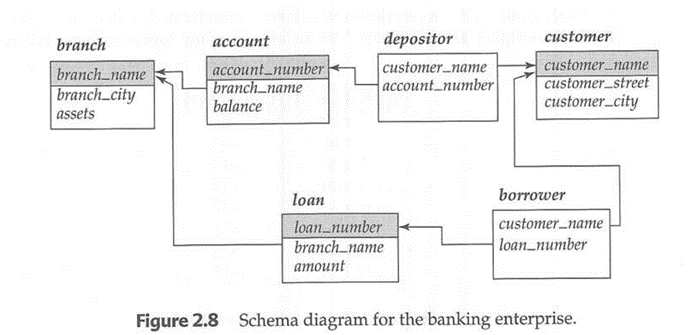
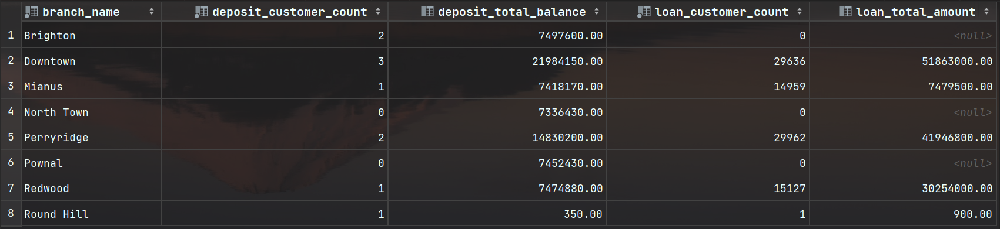
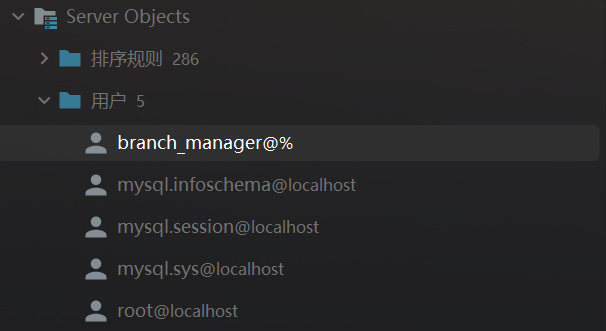

# 《数据库系统》上机实验报告

## I. 实验名称

第2次实验：基于Banking数据库的实验

## II. 实验目的

本次实验通过基于第1次实验的Banking数据库进行中级SQL的运用，学习中级SQL的相关特性，理解连接表达式、视图、事务、完整性约束、数据类型与模式、授权等SQL中级特性，掌握中级SQL特性相关的基本操作。

## III. 实验内容

1. 基于Banking数据库创建**视图**
2. 基于Banking数据库创建**索引**并测试查询速度
3. 基于Banking数据库创建**角色**并赋予权限
4. 熟悉书上第4章中级SQL特性

## IV. 实验思路与结构

banking数据库的大纲图：



### （一）基于Banking数据库创建视图

#### 1 任务要求

基于第一次上机创建的银行数据库，创建一个**视图** *branch_detail*，能够显示所有支行的*存款客户数量*、*存款总额*、*贷款客户数量*、*贷款总额*。

#### 2 任务分析

- 视图

  视图是基于SQL语句的结果集的可视化的表。视图包含行和列，就像一个真实的表。视图中的字段就是来自一个或多个数据库中的真实的表中的字段。

- 视图和表的区别
  - 视图是已经编译好的SQL语句，而表不是。
  - 视图没有实际的物理记录，而表有。
  - 视图不占用物理空间，而表占用物理空间。
  - 视图是窗口，可以显示数据表中某些字段或条件的数据，而表是内容，存储数据库中的全部数据。
  - 视图是外模式，可以根据用户的需求定制，而表是内模式，反映数据库的结构。
  - 视图总是显示最近的数据，每当用户查询视图时，数据库引擎通过使用SQL语句来重建数据，而表中的数据是静态的。

- 视图创建SQL语法

  ``` sql
  CREATE VIEW 视图名称 AS <查询表达式>;
  ```

- 分析

  - 视图名称如要求，命名为 `branch_detail`
  - 查询表达式主要考虑四个待查询属性：*存款客户数量*、*存款总额*、*贷款客户数量*、*贷款总额*
    - *存款客户数量* 可从表 `depositer817` 中得出，使用聚合函数 `COUNT` 计算
    - *存款总额* 可从表 `account817` 中得出，使用聚合函数 `SUM` 计算
    - *贷款客户数量* 可从表 `borrower817` 中得出，使用聚合函数 `COUNT` 计算
    - *贷款总额* 可从表 `loan817` 中得出，使用聚合函数 `SUM` 计算
  - 使用左连接 `LEFT JOIN` 将表 `account817` 、`depositer817`、`loan817` 、`borrower817` 与表 `branch817` 连接起来，需要注意连接顺序
  - 由于该视图需要显示所有支行的响应数据，故查询结果以表 `branch817` 的 `branch_name` 为基准分组

#### 3 SQL

- 首先，选中Banking数据库 `BANK817`

	``` sql
	USE BANK817;
	```

- 然后，进行视图创建

	``` sql
	CREATE VIEW branch_detail AS
    	SELECT b.branch_name,
           	COUNT(d.customer_name) AS deposit_customer_count,
           	SUM(a.balance) AS deposit_total_balance,
           	COUNT(bo.customer_name) AS loan_customer_count,
           	SUM(l.amount) AS loan_total_amount
    	FROM branch817 b
    	LEFT JOIN account817 a on b.branch_name = a.branch_name
    	LEFT JOIN depositor817 d on a.account_number = d.account_number
    	LEFT JOIN loan817 l on b.branch_name = l.branch_name
    	LEFT JOIN borrower817 bo on l.loan_number = bo.loan_number
    	GROUP BY b.branch_name;
	```

- 最后，查看视图，检查是否成功创建

	``` sql
	SELECT * FROM branch_detail;
	```

### （二）基于Banking数据库建立索引

#### 1 任务要求

在 *account* 表的 `account_number` 属性上**建立索引**，并在 *account* 表里插入大量元组，比较有无索引在**查询速度**上的区别。

#### 2 任务分析

- 索引

  数据库中的索引是一种数据结构，可以快速地查询、排序、分组或连接表中的数据。索引的原理类似于书籍的目录，可以不用翻阅整本书就能找到想要的信息。

- 索引的优缺点

  - 优点
    - 提高查询效率。通过使用索引，你可以避免扫描整个表，而是直接定位到相关的数据行。这样可以节省时间和资源。
    - 保证数据的唯一性。通过创建唯一性索引，你可以确保表中的每一行数据都是不重复的。这样可以避免数据冗余和错误。
    - 加速表之间的连接。通过使用索引，你可以快速地找到两个表中相匹配的数据行，而不用做笛卡尔积。这样可以提高连接查询的性能。
    - 支持数据的排序和分组。通过使用索引，你可以利用索引已经排序好的特性，加快排序和分组查询的速度。
  - 缺点
    - 占用额外的存储空间。索引本身也是一种数据结构，它需要占用一定的物理空间来存储索引信息。
    - 降低数据更新的速度。当对表中的数据进行增加、删除或修改时，索引也需要相应地更新，这样会增加更新操作的开销。
    - 增加维护成本。当数据库结构发生变化时，例如增加或删除列，修改数据类型等，索引也需要重新创建或调整，这样会增加维护成本。

- 建立索引的SQL语法

  ``` sql
  CREATE INDEX 索引名称 ON 表名(需要创建索引的属性);
  ```

- 分析

  - 创建索引并不难，只需要执行相应的SQL语句对表 `account817` 的 `account_number` 创建索引即可

  - 为了检测创建索引前后的查询效率，需要插入大量数据。

    - 为了使对比效果明显，凸显索引对查询效率的影响，我们插入几万条数据，每一轮插入的数据随机生成。故编写插入一条随机数据的**过程（PROCEDURE）**，并调用其100,000次，实现大量数据的插入。

  - 数据随机生成

    - `account_number` 形如 `A-XXXXX`, 由于该属性为主键，不可重复，所以在插入时需要判断随机生成的编码是否已经存在。故虽然调用过程100,000次，但实际成功插入数据肯定达不到100,000条，但至少有几万条。

    - `branch_name`在 ('Brighton', 'Downtown', 'Mianus', 'North Town', 'Perryridge', 'Pownal', 'Redwood', 'Round Hill')  中随机生成一个

    - `balance` 在10-1000随机生成一个数字

  - **过程**中需要使用到分号，为了避免MySQL误解我们的意思，需要使用 `DELIMITER` 指定一个不同的结束符号
  - 插入数据后，对比查询效率
    - 首先创建索引，查询数据
    - 然后删除索引，查询数据

#### 3 SQL

- 编写并创建随机生成一条数据的过程
  ``` sql
  DELIMITER //
  CREATE PROCEDURE InsertMultipleAccounts(IN num_rows INT)
  BEGIN
      DECLARE i INT;
      DECLARE new_account_number VARCHAR(10);
      SET i = 1;
      SET new_account_number = '';
      WHILE i <= num_rows DO
          SET new_account_number = CONCAT('A-', LPAD(100 + FLOOR(RAND() * 99900), 5, '0'));
          IF NOT EXISTS (SELECT 'Exist' FROM account817 WHERE account_number = new_account_number) THEN
              INSERT INTO account817 (account_number, branch_name, balance)
              SELECT
                  new_account_number, -- account_number
                  ELT(1 + FLOOR(RAND() * 7), 'Brighton', 'Downtown', 'Mianus', 'North Town', 'Perryridge', 'Pownal', 'Redwood', 'Round Hill'),-- branch_name
                  FLOOR(RAND() * 100) * 10; -- balance
              SET i = i + 1;
          END IF;
      END WHILE;
  END//
  DELIMITER ;
  ```

- 调用过程，插入大量数据
  ```sql
  CALL InsertMultipleAccounts(100000);
  ```

- 创建索引，查询 `branch_name = 'Brighton'` 的数据，观测查询时间

  ``` sql
  -- 创建索引
  CREATE INDEX amount_number_index ON account817(account_number);
  -- 查询数据
  SELECT * FROM account817 WHERE branch_name = 'Brighton';
  ```

- 删除索引，查询 `branch_name = 'Brighton'` 的数据，观测查询时间

  ``` sql
  -- 删除索引
  DROP INDEX amount_number_index ON account817;
  -- 查询数据
  SELECT * FROM account817 WHERE branch_name = 'Brighton';
  ```

### （三）基于Banking数据库创建角色

#### 1 任务要求

**创建角色**银行经理 `branch_manager`，银行经理具有插入、删除和更新 *branch* 表的**权限**。

#### 2 任务分析

- 角色

  数据库中的角色是一种权限的集合，它可以给多个用户分配相同的权限，方便管理和维护。当需要变更权限时，只需要修改角色的权限，而不需要一个一个修改用户的权限。

- 角色和用户的区别

  - 用户的定义：数据库中的用户是指能够登录和操作数据库的账户，它可以有自己的密码、默认架构、默认角色等属性。
  - 角色是一种抽象的概念，它不具有登录和操作数据库的能力，只能通过用户来使用。
  - 用户是一种具体的实体，它具有登录和操作数据库的能力，可以拥有多个角色或直接拥有权限。
  - 角色可以嵌套，即一个角色可以包含另一个角色的权限。
  - 用户不能嵌套，即一个用户不能包含另一个用户的权限。

- 创建角色的SQL语法

  ``` sql
  CREATE ROLE 角色名称;
  ```

- 角色/用户的权限
  - SQL标准包括 **select**、**insert**、**update** 和 **delete** 权限。
  - SQL数据定义语言抱愧授予和收回权限的命令。**GRANT** 语句用来授予权限。**REVOKE** 语句用来收回权限。

- 对角色/用户授权的SQL语法

  ``` sql
  GRANT <权限列表> ON <关系名或视图名> TO <用户/角色列表>;
  ```

#### 3 SQL

- 创建银行经理角色

  ``` sql
  CREATE ROLE branch_manager;
  ```

- 授予银行经理插入、删除和更新 *branch* 表的权限

  ``` sql
  -- 授予插入权限
  GRANT INSERT ON bank817.branch817 TO branch_manager;
  -- 授予删除权限
  GRANT DELETE ON bank817.branch817 TO branch_manager;
  -- 授予更新权限
  GRANT UPDATE ON bank817.branch817 TO branch_manager;
  ```

- 查询银行经理的权限

  ``` sql
  -- 查询权限
  SHOW GRANTS FOR branch_manager;
  ```

## V. 实验结果

### （一）基于Banking数据库创建视图的实验结果

通过查询视图 `branch_detail`，查看视图创建结果，可以实现**显示所有支行的存款客户数量、存款总额、贷款客户数量、贷款总额**



### （二）基于Banking数据库建立索引的实验结果

- 无索引的查询时间
  

- 建立索引后的查询时间
  

- 对比查询时间

  从几万条数据中，查询表 `account817` 中支行名称为 `Brighton` 的数据的时间分别为：

  - 无索引：110ms
  - 有索引：36ms

  能发现建立索引后的查询时间显著缩短，说明索引对查询效率是有提升作用的。

### （三）基于Banking数据库创建角色的实验结果

- 创建角色后的结果，能在 `./Service Objects/user` 中找到创建的银行经理角色 `branch_manager@%`
  

- 查询银行经理的权限，能看到我们授予银行经理的插入、更新、删除数据的权限
  
