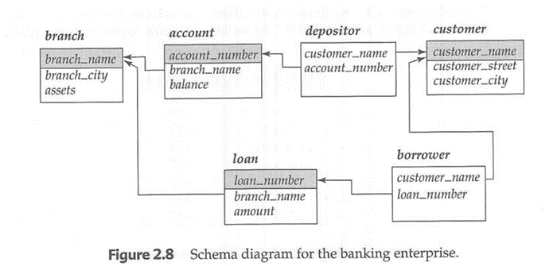
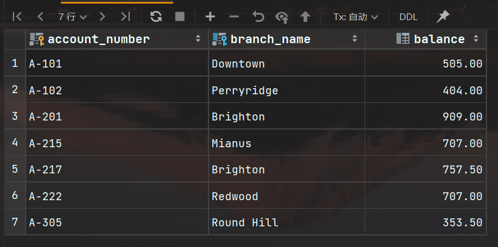
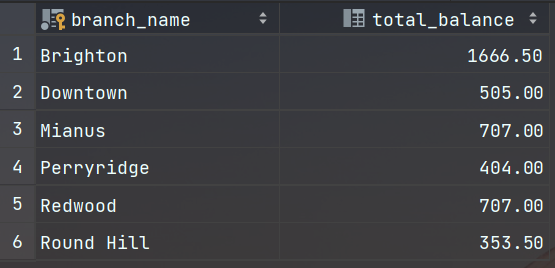
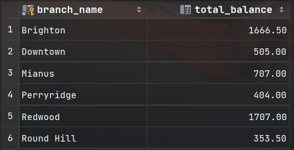
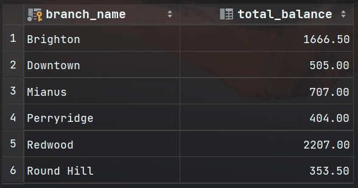
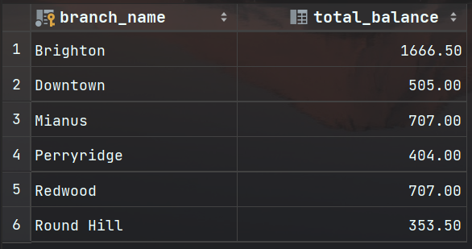

# 《数据库系统》上机实验报告

## I. 实验名称

第3次实验：基于Banking数据库的课本第五章相关实验

## II. 实验目的

本次实验通过基于Banking数据库进行关于课本第五章相关实验，学习高级SQL特性，理解SQL函数与过程以及触发器，掌握从程序设计语言中访问数据库。

## III. 实验内容

1. 为Banking数据库创建函数
2. 为Banking数据库创建触发器
3. 练习课本第五章SQL高级特性

## IV. 实验思路与结构

Banking数据库的大纲图：



### （一）为Banking数据库创建函数

#### 1 任务要求

基于第一次上机创建的Banking数据库，创建一个**函数**，为所有存款账户增加1%的利息。

#### 2 任务分析

- **问题分析：**

  1. 数据库表结构：
     - banking数据库包含了多个表，其中包括存款账户的信息（account表），存款账户与分支机构的关系（branch_name外键），以及存款账户的余额（balance）。

  2. 功能要求：

  - 创建一个函数来为所有存款账户增加1%的利息。

- **SQL设计思路：**

  1. 创建一个存储过程，以便在数据库中执行更新操作。
  2. 在存储过程中使用游标遍历`account`表中的每个存款账户。
  3. 对于每个账户，计算新余额（当前余额 * 1.01）。
  4. 更新`account`表中的余额字段，将新余额写回数据库。
  5. 为了防止数据不一致，使用事务（TRANSACTION）来确保所有操作要么全部成功，要么全部失败。

#### 3 SQL

```sql
# 创建一个函数，为所有存款账户增加1%的利息。
DELIMITER //
CREATE PROCEDURE AddInterestToAccounts()
BEGIN
    DECLARE done INT DEFAULT 0;
    DECLARE accountNumber VARCHAR(10);
    DECLARE oldBalance NUMERIC(12, 2);
    DECLARE newBalance NUMERIC(12, 2);
    -- 游标用来遍历存款账户
    DECLARE accountCursor CURSOR FOR
        SELECT account_number, balance FROM account817;
    DECLARE CONTINUE HANDLER FOR NOT FOUND SET done = 1;
    OPEN accountCursor;

    read_loop: LOOP
    -- 从游标中获取下一个账户号码
    FETCH accountCursor INTO accountNumber, oldBalance;
    -- 如果没有更多的账户，则退出循环
    IF done = 1 THEN
      LEAVE read_loop;
    END IF;
    -- 计算新余额，增加1%的利息
    SET newBalance = oldBalance * 1.01;
    -- 更新账户余额
    UPDATE account817 SET balance = newBalance WHERE account_number = accountNumber;
  END LOOP;

  CLOSE accountCursor;
END;
//
DELIMITER ;
```

1. 游标（`accountCursor`）声明：
   - `DECLARE accountCursor CURSOR FOR SELECT account_number, balance FROM account;` 这一行声明了一个名为`accountCursor`的游标，用于从`account`表中选择`account_number`和`balance`列的数据。
2. 终止处理程序（`done`）：
   - `DECLARE done INT DEFAULT 0;` 这一行声明了一个整数类型的变量`done`，并将其初始化为0，表示初始化时循环未完成。
   - `DECLARE CONTINUE HANDLER FOR NOT FOUND SET done = 1;` 这一行创建了一个终止处理程序，用于在游标遍历完成时将`done`设置为1。当游标已经遍历了所有行并没有更多数据可供检索时，终止处理程序将被触发，将`done`设置为1。

### （二）为Banking数据库创建触发器

#### 1 任务要求

基于第一次上机创建的Banking数据库，创建一个新表 `branch_total`，用于存储各个支行的存款总额（表中有 `branch_name` 和 `total_balance` 两个属性）。

然后在这个表上，创建一个**触发器**，实现当有用户存款变动（包括增加、删除和更新）时，`brach_total` 表中的存款总额跟着自动更新。

#### 2 任务分析

- **问题分析：**
  1. 分析数据库表结构：
     - 仔细分析数据库表结构，确保了解每个表的主键、外键和关联关系。在这种情况下，要关注 `branch_total` 表、`account` 表和 `branch_name` 列。
  2. 确定何时触发：
     - 确定何时触发器应该执行。在这种情况下，触发器应在 `account` 表上的插入、更新和删除操作后执行。
  3. 设计触发器：
     - 创建触发器时，需要定义触发器的名称、触发时机（`AFTER` 插入、更新或删除操作）、触发器的作用域（`FOR EACH ROW` 表示逐行触发），以及触发器的主体部分。
  4. 插入操作触发器：
     - 在插入操作触发器中，需要插入新的存款账户信息到 `branch_total` 表中。如果已经存在具有相同 `branch_name` 的行，触发器应该更新总余额。
  5. 更新操作触发器：
     - 在更新操作触发器中，需要考虑如何更新 `branch_total` 表的存款总额。触发器应该检测新余额和旧余额的差异，然后将这个差异添加到相应的 `branch_total` 行。
  6. 删除操作触发器：
     - 在删除操作触发器中，需要减去已删除账户的余额。
  7. 考虑并发性：
     - 在多用户同时进行存款操作时，触发器需要处理并发性问题，以确保数据的一致性和完整性。
  8. 测试触发器：
     - 在设计和创建触发器之后，务必进行详尽的测试，确保触发器按预期工作并不会引发任何错误或异常情况。


#### 3 SQL

- 创建表 `branch_total`，并插入数据保证数据的一致性

    ``` sql
    -- 创建表branch_total
    CREATE TABLE branch_total (
      branch_name VARCHAR(30) PRIMARY KEY,
      total_balance DECIMAL(10, 2)
    );
    -- 插入数据
    INSERT INTO branch_total (branch_name, total_balance)
        SELECT branch_name, SUM(balance) FROM account817 GROUP BY branch_name;
    ```

- 创建触发器

	``` sql
	-- 触发器
	DELIMITER //
	CREATE TRIGGER updateBranchTotal AFTER INSERT ON account817
	    FOR EACH ROW
	    BEGIN
	        -- 插入新存款账户时，更新存款总额
	        INSERT INTO branch_total (branch_name, total_balance)
	        VALUES (NEW.branch_name, NEW.balance)
	        ON DUPLICATE KEY UPDATE total_balance = total_balance + NEW.balance;
	    END; //
	
	CREATE TRIGGER updateBranchTotalDelete AFTER DELETE ON account817
	    FOR EACH ROW
	    BEGIN
	        -- 删除存款账户时，更新存款总额
	       UPDATE branch_total
	       SET total_balance = total_balance - OLD.balance
	       WHERE branch_name = OLD.branch_name;
	    END; //
	
	CREATE TRIGGER updateBranchTotalUpdate AFTER UPDATE ON account817
	    FOR EACH ROW
	    BEGIN
	        -- 更新存款账户时，更新存款总额
	        UPDATE branch_total
	        SET total_balance = total_balance - OLD.balance + NEW.balance
	        WHERE branch_name = NEW.branch_name;
	    END //
	DELIMITER ;
	```

## V. 实验结果

### （一）为Banking数据库创建函数的结果

- 调用创建的函数，实施对每个账户增加1%的利息

  ```sql
  -- 执行为所有存款账户增加1%的利息
  CALL AddInterestToAccounts();
  ```

- 查看执行结果

  ``` sql
  -- 查看account表的结果
  SELECT * FROM account817;
  ```

  运行结果：
  
  
  执行过后，从结果能看出每个账户的 `balance` 确实都增加了1%的利息

### （二）为Banking数据库创建触发器的结果

- 表 `branch_total` 原始数据：
  

- **插入**操作测试：

   - 插入一个新的存款账户，检查触发器是否正确地将相应的 `branch_total` 表中的总余额更新。

       ``` sql
       -- 插入一个新存款账户
       INSERT INTO account817 VALUES ('A-777', 'Redwood', 1000);
       ```

   - 查看表 `branch_total`

       ``` sql
       SELECT * FROM branch_total;
       ```

   - 结果
       

- **删除**操作测试：

   - 删除一个存款账户，验证触发器是否正确地从 `branch_total` 表中减去已删除账户的余额。

       ``` sql
       -- 删除一个存款账户
       DELETE FROM account817 WHERE account_number = 'A-777';
       ```

   - 查看表 `branch_total`

       ``` sql
       SELECT * FROM branch_total;
       ```

   - 结果
       

- **更新**操作测试：

  - 更新一个存款账户的余额，确保触发器能够正确地更新 `branch_total` 表中的总余额。

      ``` sql
      -- 更新存款账户的余额
      UPDATE account817 SET balance = 1500 WHERE account_number = 'A-777';
      ```
  
  - 查看表 `branch_total`
  
      ```sql
      SELECT * FROM branch_total;
      ```
  
  - 结果
      
