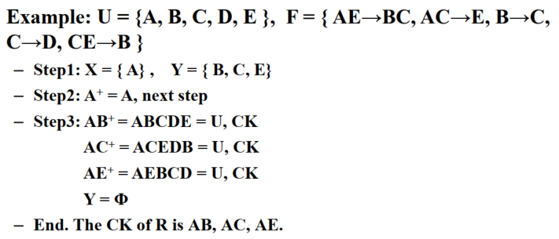
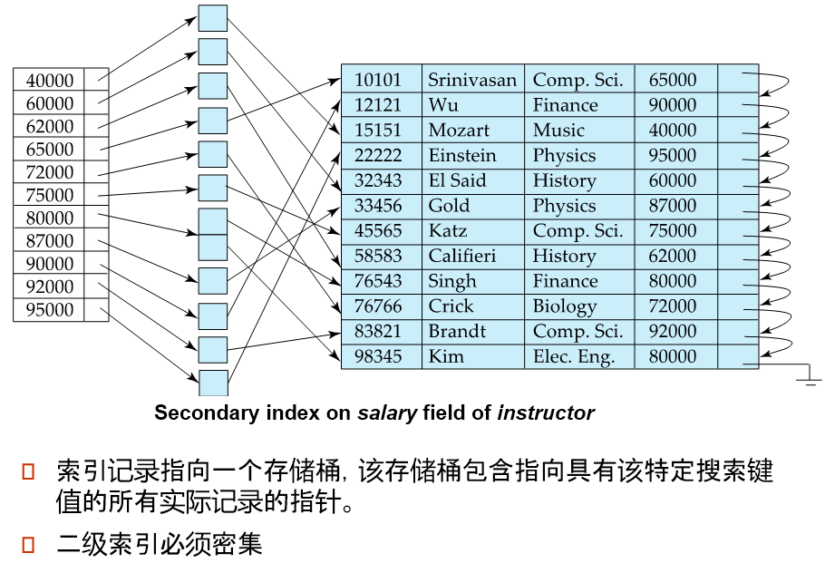
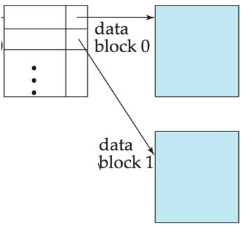
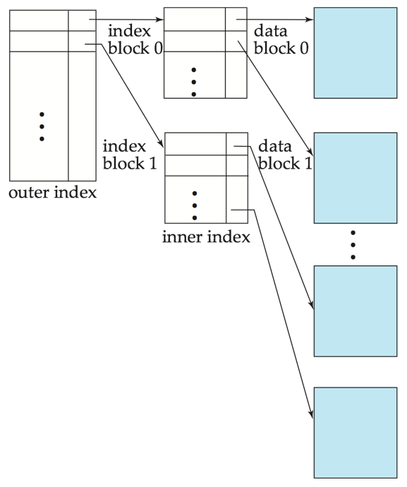
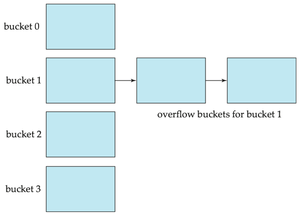
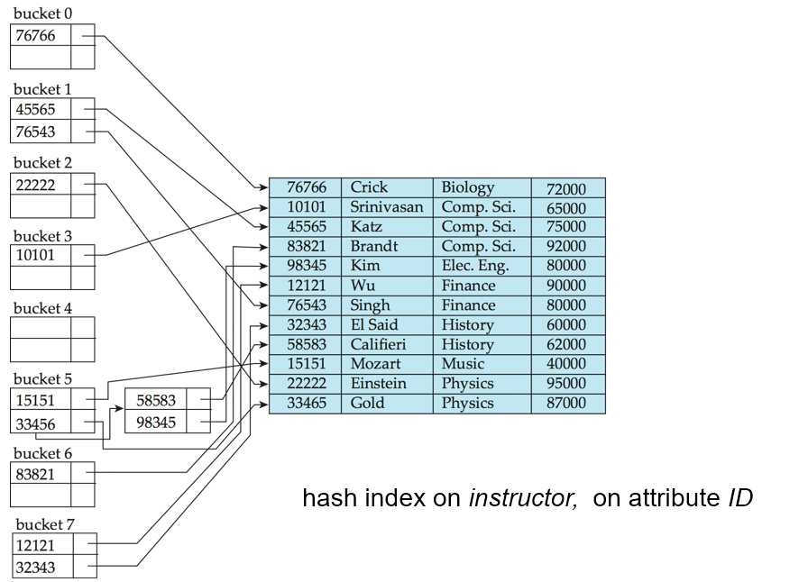

# 数据库

[TOC]

# I. Intro

- 数据库：相关数据的集成集合构成了数据库 （DB）。

## 数据库抽象级别

- 物理级别：描述记录（例如，教师）的存储方式。
- 逻辑级别：描述存储在数据库中的数据，以及数据之间的关系。
- 视图级别：应用程序隐藏数据类型的详细信息。 出于安全目的，视图还可以隐藏信息（例如员工的工资）。

## DBMS 架构

- **外模式**（**External Schema**，也称**子模式**或**用户模式**）

  数据库用户使用的局部数据的逻辑结构和特征的描述

- **模式**（**Logical Schema, Schema**，也称**逻辑模式**）

  数据库中全体数据的逻辑结构和特征（型）的描述

- **内模式**（**Physical Schema**，也称**存储模式**）

  数据物理结构和存储方式的描述

## 数据模型

### 组成要素

- 数据
- 数据关系
- 数据语义
- 数据完整性约束

### 常见的数据模型

- 关系模型
- 实体关系数据模型（主要用于数据库设计）
- 基于对象的数据模型（面向对象和对象关系）
- 半结构化数据模型（XML）
- 其他老旧模型
  - 网络模型
  - 分层模型

# II. 关系模型

# III. SQL

# IV. ER图

# V. 关系型数据库设计

## Intro

### 不良数据的异常

- **数据冗余**
  - 表T中表示的实体实例或关系实例可能占用T的几行。
- **修改异常**
  - 当更改表中表示的实体实例或关系实例的单个属性值时，表T可能会发生更新异常，可能需要更新T的几行。
- **删除异常**  
  - 当删除表的某些行以反映实体或关系的某些实例的消失时，表T会受到delete异常的影响，这可能会导致我们不希望忘记的关于不同实体或关系的某些实例的信息丢失。
- **插入异常**
  - 如果不包含不存在的实体或关系的其他实例的信息，我们就不能表示关于某个实体或实例的信息。

## 候选码

==候选码是**最小超码**==

### 主属性与非主属性

- 存在于候选码中的属性是**主属性**
- 不存在于候选码中的属性是**非主属性**

### 候选码计算算法

- 首先将所有属性分为 左属性、右属性、左右属性
  - 左属性只在左边出现，一定是**主属性**
  - 右属性只在右边出现，一定是**非主属性**
  - 左右属性在左右都出现，属性不定
- 看左属性闭包可不可以推全集
  - 可以，则左属性构成候选码
  - 不可以，则依次取左右属性的一个属性构成新集合看可否推全集，推出全集则是候选码
    - 都不可以则取左右属性的2、3……个属性，直到可以推出全集



## 范式

### 1NF

> 如果关系模式R的所有属性的域都是**原子的**，那么关系模式R就是第一范式(1NF)。

直接看R的属性是否都为***原子***，一般都至少是1NF。

### 2NF

> 如果没有非素数属性**部分依赖**于候选键，则关系模式R为第二范式(2NF)。

看 ***候选码*** 和 ***非主属性*** ，是否有非主属性可以被候选码的**子集**推出

- 有，非2NF
- 无，是2NF

### 3NF

> 如果关系模式R不存在**传递依赖**于键的非素数属性，则关系模式R为第三范式(3NF)。

看 ***候选码*** 和 ***非主属性*** ，是否有非主属性要被候选码**传递推出**

- 有，非3NF
- 无，是3NF

### BCNF

> 关系模式R是BCNF(Boyce-Codd范式)，如果对于 F 中的所有功能依赖 $\alpha$ → $\beta$，$\alpha$ 是 R 的超键。

看F中***所有左成分*** 和 ***候选码*** ，是否有左成分连候选码都不是

- 有，非BCNF
- 无，是BCNF

### 4NF

# VI. 索引和散列

## 基本概念

- 索引机制：用于加快对所需数据的访问
- 搜索键：用于在文件中查找记录的属性集的属性。
- 两种基本索引类型
  - 有序索引：搜索键按排序顺序存储
  - 哈希索引：使用“哈希函数”将搜索键均匀分布在散列桶中。

## 有序索引

有序索引中，索引条目按 ***搜索键值*** 排序存储。

### 主索引与二级索引

- **主索引**：在按顺序排序的文件中，其搜索键指定文件的顺序的索引
  - 也称为**聚类索引**
  - 主索引的搜索键通常是主键，但不一定是主键

- **二级索引**：其搜索键指定的顺序与文件的顺序不同的索引

  - 也称为**非聚类索引**

  

- **索引顺序文件**：带有主索引的有序顺序文件

### 稠密索引与稀疏索引

- **稠密索引**：为文件中的每个搜索键值显示索引记录

- **稀疏索引**：仅包含部分搜索键值的索引记录

  - 当记录按搜索键顺序排序时适用
  - 要查找具有搜索键值 K 的记录：
    - 查找具有最大搜索键值 < K 的索引记录
    - l从索引记录指向的记录开始按顺序搜索文件

- 稠密索引与稀疏索引的**区别**

  - 减少插入和删除的空间和维护开销
  - 通常比用于查找记录的密集索引慢

- **良好的权衡**：

  - 稀疏索引，文件中每个块都有一个索引条目，对应于块中的最小搜索键值。

  

### 多级索引

- **多级索引**：将磁盘上保存的主索引视为顺序文件，并在其上构造稀疏索引。
  - **外部索引** – 主索引的稀疏索引
  - **内部索引** – 主索引文件
- 在插入或删除文件时，必须更新所有级别的索引



### 索引的更新

#### 删除

如果已删除的记录是文件中唯一具有特定搜索键值的记录，则搜索键也会从索引中删除。

- 单级索引条目删除
  - **密集索引** – 删除搜索键类似于删除文件记录.
  - **稀疏索引** –
    - 如果索引中存在搜索键的条目，则通过将索引中的条目替换为文件中的下一个搜索键值（按搜索键顺序）来删除该条目。 
    - 如果下一个搜索键值已具有索引条目，则将删除该条目，而不是替换该条目。

#### 插入

使用要插入的记录中显示的搜索键值执行查找

- 单极索引插入
  - **密集索引** – 如果索引中未显示 Search-Key 值，请插入该值
  - **稀疏索引** – 如果索引存储文件的每个块的条目，则除非创建新块，否则无需对索引进行任何更改
    - 如果创建新块，则新块中出现的第一个搜索键值将插入到索引中.

## 散列

### 静态散列

- **桶**：是包含一条或多条记录的存储单元（桶通常是磁盘块）
- 具有不同搜索键值的记录可以映射到同一桶；因此，必须按顺序搜索整个桶才能找到记录。

#### 散列函数

- 在哈希文件组织中，我们使用哈希函数直接从记录的搜索键值中获取记录的存储桶。
- 哈希函数 h 是从所有搜索键值 K 的集合到所有桶地址 B 的集合的函数。
- 哈希函数用于定位访问、插入和删除的记录。


- 理想的哈希函数是 ***统一的***，即从所有可能值的集合中为每个存储桶分配相同数量的搜索键值。
- 理想的哈希函数是 ***随机的***，因此无论文件中搜索键值的实际分布如何，每个存储桶都将分配相同数量的记录。
- 典型的哈希函数对搜索键的内部二进制表示形式执行计算。

#### 桶溢出的处理

- 桶溢出的原因
  - **桶不足**
  - 记录分布**偏斜**
    - 多条记录具有相同的搜索键值
    - 选择的哈希函数产生键值的不均匀分布
- 溢出链
  - 给定存储桶的溢出存储桶在链表中链接在一起




#### 散列索引

- **散列索引**将搜索键及其关联的记录指针组织到哈希文件结构中。

- 严格来说，哈希索引始终是二级索引



#### 静态哈希的缺点

在静态哈希中，函数 h 将搜索键值映射到一组固定的 B 存储桶地址。数据库会随时间而增长或缩小。、

- 一种解决方案：使用新的哈希函数定期重新组织文件
  - 价格昂贵，会扰乱正常运营
- 更好的解决方案：允许**动态**修改存储桶的数量。

### 动态散列

- 适用于大小增长和缩小的数据库
- 允许动态修改哈希函数
- 一种动态散列的技术——可扩充散列

## 有序索引和散列的对比

- 哈希通常更擅长检索具有指定键值的记录
- 如果范围查询很常见，则首选有序索引

- 哈希通常更擅长检索具有指定键值的记录
- 如果范围查询很常见，则首选有序索引

## 位图索引

- **位图索引**：是一种特殊类型的索引，旨在对多个键进行高效查询
- 适用于具有相对较少非重复值的属性
- 位图只是一个位数组

## 补充

### SQL 中的索引

#### 创建索引

``` sql
create index <index-name> on <relation-name>(<attribute-list>)
```

例子：

``` sql
create index b-index on branch(branch_name)
```

使用 `create unique index` 可以间接指定和强制执行搜索键为候选码的条件。

#### 删除索引

``` sql
drop index <index-name>
```

### 索引的使用时机

#### 什么时候要用索引？

- 经常要用于**查询**的列（如where id=?）；
- 经常要用于**排序**(order by)，**分组**(group by)的列;
- 有**值唯一性**限制的列，比如说主键、身份证号等。

#### 什么时候不要用索引？

- 数据更新比**查询性能**要求要高的情况下不要使用索引（索引也要进行更新）;
- 不要**盲目**的给表建太多索引（索引本身也要占用存储空间）；
- 不要给**不经常使用**的列建索引；
- 不要给**高重复值**的列建索引（比如：性别）;
- 不要给**img, tex, bit数据类型**使用索引，因为这种字段一般使用很少，且数据量太大。

# VII. 事务

# VIII. 并发控制

# IX. 恢复系统

## 故障分类

- **事务故障**
  - **逻辑错误**：由于某些内部错误情况，事务无法完成
  - **系统错误**：数据库系统必须由于错误情况（例如，死锁）而终止活动事务
- **系统崩溃**：电源故障或其他硬件或软件故障会导致系统崩溃。
  - **故障-停止假设**：假定非易失性存储内容不会因系统崩溃而损坏
    - 数据库系统具有许多完整性检查，以防止磁盘数据损坏
- **磁盘故障**：磁头崩溃或类似的磁盘故障会破坏全部或部分磁盘存储
  - 假定销毁是可检测的：磁盘驱动器使用校验和来检测故障

## 存储结构

- **易失性存储**
  - 无法在系统崩溃时幸存下来
  - 示例：主存储器、高速缓存
- **非易失性存储**
  - 在系统崩溃中幸存下来
  - 示例：磁盘、磁带、闪存、非易失性（备用电池）RAM 但仍可能失败，丢失数据
- **稳定存储**
  - 一种神话般的存储形式，可以在所有故障中幸存下来
  - 通过在不同的非易失性介质上维护多个副本来近似

## 基于日志的恢复

### 日志记录

日志是一系列日志记录，用于维护数据库上的更新活动记录。

- *< T~i~ start >*
  - 事务 *T~i~* 开始时
  - 当事务 *T~i~* 启动时，它通过写入 *< T~i~ start >* 日志记录来注册自身
- *< T~i~ , X~j~ , V~1~ , V~2~ >* 
  - *T~i~* 对数据项 *X~j~* 执行写操作，其中 *V~1~* 是写入前的 *X* 值（旧值），*V~2~* 是要写入 *X* 的值（新值）。
- *< T~i~ commit >*
  - 事务 *T~i~* 提交
  - 当 *T~i~* 完成最后一条语句时，将写入日志记录 *< T~i~ commit >*。
- *< T~i~ abort >*
  - 事务 *T~i~* 中止

## 恢复算法

恢复算法由两部分组成

- 在正常事务处理期间为确保存在足够的信息以从故障中恢复而采取的操作
- 在无法将数据库内容恢复到确保原子性、一致性和持久性的状态后采取的操作

### Undo & Redo

- **Undo**
  - **撤销阶段**：撤销所有未完成的事务
  - 对于日志记录 *<T~i~、X、V~1~、V~2~>* 将旧值 *V~1~* 写入 *X*
  - *undo(T~i~)*  将 *T~i~* 更新的所有数据项的值恢复到其旧值，从 *T~i~* 的最后一个日志记录向后
    - 每次将数据项 X 恢复到其旧值 V 时，都会写出一条特殊的日志记录 *<T~i~ , X , V>*
    - 事务撤消完成后，将写出日志记录 *<T~i~ abort>*。
  - 事务 *T~i~* 需要撤销 **Undo** 的情况：
    - 包含 *< T~i~ start >*
    - 不包含 *< T~i~ commit >* 或 *< T~i~ abort >*
- **Redo**
  - **重做阶段**：重播所有事务的更新，无论它们是已提交的、已终止的还是未完成的
  - 日志记录 *<T~i~、X、V~1~、V~2~>* 将新值 *V~2~* 写入 *X*
  - *redo(T~i~)* 将 *T~i~* 更新的所有数据项的值设置为新值，从 *T~i~* 的第一个日志记录开始
    - 在这种情况下，不进行日志记录
  - 事务 *T~i~* 需要撤销 **Redo** 的情况：
    - 包含 *< T~i~ start >*  , *< T~i~ commit >* 和 *< T~i~ abort >*

#### 事务回滚

- 设 Ti 为要回滚的事务
- 从末尾向后扫描日志，并扫描 Ti 的每个日志记录，格式为 *< T~i~ , X~j~ , V~1~ , V~2~ >* 
  - 通过将 *V~1~* 写入 *X~j~* 来执行撤消
  - 写入日志记录 *< T~i~ , X~j~ , V~1~ >*
    - 此类日志记录称为 ***补偿日志记录***
- 找到记录 *< T~i~ start >*  后，停止扫描并写入日志记录 *< T~i~ abort >*

#### Undo & Redo 过程描述

- **Redo 阶段**

  1. 找到最后一个 ***< checkpoint L >*** 记录，并将 *undo-list* 设置为 *L*。 
  2. 从上方 ***< checkpoint L >*** 记录向前扫描
     - 每当找到记录 *< T~i~ , X~j~ , V~1~ , V~2~ >* 或 *< T~i~ , X~j~ , V~2~ >* 时，通过将 *V~2~* 写入 *X~j~* 来重做
     - 每当找到日志记录 *< T~i~ start >* 时，将 *T~i~* 添加到 *undo-list* 中
     - 每当找到日志记录 *< T~i~ commit >* 或 *< T~i~ abort >* 时，请从 *undo-list* 中删除 *T~i~*

- **Undo 阶段**

  从末尾向后扫描日志

  1. 每当在 *undo-list* 中找到日志记录 *< T~i~ , X~j~ , V~1~ , V~2~ >* 时，请执行与事务回滚相同的操作：
     - 通过将 *V~1~* 写入 *X~j~* 来执行撤消。
     - 写入日志记录 *< T~i~ , X~j~ , V~1~ >*
  2. 每当在 *undo-list* 中找到 *T~i~* 所在的日志记录 *< T~i~ start >* 时
     - 写入日志记录 *< T~i~ abort >*
     - 从撤消列表中删除 *T~i~* 
  3. 当 *undo-list* 为空时停止
     - 即 *< T~i~ start >* 已找到 *undo-list* 中的每个事务

   撤消阶段完成后，可以开始正常的事务处理

# X. NoSQL

## NoSQL 数据库优点

- 高扩展性
- 分布式计算
- 成本更低
- 架构灵活性
- 半结构化数据
- 没有复杂的关系

## NoSQL 数据库类型

- **面向文档数据库**
  - 数据以文档存储
- **XML 数据库**
  - 数据以XML格式存储
- **图数据库**
  - 数据用节点存储，之间用边连接
- **键值存储数据库**
  - key-value