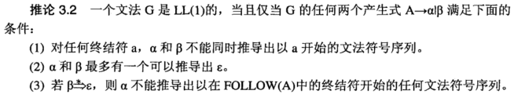

# 编译原理

[TOC]

# ch01 绪论

## 1 语言之间的翻译

- 汇编语言 → 机器指令：汇编（或交叉汇编）

- 高级语言 → 汇编语言或机器指令：编译(或交叉编译)

- 高级语言之间：转换（或预编译、预处理）

- 逆向：反汇编、反编译

## 2 编译器与解释器

语言翻译的两种基本形态：

- **先翻译后执行**

  

- **边翻译边执行**

  

- 对比

  |        | 工作效率 | 可移植性 | 交互性/动态性 |
  | ------ | -------- | -------- | ------------- |
  | 编译器 | 高       | 低       | 低            |
  | 解释器 | 低       | 高       | 高            |

> - 翻译系统是编译器的语言（即编译型语言）：C/C++
>
>   *对于任何一门程序设计语言，若用它编写的源程序需要翻译成二进制代码，且生成的二进制代码可独立于源代码执行，则该语言就可看作是编译型语言。*
>
> - 既有编译器又有解释器的语言：Java，C#，Python

## 3 编译器的工作原理与基本组成

### 通用程序设计语言的主要成份

==**声明 + 操作 = 完整定义**==

**==”先声明，后引用“==**

- **声明性语句**：
  - 提供操作对象的性质，如数据类型、值、作用域等。
  - 填写符号表，**生成相应的环境** (如对于变量：分配存储空间)。

- **操作性语句**：
  - 确定操作的计算次序，完成实际操作。
  - **生成中间代码**。如三地址码、注释树等。

### 以阶段划分编译器

1. **词法分析**：识别记号。记号要分类！
2. **语法分析**：识别语言结构，并以 **树** 的形式表示；
3. **语义分析**：考察结构正确的句子是否语义合法、修改树结构、查填符号表；
4. **中间代码生成**（可选）：生成一种既接近目标语言，又与具体机器无关的表示，便于优化与代码生成；

> 到目前为止，编译器与解释器可以一致

5. **中间代码优化**（可选）：局部优化、循环优化、全局优化等；优化实际上是一个等价变换，变换前后的指令序列完成相同功能，但在占用的空间上和程序执行的时间上都更省、更有效。
6. **目标代码生成**：不同形式的目标代码－汇编、可重定位、内存形式（Load-and-Go）
7. **符号表管理**：合理组织符号，便于各阶段查找、填写等；
8. **出错处理**：报告错误、修复错误（使得编译能继续）。

### 编译器的分析/综合模式

- **前端**：语言结构和意义的分析；
- **后端**：语言意义处理；
- **中间代码**：前端与后端的分界。

# ch02 词法分析

## 1 记号、模式与单词

- **记号（token）**：按照某个模式(规则)识别出的元素
- **模式（pattern）**：产生和识别单词（元素）的规则
- **单词（lexeme）**：被识别出的元素自身的值，也称为词值

### 单词的基本分类

- **关键字**
- **标识符**
- **字面量**
- **特殊符号**

### 词法分析的工作方式

1. **单独一遍扫描**

   

2. **作为语法分析的子程序**

   

3. **并行方式**

   

## 2 模式的形式化描述

### 字符串与语言

#### 字符串的基本概念

#### 字符串集合的基本运算

### 正规式与正规集

关于 *或* 、*连接* 、*闭包运算* ：

- 三种运算均具有 **左结合** 性质
- **优先级**：闭包运算 ＞ 连接运算 ＞ 或运算

### 简化正规式的表述

## 3 有限自动机

### 不确定的有限自动机 NFA

#### NFA 存在的问题

1. 只有尝试了全部可能的路径，才能确定一个输入序列不被接受，而这些而路径的条数随着路径长度的增长成指数级增长。
2. 识别过程需要大量回溯，时间复杂度与输入序列成指数级增长，且 **算法复杂**。

### 确定的有限自动机 DFA

- DFA 相比 NFA 的特点是他的 **确定性**
- move函数是 **一对一** 的
- <u>若 DFA M 和 M‘ 识别同一个正规集，则称 M 和 M’ 是等价的，即 M = M’</u>

## 4 正规式到词法分析器

### 正规式到 NFA

#### Thompson 算法

### NFA 到 DFA

- 完成smove表格：

  1. 写出第一个元素的所有经过 $\varepsilon$ 到达的所有节点构成的闭包 $\varepsilon\_闭包(T)$

  2. 依次对每行进行求 $smove(第一列当前行的集合S, 当前列的状态a)$，并求其  $\varepsilon\_闭包$

     - $S$ <u>经过 $a$ 到达</u>的所有状态，构成新集合 $S_1$ （求得 **smove**）

     - $S_1$ 中所有元素<u>经过 $\varepsilon$ 到达</u>的节点构成的集合，即 **闭包**

       > ==注意是闭包，也就是不断地看当前集合中还有没有可以通过 $\varepsilon$ 到达新的节点可以加入集合中的，形成闭包==

- 对表格中所有的元素标记 $S_i$，一样的元素标记为同一个
- 根据表格中的 $S_i$ 构建DFA

### 最小化 DFA

1. 初始划分：终态组 ， 非终态组；

2. 利用可区分的概念，反复分裂划分中的组Gi，直到不可再分裂；

3. 由最终划分构造D'，关键是选代表和修改状态转移；

4. 消除可能的死状态和不可达状态。

# ch03 语法分析

- **词法分析**：记号的集合，字符串由字母组成，线性结构

- **语法分析**：句子的集合，句子由记号组成， 非线性结构（树）

- 语法的双重含意：

  1. **语法规则**：上下文无关文法（子集：LL文法或LR文法）

  2. **语法分析**：自上而下分析、自下而上分析、下推自动机（LL或LR分析器）

## 1 语法分析的若干问题

### 源程序中可能出现的错误

- 语法错误
  - 词法错误
    - 非法字符或关键词、标识符拼写错误
  - 语法错误
    - 语法结构错误。例如：少分号、begin/end不配对
- 语义错误
  - 静态语义错误
    - 编译时可检查出来的问题。例如类型不一致、参数不匹配
  - 动态语义错误
    - 程序运行时的逻辑错误。例如：无穷递归、变量为0

### 语法错误的基本恢复策略

1. 紧急方式恢复
2. 短语级恢复
3. 出错产生式
4. 全局纠正

## 2 上下文无关文法 CFG

### 推导

#### 直接推导

#### 句型

#### 最左推导

### 分析树与语法树

#### 分析树与文法和语言存在的关系

### 二义性和二义性的消除

#### 二义性定义

关于二义性：

#### 解决二义性的方法

- 改写二义文法为非二义文法

  - 

  - 

- 对二义文法施加限制，具体就是为文法符号规定优先级和结合性，使得分析过程仅能产生一颗分析树

  

## 3 语法与文法简介

### 正规式与上下文无关文法

#### 正规式到CFG的转换

##### 转换步骤

==BUT：==

#### 为什么用正规式而不用CFG描述程序设计语言的词法

### 上下文有关文法 CSG

程序设计语言中除了CFG可以描述的结构之外，还有一些是CFG无法描述的所谓上下文有关的结构。

- 变量的声明与引用必须一致
- 过程调用时实参与形参的个数、类型必须一致等。

描述它们的文法被称为**上下文有关文法（Context Sensitive Grammar, CSG）**。 

### 形式语言与自动机

## 4 自上而下语法分析

### 消除左递归

#### 消除直接左递归算法

### 提取左因子

#### 提取左因子算法

### 递归下降子程序

#### 构造递归下降子程序步骤

##### 文法的状态转换图的构造

##### 化简转换图

#### EBNF 文法的表示

### 预测分析器

#### 下推自动机模型与预测分析器模型

#### 预测分析中4种改变格局的动作

#### 构建预测分析表

##### 计算FIRST集合

##### 计算FOLLOW集合

##### 预测分析表构建算法

遍历每一行的非终结符（以下FIRST 和 FOLLOW都是对当前非终结符而言）：

- FIRST的终结符直接加
- FIRST中有 $\varepsilon$ ，则加入FOLLOW

#### LL(1)文法

## 5 自下而上语法分析

### 自上而下分析的基本方法

#### 规范归约与”剪句柄“

##### 短语、直接短语与句柄

##### 短语形成的两个要素

##### 分析树中的短语、直接短语与句柄

##### 最左归约

- 最左归约也被称为规范归约
- 规范归约的逆过程正好是一个最右推导
- 每一步归约都是用一个产生式的左部去替换当前句型中的**句柄**

##### 减句柄

#### 移进-归约分析器的工作模式

- 确定右句型中将要规约的子串（**确定句柄**）
- 确定如何选择正确的产生式进行归约

##### 4种改变格局变化的动作

#### 关于移进-归约分析过程

- 句柄总是在栈顶形成
- 栈中保留的总是一个右句型的前缀，也称**活前缀**
- 分析的全过程逻辑就是从下到上构造一棵分析树

### LR分析

#### LR分析的特点

- 采用最一般的无回溯移进-归约方法
- 可分析的文法是LL文法的真超集
- 能够及时发现错误，及时从左到右扫描输入序列的最大可能
- 分析表比较复杂，难以手工构建

#### LR分析与LR文法

- $action[s, a]$ 指示当前**栈顶状态为s**和输入**终结符为a**时进行的**下一动作**
- $goto[a, A]$ 指示在当前**栈顶为s**和**非终结符A**时的**下一状态转移**

#### LR文法

#### LR分析器

- 根据分析表构造的不同，可以有LR(0)、SLR(1)、LALR(1)和LR(1)分析器
  - 他们的功能的强弱和构造的难度依次递增
- 当k＞1后，分析器的构造趋于复杂，一般情况下并不构造k＞1的LR(k)分析器

### SLR(1) 分析器

#### 活前缀

- 在活前缀边上加若干（可以是0）个终结符，即可得到一个右句型
- LR的基本思想就是为文法G构造一个识别他的所有活前缀的DFA
- 识别活前缀的DFA实质上就是识别G所产生语言的DFA

#### LR(0) 项目

项目中，`.` 把产生式右部分为两个部分：$A → \alpha . \beta$ ，表示分析过程中看到了产生式右部的多少内容。

- $\beta$ 不为空，产生式右部未全部看到，需要移进
- $\beta$ 为空，表示当前栈顶已经形成一个句柄，可以归约
- $\beta$ 不为空的项目称为 **可移进项目**
- $\beta$ 为空的项目称为 **可归约项目**

#### 扩广文法与识别活前缀的DFA

- 含有 $S' → .S$ 项目的集合称为 DFA 的初态
- 含有 $S' → S.$ 项目的集合为 DFA 的终态

 

#### 拓广文法、识别活前缀DFA

#### 冲突

##### 解决冲突的方法：SLR(1) 方法

- 若冲突无法解决，则说明文法不是SLR(1)的

#### 构造分析表

- 写action
  - 写si
    - 看 DFA 。看 **终结符的边**，向表格中 ***[状态数，终结符]*** 填入边指向的**节点si（状态i）**。
  - 写rj
    - 看 DFA 和 FOLLOW。看所有 **归约的节点（`.` 在最后）**，看产生式左边的  **非终结符的 FOLLOW**，遍历FOLLOW集合中所有终结符，向表格 ***[状态数，集合中的终结符]*** 填入该**产生式的编号rj**。

- 写goto
  - 看 DFA 。看为 **非终结符的边**，向表格中 ***[状态数，非终结符]*** 填入边指向的**节点i（状态i）**。

# ch04 静态语义分析

## 1 语法制导

### 语义分析的作用

- **检查语言结构是否正确**，即是都结构正确的句子所表示的意思也合法
- **执行所规定的语义动作**，如表达式的求值、符号表的填写、中间代码的生成等

## 2 中间代码

中间代码的特性

- 便于语法制导
- 既与机器指令的结构相近，由于具体机器无关
