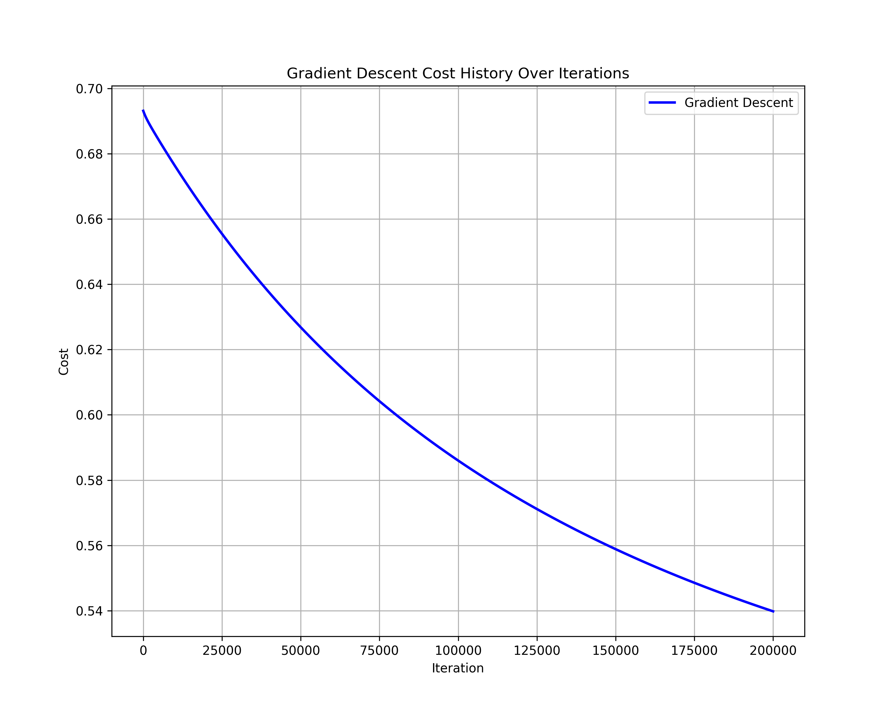
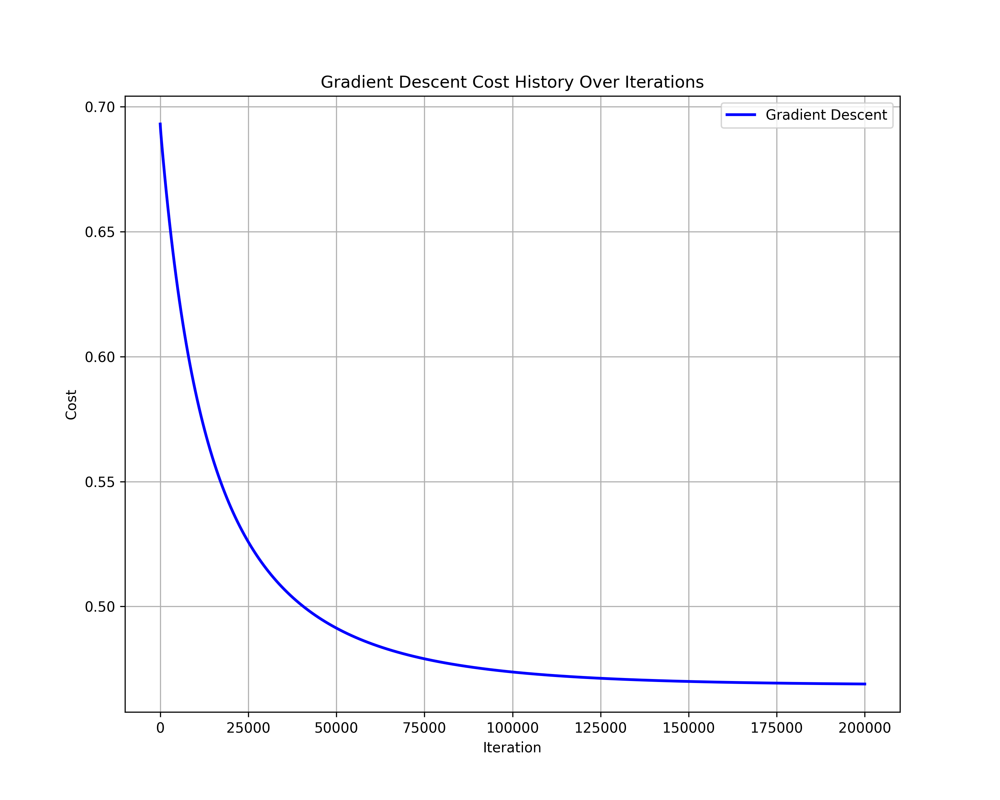
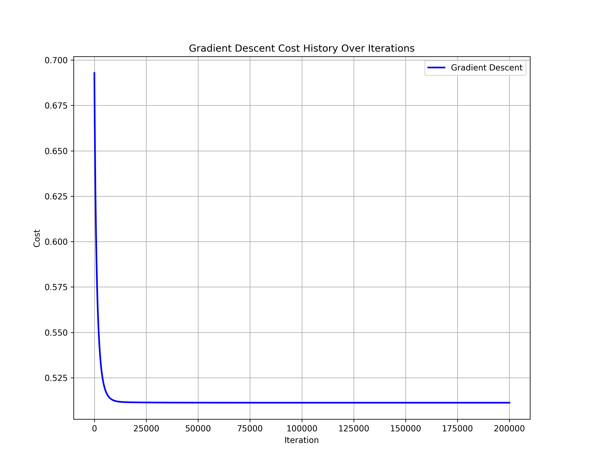
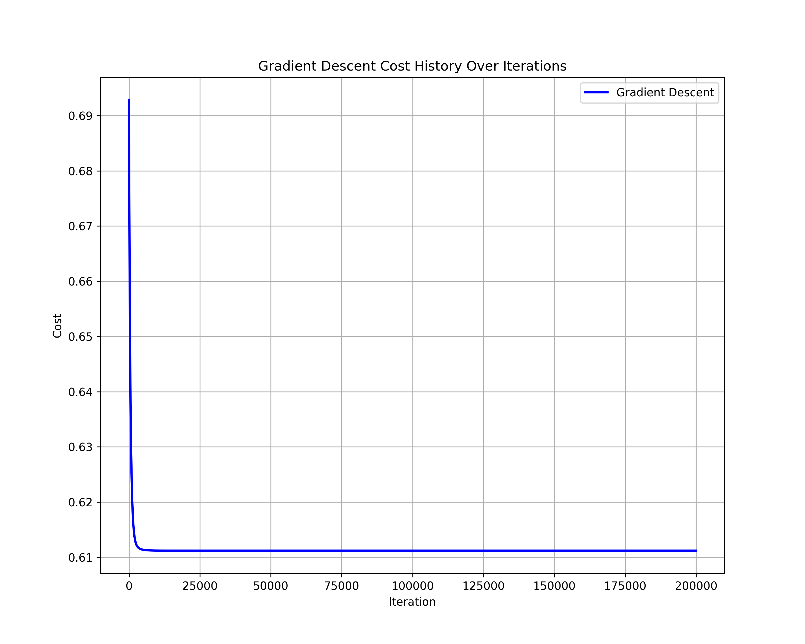
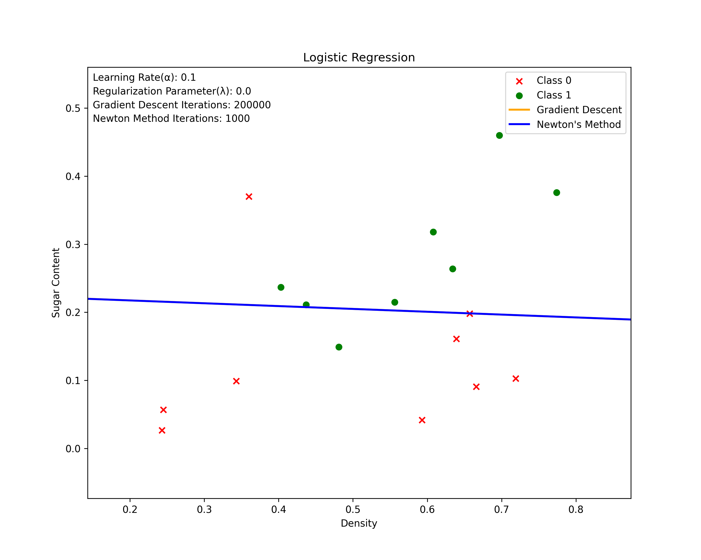

# 机器学习与数据挖掘 实验报告


## 1 实验题目

牛顿法和梯度下降法实现对数几率回归


## 2 理论基础

> 包含对梯度下降法和牛顿法的数学公式推导

### 2.1 对率回归模型与损失函数

对率回归（Logistic Regression）是一种广泛用于分类问题的算法，特别是二分类问题。在对率回归中，我们假设给定特征$x$条件下，目标变量$y$（取值为0或1）服从伯努利分布。模型的目标是预测给定$x$时$y=1$的概率。

#### 2.1.1 伯努利分布

伯努利分布是最简单的离散分布之一，描述了一个只有两种可能结果的单次实验，其概率质量函数（PMF）为：
$$
P(y|\pi) = \pi^y (1-\pi)^{1-y}
$$
其中，$\pi$是$y=1$的概率，$y \in \{0, 1\}$。

#### 2.1.2 对率回归模型

对率回归模型试图通过特征$x$来预测$y=1$的概率$\pi$，即$\pi = P(y=1|x;\theta)$。为了将线性模型$\theta^T x$的输出映射到[0,1]区间（概率值应在此区间内），我们使用Sigmoid函数$\sigma(z)$作为映射函数：
$$
\pi(x) = \sigma(\theta^T x) = \frac{1}{1 + e^{-\theta^T x}}
$$

#### 2.1.3 对数似然函数

给定训练数据集$\{(x^{(i)}, y^{(i)}); i = 1, \dots, m\}$，我们可以定义似然函数$L(\theta)$，表示在参数$\theta$下观察到当前训练集的概率：
$$
L(\theta) = \prod_{i=1}^{m} P(y^{(i)}|x^{(i)};\theta) = \prod_{i=1}^{m} \left(\sigma(\theta^T x^{(i)})\right)^{y^{(i)}} \left(1-\sigma(\theta^T x^{(i)})\right)^{1-y^{(i)}}
$$

#### 2.1.4 对数似然

为了简化求解，我们通常对似然函数取对数得到对数似然函数：
$$
\log L(\theta) = \sum_{i=1}^{m} \left[ y^{(i)} \log \sigma(\theta^T x^{(i)}) + (1-y^{(i)}) \log (1-\sigma(\theta^T x^{(i)})) \right]
$$

#### 2.1.5 损失函数

在对率回归中，目标是最大化对数似然函数。然而，在机器学习中，定义一个损失函数来最小化。因此，将对数似然的符号取反，得到损失函数$J(\theta)$，也称为对数损失函数：
$$
J(\theta) = -\frac{1}{m} \log L(\theta) = -\frac{1}{m} \sum_{i=1}^{m} \left[ y^{(i)} \log \sigma(\theta^T x^{(i)}) + (1-y^{(i)}) \log (1-\sigma(\theta^T x^{(i)})) \right]
$$

### 2.2 梯度下降法

在对率回归中，目标是找到参数$\theta$，使得损失函数$J(\theta)$最小化。梯度下降法是一种常用的优化算法，通过迭代更新$\theta$来减少$J(\theta)$的值。

#### 2.2.1 梯度的计算

为了使用梯度下降法，需要计算损失函数$J(\theta)$关于参数$\theta_j$的偏导数，即梯度：
$$
\frac{\partial J(\theta)}{\partial \theta_j} = -\frac{1}{m} \sum_{i=1}^{m} \left[ (y^{(i)} - \sigma(\theta^T x^{(i)})) x_j^{(i)} \right]
$$

> 推导过程如下：
>
> 首先，需要对Sigmoid函数$\sigma(z)$求导：
>
> $$
> \frac{d}{dz} \sigma(z) = \sigma(z)(1 - \sigma(z))
> $$
>
> 然后，考虑到$z = \theta^T x^{(i)}$，对$J(\theta)$关于$\theta_j$的偏导可以写作：
> $$
> \begin{align*}
> \frac{\partial J(\theta)}{\partial \theta_j} &= -\frac{1}{m} \sum_{i=1}^{m} \left[ y^{(i)} \frac{1}{\sigma(\theta^T x^{(i)})} - (1-y^{(i)}) \frac{1}{1 - \sigma(\theta^T x^{(i)})} \right] \frac{\partial}{\partial \theta_j} \sigma(\theta^T x^{(i)}) \\
> &= -\frac{1}{m} \sum_{i=1}^{m} \left[ y^{(i)} \frac{1}{\sigma(\theta^T x^{(i)})} - (1-y^{(i)}) \frac{1}{1 - \sigma(\theta^T x^{(i)})} \right] \sigma(\theta^T x^{(i)})(1 - \sigma(\theta^T x^{(i)})) x_j^{(i)} \\
> &= -\frac{1}{m} \sum_{i=1}^{m} \left[ (y^{(i)} - \sigma(\theta^T x^{(i)})) x_j^{(i)} \right]
> \end{align*}
> $$

#### 2.2.2 参数更新规则

有了梯度的表达式，可以使用梯度下降法更新$\theta$：
$$
\theta_j := \theta_j - \alpha \frac{\partial J(\theta)}{\partial \theta_j}
$$
其中$\alpha$是学习率，控制了更新步长的大小。

对于所有$j$，这个过程是同步进行的。通过迭代地执行这个更新规则，我们可以找到使损失函数$J(\theta)$最小化的$\theta$值。

### 2.3 牛顿法的推导

牛顿法（也称为牛顿-拉弗森方法）是一种在机器学习中用于优化损失函数的强大算法，尤其适用于对率回归。它通过利用损失函数的一阶导数（梯度）和二阶导数（Hessian矩阵），迭代更新参数$\theta$，以快速找到损失函数的最小值。

#### 2.3.1 梯度（一阶导数）

对率回归的损失函数 \(J(\theta)\) 定义为：
$$
J(\theta) = -\frac{1}{m} \sum_{i=1}^{m} \left[ y^{(i)} \log(\sigma(\theta^T x^{(i)})) + (1-y^{(i)}) \log(1-\sigma(\theta^T x^{(i)})) \right]
$$
其中，$\sigma(z) = \frac{1}{1 + e^{-z}}$ 是Sigmoid函数。

损失函数对参数 $\theta_j$ 的一阶导数（梯度）为：
$$
\frac{\partial J(\theta)}{\partial \theta_j} = -\frac{1}{m} \sum_{i=1}^{m} \left[ (y^{(i)} - \sigma(\theta^T x^{(i)})) x_j^{(i)} \right]
$$

#### 2.3.2 Hessian矩阵（二阶导数）

牛顿法的关键在于计算损失函数的Hessian矩阵。对于对率回归，Hessian矩阵$H$的元素由下式给出：
$$
H_{jk} = \frac{\partial^2 J(\theta)}{\partial \theta_j \partial \theta_k} = \frac{1}{m} \sum_{i=1}^{m} \sigma(\theta^T x^{(i)}) (1 - \sigma(\theta^T x^{(i)})) x_j^{(i)} x_k^{(i)}
$$
这里，$H_{jk}$是Hessian矩阵的$(j,k)$元素。

> 推导过程如下：
>
> Hessian矩阵的元素 \(H_{jk}\) 由损失函数的二阶偏导数构成，计算如下：
> 
> $$
> H_{jk} = \frac{\partial^2 J(\theta)}{\partial \theta_j \partial \theta_k}
> $$
> 根据链式法则，我们首先对 $\sigma(\theta^T x^{(i)})$ 的导数进行计算，得到：
> $$
> \frac{d}{dz} \sigma(z) = \sigma(z)(1 - \sigma(z))
> $$
> 由此，我们可以计算损失函数对于 $\theta_j$ 和 $\theta_k$的二阶偏导数：
> $$
> \frac{\partial}{\partial \theta_k} \left(-\frac{\partial J(\theta)}{\partial \theta_j}\right) = \frac{\partial}{\partial \theta_k} \left( \frac{1}{m} \sum_{i=1}^{m} \sigma(\theta^T x^{(i)})(1 - \sigma(\theta^T x^{(i)})) x_j^{(i)} \right)
> $$
> 考虑到 $\theta^T x^{(i)}$ 对 $\theta_k$ 的偏导是 $x_k^{(i)}$，我们有：
> $$
> H_{jk} = \frac{1}{m} \sum_{i=1}^{m} \sigma(\theta^T x^{(i)})(1 - \sigma(\theta^T x^{(i)})) x_j^{(i)} x_k^{(i)}
> $$


推导过程涉及到计算二阶导数，考虑到$\sigma(z)(1-\sigma(z))$是Sigmoid函数关于$z$的导数，我们利用链式法则得到上述表达式。

#### 2.3.3 参数更新规则

在牛顿法中，参数 $\theta$ 的更新规则利用了Hessian矩阵 \($H$\) 和梯度 $\nabla_{\theta} J(\theta)$：
$$
\theta := \theta - H^{-1} \nabla_{\theta} J(\theta)
$$
这样的更新规则考虑到了损失函数的曲率，能够加速收敛到最小值点。


## 3 算法设计与实现

### 3.1 算法设计

#### 3.1.1 梯度下降

1. **初始化参数**：
   
   - 权重 `w` 和偏置 `b` 初始化为零或小随机数。
   - 设置学习率 $\alpha$ 和迭代次数 `num_iterations`。
   
2. **迭代更新参数**：
   - 对于每次迭代：
     - 计算当前参数下的梯度：
       $$
       \frac{\partial J(\theta)}{\partial \theta_j} = -\frac{1}{m} \sum_{i=1}^{m} \left[ (y^{(i)} - \sigma(\theta^T x^{(i)})) x_j^{(i)} \right] + \frac{\lambda}{m} w_j
       $$
       
       > 引入正则化，防止过拟合
       
     - 更新权重和偏置项：
       $$
       \theta_j := \theta_j - \alpha \frac{\partial J(\theta)}{\partial \theta_j}
       $$
       $$
       b := b - \alpha \frac{1}{m} \sum_{i=1}^{m} (y^{(i)} - \sigma(\theta^T x^{(i)}))
       $$
   
3. **重复步骤2**直到达到迭代次数或损失函数收敛。

#### 3.1.2 牛顿法

1. **初始化参数**：
   - 同梯度下降法。

2. **迭代更新参数**：
   - 对于每次迭代：
     - 计算梯度和Hessian矩阵：
       $$
       H_{jk} = \frac{1}{m} \sum_{i=1}^{m} \sigma(\theta^T x^{(i)})(1 - \sigma(\theta^T x^{(i)})) x_j^{(i)} x_k^{(i)}
       $$
     - 更新权重：
       $$
       \theta := \theta - H^{-1} \nabla_{\theta} J(\theta)
       $$

3. **重复步骤2**直到达到迭代次数或损失函数收敛。

### 3.2 算法实现

#### 3.2.1 准备工作

- 导入必要的库：`math`, `pandas`, `numpy`, `matplotlib.pyplot`。
- 实现`sigmoid`函数和`compute_cost`函数。
- 准备数据集。

#### 3.2.2 梯度下降实现

- 按照上述设计，实现`compute_gradient`和`gradient_descent`函数。
- 使用`train_gradient_descent`函数初始化参数，并进行模型训练。

#### 3.2.3 牛顿法实现

- 实现`compute_newton_update`函数以计算每一步的参数更新量。
- 通过`newton_method`函数进行迭代更新。
- 使用`train_newton_method`函数初始化参数并开始训练。

#### 3.2.4 绘制决策边界

- 使用`plot_decision_boundaries`函数绘制训练好的模型参数的决策边界。


## 4 实验设计、结果与分析

### 4.1 数据集

- 西瓜数据集 3.0α

### 4.2 实验环境

- Python版本：3.8
- 依赖库：
  - `numpy`
  - `matplotlib`
  - `pandas`
  - `math`

### 4.3 实验设计

#### 4.3.1 实验目的

本实验旨在比较和分析梯度下降法与牛顿法在对率回归中的表现，包括算法的收敛速度、损失函数最终值、决策边界质量等方面。通过设置不同的**学习率（*α*）**、**正则化参数（*λ*）**和 **迭代次数**，我们评估这两种优化方法在统计模型训练中的效率和效果。

#### 4.3.2 参数设置

1. **学习率** (*α*)
   - 对于梯度下降法，学习率的大小直接影响到算法的收敛速度和是否能够收敛到全局最小。
   - 考虑不同的学习率，如0.01, 0.05, 0.1，以观察其对梯度下降法收敛速度和稳定性的影响。
2. **正则化参数** (*λ*)
   - 控制模型的复杂度，防止过拟合，对最终模型的泛化能力有重要影响。
   - 设置不同的正则化强度，如0, 0.01, 0.1，以研究正则化对过拟合控制和模型性能的影响。
3. **迭代次数**
   - 对于两种方法，迭代次数的多少会影响到模型的训练程度和损失函数的收敛状态。
   - 足够多的迭代次数确保算法达到收敛，如1000, 10000, 100000迭代。

#### 4.3.3 实验步骤

1. **数据准备**：
   - 使用西瓜数据集3.0α，包括密度和含糖量两个特征，及其标签。
2. **模型训练**：
   - 对每一组参数（学习率和正则化参数组合），使用梯度下降法和牛顿法训练对率回归模型。
   - 记录每次迭代的损失值和最终模型参数。
3. **决策边界绘制**：
   - 对选定的参数设置，绘制模型的决策边界和训练数据点，以直观展示模型的分类效果。
4. **损失收敛图绘制**：
   - 对每种参数配置，绘制损失值随迭代次数的变化图，以评估模型收敛行为。

### 4.4 实验结果

#### 4.4.1 确定迭代次数

为确定合适的迭代次数，我们将两个方法的迭代次数设置较大，保证模型可以充分学习，以寻找合适的迭代次数，避免过小或过大的迭代次数影响实验。从算法分析，我们可以知道牛顿法采用了二阶收敛，相对于梯度下降的一阶收敛更快速，故给牛顿法设置更小的迭代次数。同时，对于后续需要设置的学习率与正则化参数，设置为一般机器学习算法中这两个参数常见的数值：*0.01*。

- 梯度下降迭代次数：*300000*
- 牛顿法迭代次数：*1000*

**损失收敛情况**


根据收敛图像显示，我们可以看到梯度下降法的损失值下降较为平缓，需要相当多的迭代次数来收敛；而牛顿法的损失值则迅速下降，在很少的迭代次数后就趋于稳定。

##### 梯度下降法

对于梯度下降法，考虑到损失值在大约150,000次迭代后变化很小，这表明此时损失已经接近最小值，而更多的迭代并没有带来显著的改进，同时过多的迭代次数会增加大量的计算成本。因此，一个合理的迭代次数可能在150,000到200,000之间。这个区间内，可以更细致地观察损失值是否有实质性的下降来确定一个更精确的迭代次数。

<u>故梯度下降法的迭代次数设置为：***200000***</u>

##### 牛顿法

牛顿法显示在1000次迭代内损失值迅速下降并稳定。因此，迭代次数可以设置在这个范围或稍微高一些以确保稳定性。

<u>故牛顿法的迭代次数设置为：***1000***</u>

#### 4.4.2 确定学习率

梯度下降算法中涉及到了学习率，故只针对梯度下降法进行讨论

| 学习率 | 损失值（迭代结束后） | 损失收敛图像                                                 |
| ------ | -------------------- | ------------------------------------------------------------ |
| 0.001  | 0.5398               |  |
| 0.01   | 0.4689               |  |
| 0.1    | 0.4685               |  |

<u>因此，确定学习率为：***0.1***</u>

#### 4.4.3 确定正则化参数

梯度下降算法中涉及到了正则化参数，故只针对梯度下降法进行讨论

| 正则化参数 | 损失值（迭代结束后） | 损失收敛图像                                                 |
| ---------- | -------------------- | ------------------------------------------------------------ |
| 0          | 0.4685               |  |
| 0.01       | 0.5113               |  |
| 0.1        | 0.6112               |  |

<u>因此，确定正则化参数为：***0***</u>

#### 4.4.4 决策边界

**参数设置**：

| 学习率 | 正则化参数 | 梯度下降迭代次数 | 牛顿法迭代次数 | 梯度下降损失值 | 牛顿法损失值 |
| ------ | ---------- | ---------------- | -------------- | -------------- | ------------ |
| 0.1    | 0          | 200000           | 1000           | 0.4685         | 0.4685       |

**决策边界结果图**：



### 4.5 结果分析

#### 4.5.1 参数分析

- **学习率（α）**：选择了0.1，这在梯度下降法中是相对较大的学习率，意味着模型在训练初期可以快速收敛。通常来说学习率选取0.01，不宜过大，否则会出现收敛函数震荡的情况。这里0.1效果优于0.01主要由于**数据集较小**，模型的训练十分简单，**更大的学习率则能更快且稳定的收敛**。
- **正则化参数（λ）**：设置为0，表明在这个实验中没有使用正则化。无正则化通常有过拟合的风险，这里因为**数据集十分简单**，所以**不进行正则化的拟合效果更优**。
- **迭代次数**：梯度下降法设置了200,000次迭代，牛顿法设置了1,000次。这个迭代次数对于梯度下降法来说可能是充分的，确保了模型能够达到收敛。对于牛顿法，迭代次数显著少于梯度下降法，这反映了**牛顿法在收敛速度上的优势**。

#### 4.5.2 损失值比较

- 两种方法的最终损失值相同（0.4685），这表明在这组特定的参数设置下，它们在训练集上有相似的性能。

#### 4.5.3 决策边界分析

- 决策边界图显示了梯度下降法和牛顿法得到的分类边界。
- 从图像上看，两种方法得到的决策边界非常接近，这与损失值相同是一致的。
- 两种方法的**决策边界都是直线**，这是对率回归模型的典型特征，因为它是线性分类器。
- 根据所提供的数据点分布，决策边界似乎将两个类别分开得相当合理。然而，我们也可以看到决策边界下方有几个绿色点（类别1），表明模型可能无法完美地分类所有数据点。

#### 4.5.4 总体分析

- 在未进行正则化的情况下，两种方法都达到了相似的损失值，并得出了相近的决策边界，这可能表明对于当前较为简单的数据集，**模型是合适的**。
- 由于牛顿法在迭代次数显著少于梯度下降法的情况下达到了相似的性能，这进一步证明了**牛顿法在计算效率方面的优势**。


## 5 总结

在本次实验中，我们对比了梯度下降法和牛顿法在对率回归中的表现。实验结果显示，当学习率设置为0.1且不使用正则化时（λ=0），梯度下降法需要大约200,000次迭代才能收敛，而牛顿法仅需要1,000次。尽管迭代次数差异显著，两种方法在训练集上达到了相同的损失值（0.4685），并且产生了几乎重合的决策边界，这表明在当前数据集和参数设置下，它们具有相似的性能。

这一发现表明，牛顿法因其更快的收敛速度而在计算效率上优于梯度下降法。然而，由于每次迭代牛顿法的计算成本通常更高，因此在实际应用中选择算法时，仍需要考虑数据规模和计算资源的限制。此外，决策边界的分析表明两种方法均能有效地区分数据集中的不同类别，但在最终确定模型优势之前，仍需在独立测试集上进行性能验证。


## 附录：源码

###### LogisticRegression_GradientDescent.py

```python
import math
import pandas as pd
import numpy as np
import matplotlib.pyplot as plt
from utils import sigmoid, compute_cost


def compute_gradient(X, y, w, b, lambda_=0.0):
    m = X.shape[0]
    Z = np.dot(X, w) + b
    A = sigmoid(Z)
    error = A - y
    dj_dw = (1 / m) * np.dot(X.T, error) + (lambda_ / m) * w
    dj_db = (1 / m) * np.sum(error)
    return dj_db, dj_dw


def gradient_descent(X, y, w_in, b_in, cost_function, gradient_function, alpha, num_iterations, lambda_=0.0):
    cost_history = []

    for i in range(num_iterations):
        dj_db, dj_dw = gradient_function(X, y, w_in, b_in, lambda_)
        w_in = w_in - alpha * dj_dw
        b_in = b_in - alpha * dj_db

        cost = cost_function(X, y, w_in, b_in, lambda_)
        cost_history.append((i, cost))

        if i % math.ceil(num_iterations / 10) == 0 or i == (num_iterations - 1):
            print(f"[Gradient Descent] Iteration {i:4}: cost {float(cost):.4f}   ")

    return w_in, b_in, cost_history


def train_gradient_descent(X, y, alpha, num_iterations, lambda_):
    m, n = X.shape

    # 增加一个特征维度以匹配w的形状
    X = np.hstack((X, np.ones((m, 1))))  # 添加偏置项对应的x0=1

    # 初始化参数
    initial_w = np.zeros(n + 1)
    initial_b = 0

    # 训练模型
    w, b, cost_history = gradient_descent(X, y, initial_w, initial_b, compute_cost, compute_gradient, alpha,
                                          num_iterations, lambda_)

    return w, b, cost_history


if __name__ == '__main__':
    df = pd.read_csv('../data/watermelon3.0alpha.csv')
    X = df[['density', 'Sugar_content']].values
    y = df['label'].values
    m, n = X.shape

    # 训练模型
    w, b = train_gradient_descent(X, y, alpha=0.01, num_iterations=100000, lambda_=0.03)

    # 绘制原始数据的散点图
    plt.scatter(X[y == 0][:, 0], X[y == 0][:, 1], color='red', label='Class 0')
    plt.scatter(X[y == 1][:, 0], X[y == 1][:, 1], color='blue', label='Class 1')

    # 绘制决策边界
    x_values = [np.min(X[:, 0] - 0.1), np.max(X[:, 0] + 0.1)]
    y_values = - (b + np.dot(w[0], x_values)) / w[1]
    plt.plot(x_values, y_values, label='Gradient Descent')

    plt.xlabel('Density')
    plt.ylabel('Sugar Content')
    plt.title("Logistic Regression")
    plt.legend()
    plt.show()
```

###### LogisticRegression_Newton.py

```python
import math
import pandas as pd
import numpy as np
from numpy.linalg import inv
import matplotlib.pyplot as plt
from utils import sigmoid, compute_cost


def compute_newton_update(X, y, w, b):
    m = X.shape[0]
    Z = np.dot(X, w) + b
    A = sigmoid(Z)
    error = A - y

    # 计算梯度
    gradient_w = (1 / m) * np.dot(X.T, error)
    gradient_b = (1 / m) * np.sum(error)

    # 计算Hessian矩阵
    S = np.diag(A * (1 - A))
    H = np.dot(np.dot(X.T, S), X) / m

    # 更新参数
    w_update = np.dot(inv(H), gradient_w)
    b_update = gradient_b

    return w_update, b_update


def newton_method(X, y, initial_w, initial_b, num_iterations):
    w = initial_w
    b = initial_b
    cost_history = []

    for i in range(num_iterations):
        w_update, b_update = compute_newton_update(X, y, w, b)
        w -= w_update
        b -= b_update

        cost = compute_cost(X, y, w, b)
        cost_history.append((i, cost))

        if i % math.ceil(num_iterations / 10) == 0 or i == (num_iterations-1):
            print(f"[Newton Method] Iteration {i:4}: cost {float(cost):.4f}")

    return w, b, cost_history


def train_newton_method(X, y, num_iterations):
    m, n = X.shape

    # 初始化参数
    initial_w = np.zeros(n)
    initial_b = 0

    # 训练模型
    w, b, cost_history = newton_method(X, y, initial_w, initial_b, num_iterations)

    return w, b, cost_history


if __name__ == '__main__':
    df = pd.read_csv('../data/watermelon3.0alpha.csv')
    X = df[['density', 'Sugar_content']].values
    y = df['label'].values
    m, n = X.shape

    # 训练模型
    w, b = train_newton_method(X, y, num_iterations=500)

    # 绘制原始数据的散点图
    plt.scatter(X[y == 0][:, 0], X[y == 0][:, 1], color='red', label='Class 0')
    plt.scatter(X[y == 1][:, 0], X[y == 1][:, 1], color='blue', label='Class 1')

    # 绘制决策边界
    x_values = np.array([np.min(X[:, 0] - 0.1), np.max(X[:, 0] + 0.1)])
    y_values = - (b + np.dot(w[0], x_values)) / w[1]
    plt.plot(x_values, y_values, label='Newton Method')

    plt.xlabel('Density')
    plt.ylabel('Sugar Content')
    plt.title("Logistic Regression")
    plt.legend()
    plt.show()
```

###### Utils.py

```python
import numpy as np


def sigmoid(z):
    return 1 / (1 + np.exp(-z))


def compute_cost(X, y, w, b, lambda_=0.0):
    m = X.shape[0]
    Z = np.dot(X, w) + b
    A = sigmoid(Z)
    loss = -y * np.log(A) - (1 - y) * np.log(1 - A)
    total_cost = (1 / m) * np.sum(loss)
    regularization = (lambda_ / (2 * m)) * np.sum(np.square(w))
    total_cost += regularization

    return total_cost
```

###### main.py

```python
from src.LogisticRegression_GradientDescent import train_gradient_descent
from src.LogisticRegression_Newton import train_newton_method
from utils import sigmoid
from datetime import datetime
import pandas as pd
import matplotlib.pyplot as plt
import numpy as np


learning_rate = 0.1
reg_param = 0.0
num_iterations_gd = 200000
num_iterations_nt = 1000


def plot_decision_boundaries(X, y, w_gd, b_gd, w_nt, b_nt):
    # 设置图像大小
    plt.figure(figsize=(10, 8))

    # 生成网格点的坐标矩阵
    x_min, x_max = X[:, 0].min() - 0.1, X[:, 0].max() + 0.1
    y_min, y_max = X[:, 1].min() - 0.1, X[:, 1].max() + 0.1
    xx, yy = np.meshgrid(np.linspace(x_min, x_max, 1000), np.linspace(y_min, y_max, 1000))

    # 预测网格点的值-梯度下降法
    Z_gd = sigmoid(np.dot(np.c_[xx.ravel(), yy.ravel(), np.ones_like(xx.ravel())], w_gd) + b_gd)
    Z_gd = Z_gd.reshape(xx.shape)

    # 预测网格点的值-牛顿法
    Z_nt = sigmoid(np.dot(np.c_[xx.ravel(), yy.ravel()], w_nt) + b_nt)
    Z_nt = Z_nt.reshape(xx.shape)

    # 绘制等高线图-梯度下降法
    plt.contour(xx, yy, Z_gd, levels=[0.5], linestyles="solid", colors='orange', linewidths=2)

    # 绘制等高线图-牛顿法
    plt.contour(xx, yy, Z_nt, levels=[0.5], linestyles="solid", colors='blue', linewidths=2)

    # 绘制原始数据的散点图
    plt.scatter(X[y == 0][:, 0], X[y == 0][:, 1], color='red', marker='x', label='Class 0')
    plt.scatter(X[y == 1][:, 0], X[y == 1][:, 1], color='green', marker='o', label='Class 1')

    # 为了图例正确显示决策边界
    plt.plot([], [], color='orange', linewidth=2, linestyle="solid", label='Gradient Descent')
    plt.plot([], [], color='blue', linewidth=2, linestyle="solid", label="Newton's Method")

    # 显示图例
    plt.legend()

    # 打印参数
    plt.text(0.15, 0.54, f'Learning Rate(α): {learning_rate}', fontsize=10)
    plt.text(0.15, 0.52, f'Regularization Parameter(λ): {reg_param}', fontsize=10)
    plt.text(0.15, 0.50, f'Gradient Descent Iterations: {num_iterations_gd}', fontsize=10)
    plt.text(0.15, 0.48, f'Newton Method Iterations: {num_iterations_nt}', fontsize=10)

    plt.xlabel('Density')
    plt.ylabel('Sugar Content')
    plt.title("Logistic Regression")
    current_time = datetime.now().strftime('%Y-%m-%d_%H-%M-%S')
    plt.savefig(f'../fig/Logistic_Regression_{current_time}.png', dpi=300)
    plt.show()


def plot_cost_history(cost_history_gd, cost_history_nt):
    iterations_gd, costs_gd = zip(*cost_history_gd)
    iterations_nt, costs_nt = zip(*cost_history_nt)

    fig, axs = plt.subplots(1, 2, figsize=(20, 8))

    # 绘制梯度下降法的损失值变化
    axs[0].plot(iterations_gd, costs_gd, label='Gradient Descent', color='blue', linewidth=2)
    axs[0].set_title('Gradient Descent Cost History Over Iterations')
    axs[0].set_xlabel('Iteration')
    axs[0].set_ylabel('Cost')
    axs[0].legend()
    axs[0].grid(True)
    # axs[0].set_yscale('log')

    # 绘制牛顿法的损失值变化
    axs[1].plot(iterations_nt, costs_nt, label="Newton's Method", color='red', linewidth=2)
    axs[1].set_title("Newton's Method Cost History Over Iterations")
    axs[1].set_xlabel('Iteration')
    axs[1].set_ylabel('Cost')
    axs[1].legend()
    axs[1].grid(True)
    # axs[1].set_yscale('log')

    plt.tight_layout()
    current_time = datetime.now().strftime('%Y-%m-%d_%H-%M-%S')
    plt.savefig(f'../fig/Cost_History_{current_time}.png', dpi=600)
    plt.show()


def plot_cost_history_gd(cost_history_gd):
    iterations_gd, costs_gd = zip(*cost_history_gd)

    plt.figure(figsize=(10, 8))

    # 绘制梯度下降法的损失值变化
    plt.plot(iterations_gd, costs_gd, label='Gradient Descent', color='blue', linewidth=2)
    plt.title('Gradient Descent Cost History Over Iterations')
    plt.xlabel('Iteration')
    plt.ylabel('Cost')
    plt.legend()
    plt.grid(True)
    # plt.yscale('log')

    current_time = datetime.now().strftime('%Y-%m-%d_%H-%M-%S')
    plt.savefig(f'../fig/Cost_History_Gradient_Descent_{current_time}.png', dpi=300)
    plt.show()


if __name__ == '__main__':
    df = pd.read_csv('../data/watermelon3.0alpha.csv')
    X = df[['density', 'Sugar_content']].values
    y = df['label'].values
    m, n = X.shape

    # 梯度下降法训练模型
    w_gd, b_gd, cost_history_gd = train_gradient_descent(X, y, alpha=learning_rate, num_iterations=num_iterations_gd, lambda_=reg_param)

    # 牛顿法训练模型
    w_nt, b_nt, cost_history_nt = train_newton_method(X, y, num_iterations=num_iterations_nt)

    # 绘制原始数据的散点图以及两种方法的决策边界
    plot_decision_boundaries(X, y, w_gd, b_gd, w_nt, b_nt)

    # 绘制损失函数收敛情况
    plot_cost_history(cost_history_gd, cost_history_nt)
    plot_cost_history_gd(cost_history_gd)
```
