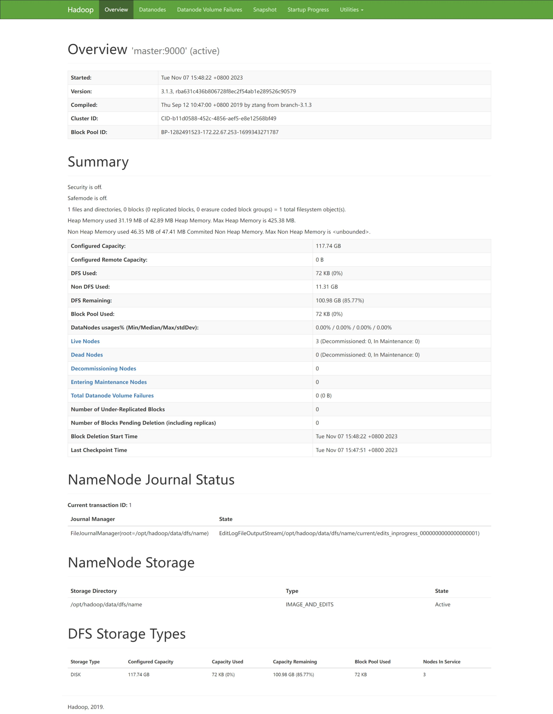
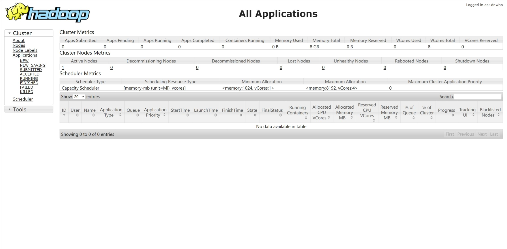

# 实验记录

## I. 实验名称

配置Hadoop的分布式环境

## II. 实验目的

本次实验通过安装Hadoop的完全分布式环境，学习Hadoop的完全分布式结构，理解Hadoop分布式存储方式，掌握Hadoop完全分布式配置方法以及HDFS的使用。

## III. 实验内容

1. 内容配置Hadoop的分布式环境，可以先配置伪分布式环境，然后配置完全分布式环境
2. 在Hadoop上学习使用HDFS，方式为使用HDFS若干条代表性命令
3. 利用虚拟机/服务器，配置Hadoop的完全分布式环境

## IV. 实验思路与结构

通过3台阿里云服务器搭建完全分布式Hadoop集群

### 1 实验环境

- 3台阿里云服务器
  - 主机：master
    - 公网IP：`121.40.109.195`
    - 私网IP：`172.22.67.253`
  - 从机1：slave01
    - 公网IP：`120.55.75.214`
    - 私网IP：`172.22.67.254`
  - 从机2：slave02
    - 公网IP：`120.26.219.9`
    - 私网IP：`172.22.67.255`
- 服务器操作系统：CentOS 7.9
- JAVA版本：JDK 1.8.0_151
- Hadoop版本：Hadoop 3.1.3

### 2 集群规划

|             |         master         |   slave01   |             slave02              |
| :---------: | :--------------------: | :---------: | :------------------------------: |
|  **HDFS**   | NameNode<br />DataNode |  DataNode   |             DataNode             |
|  **YARN**   |      NodeManager       | NodeManager | RecourceManager<br />NodeManager |
| **History** |     HistoryServer      |             |                                  |

### 3 安装JDK

在3台服务器上都安装JDK并配置环境变量，即每台服务器都进行以下操作。

1. 下载JDK1.8安装包
   ``` bash
   wget --no-check-certificate https://repo.huaweicloud.com/java/jdk/8u151-b12/jdk-8u151-linux-x64.tar.gz
   ```

2. 解压下载的JDK1.8安装包

   ```bash
   tar -zxvf jdk-8u151-linux-x64.tar.gz
   ```

3. 移动并重命名JDK包

   ```bash
   mv jdk1.8.0_151/ /usr/java8
   ```

4. 配置Java环境变量

   ``` bash
   echo 'export JAVA_HOME=/usr/java8' >> /etc/profile
   echo 'export PATH=$PATH:$JAVA_HOME/bin' >> /etc/profile
   source /etc/profile
   ```

5. 查看Java是否成功安装

   ``` bash
   java -version
   ```

### 4 安装Hadoop

在3台服务器上都安装Hadoop并配置环境变量，即每台服务器都进行以下操作。

1. 下载Hadoop安装包

   ```bash
   wget --no-check-certificate https://repo.huaweicloud.com/apache/hadoop/common/hadoop-3.1.3/hadoop-3.1.3.tar.gz
   ```

2. 解压Hadoop安装包至 `/opt/hadoop`

   ``` bash
   tar -zxvf hadoop-3.1.3.tar.gz -C /opt/
   mv /opt/hadoop-3.1.3 /opt/hadoop
   ```

3. 配置Hadoop环境变量

   ``` bash
   echo 'export HADOOP_HOME=/opt/hadoop/' >> /etc/profile
   echo 'export PATH=$PATH:$HADOOP_HOME/bin' >> /etc/profile
   echo 'export PATH=$PATH:$HADOOP_HOME/sbin' >> /etc/profile
   source /etc/profile    
   ```

4. 修改配置文件 `yarn-env.sh`、`hadoop-env.sh`、`mapred-env.sh`

   ``` bash
   echo "export JAVA_HOME=/usr/java8" >> /opt/hadoop/etc/hadoop/yarn-env.sh
   echo "export JAVA_HOME=/usr/java8" >> /opt/hadoop/etc/hadoop/hadoop-env.sh
   echo "export JAVA_HOME=/usr/java8" >> /opt/hadoop/etc/hadoop/mapred-env.sh
   ```

5. 测试Hadoop是否安装成功

   ``` bash
   hadoop version
   ```

### 5 设置SSH免密钥访问

#### 5.1 免密登录原理


#### 5.2 设置无密钥访问

需要分别对master、slave01、slave02三台服务器都进行设置，使其都可以无密钥访问其他的主机

1. 修改主机名

   ``` bash
   vim /etc/hostsname
   ```

   将默认值删掉改为自己角色主机名

   - 主机设置为：

      ``` 
      master
      ```

   - 从机1设置为：

      ```
      slave01
      ```

   - 从机2设置为：

      ```
      slave02
      ```

2. 关闭防火墙并禁止防火墙开机自启

   ``` bash
   systemctl stop firewalld # 关闭防火墙
   systemctl disable firewalld.service # 禁用防火墙开机自启
   ```

3. 配置主机映射

   ``` bash
   vim /etc/hosts
   ```

   添加当前服务器的内网IP，以及另外两台服务器的外网IP

   - 主机添加：

     ```
     172.22.67.253 master
     120.55.75.214 slave01
     120.26.219.9 slave02
     ```

   - 从机1添加：

     ```
     172.22.67.254 slave01
     121.40.109.195 master
     120.26.219.9 slave02
     ```

   - 从机2添加：

     ```
     172.22.67.255 slave02
     121.40.109.195 master
     120.55.75.214 slave01
     ```

4. 创建密钥

   ``` bash
   ssh-keygen -t rsa
   ```

   此处连续3个回车完成设置

5. 发送密钥

   ``` bash
   ssh-copy-id master
   ssh-copy-id slave01
   ssh-copy-id slave02
   ```

6. 测试无密钥访问

   ``` bash
   ssh master
   ssh slave01
   ssh slave02
   ```

7. ssh连接其他服务器后退回当前服务器

   ``` bash
   exit
   ```

### 6 配置Hadoop

> 此步骤在主机上进行

#### 6.1 在主机配置Hadoop相关配置文件

- `/opt/hadoop/etc/hadoop` 路径下的配置文件

  进入该路径：

  ``` bash
  cd /opt/hadoop/etc/hadoop
  ```

  1. 配置 `core-site.xml`

     ``` bash
     vim core-site.xml
     ```

     ``` xml
     <configuration>
     <property>
         <name>hadoop.tmp.dir</name>
         <value>/opt/hadoop/data</value>
     </property>
     <property>
         <name>fs.defaultFS</name>
         <value>hdfs://master:9000</value>
     </property>
     </configuration>
     ```

  2. 配置 `hdfs-site.xml`

     ``` bash
     vim hdfs-site.xml
     ```

     ``` xml
     <configuration>
     <property>
         <name>dfs.replication</name>
         <value>3</value>
     </property>
     <property>
     	<name>dfs.namenode.http-address</name>
      	<value>master:50070</value>
     </property>
     <property>
     	<name>dfs.namenode.secondary.http-address</name>
     	<value>slave01:50090</value>
     </property>
     <property>
         <name>dfs.permissions.enabled</name>
         <value>false</value>
     </property>
     </configuration>
     ```

  3. 配置 `mapred-site.xml`

     ``` bash
     vim mapred-site.xml
     ```

     ``` xml
     <configuration>
     <property>
     	<name>mapreduce.framework.name</name>
     	<value>yarn</value>
     </property>
     <property>
         <name>mapreduce.jobhistory.address</name>
         <value>master:10020</value>
     </property>
     <property>
         <name>mapreduce.jobhistory.webapp.address</name>
         <value>master:19888</value>
     </property>
     </configuration>
     ```

  4. 配置 `yarn-site.xml`

     ``` bash
     vim yarn-site.xml
     ```

     ``` xml
     <configuration>
     <property>
     	<name>yarn.nodemanager.aux-services</name>
     	<value>mapreduce_shuffle</value>
     </property>
     <property>
     	<name>yarn.resourcemanager.hostname</name>
     	<value>slave02</value>
     </property>
     <property>
         <name>yarn.log-aggregation-enable</name>
         <value>true</value>
     </property>
     <property>
         <name>yarn.log-aggregation.retain-seconds</name>
         <value>86400</value>
     </property>
     </configuration>
     ```

  5. 配置 `workers`

     ``` bash
     vim workers
     ```

     ```
     master
     slave01
     slave02
     ```

- `/opt/hadoop/sbin` 路径下的配置文件

  进入该路径；

  ``` bash
  cd /opt/hadoop/sbin
  ```

  1. 配置 `start-dfs.sh`

     ``` bash
     vim start-dfs.sh
     ```

     ``` shell
     #!/usr/bin/env bash
     HDFS_NAMENODE_USER=root
     HDFS_DATANODE_USER=root
     HDFS_SECONDARYNAMENODE_USER=root
     HDFS_DATANODE_SECURE_USER=hdfs
     ```

  2. 配置 `stop-dfs.sh`

     ``` bash
     vim stop-dfs.sh
     ```

     ``` shell
     #!/usr/bin/env bash
     HDFS_NAMENODE_USER=root
     HDFS_DATANODE_USER=root
     HDFS_SECONDARYNAMENODE_USER=root
     HDFS_DATANODE_SECURE_USER=hdfs
     ```

  3. 配置 `start-yarn.sh`

     ``` bash
     vim start-yarn.sh
     ```

     ``` shell
     #!/usr/bin/env bash
     YARN_RESOURCEMANAGER_USER=root
     YARN_NODEMANAGER_USER=root
     HDFS_DATANODE_SECURE_USER=yarn
     ```

  4. 配置 `stop-yarn.sh`

     ``` bash
     vim stop-yarn.sh
     ```

     ``` shell
     #!/usr/bin/env bash
     YARN_RESOURCEMANAGER_USER=root
     YARN_NODEMANAGER_USER=root
     HDFS_DATANODE_SECURE_USER=yarn
     ```

#### 6.2 将主机的配置分发到从机slave01和slave02上

> 注意：必须分发到root用户上，否则后面启动Hadoop时会产生权限问题
>
> scp是linux系统下基于ssh登陆进行安全的远程文件拷贝命令，scp传输是加密的
>
> `-r` 递归复制整个目录

``` bash
scp -r /opt/hadoop/etc/hadoop root@slave01:/opt/hadoop/etc/
scp -r /opt/hadoop/etc/hadoop root@slave02:/opt/hadoop/etc/
scp -r /opt/hadoop/sbin root@slave01:/opt/hadoop/
scp -r /opt/hadoop/sbin root@slave02:/opt/hadoop/
```

### 7 服务器开放端口

打开端口9000、8088和50070


### 8 格式化NameNode并启动Hadoop

> 此步骤在主机上进行

#### 8.1 格式化NameNode

``` bash
/opt/hadoop/bin/hdfs namenode -format
```

#### 8.2 启动Hadoop

1. 在master上启动HDFS

   ``` bash
   /opt/hadoop/sbin/start-dfs.sh
   ```

2. 在配置了ResourceManager的节点上启动YARN

   ResourceManager配置在了slave02上，故通过ssh连接slave02启动YARN

   ``` bash
   ssh root@slave02 /opt/hadoop/sbin/start-yarn.sh
   ```

#### 8.3 关于重复格式化NameNode与启动Hadoop的问题

若多次格式化NameNode与启动Hadoop，则每次启动后，下次启动之前需要执行：

1. 关闭进程

   ``` bash
   /opt/hadoop/sbin/stop-dfs.sh
   ssh root@slave02 /opt/hadoop/sbin/stop-yarn.sh
   ```

2. 清空数据与日志

   - 删除Hadoop的临时存储目录的内容（该目录对应到`core-site.xml`中的`hadoop.tmp.dir`的路径下的目录）
     - Hadoop的临时存储目录：`$HADOOP_HOME$/data`
   - 删除Hadoop的系统日志文件目录中的内容
     - Hadoop的系统日志文件目录：`$HADOOP_HOME$/log`

3. 格式化NameNode

   ``` bash
   /opt/hadoop/bin/hdfs namenode -format
   ```

## V. 实验结果

### 1 JPS查看成功启动的进程

1. 主机

   

2. 从机1

   

3. 从机2

   

从JPS显示的进程可以看出Hadoop已经成功启动，并且是符合集群规划的

### 2 查看Hadoop的web界面

#### 2.1 查看主机的50070端口

主机的50070端口：`121.40.109.195:50070`



#### 2.2 查看ResourceManager所在服务器的8088端口

由于ResourceManager在从机2上，故查看从机2的8088端口：`120.26.219.9:8088`


