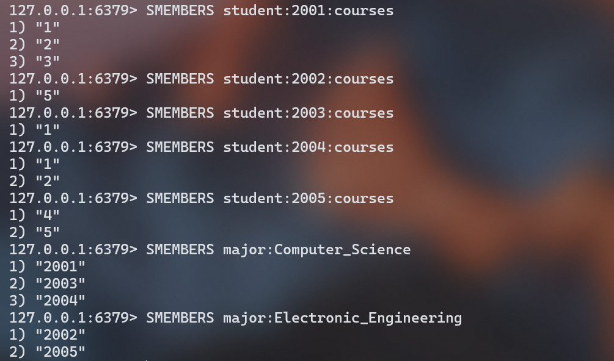

# 实验记录

## I. 实验名称

安装Redis并使用Redis数据库

## II. 实验目的

本次实验通过安装并部署Redis，配置并运行Redis，学习了Redis的基本设置和运行过程，理解了Redis在数据存储和管理方面的重要性，最终掌握了Redis的基本操作和配置方法。

## III. 实验内容

1. 安装并部署Redis、配置并运行Redis。可根据课件上的配置项，配置Redis。

2. 以Redis中的数据类型为切入点，使用各数据类型的代表性命令。
   - 例如：*String* 类型、*List* 类型、*Set* 类型、*Hash* 类型。
   - 各数据类型的代表性命令可包括：
     - *String* 类型中的`set`，`get`, `mget`, `mset`, `incr`, `decr`等
     - *List* 类型中的`lpush`, `rpush`, `llen`, `lrange`, `ltrim`, `lset`, `lpop`,`rpop`等
     - *Set* 类型中的`sadd`, `srem`, `spop`, `smove`, `scard`, `sinter`, `sdiff`等
     - *Hash* 类型中的`hset`, `hget`, `hmget`, `mdel`, `hlen`, `hvals`等


3. 对应的数据库可以为教师-学生信息管理系统数据库，也可以是其他信息管理系统数据库。
   - 教师的信息字段与学生的信息字段可自行设置
   - 例如教师的字段可以包括工号、姓名、年龄、职称等；学生的字段可以包括学号、姓名、专业等。

## IV. 实验思路与结构

### 0 实验环境

- 操作系统：Windows 11 23H2 64位
- Redis版本：Redis for Windows 5.0.14.1

### 1 安装和配置Redis

官方目前没有Windows操作系统下的Redis，但是有**微软**维护的Redis和**tporadowski**维护的Redis（适用Windows 64位操作系统）。

#### 1.1 下载Redis

> 这里选择**tporadowski**维护的Redis。

从GitHub上下载Redis 5.0.14 for Windows，下载地址：https://github.com/tporadowski/redis/releases

能看到有以下 **Assets**：


#### 1.2 安装Redis

安装方式：

1. 通过安装包安装
2. 使用压缩包创建的临时服务安装

> 这里选择通过安装包安装 Redis

从GitHub上下载 `Redis-x64-5.0.14.1.msi`，并直接运行.msi安装包。

#### 1.3 配置Redis

- 在安装程序中进行以下配置：

  1. 添加Redis安装路径到环境变量PATH中

     在安装程序中勾选添加环境变量即可

  2. 选择Redis的运行端口

     这里使用默认的 `6379` 端口即可

  3. 选择最大缓存容量

     这里配置到 *500MB*

​	至此完成Redis安装与基本配置。

- 通过修改配置文件，设置Redis访问密码

  1. 进入Redis安装目录，找到`redis.windows-service.conf `配置文件。

     > 如果后面需要通过非系统方式启动Redis服务，则同样在`redis.windows.conf`文件中配置密码。
     >
     > `redis.windows-service.conf`是以系统服务方式启动Redis时采取的配置文件；
     >
     > `redis.windows.conf`是以非系统服务方式启动Redis时采取的配置文件。

  2. 在配置文件中,找到`requirepass foobared`字样，在其后面追加一行，输入设置的密码：`requirepass <passsword>`

     这里我们设置密码：

     ```
     requirepass 101419
     ```

     > 注意：这里可能缺少文件的修改/写入权限，需要使用管理员权限更改

### 2 启动Redis

#### 2.1 查看Redis服务

1. 查询方式一
   - 进入计算机服务：右键*计算机* -> *管理* -> *服务和应用程序* -> *服务*
   - 在计算机服务中找到Redis名称的服务，查看启动状态
2. 查询方式二
   - 通过 `win+R`，输入 `services.msc`，进入本地服务
   - 在计算机服务中找到Redis名称的服务，查看启动状态

查看Redis启动状态：

如未启动，则手动启动Redis。

> 正常情况下，服务应该正常启动并运行了，但是因为前面修改过配置文件，需要重启服务。

这里可任意双击服务，更改**启动类型**，可以更改位手动启动，而不是开机自启。

#### 2.2 通过系统服务方式启动和关闭Redis服务

- 启动Redis服务（管理员终端）：

  ```shell
  net start redis
  ```

- 停止Redis服务：

  ``` shell
  net stop redis
  ```

> 此实验是通过系统方式启动的Redis服务完成

#### 2.3 通过非系统方式启动Redis临时服务

- 启动Redis服务端，并指定配置文件

  在Redis的安装路径下，执行：

  ``` shell
  redis-server.exe redis.windows.conf
  ```

  > 通过这个命令，会创建Redis临时服务，不会在window Service列表出现Redis服务名称和状态

- 关闭此窗口，服务自动关闭

> 通过`redis-server.exe`启动Redis服务，有两种情况：
>
> 1. 同此处，是**启动临时服务**，需要指定配置文件，若不指定则Redis服务不按照配置的密码、端口启动
>
> 2. 通过GitHub下载的**压缩包安装Redis**时，需要使用如下命令**安装Redis**服务到本机：
>
>    ``` shell
>    redis-server.exe --service-install redis.windows.conf --service-name redis_server --loglevel verbose
>    ```
>
>    启动Redis服务：
>
>    ```shell
>    redis-server.exe  --service-start --service-name redis_server
>    ```
>
>    停止Redis服务：
>
>    ``` shell
>    redis-server.exe  --service-stop --service-name redis_server
>    ```
>
>    卸载Redis服务：
>
>    ``` shell
>    redis-server.exe  --service-uninstall--service-name redis_server
>    ```

#### 2.4 通过Redis客户端进行Redis服务

1. 启动Redis客户端

   ```shell
   redis-cli.exe
   ```

2.  通过密码验证

   ``` shell
   auth 101419
   ```

3. 关闭服务

   ``` shell
   shutdown
   ```

4. 退出服务

   ``` shell
   exit
   ```

### 3 Redis的使用：教师-学生信息管理系统数据库

#### 3.1 Redis的数据结构

Redis官网参考：https://redis.io/commands/

##### String


| 命令                           | 介绍                             |
| ------------------------------ | -------------------------------- |
| SET key value                  | 设置指定 key 的值                |
| SETNX key value                | 只有在 key 不存在时设置 key 的值 |
| GET key                        | 获取指定 key 的值                |
| MSET key1 value1 key2 value2 … | 设置一个或多个指定 key 的值      |
| MGET key1 key2 ...             | 获取一个或多个指定 key 的值      |
| STRLEN key                     | 返回 key 所储存的字符串值的长度  |
| INCR key                       | 将 key 中储存的数字值增一        |
| DECR key                       | 将 key 中储存的数字值减一        |
| EXISTS key                     | 判断指定 key 是否存在            |
| DEL key（通用）                | 删除指定的 key                   |
| EXPIRE key seconds（通用）     | 给指定 key 设置过期时间          |

##### List


| 命令                        | 介绍                                       |
| --------------------------- | ------------------------------------------ |
| RPUSH key value1 value2 ... | 在指定列表的尾部（右边）添加一个或多个元素 |
| LPUSH key value1 value2 ... | 在指定列表的头部（左边）添加一个或多个元素 |
| LSET key index value        | 将指定列表索引 index 位置的值设置为 value  |
| LPOP key                    | 移除并获取指定列表的第一个元素(最左边)     |
| RPOP key                    | 移除并获取指定列表的最后一个元素(最右边)   |
| LLEN key                    | 获取列表元素数量                           |
| LRANGE key start end        | 获取列表 start 和 end 之间 的元素          |

##### Set


| 命令                                  | 介绍                                      |
| ------------------------------------- | ----------------------------------------- |
| SADD key member1 member2 ...          | 向指定集合添加一个或多个元素              |
| SMEMBERS key                          | 获取指定集合中的所有元素                  |
| SCARD key                             | 获取指定集合的元素数量                    |
| SISMEMBER key member                  | 判断指定元素是否在指定集合中              |
| SINTER key1 key2 ...                  | 获取给定所有集合的交集                    |
| SINTERSTORE destination key1 key2 ... | 将给定所有集合的交集存储在 destination 中 |
| SUNION key1 key2 ...                  | 获取给定所有集合的并集                    |
| SUNIONSTORE destination key1 key2 ... | 将给定所有集合的并集存储在 destination 中 |
| SDIFF key1 key2 ...                   | 获取给定所有集合的差集                    |
| SDIFFSTORE destination key1 key2 ...  | 将给定所有集合的差集存储在 destination 中 |
| SPOP key count                        | 随机移除并获取指定集合中一个或多个元素    |
| SRANDMEMBER key count                 | 随机获取指定集合中指定数量的元素          |

##### Hash


| 命令                                      | 介绍                                                     |
| ----------------------------------------- | -------------------------------------------------------- |
| HSET key field value                      | 设置指定哈希表中指定字段的值                             |
| HSETNX key field value                    | 只有指定字段不存在时设置指定字段的值                     |
| HMSET key field1 value1 field2 value2 ... | 同时将一个或多个 field-value (域-值)对设置到指定哈希表中 |
| HGET key field                            | 获取指定哈希表中指定字段的值                             |
| HMGET key field1 field2 ...               | 获取指定哈希表中一个或者多个指定字段的值                 |
| HGETALL key                               | 获取指定哈希表中所有的键值对                             |
| HEXISTS key field                         | 查看指定哈希表中指定的字段是否存在                       |
| HDEL key field1 field2 ...                | 删除一个或多个哈希表字段                                 |
| HLEN key                                  | 获取指定哈希表中字段的数量                               |

#### 3.2 数据库设计

有如下几个信息对象

1. 教师信息
   - 工号
   - 姓名
   - 年龄
   - 职称
2. 学生信息
   - 学号
   - 姓名
   - 专业
   - 所选课程
3. 课程信息
   - 课程名
   - 指导老师

#### 3.3 数据库添加字段

使用String类型、List类型、Set类型和Hash类型存储信息

##### String的使用

1. 使用String类型

   ``` shell
   SET Teacher-Student_DB "Teacher - student information management system database"  
   ```

2. 使用String类型存储教师的薪资

   ``` shell
   MSET teacher:1001:salary 20000 teacher:1002:salary 30000 teacher:1003:salary 10000
   ```

##### Hash的使用

1. 使用Hash类型存储教师的详细信息

   ``` shell
   HMSET teacher:1001 id 1001 name "John" age 35 title "Associate Professor"
   HMSET teacher:1002 id 1002 name "Alice" age 40 title "Professor"
   HMSET teacher:1003 id 1003 name "Bob" age 32 title "Lecturer"
   ```

2. 使用Hash类型存储学生的详细信息

   ``` shell
   HMSET student:2001 id 2001 name "Emma" major "Computer Science"
   HMSET student:2002 id 2002 name "David" major "Electronic Engineering"
   HMSET student:2003 id 2003 name "Sophia" major "Computer Science"
   HMSET student:2004 id 2004 name "James" major "Computer Science"
   HMSET student:2005 id 2005 name "Lily" major "Electronic Engineering"
   ```

3. 使用Hash类型存储课程的详细信息

   ``` shell
   HMSET course:1 name "Computer Networks" instructor 1001
   HMSET course:2 name "Database Systems" instructor 1002
   HMSET course:3 name "Operating Systems" instructor 1003
   HMSET course:4 name "Digital Signal Processing" instructor 1001
   HMSET course:5 name "Electronic Circuits" instructor 1003
   ```

##### List的使用

1. 使用List存储课程信息

   ``` shell
   RPUSH courses "Computer Networks"
   RPUSH courses "Database Systems"
   RPUSH courses "Operating Systems"
   RPUSH courses "Digital Signal Processing"
   RPUSH courses "Electronic Circuits"
   ```

2. 使用List存储课程的学生信息

   ``` shell
   RPUSH course:1:students 2001 2003 2004
   RPUSH course:2:students 2001 2004
   RPUSH course:3:students 2001
   RPUSH course:4:students 2005
   RPUSH course:5:students 2002 2005
   ```

##### Set的使用

1. 使用Set存储学生的选课

   ``` shell
   SADD student:2001:courses 1 2 3
   SADD student:2002:courses 5
   SADD student:2003:courses 1
   SADD student:2004:courses 1 2
   SADD student:2005:courses 4 5
   ```

2. 使用Set存储专业中的学生

   ``` shell
   SADD major:Computer_Science 2001 2003 2004
   SADD major:Electronic_Engineering 2002 2005
   ```

#### 3.4 查询信息

##### 查询数据库名称（String类型）

```shell
GET Teacher-Student_DB
```

##### 查询教师薪资（String类型）

```shell
GET teacher:1001:salary
GET teacher:1002:salary
GET teacher:1003:salary
```

##### 查询教师信息（Hash类型）

```shell
HGETALL teacher:1001
HGETALL teacher:1002
HGETALL teacher:1003
```

##### 查询学生信息（Hash类型）

```
HGETALL student:2001
HGETALL student:2002
HGETALL student:2003
HGETALL student:2004
HGETALL student:2005
```

##### 查询课程信息（Hash类型）

```shell
HGETALL course:1
HGETALL course:2
HGETALL course:3
HGETALL course:4
HGETALL course:5
```

##### 查询课程列表（List类型）

```shell
LRANGE courses 0 -1
```

##### 查询课程学生列表（List类型）

```shell
LRANGE course:1:students 0 -1
LRANGE course:2:students 0 -1
LRANGE course:3:students 0 -1
LRANGE course:4:students 0 -1
LRANGE course:5:students 0 -1
```

##### 查询学生选课情况（Set类型）

```shell
SMEMBERS student:2001:courses
SMEMBERS student:2002:courses
SMEMBERS student:2003:courses
SMEMBERS student:2004:courses
SMEMBERS student:2005:courses
```

##### 查询专业中的学生（Set类型）

```shell
SMEMBERS major:Computer_Science
SMEMBERS major:Electronic_Engineering
```

## V. 实验结果

### 1 Redis 安装结果

- 查看系统服务

  

### 2 Redis服务启动结果

- 命令行启动Redis服务

  

- Redis客户端

  

### 3 使用Redis数据库的结果

#### 添加字段结果

##### String类型


##### Hash类型


##### List类型


##### Set类型


#### 查询字段结果

##### String类型


##### Hash类型


##### List类型


##### Set类型


