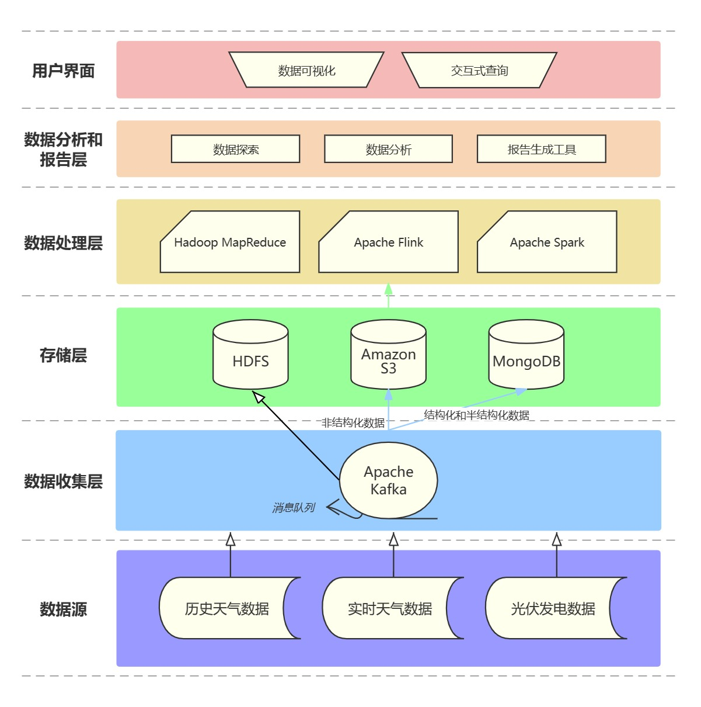

# 海量数据管理大作业

## I. 任务要求

某公司拥有海量的历史天气资讯，这些资讯包括文字资料、图片、视频、音频等其他类型的数据。该公司要频繁地对海量资讯文本进行统计，以用于预测天气变化对于其光伏产品发电量的影响。这里的统计任务为每篇资讯文档标题的字数、正文的字数与下方评论的字数。

在实时计算方面，该公司需要统计实时的光伏产品发电量检测数据流，故需要设计流计算引擎。

在存储方面，需要对海量的资讯文本数据进行的存储，还要对图片、视频、音频等多媒体数据进行存储。

在消息处理方面，因为整个系统包括多个计算或存储组件，故需要消息中间件承担数据总线的作用。

以上四个方面，需要归纳到统一的一套计算-存储架构中。

 要求：

1. 分析问题，选取合适的海量数据处理技术，设计总体的存储与计算方案。

2. 参照需求，自拟数据的存储结构，设计数据存储方案。

3. 采用MapReduce框架实现，详述对应MapReduce计算流程。

## II. 任务需求分析

### i. 数据特性分析

- **数据类型**：涉及的数据包括文本（如天气报告）、图片（如卫星云图）、视频（如天气实况录像）和音频（如天气预报语音）。
- **数据量**：考虑到数据的“海量”特性，需要处理的数据量可能非常庞大。
- **数据增长率**：了解数据随时间的增长率，以便设计可扩展的存储解决方案。
- **数据访问模式**：分析数据访问的频率和类型，确定热数据和冷数据，以及它们对存储性能的不同需求。

### ii. 业务需求分析

- **统计分析需求**：统计历史天气资讯文档的标题字数、正文字数和下方评论的字数，以及实时天气数据对光伏产品发电量的影响。
- **实时处理需求**：实时监测并处理光伏产品的发电量数据。
- **数据可用性和一致性需求**：保证数据在存储和处理过程中的可用性和一致性。

### iii. 技术需求分析

- **存储技术**：
  - 分布式存储系统，用于处理和存储海量数据。
  - 多媒体数据的存储解决方案，优化图片、视频和音频文件的存储和访问。
- **计算技术**：
  - 批处理能力，使用MapReduce或类似技术进行大规模数据分析。
  - 流处理能力，实时处理发电量数据流。
- **数据处理和分析技术**：使用数据分析工具对收集的数据进行统计和预测分析。

### iv. 系统性能和扩展性需求

- **高可用性**：系统需要能够抵御单点故障，确保数据的持续可用性。
- **可扩展性**：随着数据量的增加，系统应能够方便地扩展存储和计算能力。
- **性能需求**：系统应能够在满足实时处理和快速响应的前提下处理大量数据。

## III. 架构设计

### i. 分析

1. **存储架构分析**:
   - **数据多样性**: 处理的数据类型多样，包括结构化的文本和非结构化的图片、视频、音频。
   - **数据量**: 数据量庞大且持续增长，需考虑存储系统的扩展性和容错性。
   - **访问模式**: 既有大量的批量读写操作，也有需要快速响应的实时访问。
2. **计算架构分析**:
   - **批处理**: 历史数据分析需大规模批量处理，强调吞吐量和计算效率。
   - **实时处理**: 实时监控发电量，强调低延迟和高可用性。
   - **复杂数据处理**: 包括统计分析、模式识别和预测，需支持高级数据处理技术。

### ii. 设计

#### 1. 存储架构设计

使用的海量数据处理技术：

:one: **分布式文件系统 ( *HDFS* )**: 用于存储大量的文本、图片、视频和音频文件。

HDFS的 **关键特性**:

1. **高容错性**:
   - HDFS通过在不同的机器上存储数据的多个副本来提高容错性。如果某个节点失败，数据仍然可以从其他节点的副本中恢复。
   - 这对于海量数据处理尤为重要，因为数据丢失或损坏的风险随着数据量的增加而增加。
2. **适合大数据集**:
   - 设计用于存储非常大的文件，支持数TB到数PB级别的数据集。
   - 此项目涉及的历史天气数据和多媒体内容是大数据集的典型例子。
3. **高吞吐量**:
   - HDFS提供高吞吐量的数据访问，非常适合大规模数据处理。
   - 在天气数据分析和光伏发电量预测的批处理任务中，高吞吐量能显著提高数据处理效率。
4. **可扩展性**:
   - HDFS架构是可扩展的，可以轻松添加更多节点来扩展系统。
   - 随着公司数据量的不断增长，这种可扩展性是至关重要的。
5. **与MapReduce的良好集成**:
   - HDFS与Hadoop生态系统中的MapReduce紧密集成，为大规模数据分析提供了强大的支持。
   - 此项目中的批处理任务（如统计文档字数）需要这种紧密集成以优化性能。

针对本项目的特定需求，HDFS的这些特性提供了以下 **优势**：

1. **处理海量历史天气数据**:
   - 鉴于历史天气数据的庞大体量，HDFS的高容错性和高吞吐量特性使其成为存储这些数据的理想选择。
   - 数据的高可靠性确保了长期的数据分析和存储不受影响。
2. **支持多媒体内容的存储**:
   - 对于包含文本、图片、视频和音频的多媒体数据，HDFS的大数据集存储能力可以有效地管理这些不同类型的数据。
3. **适应数据增长**:
   - HDFS的可扩展性意味着随着公司数据量的增长，存储系统可以无缝扩展，无需更换整个存储架构。
4. **计算与存储的协同**:
   - 在进行统计分析和预测模型时，HDFS与MapReduce的集成优化了数据处理流程，减少了数据移动，提高了计算效率。

:two: **对象存储 ( *Amazon S3* )**: 为大型非结构化数据提供高效、可扩展的存储解决方案。适用于存储大尺寸的媒体文件。

Amazon S3 的 **关键特性**：

1. **耐久性和可靠性**:
   - Amazon S3提供极高的数据耐久性，数据存储在多个设备和多个设施中。
   - 这对于存储重要的天气数据和光伏发电数据至关重要，确保即使在极端情况下数据也不会丢失。
2. **可扩展性**:
   - S3可以无限量存储数据，用户无需担心存储空间的限制。
   - 对于不断增长的历史天气资讯和实时光伏数据，这种无限扩展的能力非常重要。
3. **数据访问控制**:
   - 提供细粒度的访问控制，允许用户精确控制谁可以访问什么数据。
   - 在处理含有敏感信息的天气数据时，这一点尤其重要。
4. **成本效率**:
   - 与传统的存储解决方案相比，S3通常更具成本效益，特别是在存储大量数据时。
5. **集成和兼容性**:
   - S3与大量的AWS服务和第三方解决方案兼容，便于集成。
   - 这为项目的其他方面（如计算和数据分析）提供了灵活性。

**应用到该项目**：

Amazon S3 可以作为一种补充和增强的存储解决方案

1. **存储非结构化数据**:
   - 将大型的非结构化数据（如卫星云图、天气视频和音频记录）存储在S3中。
   - 这些数据类型通常体积较大，S3可以高效管理这些大文件。
2. **数据备份和恢复**:
   - 使用S3作为主要的数据备份位置，为历史数据提供额外的保护。
   - 在出现本地数据中心故障时，可以从S3快速恢复数据。
3. **数据分析和处理的集成**:
   - 将S3与AWS的其他服务结合使用，进行数据分析和处理。
   - S3作为数据湖，可支持复杂的数据分析和机器学习工作负载。
4. **成本效益和可伸缩性**:
   - 根据使用量调整存储空间，优化成本效率。
   - 适应项目需求变化，无需担心存储容量的限制。

:three: **NoSQL数据库 ( *MongoDB* )**: 存储结构化和半结构化数据，如天气报告的文本内容。

MongoDB 的 **关键特性**：

1. **文档导向的存储**:
   - MongoDB存储数据为BSON（二进制JSON）格式的文档，这使得它非常适合存储结构化或半结构化的数据，如JSON或XML格式的天气数据。
   - 这种灵活的文档模型使得数据模型的调整更加便捷，不需要预先定义严格的表结构。
2. **高性能**:
   - MongoDB提供高性能的数据读写操作，特别是在处理大量读写请求时表现优异。
   - 对于实时更新的光伏发电数据和频繁访问的天气数据，这种高性能特性是关键。
3. **可扩展性**:
   - 支持水平扩展，可以通过添加更多节点来扩展数据库的容量和处理能力，非常适合大规模应用。
   - 项目随着时间的推移数据量将会不断增长，因此MongoDB的可扩展性非常重要。
4. **强大的查询语言**:
   - MongoDB提供了丰富的查询功能，可以有效处理复杂的查询和数据聚合任务。
   - 对于需要进行复杂查询以提取特定天气模式和趋势的分析任务来说，这一点尤为重要。

**应用到该项目**：

1. **存储结构化和半结构化的天气数据**:
   - 使用MongoDB存储天气报告、历史数据记录和光伏发电量数据等。
   - 这些数据可能包含多种格式，MongoDB的文档导向特性使得这些数据的存储更加灵活和高效。
2. **实时数据处理和分析**:
   - 利用MongoDB的高性能特性处理实时数据流，如即时更新的光伏发电量数据和实时天气更新。
   - 快速读写能力支持实时数据分析和即时决策制定。
3. **数据的扩展和分片**:
   - 随着数据量的增长，使用MongoDB的分片功能进行水平扩展，保持系统的性能和响应速度。
   - 这保证了项目在数据量大幅增长时仍能保持高效运行。
4. **复杂查询和数据聚合**:
   - 利用MongoDB强大的查询语言进行复杂的数据分析，如模式识别、趋势分析和预测。
   - 这对于深入理解天气数据的影响和优化光伏发电策略至关重要。

#### 2. 计算架构设计

:one: **批处理 ( *Apache Hadoop MapReduce* )**: 用于历史数据的大规模分析，如统计文档字数。MapReduce适合大数据量的离线处理，具有高可靠性和可扩展性。

Apache Hadoop MapReduce的 **关键特性**：

1. **适用于大规模数据集**:
   - MapReduce是为处理大量数据（TB或PB级别）而设计的，非常适合处理和分析海量的历史天气数据。
2. **高效的分布式处理**:
   - MapReduce将计算任务分布到多个节点上，允许并行处理大量数据，极大地提高了处理效率。
3. **容错性和可靠性**:
   - 如果任何MapReduce任务失败，框架会自动重新启动任务，保证了计算过程的高可靠性。
4. **可扩展性**:
   - MapReduce可以在数百到数千台机器上运行，非常适合随着数据量的增长而水平扩展。
5. **与HDFS的良好集成**:
   - MapReduce与Hadoop的分布式文件系统（HDFS）紧密集成，可以有效地处理存储在HDFS上的大规模数据集。

**项目中使用**：

1. **历史天气数据的批量处理**:
   - 使用MapReduce对存储在HDFS中的历史天气数据进行批量分析和处理。
   - 例如，统计过去几年中各地区的天气模式、温度变化、降雨量等数据。
2. **光伏发电数据的分析**:
   - 对历史的光伏发电量数据进行大规模分析，以预测不同天气条件下的发电效率和潜在问题。
   - 通过分析历史数据，可以帮助优化光伏电站的布局和运维策略。
3. **数据清洗和预处理**:
   - 在进行复杂的分析之前，使用MapReduce进行数据清洗和预处理，如格式标准化、缺失值处理等。
   - 这确保了后续分析的准确性和可靠性。
4. **与其他数据处理工具的协同**:
   - MapReduce可以与其他数据处理工具（如Apache Hive）结合使用，提供更丰富的数据分析能力。
   - 这种协同可以更好地满足复杂的数据分析需求。

:two: **流处理 ( *Apache Flink* )**: 用于实时处理光伏发电量数据流。Flink支持高吞吐量和低延迟的数据处理，适合复杂事件处理。

**为什么选择Apache Flink**：

1. **高性能的实时流处理**:
   - Apache Flink专为实时数据流处理设计，提供低延迟和高吞吐量，适合处理持续的数据流。
2. **容错性和一致性保证**:
   - Flink提供强大的状态管理和容错机制，保证了即使在出现故障的情况下也能保持数据处理的准确性和一致性。
3. **事件驱动和精确的时间处理**:
   - Flink支持复杂的事件驱动逻辑，能够精确处理事件时间和水印，这对于时序数据特别重要。
4. **可扩展性**:
   - 可以在多个节点上水平扩展，适应大规模数据流的处理需求。
5. **与其他系统的良好集成**:
   - Flink可以与存储系统（HDFS）集成，方便数据的输入和输出。

**项目中应用**：

1. **实时光伏发电量监控**:
   - 使用Flink实时处理从光伏电站传来的数据流，监控发电效率、检测异常情况。
   - 这种实时监控可以帮助及时发现并解决发电问题，优化发电效率。
2. **天气数据的实时分析**:
   - 对实时收集的天气数据进行流处理，分析天气模式和即时天气变化。
   - 例如，实时分析温度、湿度、风速等数据，预测短期内的天气变化对光伏发电的影响。
3. **数据聚合和实时报告**:
   - 使用Flink进行数据聚合，生成实时报告，如实时天气状况、发电量统计等。
   - 这对于提供实时的业务洞察和快速决策支持非常有价值。
4. **与批处理系统的协同**:
   - 将Flink与批处理系统（Hadoop MapReduce）协同使用，结合实时处理和批量处理的优势。
   - 例如，实时处理的数据可以用于即时决策，而批处理的数据可用于深入的历史分析和趋势预测。

:three: **高级数据处理 ( *Apache Spark* )**: 用于执行复杂的数据分析任务，包括机器学习。Spark提供快速的大数据处理能力，支持内存计算，适合于需要迅速反馈的数据分析。

**为什么选择Apache Spark**：

1. **高性能**:
   - Apache Spark是一个高速的数据处理框架，特别是其内存计算能力，可以比传统的磁盘读写（如MapReduce）快数十倍。
2. **多功能性**:
   - Spark不仅支持批处理，还支持流处理、机器学习、图处理和SQL查询，为各种数据处理需求提供了一站式解决方案。
3. **易用性**:
   - 提供了丰富的API，支持多种编程语言（如Java、Python），易于使用和维护。
4. **集成性**:
   - 可以轻松与Hadoop生态系统（如HDFS）和其他数据源集成。

**项目中应用**：

1. **复杂数据分析**:
   - 使用Spark的批处理和流处理能力进行复杂的数据分析任务，如天气模式的识别、光伏发电效率的预测。
2. **机器学习**:
   - 利用Spark MLlib进行机器学习任务，如基于历史数据的发电量预测和天气变化的趋势分析。
3. **快速数据处理**:
   - 对实时和历史天气数据进行快速处理，以支持即时的决策制定和长期的策略规划。
4. **数据整合**:
   - 结合使用Spark的多种功能（批处理、流处理、机器学习等），为项目提供一个统一的数据处理平台。
5. **交互式查询**:
   - 使用Spark SQL进行交互式数据查询，支持快速的数据探索和分析。

#### 3. 消息中间件

这里选择：**Apache Kafka**

Apache Kafka的 **关键特性**：

1. **高吞吐量**:
   - Kafka设计用于处理高吞吐量的数据流，非常适合实时数据处理场景，如实时监控光伏发电量。
2. **可扩展性**:
   - Kafka可以水平扩展，易于通过添加更多的服务器来增加处理能力。
3. **容错性**:
   - Kafka支持数据的复制，可以在集群中的多个节点上存储数据副本，增强了容错性。
4. **持久性**:
   - Kafka将数据存储在磁盘上，保证了数据的持久性，即使系统发生故障也不会丢失数据。
5. **低延迟**:
   - Kafka能够在保证高吞吐量的同时维持低延迟，这对于实时数据分析至关重要。

Kafka在项目架构中的 **应用**：

1. **数据收集**:
   - 收集来自各种源（如气象站的历史天气数据、实时天气感测数据和光伏发电量数据）的数据。
2. **数据传输**:
   - 将收集到的数据高效地传输到不同的处理和存储系统，如HDFS、Amazon S3、MongoDB、Apache Spark等。
3. **实时数据流处理**:
   - 作为实时数据处理架构的一部分，与Apache Flink等流处理工具配合，提供实时数据分析和处理能力。
4. **缓冲和解耦**:
   - 作为系统中各组件间的缓冲，减少直接依赖，提高系统的整体稳定性和灵活性。

#### 4. 整体架构

- **数据源**:
  - 包括历史天气数据、实时天气数据、光伏发电数据等。

- **数据收集层**:
  - 使用Apache Kafka消息队列来收集和传输数据。

- **存储层**:

  - HDFS用于大规模历史数据存储。

  - Amazon S3用于非结构化数据存储。

  - MongoDB作为NoSQL数据库存储结构化和半结构化数据。

- **数据处理层**:

  - Apache Spark用于复杂的数据处理任务和机器学习。

  - Apache Flink用于实时数据流处理。

  - Hadoop MapReduce用于大规模批处理任务。

- **数据分析和报告层**:
  - 包括用于数据探索、分析和生成报告的工具。

- **用户界面**:
  - 提供数据可视化和交互式查询的界面。

- **管理和监控层**:
  - 用于监控系统性能和健康状况的工具和服务。

##### **架构图：**



## IV. 数据存储方案

### i. 数据模型

1. **文本数据存储模型**:
   - 内容和类型:
     - 包括历史天气报告、实时天气数据、用户评论、光伏发电量记录等。
     - 主要是结构化和半结构化的数据，例如JSON或XML格式。
   - 设计:
     - 使用键值对的方式存储，其中键是唯一标识符（如时间戳、地理位置标识等），值包含具体的数据内容。
     - 对于半结构化数据，使用文档存储模型，允许灵活的数据字段和嵌套结构。
2. **多媒体数据存储模型**:
   - 内容和类型:
     - 包括卫星云图、天气相关视频和音频记录。
     - 主要是大型非结构化数据。
   - 设计:
     - 使用对象存储模型，每个文件作为一个独立的对象存储。
     - 对象包括文件本身和一些元数据（如创建日期、文件类型、关联的天气事件等）。

### ii. 数据库与存储技术

1. **MongoDB** (用于文本数据):
   - 选择理由:
     - 支持灵活的文档模型，适合存储结构化和半结构化数据。
     - 提供丰富的查询功能，便于对文本数据进行复杂查询和分析。
     - 可以轻松地水平扩展，适合处理大量数据。
   - 应用:
     - 用于存储和管理天气报告、实时数据记录、用户评论和光伏发电数据。
     - 支持对这些数据进行实时查询和分析。
2. **Amazon S3** (用于多媒体数据):
   - 选择理由:
     - 高度可靠和可扩展，适合存储大型非结构化数据。
     - 提供强大的数据可用性和耐久性，确保数据安全。
     - 成本效益高，适用于长期存储大量数据。
   - 应用:
     - 用于存储天气相关的图片、视频和音频文件。
     - 为数据备份和灾难恢复提供支持。
3. **HDFS** (用于存储大规模数据):
   - 选择理由:
     - 适合存储超大规模数据集。
     - 高吞吐量的数据访问，适合大规模数据处理。
     - 良好的容错性和可靠性。
   - 应用:
     - 作为历史天气数据和大规模光伏发电数据的存储解决方案。
     - 提供大数据分析和批处理的基础设施。

### iii. 数据存储结构设计

#### 1 文本数据存储结构

**天气资讯文档表**

| 字段名称           | 数据类型 | 描述             |
| ------------------ | -------- | ---------------- |
| report_id          | String   | 文档的唯一标识符 |
| title              | String   | 文档标题         |
| title_word_count   | Integer  | 标题字数         |
| content            | Text     | 文档正文内容     |
| content_word_count | Integer  | 正文字数         |
| created_at         | DateTime | 文档创建时间     |
| updated_at         | DateTime | 文档最后更新时间 |

**评论表**

| 字段名称   | 数据类型 | 描述               |
| ---------- | -------- | ------------------ |
| comment_id | String   | 评论的唯一标识符   |
| report_id  | String   | 相关联的文档标识符 |
| comment    | Text     | 评论内容           |
| word_count | Integer  | 评论字数           |
| posted_at  | DateTime | 评论发布时间       |

#### 2 实时光伏发电量数据存储结构

**光伏发电量表**

| 字段名称     | 数据类型 | 描述             |
| ------------ | -------- | ---------------- |
| data_id      | String   | 数据的唯一标识符 |
| station_id   | String   | 发电站标识符     |
| timestamp    | DateTime | 数据记录时间     |
| power_output | Float    | 发电量（千瓦时） |

#### 3 多媒体数据存储结构

**多媒体元数据表**

| 字段名称          | 数据类型 | 描述                                  |
| ----------------- | -------- | ------------------------------------- |
| file_id           | String   | 文件的唯一标识符                      |
| file_type         | String   | 文件类型（'image', 'video', 'audio'） |
| file_size         | Integer  | 文件大小（字节）                      |
| upload_date       | DateTime | 文件上传时间                          |
| associated_report | String   | 关联的天气资讯文档ID                  |
| s3_url            | String   | 文件在S3的存储URL                     |

## V. MapReduce框架实现

### MapReduce任务设计

1. **Map阶段**: 在这一阶段，每个Map任务处理一部分数据。它读取输入的文档，然后分析每个文档的标题、正文和评论，计算出它们的字数，并生成中间结果。
2. **Reduce阶段**: 在这一阶段，所有来自Map阶段的中间结果会被合并。Reduce任务对所有相同的键（在这里是文档ID）的值进行合并，得出最终结果，即每篇文档的标题、正文和评论的字数总和。

### MapReduce任务实现

#### 文档字数统计任务

- **Map 阶段**：解析每个文档，提取标题、正文和评论，并计算它们的字数。

  ``` java
  import org.apache.hadoop.io.IntWritable;
  import org.apache.hadoop.io.Text;
  import org.apache.hadoop.mapreduce.Mapper;
  
  import java.io.IOException;
  
  public class DocumentWordCountMapper extends Mapper<Object, Text, Text, IntWritable> {
      private Text word = new Text();
      private IntWritable wordCount = new IntWritable();
  
      public void map(Object key, Text value, Context context) throws IOException, InterruptedException {
          // 假设输入格式是：文档ID \t 标题 \t 正文 \t 评论
          String[] parts = value.toString().split("\t");
          if (parts.length < 4) return; // 格式不正确的行将被忽略
  
          // 提取各部分内容
          String documentId = parts[0];
          String title = parts[1];
          String content = parts[2];
          String comments = parts[3];
  
          // 计算字数并写入context
          word.set(documentId + "_title");
          wordCount.set(title.length());
          context.write(word, wordCount);
  
          word.set(documentId + "_content");
          wordCount.set(content.length());
          context.write(word, wordCount);
  
          word.set(documentId + "_comments");
          wordCount.set(comments.length());
          context.write(word, wordCount);
      }
  }
  ```

- **Reduce 阶段**：对来自同一文档的字数进行汇总。

  ``` java
  import org.apache.hadoop.io.IntWritable;
  import org.apache.hadoop.io.Text;
  import org.apache.hadoop.mapreduce.Reducer;
  
  import java.io.IOException;
  
  public class DocumentWordCountReducer extends Reducer<Text, IntWritable, Text, IntWritable> {
      private IntWritable result = new IntWritable();
  
      public void reduce(Text key, Iterable<IntWritable> values, Context context) throws IOException, InterruptedException {
          int sum = 0;
          for (IntWritable val : values) {
              sum += val.get();
          }
          result.set(sum);
          context.write(key, result);
      }
  }
  ```

- **MapReduce 作业**：

  ``` java
  import org.apache.hadoop.conf.Configuration;
  import org.apache.hadoop.fs.Path;
  import org.apache.hadoop.io.IntWritable;
  import org.apache.hadoop.io.Text;
  import org.apache.hadoop.mapreduce.Job;
  import org.apache.hadoop.mapreduce.lib.input.FileInputFormat;
  import org.apache.hadoop.mapreduce.lib.output.FileOutputFormat;
  
  public class DocumentWordCount {
      public static void main(String[] args) throws Exception {
          Configuration conf = new Configuration();
          Job job = Job.getInstance(conf, "document word count");
          job.setJarByClass(DocumentWordCount.class);
          job.setMapperClass(DocumentWordCountMapper.class);
          job.setCombinerClass(DocumentWordCountReducer.class);
          job.setReducerClass(DocumentWordCountReducer.class);
          job.setOutputKeyClass(Text.class);
          job.setOutputValueClass(IntWritable.class);
          FileInputFormat.addInputPath(job, new Path(args[0]));
          FileOutputFormat.setOutputPath(job, new Path(args[1]));
          System.exit(job.waitForCompletion(true) ? 0 : 1);
      }
  }
  ```

这里造出一点相关资讯数据测试，每行数据格式为：`文档ID \t 标题 \t 正文 \t 评论`：

```
doc1    Sunny Day    Today is a sunny day.    Nice weather!
doc1    Sunny Day    Today is a sunny day.    Really nice day!
doc2    Rainy Evening    The evening is expected to be rainy.    I love rain.
doc3    Cloudy Morning    This morning is quite cloudy.    Feels gloomy.
```

**Map阶段输出**

```hive
doc1_title    9
doc1_content  22
doc1_comments 12
doc1_title    9
doc1_content  22
doc1_comments 15
doc2_title    12
doc2_content  35
doc2_comments 10
doc3_title    14
doc3_content  27
doc3_comments 12
```

**Reduce阶段输出**

 ``` hive
 doc1_title    18
 doc1_content  44
 doc1_comments 27
 doc2_title    12
 doc2_content  35
 doc2_comments 10
 doc3_title    14
 doc3_content  27
 doc3_comments 12
 ```

#### 统计实时光伏发电量数据任务

- **Map 阶段**：解析每行数据，提取发电站ID和发电量。

  ``` java
  import org.apache.hadoop.io.FloatWritable;
  import org.apache.hadoop.io.Text;
  import org.apache.hadoop.mapreduce.Mapper;
  
  import java.io.IOException;
  
  public class PowerOutputMapper extends Mapper<Object, Text, Text, FloatWritable> {
      private Text stationId = new Text();
      private FloatWritable powerOutput = new FloatWritable();
  
      public void map(Object key, Text value, Context context) throws IOException, InterruptedException {
          // 假设输入格式是：发电站标识符, 数据记录时间, 发电量
          // 分割每行数据
          String[] parts = value.toString().split(", ");
          if (parts.length < 3) return;
  
          // 设置发电站ID和发电量
          stationId.set(parts[0]);
          powerOutput.set(Float.parseFloat(parts[2]));
          context.write(stationId, powerOutput);
      }
  }
  ```

- **Reduce 阶段**：对相同发电站ID的所有发电量进行汇总，计算总发电量或平均发电量。

  ``` java
  import org.apache.hadoop.io.FloatWritable;
  import org.apache.hadoop.io.Text;
  import org.apache.hadoop.mapreduce.Reducer;
  
  import java.io.IOException;
  
  public class PowerOutputReducer extends Reducer<Text, FloatWritable, Text, FloatWritable> {
      private FloatWritable result = new FloatWritable();
  
      public void reduce(Text key, Iterable<FloatWritable> values, Context context) throws IOException, InterruptedException {
          float sum = 0;
          int count = 0;
          for (FloatWritable val : values) {
              sum += val.get();
              count++;
          }
          // 计算平均发电量
          float average = count == 0 ? 0 : sum / count;
          result.set(average);
          context.write(key, result);
      }
  }
  ```

- **MapReduce 作业**：

   ``` java
   import org.apache.hadoop.conf.Configuration;
   import org.apache.hadoop.fs.Path;
   import org.apache.hadoop.io.FloatWritable;
   import org.apache.hadoop.io.Text;
   import org.apache.hadoop.mapreduce.Job;
   import org.apache.hadoop.mapreduce.lib.input.FileInputFormat;
   import org.apache.hadoop.mapreduce.lib.output.FileOutputFormat;
   
   public class PowerOutputJob {
   
       public static void main(String[] args) throws Exception {
           if (args.length != 2) {
               System.err.println("Usage: PowerOutputJob <input path> <output path>");
               System.exit(-1);
           }
           Configuration conf = new Configuration();
           Job job = Job.getInstance(conf, "Power Output Statistics");
           job.setJarByClass(PowerOutputJob.class);
           job.setMapperClass(PowerOutputMapper.class);
           job.setReducerClass(PowerOutputReducer.class);
           job.setOutputKeyClass(Text.class);
           job.setOutputValueClass(FloatWritable.class);
           FileInputFormat.addInputPath(job, new Path(args[0]));
           FileOutputFormat.setOutputPath(job, new Path(args[1]));
           System.exit(job.waitForCompletion(true) ? 0 : 1);
       }
   }
   ```

这里造出一点相关实时光伏电量数据测试，每行数据格式为：`发电站标识符, 数据记录时间, 发电量`

``` ceylon
station1, 2021-01-01T08:00:00, 150.0
station1, 2021-01-01T09:00:00, 160.0
station2, 2021-01-01T08:00:00, 200.0
station2, 2021-01-01T09:00:00, 210.0
station1, 2021-01-01T10:00:00, 170.0
station3, 2021-01-01T08:00:00, 100.0
station3, 2021-01-01T09:00:00, 110.0
```

**Map阶段输出**

```ceylon
station1, 150.0
station1, 160.0
station2, 200.0
station2, 210.0
station1, 170.0
station3, 100.0
station3, 110.0
```

**Reduce阶段输出**

```ceylon
station1, 160.0
station2, 205.0
station3, 105.0
```

## VI. 任务总结

这个任务涉及到为一家拥有海量历史天气资讯的公司开发一个数据处理和分析系统。核心任务包括：

1. 统计文本数据：计算每篇天气资讯文档的标题、正文和评论的字数，以支持对天气变化和光伏产品发电量的影响进行预测分析。
2. 实时数据处理：监测并分析实时的光伏产品发电量数据，以实时评估和优化发电效率。
3. 多媒体数据存储：存储和管理相关的图片、视频和音频数据，为天气资讯提供丰富的背景和上下文信息。

整个系统利用了先进的计算和存储技术，如Apache Hadoop MapReduce、Apache Flink、Apache Spark、MongoDB、Amazon S3和HDFS，以及Apache Kafka作为消息中间件，以确保高效、准确地处理和分析大规模数据集。

通过这个课程作业，我深刻理解了处理和管理海量数据的复杂性和重要性。在设计和实现一个涉及海量历史天气资讯的数据处理和分析系统的过程中，我学习到了如何有效地应用多种数据存储和处理技术。我了解到了Apache Hadoop MapReduce、Apache Flink和Apache Spark等技术在处理大规模数据集时的强大能力，尤其是它们在批处理和实时数据处理方面的特点。

此外，通过实际设计MongoDB、Amazon S3和HDFS的存储结构，我更加明白了不同类型数据存储需求的多样性，以及如何根据数据的特性选择合适的存储解决方案。这个作业还加深了我对消息中间件（例如Apache Kafka）在大数据架构中的作用的理解，特别是在处理来自多个数据源的数据流时。

总的来说，这次作业不仅提升了我在海量数据处理方面的技术知识和实践经验，也增强了我解决实际问题、进行系统设计和编码实现的能力。这对我的学术和职业发展无疑是极其宝贵的财富。