# 实验记录

## I. 实验名称

安装HBase并使用HBase Shell对数据操作

## II. 实验目的

本次实验通过在三台服务器上以及已经搭建好的Hadoop环境下安装HBase，学习了HBase的配置和集成方法，理解了HBase与Hadoop的协同工作机制，最终掌握了在HBase Shell中执行各种数据操作的基本命令。

## III. 实验内容

1. 在已配置的Hadoop的环境的基础上，配置HBase环境

2. 使用HBase的Shell命令操作数据库

   - 建立链接、关闭链接、建立数据库，插入数据等

   - 建立的具体数据库可以为银行职员信息数据库，样例：银行职员的信息，包括工号，姓名，级别，工资等
   - 思考哪些应该放在一个列族中

## IV. 实验思路与结构

安装HBase前一定要安装好Hadoop和ZooKeeper，并且注意Hadoop和HBase之间版本的兼容性。

### 0 环境配置与集群规划

- 服务器
  - 主机：master
    - 公网IP：`121.40.109.195`
    - 私网IP：`172.22.67.253`
  - 从机1：slave01
    - 公网IP：`120.55.75.214`
    - 私网IP：`172.22.67.254`
  - 从机2：slave02
    - 公网IP：`120.26.219.9`
    - 私网IP：`172.22.67.255`

- 环境配置

  - JAVA版本：JDK 1.8
  - Hadoop版本：Hadoop 3.1.3

  - ZooKeeper版本：Zookeeper 3.7.2

  - HBase版本：HBase 2.2.7

- 集群规划

  |               |                 master                  |          slave01          |                    slave02                     |
  | :-----------: | :-------------------------------------: | :-----------------------: | :--------------------------------------------: |
  |  **Hadoop**   | NameNode<br />DataNode<br />NodeManager | DataNode<br />NodeManager | DataNode<br />RecourceManager<br />NodeManager |
  | **ZooKeeper** |                Follower                 |          Leader           |                    Follower                    |
  |   **HBase**   |                 HMaster                 |       HRegionserver       |                 HRegionserver                  |

### 1 安装并启动Zookeeper

#### 1.1 在master服务器上安装并配置Zookeeper

1. 从官网下载Zookeeper-3.7.2

   - 下载地址：`https://mirrors.bfsu.edu.cn/apache/zookeeper/zookeeper-3.7.2/apache-zookeeper-3.7.2-bin.tar.gz`
   - 通过Xftp将压缩包上传到服务器

2. 解压安装包

   ``` bash
   tar -zxvf apache-zookeeper-3.7.2-bin.tar.gz -C /opt/
   mv /opt/apache-zookeeper-3.7.2-bin /opt/zookeeper
   ```

3. 设置环境变量

   ``` bash
   vim /etc/profile
   ```

   ```shell
   export ZOOKEEPER_HOME=/opt/zookeeper
   export PATH=$PATH:$ZOOKEEPER_HOME/bin
   ```

   ``` bash
   source /etc/profile
   ```

4. 修改zookeeper配置

   ``` bash
   cd /opt/zookeeper/conf/
   mv zoo_sample.cfg  zoo.cfg
   vim zoo.cfg
   ```

    在`zoo.cfg`中新增内容：

   ``` shell
   dataDir=/opt/zookeeper/data
   server.1=172.22.67.253:2888:3888
   server.2=172.22.67.254:2888:3888
   server.3=172.22.67.255:2888:3888
   ```

5. 创建myid文件

   创建目录保存myid文件，并且向myid文件中写入内容
   myid中的值其实是和zoo.cfg中server后面指定的编号是一一对应的
   编号1对应的是master这台服务器，所以在这里指定：**1**
   在这里使用**echo**和**重定向**实现数据写入

   ``` bash
   cd /opt/zookeeper
   mkdir data
   cd data
   echo 1 > myid
   ```

#### 1.2 在从机上安装Zookeeper并配置环境

1. 将修改好配置的Zookeeper分发到slave01和slave02

   ``` bash
   scp -rq /opt/zookeeper root@slave01:/opt/
   scp -rq /opt/zookeeper root@slave02:/opt/
   ```

2. 修改slave01和slave02上Zookeeper中的myid的内容

   slave01:

   ``` bash
   cd /opt/zookeeper/data/
   echo 2 > myid
   ```

   slave02:

   ``` bash
   cd /opt/zookeeper/data/
   echo 3 > myid
   ```

3. 通过分发环境变量配置为从机配置zookeeper环境变量

   ``` bash
   scp /etc/profile root@slave01:/etc/
   scp /etc/profile root@slave02:/etc/
   ```

   分别在slave01和slave02上，使环境变量生效：

   ``` bash
   source /etc/profile
   ```

#### 1.3 启动Zookeeper

在3台服务器上依次启动Zookeeper

``` bash
zkServer.sh start
```

在每台服务器上查看Zookeeper状态

``` bash
zkServer.sh status
```

这里，能看到各个服务器的zookeeper节点的模式。

此处，slave01为leader，master和slave02为follower。这里是Zookeeper自己的leader选举机制所产生的leader。

- master

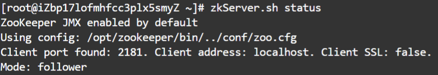

- slave01

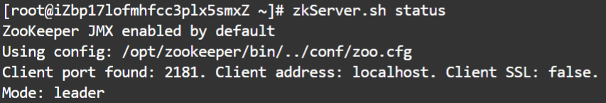

- slave02

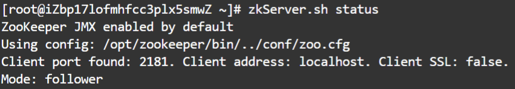

> 若需停止，则执行：
>
> ``` bash
> zkServer.sh stop
> ```

通过JPS查看，可以看见多了一个进程 `QuorumPeerMain`

- master

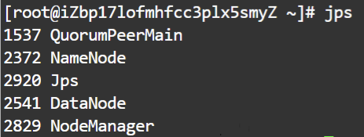

- slave01

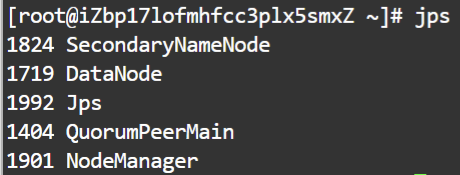

- slave02

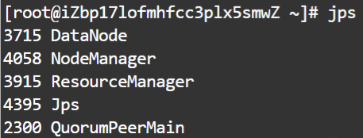

### 2 安装HBase

#### 2.1 在master服务器上安装HBase

1. 从官网下载HBase 2.2.7
   - 下载地址：`http://archive.apache.org/dist/hbase/2.2.7/hbase-2.2.7-bin.tar.gz`
   - 通过Xftp将压缩包上传到服务器

2. 解压安装包

   ``` bash
   tar -zxvf hbase-2.2.7-bin.tar.gz -C /opt/
   mv /opt/hbase-2.2.7 /opt/zookeeper
   ```

3. 配置环境变量

   ``` bash
   vim /etc/profile
   ```

   ``` shell
   export HBASE_HOME=/opt/hbase
   export PATH=$PATH:$HBASE_HOME/bin
   ```

   ``` bash
   source /etc/profile
   ```

4. 配置hbase-env.sh文件

   ``` bash
   vim /opt/hbase/conf/hbase-env.sh
   ```

   ``` shell
   export JAVA_HOME=/usr/java8
   export HADOOP_HOME=/opt/hadoop
   export HBASE_MANAGES_ZK=false
   export HBASE_LOG_DIR=/opt/hbase/logs
   ```

5. 配置hbase-site.xml文件

   ``` bash
   vim /opt/hbase/conf/hbase-site.xml
   ```

   ``` xml
   <configuration>
       <property>   
           <name>hbase.rootdir</name>                            
           <value>hdfs://master:9000/hbase</value>            
       </property>
       <property>
           <name>hbase.cluster.distributed</name>
           <value>true</value>
       </property>
       <property>
           <name>hbase.tmp.dir</name>
           <value>/opt/hbase/tmp</value>
       </property>
       <property>
           <name>hbase.unsafe.stream.capability.enforce</name>
           <value>false</value>
       </property>
       <property>
           <name>hbase.zookeeper.quorum</name>           
           <value>master,slave01,slave02</value>
       </property>
       <property>
       	<name>hbase.zookeeper.property.clientPort</name>
       	<value>2181</value>
   	</property>
       <property>
           <name>hbase.zookeeper.property.dataDir</name>
           <value>/opt/zookeeper/data</value>
       </property>
       <property>
           <name>hbase.master.info.port</name>
           <value>16010</value>
       </property>
   </configuration>
   ```

6. 配置regionservers文件

   ``` bash
   vim /opt/hbase/conf/regionservers 
   ```

   ```
   master
   slave01
   slave02
   ```

> 由于这里为完全分布式集群，暂不考虑备用master节点
>
> 若要配置备用master节点，则：
> ``` bash
> vim /opt/hbase/conf/backup-masters
> ```
>
> 在该文件中写入作为备用master节点的服务器名称

#### 2.2 将主机配置分发到两个从机

```
scp -rq /opt/hbase root@slave01:/opt/
scp -rq /opt/hbase root@slave02:/opt/
scp /etc/profile root@slave01:/etc/
scp /etc/profile root@slave02:/etc/
```

在slave01和slave02中使环境变量生效：

``` bash
source /etc/profile
```

### 3 启动HBase集群

#### 3.1 启动顺序

1. ZooKeeper
2. Hadoop
3. HBase

> 停止顺序即反过来

#### 3.2 启动HBase

> 在启动HBase集群之前一定要确保Hadoop集群和Zookeeper集群已经正常启动了
>
> 可以通过JPS查看

在master节点上：
``` bash
start-hbase.sh 
```

#### 3.3 关闭HBase

``` bash
stop-hbase.sh
```

### 4 使用HBase Shell命令建立与HBase实例的连接

在 HBase 安装目录 *bin/* 目录下使用`hbase shell`命令连接正在运行的 HBase 实例：

``` bash
/opt/hbase/bin/hbase shell
```

### 5 HBase Shell在银行职员信息数据库的应用

参考：[HBase Shell命令大全](https://blog.csdn.net/vbirdbest/article/details/88236575)

#### 5.1 列族设计

- `personal_info`: 包含工号（employee_id）、姓名（name）、级别（level）等个人基本信息。
- `salary_info`: 包含工资（salary）、福利（benefits）等薪资相关信息。

#### 5.2 创建表

在HBase Shell中，使用 `create` 命令创建表

```shell
create 'bank_staff_info', 'personal_info', 'salary_info'
```

这个命令创建了一个名为 `bank_staff_info` 的表，包含两个列族：`personal_info` 和 `salary_info`。

#### 5.3 插入数据

| Row Key | personal_info: employee_id | personal_info: name | personal_info: level | salary_info: salary | salary_info:<br />benefits        |
| ------- | -------------------------- | ------------------- | -------------------- | ------------------- | --------------------------------- |
| 001     | 1001                       | John Doe            | Manager              | 80000               | Health Insurance, Retirement Plan |
| 002     | 1002                       | Alice Johnson       | Teller               | 55000               | Health Insurance                  |
| 003     | 1003                       | Bob Smith           | Analyst              | 70000               | Health Insurance, Dental Plan     |
| 004     | 1004                       | Eva Williams        | Manager              | 85000               | Health Insurance, Retirement Plan |

使用 `put` 命令插入数据

```shell
# 第1条数据
put 'bank_staff_info', '001', 'personal_info:employee_id', '1001'
put 'bank_staff_info', '001', 'personal_info:name', 'John Doe'
put 'bank_staff_info', '001', 'personal_info:level', 'Manager'
put 'bank_staff_info', '001', 'salary_info:salary', '80000'
put 'bank_staff_info', '001', 'salary_info:benefits', 'Health Insurance, Retirement Plan'
# 第2条数据
put 'bank_staff_info', '002', 'personal_info:employee_id', '1002'
put 'bank_staff_info', '002', 'personal_info:name', 'Alice Johnson'
put 'bank_staff_info', '002', 'personal_info:level', 'Teller'
put 'bank_staff_info', '002', 'salary_info:salary', '55000'
put 'bank_staff_info', '002', 'salary_info:benefits', 'Health Insurance'
# 第3条数据
put 'bank_staff_info', '003', 'personal_info:employee_id', '1003'
put 'bank_staff_info', '003', 'personal_info:name', 'Bob Smith'
put 'bank_staff_info', '003', 'personal_info:level', 'Analyst'
put 'bank_staff_info', '003', 'salary_info:salary', '70000'
put 'bank_staff_info', '003', 'salary_info:benefits', 'Health Insurance, Dental Plan'
# 第4条数据
put 'bank_staff_info', '004', 'personal_info:employee_id', '1004'
put 'bank_staff_info', '004', 'personal_info:name', 'Eva Williams'
put 'bank_staff_info', '004', 'personal_info:level', 'Manager'
put 'bank_staff_info', '004', 'salary_info:salary', '85000'
put 'bank_staff_info', '004', 'salary_info:benefits', 'Health Insurance, Retirement Plan'
```

#### 5.4 更改数据

使用 `put` 命令更改第4条数据

``` shell
put 'bank_staff_info', '004', 'personal_info:employee_id', '1004'
put 'bank_staff_info', '004', 'personal_info:name', 'Eva Williams'
put 'bank_staff_info', '004', 'personal_info:level', 'Senior Manager'
put 'bank_staff_info', '004', 'salary_info:salary', '90000'
put 'bank_staff_info', '004', 'salary_info:benefits', 'Health Insurance, Retirement Plan, Stock Options'
```

#### 5.5 删除数据

使用 `delete` 或 `truncate` 命令删除表中的数据

- 删除指定行键的整行数据

  ``` shell
  deleteall 'bank_staff_info', '004'
  ```

- 删除指定列

  ``` shell
  delete 'bank_staff_info', '004', 'personal_info:level'
  ```

- 清空整个表的数据

  ``` shell
  truncate '表名'
  ```

#### 5.6 查询数据

使用 `get` 查询表中数据

``` shell
get 'bank_staff_info', '004'
```

如果删除后立刻查询数据，可能无法查询到实际删除的结果，这个与HBase的逻辑删除与物理删除机制有关，可以使用以下命令来执行手动的 **major compaction** 操作

``` shell
major_compact 'bank_staff_info'
```

#### 5.7 删除数据库表

可以使用 `disable` 命令禁用表，然后使用 `drop` 命令删除表

1. 禁用表

   ```
   disable 'bank_staff_info'
   ```

2. 删除表

   ```
   drop 'bank_staff_info'
   ```

### 6 退出HBase Shell

``` shell
quit
```

## V. 实验结果

### 1 HBase的安装与启动

1. JPS查看进程

   - master

     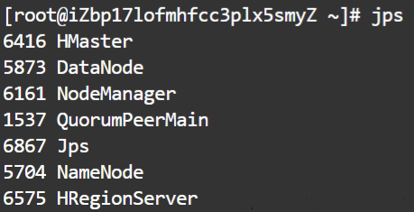

   - slave01

     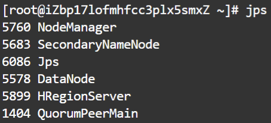

   - slave02

     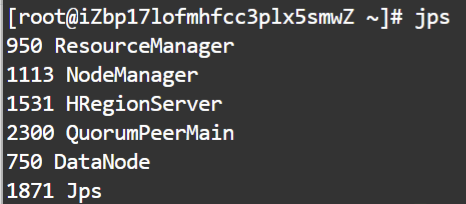

2. HBase的web界面

   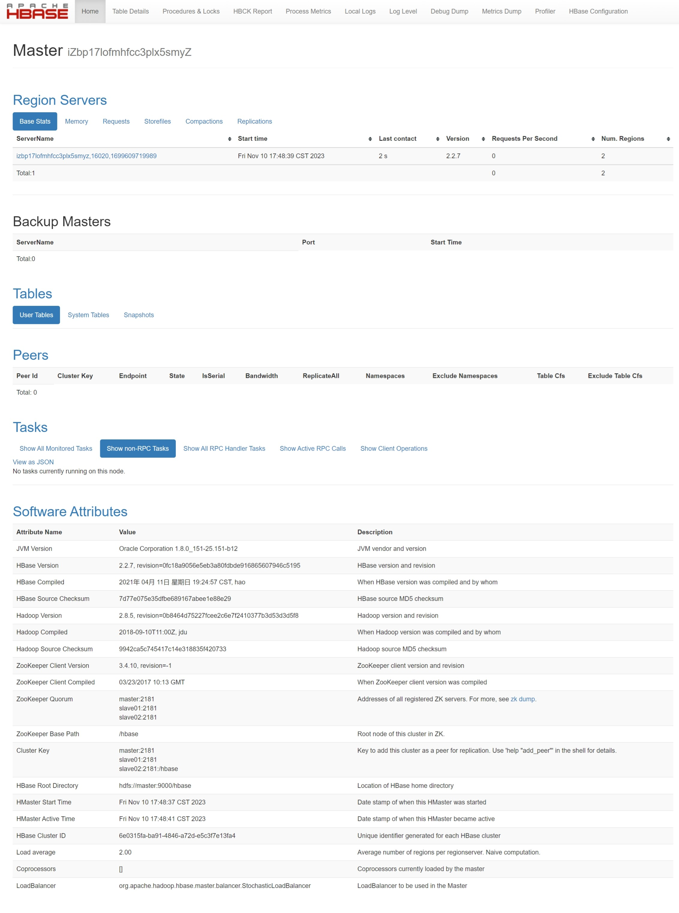

### 2 HBase Shell 操作

1. 插入数据后查看表 `bank_staff_info`

   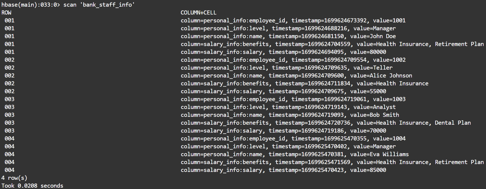

2. 修改第4条数据后查看表 `bank_staff_info`

   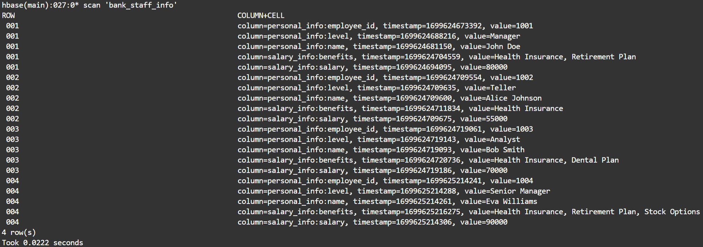

3. 删除第4条数据的 `personal_info:level` 列后查看第4条数据

   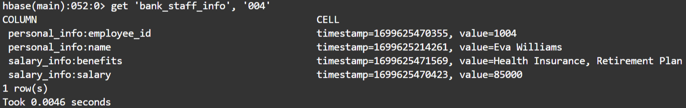

4. 删除整个第4条数据后查看表 `bank_staff_info`

   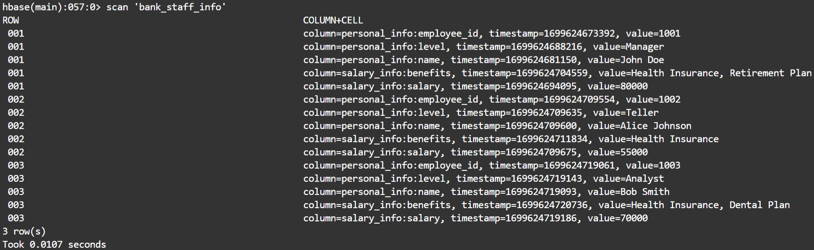
