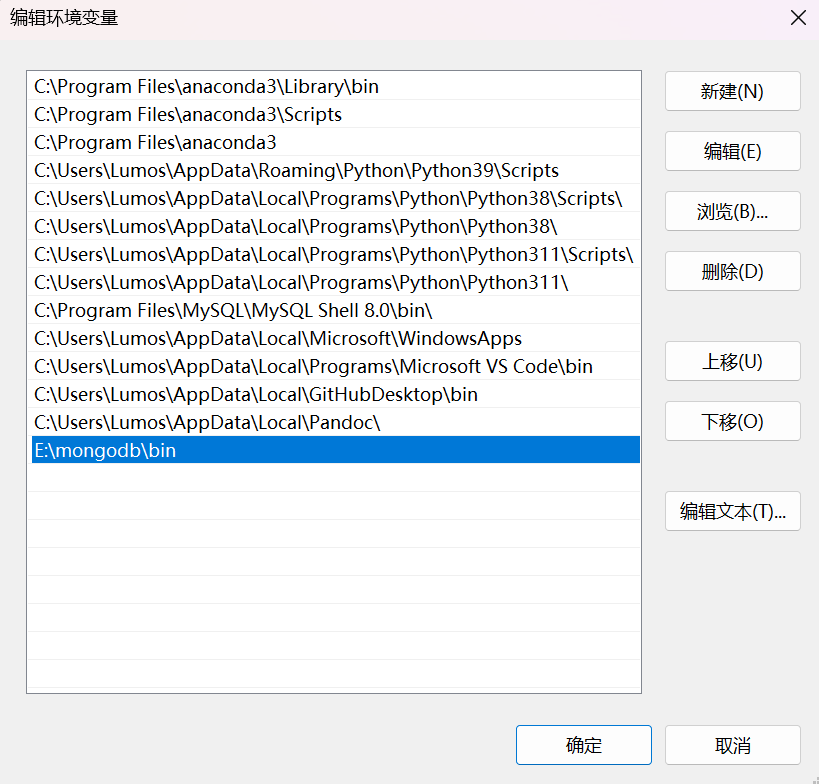
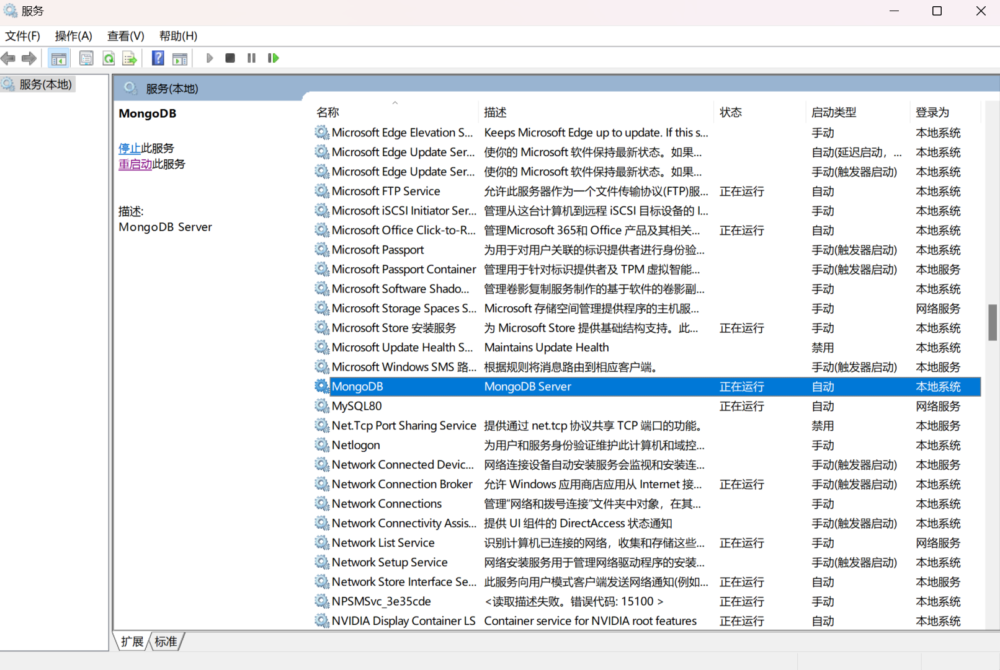
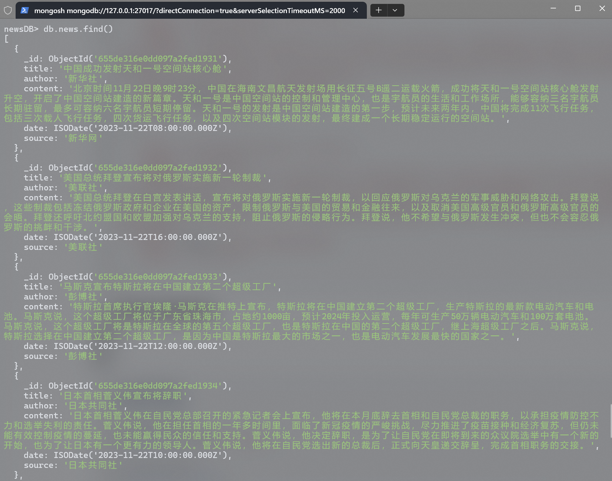
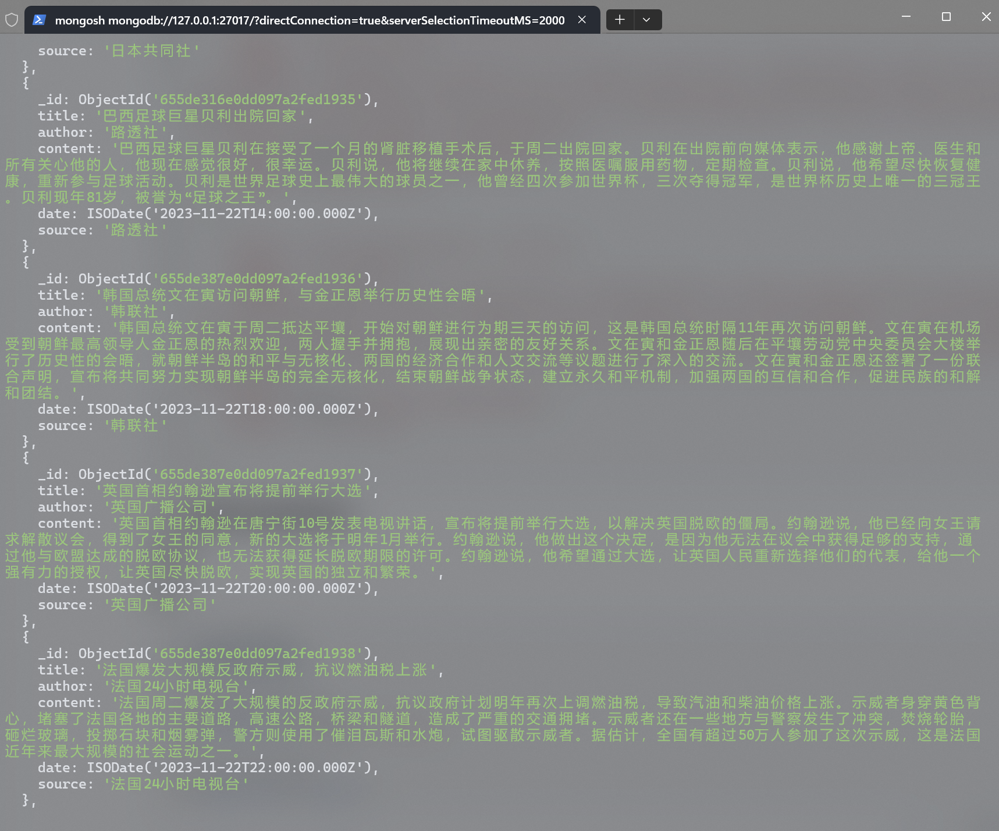
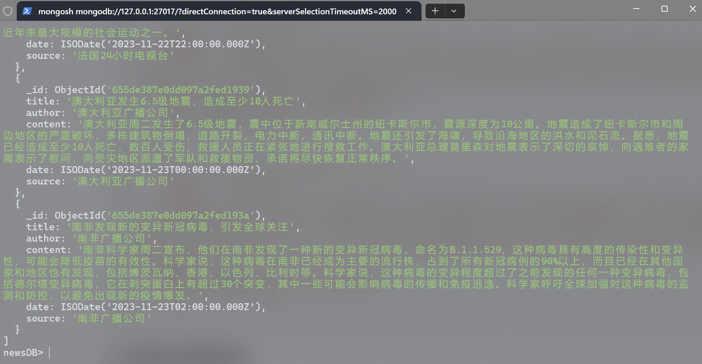
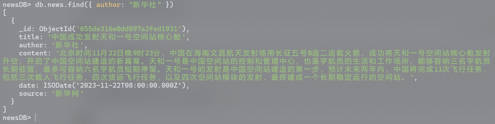
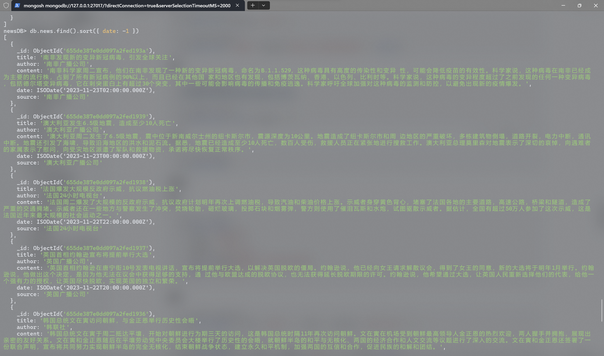
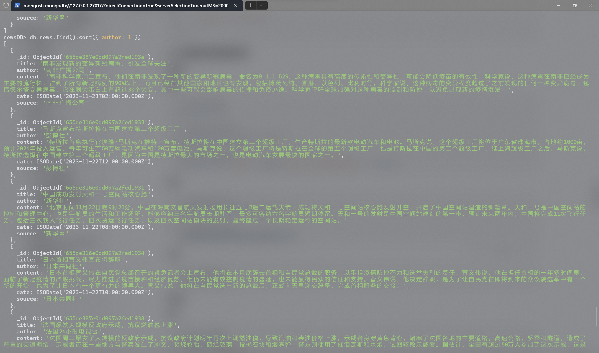
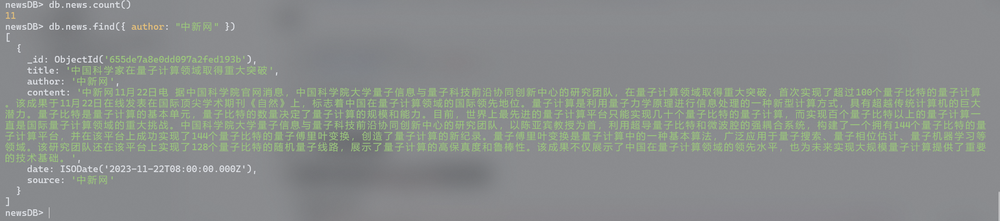
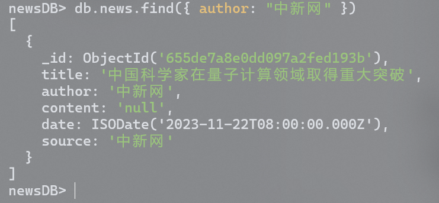

# 实验记录

## I. 实验名称

MongoDB数据库安装与操作

## II. 实验目的

本次实验通过进行MongoDB数据库安装与操作，学习了安装MongoDB并建立数据库的步骤，理解了MongoDB数据库的基本特性与概念，同时掌握了使用MongoDB进行基本的数据库操作。

## III. 实验内容

1. 安装MongoDB

2. 建立数据库，所建立的数据库可以为一个新闻数据库，包括新闻标题、作者与新闻内容等属性

   - 使用MongoDB的基本数据库操作命令，包括读操作与写操作

   - 读操作包括查询、排序、计数等

   - 写操作包括插入、更新、删除等


## IV. 实验思路与结构

### 0 实验环境

- 操作系统：Windows 11 23H2 64位
- MongoDB版本：MongoDB 6.0.11

### 1 安装MongoDB

1. 官网下载

   官网地址：https://www.mongodb.com/try/download/community

   选择Windows平台，下载zip格式的安装包

   

2. 选择zip文件的路径作为MongoDB安装路径

   > 安装路径为：`E:\mongodb`

### 2 配置MongoDB

1. 配置环境变量

   - 打开 *设置* -> *系统* -> *系统信息* -> *高级系统设置* -> *环境变量*

   - 找到 *Path*，添加MongoDB安装路径下的 `bin` 文件夹路径：`E:\mongodb\bin`

     

2. 创建 `data` 、`log`、`db` 文件夹

   - 在 `E:\mongodb` 下新建文件夹`data` 、`log`
   - 在`E:\mongodb\data` 下新建文件夹 `db`，用于存放数据库数据

3. 创建日志文件

   - 在 `E:\mongodb\log` 下创建日志文件 `mongod.log`

4. 创建配置文件

   在MongoDB安装路径下新建 `mongod.config` 文件，路径为：`E:\mongodb\mongodb.config`

   ```
   # 数据库路径
   dbpath=E:\\mongodb\\data\\db
   
   # 日志输出文件路径
   logpath=E:\\mongodb\\log\\mongod.log
   
   # 错误日志采用追加模式
   logappend=true
   
   # 启用日志文件，默认启用
   journal=true
   
   # 这个选项可以过滤掉一些无用的日志信息，若需要调试使用请设置为false
   quiet=true
   
   # 端口号，默认为27017
   port=27017
   ```

### 3 启动MongoDB

- 安装MongoDB到系统服务在命令行执行：`mongod --config "E:\mongodb\mongodb.config" --install --serviceName "MongoDB"`
- `win+r` 运行框中输入 `services.msc`，查看系统服务
- 在浏览器输入地址：`http://localhost:27017/`

### 4 安装并启动MongoDB Shell

由于6.0版本之后，下载安装MongoDB不在带有mongo.exe，故需要自行下载安装MongoDB Shell。

1. 从官网下载zip安装包：https://www.mongodb.com/try/download/shell
2. 将安装包解压到MongoDB的安装路径下：`E:\mongodb\mongosh`
3. 将 `E:\mongodb\mongosh\bin` 添加到环境变量当中，以便直接启动 `mongosh.exe`
4. 命令行输入`mogosh` 启动MongoDB Shell

### 5 使用MongoDB

#### 5.1 创建新闻数据库

``` sql
use newsDB
```

#### 5.2 插入新闻数据

``` sql
db.news.insertMany([
  {
    "title": "中国成功发射天和一号空间站核心舱",
    "author": "新华社",
    "content": "北京时间11月22日晚9时23分，中国在海南文昌航天发射场用长征五号B遥二运载火箭，成功将天和一号空间站核心舱发射升空，开启了中国空间站建造的新篇章。天和一号是中国空间站的控制和管理中心，也是宇航员的生活和工作场所，能够容纳三名宇航员长期驻留，最多可容纳六名宇航员短期停留。天和一号的发射是中国空间站建造的第一步，预计未来两年内，中国将完成11次飞行任务，包括三次载人飞行任务，四次货运飞行任务，以及四次空间站模块的发射，最终建成一个长期稳定运行的空间站。",
    "date": ISODate("2023-11-22T08:00:00Z"),
    "source": "新华网"
  },
  {
    "title": "美国总统拜登宣布将对俄罗斯实施新一轮制裁",
    "author": "美联社",
    "content": "美国总统拜登在白宫发表讲话，宣布将对俄罗斯实施新一轮制裁，以回应俄罗斯对乌克兰的军事威胁和网络攻击。拜登说，这些制裁包括冻结俄罗斯政府和企业在美国的资产，限制俄罗斯与美国的贸易和金融往来，以及取消美国高级官员和俄罗斯高级官员的会晤。拜登还呼吁北约盟国和欧盟加强对乌克兰的支持，阻止俄罗斯的侵略行为。拜登说，他不希望与俄罗斯发生冲突，但也不会容忍俄罗斯的挑衅和干涉。",
    "date": ISODate("2023-11-22T16:00:00Z"),
    "source": "美联社"
  },
  {
    "title": "马斯克宣布特斯拉将在中国建立第二个超级工厂",
    "author": "彭博社",
    "content": "特斯拉首席执行官埃隆·马斯克在推特上宣布，特斯拉将在中国建立第二个超级工厂，生产特斯拉的最新款电动汽车和电池。马斯克说，这个超级工厂将位于广东省珠海市，占地约1000亩，预计2024年投入运营，每年可生产50万辆电动汽车和100万套电池。马斯克说，这个超级工厂将是特斯拉在全球的第五个超级工厂，也是特斯拉在中国的第二个超级工厂，继上海超级工厂之后。马斯克说，特斯拉选择在中国建立第二个超级工厂，是因为中国是特斯拉最大的市场之一，也是电动汽车发展最快的国家之一。",
    "date": ISODate("2023-11-22T12:00:00Z"),
    "source": "彭博社"
  },
  {
    "title": "日本首相菅义伟宣布将辞职",
    "author": "日本共同社",
    "content": "日本首相菅义伟在自民党总部召开的紧急记者会上宣布，他将在本月底辞去首相和自民党总裁的职务，以承担疫情防控不力和选举失利的责任。菅义伟说，他在担任首相的一年多时间里，面临了新冠疫情的严峻挑战，尽力推进了疫苗接种和经济复苏，但仍未能有效控制疫情的蔓延，也未能赢得民众的信任和支持。菅义伟说，他决定辞职，是为了让自民党在即将到来的众议院选举中有一个新的开始，也为了让日本有一个更有力的领导人。菅义伟说，他将在自民党选出新的总裁后，正式向天皇递交辞呈，完成首相职务的交接。",
    "date": ISODate("2023-11-22T10:00:00Z"),
    "source": "日本共同社"
  },
  {
    "title": "巴西足球巨星贝利出院回家",
    "author": "路透社",
    "content": "巴西足球巨星贝利在接受了一个月的肾脏移植手术后，于周二出院回家。贝利在出院前向媒体表示，他感谢上帝、医生和所有关心他的人，他现在感觉很好，很幸运。贝利说，他将继续在家中休养，按照医嘱服用药物，定期检查。贝利说，他希望尽快恢复健康，重新参与足球活动。贝利是世界足球史上最伟大的球员之一，他曾经四次参加世界杯，三次夺得冠军，是世界杯历史上唯一的三冠王。贝利现年81岁，被誉为“足球之王”。",
    "date": ISODate("2023-11-22T14:00:00Z"),
    "source": "路透社"
  },
  {
    "title": "韩国总统文在寅访问朝鲜，与金正恩举行历史性会晤",
    "author": "韩联社",
    "content": "韩国总统文在寅于周二抵达平壤，开始对朝鲜进行为期三天的访问，这是韩国总统时隔11年再次访问朝鲜。文在寅在机场受到朝鲜最高领导人金正恩的热烈欢迎，两人握手并拥抱，展现出亲密的友好关系。文在寅和金正恩随后在平壤劳动党中央委员会大楼举行了历史性的会晤，就朝鲜半岛的和平与无核化、两国的经济合作和人文交流等议题进行了深入的交流。文在寅和金正恩还签署了一份联合声明，宣布将共同努力实现朝鲜半岛的完全无核化，结束朝鲜战争状态，建立永久和平机制，加强两国的互信和合作，促进民族的和解和团结。",
    "date": ISODate("2023-11-22T18:00:00Z"),
    "source": "韩联社"
  },
  {
    "title": "英国首相约翰逊宣布将提前举行大选",
    "author": "英国广播公司",
    "content": "英国首相约翰逊在唐宁街10号发表电视讲话，宣布将提前举行大选，以解决英国脱欧的僵局。约翰逊说，他已经向女王请求解散议会，得到了女王的同意，新的大选将于明年1月举行。约翰逊说，他做出这个决定，是因为他无法在议会中获得足够的支持，通过他与欧盟达成的脱欧协议，也无法获得延长脱欧期限的许可。约翰逊说，他希望通过大选，让英国人民重新选择他们的代表，给他一个强有力的授权，让英国尽快脱欧，实现英国的独立和繁荣。",
    "date": ISODate("2023-11-22T20:00:00Z"),
    "source": "英国广播公司"
  },
  {
    "title": "法国爆发大规模反政府示威，抗议燃油税上涨",
    "author": "法国24小时电视台",
    "content": "法国周二爆发了大规模的反政府示威，抗议政府计划明年再次上调燃油税，导致汽油和柴油价格上涨。示威者身穿黄色背心，堵塞了法国各地的主要道路，高速公路，桥梁和隧道，造成了严重的交通拥堵。示威者还在一些地方与警察发生了冲突，焚烧轮胎，砸烂玻璃，投掷石块和烟雾弹，警方则使用了催泪瓦斯和水炮，试图驱散示威者。据估计，全国有超过50万人参加了这次示威，这是法国近年来最大规模的社会运动之一。",
    "date": ISODate("2023-11-22T22:00:00Z"),
    "source": "法国24小时电视台"
  },
  {
    "title": "澳大利亚发生6.5级地震，造成至少10人死亡",
    "author": "澳大利亚广播公司",
    "content": "澳大利亚周二发生了6.5级地震，震中位于新南威尔士州的纽卡斯尔市，震源深度为10公里。地震造成了纽卡斯尔市和周边地区的严重破坏，多栋建筑物倒塌，道路开裂，电力中断，通讯中断。地震还引发了海啸，导致沿海地区的洪水和泥石流。据悉，地震已经造成至少10人死亡，数百人受伤，救援人员正在紧张地进行搜救工作。澳大利亚总理莫里森对地震表示了深切的哀悼，向遇难者的家属表示了慰问，向受灾地区派遣了军队和救援物资，承诺将尽快恢复正常秩序。",
    "date": ISODate("2023-11-23T00:00:00Z"),
    "source": "澳大利亚广播公司"
  },
  {
    "title": "南非发现新的变异新冠病毒，引发全球关注",
    "author": "南非广播公司",
    "content": "南非科学家周二宣布，他们在南非发现了一种新的变异新冠病毒，命名为B.1.1.529，这种病毒具有高度的传染性和变异性，可能会降低疫苗的有效性。科学家说，这种病毒在南非已经成为主要的流行株，占到了所有新冠病例的90%以上，而且已经在其他国家和地区也有发现，包括博茨瓦纳、香港、以色列、比利时等。科学家说，这种病毒的变异程度超过了之前发现的任何一种变异病毒，包括德尔塔变异病毒，它在刺突蛋白上有超过30个突变，其中一些可能会影响病毒的传播和免疫逃逸。科学家呼吁全球加强对这种病毒的监测和防控，以避免出现新的疫情爆发。",
    "date": ISODate("2023-11-23T02:00:00Z"),
    "source": "南非广播公司"
  }
])
```

#### 5.3 实现基本数据库操作

##### 读操作

**查询：**

```sql
// 查询所有新闻
db.news.find()

// 根据条件查询新闻
db.news.find({ author: "新华社" })

// 查询并格式化输出
db.news.find({ "date": ISODate("2023-11-22T08:00:00Z") }).pretty()
```

**排序：**

```sql
// 根据日期降序排序
db.news.find().sort({ date: -1 })

// 根据作者升序排序
db.news.find().sort({ author: 1 })
```

**计数：**

```sql
// 统计新闻总数
db.news.count()
```

##### 写操作

**插入：**

```sql
// 插入一条新闻
db.news.insertOne({ "title": "中国科学家在量子计算领域取得重大突破", "author": "中新网", "content": "中新网11月22日电 据中国科学院官网消息，中国科学院大学量子信息与量子科技前沿协同创新中心的研究团队，在量子计算领域取得重大突破，首次实现了超过100个量子比特的量子计算。该成果于11月22日在线发表在国际顶尖学术期刊《自然》上，标志着中国在量子计算领域的国际领先地位。量子计算是利用量子力学原理进行信息处理的一种新型计算方式，具有超越传统计算机的巨大潜力。量子比特是量子计算的基本单元，量子比特的数量决定了量子计算的规模和能力。目前，世界上最先进的量子计算平台只能实现几十个量子比特的量子计算，而实现百个量子比特以上的量子计算一直是国际量子计算领域的重大挑战。中国科学院大学量子信息与量子科技前沿协同创新中心的研究团队，以陈亚宾教授为首，利用超导量子比特和微波腔的强耦合系统，构建了一个拥有144个量子比特的量子计算平台，并在该平台上成功实现了144个量子比特的量子傅里叶变换，创造了量子计算的新纪录。量子傅里叶变换是量子计算中的一种基本算法，广泛应用于量子搜索、量子相位估计、量子机器学习等领域。该研究团队还在该平台上实现了128个量子比特的随机量子线路，展示了量子计算的高保真度和鲁棒性。该成果不仅展示了中国在量子计算领域的领先水平，也为未来实现大规模量子计算提供了重要的技术基础。", "date": ISODate("2023-11-22T08:00:00Z"), "source": "中新网" })
```

**更新：**

```sql
// 更新符合条件的新闻
db.news.updateOne({ title: "中国科学家在量子计算领域取得重大突破" }, { $set: { content: "null" } })

// 更新所有新闻的作者
db.news.update({}, { $set: { author: "null" } }, { multi: true })
```

**删除：**

```sql
// 删除符合条件的新闻
db.news.deleteOne({ title: "中国科学家在量子计算领域取得重大突破" })

// 删除所有新闻
db.news.remove({})
```

## V. 实验结果

### 1 安装并启动MongoDB的结果

- 查看系统服务

- 访问：`http://localhost:27017/`

### 2 使用数据库的结果

1. 创建数据库结果

   

2. 查询所有新闻的结果

   

   

   

3. 根据作者查询新闻

   

4. 根据日期查询新闻并格式化输出

   

5. 根据日期降序输出

   

6. 根据作者升序输出

   

7. 统计新闻总数

   

8. 插入新闻后统计数量和查找

   

9. 更新后查询新闻

   

10. 删除新闻后

    
