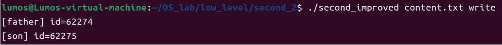

# 操作系统课程设计报告

姓名：杨铠铭
学号：21009200817

---

## 1 基础题目

### 1.1 Shell编程

- 代码中第一行表示是一个*shell*文件，当bash解释器解释的时候读到这句就知道是*shell*文件
  - **$1** 是指在命令行输入的第一个参数(这里shell文件的名称算是第0个参数)
  - **$2** 同理就是第二个参数
- 根据需求我们得到要读写的文件名称**filename**和要进行的操作**limit**解析shell中的变量的值就要用 **${variable}**
- 本题关键是如何去读文件
- 我这里使用了 **管道法** ， **|** 这就是管道，管道左边的输出会沿着管道流入管道右边作为输入），**cat filename**将输入的文件展开之后读每一行，然后读到的就将这一行**echo**，也就是输出到控制台上。否则的话就是写操作，将事先准备好的学号写入文件中
- 这里的 **>** 是重定向符号，表示将左边的内容输出到右边中去(这个会覆盖数据，**>>** 表示追加)
- `myfile.sh`

    ```bash
      #!/bin/bash
      # @author lumos
      filename=$1
      limit=$2
      content="817MYFILE"~~~~
      if [ $limit == "read" ]
      then 
        cat ${filename} | while read line
      do 
        echo ${line}
      done 
      else
        echo "${content}">${filename}
      fi
    ```

- 执行一下脚本：先执行写操作，再去读

- 写入成功，读操作也成功了
- 通过-x指令看看运行过程中的脚本实际运行的语句

- 打开content.txt也发现已经写入

- 下面验证shell脚本在重定向输出时用到了write系统调用，使用strace命令可以得到

- 可以看到我们向1，1代表的文件描述符是stdout标准输出，但是我们前面肯定是使用了**dup2**进行了重定向，此时的文件描述符1指向了我们要输出到的文件
- 下面是关于重定向的一些图示：
  
  

### 1.2 系统调用编程

#### 1.2.1 题目1

- 第一题是熟悉几个系统调用的使用：**open**，**write**，**read**
  - **open**第一个参数是要打开的文件，此处使用相对路径，就是和这个c程序处于同一级下的文件；第二个参数是权限**O_CREAT**表示如果文件不存在就会创建，**O_RDWR**表示文件支持读写
  - 还有一种使用是有第三个参数，也是表示权限的这里一般是表示了属主、同组和其他人对文件的文件操作权限
  - read和write的参数很像
    - 第一个参数都是文件名或者设备名（linux中设备也是文件）
    - 第二个参数buff，对于read来说是用户程序定义的缓冲区，read会把文件中的内容读到这个用户的buff中来
  - 对于write来说是，用户空间提供一个buff字符数组，会把内容写到文件中去。第三个参数是最大的字节数，写入或者读得的，超过会截断
  - 返回值都是实际写入或者读出的字节数，如果为-1，说明读写失败
- `second.c`

    ```c
    #include<stdlib.h> 
    #include<unistd.h> 
    #include<fcntl.h> 
    #include<string.h> 
    #include<stdio.h>
    int main (int argc, char* argv[]) {
        char* filepath=argv[1];//获取命令行输入的第一个参数为文件名
        char* operate=argv[2]; //第二个参数为执行的操作  write/read
        int fd=open(filepath,O_CREAT|O_RDWR);//这里打开输入的文件，如果没有就会自动创建，这里会获得描述该文件的描述符fd
        char buff[50]; 
        if (strcmp("write",operate)==0) {
            printf("Input what you want to input:\n");
            read(0,buff,30);//0文件描述符对应的是stdin标准输入，这里就是从键盘获得输入
            size_t  res=write(fd,buff,strlen(buff));//将获得的输入写到fd关联的文件中去，返回值是实际写入的字节数
            if (res<0) {
                printf("fail to write!");
            }
        } else if (strcmp("read",operate)==0) {
            size_t res=read(fd,buff,30);//这里就是从fd关联的文件中读最多30个字节到buff中去 
            if (res<0) {
                printf("fail to read");
            }
            printf("the content of the file is ");
            fprintf(stdout," %s",buff);
        }
    }
    ```

- 首先编译 *second.c* 文件获得可执行文件 *second*，然后使用 **./** 执行second文件
- 发现分别试验write和read功能都成功了！
  

- fopen，fwrite，fread与open，write，read系统调用的区别
  - fopen返回的是文件结构体指针，open返回的是文件句柄（就是对应的文件索引表中的索引值） 并且fread，fwrite是 ***带有缓冲区*** 的读写，只有当缓冲区满了，在向磁盘或者内存上读写，可以减少read，write来回进行内核态和用户态的切换

#### 1.2.2 题目2

- 要求多进程互斥的写同一个文件，这里使用**信号量**机制
  
    ```c
      void *mmap(void *start, size_t length, int prot, int flags, int fd, off_t offset);
    ```

- 这里主要使用mmap来进行共享内存
  - 第一个参数为NULL表示由系统自动去分配一块进程的虚拟空间来进行共享，
  - 第二个参数是分配的空间大小size这里设置就正好是一个信号量结构体（sem_t）的大小
  - 第三个参数表示对这块空间的权限，这里PROT_WRITE和PROT_READ表示可以读写
  - 第四个参数也是权限，MAP_SHARED表示共享，MAP_ANON表示匿名文件，由于它的第五个参数没有指定某个文件句柄（填充的-1）所以是匿名文件
  - 第五个参数是文件描述符
  - 第六个参数是映射文件的offset偏移量
- sem_init()函数第一个参数是信号量结构的指针，第二个参数是一个标志（当为1时表示进程间都可以共享，0表示进程的线程间共享），第三个参数value就是初始化的值，这里就是对p信号量设置初始值为 1
- sem_wait()就是将信号量的值-1，然后判断如果<0，这个进程就会block阻塞
- sem_post()就是将信号量值+1，然后判断如果>=0，说明有进程在等待就会唤醒它
- `second_improved.c`
  
  ```c
    #include<stdlib.h>
    #include<unistd.h>
    #include<fcntl.h>
    #include<string.h>
    #include<stdio.h>
    #include<semaphore.h>
    #include<pthread.h>
    #include<sys/mman.h>
    int main(int argc,char* argv[]){
        char* filepath=argv[1];
        char* operate=argv[2];
        int fd=open(filepath,O_CREAT|O_RDWR,0666);
        char buff[50];
        if(strcmp("write",operate)==0){
            pid_t id=fork();
            sem_t* p = (sem_t*)mmap(NULL,sizeof(sem_t),PROT_WRITE|PROT_READ,MAP_SHARED|MAP_ANON,-1,0); 
            sem_init(p,1,1); 
            if(id>0){
            //father
                sem_wait(p);
                char buff[]="817PROC1 MYFILE1\n";
                pid_t id=getpid();
                printf("[father] id=%d\n",id);
                write(fd,buff,strlen(buff));
                sem_post(p);
            }else{
            //son
                sem_wait(p);
                char buff[]="817PROC2 MYFILE2\n";
                pid_t id=getpid();
                printf("[son] id=%d\n",id);
                write(fd,buff,strlen(buff));
                sem_post(p);
            }
            sem_destroy(p);
            munmap(p,sizeof(sem_t));
        }else if(strcmp("read",operate)==0){
            size_t res=read(fd,buff,100);
            printf("the numbers of read = %d\n",res);
            if(res<0){
                printf("fail to read!\n");
            }s
            fprintf(stdout,"%s",buff);
        }
        close(fd);
    }
  ```

- 先编译链接生成可执行文件second2
  `gcc second_improved.c -o second_improved`
- 然后运行并输入参数
- 先写入文件并输出结果，这个用于展示父子进程的pid以及先后顺序
  
- 再读一下文件，看是否成功写入
  
- 从结果来看，第一个是写入的字节数已经读到了，然后写入的内容也是符合上面先输出father，再输出son的

### 1.3 内核编程

- 我使用添加模块的方式来添加系统调用
- 首先要查找系统调用表的位置 sys_call_table
  - 输入指令：
  `cat /proc/kallsyms | grep sys_call`
- 找到了表的位置（这里注意每次开机这个位置是可能会变化的，所以每次都要重新更改宏中的地址，当然别忘了加上前缀0x）
  
- 然后查找一下空闲的系统调用号以供使用
  - 输入指令：
  `cat /usr/include/asm-generic/unistd.h`
- 发现这中间都是空的，我们就可以使用了
  
- 下面看我们的程序：
  - 通过修改Cr0这个控制寄存器的第十七位，这位表示能否进行写入
  - 所以clear_cr0和setback_cr0这俩函数一个是给将它第十七位置0，另一个是重置回1。
  - 当向系统调用传参数的时候，不能向传统的传入几个参数，要以wrapper封装的方式传递，所以这里使用寄存器集合struct pt_regs，它的di、si分别表示传递的第一个和第二个参数
- `my_system.c`
  
  ```c
    #include<linux/kernel.h> 
    #include<linux/init.h> 
    #include<linux/unistd.h> 
    #include<linux/module.h> 
    #include<linux/sched.h>
    MODULE_LICENSE("Dual BSD/GPL");
    #define SYS_CALL_TABLE_ADDRESS 0xffffffffa0a004c0//这里是每次都需要根据系统调用表的位置更改的
    #define NUM 295//这是我使用的系统调用号
    unsigned long *my_sys_call_table;//指向系统调用表的指针    
    static int (*funcPtr)(void);//保存我们要添加的系统调用号那块地址的原有数据的 int old_cr0;//保存原来cr0寄存器中的值
    static int clear_cr0(void){ 
        unsigned int cr0; 
        unsigned int ret;
        asm volatile("movq %%cr0,%%rax":"=a"(cr0));//这里的意思是把cr0的原始值通过ax寄存器保存到cr0变量中
        ret=cr0;//保存旧值要返回的
        cr0&=0xfffffffffffeffff;//将第十七位置0
        asm volatile("movq %%rax,%%cr0"::"a"(cr0));//将cr0的新值通过ax寄存器传输到cr0寄存器上
        return ret;//返回cr0的旧值，最后是要重置的
    }
    static void setback_cr0(int v){
        asm volatile("movq %%rax,%%cr0"::"a"(v));//将旧值重置回cr0寄存器中
    }
    asmlinkage int my_sys_call(struct pt_regs* regs){ 
        printk("the systemcall of the module \n");
        int sid;
        sid=regs->di;//接受我们传入的学号后三位 int flag;
        flag=regs->si;//接受我们传入的标志位，为1得到学号的十位，为0得到学号的个位
        int res=0;
        printk("the argument sid= %d,flag=%d\n",sid,flag); 
        if(flag){
            res=sid/10%10;
        }else{
            res=sid%10;
        }
        printk("result=%d\n",res); return res;
    }
    static int   init call_init(void){ 
        printk("call init \n");
        my_sys_call_table=(unsigned long*)SYS_CALL_TABLE_ADDRESS;
        funcPtr=( int(*)(void))my_sys_call_table[NUM];//保存原有的这里的数据 
        old_cr0=clear_cr0();//修改cr0寄存器，使之可以写入 
        my_sys_call_table[NUM]=(unsigned long)&my_sys_call;//填入我们的系统调用函数 
        setback_cr0(old_cr0);//再重置
        return 0;
    }
    static void   exit call_exit(void){ 
        printk("call exit \n");
        old_cr0=clear_cr0();
        my_sys_call_table[NUM]=(unsigned long)funcPtr;//恢复原状 
        setback_cr0(old_cr0);
    }
    module_init(call_init);//在模块加载时会运行 
    module_exit(call_exit);//在模块卸载时运行
  ```

- `Makefile`
  
  ```makefile
    obj-m:=my_system.o 
    CURRENT_PATH:=$(shell pwd) 
    CONFIG_MODULE_SIG=n
    LINUX_KERNEL_PATH:=/usr/src/linux-headers-5.19.0-38-generic
    all:
    make -C $(LINUX_KERNEL_PATH) M=$(CURRENT_PATH) modules clean:
    make -C $(LINUX_KERNEL_PATH) M=$(CURRENT_PATH) clean
  ```

- 首先make生成模块（以ko为后缀的文件），然后装载模块并查看日志
  
- 发现call_init函数已经成功调用，模块装载成功接下来对我们的装载的模块进行测试
  
- `test.c`
  
  ```c
    #include<stdio.h> #include<stdlib.h> #include<linux/kernel.h> #include<sys/syscall.h> #include<unistd.h>

    int main(int argc,char* argv[]){  
        int flag=1;
        int x=syscall(295,817,flag);
        printf("flag : %d,the syscall result is %d\n",flag,x); 
        x=syscall(295,817,(flag=0));
        printf("flag : %d,the syscall result is %d\n",flag,x);
        return 0;
    }  
  ```

- 编译链接再执行
  
- 结果正确!
- 再查看一下日志也没问题！
  
- 最后记得卸载模块rmmod

### 1.4 驱动编程

- linux中设备也是一种文件，都在/dev目录下。
- 对文件的操作对设备都可以，只不过需要通过file_operation结构体去进行绑定，就比如当对设备文件open时就会去调用自定义的cdev_open函数
- 所以驱动编程其实就是自己去重新实现这些系统调用
- linux中，struct  cdev表示一个字符设备，绑定文件操作函数其实也是通过cdev去进行绑定

- 这里在注意我们提供的设备号，也要保证是空闲的未被使用的，可以使用命令：
 `cat /proc/devices`
- 查看哪些设备号是空闲可用的，我这里使用的的是60
- 这里注意一下ioctl函数中的几个不同的cmd命令，这是我在另一个头文件中所定义的
  - TEST_MAGIC是幻数，表示是同一类的命令
  - TEST_MAX_NR定义了最多的命令数目
- `test_cmd.h`
  
  ```c
    #ifndef TEST_CMD_H 

    #define TEST_CMD_H
    #define TEST_MAGIC 'x' 
    #define TEST_MAX_NR 3
    #define RW_CLEAR _IO(TEST_MAGIC,1)
    #define READ_OLD _IO(TEST_MAGIC,2)
    #define READ_NEW _IO(TEST_MAGIC,3)

    #endif
  ```

- `lumosdev.c`
  
  ```c
    #include<linux/module.h> 
    #include<linux/kernel.h> 
    #include<linux/ctype.h> 
    #include<linux/device.h> 
    #include<linux/cdev.h> 
    #include<linux/fs.h> 
    #include<linux/init.h> 
    #include<linux/uaccess.h> 
    #include"test_cmd.h" 
    #define BUFF_SIZE 1024
    #define id 817
    #define ERROR 1
    #define MY_DEVICE_NAME "lumos_cdev"
    //这里就是内核中的字符缓冲区rwbuff，初始值为学号后三位
    static char rwbuff[BUFF_SIZE+1]="817";//注意最大长度为什么是1024+1
    //因为虽然最大存储长度是1024，但是要考虑到字符串的结束符"\0" 
    static int rwbufflen=4;//这里也是考虑到了结束符所以是3+1=4
    static char ori_rwbuff[BUFF_SIZE+1];//这个是来存储旧数据的，如果要对当前的缓冲区进行write操作时，原数据就会被保存到ori_rwbuff中
    static int oribufflen=0;
    static int inuse=0;//用于实现互斥访问该设备的
    //对应open系统调用
    static int cdev_open(struct inode* i,struct file* f){ 
        printk("cdev_open is called!\n");
        printk("rwbuff : %s\n",rwbuff); 
        printk("ori_rwbuff : %s\n",ori_rwbuff);
        //当没人使用时，我就可以打开这个设备
        if(inuse==0){
            inuse=1;
            try_module_get(THIS_MODULE);//该模块计数+1 return 0;
        }
        return -1;
    }
    //对应close系统调用
    static int cdev_release(struct inode*i,struct file* f){ 
        printk("[lumos] device is released!\n");
        //释放该设备时，我这里是重回原样，关键是注意inuse要变为0，要不然以后就不能打开了，用完要释放的
        memset(ori_rwbuff,0,BUFF_SIZE); 
        oribufflen=0; 
        strcpy(rwbuff,"817"); 
        rwbufflen=4;
        inuse=0; 
        module_put(THIS_MODULE); 
        return 0;
    }
    //对应write系统调用
    static ssize_t cdev_write(struct file*f,const char* u_buff,size_t size,loff_t *l){
        ssize_t ret=0;
        printk("[lumos]cdev_write is called!\n"); 
        if(size>BUFF_SIZE){//如果写入长度超过了1024，会截断的最多写1024个
            size=BUFF_SIZE;
            //u_buff[size]='\0';
        }
        printk("after copy ori_rwbuff is %s\n",ori_rwbuff); 
        printk("after copy rwbuff is %s\n",rwbuff); 
        oribufflen=rwbufflen;
        //下面这个函数就实现了从用户空间拷贝到内核空间，将用户空间提供的数据拷贝到我们的字符设备缓冲区中
        if(copy_from_user(rwbuff,u_buff,size)){
            printk(KERN_ERR"fail to copy from user_buff to rwbuff!\n"); 
            ret=0;
        }
    else{
    //这里特别处理，因为如果长度>=1024的话，结束标识符\0也会被截断，所以我们要给他在最后加上，否则输出字符串会乱码
        if(size==BUFF_SIZE){ 
            rwbuff[size]='\0';
        } 
        printk("write data is %s\n",rwbuff); 
        printk("write byte is %d\n",strlen(rwbuff)); 
        ret=size;
        rwbufflen=size;
    }
    return ret;
    }
    //对应read系统调用
    static ssize_t cdev_read(struct file*f,char* u_buff,size_t size,loff_t* l){ 
        int ret=0;
        printk("[lumos]cdev_read is called!\n");
        if(size>BUFF_SIZE) size=BUFF_SIZE;
        //从内核空间拷贝到用户空间，将内核缓冲区中的数据写到用户空间提供的地址中去 
        if(copy_to_user(u_buff,rwbuff,size+1)){
            printk(KERN_ERR"error:fail to copy to user_buff from rwbuff"); 
            ret=0;
        }else{
            printk("[cdev_read] rwbuff is %s\n",rwbuff); 
            ret=size;
        }
        return ret;
    }
    //用于功能扩展的系统调用对应ioctl
    static long cdev_ioctl(struct file* f,unsigned int cmd,unsigned long args){ 
        printk("[lumos]cdev_ioctl is calling!\n");
        int ret;
        switch(cmd){
            case RW_CLEAR:{
                //对应清空操作
                //这里将字符设备的缓冲区清空（使用memset）
                memset(rwbuff,0,rwbufflen); 
                rwbufflen=0;
                printk("successfully clear! now buff_len is %d\n",rwbufflen);
                ret=1;
            };break;
            case READ_OLD:{
                //读最近一次写入前的数据
                //将ori_rwbuff中的数据拷贝到用户空间
                if(copy_to_user((char*)args,ori_rwbuff,oribufflen)){ 
                    printk("[READ_OLD] copy_to_user fail\n");
                    ret = EFAULT;
                }else{
                    printk("[READ_OLD] copy_to_user successfully!\n");
                }
            };break;
            case READ_NEW:{
                //这里就是read操作一样了，读最新的数据 
                if(copy_to_user((char*)args,rwbuff,rwbufflen)){
                    printk("[READ_NEW] copy_to_user fail\n"); 
                    ret = EFAULT;
                }else{
                    printk("[READ_NEW] copy_to_user successfully!\n");
                }
            };break;
            default:
                printk("error cmd!\n"); 
                ret = - EINVAL;
                break;
            }
          return ret;
    }
    //这里进行系统调用与设备文件操作的具体绑定 
    static struct file_operations cdev_fops={
        .open = cdev_open,
        .release = cdev_release,
        .read = cdev_read,
        .write = cdev_write,
        .unlocked_ioctl = cdev_ioctl,
        .owner = THIS_MODULE
    };
    //这里进行设备号的注册和文件操作的绑定 
    static int  init chrdev_init(void){
        printk("cdev_init is called!\n"); 
        printk("hello,my id is %d\n",id); 
        int ret=1;
        ret=register_chrdev(60,MY_DEVICE_NAME,&cdev_fops);//这个函数一举完成了设备号的注册和操作的绑定，把我们前面定义的cdev_fops文件操作结构体与绑定到了设备上
        if(ret != -1){
            printk("[lumos] device successfully initialized.\n");
        }else{
            printk("[lumos] device failed when initializing.\n");
        }
        return ret;
    }
    static void  exit chrdev_exit(void){ 
        printk("dev_exit is called!\n"); 
        unregister_chrdev(60,MY_DEVICE_NAME);//注销该设备号 
        printk("[lumos] device successfully removed.\n");
    }
        
    MODULE_LICENSE("GPL");
    module_init(chrdev_init);  
  ```

  - 此时设备驱动模块就已经编写完成了，进行make来得到模块文件
  - 装载模块:
    `sudo insmod lumosdev.ko`
  - 查看日志
    

  - 安装完之后再查看一下设备，结果是
    
  - 发现了我的设备

  - 最后手动添加一个设备结点
    `sudo mknod /dev/lumos_cdev`
  - c表示是一个字符设备，60对应的上面程序的主设备号，0是次设备号
  - 接下来在用户测试程序中就可以通过 **/dev/lumos_cdev** 这个路径来访问设备
  - 不过最后还要修改一下权限，对这个设备文件的访问
    
  - 查看手动添加的设备结点，可以看到添加成功
    

- 测试部分：
  - 基础功能测试
  - `test.c`

    ```c
      #include<stdio.h> 
      #include<unistd.h> 
      #include<fcntl.h> 
      #include<string.h>
      #include<sys/ioctl.h> 
      #include"test_cmd.h" 
      #define MAX_SIZE 1024
      #define MY_DEVICE_NAME "/dev/lumos_cdev" 
      int main(){
          int fd=open(MY_DEVICE_NAME,O_RDWR); 
          if(fd!=-1){
              char write_buff[]="I am from user\n"; 
              char read_buff[1024];
              int ret=0;
              //test the first read is id 
              read(fd,read_buff,1024); 
              printf("read_buff : %s\n",read_buff);
              //test write and read
              printf("-------test write and read \n");
              if(ret=write(fd,write_buff,strlen(write_buff))){ 
                  printf("write successfully!\n");
              }
              read(fd,read_buff,1024); 
              printf("read_buff : %s\n",read_buff);
              //test read old by ioctl
              printf("-------test read old by ioctl \n");
              ioctl(fd,READ_OLD,read_buff);
              printf("get ori_rwbuff : %s\n",read_buff);
              //test read new by ioctl
              printf("-------test read new by ioctl \n");
              write(fd,"test read by ioctl",19); 
              ioctl(fd,READ_NEW,read_buff); 
              printf("get new_rwbuff :%s\n",read_buff);
              //clear
              printf("-------test clear by ioctl \n");
              ioctl(fd,RW_CLEAR); 
              read(fd,read_buff,1024); 
              printf("read_buff : %s\n",read_buff);
          }else{
              printf("fail to open %s",MY_DEVICE_NAME);
          }
          close(fd);
          return 0;
      }
    ```

      执行之后发现：先读到了我的学号，然后也成功的写入，并通过ioctl测试了获得最近一次写入前的数据和当前的数据都没问题！最后测试ioctl的clear功能也成功了！
    
  - 测试不可多次打开
  - `test_reopen.c`

    ```c
      #include<stdio.h> 
      #include<fcntl.h> 
      #include<unistd.h> 
      #include<string.h>
        #define MY_DEVICE_NAME "/dev/lumos_cdev" 
      int main(){
          int fd=open(MY_DEVICE_NAME,O_RDWR);
          if(fd!=-1){
              printf("open successfully!\n"); 
              fd=open(MY_DEVICE_NAME,O_RDWR);//这里重复打开 
              if(fd==-1){
                  printf("fail to reopen\n");
              }
          }
          close(fd);
          return 0;
      }
    ```

    运行结果：
    
  - 测试最多写入1024个字符
  - `test3.c`

    ```c
      #include<stdio.h> 
      #include<unistd.h> 
      #include<fcntl.h> 
      #include<string.h>
      #define MY_DEVICE_NAME "/dev/lumos_cdev" 
      #define MAX_SIZE 1030
      int main(){
          int fd=open(MY_DEVICE_NAME,O_RDWR);
          if(fd!=-1){
              char rubb[MAX_SIZE];
              for(int i=0;i<MAX_SIZE;i++){ 
                  rubb[i]='z';
              }
              rubb[MAX_SIZE-1]='\0';
              rubb[1023]='a';
              int size=strlen(rubb);
              // printf("%d\n",size);
              int ret=write(fd,rubb,size); 
              if(ret!=-1){
                  printf("write rubb successfully!\n"); 
                  char read_buff[MAX_SIZE]; 
                  read(fd,read_buff,MAX_SIZE); 
                  printf("read_buff is %s\n",read_buff); 
                  printf("bytes is %ld",strlen(read_buff));
              }else{
                  printf("fail to write rubb!\n");
              }
          }else{
              printf("fail to open %s\n",MY_DEVICE_NAME);
          }
          close(fd);
          return 0;
      }
    ```

    - 这里也执行成功，当第二次想要重复打开时发现打开失败
    - 最后测试最多写入1024个字符
    - 先写入1030个字符，且第1024个字符为a，其余字符皆为x，看看多余字母是否会被截断，即是否输出的最后一个字母为a
      
    - 这里写入成功，正好看到了a字符，这是第1024个字符，但我们写入的是1030个字符，功能完成！

## 2 中级题目

### 2.1 Shell编程

- **$$** 能够获得当前进程的pid
- 我这里通过输出重定向将基础题目中shell的内容传输到*origin.sh*里，这里完成了自动生成*origin.sh*这个脚本然后通过 *source ./* 去执行这个脚本
- `autoGen.sh`

  ```bash
    #!/bin/bash
    target="origin.sh"
    echo "the PID of second.sh is $$"
    echo "#!/bin/bash">${target}
    echo 'filename="content.txt"'>>${target}
    echo 'echo 'write or read:''>>${target}
    echo 'read limit'>>${target}
    echo "content="817MYFILE"">>${target}
    echo 'if [ $limit == "read" ]'>>${target}
    echo "then">>${target}
    echo 'cat ${filename} | while read line'>>${target}
    echo "do">>${target}
    echo 'echo ${line}'>>${target}
    echo 'done'>>${target} 
    echo 'else'>>${target}
    echo 'echo "${content}">${filename}'>>${target}
    echo 'fi'>>${target}
    echo 'echo 'the PID of first.sh is $$''>>${target}
    source ./${target}
  ```

- 编译运行（分别执行写和读的操作）
  
- 成功通过autoGen.sh生成origin.sh脚本并自动执行完成写入操作，下图为写入后*content.txt*文件中的内容，说明已完成写入
  
- 执行之后生成的origin.sh
  

### 2.2系统调用编程

- 这里依然是使用mmap来在进程的虚拟空间里映射一块共享区域，为了让不同的进程可以拿到这个共享区的中的值，所以使用了mmap
- `test.c`
  
  ```c
    #include<stdio.h>
    #include<unistd.h>
    #include<fcntl.h>
    #include<stdlib.h>
    #include<string.h>
    #include<sys/mman.h>
    #define MAX_SIZE 1025
    #define content1 "817PROC1 MYFILE1\n"
    #define content2 "817PROC2 MYFILE2\n"
    typedef struct mem_share{
        int turn;
    }ms;
    int main(int argc,char*argv[]){
        if(argc!=2){
            perror("error : the number of arguments fault!\n");
            return -1;
        }
        int fd=open(argv[1],O_CREAT|O_RDWR);
        //ftruncate(fd,sizeof(ms));
        if(fd==-1){
            perror("fail to open !\n");
            return -1;
        }
        ms* share_addr=(ms*)mmap(NULL,sizeof(ms),PROT_READ|PROT_WRITE,MAP_SHARED|MAP_ANON,-1,0);
        share_addr->turn=0;
        int pid=fork();
        if(pid==0){
            printf("---------------father--------------\n");
            while(share_addr->turn!=1){}
            write(fd,content1,strlen(content1));
            share_addr->turn=0;
        }else{
            printf("---------------son------------------\n");
            while(share_addr->turn!=0){}
            write(fd,content2,strlen(content2));
            share_addr->turn=1;
        }
        munmap(share_addr,sizeof(ms));
        return 0;
    }
  ```

- 编译运行来测试一下
  
- 能看到已经写入content.txt中

### 2.3 内核编程

#### 2.3.1 gOSE

- 这里实现内核层面的进程互斥是使用struct  mutex锁变量
- `my_system.c`
  
  ```c
    #include<linux/kernel.h>
    #include<linux/init.h>
    #include<linux/unistd.h>
    #include<linux/module.h>
    #include<linux/sched.h>
    #include<linux/mutex.h>
    #include<linux/export.h>
    #include<linux/delay.h>
    #include<linux/mm.h>
    #include<linux/mm_types.h>

    MODULE_LICENSE("Dual BSD/GPL");
    #define SYS_CALL_TABLE_ADDRESS 0xffffffffa0a004c0
    #define NUM 295
    unsigned long *my_sys_call_table;
    
    static int (*funcPtr)(void);
    
    int old_cr0;
    
    
    struct mutex lock;
    
    int gOSE;
    static int clear_cr0(void){
        unsigned int cr0;
        unsigned int ret;
        asm volatile("movq %%cr0,%%rax":"=a"(cr0));
        ret=cr0;
        cr0&=0xfffffffffffeffff;
        asm volatile("movq %%rax,%%cr0"::"a"(cr0));
        return ret;
    }
    static void setback_cr0(int v){
        asm volatile("movq %%rax,%%cr0"::"a"(v));
    }
    asmlinkage int  my_sys_call(struct pt_regs* regs){
        mutex_lock(&lock);
        printk("the systemcall of the module....\n");
        int sid;
        gOSE=sid=regs->di;
        int flag;
        flag=regs->si;
        int res=0;
        printk("the argument sid= %d,flag=%d\n",sid,flag);
        if(flag){
          printk("this is ^\n");
          gOSE=gOSE^0xffffffff;
        }else{
          printk("this is ~\n");
          gOSE=~gOSE;
        }
        printk("gOSE=%d\n",gOSE);
        unsigned long vaddr=&gOSE;
        printk("the virtual address of gOSE is 0x%lx",&gOSE);
        pgd_t* pgd;
        p4d_t* p4d;
        pud_t* pud;
        pmd_t* pmd;
        pte_t* pte;
        pgd = pgd_offset(current->mm,vaddr);  //第一个参数是当前进程的mm_struct结构（我们申请的线性地址空间是内核，所以应该查内核页表，又因为所有的进程都共享同一个内核页表，所以可以用当前进程的mm_struct结构来进行查找）
        printk("pgd_val = 0x%lx, pgd_index = %lu\n", pgd_val(*pgd),pgd_index(vaddr));
        if (pgd_none(*pgd)){
            printk("not mapped in pgd\n");
            return -1;
        }
    
        p4d = p4d_offset(pgd, vaddr);  //查找到的页全局目录项pgd作为下级查找的参数传入到p4d_offset中
        printk("p4d_val = 0x%lx, p4d_index = %lu\n", p4d_val(*p4d),p4d_index(vaddr));
        if(p4d_none(*p4d))
        { 
            printk("not mapped in p4d\n");
            return -1;
        }
    
        pud = pud_offset(p4d, vaddr);
        printk("pud_val = 0x%lx, pud_index = %lu\n", pud_val(*pud),pud_index(vaddr));
        if (pud_none(*pud)) {
            printk("not mapped in pud\n");
            return -1;
        }
     
        pmd = pmd_offset(pud, vaddr);
        printk("pmd_val = 0x%lx, pmd_index = %lu\n", pmd_val(*pmd),pmd_index(vaddr));
        if (pmd_none(*pmd)) {
            printk("not mapped in pmd\n");
            return -1;
        }
     
        pte = pte_offset_kernel(pmd, vaddr);  //与上面略有不同，这里表示在内核页表中查找，在进程页表中查找是另外一个完全不同的函数   这里最后取得了页表的线性地址
        printk("pte_val = 0x%lx, ptd_index = %lu\n", pte_val(*pte),pte_index(vaddr));
    
        if (pte_none(*pte)) {
            printk("not mapped in pte\n");
            return -1;
        }
        unsigned long paddr = 0;
        unsigned long page_addr = 0;
        unsigned long page_offset = 0;
        //从页表的线性地址中取出该页表所映射页框的物理地址
        page_addr = pte_val(*pte) & PAGE_MASK;    //取出其高48位
        //取出页偏移地址，页偏移量也就是线性地址中的低12位
        page_offset = vaddr & ~PAGE_MASK;
        //将两个地址拼接起来，就得到了想要的物理地址了
        paddr = page_addr | page_offset;
        printk("page_addr = %lx, page_offset = %lx\n", page_addr, page_offset);
        printk("vaddr = %lx, paddr = %lx\n", vaddr, paddr);
       
        mutex_unlock(&lock);
        return res;
    }
    
    static int __init call_init(void){
        printk("call init....\n");
        my_sys_call_table=(unsigned long*)SYS_CALL_TABLE_ADDRESS;
        funcPtr=( int(*)(void))my_sys_call_table[NUM];
        old_cr0=clear_cr0();
        my_sys_call_table[NUM]=(unsigned long)&my_sys_call;
        setback_cr0(old_cr0);
        mutex_init(&lock);
        return 0;
    }
    static void __exit call_exit(void){
        printk("call exit....\n");
        old_cr0=clear_cr0();
        my_sys_call_table[NUM]=(unsigned long)funcPtr;
        setback_cr0(old_cr0);
    }
    
    module_init(call_init);
    module_exit(call_exit);
  ```

- 同基础题一样，make完之后insmod模块文件
  
- 能看到日志文件中显示已经成功调用
  
- 然后进行测试
- `test.c`
  
  ```c
    #include<stdio.h>
    #include<unistd.h>
    #include<fcntl.h>
    #include<stdlib.h>
    #include<sys/syscall.h>
    int main(){
    int id=fork();
    if(id==0){
        printf("father\n");
        syscall(295,817,0);
    }else{
        printf("son\n");
        syscall(295,817,1);
    }
    return 0;
    }
  ```

- 编译运行测试文件
  
- dmesg查看日志
  
  
- 已完成实现互斥的对gOSE变量修改，而且发现异或和按位取反的结果是相同的

#### 2.3.2 turn的虚地址和物理地址

- 这里模拟了MMU的寻页过程
- linux是采用了四级页表的结构，页全局目录，上层目录，中层目录，页表
  
  > - PGD：page Global directory(47-39), 页全局目录
  > - PUD：Page Upper Directory(38-30)，页上级目录
  > - PMD：page middle directory(29-21)，页中间目录
  > - PTE：page table entry(20-12)，页表项

- 从某个版本更新后，多了一层在也全局和上层目录中间，但是目前也没有使用只有一个目录项下面就是逐层获取该虚拟地址对应的页目录项，以及在某个页表下的**索引位置**
- 代码已在[2.3.1](#231-gose)中的`my_system.c`中体现
- 在第二题的程序中调用该系统调用，传入了turn变量的虚地址
  
- 编译链接运行，查看结果：
  
- 成功获得了物理地址，实际物理地址还需要加上前面的0x表示十六进制地址
  >0x80000000053b1400

### 2.4 驱动编程

- `lumos_dev.c`
  
  ```c
    #include<linux/module.h>
    #include<linux/kernel.h>
    #include<linux/ctype.h>
    #include<linux/device.h>
    #include<linux/cdev.h>
    #include<linux/fs.h>
    #include<linux/init.h>
    #include<linux/uaccess.h>
    #include<linux/mm.h>
    #include<asm/io.h>
    #include"test_cmd.h"
    #define BUFF_SIZE 1024
    #define id 817
    #define ERROR 1
    #define MY_DEVICE_NAME "lumos_cdev"
    
    static char rwbuff[BUFF_SIZE+1]="817";
    static int rwbufflen=4;
    static char ori_rwbuff[BUFF_SIZE+1];
    static int oribufflen=0;
    static int inuse=0;
    
    static int cdev_open(struct inode* i,struct file* f){
        printk("cdev_open is called!\n");
        printk("rwbuff  :  %s\n",rwbuff);
        printk("ori_rwbuff  :  %s\n",ori_rwbuff);
        if(inuse==0){
            inuse=1;
            try_module_get(THIS_MODULE);
            return 0;
        }
        return -1;
    }
    static int cdev_release(struct inode*i,struct file* f){
        printk("[lumos] device is released!\n");
        memset(ori_rwbuff,0,BUFF_SIZE);
        oribufflen=0;
        strcpy(rwbuff,"817");
        rwbufflen=4;
        inuse=0;
        module_put(THIS_MODULE);
        return 0;
    }
    
    static ssize_t cdev_write(struct file*f,const char* u_buff,size_t size,loff_t *l){
        ssize_t ret=0;
        printk("[lumos]cdev_write is called!\n");
        if(size>BUFF_SIZE){
            size=BUFF_SIZE;
            //u_buff[size]='\0';
        }
        strcpy(ori_rwbuff,rwbuff);
        printk("after copy ori_rwbuff is %s\n",ori_rwbuff);
        printk("after copy rwbuff is %s\n",rwbuff);
        oribufflen=rwbufflen;
        if(copy_from_user(rwbuff,u_buff,size)){
            printk(KERN_ERR"fail to copy from user_buff to rwbuff!\n");
            ret=0;
        }
        else{
            if(size==BUFF_SIZE){ rwbuff[size]='\0';}
            printk("write data is %s\n",rwbuff);
            printk("write byte is %d\n",strlen(rwbuff));
            ret=size;
            rwbufflen=size;
        }
        return ret;
    }
    static ssize_t cdev_read(struct file*f,char* u_buff,size_t size,loff_t* l){
        int ret=0;
        printk("[papa]cdev_read is called!\n");
        if(size>BUFF_SIZE) size=BUFF_SIZE;
        if(copy_to_user(u_buff,rwbuff,size+1)){
            printk(KERN_ERR"error:fail to copy to user_buff from rwbuff");
            ret=0;
        }else{
            printk("[cdev_read] rwbuff is %s\n",rwbuff);
            ret=size;
        }
        return ret;
    }
    static long cdev_ioctl(struct file* f,unsigned int cmd,unsigned long args){
        printk("[lumos]cdev_ioctl is calling!\n");
        int ret;
        switch(cmd){
            case RW_CLEAR:{
                memset(rwbuff,0,rwbufflen);
                rwbufflen=0;
                printk("successfully clear! now buff_len is %d\n",rwbufflen);
                ret=1;
            };break;
            case READ_OLD:{
                if(copy_to_user((char*)args,ori_rwbuff,oribufflen)){
                    printk("[READ_OLD]  copy_to_user fail\n");
                    ret = EFAULT;
                }
                printk("[READ_OLD]  copy_to_user successfully!\n");
            };break;
            case READ_NEW:{
                if(copy_to_user((char*)args,rwbuff,rwbufflen)){
                    printk("[READ_NEW]  copy_to_user fail\n");
                    ret = EFAULT;
                }
                printk("[READ_NEW]  copy_to_user successfully!\n");
            };break;
            default:
                printk("error cmd!\n");
                ret = - EINVAL;
                break;
        }
        return ret;
    }
    static int cdev_mmap(struct file *f,struct vm_area_struct* vma){
        vma->vm_flags=(VM_IO|VM_DONTEXPAND|VM_DONTDUMP);
        int ret=remap_pfn_range(vma,vma->vm_start,virt_to_phys(rwbuff)>>PAGE_SHIFT,vma->vm_end-vma->vm_start,vma->vm_page_prot);
        return ret;
    }
    static struct file_operations cdev_fops={
        .open = cdev_open,
        .release = cdev_release,
        .read = cdev_read,
        .write = cdev_write,
        .mmap = cdev_mmap,
        .unlocked_ioctl = cdev_ioctl,
        .owner = THIS_MODULE
    };
    
    static int __init chrdev_init(void){
        printk("cdev_init is called!\n");
        printk("hello,my id is %d\n",id);
        int ret=1;
        ret=register_chrdev(60,MY_DEVICE_NAME,&cdev_fops);
        if(ret != -1){
            printk("[lumos] device successfully initialized.\n");
        }else{
            printk("[lumos] device failed when initializing.\n");
        }
        return ret;
    }
    static void __exit chrdev_exit(void){
        printk("dev_exit is called!\n");
        unregister_chrdev(60,MY_DEVICE_NAME);
        printk("[lumos] device successfully removed.\n");
    }

    MODULE_LICENSE("GPL");
    module_init(chrdev_init);
    module_exit(chrdev_exit);
  ```

- 同基础题部分一样装载（因为基础题结束时卸载过）并查看，确定成功装载
  
- 由于基础题部分卸载只是在内核态移除设备，而用户态的结点并未删除，所以再次添加设备节点发现仍然存在
  
- 查看设备
  
  
- vma对应了进程的一块虚拟地址空间，在这里就是我们通过mmap申请的共享空间
- 首先设置vm_flags权限,然后通过remap_pfn_range建立页表
- vm_start表示进程这段虚拟空间的起始地址，vma_end自然是终止地址
- 这里使用virt_to_phys将内核空间这个字符设备的缓冲区的虚拟地址变为物理地址然后进行右移作为页号，这个函数此时就可以将内核这个设备文件的缓冲区映射到进程的虚拟空间中，对进程这段空间的读写就会直接映射到设备中去
  
```c
  static int chardev_mmap(struct file *f,struct vm_area_struct* vma){ 
      vma->vm_flags=(VM_IO|VM_DONTEXPAND|VM_DONTDUMP);
      int ret=remap_pfn_range(vma,vma->vm_start,virt_to_phys(rwbuff)>>PAGE_SHIFT,vma->vm_end-vma->vm_start,vma->vm_page_prot); 
      return ret;
   }
```

- 接下来进行测试
- `test.c`
  
  ```c
    #include<stdio.h>
    #include<unistd.h>
    #include<fcntl.h>
    #include<sys/mman.h>
    #include<string.h>
    #include<stdlib.h>
    #define MY_DEVICE_NAME "/dev/lumos_cdev"
    #define MAX_SIZE 1024
    int main(){
    int fd=open(MY_DEVICE_NAME,O_RDWR);
    if(fd!=-1){
        printf("succeed to open!\n");
        char*buff;
        char*mapBuf;
        buff=(char*)malloc(MAX_SIZE);
        printf("before mmap\n");
        mapBuf=mmap(NULL,MAX_SIZE,PROT_READ|PROT_WRITE,MAP_SHARED|MAP_ANON,fd,0);
        printf("after mmap\n");
        strcpy(mapBuf,"~~~lumos test mmap!\0");//write
        memset(buff,0,MAX_SIZE);
        strcpy(buff,mapBuf);//read
        //int fd1 = open("111.txt",O_CREAT|O_RDWR);
        //write(fd1,mapBuf,strlen(mapBuf));
        fprintf(stdout,"buff is %s\n",buff);
        memset(buff,0,MAX_SIZE);
        //read(fd,buff,MAX_SIZE);
        //printf("read result is %s\n",buff);
        //munmap(mapBuf,MAX_SIZE);
        free(buff);
    }else{
        printf("fail to open %s\n",MY_DEVICE_NAME);
    }
    close(fd);//!!!
    return 0;
    }
  ```

- 最后对测试文件编译链接运行
  
- 内容已经成功写入，至此已完成对于基础题目中的驱动设备增加mmap接口，并且能够通过mmap读写rwbuf中的内容

## 3 高级题目

### 3.1 必做题

- 这一题的本质是通过实现一个 **自旋锁（spin lock）** 来实现两个进程对共享内存的互斥写工作，不难想到必定需要两个函数：
  - *申请（获得）锁* —— 主要实现忙等待锁以及获得锁后上锁的工作，这部分主要思想就是同XCHG指令一样，不断获取锁当前状态并上锁，我是x86平台，故使用`xchg`和`cmp`汇编指令，x86汇编语言用`cmp`指令比较整数，而`xchg`指令（交换数据）是用于交换两个数据的内容的一个指令，它其实就是`mov`指令的简化版，所以他的操作数格式于`mov`如出一辙，他的操作数有3种格式：
  
    > - XCHG reg,reg（寄存器，寄存器）
    > - XCHG reg,mem（寄存器，内存操作数 即用户定义的变量）
    > - XCHG mem,reg

    - 代码中主要使用的是`xchg %0, %1`，即将两个寄存器的值做交换，其中`%`为占位符号，`0`和`1`表示操作数的位置
    - `"=r"(temp)`是输出操作数，表示将寄存器的值赋给变量`temp`，`=`表示这个操作数是只写的，`r`表示任意一个通用寄存器
    - `"m"(*lock)`是输入操作数，表示将`lock`的内存地址作为操作数，`m`表示使用内存地址。
    - `"0"(tmp)`是输入操作数，表示`tmp`的值作为操作数，`0`表示使用和第0个操作数相同的寄存器
    - `"memory"`是破坏描述符，表示这个语句会修改内存中的值，memory表示告诉优化器不要假设内存中的值不变
  
  - *释放锁* —— 将锁的状态设为*free*即可
    - 其中一些汇编语句的含义如下：
    - `"movl %1, %0"`是汇编模板，表示要执行的汇编指令，其中`%0`和`%1`是占位符，表示操作数的位置；`movl`表示将一个32位的值从源操作数移动到目的操作数
    - `"+m"(*lock)`是输出操作数，表示将目的操作数的值赋给变量`lock`指向的内存地址，`+`表示这个操作数是可读写的，`m`表示使用内存地址
    - `"r"(LOCK_FREE)`是输入操作数，表示将`LOCK_FREE`的值（即1）作为源操作数，`r`表示使用任意一个通用寄存器
- 除了关于处理锁的函数，还有一个必须的函数 —— 写操作，每个进程都会执行这个操作，来完成对同一文件的写
  - 该函数整体结构可以归纳为以下伪代码
  
    ```c
      wait_lock(); //忙等待锁，直到锁被释放才进入关键区
      write_sharedMemory(); //关键区，实现对共享内存的写操作
      free_lock(); //释放锁
    ```

  - 其中等待锁和释放锁的操作即对应实际代码中的`void lock_acquire(volatile int *lock)`和`void lock_release(volatile int *lock)`两个函数
- 此外，按要求将上锁状态`LOCK_BUSY`设为0，锁空闲状态`LOCK_FREE`设为1
- 详细代码如下，其中部分语句的解释见注释
- `mutual_write.c`
  
  ```c
    #include <stdio.h>
    #include <stdlib.h>
    #include <string.h>
    #include <unistd.h>
    #include <sys/types.h>
    #include <sys/stat.h>
    #include <fcntl.h>
    #include <sys/ipc.h>
    #include <sys/shm.h>
    #define BUFSZ 8
    #define LOCK_BUSY 0
    #define LOCK_FREE 1

    volatile int* lock;

    void lock_acquire(volatile int *lock){
        int tmp = LOCK_BUSY;
        //给tmp设置为LOCK_BUSY，是为了交换时给lock上锁
        //下面汇编的含义就是交换lock和tmp的值，取出lock的值在tmp中
        asm volatile("xchg %0, %1"
                    : "=r"(tmp)   //输出部分
                    : "m"(*lock), "0"(tmp)    //输入部分
                    : "memory");
        //检查tmp是否为上锁状态本质就是看lock
        while (tmp == LOCK_BUSY) {
            asm volatile("pause":::"memory");
            tmp = *lock;
            asm volatile("xchg %0, %1"
                          : "=r"(tmp)
                          : "m"(*lock), "0"(tmp)
                          : "memory");
            //这里不断重复获取lock的值，直到锁被释放tmp就变为LOCK_FREE了。
      }
    }

    void lock_release(volatile int *lock){
        asm volatile("movl %1, %0"
                      : "+m"(*lock) : "r"(LOCK_FREE)
                      : "memory");
        //释放锁，给lock赋值LOCK_FREE
    }

    void write_proc(char* fname, char* msg){
        lock_acquire(lock);//请求锁
        int fd = open(fname, O_CREAT|O_WRONLY|O_APPEND, 0666);
        if(fd < 0){
            perror("open failed");
            exit(1);
        }
        // write(fd, msg, strlen(msg));
        for (int i = 0; i < strlen(msg); i++) {
            write(fd, msg+i, 1);
        }
        close(fd);
        lock_release(lock);//释放锁
    }

    int main(void){
      int shmid;
      key_t key;

      key = ftok("./", 2015);
      if (key == -1) {
          perror("ftok");
      }

      shmid = shmget(key, BUFSZ, IPC_CREAT | 0666);
      if (shmid < 0) {
          perror("shmget");
          exit(-1);
      }
      lock = shmat(shmid, NULL, 0); // 连接共享内存
      *lock = LOCK_FREE;
      int pid = fork();
      char fname[] = "./test.txt";
      char msg1[128], msg2[128];
      sprintf(msg1, "817PROC1 MYFILE1\n");
      sprintf(msg2, "817PROC2 MYFILE2\n");
      if((pid) < 0){
          perror("fork failed");
          exit(1);
      }
      else if(pid == 0){
          //子进程写文件1
          write_proc(fname, msg1);
      }
      else{
          //父进程写文件2
          write_proc(fname, msg2);
      }

      return 0;
    }
  ```

- 至此已经完成了代码设计
- 创建两个进程的操作在`main()`函数中，通过`fork()`实现，即一个父进程一个子进程，子进程会复制父进程的内存，父进程的*PID>0*，子进程的*PID=0*，两个进程分别调用我封装好的`void write_proc(char* fname, char* msg)`函数，实现互斥写操作
- 代码中，进程间的通信通过共享内存实现，其中使用了如下函数
  - `shmget()`函数
    - 该函数用来创建共享内存
    - `int shmget(key_t key, size_t size, int shmflg);`
    - 第一个参数，与信号量的semget函数一样，程序需要提供一个参数key（非0整数），它有效地为共享内存段命名，shmget()函数成功时返回一个与key相关的共享内存标识符（非负整数），用于后续的共享内存函数，若调用失败返回-1；
    - 第二个参数，size以字节为单位指定需要共享的内存容量；
    - 第三个参数，shmflg是权限标志，它的作用与open函数的mode参数一样，如果要想在key标识的共享内存不存在时，创建它的话，可以与IPC_CREAT做或操作；
    - 不相关的进程可以通过该函数的返回值访问同一共享内存，它代表程序可能要使用的某个资源，程序对所有共享内存的访问都是间接的，程序先通过调用shmget()函数并提供一个键，再由系统生成一个相应的共享内存标识符（shmget()函数的返回值），只有shmget()函数才直接使用信号量键，所有其他的信号量函数使用由semget函数返回的信号量标识符。
  - `shmat()`函数
    - 第一次创建完共享内存时，它还不能被任何进程访问，shmat()函数的作用就是用来启动对该共享内存的访问，并把共享内存连接到当前进程的地址空间
    - `void *shmat(int shm_id, const void *shm_addr, int shmflg);`
    - 第一个参数，shm_id是由shmget()函数返回的共享内存标识；
    - 第二个参数，shm_addr指定共享内存连接到当前进程中的地址位置，通常为空，表示让系统来选择共享内存的地址；
    - 第三个参数，shm_flg是一组标志位，通常为0。

- 随后，测试代码，实现两个**进程**互斥地向同一个文件分别写入`817PROC1 MYFILE1`和`817PROC2 MYFILE2`
- 编译链接，并运行程序
  
- 再看看文件*test.txt*，发现确实已经成功写入了，并且发现实际情况是进程2先完成写入，随后进程1才完成写入
  

## 个人总结

在完成实验的过程中，我的确碰到了许多问题，并且花了不少时间去解决他们。我将在本报告中总结这些问题，并详细解释我是如何解决它们的。此外，我还将分享我在实验中得到的启发。

- 我碰到的一些问题

1. 对于shell指令不熟悉
   - 在开始实验之前，我对于一些常用的shell指令不够熟悉，这给我编写脚本和执行相关操作带来了困扰。为了解决这个问题，我进行了以下步骤：
     - 阅读相关的文档和教程：我花了一些时间学习和理解常用的shell指令，例如读取文件内容和写入文件等操作的命令。
     - 实践练习：我编写了一些简单的shell脚本，进行了一些测试，以加强对指令的熟悉程度。
     - 寻求帮助：我向同学请教了一些问题，并得到了一些实用的技巧和建议。
   - 通过这些努力，我成功地克服了对shell指令不熟悉的问题，并能够编写和执行所需的脚本。

2. Linux内核版本引起的问题
   - 在进行实验的过程中，我发现我的Linux内核版本与实验要求的某些功能不兼容，尤其是在第三和第四题时，要陷入内核态编程并装载模块，因为我电脑存在两个内核版本，导致系统调用的添加与设备驱动的添加频繁出错。这给我带来了一些困扰。为了解决这个问题，我采取了以下措施：
      - 更新内核版本：我查找了适用于我的系统的最新内核版本，并进行了升级，以确保与实验要求的功能兼容。
      - 适配代码：根据新的内核版本要求，我修改了实验中的一些代码，以确保其在更新的内核上能够正常工作。
   - 通过这些调整，我成功地解决了因Linux内核版本不兼容而引起的问题，并能够顺利进行实验。

3. 虚拟地址与物理地址转换的计算方法问题
   - 在进行内核编程实验时，我遇到了虚拟地址与物理地址转换的计算方法问题。为了解决这个问题，我采取了以下步骤：
     - 研究内核文档：我仔细研究了内核文档和相关资料，了解了虚拟地址与物理地址转换的原理和计算方法。
     - 调试和测试：我编写了一些简单的测试代码，以验证我的计算方法是否正确。通过与预期结果的对比，我能够判断出计算方法是否正确。
   - 通过对虚拟地址与物理地址转换的计算方法进行深入研究和测试，我成功地解决了这个问题，并能够正确地进行内核编程。

4. 对于系统调用添加与内核态编程的不熟悉
    - 在进行系统调用编程实验时，我对于如何添加系统调用不够熟悉，这给我带来了一些挑战。尤其处理陷入内核态后进行系统调用的添加，我碰到了一些棘手的问题，同时我还遇到一些因为权限不够带来的错误。为了解决这些问题，我进行了以下步骤：
      - 学习系统调用的原理：我阅读了有关系统调用的文档和教程，了解了系统调用的基本原理和添加方法。
      - 参考示例代码：我查找了一些示例代码和实践案例，以了解如何正确地添加系统调用。
      - 进行实验和测试：我编写了简单的代码进行实验，并进行了测试和调试，以验证系统调用的正确性。
    - 通过这些努力，我克服了对系统调用添加不熟悉的问题，并成功地添加和测试了所需的系统调用。

5. 设备驱动中可能存在的关键操作遗漏
   - 在实验的第四个题目中，需要编写一个字符设备驱动程序，并满足一系列功能要求。在实现过程中，可能会漏掉一些关键操作，导致功能无法正常工作。而且存在由于一些设备节点处理不当，或是没有及时卸载运行过而不使用的模块导致的问题，以及对于文件描述符的即使释放导致的文件描述符号错误。为了解决这些问题，我采取了以下措施：
     - 仔细阅读文档：我仔细研究了有关设备驱动编程的文档和指南，以确保我了解所需的所有关键操作。
     - 对比示例代码：我查找了一些已经实现的设备驱动示例代码，并与自己的代码进行对比，以确保没有遗漏任何关键操作。
     - 测试和调试：我编写了一些测试代码，并进行了测试和调试，以验证设备驱动在各种情况下的正确性和稳定性。
   - 通过这些努力，我成功地解决了关键操作的遗漏，并确保设备驱动的正常运行。

- 实验带给我的启发
  - 在完成这些实验的过程中，我不仅学到了操作系统的核心概念和相关知识，还锻炼了自己的问题解决能力和学习能力。
  - 通过完成这些实验，我深刻认识到了操作系统的重要性和复杂性。在实验过程中，我不仅学习了操作系统的基本概念和原理，还掌握了一些重要的技术和工具，如shell脚本编写、系统调用添加、设备驱动开发等。同时，我也体会到了解决问题的重要性，通过查阅文档、学习理论知识和实践操作，我逐渐克服了遇到的各种问题，并取得了实验的预期结果。
  - 在实验过程中，我还意识到交流的重要性。通过与同学们的交流和讨论，我得到了很多帮助和启发。我们相互分享经验、解决问题，并共同努力完成实验任务。这种合作与交流的过程不仅提高了我的技术水平，还培养了我与他人合作的能力。
  - 最后也是很重要的一点便是：实践验证，即在理解概念和知识的基础上，通过实际操作和测试来验证自己的理解。这有助于巩固知识，发现和解决潜在问题。

总而言之，完成操作系统课程设计实验是一项具有挑战性但也十分有益的任务。在克服各种问题和困难的过程中，我不仅提高了自己的技术能力，还培养了解决问题和学习新知识的能力。这些经验将对我的未来学习和职业发展产生积极的影响。
